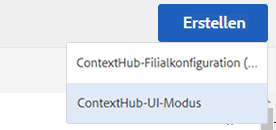
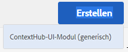
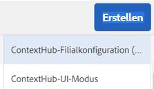

# Konfigurieren von ContextHub   {#configuring-contexthub}

ContextHub ist ein Framework zum Speichern, Ändern und Darstellen von Kontextdaten. Ausführlichere Informationen zu ContextHub finden Sie in der [Entwicklerdokumentation](/help/sites-developing/contexthub.md). ContextHub ersetzt [ClientContext](/help/sites-administering/client-context.md) auf der Touch-Benutzeroberfläche.

Konfigurieren Sie die [ContextHub](/help/sites-developing/contexthub.md)-Symbolleiste, um zu steuern, ob sie im Vorschaumodus angezeigt wird, um ContextHub-Stores zu erstellen und um über die Touch-optimierte Benutzeroberfläche UI-Module hinzuzufügen.

## Deaktivieren von ContextHub {#disabling-contexthub}

Standardmäßig ist ContextHub in einer AEM-Installation aktiviert. ContextHub kann deaktiviert werden, um das Laden von JS/CSS-Code und die Initialisierung zu verhindern. Sie haben zwei Optionen, um ContextHub zu deaktivieren:

* Bearbeiten Sie die Konfiguration von ContextHub und aktivieren Sie die Option **ContextHub deaktivieren**.

   1. Klicken oder tippen Sie in der Leiste auf **Tools > Sites > ContextHub**.
   1. Klicken oder tippen Sie auf den standardmäßigen **Konfigurations-Container**.
   1. Wählen Sie die **ContextHub-Konfiguration** aus und klicken oder tippen Sie auf **Ausgewähltes Element bearbeiten**.
   1. Klicken oder tippen Sie auf **ContextHub deaktivieren** und dann auf **Speichern**.

oder

* Verwenden Sie CRXDE Lite, um die Eigenschaft `disabled` unter `/libs/settings/cloudsettings` auf **true** festzulegen.

>[!NOTE]
>
>[Aufgrund der Repository-Umstrukturierung in AEM 6.4 wurde ](/help/sites-deploying/repository-restructuring.md) der Speicherort von ContextHub-Konfigurationen von  `/etc/cloudsettings` zu:
>
> * `/libs/settings/cloudsettings`
> * `/conf/global/settings/cloudsettings`
> * `/conf/<tenant>/settings/cloudsettings`


## Ein- und Ausblenden der ContextHub-Benutzeroberfläche {#showing-and-hiding-the-contexthub-ui}

Konfigurieren Sie den Adobe Granite ContextHub-OSGi-Service, um die [ContextHub-Benutzeroberfläche](/help/sites-authoring/ch-previewing.md) auf Ihren Seiten ein- oder auszublenden. Die PID dieses Service lautet `com.adobe.granite.contexthub.impl.ContextHubImpl.`.

Der Service kann entweder mithilfe der [Web-Konsole](/help/sites-deploying/configuring-osgi.md#osgi-configuration-with-the-web-console)[ oder mit einem JCR-Knoten im Repository konfiguriert werden](/help/sites-deploying/configuring-osgi.md#osgi-configuration-in-the-repository):

* **Web-Konsole:** Aktivieren Sie die Eigenschaft „Show UI“, um die Benutzeroberfläche anzuzeigen. Verwenden Sie die Eigenschaft „Hide UI“, um die Benutzeroberfläche auszublenden.
* **JCR-Knoten:** Legen Sie die boolesche Eigenschaft `com.adobe.granite.contexthub.show_ui` auf `true` fest, um die Benutzeroberfläche anzuzeigen. Legen Sie die Eigenschaft auf `false` fest, um die Benutzeroberfläche auszublenden.

Wenn die ContextHub-Benutzeroberfläche angezeigt wird, erscheint sie nur auf den Seiten von AEM-Autoreninstanzen. Auf Seiten von Veröffentlichungsinstanzen wird die Benutzeroberfläche nicht angezeigt.

## Hinzufügen von ContextHub-UI-Modi und -Modulen   {#adding-contexthub-ui-modes-and-modules}

Konfigurieren Sie die UI-Modi und -Module, die auf der ContextHub-Symbolleiste im Vorschaumodus angezeigt werden:

* UI-Modi: Gruppen mit verwandten Modulen
* Module: Widgets, die Kontextdaten eines Stores verfügbar machen und Autoren die Änderung des Kontexts ermöglichen

UI-Modi werden als Symbole auf der linken Seite der Symbolleiste angezeigt. Wenn die Option ausgewählt ist, erscheinen die Module eines UI-Modus auf der rechten Seite.


Bei Symbolen handelt es sich um Verweise aus der [Coral-Bibliothek mit Benutzeroberflächensymbolen](https://helpx.adobe.com/de/experience-manager/6-4/sites/developing/using/reference-materials/coral-ui/coralui3/Coral.Icon.html#availableIcons).

### Hinzufügen eines UI-Modus   {#adding-a-ui-mode}

Fügen Sie einer Gruppe mit verwandten ContextHub-Modulen einen UI-Modus hinzu. Beim Erstellen des UI-Modus geben Sie den Titel und das Symbol an, der bzw. das in der ContextHub-Symbolleiste angezeigt werden soll.

1. Klicken oder tippen Sie auf der Experience Manager-Leiste auf „Tools“ > „Sites“ > „ContextHub“.
1. Klicken oder tippen Sie auf den standardmäßigen Konfigurations-Container.
1. Klicken oder tippen Sie auf die ContextHub-Konfiguration.
1. Klicken oder tippen Sie auf die Schaltfläche „Erstellen“ und dann auf „ContextHub-UI-Modus“.

   

1. Geben Sie Werte für die folgenden Eigenschaften an:

   * UI-Modustitel: Der Titel, mit dem der UI-Modus identifiziert wird.
   * Modussymbol: Die Auswahl für das zu verwendende [Coral-UI-Symbol](https://helpx.adobe.com/experience-manager/6-4/sites/developing/using/reference-materials/coral-ui/coralui3/Coral.Icon.html#availableIcons), z. B. `coral-Icon--user`.
   * Aktiviert: Wählen Sie diese Option aus, um den UI-Modus in der ContextHub-Symbolleiste anzuzeigen.

1. Klicken oder tippen Sie auf „Speichern“.

### Hinzufügen eines UI-Moduls   {#adding-a-ui-module}

Fügen Sie ein ContextHub-UI-Modul einem UI-Modus hinzu, damit es in der ContextHub-Symbolleiste zum Einblenden einer Vorschau für Seiteninhalte angezeigt wird. Beim Hinzufügen eines UI-Moduls erstellen Sie eine Instanz eines Modultyps, der für ContextHub registriert ist. Sie müssen den Namen des zugeordneten Modultyps kennen, um ein UI-Modul hinzufügen zu können.

AEM stellt einen grundlegenden UI-Modultyp und mehrere Beispiele für UI-Modultypen bereit, die Sie als Basis für ein UI-Modul verwenden können. Die folgende Tabelle enthält eine kurze Beschreibung der einzelnen Modultypen. Weitere Informationen zum Entwickeln eines benutzerdefinierten UI-Moduls finden Sie unter [Erstellen von ContextHub-UI-Modulen](/help/sites-developing/ch-extend.md#creating-contexthub-ui-module-types).

Die Eigenschaften von UI-Modulen enthalten eine Detailkonfiguration, in der Sie Werte für modulspezifische Eigenschaften angeben können. Sie stellen die Detailkonfiguration im JSON-Format bereit. Die Spalte „Modultyp“ in der Tabelle enthält Links zu Informationen zum JSON-Code, der für die einzelnen UI-Modultypen erforderlich ist.

| Modultyp | Beschreibung | Store |
|---|---|---|
| [contexthub.base](/help/sites-developing/ch-samplemodules.md#contexthub-base-ui-module-type) | Ein generischer UI-Modultyp | In den Eigenschaften des UI-Modusl konfiguriert |
| [contexthub.browserinfo](/help/sites-developing/ch-samplemodules.md#contexthub-browserinfo-ui-module-type) | Zeigt Informationen zum Browser an | surferinfo |
| [contexthub.datetime](/help/sites-developing/ch-samplemodules.md#contexthub-datetime-ui-module-type) | Zeigt Informationen zu Datum und Uhrzeit an | datetime |
| [contexthub.device](/help/sites-developing/ch-samplemodules.md#contexthub-device-ui-module-type) | Client-Gerät anzeigen | emulators |
| [contexthub.location](/help/sites-developing/ch-samplemodules.md#contexthub-location-ui-module-type) | Zeigt den Breiten- und Längengrad des Clients sowie den Standort auf einer Karte an. Sie können den Standort ändern. | Geolocation |
| [contexthub.screen-orientation](/help/sites-developing/ch-samplemodules.md#contexthub-screen-orientation-ui-module-type) | Zeigt die Bildschirmausrichtung des Geräts (Querformat oder Hochformat) an | emulators |
| [contexthub.tagcloud](/help/sites-developing/ch-samplemodules.md#contexthub-tagcloud-ui-module-type) | Zeigt Statistiken zu Seiten-Tags an | tagcloud |
| [granite.profile](/help/sites-developing/ch-samplemodules.md#granite-profile-ui-module-type) | Zeigt die Profilinformationen für den aktuellen Benutzer an, einschließlich authorizableID, displayName und familyName. Sie können den Wert von displayName und familyName ändern. | Profil |

1. Klicken oder tippen Sie auf der Experience Manager-Leiste auf „Tools“ > „Sites“ > „ContextHub“.
1. Klicken oder tippen Sie auf den Konfigurations-Container, dem Sie ein UI-Modul hinzufügen möchten.
1. Klicken oder tippen Sie auf die ContextHub-Konfiguration, der Sie das UI-Modul hinzufügen möchten.
1. Klicken oder tippen Sie auf den UI-Modus, dem Sie das UI-Modul hinzufügen.
1. Klicken oder tippen Sie auf die Schaltfläche „Erstellen“ und dann auf „ContextHub-UI-Modul (generisch)“.

   

1. Geben Sie Werte für die folgenden Eigenschaften an:

   * UI-Modultitel: Ein Titel, mit dem das UI-Modul identifiziert wird.
   * Modultyp: Gibt den Modultyp an.
   * Aktiviert: Wählen Sie diese Option aus, um das UI-Modul in der ContextHub-Symbolleiste anzuzeigen.

1. (Optional) Geben Sie ein JSON-Objekt ein, um das UI-Modul zu konfigurieren und so die Standardkonfiguration für den Store außer Kraft zu setzen.
1. Klicken oder tippen Sie auf „Speichern“.

## Erstellen eines ContextHub-Store   {#creating-a-contexthub-store}

Erstellen Sie einen ContextHub-Store, in dem Benutzerdaten dauerhaft gespeichert werden können und bei Bedarf zugänglich sind. ContextHub-Stores basieren auf registrierten Store-Kandidaten. Beim Erstellen des Stores benötigen Sie den Wert von storeType, unter dem der Store-Kandidat registriert wurde. (Siehe [Erstellen von benutzerdefinierten Store-Kandidaten](/help/sites-developing/ch-extend.md#creating-custom-store-candidates).)

### Store-Detailkonfiguration   {#detailed-store-configuration}

Beim Konfigurieren eines Stores können Sie über die Eigenschaft „Detailkonfiguration“ Werte für Store-spezifische Eigenschaften angeben. Der Wert basiert auf dem Parameter `config` der Store-Funktion `init`. Es hängt daher vom Store ab, ob dieser Wert angegeben werden muss und welches Format der Wert haben muss.

Der Wert der Eigenschaft „Detailkonfiguration“ ist ein `config`-Objekt im JSON-Format.

### Beispiele für Store-Kandidaten {#sample-store-candidates}

In AEM werden die folgenden Beispiele für Store-Kandidaten bereitgestellt, die Sie als Basis für einen Store verwenden können.

| Filialtyp | Beschreibung |
|---|---|
| [aem.segmentation](/help/sites-developing/ch-samplestores.md#aem-segmentation-sample-store-candidate) | Store für gelöste und ungelöste ContextHub-Segmente. Ruft automatisch Segmente aus dem ContextHub SegmentManager zurück |
| [aem.resolvedsegments](/help/sites-developing/ch-samplestores.md#aem-resolvedsegments-sample-store-candidate) | Speichert die aktuell gelösten Segmente. Hört auf den ContextHub SegmentManager-Dienst automatisch, um den Store automatisch zu aktualisieren |
| [contexthub.geolocation](/help/sites-developing/ch-samplestores.md#contexthub-geolocation-sample-store-candidate) | Speichert den Breiten- und Längengrad des Browser-Standorts. |
| [contexthub.datetime](/help/sites-developing/ch-samplestores.md#contexthub-datetime-sample-store-candidate) | Speichert das aktuelle Datum, die aktuelle Uhrzeit und die aktuelle Saison für den Browser-Standort |
| [granite.emulators](/help/sites-developing/ch-samplestores.md#granite-emulators-sample-store-candidate) | Definiert Eigenschaften und Funktionen für eine Reihe von Geräten und erkennt das aktuelle Client-Gerät. |
| [contexthub.generic-jsonp](/help/sites-developing/ch-samplestores.md#contexthub-generic-jsonp-sample-store-candidate) | Ruft Daten von einem JSONP-Dienst ab und speichert sie |
| [granite.profile](/help/sites-developing/ch-samplestores.md#granite-profile-sample-store-candidate) | Speichert die Profildaten für den aktuellen Benutzer. |
| [contexthub.surferinfo](/help/sites-developing/ch-samplestores.md#contexthub-surferinfo-sample-store-candidate) | Speichert die Informationen zum Client, z. B. Geräteinformationen, Browser-Typ und Fensterausrichtung. |
| [contexthub.tagcloud](/help/sites-developing/ch-samplestores.md#contexthub-tagcloud-sample-data-store) | Speichert Seiten-Tags und Tag-Zählungen |

1. Klicken oder tippen Sie auf der Experience Manager-Leiste auf „Tools“ > „Sites“ > „ContextHub“.
1. Klicken oder tippen Sie auf den standardmäßigen Konfigurations-Container.
1. Klicken oder tippen Sie auf „ContextHub-Konfiguration“.
1. Klicken oder tippen Sie zum Hinzufügen eines Stores auf das Symbol „Erstellen“ und dann auf „ContextHub-Store-Konfiguration“.

   

1. Geben Sie Werte für die grundlegenden Konfigurationseigenschaften an und klicken oder tippen Sie dann auf „Weiter“:

   * **Konfigurationstitel:** Der Titel, mit dem der Store identifiziert wird.
   * **Filialtyp:** Der Wert der Eigenschaft storeType des Store-Kandidaten, auf dem der Store basiert.
   * **Erforderlich:** Wählen Sie diese Option aus.
   * **Aktiviert:** Wählen Sie diese Option aus, um den Store zu aktivieren.

1. (Optional) Geben Sie im Feld „Detailkonfiguration (JSON)“ ein JSON-Objekt ein, um die Standardkonfiguration für den Store außer Kraft zu setzen.
1. Klicken oder tippen Sie auf „Speichern“.

## Beispiel: Verwenden eines JSONP-Service    {#example-using-a-jsonp-service}

In diesem Beispiel wird veranschaulicht, wie Sie einen Store konfigurieren und die Daten in einem UI-Modul anzeigen. In diesem Beispiel wird der MD5-Service der Website „jsontest.com“ als Datenquelle für einen Store verwendet. Der Service gibt den MD5-Hashcode einer bestimmten Zeichenfolge im JSON-Format zurück.

Der Store „contexthub.generic-jsonp“ wird so konfiguriert, dass Daten für den Service-Aufruf `https://md5.jsontest.com/?text=%22text%20to%20md5%22` gespeichert werden. Der Service gibt die folgenden Daten zurück, die in einem UI-Modul angezeigt werden:

```xml
{
   "md5": "919a56ab62b6d5e1219fe1d95248a2c5",
   "original": "\"text to md5\""
}
```

### Erstellen des Stores „contexthub.generic-jsonp“   {#creating-a-contexthub-generic-jsonp-store}

Mit dem Store-Beispielkandidaten „contexthub.generic-jsonp“ können Sie Daten aus einem JSONP-Dienst oder einem Webdienst abrufen, der JSON-Daten zurückgibt. Verwenden Sie für diesen Store-Kandidaten die Store-Konfiguration, um Details zu dem JSONP-Service anzugeben, der genutzt werden soll.

Mit der Funktion [init](/help/sites-developing/contexthub-api.md#init-name-config) der JavaScript-Klasse `ContextHub.Store.JSONPStore` wird ein `config`-Objekt definiert, das diesen Store-Kandidaten initialisiert. Das `config`-Objekt enthält ein `service`-Objekt mit Details zum JSONP-Service. Zum Konfigurieren des Stores geben Sie das `service`-Objekt im JSON-Format als Wert für die Eigenschaft „Detailkonfiguration“ an.

Verwenden Sie zum Speichern von Daten aus dem MD5-Service der Website „jsontest.com“ das Verfahren unter [Erstellen eines ContextHub-Store](/help/sites-developing/ch-configuring.md#creating-a-contexthub-store) mit den folgenden Eigenschaften:

* **Konfigurationstitel:** md5
* **Store-Typ:** contexthub.generic-jsonp
* **Erforderlich:** Wählen Sie diese Option aus.
* **Aktiviert:** Wählen Sie diese Option aus.
* **Detailkonfiguration (JSON):**

   ```xml
   {
    "service": {
    "jsonp": false,
    "timeout": 1000,
    "ttl": 1800000,
    "secure": false,
    "host": "md5.jsontest.com",
    "port": 80,
    "params":{
    "text":"text to md5"
        }
      }
    }
   ```

### Hinzufügen eines UI-Moduls für die md5-Daten {#adding-a-ui-module-for-the-md-data}

Fügen Sie der ContextHub-Symbolleiste ein UI-Modul hinzu, um die Daten anzuzeigen, die im md5-Beispiel-Store gespeichert sind. In diesem Beispiel wird das Modul „contexthub.base“ verwendet, um das folgende UI-Modul zu erstellen:


Verwenden Sie das Verfahren unter [Hinzufügen eines UI-Moduls](#adding-a-ui-module), um das UI-Modul einem vorhandenen UI-Modus hinzuzufügen, z. B. dem Perona-UI-Beispielmodus. Verwenden Sie für das UI-Modul die folgenden Eigenschaftswerte:

* **UI-Modultitel:** MD5
* **Modultyp:** contexthub.base
* **Detailkonfiguration (JSON):**

   ```xml
   {
    "icon": "coral-Icon--data",
    "title": "MD5 Converstion",
    "storeMapping": { "md5": "md5" },
    "template": "<p> {{md5.original}}</p>;
                 <p>{{md5.md5}}</p>"
   }
   ```

## Debuggen von ContextHub {#debugging-contexthub}

Ein Debugmodus für ContextHub kann aktiviert werden, um die Fehlerbehebung zuzulassen. Der Debugmodus kann entweder über die ContextHub-Konfiguration oder per CRXDE aktiviert werden.

### Per Konfiguration   {#via-the-configuration}

Bearbeiten Sie die Konfiguration von ContextHub und aktivieren Sie die Option **Debuggen**.

1. Klicken oder tippen Sie in der Leiste auf **Tools > Sites > ContextHub**.
1. Klicken oder tippen Sie auf den standardmäßigen **Konfigurations-Container**.
1. Wählen Sie die **ContextHub-Konfiguration** aus und klicken oder tippen Sie auf **Ausgewähltes Element bearbeiten**.
1. Klicken oder tippen Sie auf **Debuggen** und dann auf **Speichern**.

### Per CRXDE {#via-crxde}

Verwenden Sie CRXDE Lite, um die Eigenschaft `debug` unter auf **true** festzulegen:

* `/conf/global/settings/cloudsettings` oder
* `/conf/<tenant>/settings/cloudsettings`

>[!NOTE]
>
>Für ContextHub-Konfigurationen, die sich noch unter ihren alten Pfaden befinden, lautet der Speicherort für `debug property` `/libs/settings/cloudsettings/legacy/contexthub` .

### Unbeaufsichtigter Modus {#silent-mode}

Im unbeaufsichtigten Modus werden alle Debug-Informationen unterdrückt. Im Gegensatz zur normalen Debug-Option, die für jede ContextHub-Konfiguration einzeln festgelegt werden kann, ist der unbeaufsichtigte Modus eine globale Einstellung, die Vorrang vor allen Debug-Einstellungen auf der Ebene der ContextHub-Konfiguration hat.

Dies ist für Ihre Veröffentlichungsinstanz hilfreich, für die Sie keine Debug-Informationen benötigen. Da es sich um eine globale Einstellung handelt, wird sie per OSGi aktiviert.

1. Öffnen Sie die **Konfiguration der Adobe Experience Manager-Web-Konsole** unter `http://<host>:<port>/system/console/configMgr`.
1. Suchen Sie nach **Adobe Granite ContextHub**.
1. Klicken Sie auf die Konfiguration **Adobe Granite ContextHub**, um die Eigenschaften zu bearbeiten.
1. Aktivieren Sie die Option für den **unbeaufsichtigten Modus** (Silent Mode) und klicken Sie auf **Speichern**.

## Wiederherstellen von ContextHub-Konfigurationen nach einem Upgrade  {#recovering-contexthub-configurations-after-upgrading}

Wenn ein [Upgrade für AEM](/help/sites-deploying/upgrade.md) durchgeführt wird, werden die ContextHub-Konfigurationen gesichert und an einem sicheren Ort gespeichert. Während des Upgrades werden die ContextHub-Standardkonfigurationen installiert, um die vorhandenen Konfigurationen zu ersetzen. Die Sicherung ist erforderlich, um alle von Ihnen vorgenommenen Änderungen oder Hinzufügungen beizubehalten.

ContextHub-Konfigurationen werden in einem Ordner mit dem Namen `contexthub` unter den folgenden Knoten gespeichert:

* `/conf/global/settings/cloudsettings`
* `/conf/<tenant>/settings/cloudsettings`

Nach einem Upgrade wird die Sicherung in einem Ordner mit dem Namen `contexthub` unter einem Knoten mit dem Namen gespeichert:

`/conf/global/settings/cloudsettings/default-pre-upgrade_yyyymmdd_xxxxxxx` oder
`/conf/<tenant>/settings/cloudsettings/default-pre-upgrade_yyyymmdd_xxxxxxx`

Der `yyyymmdd`-Teil des Knotennamens ist das Datum, an dem die Aktualisierung durchgeführt wurde.

Um Ihre ContextHub-Konfigurationen wiederherzustellen, kopieren Sie mithilfe der CRXDE Lite die Knoten, die Ihre Stores, Benutzeroberflächenmodi und Benutzeroberflächenmodule darstellen, von unterhalb des Knotens `default-pre-upgrade_yyyymmdd_xxxxxx` nach unten:

* `/conf/global/settings/cloudsettings` oder
* `/conf/<tenant>/settings/cloudsettings`
