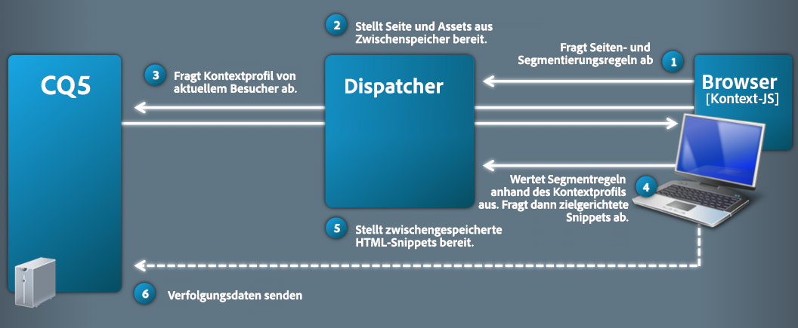
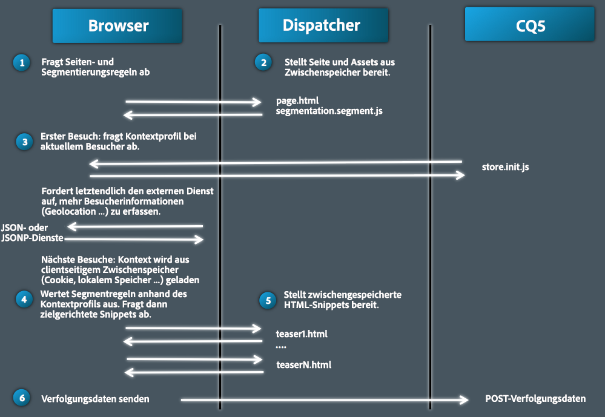
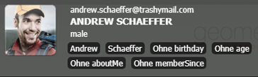
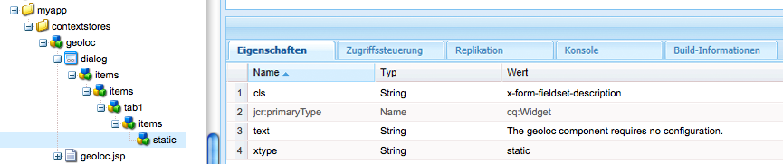
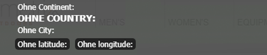

# ClientContext im Detail{#client-context-in-detail}

>[!NOTE]
>
>ClientContext wurde durch ContextHub abgelöst. Weitere Informationen finden Sie in der [entsprechenden Dokumentation](/help/sites-developing/contexthub.md).

ClientContext ist eine dynamische Zusammenstellung von erfassten Benutzerdaten. Nutzen Sie die Daten beispielsweise, um festzulegen, welcher Inhalt in einer bestimmten Situation auf einer Webseite angezeigt wird (Content-Targeting). Sie können die Daten auch für Website-Analysen und JavaScript auf der Seite verwenden.

ClientContext besteht hauptsächlich aus folgenden Elementen:

* Sitzungsspeicher mit den Benutzerdaten
* Benutzeroberfläche, auf der die Benutzerdaten und die Tools für die Simulation des Anwendererlebnisses angezeigt werden
* [JavaScript-API](/help/sites-developing/ccjsapi.md) für die Interaktion mit Sitzungsspeichern

Um einen eigenständigen Sitzungsspeicher zu erstellen und zu ClientContext hinzuzufügen oder einen Sitzungsspeicher zu erstellen, der mit einer Kontextspeicherkomponente verknüpft ist, installiert AEM verschiedene Kontextspeicherkomponenten, die Sie sofort verwenden können. Nutzen Sie diese Komponenten einfach als Grundlage für Ihre eigenen Komponenten.

Informationen zum Öffnen des Client-Kontexts, zum Konfigurieren der angezeigten Informationen und zum Simulieren des Benutzererlebnisses finden Sie unter [Client-Kontext](/help/sites-administering/client-context.md).

## Sitzungsspeicher {#session-stores}

ClientContext umfasst verschiedene Sitzungsspeicher mit Benutzerdaten. Die gespeicherten Daten stammen aus folgenden Quellen:

* Client-Webbrowser
* Server (Informationen zum Speichern von Daten aus den Quellen Dritter finden Sie unter [JSONP-Store](/help/sites-administering/client-context.md#main-pars-variable-8))

Das ClientContext-Framework stellt eine [JavaScript-API](/help/sites-developing/ccjsapi.md) zur Verfügung. Diese ermöglicht die Interaktion mit Sitzungsspeichern hinsichtlich des Lesens und Schreibens von Benutzerdaten und des Überwachens von und Reagierens auf Speicherereignisse. Zudem können Sie Sitzungsspeicher mit Benutzerdaten für Content-Targeting oder andere Zwecke erstellen.

Sitzungsspeicherdaten verbleiben auf dem Client. ClientContext schreibt die Daten nicht wieder auf den Server. Verwenden Sie zum Übermitteln von Daten an den Server ein Formular oder schreiben Sie einen benutzerdefinierten JavaScript-Code.

Jeder Sitzungsspeicher ist eine Sammlung von Paaren aus Eigenschaft und Wert. Der Sitzungsspeicher stellt eine Zusammenstellung verschiedener Daten dar, deren kontextspezifische Bedeutung vom Designer oder Entwickler festgelegt werden kann. Der folgende JavaScript-Beispielcode definiert ein Objekt, das die Profildaten darstellt, die der Sitzungsspeicher unter Umständen enthält:

```
{
  age: 20,
  authorizableId: "aparker@geometrixx.info",
  birthday: "27 Feb 1992",
  email: "aparker@geometrixx.info",
  formattedName: "Alison Parker",
  gender: "female",
  path: "/home/users/geometrixx/aparker@geometrixx.info/profile"
}
```

Ein Sitzungsspeicher kann über mehrere Browsersitzungen hinweg oder nur für die Sitzung, in der er erstellt wurde, beibehalten werden.

>[!NOTE]
>
>Für die Beibehaltung werden entweder Browserspeicher oder Cookies verwendet (das `SessionPersistence`-Cookie). Der Browserspeicher ist hierbei die gängigere Option.
>
>Wenn der Browser geschlossen und erneut geöffnet wird, kann ein Sitzungsspeicher mit den Werten eines beibehaltenen Speichers geladen werden. Um die bisherigen Werte zu entfernen, müssen Sie dann den Browsercache löschen.

### Kontextspeicherkomponenten {#context-store-components}

Kontextspeicherkomponenten sind CQ-Komponenten, die ClientContext hinzugefügt werden können. In der Regel zeigen Kontextspeicherkomponenten Daten aus dem Sitzungsspeicher an, dem sie zugeordnet sind. Die Kontextspeicherkomponenten zeigen jedoch nicht nur Informationen aus dem Sitzungsspeicher an.

Mögliche Elemente von Kontextspeicherkomponenten:

* JSP-Skripte, die die Darstellung in ClientContext definieren
* Eigenschaften für die Auflistung der Komponente im Sidekick
* Bearbeitungsdialogfelder für die Konfiguration der Komponenteninstanzen
* JavaScript für die Initialisierung des Sitzungsspeichers

Eine Beschreibung der installierten Komponenten, die Sie dem Kontextspeicher hinzufügen können, finden Sie unter [Verfügbare Kontextspeicherkomponenten](/help/sites-administering/client-context.md#available-client-context-components).

>[!NOTE]
>
>Die Seitendaten sind keine Standardkomponenten in ClientContext mehr. Sie können sie ggf. hinzufügen, indem Sie ClientContext bearbeiten, die Komponente **Generische Store-Eigenschaften** hinzufügen und dann eine entsprechende Konfiguration durchführen, um den **Store** als `pagedata` zu definieren.

### Gezielte Inhaltsbereitstellung {#targeted-content-delivery}

Profilinformationen werden ebenfalls zur Bereitstellung [zielgerichteter Inhalte ](/help/sites-authoring/content-targeting-touch.md) verwendet.

 

## Hinzufügen von ClientContext zu einer Seite {#adding-client-context-to-a-page}

Fügen Sie die ClientContext-Komponente dem Hauptteil Ihrer Webseiten hinzu, um ClientContext zu aktivieren. Der Pfad des Client Context-Komponentenknotens ist `/libs/cq/personalization/components/clientcontext`. Um die Komponente einzuschließen, fügen Sie den folgenden Code zur JSP-Datei Ihrer Seitenkomponente hinzu, die sich direkt unterhalb des Elements `body` auf Ihrer Seite befindet:

```java
<cq:include path="clientcontext" resourceType="cq/personalization/components/clientcontext"/>
```

Durch die ClientContext-Komponente lädt die Seite die Client-Bibliotheken, die ClientContext implementieren:

* Die ClientContext-JavaScript-API
* Das ClientContext-Framework, das Sitzungsspeicher, Ereignisverwaltung usw. unterstützt
* Definierte Segmente
* Die init.js-Skripte, die für jede zu ClientContext hinzugefügte Kontextspeicherkomponente generiert wurden
* (Nur Autoreninstanz) Die ClientContext-Benutzeroberfläche

Die ClientContext-Benutzeroberfläche ist nur auf der Autoreninstanz verfügbar.

## Erweitern von ClientContext {#extending-client-context}

Erstellen Sie für die Erweiterung von ClientContext einen Sitzungsspeicher und zeigen Sie optional die Speicherdaten an:

* Erstellen Sie einen Sitzungsspeicher für die Benutzerdaten, die Sie für das Content-Targeting und die Web-Analysen benötigen.
* Erstellen Sie eine Kontextspeicherkomponente, die es Administratoren ermöglicht, den zugehörigen Sitzungsspeicher zu konfigurieren und Speicherdaten zu Testzwecken in ClientContext anzuzeigen.

>[!NOTE]
>
>Bei der Auswahl (bzw. beim Erstellen) eines `JSONP`-Dienstes für die Bereitstellung der Daten können Sie einfach die `JSONP`-Kontextspeicherkomponente verwenden und dem JSONP-Dienst zuweisen. Dadurch wird der Sitzungsspeicher verwaltet.

### Erstellen eines Sitzungsspeichers  {#creating-a-session-store}

Erstellen Sie einen Sitzungsspeicher für die Daten, die zu ClientContext hinzugefügt oder daraus abgerufen werden sollen. Beim Erstellen eines Sitzungsspeichers gehen Sie für gewöhnlich folgendermaßen vor:

1. Erstellen Sie einen Client-Bibliotheksordner mit dem Eigenschaftswert `categories` für `personalization.stores.kernel`. ClientContext lädt automatisch die Client-Bibliotheken für diese Kategorie.

1. Konfigurieren Sie den Client-Bibliotheksordner so, dass er eine Abhängigkeit vom Client-Bibliotheksordner `personalization.core.kernel` aufweist. Der Client-Bibliotheksordner `personalization.core.kernel` enthält die ClientContext-JavaScript-API.

1. Fügen Sie das JavaScript hinzu, das den Sitzungsspeicher erstellt und initialisiert.

Durch das Hinzufügen des JavaScripts zum Client-Bibliotheksordner personalization.stores.kernel wird der Speicher erstellt, wenn das ClientContext-Framework geladen wird.

>[!NOTE]
>
>Wenn Sie einen Sitzungsspeicher als Teil einer Kontextspeicherkomponente erstellen, können Sie das JavaScript auch in der Komponentendatei init.js.jsp platzieren. In diesem Fall wird der Sitzungsspeicher nur dann erstellt, wenn die Komponente ClientContext hinzugefügt wird.

#### Arten von Sitzungsspeichern  {#types-of-session-stores}

Sitzungsspeicher werden entweder bei einer Browsersitzung erstellt und sind auch während dieser verfügbar oder sie werden im Browserspeicher bzw. in Cookies beibehalten. Die ClientContext-JavaScript-API definiert mehrere Klassen, die beide Arten von Datenspeichern darstellen:

* ` [CQ_Analytics.SessionStore](/help/sites-developing/ccjsapi.md#cq-analytics-sessionstore)`: Diese Objekte befinden sich nur im Seiten-DOM. Die Daten werden erstellt und während der gesamten Lebensdauer der Seite beibehalten.
* ` [CQ_Analytics.PerstistedSessionStore](/help/sites-developing/ccjsapi.md#cq-analytics-persistedsessionstore)`: Diese Objekte befinden sich im Seiten-DOM und werden entweder im Browserspeicher oder in Cookies gespeichert. Die Daten sind seiten- und sitzungsübergreifend verfügbar.

Die API bietet außerdem Erweiterungen dieser Klassen, die auf das Speichern von JSON- oder JSONP-Daten spezialisiert sind:

* Sitzungsobjekte: [CQ_Analytics.JSONStore](/help/sites-developing/ccjsapi.md#cq-analytics-jsonstore) und [CQ_Analytics.JSONPStore](/help/sites-developing/ccjsapi.md#cq-analytics-jsonpstore).

* Permanente Objekte: [CQ_Analytics.PersistedJSONStore](/help/sites-developing/ccjsapi.md#cq-analytics-persistedjsonstore) und [CQ_Analytics.PersistedJSONPStore](/help/sites-developing/ccjsapi.md#cq-analyics-persistedjsonpstore).

#### Erstellen des Sitzungsspeicher-Objekts  {#creating-the-session-store-object}

Das JavaScript Ihres Client-Bibliotheksordners erstellt und initialisiert den Sitzungsspeicher. Der Sitzungsspeicher muss dann mithilfe des Kontextspeicher-Managers registriert werden. Im folgenden Beispiel wird ein [CQ_Analytics.SessionStore](/help/sites-developing/ccjsapi.md#cq-analytics-sessionstore)-Objekt erstellt und registriert.

```
//Create the session store
if (!CQ_Analytics.MyStore) {
    CQ_Analytics.MyStore = new CQ_Analytics.SessionStore();
    CQ_Analytics.MyStore.STOREKEY = "MYSTORE";
    CQ_Analytics.MyStore.STORENAME = "mystore";
    CQ_Analytics.MyStore.data={};
}
//register the session store
if (CQ_Analytics.ClientContextMgr){
    CQ_Analytics.ClientContextMgr.register(CQ_Analytics.MyStore)
}
```

Zum Speichern von JSON-Daten wird im folgenden Beispiel ein [CQ_Analytics.JSONStore](/help/sites-developing/ccjsapi.md#cq-analytics-sessionstore)-Objekt erstellt und registriert.

```
if (!CQ_Analytics.myJSONStore) {
    CQ_Analytics.myJSONStore = CQ_Analytics.JSONStore.registerNewInstance("myjsonstore",{});
}
```

### Erstellen einer Kontextspeicherkomponente {#creating-a-context-store-component}

Erstellen Sie eine Kontextspeicherkomponente zum Rendern von Sitzungsspeicherdaten in ClientContext. Nach dem Erstellen können Sie Ihre Kontextspeicherkomponente in ClientContext ziehen, um Daten aus einem Sitzungsspeicher zu rendern. Kontextspeicherkomponenten bestehen aus folgenden Elementen:

* JSP-Skript zum Rendern der Daten
* Bearbeitungsdialogfeld
* JSP-Skript zum Initialisieren des Sitzungsspeichers
* (Optional) Ein Client-Bibliotheksordner zum Erstellen des Sitzungsspeichers. Der Client-Bibliotheksordner muss nicht enthalten sein, wenn die Komponente auf einen vorhandenen Sitzungsspeicher zurückgreift.

#### Erweitern der bereitgestellten Kontextspeicherkomponenten  {#extending-the-provided-context-store-components}

AEM bietet die erweiterbaren Kontextspeicherkomponenten genericstore und genericstoreproperties. Die Struktur der Speicherdaten bestimmt die Komponente, die erweitert wird:

* Eigenschaft-Wert-Paare: `GenericStoreProperties`-Komponente erweitern. Diese Komponente rendert automatisch die Speicher von Eigenschaft-Wert-Paaren. Einige Interaktionspunkte werden bereitgestellt:

   * `prolog.jsp` und `epilog.jsp`: Komponenteninteraktion, die das Hinzufügen von serverseitiger Logik vor oder nach dem Komponenten-Rendering ermöglicht.

* Komplexe Daten: `GenericStore`-Komponente erweitern. Für Ihren Sitzungsspeicher ist eine Rendering-Methode erforderlich, die immer dann abgerufen wird, wenn die Komponente gerendert werden muss. Die Rendering-Funktion wird mit zwei Parametern aufgerufen:

   * `@param {String} store`
Der zu rendernde Store

   * `@param {String} divId` Die ID des div-Elements, in das der Speicher gerendert werden muss

>[!NOTE]
>
>Alle ClientContext-Komponenten sind Erweiterungen der Komponenten „Generischer Store“ oder „Generische Store-Eigenschaften“. Im Ordner `/libs/cq/personalization/components/contextstores` sind verschiedene Beispiele installiert.

#### Konfigurieren der Darstellung im Sidekick {#configuring-the-appearance-in-sidekick}

Beim Bearbeiten von ClientContext werden Kontextspeicherkomponenten im Sidekick angezeigt. Wie bei allen Komponenten bestimmen die Eigenschaften `componentGroup` und `jcr:title` der ClientContext-Komponente Gruppe und Namen der Komponente.

Alle Komponenten mit dem Wert `componentGroup` der Eigenschaft `Client Context` werden standardmäßig im Sidekick angezeigt. Wenn Sie einen anderen Eigenschaftswert für `componentGroup` verwenden, muss die entsprechende Komponente im Designmodus manuell zum Sidekick hinzugefügt werden.

#### Instanzen der Kontextspeicherkomponenten {#context-store-component-instances}

Wenn Sie eine Kontextspeicherkomponente zum Client Context hinzufügen, wird unter `/etc/clientcontext/default/content/jcr:content/stores` ein Knoten erstellt, der die Komponenteninstanz darstellt. Dieser Knoten enthält die Eigenschaftswerte, die im Bearbeitungsdialogfeld der Komponente konfiguriert werden.

Bei der Initialisierung von ClientContext werden diese Knoten verarbeitet.

#### Initialisieren des zugehörigen Sitzungsspeichers  {#initializing-the-associated-session-store}

Fügen Sie Ihrer Komponente eine init.js.jsp-Datei hinzu, um JavaScript-Code zu generieren, der den Sitzungsspeicher für Ihre Kontextspeicherkomponente initialisiert. Verwenden Sie beispielsweise das Initialisierungsskript, um die Konfigurationseigenschaften der Komponente abzurufen und in den Sitzungsspeicher einzuspeisen.

Das generierte JavaScript wird der Seite beim Laden sowohl in der Autoren- als auch in der Veröffentlichungsinstanz hinzugefügt, wenn ClientContext initialisiert wird. Dieses JSP wird ausgeführt, bevor die Instanz der Kontextspeicherkomponente geladen und gerendert wird.

Der Code muss den Mime-Typ der Datei auf `text/javascript` setzen, andernfalls wird er nicht ausgeführt.

>[!CAUTION]
>
>Das init.js.jsp-Skript wird in der Autoren- und in der Veröffentlichungsinstanz ausgeführt, jedoch nur dann, wenn ClientContext die Kontextspeicherkomponente hinzugefügt wird.

Im folgenden Verfahren wird die init.js.jsp-Skriptdatei erstellt und der Code zum Festlegen des korrekten MIME-Typs hinzugefügt. Der Code für die Speicherinitialisierung würde danach folgen.

1. Klicken Sie mit der rechten Maustaste auf den Knoten der Kontextspeicherkomponente und anschließend auf „Erstellen“ > „Datei erstellen“.
1. Geben Sie im Namensfeld `init.js.jsp` ein und klicken Sie dann auf „OK“.
1. Geben Sie oben auf der Seite den folgenden Code ein und klicken Sie dann auf „Alle speichern“.

   ```java
   <%@page contentType="text/javascript" %>
   ```

### Rendern von Sitzungsspeicherdaten für genericstoreproperties-Komponenten  {#rendering-session-store-data-for-genericstoreproperties-components}

Zeigen Sie Sitzungsspeicherdaten in ClientContext in einheitlichem Format an.

#### Anzeigen von Eigenschaftsdaten  {#displaying-property-data}

In der Tag-Bibliothek (taglib) für die Personalisierung steht das Tag `personalization:storePropertyTag` zur Verfügung. Dieses Tag zeigt den Wert einer Eigenschaft aus dem Sitzungsspeicher an. Zur Verwendung des Tags muss folgende Codezeile in der JSP-Datei enthalten sein:

```xml
<%@taglib prefix="personalization" uri="https://www.day.com/taglibs/cq/personalization/1.0" %>
```

Das Tag weist folgendes Format auf:

```xml
<personalization:storePropertyTag propertyName="property_name" store="session_store_name"/>
```

Das Attribut `propertyName` ist die Bezeichnung der Speichereigenschaft, die angezeigt wird. Das Attribut `store` ist der Name des registrierten Speichers. Im folgenden Beispiel-Tag wird der Wert der Eigenschaft `authorizableId` des Speichers `profile` angezeigt:

```xml
<personalization:storePropertyTag propertyName="authorizableId" store="profile"/>
```

#### HTML-Struktur {#html-structure}

Im Client-Bibliotheksordner personalization.ui (/etc/clientlibs/foundation/personalization/ui/themes/default) befinden sich die CSS-Styles, die ClientContext zum Formatieren des HTML-Codes verwendet. Im folgenden Code wird die empfohlene Struktur für die Anzeige von Speicherdaten dargestellt:

```xml
<div class="cq-cc-store">
   <div class="cq-cc-thumbnail">
      <div class="cq-cc-store-property">
           <!-- personalization:storePropertyTag for the store thumbnail image goes here -->
      </div>
   </div>
   <div class="cq-cc-content">
       <div class="cq-cc-store-property cq-cc-store-property-level0">
           <!-- personalization:storePropertyTag for a store property goes here -->
       </div>
       <div class="cq-cc-store-property cq-cc-store-property-level1">
           <!-- personalization:storePropertyTag for a store property goes here -->
       </div>
       <div class="cq-cc-store-property cq-cc-store-property-level2">
           <!-- personalization:storePropertyTag for a store property goes here -->
       </div>
       <div class="cq-cc-store-property cq-cc-store-property-level3">
           <!-- personalization:storePropertyTag for a store property goes here -->
       </div>
   </div>
   <div class="cq-cc-clear"></div>
</div>
```

Die Kontextspeicherkomponente `/libs/cq/personalization/components/contextstores/profiledata` verwendet diese Struktur, um Daten aus dem Profil-Sitzungsspeicher anzuzeigen. Die Klasse `cq-cc-thumbnail` platziert das Miniaturbild. Die `cq-cc-store-property-level*x*`-Klassen formatieren die alphanumerischen Daten:

* „level0“, „level1“ und „level2“ werden vertikal verteilt und weiß geschrieben.
* „level3“ und alle weiteren Ebenen werden horizontal verteilt und verwenden weiße Schrift mit dunklerem Hintergrund.



### Rendern von Sitzungsspeicherdaten für genericstore-Komponenten {#rendering-session-store-data-for-genericstore-components}

Um Speicherdaten mithilfe einer genericstore-Komponente zu rendern, müssen Sie:

* hinzufügen Sie das Tag personalization:storeRendererTag an das JSP-Skript der Komponente, um den Namen des Sitzungsspeichers zu identifizieren.
* eine Rendering-Methode für die Sitzungsspeicherklasse implementieren.

#### Bestimmen des genericstore-Sitzungsspeichers  {#identifying-the-genericstore-session-store}

In der Tag-Bibliothek (taglib) für die Personalisierung steht das Tag `personalization:storePropertyTag` zur Verfügung. Dieses Tag zeigt den Wert einer Eigenschaft aus dem Sitzungsspeicher an. Zur Verwendung des Tags muss folgende Codezeile in der JSP-Datei enthalten sein:

```xml
<%@taglib prefix="personalization" uri="https://www.day.com/taglibs/cq/personalization/1.0" %>
```

Das Tag weist folgendes Format auf:

```java
<personalization:storeRendererTag store="store_name"/>
```

#### Implementieren der Rendering-Methode für den Sitzungsspeicher  {#implementing-the-session-store-renderer-method}

Für Ihren Sitzungsspeicher ist eine Rendering-Methode erforderlich, die immer dann abgerufen wird, wenn die Komponente gerendert werden muss. Die Rendering-Funktion wird mit zwei Parametern aufgerufen:

* @param {String} store Der zu rendernde Speicher
* @param {String} divId Die ID des div-Elements, in das der Speicher gerendert werden muss

## Interagieren mit Sitzungsspeichern {#interacting-with-session-stores}

Interagieren Sie über JavaScript mit den Sitzungsspeichern.

### Zugreifen auf Sitzungsspeicher  {#accessing-session-stores}

Rufen Sie ein Sitzungsspeicherobjekt ab, um Daten im Sitzungsspeicher zu lesen oder darauf zu schreiben. [CQ_Analytics.ClientContextMgr](/help/sites-developing/ccjsapi.md#cq-analytics-clientcontextmgr) bietet basierend auf den Speichernamen Speicherzugriff. Sobald Sie Zugriff haben, verwenden Sie die Methode [CQ_Analytics.SessionStore](/help/sites-developing/ccjsapi.md#cq-analytics-sessionstore) oder [CQ_Analytics.PersistedSessionStore](/help/sites-developing/ccjsapi.md#cq-analytics-persistedsessionstore) für die Interaktion mit den Speicherdaten.

Im folgenden Beispiel wird der Speicher `profile` und anschließend die Eigenschaft `formattedName` daraus abgerufen.

```
function getName(){
   var profilestore = CQ_Analytics.ClientContextMgr.getRegisteredStore("profile");
   if(profilestore){
      return profilestore.getProperty("formattedName", false);
   } else {
      return null;
   }
}
```

### Erstellen eines Listeners für die Reaktion auf Aktualisierungen des Sitzungsspeichers {#creating-a-listener-to-react-to-a-session-store-update}

Sitzungsspeicher lösen Ereignisse aus. Daher können Sie Listener hinzufügen und basierend auf diesen Ereignissen Reaktionen triggern.

Die Session Stores basieren auf dem `Observable` Muster. Sie erweitern [ `CQ_Analytics.Observable`](/help/sites-developing/ccjsapi.md#cq-analytics-observable), was die ` [addListener](/help/sites-developing/ccjsapi.md#addlistener-event-fct-scope)`-Methode bereitstellt.

Im folgenden Beispiel wird dem Ereignis `update` ein Listener des Sitzungsspeichers `profile` hinzugefügt.

```
var profileStore = ClientContextMgr.getRegisteredStore("profile");
if( profileStore ) {
  //callback execution context
  var executionContext = this;

  //add "update" event listener to store
  profileStore.addListener("update",function(store, property) {
    //do something on store update

  },executionContext);
}
```

### Überprüfen der Definition und Initialisierung eines Sitzungsspeichers {#checking-that-a-session-store-is-defined-and-initialized}

Sitzungsspeicher sind erst dann verfügbar, wenn sie geladen und mit Daten initialisiert werden. Folgende Faktoren können sich auf den zeitlichen Ablauf der Verfügbarkeit des Sitzungsspeichers auswirken:

* Laden der Seite
* Laden des JavaScripts
* Ausführungsdauer des JavaScripts
* Reaktionszeiten auf XHR-Anfragen
* Dynamische Änderungen am Sitzungsspeicher

Über die [CQ_Analytics.ClientContextUtils](/help/sites-developing/ccjsapi.md#cq-analytics-clientcontextutils)-Methoden [onStoreRegistered](/help/sites-developing/ccjsapi.md#onstoreregistered-storename-callback) und [onStoreInitialized](/help/sites-developing/ccjsapi.md#onstoreinitialized-storename-callback-delay) für Objekte greifen Sie nur auf Sitzungsspeicher zu, wenn diese verfügbar sind. Mit diesen Methoden können Sie Ereignis-Listener hinzufügen, die auf Sitzungsregistrierungen und Initialisierungsereignisse reagieren.

>[!CAUTION]
>
>Wenn Sie einen anderen Speicher verwenden, müssen Sie sich auch auf den Fall einrichten, dass der Speicher nie registriert wird.

Im folgenden Beispiel wird das Ereignis `onStoreRegistered` des Sitzungsspeichers `profile` verwendet. Wenn der Speicher registriert ist, wird dem Ereignis `update` des Sitzungsspeichers ein Listener hinzugefügt. Wenn der Store aktualisiert wird, wird der Inhalt des `<div class="welcome">`-Elements auf der Seite mit dem Namen aus dem `profile`-Store aktualisiert.

```
//listen for the store registration
CQ_Analytics.ClientContextUtils.onStoreRegistered("profile", listen);

//listen for the store's update event
function listen(){
 var profilestore = CQ_Analytics.ClientContextMgr.getRegisteredStore("profile");
    profilestore.addListener("update",insertName);
}

//insert the welcome message
function insertName(){
 $("div.welcome").text("Welcome "+getName());
}

//obtain the name from the profile store
function getName(){
 var profilestore = CQ_Analytics.ClientContextMgr.getRegisteredStore("profile");
 if(profilestore){
  return profilestore.getProperty("formattedName", false);
    } else {
        return null;
    }
}
```

### Ausschließen einer Eigenschaft aus dem sessionpersistence-Cookie {#excluding-a-property-from-the-sessionpersistence-cookie}

Um zu verhindern, dass eine Eigenschaft eines `PersistedSessionStore` beibehalten wird (d. h. um sie aus dem Cookie `sessionpersistence` auszuschließen), fügen Sie die Eigenschaft der Liste der nicht permanenten Eigenschaften des permanenten Sitzungsspeichers hinzu.

Siehe ` [CQ_Analytics.PersistedSessionStore.setNonPersisted(propertyName)](/help/sites-developing/ccjsapi.md#setnonpersisted-name)`

```
CQ_Analytics.ClientContextUtils.onStoreRegistered("surferinfo", function(store) {
  //this will exclude the browser, OS and resolution properties of the surferinfo session store from the
  store.setNonPersisted("browser");
  store.setNonPersisted("OS");
  store.setNonPersisted("resolution");
});
```

## Konfigurieren des Gerätereglers {#configuring-the-device-slider}

### Bedingungen {#conditions}

Für die aktuelle Seite ist eine entsprechende Mobilversion erforderlich. Dafür muss für die Seite eine mit einer mobilen Rollout-Konfiguration eingerichtete Live Copy verfügbar sein (`rolloutconfig.path.toLowerCase` enthält `mobile`).

#### Konfiguration {#configuration}

Beim Wechseln von der Desktopseite zur mobilen Ansicht:

* Das DOM der mobilen Seite wird geladen.
* Das `div`-Hauptelement (erforderlich) mit dem Inhalt wird extrahiert und in die aktuelle Desktopseite eingefügt.

* Die CSS- und Hauptteilklasse, die geladen werden müssen, müssen manuell konfiguriert werden.

Beispiel:

```
window.CQMobileSlider["geometrixx-outdoors"] = {
  //CSS used by desktop that need to be removed when mobile
  DESKTOP_CSS: [
    "/etc/designs/${app}/clientlibs_desktop_v1.css"
  ],

  //CSS used by mobile that need to be removed when desktop
  MOBILE_CSS: [
    "/etc/designs/${app}/clientlibs_mobile_v1.css"
  ],

  //id of the content that needs to be removed when mobile
  DESKTOP_MAIN_ID: "main",

  //id of the content that needs to be removed when desktop
  MOBILE_MAIN_ID: "main",

  //body classes used by desktop that need to be removed when mobile
  DESKTOP_BODY_CLASS: [
    "page"
  ],

  //body classes used by mobile that need to be removed when desktop
  MOBILE_BODY_CLASS: [
    "page-mobile"
  ]
};
```

## Beispiel: Erstellen einer benutzerdefinierten Kontextspeicherkomponente {#example-creating-a-custom-context-store-component}

In diesem Beispiel erstellen Sie eine Kontextspeicherkomponente, die Daten aus einem externen Dienst abruft und im Sitzungsspeicher speichert:

* Erweitert die genericstoreproperties-Komponente
* Initialisiert einen Speicher mithilfe des JavaScript-Objekts CQ_Analytics.JSONPStore
* Ruft über einen JSONP-Dienst Daten ab und speist diese in den Speicher ein
* Rendert die Daten in ClientContext

### Hinzufügen der geoloc-Komponente  {#add-the-geoloc-component}

Erstellen Sie eine CQ-Anwendung und fügen Sie die geoloc-Komponente hinzu.

1. Öffnen Sie die CRXDE Lite in Ihrem Webbrowser ([https://localhost:4502/crx/de](https://localhost:4502/crx/de)).
1. Klicken Sie mit der rechten Maustaste auf den Ordner `/apps` und klicken Sie auf Erstellen > Ordner erstellen. Geben Sie für `myapp` einen Namen ein und klicken Sie auf „OK“.
1. Erstellen Sie auf ähnliche Weise unter `myapp` einen Ordner mit dem Namen `contextstores`. &quot;
1. Klicken Sie mit der rechten Maustaste auf den Ordner `/apps/myapp/contextstores` und klicken Sie auf Erstellen > Komponente erstellen. Geben Sie folgende Eigenschaftswerte an und klicken Sie auf „Weiter“:

   * Bezeichnung: geoloc
   * Titel: Standortspeicher
   * Super Type: cq/personalization/components/contextstore/genericstoreproperties
   * Gruppe: ClientContext

1. Klicken Sie auf jeder Seite im Dialogfeld „Komponente erstellen“ auf „Weiter“ und betätigen Sie die Schaltfläche „OK“, sobald diese aktiviert ist. 
1. Klicken Sie auf „Alle speichern“.

### Erstellen des Dialogfelds zur geoloc-Bearbeitung  {#create-the-geoloc-edit-dialog}

Für die Kontextspeicherkomponente ist ein Bearbeitungsdialogfeld erforderlich. Das Dialogfeld zur geoloc-Bearbeitung enthält die statische Meldung, dass keine Eigenschaften zur Konfiguration verfügbar sind.

1. Klicken Sie mit der rechten Maustaste auf den Knoten `/libs/cq/personalization/components/contextstores/genericstoreproperties/dialog` und klicken Sie auf Kopieren.
1. Klicken Sie mit der rechten Maustaste auf den Knoten `/apps/myapp/contextstores/geoloc` und klicken Sie auf Einfügen.
1. Löschen Sie alle untergeordneten Knoten unter dem Knoten /apps/myapp/contextstore/geoloc/dialog/items/items/tab1/items:

   * store
   * properties
   * thumbnail

1. Klicken Sie mit der rechten Maustaste auf den Knoten `/apps/myapp/contextstores/geoloc/dialog/items/items/tab1/items` und klicken Sie auf Erstellen > Knoten erstellen. Geben Sie folgende Eigenschaftswerte an und klicken Sie auf „OK“:

   * Name: Statisch
   * Typ: cq:Widget

1. Fügen Sie dem Knoten  folgende Eigenschaften hinzu:

   | Name | Typ | Wert |
   |---|---|---|
   | cls | Zeichenfolge | x-form-fieldset-description |
   | text | Zeichenfolge | Die geologische Komponente erfordert keine Konfiguration. |
   | xtype | Zeichenfolge | static |

1. Klicken Sie auf Alle speichern.

   

### Erstellen des Initialisierungsskripts {#create-the-initialization-script}

Fügen Sie der geoloc-Komponente eine init.js.jsp-Datei hinzu und erstellen Sie damit den Sitzungsspeicher. Rufen Sie die Standortinformationen ab und speisen Sie diese in den Speicher ein.

Die init.js.jsp-Datei wird ausgeführt, wenn ClientContext von der Seite geladen wird. Zu diesem Zeitpunkt ist die ClientContext-JavaScript-API bereits geladen und das Skript kann sie verwenden.

1. Klicken Sie mit der rechten Maustaste auf den Knoten /apps/myapp/contextstore/geoloc und klicken Sie auf Erstellen > Datei erstellen. Geben Sie für init.js.jsp einen Namen ein und klicken Sie auf „OK“.
1. Fügen Sie oben auf der Seite folgenden Code ein und klicken Sie dann auf „Alle speichern“.

   ```java
   <%@page contentType="text/javascript;charset=utf-8" %><%
   %><%@include file="/libs/foundation/global.jsp"%><%
   log.info("***** initializing geolocstore ****");
   String store = "locstore";
   String jsonpurl = "https://api.wipmania.com/jsonp?callback=${callback}";
   
   %>
   var locstore = CQ_Analytics.StoreRegistry.getStore("<%= store %>");
   if(!locstore){
    locstore = CQ_Analytics.JSONPStore.registerNewInstance("<%= store %>", "<%= jsonpurl %>",{});
   }
   <% log.info(" ***** done initializing geoloc ************"); %>
   ```

### Rendern der geoloc-Sitzungsspeicherdaten  {#render-the-geoloc-session-store-data}

Fügen Sie der JSP-Datei der geoloc-Komponente den Code hinzu, um die Speicherdaten in ClientContext zu rendern.



1. Öffnen Sie in CRXDE Lite die Datei `/apps/myapp/contextstores/geoloc/geoloc.jsp`.
1. Fügen Sie folgenden HTML-Code unterhalb des Stub-Codes ein:

   ```xml
   <%@taglib prefix="personalization" uri="https://www.day.com/taglibs/cq/personalization/1.0" %>
   <div class="cq-cc-store">
      <div class="cq-cc-content">
          <div class="cq-cc-store-property cq-cc-store-property-level0">
              Continent: <personalization:storePropertyTag propertyName="address/continent" store="locstore"/>
          </div>
          <div class="cq-cc-store-property cq-cc-store-property-level1">
              Country: <personalization:storePropertyTag propertyName="address/country" store="locstore"/>
          </div>
          <div class="cq-cc-store-property cq-cc-store-property-level2">
              City: <personalization:storePropertyTag propertyName="address/city" store="locstore"/>
          </div>
          <div class="cq-cc-store-property cq-cc-store-property-level3">
              Latitude: <personalization:storePropertyTag propertyName="latitude" store="locstore"/>
          </div>
          <div class="cq-cc-store-property cq-cc-store-property-level4">
              Longitude: <personalization:storePropertyTag propertyName="longitude" store="locstore"/>
          </div>
      </div>
       <div class="cq-cc-clear"></div>
   </div>
   ```

1. Klicken Sie auf „Alle speichern“.

### Hinzufügen der Komponente zu ClientContext  {#add-the-component-to-client-context}

Fügen Sie ClientContext die Standortspeicher-Komponente hinzu, damit diese beim Laden der Seite initialisiert wird.

1. Öffnen Sie die Startseite Geometrixx Outdoors auf der Autoreninstanz ([https://localhost:4502/content/geometrixx-outdoors/en.html](https://localhost:4502/content/geometrixx-outdoors/en.html)).
1. Klicken Sie auf Strg-Alt-c (Fenster) oder control-option-c (Mac), um den Client-Kontext zu öffnen.
1. Klicken Sie oben in ClientContext auf das Symbol zum Bearbeiten, um den ClientContext-Designer zu öffnen.

   

1. Ziehen Sie die Standortspeicher-Komponente in ClientContext.

### Anzeigen der Standortinformationen in ClientContext  {#see-the-location-information-in-client-context}

Rufen Sie die Geometrixx Outdoors-Homepage im Bearbeitungsmodus auf und öffnen Sie dann ClientContext, um die Daten aus der Standortspeicher-Komponente anzuzeigen.

1. Öffnen Sie die englische Version der Geometrixx Outdoors-Site. ([https://localhost:4502/content/geometrixx-outdoors/en.html](https://localhost:4502/content/geometrixx-outdoors/en.html))
1. Um den Client-Kontext zu öffnen, drücken Sie Strg-Alt-c (Fenster) oder Strg-Option-c (Mac).

## Erstellen eines benutzerdefinierten ClientContext {#creating-a-customized-client-context}

Zum Erstellen eines zweiten ClientContext müssen Sie die Verzweigung duplizieren:

`/etc/clientcontext/default`

* Der Unterordner:
   `/content`
enthält den Inhalt des benutzerdefinierten Clientkontexts.

* Der -Ordner:
   `/contextstores`
ermöglicht Ihnen, verschiedene Konfigurationen für die Kontextspeicher zu definieren.

Bearbeiten Sie die Eigenschaft, um Ihren benutzerdefinierten Clientkontext zu verwenden
`path`
im Designstil der Client-Kontextkomponente, wie in der Seitenvorlage enthalten. Beispiel als Standardspeicherort von:
`/libs/cq/personalization/components/clientcontext/design_dialog/items/path`
