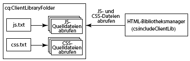

# Verwendung Client-seitiger Bibliotheken{#using-client-side-libraries}

Moderne Websites beruhen in hohem Maße auf der clientseitigen Verarbeitung durch einen komplexen JavaScript- und CSS-Code. Die Organisation und Optimierung der Bereitstellung dieses Codes kann äußerst kompliziert sein.

Um Abhilfe zu schaffen, stellt AEM **clientseitige Bibliotheksordner** zur Verfügung, mit denen Sie Ihren clientseitigen Code im Repository speichern, in Kategorien gruppieren und definieren können, wann und wie jede Codekategorie dem Client bereitgestellt werden soll. Das clientseitige Bibliotheksystem übernimmt dann das Erstellen der korrekten Links in der endgültigen Webseite, um den korrekten Code zu laden.

## Funktionsweise clientseitiger Bibliotheken in AEM  {#how-client-side-libraries-work-in-aem}

Eine clientseitige Bibliothek (d. h. eine JS- oder CSS-Datei) kann standardmäßig in den HTML-Code einer Seite eingefügt werden, indem einfach ein `<script>`- oder `<link>`-Tag in die JSP für diese Seite eingefügt wird, das den Pfad zur betreffenden Datei enthält. Beispiel:

```xml
...
<head>
   ...
   <script type="text/javascript" src="/etc/clientlibs/granite/jquery/source/1.8.1/jquery-1.8.1.js"></script>
   ...
</head>
...
```

Obwohl diese Vorgehensweise in AEM funktioniert, kann sie zu Problemen führen, wenn die Seiten und die darin enthaltenen Komponenten zu komplex werden. Dann besteht die Gefahr, dass mehrere Kopien derselben JS-Bibliothek in der endgültigen HTML-Ausgabe enthalten sind. Um dies zu vermeiden und einen logischen Aufbau clientseitiger Bibliotheken zu ermöglichen, verwendet AEM **clientseitige Bibliotheksordner**.

Ein Client-seitiger Bibliotheksordner ist ein Repository-Knoten des Typs `cq:ClientLibraryFolder`. Seine Definition in [CND-Notation](https://jackrabbit.apache.org/node-type-notation.html) ist

```shell
[cq:ClientLibraryFolder] > sling:Folder
  - dependencies (string) multiple
  - categories (string) multiple
  - embed (string) multiple
  - channels (string) multiple
```

Standardmäßig können `cq:ClientLibraryFolder`-Knoten an einer beliebigen Stelle in den Unterstrukturen `/apps`, `/libs` und `/etc` des Repositorys platziert werden. (Diese Standardeinstellungen und andere Einstellungen können über den Bereich **Adobe Granite HTML Library Manager** der [Systemkonsole](https://localhost:4502/system/console/configMgr) gesteuert werden.)

Jeder `cq:ClientLibraryFolder` wird mit einer Reihe von JS- und/oder CSS-Dateien sowie mehreren unterstützenden Dateien vorab gefüllt (siehe unten). Die Eigenschaften von `cq:ClientLibraryFolder` sind wie folgt konfiguriert:

* `categories`: Gibt die Kategorien der Gruppe von JS- und/oder CSS-Dateien in diesem `cq:ClientLibraryFolder` an. Da die `categories`-Eigenschaft ggf. mehrere Werte aufweist, kann ein Bibliotheksordner zu mehreren Kategorien gehören (weiter unten sehen Sie, warum dies nützlich sein kann).

* `dependencies`: Eine Liste anderer Client-Bibliothekskategorien, von denen dieser Bibliotheksordner abhängt. Beispiel: Wenn bei zwei `cq:ClientLibraryFolder`-Knoten `F` und `G` eine Datei in `F` eine andere Datei in `G` benötigt, muss mindestens eine der `categories` von `G` in den `dependencies` von `F` aufgeführt sein, um eine ordnungsgemäße Funktionsweise sicherzustellen.

* `embed`: Wird zum Einbetten von Code aus anderen Bibliotheken verwendet. Wenn der Knoten F die Knoten G und H einbettet, ist die resultierende HTML eine Zusammenstellung von Inhalten der Knoten G und H.
* `allowProxy`: Wenn sich eine Client-Bibliothek unter befindet, ermöglicht  `/apps`diese Eigenschaft den Zugriff darauf über das Proxy-Servlet. Siehe [Finden eines Client-Bibliotheksordners und Verwendung des Proxy-Servlets für Client-Bibliotheken](/help/sites-developing/clientlibs.md#locating-a-client-library-folder-and-using-the-proxy-client-libraries-servlet) weiter unten.

## Referenzieren von clientseitigen Bibliotheken {#referencing-client-side-libraries}

Da HTL die bevorzugte Technologie zur Entwicklung von AEM Sites ist, sollte HTL verwendet werden, um clientseitige Bibliotheken in AEM einzuschließen. Sie können jedoch auch JSP verwenden.

### Verwendung von HTL  {#using-htl}

In HTL werden Client-Bibliotheken über eine durch AEM bereitgestellte Hilfsvorlage geladen, auf die über [`data-sly-use`](https://helpx.adobe.com/experience-manager/htl/using/block-statements.html#use) zugegriffen werden kann. In dieser Datei sind drei Vorlagen verfügbar, die über [`data-sly-call`](https://helpx.adobe.com/experience-manager/htl/using/block-statements.html#template-call) abgerufen werden können:

* **css**  - Lädt nur die CSS-Dateien der referenzierten Client-Bibliotheken.
* **js**  - Lädt nur die JavaScript-Dateien der referenzierten Client-Bibliotheken.
* **all**  - Lädt alle Dateien der referenzierten Client-Bibliotheken (CSS und JavaScript).

Jede Hilfsvorlage erwartet eine `categories`-Option für das Referenzieren der gewünschten Client-Bibliotheken. Bei dieser Option kann es sich um einen Zeichenfolgenwertbereich handeln oder um eine Zeichenfolge, die eine CSV-Liste enthält.

Weitere Informationen und ein Anwendungsbeispiel finden Sie im Dokument [Erste Schritte mit der HTML-Vorlagensprache](https://helpx.adobe.com/experience-manager/htl/using/getting-started.html#loading-client-libraries).

### Verwendung von JSP {#using-jsp}

Fügen Sie Ihrem JSP-Code ein `ui:includeClientLib`-Tag hinzu, um einen Link zu Client-Bibliotheken auf der generierten HTML-Seite hinzuzufügen. Um auf die Bibliotheken zu verweisen, verwenden Sie den Wert der Eigenschaft `categories` des Knotens `ui:includeClientLib` .

```
<%@taglib prefix="ui" uri="https://www.adobe.com/taglibs/granite/ui/1.0" %>
<ui:includeClientLib categories="<%= categories %>" />
```

Der Knoten `/etc/clientlibs/foundation/jquery` weist beispielsweise den Typ `cq:ClientLibraryFolder` mit der Kategorieeigenschaft mit dem Wert `cq.jquery` auf. Der folgende Code in einer JSP-Datei referenziert die Bibliotheken:

```xml
<ui:includeClientLib categories="cq.jquery"/>
```

Die generierte HTML-Seite enthält den folgenden Code:

```xml
<script type="text/javascript" src="/etc/clientlibs/foundation/jquery.js"></script>
```

Ausführliche Informationen wie Attribute zum Filtern von JS, CSS oder Themenbibliotheken finden Sie unter [ui:includeClientLib](/help/sites-developing/taglib.md#lt-ui-includeclientlib).

>[!CAUTION]
>
>`<cq:includeClientLib>`, die früher häufig zum Einschließen von Client-Bibliotheken verwendet wurde, ist seit AEM 5.6 veraltet.  [ `<ui:includeClientLib>`](/help/sites-developing/taglib.md#lt-ui-includeclientlib) sollte stattdessen wie oben beschrieben verwendet werden.

## Erstellen von Client-Bibliotheksordnern {#creating-client-library-folders}

Erstellen Sie einen `cq:ClientLibraryFolder`-Knoten, um JavaScript- und CSS-Bibliotheken zu definieren und HTML-Seiten zur Verfügung zu stellen. Verwenden Sie die `categories`-Eigenschaft des Knotens, um festzulegen, zu welchen Bibliothekskategorien er gehört.

Der Knoten enthält eine oder mehrere Quelldateien, die zur Laufzeit zu einer einzelnen JS- und/oder CSS-Datei zusammengeführt werden. Der Name der generierten Datei ist der Knotenname mit der Dateinamenerweiterung `.js` oder `.css`. Beispielsweise wird aus einem Bibliotheksknoten mit dem Namen `cq.jquery` eine Datei mit dem Namen `cq.jquery.js` oder `cq.jquery.css` generiert.

Client-Bibliotheksordner enthalten die folgenden Elemente:

* Die JS- und/oder CSS-Quelldateien zum Zusammenführen.
* Ressourcen, die CSS-Styles unterstützen, z. B. Bilddateien.

   **Hinweis:** Sie können Quelldateien mit Unterordnern organisieren.
* Eine Datei `js.txt` und/oder `css.txt`, die die Quelldateien angibt, die in die generierten JS- und/oder CSS Dateien zusammengeführt werden sollen.



Weitere Informationen zu Anforderungen speziell für Client-Bibliotheken für Widgets finden Sie unter [Verwendung und Erweiterung von Widgets](/help/sites-developing/widgets.md).

Der Webclient benötigt eine Zugriffsberechtigung auf den Knoten `cq:ClientLibraryFolder`. Sie können auch Bibliotheken aus geschützten Bereichen des Repositorys bereitstellen (siehe „Einbetten von Code aus anderen Bibliotheken“ unten).

### Überschreiben von Bibliotheken in /lib  {#overriding-libraries-in-lib}

Client-Bibliotheksordner unter `/apps` haben Vorrang vor Ordnern mit demselben Namen, die sich in `/libs` befinden. `/apps/cq/ui/widgets` hat beispielsweise Vorrang vor `/libs/cq/ui/widgets`. Wenn diese Bibliotheken zur gleichen Kategorie gehören, wird die Bibliothek unter `/apps` verwendet.

### Finden eines Client-Bibliotheksordners und Verwendung des Proxy-Servlets für Client-Bibliotheken {#locating-a-client-library-folder-and-using-the-proxy-client-libraries-servlet}

In früheren Versionen befanden sich Client-Bibliotheksordner unter `/etc/clientlibs` im Repository. Dies wird weiterhin unterstützt, es wird jedoch empfohlen, dass sich Client-Bibliotheken jetzt unter `/apps` befinden. Dies dient dazu, die Client-Bibliotheken in der Nähe der anderen Skripte zu finden, die im Allgemeinen unter `/apps` und `/libs` zu finden sind.

>[!NOTE]
>
>Statische Ressourcen unter dem Client-Bibliotheksordner müssen sich in einem Ordner mit dem Namen *resources* befinden. Wenn Sie nicht über die statischen Ressourcen, z. B. Bilder, im Ordner *resources* verfügen, kann dies nicht auf einer Veröffentlichungsinstanz referenziert werden. Im Folgenden finden Sie ein Beispiel: https://localhost:4503/etc.clientlibs/geometrixx/components/clientlibs/resources/example.gif

>[!NOTE]
>
>Um Code besser von Inhalt und Konfiguration zu isolieren, wird empfohlen, Client-Bibliotheken unter `/apps` zu lokalisieren und über `/etc.clientlibs` bereitzustellen, indem die `allowProxy` -Eigenschaft genutzt wird.

Damit die Client-Bibliotheken unter `/apps` zugänglich sind, wird ein Proxy-Servlet verwendet. Die ACLs werden weiterhin im Client-Bibliotheksordner erzwungen, aber das Servlet ermöglicht, dass der Content über `/etc.clientlibs/` gelesen wird, wenn die `allowProxy`-Eigenschaft auf `true` gesetzt ist.

Eine statische Ressource kann nur über den Proxy abgerufen werden, wenn sie sich unter einer Ressource unter dem Client-Bibliotheksordner befindet.

Beispiel:

* Sie verfügen über eine Client-seitige Bibliothek unter `/apps/myproject/clientlibs/foo`.
* Sie verfügen über ein statisches Bild unter `/apps/myprojects/clientlibs/foo/resources/icon.png`.

Anschließend legen Sie die `allowProxy`-Eigenschaft auf `foo` auf &quot;true&quot;fest.

* Sie können dann `/etc.clientlibs/myprojects/clientlibs/foo.js` anfordern
* Sie können dann über `/etc.clientlibs/myprojects/clientlibs/foo/resources/icon.png` auf das Bild verweisen

>[!CAUTION]
>
>Bei Verwendung von Proxyclient-Bibliotheken erfordert die AEM Dispatcher-Konfiguration möglicherweise ein Update, um sicherzustellen, dass die URIs mit den Erweiterungs-Client-Bibliotheken zulässig sind.

>[!CAUTION]
>
>Adobe empfiehlt, Client-Bibliotheken unter `/apps` zu lokalisieren und mithilfe des Proxy-Servlets verfügbar zu machen. Beachten Sie jedoch, dass die Best Practice weiterhin erfordert, dass öffentliche Sites nie etwas enthalten, das direkt über einen `/apps`- oder `/libs`-Pfad bereitgestellt wird.

### Erstellen eines Client-Bibliotheksordners {#create-a-client-library-folder}

1. Öffnen Sie die CRXDE Lite in einem Webbrowser ([https://localhost:4502/crx/de](https://localhost:4502/crx/de)).
1. Wählen Sie den Ordner aus, in dem Sie den Client-Bibliotheksordner platzieren möchten, und klicken Sie auf **Erstellen > Knoten erstellen**.
1. Geben Sie einen Namen für die Bibliotheksdatei ein und wählen Sie in der Typenliste `cq:ClientLibraryFolder` aus. Klicken Sie auf **OK** und dann auf **Alle speichern**.
1. Um die Kategorien festzulegen, zu denen die Bibliothek gehört, wählen Sie den `cq:ClientLibraryFolder`-Knoten aus, fügen Sie die folgende Eigenschaft hinzu und klicken Sie auf **Alle speichern**:

   * Name: categories
   * Typ: String
   * Wert: Kategoriename
   * Multi: Auswählen

1. Fügen Sie die Quelldateien auf beliebige Weise zum Bibliotheksordner hinzu. Sie können zum Beispiel einen WebDav-Client verwenden, um Dateien zu kopieren, oder eine Datei erstellen und den Inhalt manuell eingeben.

   **Hinweis:** Sie können Quelldateien bei Bedarf in Unterordnern organisieren.

1. Wählen Sie den Client-Bibliotheksordner aus und klicken Sie auf **Erstellen > Datei erstellen**.
1. Geben Sie in das Dateinamenfeld einen der folgenden Dateinamen ein und klicken Sie auf „OK“:

   * **`js.txt`:** Verwenden Sie diesen Dateinamen, um eine JavaScript-Datei zu erzeugen.
   * **`css.txt`:** Verwenden Sie diesen Dateinamen, um ein Cascading Style Sheet zu erzeugen.

1. Öffnen Sie die Datei und geben Sie den folgenden Text ein, um das Stammverzeichnis des Pfads der Quelldateien anzugeben:

   `#base=*[root]*`

   Ersetzen Sie * `[root]`* durch den Pfad zum Ordner, der die Quelldateien enthält, relativ zur TXT-Datei. Verwenden Sie beispielsweise den folgenden Text, wenn sich die Quelldateien im selben Ordner wie die TXT-Datei befinden:

   `#base=.`

   Der folgende Code legt den Ordner „mobile“ unter dem `cq:ClientLibraryFolder`-Knoten als Stammverzeichnis fest:

   `#base=mobile`

1. Geben Sie in den Zeilen unter `#base=[root]` die Pfade der Quelldateien relativ zum Stammverzeichnis ein. Geben Sie dabei jeden Dateinamen in einer separaten Zeile ein.
1. Klicken Sie auf **Alle speichern**.

### Verknüpfen mit Abhängigkeiten {#linking-to-dependencies}

Wenn der Code in Ihrem Client-Bibliotheksordner auf andere Bibliotheken verweist, müssen Sie die anderen Bibliotheken als Abhängigkeiten angeben. Durch das JSP-Tag `ui:includeClientLib`, das Ihren Client-Bibliotheksordner referenziert, enthält der HTML-Code einen Link auf Ihre generierte Bibliotheksdatei sowie die Abhängigkeiten.

Die Abhängigkeiten müssen ein anderer `cq:ClientLibraryFolder` sein. Fügen Sie Ihrem `cq:ClientLibraryFolder`-Knoten eine Eigenschaft mit den folgenden Attributen hinzu, um Abhängigkeiten anzugeben:

* **Name:** dependencies
* **Typ:** String[]
* **Werte:** Der Wert der categories-Eigenschaft des cq:ClientLibraryFolder-Knotens, von dem der aktuelle Bibliotheksordner abhängig ist.

Beispielsweise weist / `etc/clientlibs/myclientlibs/publicmain` eine Abhängigkeit von der `cq.jquery`-Bibliothek auf. Die JSP, die die Haupt-Client-Bibliothek referenziert, erzeugt HTML-Code, der den folgenden Code enthält:

```xml
<script src="/etc/clientlibs/foundation/cq.jquery.js" type="text/javascript">
<script src="/etc/clientlibs/mylibs/publicmain.js" type="text/javascript">
```

### Einbetten von Code aus anderen Bibliotheken {#embedding-code-from-other-libraries}

Sie können Code aus einer Client-Bibliothek in eine andere Client-Bibliothek einbetten. Zur Laufzeit wird der Code der eingebetteten Bibliothek in die generierten JS- und CSS-Dateien der einbettenden Bibliothek eingefügt.

Das Einbetten von Code ist nützlich, um Zugriff auf Bibliotheken zu ermöglichen, die in sicheren Bereichen des Repositorys gespeichert sind.

#### Anwendungsspezifische Client-Bibliotheksordner   {#app-specific-client-library-folders}

Es gilt als Best Practice, alle Dateien, die zu einer Anwendung gehören, im Anwendungsordner unter `/app` abzulegen. Außerdem sollten Sie Website-Besuchern den Zugriff auf den Ordner `/app`verweigern. Um beide Best Practices einzuhalten, erstellen Sie einen Client-Bibliotheksordner unter dem Ordner `/etc`, der die Client-Bibliothek unter `/app` einbettet.

Legen Sie mit der categories-Eigenschaft den Client-Bibliotheksordner fest, den Sie einbetten möchten. Um die Bibliothek einzubetten, fügen Sie dem eingebetteten `cq:ClientLibraryFolder`-Knoten eine Eigenschaft mit den folgenden Eigenschaftsattributen hinzu:

* **Name:** embed
* **Typ:** String[]
* **Wert:** Der Wert der categories-Eigenschaft des `cq:ClientLibraryFolder`-Knotens, der eingebettet werden soll.

#### Minimieren von Anfragen durch Einbetten {#using-embedding-to-minimize-requests}

In einigen Fällen enthält der endgültige HTML-Code, den Ihre Veröffentlichungsinstanz für eine typische Seite generiert, möglicherweise eine relativ große Anzahl von `<script>` -Elementen, insbesondere wenn Ihre Site Client-Kontextdaten für Analysen oder Targeting verwendet. In einem nicht optimierten Projekt könnte beispielsweise die folgende Reihe von `<script>` -Elementen im HTML-Code einer Seite vorkommen:

```xml
<script type="text/javascript" src="/etc/clientlibs/granite/jquery.js"></script>
<script type="text/javascript" src="/etc/clientlibs/granite/utils.js"></script>
<script type="text/javascript" src="/etc/clientlibs/granite/jquery/granite.js"></script>
<script type="text/javascript" src="/etc/clientlibs/foundation/jquery.js"></script>
<script type="text/javascript" src="/etc/clientlibs/foundation/shared.js"></script>
<script type="text/javascript" src="/etc/clientlibs/foundation/personalization/kernel.js"></script>
```

In solchen Fällen kann es nützlich sein, den gesamten benötigten Client-Bibliotheks-Code in einer einzelnen Datei zu kombinieren, um die Anzahl der Anfragen in beide Richtungen beim Laden einer Seite zu reduzieren. Zu diesem Zweck können Sie die erforderlichen Bibliotheken in Ihre App-spezifische Client-Bibliothek einbetten. Nutzen Sie dazu die `embed`-Eigenschaft des `cq:ClientLibraryFolder`-Knotens.

Die folgenden Client-Bibliothekskategorien sind in AEM bereits vorhanden. Sie sollten nur die Kategorien einbetten, die für die Funktion Ihrer Website erforderlich sind. Sie sollten jedoch **die hier angegebene Reihenfolge einhalten**:

1. `browsermap.standard`
1. `browsermap`
1. `jquery-ui`
1. `cq.jquery.ui`
1. `personalization`
1. `personalization.core`
1. `personalization.core.kernel`
1. `personalization.clientcontext.kernel`
1. `personalization.stores.kernel`
1. `personalization.kernel`
1. `personalization.clientcontext`
1. `personalization.stores`
1. `cq.collab.comments`
1. `cq.collab.feedlink`
1. `cq.collab.ratings`
1. `cq.collab.toggle`
1. `cq.collab.forum`
1. `cq.cleditor`

#### Pfade in CSS-Dateien {#paths-in-css-files}

Wenn Sie CSS-Dateien einbetten, verwendet der generierte CSS-Code Pfade zu Ressourcen, die relativ zur einbettenden Bibliothek sind. Beispielsweise bettet die öffentlich zugängliche Bibliothek `/etc/client/libraries/myclientlibs/publicmain` die Client-Bibliothek `/apps/myapp/clientlib` ein:


Die Datei `main.css` enthält den folgenden Stil:

```xml
body {
  padding: 0;
  margin: 0;
  background: url(images/bg-full.jpg) no-repeat center top;
  width: 100%;
}
```

Die CSS-Datei, die der `publicmain`-Knoten generiert, enthält den folgenden Stil mit der URL des Originalbilds:

```xml
body {
  padding: 0;
  margin: 0;
  background: url(../../../apps/myapp/clientlib/styles/images/bg-full.jpg) no-repeat center top;
  width: 100%;
}
```

### Verwenden einer Bibliothek für bestimmte Mobile-Gruppen {#using-a-library-for-specific-mobile-groups}

Verwenden Sie die Eigenschaft `channels` eines Client-Bibliotheksordners, um die Mobile-Gruppe zu identifizieren, die die Bibliothek verwendet. Die Eigenschaft `channels` ist hilfreich, wenn Bibliotheken derselben Kategorie für verschiedene Geräte entwickelt wurden.

Um einen Client-Bibliotheksordner mit einer Gerätegruppe zu verknüpfen, fügen Sie Ihrem `cq:ClientLibraryFolder` -Knoten eine Eigenschaft mit den folgenden Attributen hinzu:

* **Name:** channels
* **Typ:** String[]
* **Werte:** Der Name der mobilen Gruppe. Um den Bibliotheksordner aus einer Gruppe auszuschließen, setzen Sie ein Ausrufezeichen („!“) vor den Namen.

In der folgenden Tabelle wird beispielsweise der Wert der Eigenschaft `channels` für jeden Client-Bibliotheksordner der Kategorie `cq.widgets` aufgeführt:

| Client-Bibliotheksordner | Wert der Eigenschaft „channels“ |
|---|---|
| `/libs/cq/analytics/widgets` | `!touch` |
| `/libs/cq/analytics/widgets/themes/default` | `!touch` |
| `/libs/cq/cloudserviceconfigs/widgets` | `!touch` |
| `/libs/cq/searchpromote/widgets` | `!touch` |
| `/libs/cq/searchpromote/widgets/themes/default` | *[kein Wert]* |
| `/libs/cq/touch/widgets` | `touch` |
| `/libs/cq/touch/widgets/themes/default` | `touch` |
| `/libs/cq/ui/widgets` | `!touch` |
| `/libs/cq/ui/widgets/themes/default` | `!touch` |

## Verwendung von Präprozessoren {#using-preprocessors}

AEM ist mit austauschbaren Präprozessoren kompatibel und bietet Unterstützung für [YUI Compressor](https://github.com/yui/yuicompressor#yui-compressor---the-yahoo-javascript-and-css-compressor) für CSS und JavaScript sowie für [Google Closure Compiler (GCC)](https://developers.google.com/closure/compiler/) für JavaScript. YUI ist der Standard-Präprozessor in AEM.

Die austauschbaren Präprozessoren bieten flexible Einsatzmöglichkeiten, z. B.:

* Definition von ScriptProcessors, die Skriptquellen verarbeiten können
* Prozessoren sind mit Optionen konfigurierbar
* Prozessoren können zur Minimierung, aber auch für nicht minimierte Fälle verwendet werden
* Die clientlib kann den zu verwendenden Prozessor festlegen

>[!NOTE]
>
>Standardmäßig verwendet AEM YUI Compressor. In der [GitHub-Dokumentation zu YUI Compressor](https://github.com/yui/yuicompressor/issues) finden Sie eine Liste bekannter Probleme. Ein Wechsel zu GCC Compressor für bestimmte clientlibs kann einige Probleme beheben, die mit YUI auftreten.

>[!CAUTION]
>
>Platzieren Sie eine minimierte Bibliothek nicht in einer Client-Bibliothek. Stellen Sie stattdessen die Rohbibliothek bereit. Wenn eine Minimierung erforderlich ist, können Sie die Möglichkeiten der Präprozessoren verwenden.

### Nutzung {#usage}

Sie können die Präprozessorkonfiguration pro Client-Bibliothek oder systemweit festlegen.

* Fügen Sie die multivalue-Eigenschaften `cssProcessor` und `jsProcessor` zum Client-Bibliotheksknoten hinzu.

* Oder definieren Sie die standardmäßige Systemkonfiguration über die OSGi-Konfiguration im **HTML Library Manager**

Eine Präprozessor-Konfiguration im clientlib-Knoten hat Vorrang vor der OSGi-Konfiguration.

### Format und Beispiele {#format-and-examples}

#### Format {#format}

```xml
config:= mode ":" processorName options*;
mode:= "default" | "min";
processorName := "none" | <name>;
options := ";" option;
option := name "=" value;
```

#### YUI Compressor für CSS-Minimierung und GCC für JS {#yui-compressor-for-css-minification-and-gcc-for-js}

```xml
cssProcessor: ["default:none", "min:yui"]
jsProcessor: ["default:none", "min:gcc;compilationLevel=advanced"]
```

#### Typescript zur Vorverarbeitung und GCC zur Minimierung und Verschleierung {#typescript-to-preprocess-and-then-gcc-to-minify-and-obfuscate}

```xml
jsProcessor: [
   "default:typescript",
   "min:typescript",
   "min:gcc;obfuscate=true"
]
```

#### Weitere GCC-Optionen {#additional-gcc-options}

```xml
failOnWarning (defaults to "false")
languageIn (defaults to "ECMASCRIPT5")
languageOut (defaults to "ECMASCRIPT5")
compilationLevel (defaults to "simple") (can be "whitespace", "simple", "advanced")
```

Weitere Informationen zu GCC-Optionen finden Sie in der [GCC-Dokumentation](https://developers.google.com/closure/compiler/docs/compilation_levels).

### Festlegen des Systemstandard-Minimierers   {#set-system-default-minifier}

YUI ist in AEM der Standardminimierer. Um stattdessen GCC festzulegen, führen Sie die folgenden Schritte aus.

1. Gehen Sie zum Apache Felix Config Manager unter [https://localhost:4502/system/console/configMgr](https://localhost:4502/system/console/configMgr).
1. Suchen und bearbeiten Sie den **Adobe Granite HTML Library Manager**.
1. Aktivieren Sie die Option **Minimieren** (wenn nicht bereits aktiviert).
1. Setzen Sie den Wert **JS-Prozessor-Standardkonfigurationen** auf `min:gcc`.

   Optionen können übergeben werden, wenn sie durch Semikolon getrennt sind, z. B. `min:gcc;obfuscate=true`.

1. Klicken Sie auf **Speichern**, um die Änderungen zu speichern.

## Debugging-Tools {#debugging-tools}

AEM bietet eine Vielzahl von Tools zum Debuggen und Testen von Client-Bibliotheksordnern an.

### Eingebettete Dateien anzeigen  {#see-embedded-files}

Wenn Sie den Ursprung von eingebettetem Code nachvollziehen oder sicherstellen möchten, dass eingebettete Client-Bibliotheken die erwarteten Ergebnisse produzieren, können Sie die Namen der Dateien anzeigen, die zur Laufzeit eingebettet werden. Um die Dateinamen anzuzeigen, hängen Sie den Parameter `debugClientLibs=true` an die URL Ihrer Web-Seite an. Die Bibliothek, die generiert wird, enthält `@import`-Anweisungen anstelle des eingebetteten Codes.

Im Beispiel im vorherigen Abschnitt [Einbetten von Code aus anderen Bibliotheken](/help/sites-developing/clientlibs.md#embedding-code-from-other-libraries) bettet der Client-Bibliotheksordner `/etc/client/libraries/myclientlibs/publicmain` den Client-Bibliotheksordner `/apps/myapp/clientlib` ein. Wenn Sie den Parameter an die Web-Seite anhängen, wird der folgende Link im Quell-Code der Seite erzeugt:

```xml
<link rel="stylesheet" href="/etc/clientlibs/mycientlibs/publicmain.css">
```

Wenn Sie die Datei `publicmain.css` öffnen, sehen Sie den folgenden Code:

```xml
@import url("/apps/myapp/clientlib/styles/main.css");
```

1. Hängen Sie in der Adressleiste Ihres Webbrowsers den folgenden Text an die URL Ihres HTML-Codes an:

   `?debugClientLibs=true`
1. Öffnen Sie den Seiten-Quell-Code, nachdem die Seite geladen wurde.
1. Klicken Sie auf den Link, der als href für das Link-Element angegeben ist, um die Datei zu öffnen und den Quell-Code anzuzeigen.

### Ermitteln der Client-Bibliotheken {#discover-client-libraries}

Die Komponente `/libs/cq/granite/components/dumplibs/dumplibs` generiert eine Seite mit Informationen zu allen Client-Bibliotheksordnern im System. Der `/libs/granite/ui/content/dumplibs`-Knoten hat die Komponente als Ressourcentyp. Um die Seite zu öffnen, verwenden Sie die folgende URL (verwenden Sie je nach Bedarf einen anderen Host und Port):

`https://<host>:<port>/libs/granite/ui/content/dumplibs.test.html`

Zu den Informationen gehören der Bibliothekspfad und -typ (CSS oder JS) und die Werte der Bibliotheksattribute, wie z. B. Kategorien und Abhängigkeiten. Nachfolgende Tabellen auf der Seite zeigen die Bibliotheken in jeder Kategorie und jedem Kanal.

### Anzeigen der generierten Ausgabe {#see-generated-output}

Die Komponente `dumplibs` enthält einen Test-Selektor, der den für `ui:includeClientLib`-Tags generierten Quell-Code anzeigt. Die Seite enthält Code für verschiedene Kombinationen aus JS, CSS und Themenattributen.

1. Wählen Sie eine der folgenden Methoden, um die Testausgabeseite zu öffnen:

   * Klicken Sie auf der Seite `dumplibs.html` auf den Link im Text **Hier klicken für Ausgabetest**.

   * Öffnen Sie die folgende URL in Ihrem Webbrowser (verwenden Sie je nach Bedarf einen anderen Host und Port):

      * `http://<host>:<port>/libs/granite/ui/content/dumplibs.html`

   Die Standardseite zeigt die Ausgabe für Tags ohne Wert für das categories-Attribut.

1. Um die Ausgabe einer Kategorie anzuzeigen, geben Sie den Wert der `categories`-Eigenschaft der Client-Bibliothek ein und klicken Sie auf **Abfrage senden**.

## Konfiguration des Umgangs mit Bibliotheken für Entwicklung und Produktion {#configuring-library-handling-for-development-and-production}

Der HTML Library Manager-Service verarbeitet `cq:ClientLibraryFolder`-Tags und generiert die Bibliotheken zur Laufzeit. Vom Typ der Umgebung (Entwicklung oder Produktion) hängt ab, wie Sie den Dienst konfigurieren sollten:

* Verbesserung der Sicherheit: Debugging deaktivieren
* Verbesserung der Leistung: Freie Bereiche entfernen und Bibliotheken komprimieren.
* Lesbarkeit verbessern: Freie Bereiche beibehalten und nicht komprimieren.

Weitere Informationen zur Konfiguration des Services finden Sie unter [AEM HTML Library Manager](/help/sites-deploying/osgi-configuration-settings.md#aemhtmllibrarymanager).
