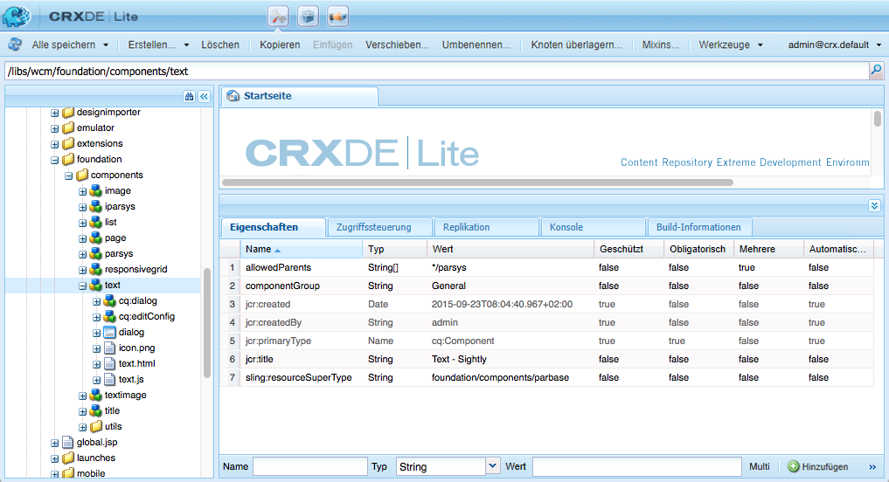
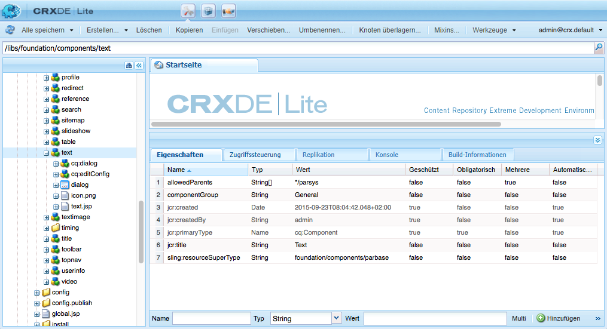
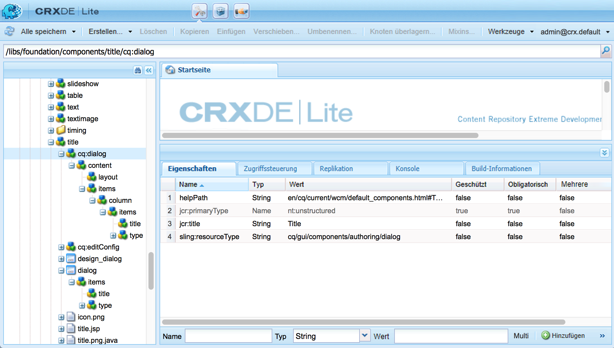
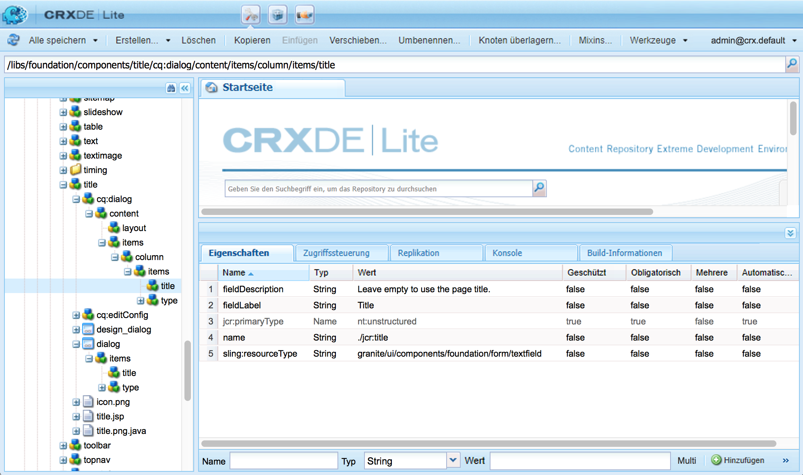
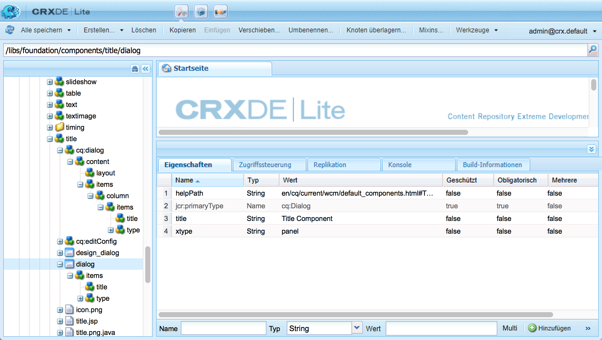
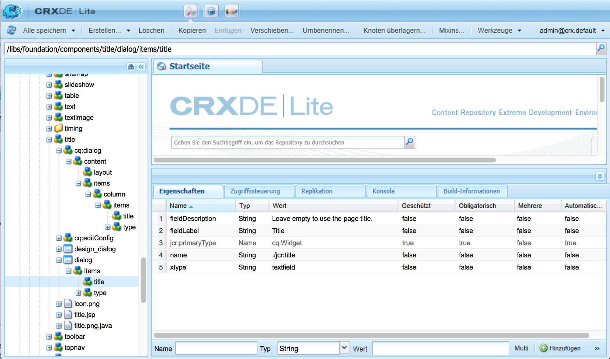
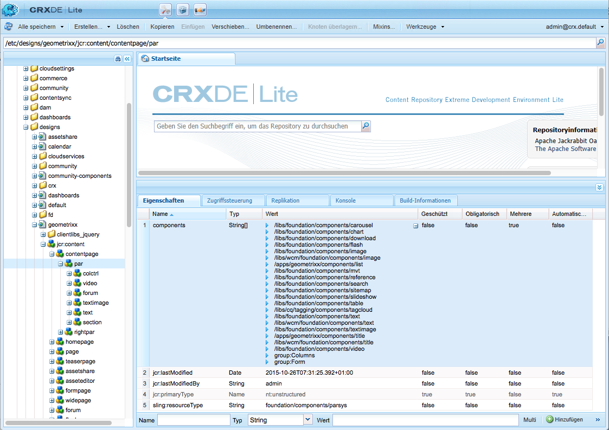
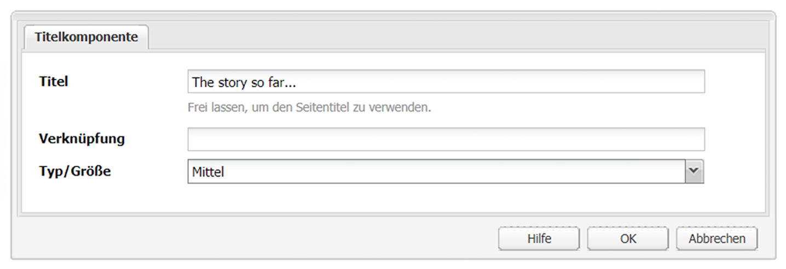
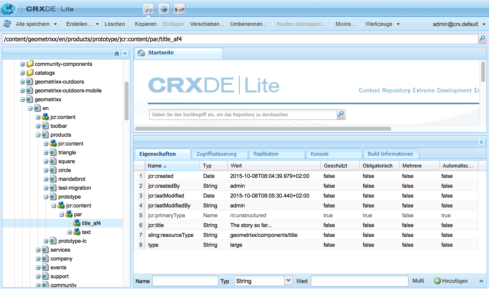

# Adobe Experience Manager-Komponenten (AEM) – Grundlagen{#aem-components-the-basics}

Wenn Sie neue Komponenten entwickeln, müssen Sie die Grundlagen ihrer Struktur und Konfiguration kennen.

Dazu müssen Sie sich in die Theorie einlesen und sich mit den vielfältigen Komponenten-Implementierungen in einer standardmäßigen AEM-Instanz vertraut machen. Letzteres wird ein Stück weit durch die Tatsache erschwert, dass AEM zwar standardmäßig eine neue, moderne Touch-optimierte Benutzeroberfläche einsetzt, die klassische Benutzeroberfläche aber nach wie vor unterstützt.

## Überblick {#overview}

In diesem Abschnitt werden zentrale Konzepte und Schwierigkeiten erläutert. Er bietet so einen guten Einstieg in die Entwicklung eigener Komponenten.

### Planung {#planning}

Vor dem Konfigurieren bzw. Programmieren einer Komponente sollten Sie die folgenden Fragen beantworten:

* Was genau soll die neue Komponente tun?
   * Eine eindeutige Spezifikation hilft in allen Phasen der Entwicklung, des Testens und der Übergabe. Details können sich im Laufe der Zeit ändern, woraufhin die Spezifikation jedoch aktualisiert werden kann (Änderungen sollten jedoch ebenso dokumentiert werden).
* Müssen Sie die Komponente komplett neu entwickeln oder können Sie die Grundlagen von einer vorhandenen Komponente übernehmen?
   * Sie müssen das Rad nicht neu erfinden.
   * AEM bietet mehrere Mechanismen, um Details von anderen Komponentendefinitionen zu übernehmen und zu erweitern, darunter Überschreiben, Überlagerung und den [Sling Resource Merger](/help/sites-developing/sling-resource-merger.md).
* Benötigt die Komponente eine Logik zur Auswahl oder Bearbeitung des Inhalts?
   * Die Logik sollte getrennt von der Ebene der Benutzeroberfläche aufbewahrt werden. HTL dient dazu, dies sicherzustellen.
* Benötigt Ihre Komponente eine CSS-Formatierung?
   * Eine CSS-Formatierung sollte getrennt von den Komponentendefinitionen aufbewahrt werden. Legen Sie Konventionen für die Benennung der HTML-Elemente fest, damit Sie sie über externe CSS-Dateien modifizieren können.
* Welche Sicherheitsaspekte sollten berücksichtigt werden?
   * Weitere Informationen finden Sie unter [Sicherheits-Checkliste – Best Practices für die Entwicklung](/help/sites-administering/security-checklist.md#development-best-practices).

### Touch-optimierte und klassische Benutzeroberfläche {#touch-enabled-vs-classic-ui}

Bevor es um die Entwicklung von Komponenten geht, müssen Sie wissen, welche Benutzeroberfläche Ihre Autorinnen und Autoren verwenden:

* **Touch-optimierte Benutzeroberfläche**
  Die [Standardbenutzeroberfläche](/help/sites-developing/touch-ui-concepts.md) basiert auf dem einheitlichen Anwendererlebnis für Adobe Experience Cloud und verwendet dabei die zugrunde liegenden Technologien der [Coral-Benutzeroberfläche](/help/sites-developing/touch-ui-concepts.md#coral-ui) und der [Granite-Benutzeroberfläche](/help/sites-developing/touch-ui-concepts.md#granite-ui).
* **Klassische Benutzeroberfläche**
Eine auf der ExtJS-Technologie basierende Benutzeroberfläche, die seit AEM 6.4 veraltet ist.

Weitere Informationen finden Sie in den [Benutzeroberflächen-Empfehlungen für Kundinnen und Kunden](/help/sites-deploying/ui-recommendations.md).

Komponenten können je nach Implementierung die Touch-optimierte Benutzeroberfläche, die klassische oder beide Versionen unterstützen. Eine Standardinstanz umfasst auch vorkonfigurierte Komponenten, die ursprünglich für die klassische oder die Touch-optimierte Benutzeroberfläche oder beide Versionen entwickelt wurden.

Die Grundlagen von beiden werden auf dieser Seite behandelt. Außerdem erfahren Sie, wie Sie sie erkennen.

>[!NOTE]
>
>Adobe empfiehlt, die Touch-optimierte Benutzeroberfläche zu verwenden, um von der neuesten Technologie zu profitieren. [AEM-Modernisierungs-Tools](modernization-tools.md) können die Migration vereinfachen.

### Inhaltslogik und Rendering-Markup  {#content-logic-and-rendering-markup}

Adobe empfiehlt, den für Markup und Rendering zuständigen Code getrennt von dem Code zu halten, der die Logik zur Auswahl des Komponenteninhalts enthält.

Dieser Ansatz wird durch [HTL](https://experienceleague.adobe.com/docs/experience-manager-htl/content/overview.html?lang=de) unterstützt, eine Vorlagensprache, die zweckgebunden beschränkt ist, um sicherzustellen, dass eine echte Programmiersprache für die Definition der zugrunde liegenden Business-Logik genutzt wird. Diese (optionale) Logik wird von HTL über einen speziellen Befehl aufgerufen. Dieser Mechanismus hebt den Code hervor, der für eine bestimmte Ansicht aufgerufen wird, und lässt bei Bedarf eine spezifische Logik für unterschiedliche Ansichten derselben Komponente zu.

### HTL und JSP {#htl-vs-jsp}

HTL ist eine HTML-Vorlagensprache, die mit AEM 6.0 eingeführt wurde.

Die Frage, ob Sie bei der Entwicklung eigener Komponenten [HTL](https://experienceleague.adobe.com/docs/experience-manager-htl/content/overview.html?lang=de) oder JSP (Java™ Server Pages) nutzen sollten, ist leicht zu beantworten – immerhin ist HTL nun die empfohlene Skriptsprache für AEM.

Sie können sowohl HTL als auch JSP zur Entwicklung von Komponenten für die klassische und die Touch-optimierte Benutzeroberfläche verwenden. Zwar wird häufig angenommen, dass HTL nur für die Touch-optimierte und JSP für die klassische Benutzeroberfläche ist, doch diese Vermutung ist falsch und wohl auf die Tatsache zurückzuführen, dass die Touch-optimierte Benutzeroberfläche und HTL ungefähr zur selben Zeit in AEM integriert wurden. Da HTL nun die empfohlene Sprache ist, wird sie für neue Komponenten verwendet, die meistens für die Touch-optimierte Benutzeroberfläche ausgelegt sind.

>[!NOTE]
>
>Ausnahme hiervon sind die Foundation-Formularfelder der Granite-Benutzeroberfläche (wie sie in Dialogfeldern verwendet werden). Für sie ist die Verwendung von JSP erforderlich.

### Entwickeln eigener Komponenten {#developing-your-own-components}

Informationen zum Erstellen eigener Komponenten für die entsprechende Benutzeroberfläche finden Sie (nach dem Lesen dieser Seite) unter:

* [AEM-Komponenten für die Touch-optimierte Benutzeroberfläche](/help/sites-developing/developing-components.md)
* [AEM-Komponenten für die klassische Benutzeroberfläche](/help/sites-developing/developing-components-classic.md)

Eine schnelle Möglichkeit für den Einstieg ist das Kopieren einer vorhandenen Komponente und das anschließende Vornehmen der gewünschten Änderungen. Informationen dazu, wie Sie Ihre eigenen Komponenten erstellen und sie zum Absatzsystem hinzufügen, finden Sie unter:

* [Entwickeln von Komponenten](/help/sites-developing/developing-components-samples.md) (mit Schwerpunkt auf der Touch-optimierten Benutzeroberfläche)

### Verschieben von Komponenten in die Publishing-Instanz {#moving-components-to-the-publish-instance}

Die Komponenten, die Inhalte rendern, müssen in derselben AEM-Instanz bereitgestellt werden wie die Inhalte. Daher müssen alle Komponenten, die zum Verfassen und Rendern von Seiten in der Authoring-Instanz genutzt werden, in der Publishing-Instanz bereitgestellt werden. Wenn sie bereitgestellt sind, stehen diese Komponenten zum Rendern aktivierter Seiten zur Verfügung.

Mit den folgenden Tools können Sie Ihre Komponenten in die Publishing-Instanz verschieben:

* [Mit Package Manager](/help/sites-administering/package-manager.md) können Sie Ihre Komponenten zu einem Paket hinzufügen und in eine andere AEM-Instanz verschieben.
* [Mit dem Replikations-Tool „Tree aktivieren“](/help/sites-authoring/publishing-pages.md#manage-publication) können Sie die Komponenten replizieren.

>[!NOTE]
>
>Mit diesen Mechanismen können Sie Ihre Komponente auch zwischen anderen Instanzen verschieben, z. B. von der Entwicklungs- in die Testinstanz.

### Komponenten, die Sie von Anfang an kennen sollten {#components-to-be-aware-of-from-the-start}

* Seite:

   * AEM verfügt über die Komponente *Seite* ( `cq:Page`).
   * Dabei handelt es sich um eine bestimmte Art von Ressource, die für das Content-Management wichtig ist.
      * Eine Seite entspricht einer Web-Seite, die Inhalte für Ihre Website enthält.

* Absatzsysteme:

   * Das Absatzsystem ist eine wichtige Komponente einer Website, da es eine Liste mit Absätzen verwaltet. Mit dem Absatzsystem werden die einzelnen Komponenten gespeichert und strukturiert, die die eigentlichen Inhalte enthalten.
   * Sie können Absätze im Absatzsystem erstellen, verschieben, kopieren und löschen.
   * Sie können auch Komponenten auswählen, die zur Verwendung in einem bestimmten Absatzsystem verfügbar sein sollen.
   * In einer Standardinstanz stehen diverse Absatzsysteme zur Verfügung (z. B `parsys`, ` [responsivegrid](/help/sites-authoring/responsive-layout.md)`).

## Struktur {#structure}

Die Struktur einer AEM-Komponente ist leistungsstark und flexibel. Die wichtigsten Aspekte sind:

* Ressourcentyp
* Komponentendefinition
* Eigenschaften und untergeordnete Knoten einer Komponente
* Dialogfelder
* Design-Dialogfelder
* Verfügbarkeit von Komponenten
* Komponenten und die von ihnen erstellten Inhalte

### Ressourcentyp {#resource-type}

Ein zentrales Element der Struktur ist der Ressourcentyp.

* Die Inhaltsstruktur deklariert Absichten.
* Der Ressourcentyp implementiert sie.

Dies ist eine Abstraktion, die sicherstellen soll, dass die Intention unverändert bleibt, auch wenn sich das Look-and-Feel im Laufe der Zeit ändert.

### Komponentendefinition {#component-definition}

#### Grundlagen zu Komponenten {#component-basics}

Die Definition einer Komponente lässt sich wie folgt aufschlüsseln:

* AEM-Komponenten basieren auf [Sling](https://sling.apache.org/documentation.html).
* AEM-Komponenten befinden sich (in der Regel) unter:

   * HTL: `/libs/wcm/foundation/components`
   * JSP: `/libs/foundation/components`

* Projekt- bzw. Website-spezifische Komponenten befinden sich (in der Regel) unter:

   * `/apps/<myApp>/components`

* AEM-Standardkomponenten sind als `cq:Component` definiert und haben die folgenden zentralen Elemente:

   * JCR-Eigenschaften:

     Eine Liste von JCR-Eigenschaften. Sie sind variabel und einige von ihnen können optional sein, obwohl die grundlegende Struktur eines Komponentenknotens, seiner Eigenschaften und untergeordneten Knoten in der `cq:Component`-Definition festgelegt ist.

   * Ressourcen:

     Sie definieren statische Elemente, die von der Komponente genutzt werden.

   * Skripte:

  Sie werden verwendet, um das Verhalten der entstandenen Instanz der Komponente zu implementieren.

* **Stammknoten**:

   * `<mycomponent> (cq:Component)` – Hierarchieknoten der Komponente.

* **Wichtige Eigenschaften**:

   * `jcr:title` – Komponententitel; wird beispielsweise als Kennzeichnung genutzt, wenn die Komponente im Komponenten-Browser oder Sidekick aufgeführt wird
   * `jcr:description` – Beschreibung der Komponente; kann als Mouseover-Hinweis im Komponenten-Browser oder Sidekick genutzt werden
   * Klassische Benutzeroberfläche:

      * `icon.png` – Symbol für diese Komponente
      * `thumbnail.png` – Bild, das angezeigt wird, wenn diese Komponente im Absatzsystem aufgeführt wird

   * Touch-optimierte Benutzeroberfläche

      * Weitere Informationen finden Sie im Abschnitt [Komponentensymbol in der Touch-optimierten Benutzeroberfläche](/help/sites-developing/components-basics.md#component-icon-in-touch-ui).

* **Wichtige untergeordnete Knoten**:

   * `cq:editConfig (cq:EditConfig)` – Definiert die Bearbeitungseigenschaften der Komponente und ermöglicht es, dass die Komponente im Komponenten-Browser oder Sidekick aufgeführt wird.

     Hinweis: Wenn die Komponente über ein Dialogfeld verfügt, wird sie automatisch im Komponenten-Browser oder Sidekick aufgeführt, selbst wenn die cq:editConfig nicht vorhanden ist.

   * `cq:childEditConfig (cq:EditConfig)` – Steuert Aspekte der Autoren-Benutzeroberfläche für untergeordnete Komponenten, die keine eigene `cq:editConfig` definieren.
   * Touch-optimierte Benutzeroberfläche:

      * `cq:dialog` ( `nt:unstructured`) – Dialogfeld für diese Komponente. Definiert die Oberfläche, über die Benutzer die Komponente konfigurieren und/oder Inhalte bearbeiten können.
      * `cq:design_dialog` ( `nt:unstructured`) – Design-Bearbeitung für diese Komponente.

   * Klassische Benutzeroberfläche:

      * `dialog` ( `cq:Dialog`) – Dialogfeld für diese Komponente. Definiert die Oberfläche, über die Benutzende die Komponente konfigurieren und/oder Inhalte bearbeiten können.
      * `design_dialog` ( `cq:Dialog`) – Design-Bearbeitung für diese Komponente.

#### Komponentensymbol in der Touch-optimierten Benutzeroberfläche {#component-icon-in-touch-ui}

Das Symbol oder die Abkürzung für die Komponente wird mit JCR-Eigenschaften der Komponente definiert, wenn die Komponente vom Entwickler erstellt wird. Diese Eigenschaften werden in der folgenden Reihenfolge ausgewertet und die erste erkannte gültige Eigenschaft wird verwendet.

1. `cq:icon` – Zeichenfolgeneigenschaft, die auf ein Standardsymbol in der [Bibliothek der Coral-Benutzeroberfläche](https://developer.adobe.com/experience-manager/reference-materials/6-5/coral-ui/coralui3/Coral.Icon.html) verweist, das im Komponenten-Browser angezeigt werden soll.
   * Verwenden Sie den Wert des HTML-Attributs des Coral-Symbols.
1. `abbreviation` – Zeichenfolgeneigenschaft, die die Abkürzung des Komponentennamens im Komponenten-Browser anpasst.
   * Die Abkürzung sollte auf zwei Zeichen beschränkt sein.
   * Bei einer leeren Zeichenfolge wird die Abkürzung aus den ersten beiden Buchstaben der Eigenschaft `jcr:title` gebildet.
      * Beispiel: „Gr“ für „Grafik“
      * Zum Erstellen der Abkürzung wird der lokalisierte Titel verwendet.
   * Die Abkürzung wird nur übersetzt, wenn die Komponente die Eigenschaft `abbreviation_commentI18n` aufweist, die dann als Anweisung für eine Übersetzung genutzt wird.
1. `cq:icon.png` oder `cq:icon.svg` – Symbol für diese Komponente, das im Komponenten-Browser angezeigt wird.
   * Symbole von Standardkomponenten haben eine Größe von 20 x 20 Pixeln.
      * Größere Symbole werden (Client-seitig) herunterskaliert.
   * Die empfohlene Farbe ist rgb(112, 112, 112) > #707070.
   * Der Hintergrund von Symbolen von Standardkomponenten ist transparent.
   * Es werden nur `.png`- und `.svg`-Dateien unterstützt.
   * Beim Importieren aus dem Dateisystem über das Eclipse-Plug-in müssen die Dateinamen beispielsweise wie folgt geändert werden: `_cq_icon.png` oder `_cq_icon.svg`.
   * Wenn beide Formate vorliegen, hat `.png` Vorrang vor `.svg`

Wenn keine der oben genannten Eigenschaften (`cq:icon`, `abbreviation`, `cq:icon.png` oder `cq:icon.svg`) bei der Komponente gefunden wird, geschieht Folgendes:

* Das System sucht nach denselben Eigenschaften bei den übergeordneten Komponenten, die der Eigenschaft `sling:resourceSuperType` folgen.
* Wenn auf der Ebene der übergeordneten Komponente nichts oder eine leere Abkürzung gefunden wird, erstellt das System die Abkürzung aus den ersten beiden Zeichen der Eigenschaft `jcr:title` der aktuellen Komponente.

Um die Vererbung von Symbolen von übergeordneten Komponenten zu deaktivieren, legen Sie eine leere Eigenschaft `abbreviation` für die Komponente fest. Das Standardverhalten wird daraufhin erneut aktiviert.

Die [Komponentenkonsole](/help/sites-authoring/default-components-console.md#component-details) zeigt an, wie das Symbol für eine bestimmte Komponente definiert ist.

#### Beispiel: SVG-Symbol {#svg-icon-example}

```xml
<?xml version="1.0" encoding="utf-8"?>
<!DOCTYPE svg PUBLIC "-//W3C//DTD SVG 1.1//EN" "https://www.w3.org/Graphics/SVG/1.1/DTD/svg11.dtd">
<svg version="1.1" id="Layer_1" xmlns="https://www.w3.org/2000/svg" xmlns:xlink="https://www.w3.org/1999/xlink" x="0px" y="0px"
     width="20px" height="20px" viewBox="0 0 20 20" enable-background="new 0 0 20 20" xml:space="preserve">
    <ellipse cx="5" cy="5" rx="3" ry="3" fill="#707070"/>
    <ellipse cx="15" cy="5" rx="4" ry="4" fill="#707070"/>
    <ellipse cx="5" cy="15" rx="5" ry="5" fill="#707070"/>
    <ellipse cx="15" cy="15" rx="4" ry="4" fill="#707070"/>
</svg>
```

### Eigenschaften und untergeordnete Knoten einer Komponente {#properties-and-child-nodes-of-a-component}

Viele der Knoten/Eigenschaften, die für die Definition einer Komponente erforderlich sind, sind in beiden Benutzeroberflächen zu finden. Die Unterschiede bleiben unabhängig, sodass Ihre Komponente in beiden Umgebungen funktioniert.

Eine Komponente ist ein Knoten des Typs `cq:Component` mit den folgenden Eigenschaften und untergeordneten Knoten:

<table>
 <tbody>
  <tr>
   <td><strong>Name <br /> </strong></td>
   <td><strong>Typ <br /> </strong></td>
   <td><strong>Beschreibung <br /> </strong></td>
  </tr>
  <tr>
   <td>.<br /> </td>
   <td><code>cq:Component</code></td>
   <td>Aktuelle Komponente. Eine Komponente weist den Knotentyp <code>cq:Component</code> auf.<br /> </td>
  </tr>
  <tr>
   <td><code>componentGroup</code></td>
   <td><code>String</code></td>
   <td>Gruppe, aus der die Komponente im Komponenten-Browser (Touch-optimierte Benutzeroberfläche) oder Sidekick (klassische Benutzeroberfläche) ausgewählt werden kann.<br /> Der Wert <code>.hidden</code> wird für Komponenten genutzt, die nicht zur Auswahl über die Benutzeroberfläche verfügbar sind, z. B. die tatsächlichen Absatzsysteme.</td>
  </tr>
  <tr>
   <td><code>cq:isContainer</code></td>
   <td><code>Boolean</code></td>
   <td>Gibt an, ob es sich bei der Komponente um eine Containerkomponente handelt, die andere Komponenten wie ein Absatzsystem enthalten kann.</td>
  </tr>
  <tr>
   <td> </td>
   <td> </td>
   <td> </td>
  </tr>
  <tr>
   <td><code>cq:dialog</code></td>
   <td><code>nt:unstructured</code><br /> </td>
   <td>Definition des Bearbeitungsdialogfelds für die Touch-optimierte Benutzeroberfläche</td>
  </tr>
  <tr>
   <td><code>dialog</code></td>
   <td><code>cq:Dialog</code></td>
   <td>Definition des Bearbeitungsdialogfelds für die klassische Benutzeroberfläche</td>
  </tr>
  <tr>
   <td><code>cq:design_dialog</code></td>
   <td><code>nt:unstructured</code></td>
   <td>Definition des Design-Dialogfelds für die Touch-optimierte Benutzeroberfläche</td>
  </tr>
  <tr>
   <td><code>design_dialog</code></td>
   <td><code>cq:Dialog </code></td>
   <td>Definition des Design-Dialogfelds für die klassische Benutzeroberfläche<br /> </td>
  </tr>
  <tr>
   <td><code>dialogPath</code></td>
   <td><code>String</code></td>
   <td>Pfad zu einem Dialogfeld, wenn die Komponente keinen Dialogfeldknoten aufweist<br /> </td>
  </tr>
  <tr>
   <td> </td>
   <td> </td>
   <td> </td>
  </tr>
  <tr>
   <td><code>cq:cellName</code></td>
   <td><code>String</code></td>
   <td>Wenn diese Eigenschaft festgelegt ist, dient sie als Zellen-ID. Weitere Informationen finden Sie im Artikel <a href="https://helpx.adobe.com/de/experience-manager/kb/DesigneCellId.html">Erstellung von Design-Zellen-IDs</a> in der Wissensdatenbank.<br /> </td>
  </tr>
  <tr>
   <td><code>cq:childEditConfig</code></td>
   <td><code>cq:EditConfig</code></td>
   <td>Wenn die Komponente ein Container ist, z. B. ein Absatzsystem, steuert diese Eigenschaft die Bearbeitungskonfiguration der untergeordneten Knoten.<br /> </td>
  </tr>
  <tr>
   <td><code>cq:editConfig</code></td>
   <td><code>cq:EditConfig</code></td>
   <td><a href="#edit-behavior">Bearbeitungskonfiguration der Komponente</a>.<br /> </td>
  </tr>
  <tr>
   <td><code>cq:htmlTag</code></td>
   <td><code>nt:unstructured </code></td>
   <td>Gibt zusätzliche Tag-Attribute zurück, die zum umgebenden HTML-Tag hinzugefügt werden. Ermöglicht das Hinzufügen von Attributen zu den automatisch generierten div-Tags.</td>
  </tr>
  <tr>
   <td><code>cq:noDecoration</code></td>
   <td><code>Boolean</code></td>
   <td>Bei „true“ wird die Komponente nicht mit automatisch erstellten div- und CSS-Klassen gerendert.<br /> </td>
  </tr>
  <tr>
   <td><code>cq:template</code></td>
   <td><code>nt:unstructured</code></td>
   <td>Sofern vorhanden, wird dieser Knoten als Inhaltsvorlage genutzt, wenn die Komponente vom Komponenten-Browser oder Sidekick hinzugefügt wird.</td>
  </tr>
  <tr>
   <td><code>cq:templatePath</code></td>
   <td><code>String</code></td>
   <td>Pfad zu einem Knoten, der als Inhaltsvorlage genutzt wird, wenn die Komponente vom Komponenten-Browser oder Sidekick hinzugefügt wird. Es muss sich hierbei um einen absoluten Pfad handeln, keinen relativen zum Komponentenknoten.<br /> Wenn Sie keine bereits an anderer Stelle verfügbaren Inhalte wiederverwenden möchten, ist dies nicht erforderlich und <code>cq:template</code> ausreichend (siehe unten).</td>
  </tr>
  <tr>
   <td><code>jcr:created</code></td>
   <td><code>Date</code></td>
   <td>Datum der Erstellung der Komponente<br /> </td>
  </tr>
  <tr>
   <td><code>jcr:description</code></td>
   <td><code>String</code></td>
   <td>Beschreibung der Komponente<br /> </td>
  </tr>
  <tr>
   <td><code>jcr:title</code></td>
   <td><code>String</code></td>
   <td>Titel der Komponente<br /> </td>
  </tr>
  <tr>
   <td><code>sling:resourceSuperType</code></td>
   <td><code>String</code></td>
   <td>Wenn dieser Wert festgelegt ist, erbt die Komponente von dieser Komponente.<br /> </td>
  </tr>
  <tr>
   <td><code>virtual</code></td>
   <td><code>sling:Folder</code></td>
   <td>Aktiviert das Erstellen von virtuellen Komponenten. Ein Beispiel hierfür ist die Kontakt-Komponente unter:<br /> <code>/libs/foundation/components/profile/form/contact</code></td>
  </tr>
  <tr>
   <td><code>&lt;breadcrumb.jsp&gt;</code></td>
   <td><code>nt:file</code><br /> </td>
   <td>Skriptdatei<br /> </td>
  </tr>
  <tr>
   <td><code>icon.png</code></td>
   <td><code>nt:file</code></td>
   <td>Symbol der Komponente, wird neben dem Titel im Sidekick angezeigt<br /> </td>
  </tr>
  <tr>
   <td><code>thumbnail.png</code></td>
   <td><code>nt:file</code></td>
   <td>Optionale Miniaturansicht, die angezeigt wird, wenn die Komponente aus dem Sidekick an ihre Position gezogen wird.<br /> </td>
  </tr>
 </tbody>
</table>

In der **Text**-Komponente (beide Versionen) finden sich die folgenden Elemente:

* HTL ( `/libs/wcm/foundation/components/text`)

  

* JSP ( `/libs/foundation/components/text`)

  

Zu den wichtigen Eigenschaften gehören:

* `jcr:title` – Titel der Komponente; dient zur Identifizierung der Komponente, z. B. in der Komponentenliste im Komponenten-Browser oder Sidekick
* `jcr:description` – Beschreibung der Komponente; kann als Mouseover-Hinweis in der Komponentenliste im Sidekick genutzt werden
* `sling:resourceSuperType` – gibt den Pfad der Vererbung bei der Erweiterung einer Komponente an (durch Überschreiben einer Definition)

Zu den wichtigen untergeordneten Knoten gehören:

* `cq:editConfig` ( `cq:EditConfig`) – steuert visuelle Aspekte; definiert z. B. das Aussehen einer Leiste oder eines Widgets oder fügt angepasste Steuerelemente hinzu
* `cq:childEditConfig` ( `cq:EditConfig`) – steuert die visuellen Aspekte für untergeordnete Komponenten, die keine eigenen Definitionen aufweisen
* Touch-optimierte Benutzeroberfläche:
   * `cq:dialog` ( `nt:unstructured`) – definiert das Dialogfeld für die Bearbeitung von Inhalten dieser Komponente
   * `cq:design_dialog` ( `nt:unstructured`) – legt die Design-Bearbeitungsoptionen für diese Komponente fest
* Klassische Benutzeroberfläche:
   * `dialog` ( `cq:Dialog`) – definiert das Dialogfeld zum Bearbeiten von Inhalten dieser Komponente (speziell für die klassische Benutzeroberfläche)
   * `design_dialog` ( `cq:Dialog`) – legt die Design-Bearbeitungsoptionen für diese Komponente fest
   * `icon.png` – Grafikdatei, die als Symbol für die Komponente im Sidekick genutzt werden soll
   * `thumbnail.png` – Grafikdatei, die als Miniaturansicht der Komponente beim Ziehen aus dem Sidekick genutzt werden soll

### Dialogfelder {#dialogs}

Dialogfelder sind ein wichtiges Element einer Komponente: Sie bieten den Autorinnen und Autoren eine Oberfläche für die Konfiguration und Eingaben für diese Komponente.

Je nach Komplexität der Komponente benötigt das Dialogfeld eine Registerkarte oder mehrere, um das Dialogfeld übersichtlich zu gestalten und die Eingabefelder zu ordnen.

Dialogdefinitionen sind spezifisch für jede Benutzeroberfläche.

>[!NOTE]
>
>* Zum Zweck der Kompatibilität kann die Touch-optimierte Benutzeroberfläche die Definition eines Dialogfelds der klassischen Benutzeroberfläche nutzen, wenn kein Dialogfeld für die Touch-optimierte Benutzeroberfläche definiert wurde.
>* Die [AEM-Modernisierungs-Tools](/help/sites-developing/modernization-tools.md) unterstützen Sie beim Erweitern/Konvertieren von Komponenten, bei denen nur Dialogfelder für die klassische Benutzeroberfläche festgelegt wurden.
>

* Touch-optimierte Benutzeroberfläche
   * `cq:dialog` ( `nt:unstructured`) Knoten:
      * definieren das Dialogfeld für die Bearbeitung von Inhalten dieser Komponente
      * spezifisch für die Touch-optimierte Benutzeroberfläche
      * werden mit Komponenten der Granite-Benutzeroberfläche definiert
      * weisen die Eigenschaft `sling:resourceType` als standardmäßige Sling-Inhaltsstruktur auf
      * können die Eigenschaft `helpPath` aufweisen, um die kontextabhängige Hilferessource festzulegen (absoluter oder relativer Pfad), auf die bei Auswahl des Hilfe-Symbols (das `?`-Symbol) zugegriffen wird.
         * Bei standardmäßigen Komponenten verweist diese Eigenschaft häufig auf eine Seite in der Dokumentation.
         * Wenn kein `helpPath` festgelegt ist, wird die Standard-URL (Übersichtsseite der Dokumentation) angezeigt.

  

  In diesem Dialogfeld werden einzelne Felder definiert:

  

* Klassische Benutzeroberfläche
   * `dialog` ( `cq:Dialog`) Knoten
      * definieren das Dialogfeld für die Bearbeitung von Inhalten dieser Komponente
      * spezifisch für die klassische Benutzeroberfläche
      * werden mit ExtJS-Widgets definiert
      * weisen die Eigenschaft `xtype` auf, die auf ExtJS verweist
      * können die Eigenschaft `helpPath` aufweisen, um die kontextabhängige Hilferessource festzulegen (absoluter oder relativer Pfad), auf die bei Auswahl der Schaltfläche **Hilfe** zugegriffen wird.
         * Bei standardmäßigen Komponenten verweist diese Eigenschaft häufig auf eine Seite in der Dokumentation.
         * Wenn kein `helpPath` festgelegt ist, wird die Standard-URL (Übersichtsseite der Dokumentation) angezeigt.

  

  In diesem Dialogfeld werden einzelne Felder definiert:

  

  Innerhalb eines klassischen Dialogfelds:

   * können Sie Dialogfeld wie `cq:Dialog` erstellen, die eine einzige Registerkarte aufweisen, wie in der Text-Komponente. Wenn Sie mehrere Registerkarten benötigen, wie in der Textbild-Komponente, können Sie das Dialogfeld als `cq:TabPanel` definieren.
   * wird eine `cq:WidgetCollection` ( `items`) genutzt, um eine Basis für Eingabefelder (`cq:Widget`) oder weitere Registerkarten (`cq:Widget`) bereitzustellen. Diese Hierarchie kann erweitert werden.

### Design-Dialogfelder {#design-dialogs}

Design-Dialogfelder ähneln den Dialogfeldern, die zum Bearbeiten und Konfigurieren von Inhalten genutzt werden. Sie stellen die Oberfläche für Autorinnen und Autoren zum Konfigurieren bereit und liefern Design-Informationen für diese Komponente.

[Design-Dialogfelder sind im Design-Modus verfügbar](/help/sites-authoring/default-components-designmode.md), wobei sie nicht für alle Komponenten benötigt werden. Beispielsweise verfügen sowohl **Titel** als auch **Bild** über Design-Dialogfelder, **Text** dagegen nicht.

Das Design-Dialogfeld für das Absatzsystem (z. B. parsys) ist ein Sonderfall: Benutzende können damit andere Komponenten festlegen, die auf der Seite zur Auswahl (über den Komponenten-Browser oder Sidekick) verfügbar sein sollen.

### Hinzufügen einer Komponente zum Absatzsystem {#adding-your-component-to-the-paragraph-system}

Nachdem eine Komponente definiert wurde, muss sie zur Verwendung bereitgestellt werden. Um eine Komponente zur Verwendung in einem Absatzsystem bereitzustellen, haben Sie zwei Möglichkeiten:

1. Öffnen Sie den [Design-Modus](/help/sites-authoring/default-components-designmode.md) für eine Seite und aktivieren Sie die benötigte Komponente.
1. Fügen Sie die benötigte(n) Komponente(n) zur Eigenschaft `components` der Vorlagendefinition unter folgendem Pfad hinzu:

   `/etc/designs/<*yourProject*>/jcr:content/<*yourTemplate*>/par`

   Ein Beispiel finden Sie unter:

   `/etc/designs/geometrixx/jcr:content/contentpage/par`

   

### Komponenten und die von ihnen erstellten Inhalte {#components-and-the-content-they-create}

Sie erstellen und konfigurieren eine Instanz der **Titelkomponente** auf der Seite `<content-path>/Prototype.html`.

* Touch-optimierte Benutzeroberfläche

  

* Klassische Benutzeroberfläche

  

Anschließend sehen Sie die Struktur des Inhalts, der innerhalb des Repositorys erstellt wurde:



Sehen Sie sich besonders den tatsächlichen Text für eine **Titel**-Komponente an:

* Die Definition weist (bei beiden Benutzeroberflächen) die Eigenschaft `name`= `./jcr:title` auf

   * `/libs/foundation/components/title/cq:dialog/content/items/column/items/title`
   * `/libs/foundation/components/title/dialog/items/title`

* Innerhalb des Inhalts wird dadurch die Eigenschaft `jcr:title` erstellt, die den Inhalt des Autors enthält.

Die definierten Eigenschaften sind von den einzelnen Definitionen abhängig. Zwar können sie komplexer als oben dargestellt sein, folgen aber dennoch denselben grundlegenden Prinzipien.

## Komponentenhierarchie und Vererbung {#component-hierarchy-and-inheritance}

Komponenten in AEM unterliegen drei verschiedenen Hierarchien:

* **Ressourcentyphierarchie**

  Diese wird verwendet, um Komponenten mit der `sling:resourceSuperType`-Eigenschaft zu erweitern. Dies aktiviert die Vererbung für die Komponente. Beispielsweise erbt eine Textkomponente verschiedene Attribute von der Standardkomponente.

   * Skripte (aufgelöst durch Sling)
   * Dialogfelder
   * Beschreibungen (darunter Miniaturansichten und Symbole)

* **Container-Hierarchie**

  Hiermit werden Konfigurationseinstellungen an untergeordnete Komponenten weitergegeben. Gängig ist dies vor allem bei parsys-Szenarien.

  So können Sie beispielsweise Konfigurationseinstellungen für die Schaltflächen auf der Bearbeitungsleiste, das Layout von Steuerungen (Bearbeitungsleiste, Rollover) oder von Dialogfeldern (eingebunden, unverankert) auf der übergeordneten Komponente definieren und an die untergeordneten Komponenten übergeben.

  Konfigurationseinstellungen (für die Bearbeitungsfunktion) in `cq:editConfig` und `cq:childEditConfig` werden weitergegeben.

* **Einschlusshierarchie**

  Diese Hierarchie wird zur Laufzeit durch eine Folge an Einschlüssen eingeführt.

  Diese Hierarchie wird vom Designer verwendet, der als Basis für die verschiedenen Designaspekte des Rendering fungiert; einschließlich Layout-Angaben, CSS-Informationen, verfügbaren Komponenten in einem parsys usw.

## Bearbeitungsverhalten {#edit-behavior}

In diesem Abschnitt wird beschrieben, wie Sie das Bearbeitungsverhalten einer Komponente konfigurieren. Hierzu zählen Attribute wie für die Komponente verfügbare Aktionen, Eigenschaften des Editors für die Bearbeitung im Kontext und die Listener, die im Zusammenhang mit den Ereignissen der Komponente stehen.

Die Konfiguration gilt dabei sowohl für die Touch-optimierte als auch für die klassische Benutzeroberfläche, wenn auch mit gewissen Unterschieden.

Um das Bearbeitungsverhalten einer Komponente zu konfigurieren, fügen Sie einen `cq:editConfig`-Knoten des Typs `cq:EditConfig` unter dem Komponentenknoten (des Typs `cq:Component`) hinzu sowie spezifische Eigenschaften und untergeordnete Knoten. Die folgenden Funktionen und untergeordneten Knoten sind verfügbar:

* [`cq:editConfig`-Knoteneigenschaften](#configuring-with-cq-editconfig-properties):

   * `cq:actions` ( `String array`): legt die Aktionen fest, die für die Komponente durchgeführt werden.
   * `cq:layout` ( `String`): definiert, wie die Komponente in der klassischen Benutzeroberfläche bearbeitet wird.
   * `cq:dialogMode` ( `String`): definiert, wie das Komponentendialogfeld in der klassischen Benutzeroberfläche geöffnet wird

      * In der Touch-optimierten Benutzeroberfläche sind die Dialogfelder im Desktop-Modus immer unverankert und werden im mobilen Modus immer im Vollbild geöffnet.

   * `cq:emptyText` ( `String`): definiert den Text, der angezeigt wird, wenn keine visuellen Inhalte vorhanden sind
   * `cq:inherit` ( `Boolean`): legt fest, ob fehlende Werte von der Komponente geerbt werden, von der die Vererbung erfolgt
   * `dialogLayout` (String): legt fest, wie das Dialogfeld geöffnet werden soll

* Untergeordnete [`cq:editConfig`Knoten](#configuring-with-cq-editconfig-child-nodes):

   * `cq:dropTargets` (Knotentyp `nt:unstructured`): definiert eine Liste von Ablagezielen, die eine Ablage von einem Asset aus dem Content Finder annehmen können.

      * Mehrere Ablageziele sind nur in der klassischen Benutzeroberfläche verfügbar.
      * In der Touch-optimierten Benutzeroberfläche ist nur ein einziges Ablageziel zulässig.

   * `cq:actionConfigs` (Knotentyp `nt:unstructured`): definiert eine Liste mit neuen Aktionen, die an die cq:actions-Liste angehängt wird
   * `cq:formParameters` (Knotentyp `nt:unstructured`): definiert zusätzliche Parameter, die zum Dialogfeldformular hinzugefügt werden
   * `cq:inplaceEditing` (Knotentyp `cq:InplaceEditingConfig`): definiert eine Kontextbearbeitungsfunktion für die Komponente
   * `cq:listeners` (Knotentyp `cq:EditListenersConfig`): Legt fest, was geschieht, bevor oder nachdem eine Aktion auf der Komponente stattfindet.

>[!NOTE]
>
>Auf dieser Seite wird ein Knoten (Eigenschaften und untergeordnete Knoten) als XML dargestellt, wie im folgenden Beispiel gezeigt.

```
<jcr:root xmlns:cq="https://www.day.com/jcr/cq/1.0" xmlns:jcr="https://www.jcp.org/jcr/1.0"
    cq:actions="[edit]"
    cq:dialogMode="floating"
    cq:layout="editbar"
    jcr:primaryType="cq:EditConfig">
    <cq:listeners
        jcr:primaryType="cq:EditListenersConfig"
        afteredit="REFRESH_PAGE"/>
</jcr:root>
```

Es gibt zahlreiche vorhandene Konfigurationen im Repository. Sie können ganz einfach nach bestimmten Eigenschaften oder untergeordneten Knoten suchen:

* Um nach einer Eigenschaft des Knotens `cq:editConfig`, z. B. `cq:actions`, zu suchen, können Sie das Abfrage-Tool in **CRXDE Lite** nutzen und mit der folgenden XPath-Abfragezeichenfolge suchen:

  `//element(cq:editConfig, cq:EditConfig)[@cq:actions]`

* Um einen untergeordneten Knoten von `cq:editConfig` zu suchen, z. B. nach `cq:dropTargets` vom Typ `cq:DropTargetConfig`, können Sie das Abfrage-Tool in **CRXDE Lite** nutzen und mit der folgenden XPath-Abfragezeichenfolge suchen:

  `//element(cq:dropTargets, cq:DropTargetConfig)`

### Komponenten-Platzhalter {#component-placeholders}

Komponenten müssen immer HTML-Inhalte wiedergeben, die für den Autor sichtbar sind, auch wenn die Komponente keinen Inhalt hat. Andernfalls könnte sie visuell aus der Benutzeroberfläche des Editors verschwinden, sodass sie zwar technisch vorhanden, aber auf der Seite und im Editor unsichtbar ist. In einem solchen Fall können die Autoren die leere Komponente nicht auswählen und damit interagieren.

Aus diesem Grund sollten Komponenten einen Platzhalter darstellen, solange sie beim Rendern der Seite im Seiteneditor (wenn der WCM-Modus `edit` oder `preview` ist) keine sichtbare Ausgabe erzeugen.
Das typische HTML-Markup für einen Platzhalter sieht wie folgt aus:

```HTML
<div class="cq-placeholder" data-emptytext="Component Name"></div>
```

Das typische HTL-Skript, das den obigen Platzhalter-HTML-Code rendert, lautet wie folgt:

```HTML
<div class="cq-placeholder" data-emptytext="${component.properties.jcr:title}"
     data-sly-test="${(wcmmode.edit || wcmmode.preview) && isEmpty}"></div>
```

Im vorherigen Beispiel ist `isEmpty` eine Variable, die nur dann wahr ist, wenn die Komponente keinen Inhalt hat und für den Autor unsichtbar ist.

Um Wiederholungen zu vermeiden, empfiehlt Adobe den Implementierern von Komponenten, eine HTL-Vorlage für diese Platzhalter zu verwenden, [wie sie von den Kernkomponenten bereitgestellt wird.](https://github.com/adobe/aem-core-wcm-components/blob/master/content/src/content/jcr_root/apps/core/wcm/components/commons/v1/templates.html)

Die Verwendung der Vorlage im vorherigen Link erfolgt dann mit der folgenden HTL-Zeile:

```HTML
<sly data-sly-use.template="core/wcm/components/commons/v1/templates.html"
     data-sly-call="${template.placeholder @ isEmpty=!model.text}"></sly>
```

Im vorherigen Beispiel ist `model.text` die Variable, die nur dann wahr ist, wenn die Komponente einen Inhalt hat und sichtbar ist.

Eine beispielhafte Verwendung dieser Vorlage ist in den Kernkomponenten zu sehen, [wie z. B. in der Titelkomponente.](https://github.com/adobe/aem-core-wcm-components/blob/master/content/src/content/jcr_root/apps/core/wcm/components/title/v2/title/title.html#L27)

### Konfigurieren mit cq:EditConfig-Eigenschaften {#configuring-with-cq-editconfig-properties}

### cq:actions {#cq-actions}

Die Eigenschaft `cq:actions` (`String array`) definiert eine Aktion oder mehrere Aktionen, die auf der Komponente ausgeführt werden kann/können. Folgende Werte stehen für die Konfiguration zur Verfügung:

<table>
 <tbody>
  <tr>
   <td><strong>Eigenschaftswert</strong></td>
   <td><strong>Beschreibung</strong></td>
  </tr>
  <tr>
   <td><code>text:&lt;some text&gt;</code></td>
   <td>Zeigt den statischen Textwert &lt;some text&gt;<br /> an. Nur in der klassischen Benutzeroberfläche sichtbar. Die Touch-optimierte Benutzeroberfläche zeigt keine Aktionen in einem Kontextmenü an; daher trifft dieser Eigenschaftswert für sie nicht zu.</td>
  </tr>
  <tr>
   <td>-</td>
   <td>Fügt ein Leerzeichen hinzu.<br /> Nur in der klassischen Benutzeroberfläche sichtbar. Die Touch-optimierte Benutzeroberfläche zeigt keine Aktionen in einem Kontextmenü an; daher trifft dieser Eigenschaftswert für sie nicht zu.</td>
  </tr>
  <tr>
   <td><code>edit</code></td>
   <td>Fügt eine Schaltfläche zum Bearbeiten der Komponente hinzu.</td>
  </tr>
      <tr>
    <td><code>editannotate</code></td>
    <td>Fügt eine Schaltfläche hinzu, um die Komponente zu bearbeiten und <a href="/help/sites-authoring/annotations.md">Anmerkungen</a> zuzulassen.</td>
   </tr>
  <tr>
   <td><code>delete</code></td>
   <td>Fügt eine Schaltfläche hinzu, um die Komponente zu löschen.</td>
  </tr>
  <tr>
   <td><code>insert</code></td>
   <td>Fügt eine Schaltfläche hinzu, um eine neue Komponente vor der aktuellen einzufügen.</td>
  </tr>
  <tr>
   <td><code>copymove</code></td>
   <td>Fügt eine Schaltfläche zum Kopieren und Ausschneiden der Komponente hinzu.</td>
  </tr>
 </tbody>
</table>

Die folgende Konfiguration fügt eine Bearbeitungsschaltfläche, einen Abstand und eine Lösch- und eine Einfügeschaltfläche zu der Bearbeitungsleiste der Komponente hinzu:

```
<jcr:root xmlns:cq="https://www.day.com/jcr/cq/1.0" xmlns:jcr="https://www.jcp.org/jcr/1.0"
    cq:actions="[edit,-,delete,insert]"
    cq:layout="editbar"
    jcr:primaryType="cq:EditConfig"/>
```

Die folgende Konfiguration fügt den Text „Vom Basis-Framework geerbte Konfigurationen“ zur Bearbeitungsleiste der Komponente hinzu:

```
<jcr:root xmlns:cq="https://www.day.com/jcr/cq/1.0" xmlns:jcr="https://www.jcp.org/jcr/1.0"
    cq:actions="[text:Inherited Configurations from Base Framework]"
    cq:layout="editbar"
    jcr:primaryType="cq:EditConfig"/>
```

### cq:layout (nur klassische Benutzeroberfläche) {#cq-layout-classic-ui-only}

Die Eigenschaft `cq:layout` (`String`) legt fest, die wie Komponente in der klassischen Benutzeroberfläche bearbeitet werden kann. Die folgenden Werte sind verfügbar:

<table>
 <tbody>
  <tr>
   <td><strong>Eigenschaftswert</strong></td>
   <td><strong>Beschreibung</strong></td>
  </tr>
  <tr>
   <td><code>rollover</code></td>
   <td>Standardwert. Die Komponentenbearbeitung ist beim Darüberfahren mit der Maus durch Anklicken und/oder über das Kontextmenü zugänglich.<br /> Hinweis für fortgeschrittene Benutzende: Das entsprechende Client-seitige Objekt ist <code>CQ.wcm.EditRollover</code>.</td>
  </tr>
  <tr>
   <td><code>editbar</code></td>
   <td>Auf die Komponentenbearbeitung kann über eine Symbolleiste zugegriffen werden.<br /> Hinweis für fortgeschrittene Benutzende: Das entsprechende Client-seitige Objekt ist <code>CQ.wcm.EditBar</code>.</td>
  </tr>
  <tr>
   <td><code>auto</code></td>
   <td>Die Auswahl ist links vom Client-seitigen Code.</td>
  </tr>
 </tbody>
</table>

>[!NOTE]
>
>Die Konzepte von rollover und editbar können in der Touch-optimierten Benutzeroberfläche nicht angewendet werden.

Die folgenden Konfigurationen fügen eine Bearbeitungsschaltfläche zur Bearbeitungsleiste der Komponente hinzu:

```
<jcr:root xmlns:cq="https://www.day.com/jcr/cq/1.0" xmlns:jcr="https://www.jcp.org/jcr/1.0"
    cq:actions="[edit]"
    cq:layout="editbar"
    jcr:primaryType="cq:EditConfig">
</jcr:root>
```

### cq:actionConfigs (nur klassische Benutzeroberfläche) {#cq-dialogmode-classic-ui-only}

Sie können die Komponente mit einem Dialogfeld „Bearbeiten“ verknüpfen. Die Eigenschaft `cq:dialogMode` (`String`) legt fest, wie das Dialogfeld für die Komponente in der klassischen Benutzeroberfläche geöffnet wird. Die folgenden Werte sind verfügbar:

<table>
 <tbody>
  <tr>
   <td><strong>Eigenschaftswert</strong></td>
   <td><strong>Beschreibung</strong></td>
  </tr>
  <tr>
   <td><code>floating</code></td>
   <td>Das Dialogfeld ist unverankert.<br /> </td>
  </tr>
  <tr>
   <td><code>inline</code></td>
   <td>(Standardwert). Das Dialogfeld wird über der Komponente verankert.<br /> </td>
  </tr>
  <tr>
   <td><code>auto</code></td>
   <td>Wenn die Komponentenbreite kleiner ist als der Client-seitige <code>CQ.themes.wcm.EditBase.INLINE_MINIMUM_WIDTH</code>-Wert, ist das Dialogfeld unverankert. Andernfalls ist es inline.</td>
  </tr>
 </tbody>
</table>

>[!NOTE]
>
>In der Touch-optimierten Benutzeroberfläche sind die Dialogfelder im Desktopmodus immer unverankert und werden im mobilen Modus immer im Vollbild geöffnet.

Die folgende Konfiguration definiert eine Bearbeitungsleiste mit einer Bearbeitungsschaltfläche und einem unverankerten Dialogfeld:

```
<jcr:root xmlns:cq="https://www.day.com/jcr/cq/1.0" xmlns:jcr="https://www.jcp.org/jcr/1.0"
    cq:actions="[edit]"
    cq:dialogMode="floating"
    cq:layout="editbar"
    jcr:primaryType="cq:EditConfig">
</jcr:root>
```

### cq:emptyText {#cq-emptytext}

Die Eigenschaft `cq:emptyText` (`String`) definiert den Text, der angezeigt wird, wenn keine visuellen Inhalte vorhanden sind. Standardwert ist: `Drag components or assets here`.

### cq:inherit {#cq-inherit}

Die Eigenschaft `cq:inherit` (`boolean`) legt fest, ob fehlende Werte von der Komponente geerbt werden, von der die Vererbung erfolgt. Standardwert ist `false`.

### dialogLayout {#dialoglayout}

Die Eigenschaft `dialogLayout` legt fest, wie ein Dialogfeld standardmäßig geöffnet werden soll.

* Beim Wert `fullscreen` wird das Dialogfeld im Vollbildschirmmodus geöffnet.
* Bei einem leeren Wert oder einer fehlenden Eigenschaft wird das Dialogfeld standardmäßig normal geöffnet.
* Benutzende können den Vollbildmodus jederzeit innerhalb des Dialogfelds ein- oder ausschalten.
* Dies gilt nicht für die klassische Benutzeroberfläche.

### Konfigurieren mit untergeordneten cq:EditConfig-Knoten {#configuring-with-cq-editconfig-child-nodes}

### cq:dropTargets {#cq-droptargets}

Der Knoten `cq:dropTargets` (Knotentyp `nt:unstructured`) definiert eine Liste von Ablagezielen, die eine Ablage von einem Asset aus der Inhaltssuche annehmen können. Er dient als Sammlung von Knoten des Typs `cq:DropTargetConfig`.

>[!NOTE]
>
>Mehrere Ablageziele sind nur in der klassischen Benutzeroberfläche verfügbar.
>
>In der Touch-optimierten Benutzeroberfläche wird nur das erste Ziel verwendet.

Jeder untergeordnete Knoten des Typs `cq:DropTargetConfig` definiert ein Ablageziel in der Komponente. Der Knotenname ist wichtig, da er im JSP wie folgt verwendet werden muss, um den CSS-Klassennamen zu erzeugen, der dem DOM-Element zugewiesen wird, das das effektive Ablageziel ist:

```
<drop target css class> = <drag and drop prefix> +
 <node name of the drop target in the edit configuration>
```

`<drag and drop prefix>` wird durch die Java™-Eigenschaft definiert:

`com.day.cq.wcm.api.components.DropTarget.CSS_CLASS_PREFIX`.

Beispielsweise wird der Klassenname wie folgt im JSP der Download-Komponente (`/libs/foundation/components/download/download.jsp`) definiert. Dabei ist `file` der Knotenname des Ablageziels in der Bearbeitungskonfiguration der Download-Komponente:

`String ddClassName = DropTarget.CSS_CLASS_PREFIX + "file";`

Der Knoten vom Typ `cq:DropTargetConfig` muss die folgenden Eigenschaften aufweisen:

<table>
 <tbody>
  <tr>
   <td><strong>Eigenschaftsname</strong></td>
   <td><strong>Eigenschaftswert<br /> </strong></td>
  </tr>
  <tr>
   <td><code>accept</code></td>
   <td>Auf den Asset-MIME-Typ angewendeter regulärer Ausdruck, der überprüft, ob das Ablegen zulässig ist.</td>
  </tr>
  <tr>
   <td><code>groups</code></td>
   <td>Array von Ablagezielgruppen. Jede Gruppe muss mit dem Gruppentyp übereinstimmen, der in der Content Finder-Erweiterung definiert wurde und der bei den Assets angehängt ist.</td>
  </tr>
  <tr>
   <td><code>propertyName</code></td>
   <td>Name der Eigenschaft, die nach einer gültigen Ablage aktualisiert wird.</td>
  </tr>
 </tbody>
</table>

Die folgende Konfiguration entstammt der Download-Komponente. Sie ermöglicht es, dass jedes Asset (der MIME-Typ kann jeder beliebige String sein) aus der Gruppe `media` vom Content Finder in der Komponente abgelegt werden kann. Nach der Ablage wird die Komponenteneigenschaft `fileReference` aktualisiert:

```
    <cq:dropTargets jcr:primaryType="nt:unstructured">
        <file
            jcr:primaryType="cq:DropTargetConfig"
            accept="[.*]"
            groups="[media]"
            propertyName="./fileReference"/>
    </cq:dropTargets>
```

### cq:actionConfigs (nur klassische Benutzeroberfläche) {#cq-actionconfigs-classic-ui-only}

Der Knoten `cq:actionConfigs` (Knotentyp `nt:unstructured`) definiert eine Liste mit neuen Aktionen, die an die Liste angehängt werden, die von der Eigenschaft `cq:actions` festgelegt wird. Jeder untergeordnete Knoten von `cq:actionConfigs`definiert eine Aktion, indem er ein Widget definiert.

Die folgende Beispielkonfiguration definiert eine neue Schaltfläche (mit einem Trennzeichen für die klassische Benutzeroberfläche):

* ein Trennzeichen, definiert durch den xtype `tbseparator`;

   * Dies wird nur von der klassischen Benutzeroberfläche verwendet.
   * Diese Definition wird von der Touch-optimierten Benutzeroberfläche ignoriert, weil xtypes ignoriert werden (und Trennzeichen unnötig sind, da die Aktionssymbolleiste in der Touch-optimierten Benutzeroberfläche anders aufgebaut ist).

* eine Schaltfläche **Manage comments** (Kommentare verwalten), die die Handler-Funktion `CQ_collab_forum_openCollabAdmin()` ausführt.

```
<jcr:root xmlns:cq="https://www.day.com/jcr/cq/1.0" xmlns:jcr="https://www.jcp.org/jcr/1.0" xmlns:nt="https://www.jcp.org/jcr/nt/1.0"
    cq:actions="[EDIT,COPYMOVE,DELETE,INSERT]"
    jcr:primaryType="cq:EditConfig">
    <cq:actionConfigs jcr:primaryType="nt:unstructured">
        <separator0
            jcr:primaryType="nt:unstructured"
            xtype="tbseparator"/>
        <manage
            jcr:primaryType="nt:unstructured"
            handler="function(){CQ_collab_forum_openCollabAdmin();}"
            text="Manage comments"/>
    </cq:actionConfigs>
</jcr:root>
```

>[!NOTE]
>
>Ein Beispiel für die Touch-optimierte Benutzeroberfläche finden Sie unter [Hinzufügen neuer Aktionen zu Komponenten-Symbolleisten](/help/sites-developing/customizing-page-authoring-touch.md#add-new-action-to-a-component-toolbar).

### cq:formParameters {#cq-formparameters}

Der Knoten `cq:formParameters` (Knotentyp `nt:unstructured`) definiert zusätzliche Parameter, die zum Dialogfeldformular hinzugefügt werden. Jede Eigenschaft wird einem Formularparameter zugeordnet.

Die folgende Konfiguration fügt einen Parameter namens `name` mit dem Wert `photos/primary` zum Dialogfeldformular hinzu:

```
    <cq:formParameters
        jcr:primaryType="nt:unstructured"
        name="photos/primary"/>
```

### cq:inplaceEditing {#cq-inplaceediting}

Der Knoten `cq:inplaceEditing` (Knotentyp `cq:InplaceEditingConfig`) definiert eine Inplace-Bearbeitungsfunktion für die Komponente. Er kann die folgenden Eigenschaften aufweisen:

<table>
 <tbody>
  <tr>
   <td><strong>Eigenschaftsname</strong></td>
   <td><strong>Eigenschaftswert<br /> </strong></td>
  </tr>
  <tr>
   <td><code>active</code></td>
   <td>(<code>boolean</code>) True, um die Inplace-Bearbeitung zu aktivieren.</td>
  </tr>
  <tr>
   <td><code>configPath</code></td>
   <td>(<code>String</code>) Pfad der Editor-Konfiguration. Die Konfiguration kann durch einen Konfigurationsknoten festgelegt werden.</td>
  </tr>
  <tr>
   <td><code>editorType</code></td>
   <td><p>(<code>String</code>) Editor-Typ. Die verfügbaren Typen sind:</p>
    <ul>
     <li>plaintext: für Nicht-HTML-Inhalte.<br /> </li>
     <li>title: ein erweiterter Texteditor, der grafische Titel in Klartext umwandelt, bevor die Bearbeitung beginnt; wird von der Geometrixx-Titel-Komponente genutzt<br /> </li>
     <li>text: wird für HTML-Inhalte genutzt (verwendet den Rich-Text-Editor).<br /> </li>
    </ul> </td>
  </tr>
 </tbody>
</table>

Die folgende Konfiguration aktiviert die Kontextbearbeitung der Komponente und legt `plaintext` als Editor-Typ fest:

```
    <cq:inplaceEditing
        jcr:primaryType="cq:InplaceEditingConfig"
        active="{Boolean}true"
        editorType="plaintext"/>
```

### cq:listeners {#cq-listeners}

Der Knoten `cq:listeners` (Knotentyp `cq:EditListenersConfig`) legt fest, was geschieht, bevor oder nachdem eine Aktion auf der Komponente stattfindet. In der folgenden Tabelle sind die möglichen Eigenschaften aufgeführt.

<table>
 <tbody>
  <tr>
   <td><strong>Eigenschaftsname</strong></td>
   <td><strong>Eigenschaftswert<br /> </strong></td>
   <td><p><strong>Standardwert</strong></p> <p>(Nur klassische Benutzeroberfläche)</p> </td>
  </tr>
  <tr>
   <td><code>beforedelete</code></td>
   <td>Der Handler wird ausgelöst, bevor die Komponente entfernt wird.<br /> </td>
   <td> </td>
  </tr>
  <tr>
   <td><code>beforeedit</code></td>
   <td>Der Handler wird ausgelöst, bevor die Komponente bearbeitet wird.</td>
   <td> </td>
  </tr>
  <tr>
   <td><code>beforecopy</code></td>
   <td>Der Handler wird ausgelöst, bevor die Komponente kopiert wird.</td>
   <td> </td>
  </tr>
  <tr>
   <td><code>beforemove</code></td>
   <td>Der Handler wird ausgelöst, bevor die Komponente verschoben wird.</td>
   <td> </td>
  </tr>
  <tr>
   <td><code>beforeinsert</code></td>
   <td>Der Handler wird ausgelöst, bevor die Komponente eingefügt wird.<br /> Funktioniert nur bei der Touch-optimierten Benutzeroberfläche.</td>
   <td> </td>
  </tr>
  <tr>
   <td><code>beforechildinsert</code></td>
   <td>Der Handler wird ausgelöst, bevor die Komponente in eine andere Komponente eingefügt wird (nur Container).</td>
   <td> </td>
  </tr>
  <tr>
   <td><code>afterdelete</code></td>
   <td>Der Handler wird ausgelöst, nachdem die Komponente entfernt wurde.</td>
   <td><code>REFRESH_SELF</code></td>
  </tr>
  <tr>
   <td><code>afteredit</code></td>
   <td>Der Handler wird ausgelöst, nachdem die Komponente bearbeitet wurde.</td>
   <td><code>REFRESH_SELF</code></td>
  </tr>
  <tr>
   <td><code>aftercopy</code></td>
   <td>Der Handler wird ausgelöst, nachdem die Komponente kopiert wurde.</td>
   <td><code>REFRESH_SELF</code></td>
  </tr>
  <tr>
   <td><code>afterinsert</code></td>
   <td>Der Handler wird ausgelöst, nachdem die Komponente eingefügt wurde.</td>
   <td><code>REFRESH_INSERTED</code></td>
  </tr>
  <tr>
   <td><code>aftermove</code></td>
   <td>Der Handler wird ausgelöst, nachdem die Komponente verschoben wurde.</td>
   <td><code>REFRESH_SELFMOVED</code></td>
  </tr>
  <tr>
   <td><code>afterchildinsert</code></td>
   <td>Der Handler wird ausgelöst, nachdem die Komponente in eine andere Komponente eingefügt wurde (nur Container).</td>
   <td> </td>
  </tr>
 </tbody>
</table>

>[!NOTE]
>
>Die Handler `REFRESH_INSERTED` und `REFRESH_SELFMOVED` stehen nur in der klassischen Benutzeroberfläche zur Verfügung.

>[!NOTE]
>
>Standardwerte für die Listener werden nur in der klassischen Benutzeroberfläche festgelegt.

>[!NOTE]
>
>Bei verschachtelten Komponenten gibt es bestimmte Einschränkungen bezüglich der Aktionen, die als Eigenschaften auf dem Knoten `cq:listeners` definiert werden:
>
>* Bei geschachtelten Komponenten *müssen* die Werte der folgenden Eigenschaften `REFRESH_PAGE` sein: >
>  * `aftermove`
>  * `aftercopy`

Der Ereignis-Handler kann mit einer benutzerdefinierten Implementierung implementiert werden. Beispiel: wobei `project.customerAction` ist eine statische Methode:

`afteredit = "project.customerAction"`

Das folgende Beispiel entspricht der Konfiguration `REFRESH_INSERTED`:

`afterinsert="function(path, definition) { this.refreshCreated(path, definition); }"`

>[!NOTE]
>
>Im Abschnitt „Ereignisse“ für `before<action>` und `after<action>` der Dokumentation zu den Widgets [`CQ.wcm.EditBar`](https://developer.adobe.com/experience-manager/reference-materials/6-5/widgets-api/index.html?class=CQ.wcm.EditBar) und [`CQ.wcm.EditRollover`](https://developer.adobe.com/experience-manager/reference-materials/6-5/widgets-api/index.html?class=CQ.wcm.EditRollover) können Sie sehen, welche Parameter der klassischen Benutzeroberfläche in den Handlern genutzt werden.

Mit der folgenden Konfiguration wird die Seite aktualisiert, nachdem die Komponente gelöscht, bearbeitet, eingefügt oder verschoben wurde:

```
    <cq:listeners
        jcr:primaryType="cq:EditListenersConfig"
        afterdelete="REFRESH_PAGE"
        afteredit="REFRESH_PAGE"
        afterinsert="REFRESH_PAGE"
        afterMove="REFRESH_PAGE"/>
```
