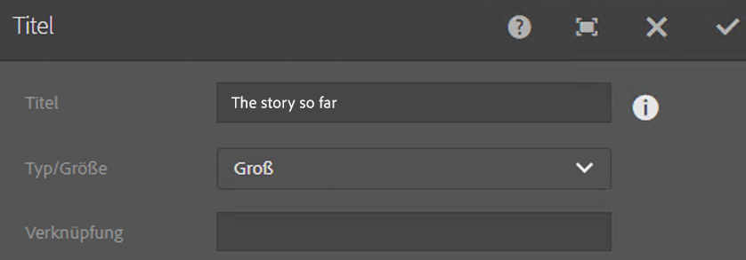

# AEM-Komponenten – Grundlagen{#aem-components-the-basics}

Wenn Sie neue Komponenten entwickeln, müssen Sie die Grundlagen ihrer Struktur und Konfiguration kennen.

Dazu müssen Sie den theoretischen Hintergrund kennenlernen und sich mit den vielfältigen Komponenten-Implementierungen in einer standardmäßigen AEM-Instanz vertraut machen. Der zuletzt genannte Ansatz wird ein Stück weit durch die Tatsache erschwert, dass AEM zwar standardmäßig eine neue, moderne Touch-optimierte Benutzeroberfläche einsetzt, die klassische Benutzeroberfläche aber nach wie vor unterstützt.

## Überblick {#overview}

In diesem Abschnitt werden zentrale Konzepte und Schwierigkeiten erläutert. Er bietet so einen guten Einstieg in die Entwicklung eigener Komponenten.

### Planung {#planning}

Bevor Sie mit der Konfiguration oder dem Code Ihrer Komponente beginnen, sollten Sie sich fragen:

* Was genau soll die neue Komponente tun?
   * Eine eindeutige Spezifikation hilft in allen Phasen der Entwicklung, des Testings und der Übergabe. Details können sich im Laufe der Zeit ändern, woraufhin die Spezifikation jedoch aktualisiert werden kann (Änderungen sollten jedoch ebenso dokumentiert werden).
* Müssen Sie die Komponente komplett neu entwickeln oder können Sie die Grundlagen von einer vorhandenen Komponente übernehmen?
   * Sie müssen das Rad nicht neu erfinden.
   * There are several mechanisms provided by AEM to allow you to inherit and extend details from another component definition including override, overlay, and the [Sling Resource Merger](/help/sites-developing/sling-resource-merger.md).
* Benötigt die Komponente eine Logik zur Auswahl/Bearbeitung des Inhalts?
   * Die Logik sollte getrennt von der Ebene der Benutzeroberfläche aufbewahrt werden. HTL dient dazu, dies sicherzustellen.
* Benötigt Ihre Komponente eine CSS-Formatierung?
   * Eine CSS-Formatierung sollte getrennt von den Komponentendefinitionen aufbewahrt werden. Legen Sie Konventionen für die Benennung der HTML-Elemente fest, damit Sie sie über externe CSS-Dateien modifizieren können.
* Welche Sicherheitsaspekte sollte ich berücksichtigen?
   * Weitere Informationen finden Sie unter [Sicherheits-Checkliste – Best Practices für die Entwicklung](/help/sites-administering/security-checklist.md#development-best-practices).

### Vergleich zwischen Touch-optimierter und klassischer Benutzeroberfläche {#touch-enabled-vs-classic-ui}

Bevor es um die Entwicklung von Komponenten geht, müssen Sie wissen, welche Benutzeroberfläche Ihre Autoren verwenden:

* **Touch-optimierte Benutzeroberfläche**
   [Die Standard-Benutzeroberfläche](/help/sites-developing/touch-ui-concepts.md) basiert auf der einheitlichen Benutzererfahrung für die Adobe Marketing Cloud, wobei die zugrunde liegenden Technologien der Benutzeroberfläche [](/help/sites-developing/touch-ui-concepts.md#coral-ui) von Coral und der Benutzeroberfläche von [Granite verwendet werden](/help/sites-developing/touch-ui-concepts.md#granite-ui).
* **Klassische Benutzeroberfläche** auf Grundlage der ExtJS-Technologie, die mit AEM 6.4 nicht mehr unterstützt wurde.

Weitere Informationen finden Sie unter [Benutzeroberflächen-Empfehlungen für Kunden](/help/sites-deploying/ui-recommendations.md).

Komponenten können je nach Implementierung die Touch-optimierte Benutzeroberfläche, die klassische oder beide Versionen unterstützen. Wenn Sie sich eine Standardinstanz ansehen, werden Ihnen auch sofort einsatzbereite Komponenten angezeigt, die ursprünglich für die klassische Benutzeroberfläche oder die touchfähige Benutzeroberfläche oder beides entwickelt wurden.

Daher werden auf dieser Seite die Grundlagen und die Erkennungsmerkmale beider Versionen abgedeckt.

>[!NOTE]
> Adobe empfiehlt die Nutzung der touchfähigen Benutzeroberfläche, um von der neuesten Technologie zu profitieren. [AEM Moderationstools&amp;(moderation-tools.md) können die Migration vereinfachen.

### Inhaltslogik und Rendering-Markup  {#content-logic-and-rendering-markup}

Es empfiehlt sich, den für Markup und Rendering zuständigen Code getrennt von dem Code zu halten, der die Logik zur Auswahl des Komponenteninhalts enthält.

Dieser Ansatz wird durch [HTL](https://docs.adobe.com/content/help/en/experience-manager-htl/using/overview.html) unterstützt, eine Vorlagensprache, die dazu dient sicherzustellen, dass eine echte Programmiersprache für die Definition der zugrunde liegenden Geschäftslogik genutzt wird. Diese (optionale) Logik wird von HTL über einen speziellen Befehl aufgerufen. Dieser Mechanismus kennzeichnet den Code, der für eine bestimmte Ansicht aufgerufen wird, und lässt bei Bedarf eine spezifische Logik für unterschiedliche Ansichten derselben Komponente zu.

### Vergleich zwischen HTL und JSP {#htl-vs-jsp}

HTL ist eine HTML-Vorlagensprache, die mit AEM 6.0 eingeführt wurde.

Die Frage, ob Sie bei der Entwicklung eigener Komponenten [HTL](https://docs.adobe.com/content/help/en/experience-manager-htl/using/overview.html) oder JSP (Java Server Pages) nutzen sollten, ist leicht zu beantworten – immerhin ist HTL nun die empfohlene Skriptsprache für AEM.

Sie können sowohl HTL als auch JSP für die Entwicklung von Komponenten für die klassische wie die Touch-optimierte Benutzeroberfläche verwenden. Zwar wird häufig angenommen, dass HTL nur für die Touch-optimierte und JSP für die klassische Benutzeroberfläche ist, doch diese Vermutung ist falsch und wohl auf die Tatsache zurückzuführen, dass die Touch-optimierte Benutzeroberfläche und HTL ungefähr zur selben Zeit in AEM integriert wurden. Da HTL nun die empfohlene Sprache ist, wird sie für neue Komponenten verwendet, die meistens für die Touch-optimierte Benutzeroberfläche ausgelegt sind.

>[!NOTE]
>
>Ausnahme hiervon sind die Foundation-Formularfelder der Granite-Benutzeroberfläche (wie sie in Dialogfeldern verwendet werden). Für sie ist die Verwendung von JSP erforderlich.

### Entwickeln eigener Komponenten {#developing-your-own-components}

Informationen zum Erstellen eigener Komponenten für die entsprechende Benutzeroberfläche finden Sie (nach dem Lesen dieser Seite) unter:

* [AEM-Komponenten für die Touch-optimierte Benutzeroberfläche](/help/sites-developing/developing-components.md)
* [AEM-Komponenten für die klassische Benutzeroberfläche](/help/sites-developing/developing-components-classic.md)

Eine schnelle Möglichkeit für den Einstieg ist das Kopieren einer vorhandenen Komponente und das anschließende Vornehmen der gewünschten Änderungen. Informationen dazu, wie Sie Ihre eigenen Komponenten erstellen und sie zum Absatzsystem hinzufügen, finden Sie unter:

* [Entwickeln von Komponenten](/help/sites-developing/developing-components-samples.md) (mit Schwerpunkt auf der Touch-optimierten Benutzeroberfläche)

### Verschieben von Komponenten in die Veröffentlichungsinstanz {#moving-components-to-the-publish-instance}

Die Komponenten, die Inhalte rendern, müssen auf derselben AEM-Instanz bereitgestellt werden wie die Inhalte. Daher müssen alle Komponenten, die zum Verfassen und Rendern von Seiten auf der Autoreninstanz genutzt werden, auf der Veröffentlichungsinstanz bereitgestellt werden. Wenn sie bereitgestellt sind, stehen diese Komponenten zum Rendern aktivierter Seiten zur Verfügung.

Mit den folgenden Tools können Sie Ihre Komponenten in die Veröffentlichungsinstanz verschieben:

* [Verwenden Sie Package Manager](/help/sites-administering/package-manager.md) , um Ihre Komponenten einem Paket hinzuzufügen und in eine andere AEM-Instanz zu verschieben.
* [Mit dem Replikationstool „Tree aktivieren“](/help/sites-authoring/publishing-pages.md#manage-publication) können Sie die Komponenten replizieren.

>[!NOTE]
>
>Mit diesen Mechanismen können Sie Ihre Komponente auch zwischen anderen Instanzen verschieben, z. B. von der Entwicklungs- zur Testinstanz.

### Komponenten, die Sie von Anfang an kennen sollten {#components-to-be-aware-of-from-the-start}

* Seite:

   * AEM has the *page* component ( `cq:Page`).
   * Dabei handelt es sich um eine bestimmte Art von Ressource, die für das Content-Management wichtig ist.
      * Eine Seite entspricht einer Webseite, die Inhalte für Ihre Website enthält.

* Absatzsysteme:

   * Das Absatzsystem ist eine wichtige Komponente einer Website, da es eine Liste an Absätzen verwaltet. Mit dem Absatzsystem werden die einzelnen Komponenten gespeichert und strukturiert, die die eigentlichen Inhalte enthalten.
   * Sie können Absätze im Absatzsystem erstellen, verschieben, kopieren und löschen.
   * Sie können auch Komponenten auswählen, die zur Verwendung in einem bestimmten Absatzsystem verfügbar sein sollen.
   * There are various paragraph systems available within a standard instance (for example `parsys`, ` [responsivegrid](/help/sites-authoring/responsive-layout.md)`).

## Struktur {#structure}

Die Struktur einer AEM-Komponente ist leistungsstark und flexibel. Die wichtigsten Aspekte sind:

* Ressourcentyp
* Komponentendefinition
* Eigenschaften und untergeordnete Knoten einer Komponente
* Dialogfelder
* Designdialogfelder
* Verfügbarkeit von Komponenten
* Komponenten und die von ihnen erstellten Inhalte

### Ressourcentyp {#resource-type}

Ein zentrales Element der Struktur ist der Ressourcentyp.

* Die Inhaltsstruktur deklariert Absichten.
* Der Ressourcentyp implementiert sie.

Dies ist eine Abstraktion, die sicherstellen soll, dass die Intention unverändert bleibt, auch wenn sich das Erscheinungsbild ändert.

### Komponentendefinition {#component-definition}

#### Komponenten – Grundlagen {#component-basics}

Die Definition einer Komponente lässt sich wie folgt aufschlüsseln:

* AEM-Komponenten basieren auf [Sling](https://sling.apache.org/documentation.html).
* AEM-Komponenten befinden sich (in der Regel) unter:

   * HTL: `/libs/wcm/foundation/components`
   * JSP: `/libs/foundation/components`

* Projekt- bzw. Website-spezifische Komponenten befinden sich (in der Regel) unter:

   * `/apps/<myApp>/components`

* AEM-Standardkomponenten sind als `cq:Component` definiert und haben die folgenden zentralen Elemente:

   * jcr-Eigenschaften:

      A list of jcr properties; these are variable and some may be optional though the basic structure of a component node, its properties and subnodes are defined by the `cq:Component` definition

   * Ressourcen:

      Diese definieren Statische Element, die von der Komponente verwendet werden.

   * Skripte:
   werden verwendet, um das Verhalten der resultierenden Instanz der Komponente zu implementieren.

* **Stammknoten**:

   * `<mycomponent> (cq:Component)` - Hierarchie-Knoten der Komponente.

* **Wichtige Eigenschaften**:

   * `jcr:title` – Komponententitel; wird beispielsweise als Kennzeichnung genutzt, wenn die Komponente im Komponenten-Browser oder Sidekick aufgeführt wird
   * `jcr:description` – Beschreibung der Komponente; kann als Mouseover-Hinweis im Komponenten-Browser oder Sidekick genutzt werden
   * Klassische Benutzeroberfläche:

      * `icon.png` - Symbol für diese Komponente.
      * `thumbnail.png` – Bild, das angezeigt wird, wenn diese Komponente im Absatzsystem aufgeführt wird
   * Touch-optimierte Benutzeroberfläche

      * Detaillierte Informationen finden Sie unter [Komponentensymbol in der Touch-optimierten Benutzeroberfläche](/help/sites-developing/components-basics.md#component-icon-in-touch-ui).


* **Wichtige untergeordnete Knoten**:

   * `cq:editConfig (cq:EditConfig)` - Definiert die Bearbeitungseigenschaften der Komponente und ermöglicht die Anzeige der Komponente im Komponenten-Browser oder Sidekick.

      Hinweis: Wenn die Komponente über ein Dialogfeld verfügt, wird sie automatisch im Komponenten-Browser oder Sidekick aufgeführt, selbst wenn die cq:editConfig nicht vorhanden ist.

   * `cq:childEditConfig (cq:EditConfig)` - Steuert die Aspekte der Autorenbenutzeroberfläche für untergeordnete Komponenten, die keine eigenen definieren `cq:editConfig`.
   * Touch-optimierte Benutzeroberfläche:

      * `cq:dialog` ( `nt:unstructured`) - Dialog für diese Komponente. Definiert die Oberfläche, über die Benutzer die Komponente konfigurieren und/oder Inhalte bearbeiten können.
      * `cq:design_dialog` ( `nt:unstructured`) - Designbearbeitung für diese Komponente
   * Klassische Benutzeroberfläche:

      * `dialog` ( `cq:Dialog`) - Dialog für diese Komponente. Definiert die Oberfläche, über die Benutzer die Komponente konfigurieren und/oder Inhalte bearbeiten können.
      * `design_dialog` ( `cq:Dialog`) - Designbearbeitung für diese Komponente.


#### Komponentensymbol in der Touch-optimierten Benutzeroberfläche {#component-icon-in-touch-ui}

Das Symbol oder die Abkürzung für die Komponente wird über die JCR-Eigenschaften der Komponente definiert, wenn die Komponente vom Entwickler erstellt wird. Diese Eigenschaften werden in der folgenden Reihenfolge ausgewertet und die erste erkannte gültige Eigenschaft wird verwendet.

1. `cq:icon` - String-Eigenschaft, die auf ein Standardsymbol in der [Coral UI-Bibliothek](https://helpx.adobe.com/experience-manager/6-5/sites/developing/using/reference-materials/coral-ui/coralui3/Coral.Icon.html) verweist und im Komponenten-Browser angezeigt wird
   * Verwenden Sie den Wert des HTML-Attributs des Coral-Symbols.
1. `abbreviation` - String-Eigenschaft zum Anpassen der Abkürzung des Komponentennamens im Komponenten-Browser
   * Die Abkürzung sollte auf zwei Zeichen beschränkt sein.
   * Bei einem leeren String wird die Abkürzung aus den ersten beiden Buchstaben der Eigenschaft `jcr:title` gebildet.
      * Beispiel: „Gr“ für „Grafik“.
      * Zum Erstellen der Abkürzung wird der lokalisierte Titel verwendet.
   * Die Abkürzung wird nur übersetzt, wenn die Komponente die Eigenschaft `abbreviation_commentI18n` aufweist, die dann als Anweisung für eine Übersetzung genutzt wird.
1. `cq:icon.png` oder `cq:icon.svg` - Symbol für diese Komponente, das im Komponenten-Browser angezeigt wird
   * Symbole von Standardkomponenten haben eine Größe von 20 x 20 Pixeln.
      * Größere Symbole werden verkleinert (clientseitig).
   * Die empfohlene Farbe ist rgb(112, 112, 112) > #707070
   * Der Hintergrund von Symbolen von Standardkomponenten ist transparent.
   * Only `.png` and `.svg` files are supported.
   * If importing from the file system via Eclipse plugin, filenames need to be esacaped as `_cq_icon.png` or `_cq_icon.svg` for example.
   * `.png` hat Vorrang, `.svg` wenn beide vorhanden sind

If none of the above properties ( `cq:icon`, `abbreviation`, `cq:icon.png` or `cq:icon.svg`) are found on the component:

* Das System sucht nach denselben Eigenschaften bei den übergeordneten Komponenten, die der Eigenschaft `sling:resourceSuperType` folgen.
* If nothing or an empty abbreviation is found at the super component level, the system will build the abbreviation from the first letters of the `jcr:title` property of the current component.

Um die Vererbung von Symbolen von übergeordneten Komponenten zu deaktivieren, legen Sie eine leere Eigenschaft `abbreviation` für die Komponente fest. Das Standardverhalten wird daraufhin erneut aktiviert.

The [Component Console](/help/sites-authoring/default-components-console.md#component-details) displays how the icon for a particular component is defined.

#### Beispiel: SVG-Symbol {#svg-icon-example}

```xml
<?xml version="1.0" encoding="utf-8"?>
<!DOCTYPE svg PUBLIC "-//W3C//DTD SVG 1.1//EN" "https://www.w3.org/Graphics/SVG/1.1/DTD/svg11.dtd">
<svg version="1.1" id="Layer_1" xmlns="https://www.w3.org/2000/svg" xmlns:xlink="https://www.w3.org/1999/xlink" x="0px" y="0px"
     width="20px" height="20px" viewBox="0 0 20 20" enable-background="new 0 0 20 20" xml:space="preserve">
    <ellipse cx="5" cy="5" rx="3" ry="3" fill="#707070"/>
    <ellipse cx="15" cy="5" rx="4" ry="4" fill="#707070"/>
    <ellipse cx="5" cy="15" rx="5" ry="5" fill="#707070"/>
    <ellipse cx="15" cy="15" rx="4" ry="4" fill="#707070"/>
</svg>
```

### Eigenschaften und untergeordnete Knoten einer Komponente {#properties-and-child-nodes-of-a-component}

Viele der Knoten/Eigenschaften, die für die Definition einer Komponente erforderlich sind, sind in beiden Benutzeroberflächen zu finden. Die Unterschiede bleiben unabhängig, sodass Ihre Komponente in beiden Umgebungen funktioniert.

Eine Komponente ist ein Knoten des Typs `cq:Component` mit den folgenden Eigenschaften und untergeordneten Knoten:

<table>
 <tbody>
  <tr>
   <td><strong>Name <br /> </strong></td>
   <td><strong>Typ <br /> </strong></td>
   <td><strong>Beschreibung <br /> </strong></td>
  </tr>
  <tr>
   <td>.<br /> </td>
   <td><code>cq:Component</code></td>
   <td>Aktuelle Komponente. A component is of node type <code>cq:Component</code>.<br /> </td>
  </tr>
  <tr>
   <td><code>componentGroup</code></td>
   <td><code>String</code></td>
   <td>Gruppe, aus der die Komponente im Komponenten-Browser (Touch-optimierte Benutzeroberfläche) oder Sidekick (klassische Benutzeroberfläche) ausgewählt werden kann.<br /> Ein Wert von <code>.hidden</code> wird für Komponenten verwendet, die nicht über die Benutzeroberfläche ausgewählt werden können, wie z. B. die eigentlichen Absatzsysteme.</td>
  </tr>
  <tr>
   <td><code>cq:isContainer</code></td>
   <td><code>Boolean</code></td>
   <td>Gibt an, ob es sich bei der Komponente um eine Containerkomponente handelt, die andere Komponenten wie ein Absatzsystem enthalten kann.</td>
  </tr>
  <tr>
   <td> </td>
   <td> </td>
   <td> </td>
  </tr>
  <tr>
   <td><code>cq:dialog</code></td>
   <td><code>nt:unstructured</code> </td>
   <td>Definition des Bearbeitungsdialogfelds für die Touch-optimierte Benutzeroberfläche</td>
  </tr>
  <tr>
   <td><code>dialog</code></td>
   <td><code>cq:Dialog</code></td>
   <td>Definition des Bearbeitungsdialogfelds für die klassische Benutzeroberfläche</td>
  </tr>
  <tr>
   <td><code>cq:design_dialog</code></td>
   <td><code>nt:unstructured</code></td>
   <td>Definition des Designdialogfelds für die Touch-optimierte Benutzeroberfläche</td>
  </tr>
  <tr>
   <td><code>design_dialog</code></td>
   <td><code>cq:Dialog </code></td>
   <td>Definition des Designdialogfelds für die klassische Benutzeroberfläche<br /> </td>
  </tr>
  <tr>
   <td><code>dialogPath</code></td>
   <td><code>String</code></td>
   <td>Pfad zu einem Dialogfeld, wenn die Komponente keinen Dialogfeldknoten aufweist<br /> </td>
  </tr>
  <tr>
   <td> </td>
   <td> </td>
   <td> </td>
  </tr>
  <tr>
   <td><code>cq:cellName</code></td>
   <td><code>String</code></td>
   <td>Wenn diese Eigenschaft festgelegt ist, dient sie als Zellen-ID. Weitere Informationen finden Sie im Artikel <a href="https://helpx.adobe.com/experience-manager/kb/DesigneCellId.html">Erstellung von Design-Zellen-IDs</a> in der Wissensdatenbank.<br /> </td>
  </tr>
  <tr>
   <td><code>cq:childEditConfig</code></td>
   <td><code>cq:EditConfig</code></td>
   <td>Wenn die Komponente ein Container ist, z. B. ein Absatzsystem, steuert diese Eigenschaft die Bearbeitungskonfiguration der untergeordneten Knoten.<br /> </td>
  </tr>
  <tr>
   <td><code>cq:editConfig</code></td>
   <td><code>cq:EditConfig</code></td>
   <td><a href="#edit-behavior">Bearbeitungskonfiguration der Komponente</a><br /> </td>
  </tr>
  <tr>
   <td><code>cq:htmlTag</code></td>
   <td><code>nt:unstructured </code></td>
   <td>Gibt zusätzliche Tag-Attribute zurück, die zum umgebenden HTML-Tag hinzugefügt werden. Ermöglicht das Hinzufügen von Attributen zu den automatisch generierten div-Tags.</td>
  </tr>
  <tr>
   <td><code>cq:noDecoration</code></td>
   <td><code>Boolean</code></td>
   <td>Bei „true“ wird die Komponente nicht mit automatisch erstellten div- und CSS-Klassen gerendert.<br /> </td>
  </tr>
  <tr>
   <td><code>cq:template</code></td>
   <td><code>nt:unstructured</code></td>
   <td>Wenn vorhanden, wird dieser Knoten als Inhaltsvorlage genutzt, wenn die Komponente vom Komponenten-Browser oder Sidekick hinzugefügt wird.</td>
  </tr>
  <tr>
   <td><code>cq:templatePath</code></td>
   <td><code>String</code></td>
   <td>Pfad zu einem Knoten, der als Inhaltsvorlage genutzt wird, wenn die Komponente vom Komponenten-Browser oder Sidekick hinzugefügt wird. Es muss sich hierbei um einen absoluten Pfad handeln, keinen relativen zum Komponentenknoten.<br /> Wenn Sie keine bereits an anderer Stelle verfügbaren Inhalte wiederverwenden möchten, ist dies nicht erforderlich und <code>cq:template</code> ausreichend (siehe unten).</td>
  </tr>
  <tr>
   <td><code>jcr:created</code></td>
   <td><code>Date</code></td>
   <td>Datum der Erstellung der Komponente<br /> </td>
  </tr>
  <tr>
   <td><code>jcr:description</code></td>
   <td><code>String</code></td>
   <td>Beschreibung der Komponente<br /> </td>
  </tr>
  <tr>
   <td><code>jcr:title</code></td>
   <td><code>String</code></td>
   <td>Titel der Komponente<br /> </td>
  </tr>
  <tr>
   <td><code>sling:resourceSuperType</code></td>
   <td><code>String</code></td>
   <td>Wenn dieser Wert festgelegt ist, erbt die Komponente von dieser Komponente.<br /> </td>
  </tr>
  <tr>
   <td><code>virtual</code></td>
   <td><code>sling:Folder</code></td>
   <td>Aktiviert das Erstellen von virtuellen Komponenten. Ein Beispiel finden Sie in der Komponente "Kontakt" unter:<br /> <code>/libs/foundation/components/profile/form/contact</code></td>
  </tr>
  <tr>
   <td><code>&lt;breadcrumb.jsp&gt;</code></td>
   <td><code>nt:file</code> </td>
   <td>Skriptdatei<br /> </td>
  </tr>
  <tr>
   <td><code>icon.png</code></td>
   <td><code>nt:file</code></td>
   <td>Symbol der Komponente, wird neben dem Titel im Sidekick angezeigt<br /> </td>
  </tr>
  <tr>
   <td><code>thumbnail.png</code></td>
   <td><code>nt:file</code></td>
   <td>Optionale Miniaturansicht, die angezeigt wird, wenn die Komponente aus dem Sidekick an ihre Position gezogen wird.<br /> </td>
  </tr>
 </tbody>
</table>

In der **Text**-Komponente (beide Versionen) finden sich die folgenden Elemente:

* HTL ( `/libs/wcm/foundation/components/text`)

   

* JSP ( `/libs/foundation/components/text`)

   

Zu den wichtigen Eigenschaften gehören:

* `jcr:title` – Titel der Komponente; dient zur Identifizierung der Komponente, z. B. in der Komponentenliste im Komponenten-Browser oder Sidekick
* `jcr:description` – Beschreibung der Komponente; kann als Mouseover-Hinweis in der Komponentenliste im Sidekick genutzt werden
* `sling:resourceSuperType` – gibt den Pfad der Vererbung bei der Erweiterung einer Komponente an (durch Überschreiben einer Definition)

Zu den wichtigen untergeordneten Knoten gehören:

* `cq:editConfig` ( `cq:EditConfig`) - dies kontrolliert visuelle Aspekte; Sie kann beispielsweise das Erscheinungsbild einer Leiste oder eines Widgets definieren oder benutzerdefinierte Steuerelemente hinzufügen
* `cq:childEditConfig` ( `cq:EditConfig`) - Diese Funktion steuert die visuellen Aspekte für untergeordnete Komponenten, die keine eigenen Definitionen haben.
* Touch-optimierte Benutzeroberfläche:
   * `cq:dialog` ( `nt:unstructured`) - definiert das Dialogfeld zum Bearbeiten des Inhalts dieser Komponente
   * `cq:design_dialog` ( `nt:unstructured`) - gibt die Entwurfsbearbeitungsoptionen für diese Komponente an
* Klassische Benutzeroberfläche:
   * `dialog` ( `cq:Dialog`) - Definiert das Dialogfeld zum Bearbeiten des Inhalts dieser Komponente (spezifisch für die klassische Benutzeroberfläche)
   * `design_dialog` ( `cq:Dialog`) - gibt die Entwurfsbearbeitungsoptionen für diese Komponente an
   * `icon.png` – Grafikdatei, die als Symbol für die Komponente im Sidekick genutzt werden soll
   * `thumbnail.png` – Grafikdatei, die als Miniaturansicht der Komponente beim Ziehen aus dem Sidekick genutzt werden soll

### Dialogfelder {#dialogs}

Dialogfelder sind ein wichtiges Element einer Komponente: Sie stellen den Autoren eine Oberfläche für die Konfiguration und für Eingaben für diese Komponente bereit.

Je nach Komplexität der Komponente benötigt das Dialogfeld eine Registerkarte oder mehrere, um das Dialogfeld übersichtlich zu gestalten und die Eingabefelder zu ordnen.

Dialogdefinitionen sind spezifisch für jede Benutzeroberfläche.

>[!NOTE]
>
>* Zum Zweck der Kompatibilität kann die Touch-optimierte Benutzeroberfläche die Definition eines Dialogfelds der klassischen Benutzeroberfläche nutzen, wenn kein Dialogfeld für die Touch-optimierte Benutzeroberfläche definiert wurde.
>* Das [Dialogkonvertierungs-Tool](/help/sites-developing/dialog-conversion.md) unterstützt Sie beim Erweitern/Konvertieren von Komponenten, bei denen nur Dialogfelder für die klassische Benutzeroberfläche festgelegt wurden.
>


* Touch-optimierte Benutzeroberfläche
   * `cq:dialog` ( `nt:unstructured`) nodes:
      * definieren das Dialogfeld für die Bearbeitung von Inhalten dieser Komponente
      * speziell für die Touch-optimierte Benutzeroberfläche
      * werden mit Komponenten der Granite-Benutzeroberfläche definiert
      * have a property `sling:resourceType`, as standard Sling content structure
      * können die Eigenschaft `helpPath` aufweisen, um die kontextabhängige Hilferessource festzulegen (absoluter oder relativer Pfad), auf die bei Auswahl des Hilfesymbols ausgewählt ist.
         * Bei standardmäßigen Komponenten verweist diese Eigenschaft häufig auf eine Seite in der Dokumentation.
         * Wenn kein `helpPath` festgelegt ist, wird die Standard-URL (Übersichtsseite der Dokumentation) angezeigt.
   

   In diesem Dialogfeld werden einzelne Felder definiert:

   

* Klassische Benutzeroberfläche
   * `dialog` ( `cq:Dialog`) nodes
      * definieren das Dialogfeld für die Bearbeitung von Inhalten dieser Komponente
      * speziell für die klassische Benutzeroberfläche
      * werden mit ExtJS-Widgets definiert
      * weisen die Eigenschaft `xtype` auf, die auf ExtJS verweist
      * können die Eigenschaft `helpPath` aufweisen, um die kontextabhängige Hilferessource festzulegen (absoluter oder relativer Pfad), auf die bei Klicken auf die Schaltfläche **Hilfe** zugegriffen wird.
         * Bei standardmäßigen Komponenten verweist diese Eigenschaft häufig auf eine Seite in der Dokumentation.
         * Wenn kein `helpPath` festgelegt ist, wird die Standard-URL (Übersichtsseite der Dokumentation) angezeigt.
   

   In diesem Dialogfeld werden einzelne Felder definiert:

   

   In einem klassischen Dialogfeld:

   * können Sie Dialogfeld wie `cq:Dialog` erstellen, die eine einzige Registerkarte aufweisen, wie in der Text-Komponente. Wenn Sie mehrere Registerkarten benötigen, wie in der Textbild-Komponente, können Sie das Dialogfeld als `cq:TabPanel` definieren.
   * a `cq:WidgetCollection` ( `items`) is used to provide a base for either input fields ( `cq:Widget`) or further tabs ( `cq:Widget`). Diese Hierarchie kann erweitert werden.


### Designdialogfelder {#design-dialogs}

Designdialogfelder ähneln den Dialogfeldern, die zum Bearbeiten und Konfigurieren von Inhalten genutzt werden. Sie stellen die Oberfläche für Autoren zum Konfigurieren bereit und liefern Designinformationen für diese Komponente.

[Designdialogfelder sind im Designmodus verfügbar](/help/sites-authoring/default-components-designmode.md), wobei sie nicht für alle Komponenten benötigt werden. Beispielsweise verfügen sowohl **Titel** als auch **Bild** über Designdialogfelder, **Text** dagegen nicht.

Das Designdialogfeld für das Absatzsystem (z. B. parsys) ist ein Sonderfall: Benutzer können damit andere Komponenten festlegen, die auf der Seite zur Auswahl (über den Komponenten-Browser oder Sidekick) verfügbar sein sollen.

### Hinzufügen einer Komponente zum Absatzsystem {#adding-your-component-to-the-paragraph-system}

Nachdem eine Komponente definiert wurde, muss sie zur Verwendung bereitgestellt werden. Um eine Komponente zur Verwendung in einem Absatzsystem bereitzustellen, haben Sie zwei Möglichkeiten:

1. Öffnen Sie den [Designmodus](/help/sites-authoring/default-components-designmode.md) für eine Seite und aktivieren Sie die benötigte Komponente.
1. Fügen Sie die benötigte(n) Komponente(n) zur Eigenschaft `components` der Vorlagendefinition unter folgendem Pfad hinzu:

   `/etc/designs/<*yourProject*>/jcr:content/<*yourTemplate*>/par`

   Ein Beispiel finden Sie unter:

   `/etc/designs/geometrixx/jcr:content/contentpage/par`

   

### Komponenten und die von ihnen erstellten Inhalte {#components-and-the-content-they-create}

If we create and configure an instance of the **Title** component on the page: `<content-path>/Prototype.html`

* Touch-optimierte Benutzeroberfläche

   

* Klassische Benutzeroberfläche

   

Dann sehen wir die Struktur des Inhalts, der innerhalb des Repositorys erstellt wurde:


Sehen Sie sich besonders den tatsächlichen Text für eine **Titel**-Komponente an:

* Die Definition weist (bei beiden Benutzeroberflächen) die Eigenschaft `name`= `./jcr:title`

   * `/libs/foundation/components/title/cq:dialog/content/items/column/items/title`
   * `/libs/foundation/components/title/dialog/items/title`

* Innerhalb des Inhalts wird dadurch die Eigenschaft `jcr:title` erstellt, die den Inhalt des Autors enthält.

Die definierten Eigenschaften sind von den einzelnen Definitionen abhängig. Zwar können sie komplexer als oben dargestellt sein, folgen aber dennoch denselben grundlegenden Prinzipien.

## Komponentenhierarchie und Vererbung {#component-hierarchy-and-inheritance}

Komponenten in AEM unterliegen drei verschiedenen Hierarchien:

* **Ressourcentyp-Hierarchie**

   Dies wird zum Erweitern von Komponenten mithilfe der Eigenschaft verwendet `sling:resourceSuperType`. Dies aktiviert die Vererbung für die Komponente. Beispielsweise erbt eine Textkomponente verschiedene Attribute von der Standardkomponente.

   * Skripte (aufgelöst durch Sling)
   * Dialogfelder
   * Beschreibungen (darunter Miniaturansichten, Symbole usw.)

* **Container-Hierarchie**

   Dies wird zum Füllen der Konfigurationseinstellungen für die untergeordnete Komponente verwendet und wird meist in einem Parsys-Szenario verwendet.

   So können Sie beispielsweise Konfigurationseinstellungen für die Schaltflächen auf der Bearbeitungsleiste, das Layout von Steuerungen (Bearbeitungsleiste, Rollover) oder von Dialogfeldern (eingebunden, unverankert) auf der übergeordneten Komponente definieren und an die untergeordneten Komponenten übergeben.

   Configuration settings (related to edit functionality) in `cq:editConfig` and `cq:childEditConfig` are propagated.

* **Hierarchie einschließen**

   Dies wird zur Laufzeit durch die Sequenz von Includes auferlegt.

   Diese Hierarchie wird vom Designer verwendet, der als Basis für die verschiedenen Designaspekte des Rendering fungiert; einschließlich Layoutangaben, CSS-Informationen, verfügbaren Komponenten in einem parsys usw.

## Bearbeitungsverhalten {#edit-behavior}

In diesem Abschnitt wird beschrieben, wie Sie das Bearbeitungsverhalten einer Komponente konfigurieren. Hierzu zählen Attribute wie Aktionen, die für die Komponente verfügbar sind, Eigenschaften des Kontext-Editors und des Listeners in Zusammenhang mit Ereignissen bei der Komponente.

Die Konfiguration gilt dabei für die Touch-optimierte wie die klassische Benutzeroberfläche, wenn auch mit gewissen Unterschieden.

Um das Bearbeitungsverhalten einer Komponente zu konfigurieren, fügen Sie einen `cq:editConfig`-Knoten des Typs `cq:EditConfig` unter dem Komponentenknoten (des Typs `cq:Component`) hinzu sowie spezifische Eigenschaften und untergeordnete Knoten. Die folgenden Funktionen und untergeordneten Knoten sind verfügbar:

* [ `cq:editConfig` Knoteneigenschaften](#configuring-with-cq-editconfig-properties):

   * `cq:actions` ( `String array`) definiert die Aktionen, die für die Komponente ausgeführt werden können.
   * `cq:layout` ( `String`) : definiert, wie die Komponente in der klassischen Benutzeroberfläche bearbeitet wird.
   * `cq:dialogMode` ( `String`) legt fest, wie das Komponentendialogfeld in der klassischen Benutzeroberfläche geöffnet wird

      * In der Touch-optimierten Benutzeroberfläche sind die Dialogfelder im Desktopmodus immer unverankert und werden im mobilen Modus immer im Vollbild geöffnet.
   * `cq:emptyText` ( `String`) definiert Text, der angezeigt wird, wenn kein sichtbarer Inhalt vorhanden ist.
   * `cq:inherit` ( `Boolean`) definiert, ob fehlende Werte von der Komponente geerbt werden, von der sie übernommen wird.
   * `dialogLayout` (String): legt fest, wie das Dialogfeld geöffnet werden soll


* [ `cq:editConfig` untergeordnete Knoten](#configuring-with-cq-editconfig-child-nodes):

   * `cq:dropTargets` (Knotentyp `nt:unstructured`): definiert eine Liste von Dropdown-Zielgruppen, die ein Ablegen aus einem Asset der Inhaltssuche akzeptieren können

      * Mehrere Ablageziele sind nur in der klassischen Benutzeroberfläche verfügbar.
      * In der Touch-optimierten Benutzeroberfläche ist nur ein einziges Ablageziel zulässig.
   * `cq:actionConfigs` (Knotentyp `nt:unstructured`): definiert eine Liste neuer Aktionen, die an die Liste &quot;cq:actions&quot;angehängt werden.
   * `cq:formParameters` (Knotentyp `nt:unstructured`): definiert zusätzliche Parameter, die dem Dialogfeld hinzugefügt werden.
   * `cq:inplaceEditing` (Knotentyp `cq:InplaceEditingConfig`): definiert eine ersetzende Bearbeitungskonfiguration für die Komponente.
   * `cq:listeners` (Knotentyp `cq:EditListenersConfig`): definiert, was vor oder nach einer Aktion für die Komponente geschieht.


>[!NOTE]
>
>Auf dieser Seite wird ein Knoten (Eigenschaften und untergeordnete Knoten) als XML dargestellt, wie im folgenden Beispiel gezeigt.

```
<jcr:root xmlns:cq="https://www.day.com/jcr/cq/1.0" xmlns:jcr="https://www.jcp.org/jcr/1.0"
    cq:actions="[edit]"
    cq:dialogMode="floating"
    cq:layout="editbar"
    jcr:primaryType="cq:EditConfig">
    <cq:listeners
        jcr:primaryType="cq:EditListenersConfig"
        afteredit="REFRESH_PAGE"/>
</jcr:root>
```

Es gibt zahlreiche vorhandene Konfigurationen im Repository. Sie können einfach nach bestimmten Eigenschaften oder untergeordneten Knoten suchen:

* To look for a property of the `cq:editConfig` node, e.g. `cq:actions`, you can use the Query tool in **CRXDE Lite** and search with the following XPath query string:

   `//element(cq:editConfig, cq:EditConfig)[@cq:actions]`

* To look for a child node of `cq:editConfig`, e.g. you can search for `cq:dropTargets`, which is of type `cq:DropTargetConfig`; you can use the Query tool in** CRXDE Lite** and search with the following XPath query string:

   `//element(cq:dropTargets, cq:DropTargetConfig)`

### Konfigurieren mit cq:EditConfig-Eigenschaften {#configuring-with-cq-editconfig-properties}

### cq:actions {#cq-actions}

The `cq:actions` property ( `String array`) defines one or several actions that can be performed on the component. Folgende Werte stehen für die Konfiguration zur Verfügung:

<table>
 <tbody>
  <tr>
   <td><strong>Eigenschaftswert</strong></td>
   <td><strong>Beschreibung</strong></td>
  </tr>
  <tr>
   <td><code>text:&lt;some text&gt;</code></td>
   <td>Zeigt den statischen Textwert &lt;beliebiger Text&gt;<br /> Nur in der klassischen Benutzeroberfläche sichtbar. Die Touch-optimierte Benutzeroberfläche zeigt keine Aktionen in einem Kontextmenü an; daher trifft dieser Eigenschaftswert für sie nicht zu.</td>
  </tr>
  <tr>
   <td>-</td>
   <td>Fügt einen Platzhalter hinzu.<br /> Nur in klassischer Benutzeroberfläche sichtbar. Die Touch-optimierte Benutzeroberfläche zeigt keine Aktionen in einem Kontextmenü an; daher trifft dieser Eigenschaftswert für sie nicht zu.</td>
  </tr>
  <tr>
   <td><code>edit</code></td>
   <td>Fügt eine Schaltfläche zum Bearbeiten der Komponente hinzu.</td>
  </tr>
      <tr>
    <td><code>editannotate</code></td>
    <td>Fügt eine Schaltfläche zum Bearbeiten der Komponente und zum Zulassen von <a href="/help/sites-authoring/annotations.md">Anmerkungen</a>hinzu.</td>
   </tr>
  <tr>
   <td><code>delete</code></td>
   <td>Fügt eine Schaltfläche zum Löschen der Komponente hinzu</td>
  </tr>
  <tr>
   <td><code>insert</code></td>
   <td>Fügt eine Schaltfläche hinzu, um eine neue Komponente vor der aktuellen Komponente einzufügen</td>
  </tr>
  <tr>
   <td><code>copymove</code></td>
   <td>Fügt eine Schaltfläche zum Kopieren und Ausschneiden der Komponente hinzu.</td>
  </tr>
 </tbody>
</table>

Die folgende Konfiguration fügt eine Bearbeitungsschaltfläche, einen Abstand, eine Lösch- und eine Einfügungsschaltfläche zu der Bearbeitungsleiste der Komponente hinzu:

```
<jcr:root xmlns:cq="https://www.day.com/jcr/cq/1.0" xmlns:jcr="https://www.jcp.org/jcr/1.0"
    cq:actions="[edit,-,delete,insert]"
    cq:layout="editbar"
    jcr:primaryType="cq:EditConfig"/>
```

Die folgende Konfiguration fügt den Text „Inherited Configurations from Base Framework“ (Vom Basis-Framework geerbte Konfigurationen) zur Bearbeitungsleiste der Komponente hinzu:

```
<jcr:root xmlns:cq="https://www.day.com/jcr/cq/1.0" xmlns:jcr="https://www.jcp.org/jcr/1.0"
    cq:actions="[text:Inherited Configurations from Base Framework]"
    cq:layout="editbar"
    jcr:primaryType="cq:EditConfig"/>
```

### cq:layout (nur klassische Benutzeroberfläche) {#cq-layout-classic-ui-only}

The `cq:layout` property ( `String`) defines how the component can be edited in the classic UI. Die folgenden Werte sind verfügbar:

<table>
 <tbody>
  <tr>
   <td><strong>Eigenschaftswert</strong></td>
   <td><strong>Beschreibung</strong></td>
  </tr>
  <tr>
   <td><code>rollover</code></td>
   <td>Standardwert. Die Komponentenausgabe ist "on mouse over" über Klicks und/oder Kontextmenü zugänglich.<br /> Für erweiterte Verwendungen beachten Sie, dass das entsprechende clientseitige Objekt: <code>CQ.wcm.EditRollover</code>.</td>
  </tr>
  <tr>
   <td><code>editbar</code></td>
   <td>Auf die Komponentenausgabe kann über eine Symbolleiste zugegriffen werden.<br /> Für erweiterte Verwendungen beachten Sie, dass das entsprechende clientseitige Objekt: <code>CQ.wcm.EditBar</code>.</td>
  </tr>
  <tr>
   <td><code>auto</code></td>
   <td>Die Auswahl bleibt dem clientseitigen Code überlassen.</td>
  </tr>
 </tbody>
</table>

>[!NOTE]
>
>Die Konzepte von rollover und editbar können in der Touch-optimierten Benutzeroberfläche nicht angewendet werden.

Die folgenden Konfigurationen fügen eine Bearbeitungsschaltfläche zur Bearbeitungsleiste der Komponente hinzu:

```
<jcr:root xmlns:cq="https://www.day.com/jcr/cq/1.0" xmlns:jcr="https://www.jcp.org/jcr/1.0"
    cq:actions="[edit]"
    cq:layout="editbar"
    jcr:primaryType="cq:EditConfig">
</jcr:root>
```

### cq:dialogMode (nur klassische Benutzeroberfläche) {#cq-dialogmode-classic-ui-only}

Sie können die Komponente mit einem Dialogfeld „Bearbeiten“ verknüpfen. The `cq:dialogMode` property ( `String`) defines how the component dialog will be opened in the classic UI. Die folgenden Werte sind verfügbar:

<table>
 <tbody>
  <tr>
   <td><strong>Eigenschaftswert</strong></td>
   <td><strong>Beschreibung</strong></td>
  </tr>
  <tr>
   <td><code>floating</code></td>
   <td>Das Dialogfeld ist schwebend.<br /> </td>
  </tr>
  <tr>
   <td><code>inline</code></td>
   <td>(Standardwert). Das Dialogfeld wird über der Komponente verankert.<br /> </td>
  </tr>
  <tr>
   <td><code>auto</code></td>
   <td>Wenn die Komponentenbreite kleiner als der clientseitige <code>CQ.themes.wcm.EditBase.INLINE_MINIMUM_WIDTH</code> Wert ist, ist das Dialogfeld schwebend, andernfalls ist es inline.</td>
  </tr>
 </tbody>
</table>

>[!NOTE]
>
>In der Touch-optimierten Benutzeroberfläche sind die Dialogfelder im Desktopmodus immer unverankert und werden im mobilen Modus immer im Vollbild geöffnet.

Die folgende Konfiguration definiert eine Bearbeitungsleiste mit einer Bearbeitungsschaltfläche und einem unverankerten Dialogfeld:

```
<jcr:root xmlns:cq="https://www.day.com/jcr/cq/1.0" xmlns:jcr="https://www.jcp.org/jcr/1.0"
    cq:actions="[edit]"
    cq:dialogMode="floating"
    cq:layout="editbar"
    jcr:primaryType="cq:EditConfig">
</jcr:root>
```

### cq:emptyText {#cq-emptytext}

The `cq:emptyText` property ( `String`) defines text that is displayed when no visual content is present. Standardwert ist: `Drag components or assets here`.

### cq:inherit {#cq-inherit}

The `cq:inherit` property ( `boolean`) defines whether missing values are inherited from the component that it inherits from. Standardwert ist `false`.

### dialogLayout {#dialoglayout}

Die Eigenschaft `dialogLayout` legt fest, wie ein Dialogfeld standardmäßig geöffnet werden soll.

* A value of `fullscreen` opens the dialog in full screen.
* Bei einem leeren Wert oder einer fehlenden Eigenschaft wird das Dialogfeld standardmäßig normal geöffnet.
* Hinweis: Benutzer können den Vollbildmodus jederzeit innerhalb des Dialogfelds aktivieren.
* Gilt nicht für die klassische Benutzeroberfläche.

### Konfigurieren mit untergeordneten cq:EditConfig-Knoten {#configuring-with-cq-editconfig-child-nodes}

### cq:dropTargets {#cq-droptargets}

The `cq:dropTargets` node (node type `nt:unstructured`) defines a list of drop targets that can accept a drop from an asset dragged from the content finder. Er dient als Sammlung von Knoten des Typs `cq:DropTargetConfig`.

>[!NOTE]
>
>Mehrere Ablageziele sind nur in der klassischen Benutzeroberfläche verfügbar.
>
>In der Touch-optimierten Benutzeroberfläche wird nur das erste Ziel verwendet.

Each child node of type `cq:DropTargetConfig` defines a drop target in the component. Der Knotenname ist wichtig, da er im JSP wie folgt verwendet werden muss, um den CSS-Klassennamen zu erzeugen, der dem DOM-Element zugewiesen wird, das das effektive Ablageziel ist:

```
<drop target css class> = <drag and drop prefix> +
 <node name of the drop target in the edit configuration>
```

Die `<drag and drop prefix>` wird durch die Java-Eigenschaft definiert:

`com.day.cq.wcm.api.components.DropTarget.CSS_CLASS_PREFIX`.

For example, the class name is defined as follows in the JSP of the Download component
( `/libs/foundation/components/download/download.jsp`), where `file` is the node name of the drop target in the edit configuration of the Download component:

`String ddClassName = DropTarget.CSS_CLASS_PREFIX + "file";`

Der Knoten des Typs `cq:DropTargetConfig` muss die folgenden Eigenschaften aufweisen:

<table>
 <tbody>
  <tr>
   <td><strong>Eigenschaftsname</strong></td>
   <td><strong>Eigenschaftswert<br /> </strong></td>
  </tr>
  <tr>
   <td><code>accept</code></td>
   <td>Regex auf den Asset-Mime-Typ angewendet, um zu überprüfen, ob das Ablegen zulässig ist.</td>
  </tr>
  <tr>
   <td><code>groups</code></td>
   <td>Array von Dropdown-Zielpopulationen. Jede Gruppe muss mit dem Gruppentyp übereinstimmen, der in der Content Finder-Erweiterung definiert wurde und der bei den Assets angehängt ist.</td>
  </tr>
  <tr>
   <td><code>propertyName</code></td>
   <td>Name der Eigenschaft, die nach einem gültigen Ablegen aktualisiert wird.</td>
  </tr>
 </tbody>
</table>

Die folgende Konfiguration stammt aus der Download-Komponente. Sie ermöglicht es, dass jedes Asset (der MIME-Typ kann jeder beliebige String sein) aus der Gruppe `media` vom Content Finder in der Komponente abgelegt werden kann. Nach der Ablage wird die Komponenteneigenschaft `fileReference` aktualisiert:

```
    <cq:dropTargets jcr:primaryType="nt:unstructured">
        <file
            jcr:primaryType="cq:DropTargetConfig"
            accept="[.*]"
            groups="[media]"
            propertyName="./fileReference"/>
    </cq:dropTargets>
```

### cq:actionConfigs (nur klassische Benutzeroberfläche) {#cq-actionconfigs-classic-ui-only}

The `cq:actionConfigs` node (node type `nt:unstructured`) defines a list of new actions that are appended to the list defined by the `cq:actions` property. Jeder untergeordnete Knoten von `cq:actionConfigs`definiert eine Aktion, indem er ein Widget definiert.

Die folgende Beispielkonfiguration definiert eine neue Schaltfläche (mit einem Trennzeichen für die klassische Benutzeroberfläche):

* ein Trennzeichen, definiert durch den xtype `tbseparator`;

   * Dies wird nur von der klassischen Benutzeroberfläche verwendet.
   * Diese Definition wird von der Touch-optimierten Benutzeroberfläche ignoriert, weil xtypes ignoriert werden (und Trennzeichen unnötig sind, da die Aktionssymbolleiste in der Touch-optimierten Benutzeroberfläche anders aufgebaut ist).

* a button named **Manage comments** that runs the handler function `CQ_collab_forum_openCollabAdmin()`.

```
<jcr:root xmlns:cq="https://www.day.com/jcr/cq/1.0" xmlns:jcr="https://www.jcp.org/jcr/1.0" xmlns:nt="https://www.jcp.org/jcr/nt/1.0"
    cq:actions="[EDIT,COPYMOVE,DELETE,INSERT]"
    jcr:primaryType="cq:EditConfig">
    <cq:actionConfigs jcr:primaryType="nt:unstructured">
        <separator0
            jcr:primaryType="nt:unstructured"
            xtype="tbseparator"/>
        <manage
            jcr:primaryType="nt:unstructured"
            handler="function(){CQ_collab_forum_openCollabAdmin();}"
            text="Manage comments"/>
    </cq:actionConfigs>
</jcr:root>
```

>[!NOTE]
>
>Ein Beispiel für die Touch-optimierte Benutzeroberfläche finden Sie unter [Hinzufügen neuer Aktionen zu Komponenten-Symbolleisten](/help/sites-developing/customizing-page-authoring-touch.md#add-new-action-to-a-component-toolbar).

### cq:formParameters {#cq-formparameters}

The `cq:formParameters` node (node type `nt:unstructured`) defines additional parameters that are added to the dialog form. Jede Eigenschaft wird einem Formularparameter zugeordnet.

Die folgende Konfiguration fügt einen Parameter namens `name` mit dem Wert `photos/primary` zum Dialogfeldformular hinzu:

```
    <cq:formParameters
        jcr:primaryType="nt:unstructured"
        name="photos/primary"/>
```

### cq:inplaceEditing {#cq-inplaceediting}

The `cq:inplaceEditing` node (node type `cq:InplaceEditingConfig`) defines an inplace editing configuration for the component. Er kann die folgenden Eigenschaften aufweisen:

<table>
 <tbody>
  <tr>
   <td><strong>Eigenschaftsname</strong></td>
   <td><strong>Eigenschaftswert<br /> </strong></td>
  </tr>
  <tr>
   <td><code>active</code></td>
   <td>(<code>boolean</code>) True, um die Bearbeitung der Komponente zu aktivieren.</td>
  </tr>
  <tr>
   <td><code>configPath</code></td>
   <td>(<code>String</code>) Path of the editor configuration. Die Konfiguration kann durch einen Konfigurationsknoten festgelegt werden.</td>
  </tr>
  <tr>
   <td><code>editorType</code></td>
   <td><p>(<code>String</code>) Editor-Typ. Die verfügbaren Typen sind:</p>
    <ul>
     <li>Nur Text: für Nicht-HTML-Inhalte zu verwenden.<br /> </li>
     <li>title: ist ein verbesserter Texteditor, der grafische Titel vor Beginn der Bearbeitung in einen Klartext konvertiert. wird von der Geometrixx-Titel-Komponente genutzt<br /> </li>
     <li>text: to be used for HTML content (uses the Rich Text Editor).<br /> </li>
    </ul> </td>
  </tr>
 </tbody>
</table>

Die folgende Konfiguration aktiviert die Kontextbearbeitung der Komponente und legt `plaintext` als Editor-Typ fest:

```
    <cq:inplaceEditing
        jcr:primaryType="cq:InplaceEditingConfig"
        active="{Boolean}true"
        editorType="plaintext"/>
```

### cq:listeners {#cq-listeners}

The `cq:listeners` node (node type `cq:EditListenersConfig`) defines what happens before or after an action on the component. In der folgenden Tabelle sind die möglichen Eigenschaften aufgeführt.

<table>
 <tbody>
  <tr>
   <td><strong>Eigenschaftsname</strong></td>
   <td><strong>Eigenschaftswert<br /> </strong></td>
   <td><p><strong>Standardwert</strong></p> <p>(Nur klassische Benutzeroberfläche)</p> </td>
  </tr>
  <tr>
   <td><code>beforedelete</code></td>
   <td>Der Handler wird ausgelöst, bevor die Komponente entfernt wird.<br /> </td>
   <td> </td>
  </tr>
  <tr>
   <td><code>beforeedit</code></td>
   <td>Der Handler wird ausgelöst, bevor die Komponente bearbeitet wird.</td>
   <td> </td>
  </tr>
  <tr>
   <td><code>beforecopy</code></td>
   <td>Der Handler wird ausgelöst, bevor die Komponente kopiert wird.</td>
   <td> </td>
  </tr>
  <tr>
   <td><code>beforemove</code></td>
   <td>Der Handler wird ausgelöst, bevor die Komponente verschoben wird.</td>
   <td> </td>
  </tr>
  <tr>
   <td><code>beforeinsert</code></td>
   <td>Der Handler wird ausgelöst, bevor die Komponente eingefügt wird.<br /> Nur für die touchfähige Benutzeroberfläche verfügbar.</td>
   <td> </td>
  </tr>
  <tr>
   <td><code>beforechildinsert</code></td>
   <td>Der Handler wird ausgelöst, bevor die Komponente in eine andere Komponente eingefügt wird (nur Container).</td>
   <td> </td>
  </tr>
  <tr>
   <td><code>afterdelete</code></td>
   <td>Der Handler wird ausgelöst, nachdem die Komponente entfernt wurde.</td>
   <td><code>REFRESH_SELF</code></td>
  </tr>
  <tr>
   <td><code>afteredit</code></td>
   <td>Der Handler wird ausgelöst, nachdem die Komponente bearbeitet wurde.</td>
   <td><code>REFRESH_SELF</code></td>
  </tr>
  <tr>
   <td><code>aftercopy</code></td>
   <td>Der Handler wird ausgelöst, nachdem die Komponente kopiert wurde.</td>
   <td><code>REFRESH_SELF</code></td>
  </tr>
  <tr>
   <td><code>afterinsert</code></td>
   <td>Der Handler wird ausgelöst, nachdem die Komponente eingefügt wurde.</td>
   <td><code>REFRESH_INSERTED</code></td>
  </tr>
  <tr>
   <td><code>aftermove</code></td>
   <td>Der Handler wird ausgelöst, nachdem die Komponente verschoben wurde.</td>
   <td><code>REFRESH_SELFMOVED</code></td>
  </tr>
  <tr>
   <td><code>afterchildinsert</code></td>
   <td>Der Handler wird ausgelöst, nachdem die Komponente in eine andere Komponente eingefügt wurde (nur Container).</td>
   <td> </td>
  </tr>
 </tbody>
</table>

>[!NOTE]
>
>The `REFRESH_INSERTED` and `REFRESH_SELFMOVED` handlers are only available in the classic UI.

>[!NOTE]
>
>Standardwerte für die Listener werden nur in der klassischen Benutzeroberfläche festgelegt.

>[!NOTE]
>
>Bei verschachtelten Komponenten gibt es bestimmte Einschränkungen bezüglich der Aktionen, die als Eigenschaften auf dem Knoten `cq:listeners` definiert werden:

>* For nested components, the values of the following properties *must* be `REFRESH_PAGE`: >
>* `aftermove`
* `aftercopy`


Der Ereignis-Handler kann mit einer angepassten Implementierung implementiert werden. Beispiel (hier ist `project.customerAction` eine statische Methode):

`afteredit = "project.customerAction"`

The following example is equivalent to the `REFRESH_INSERTED` configuration:

`afterinsert="function(path, definition) { this.refreshCreated(path, definition); }"`

>[!NOTE]
For the classic UI, to see which parameters can be used in the handlers, refer to the `before<action>` and `after<action>` events section of the [ `CQ.wcm.EditBar`](https://helpx.adobe.com/experience-manager/6-5/sites/developing/using/reference-materials/widgets-api/index.html?class=CQ.wcm.EditBar) and [ `CQ.wcm.EditRollover`](https://helpx.adobe.com/experience-manager/6-5/sites/developing/using/reference-materials/widgets-api/index.html?class=CQ.wcm.EditRollover) widget documentation.

Mit der folgenden Konfiguration wird die Seite aktualisiert, nachdem die Komponente gelöscht, bearbeitet, eingefügt oder verschoben wurde:

```
    <cq:listeners
        jcr:primaryType="cq:EditListenersConfig"
        afterdelete="REFRESH_PAGE"
        afteredit="REFRESH_PAGE"
        afterinsert="REFRESH_PAGE"
        afterMove="REFRESH_PAGE"/>
```
