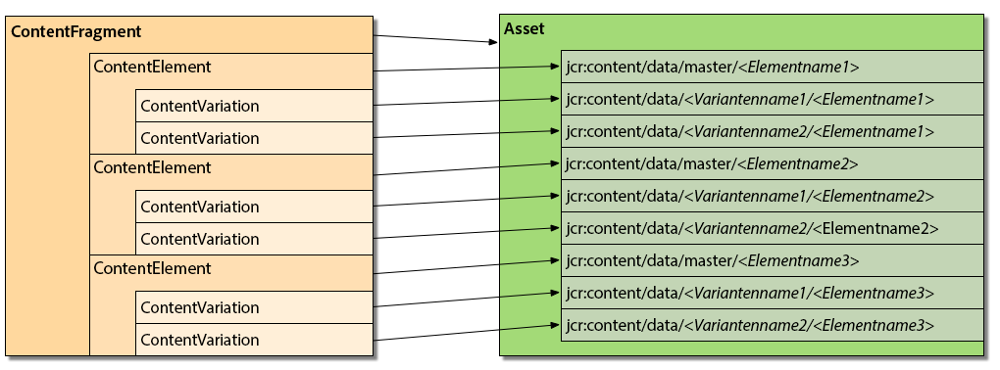
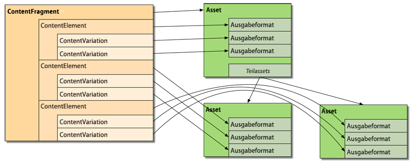

# Anpassen und Erweitern von Inhaltsfragmenten{#customizing-and-extending-content-fragments}

Ein Inhaltsfragment erweitert ein Standard-Asset. Weitere Informationen zu Inhaltsfragmenten finden Sie unter:

* [Erstellen und Verwalten von Inhaltsfragmenten](/help/assets/content-fragments/content-fragments.md) und [Seitenbearbeitung mit Inhaltsfragmenten](/help/sites-authoring/content-fragments.md).

* Weitere Informationen zu Standard-Assets finden Sie unter [Verwalten von Assets](/help/assets/manage-assets.md) und [Anpassen und Erweitern von Assets](/help/assets/extending-assets.md).

## Architektur {#architecture}

Ein Inhaltsfragment umfasst die folgenden grundlegenden [Bestandteile](/help/assets/content-fragments/content-fragments.md#constituent-parts-of-a-content-fragment):

* Ein *Inhaltsfragment,*
* aus einem oder mehreren *Inhaltselement* s,
* und die eine oder mehrere *Inhaltsvariante* s.

Je nach Fragmenttyp werden außerdem Modelle oder Vorlagen verwendet:

>[!CAUTION]
>
>[Inhaltsfragmentmodelle](/help/assets/content-fragments/content-fragments-models.md) werden für die Erstellung aller neuen Fragmente empfohlen.
>
>Inhaltsfragmentmodelle werden für alle Beispiele in WKND verwendet.

>[!NOTE]
>
>Vor AEM 6.3 wurden Inhaltsfragmente basierend auf Vorlagen statt auf Modellen erstellt.
>
>Inhaltsfragmentvorlagen werden jetzt nicht mehr unterstützt. Sie können weiterhin zum Erstellen von Fragmenten verwendet werden. Es wird jedoch empfohlen, stattdessen Inhaltsfragmentmodelle zu verwenden. Fragmentvorlagen werden keine neuen Funktionen hinzugefügt und in einer zukünftigen Version entfernt.

* Inhaltsfragmentmodelle:

   * werden zum Definieren von Inhaltsfragmenten verwendet, die strukturierte Inhalte enthalten.
   * Inhaltsfragmentmodelle definieren die Struktur eines Inhaltsfragments, wenn dieses erstellt wird.
   * Ein Fragment verweist auf das Modell. Änderungen am Modell können sich daher auf alle abhängigen Fragmente auswirken.
   * Modelle werden anhand von Datentypen erstellt.
   * Funktionen zum Hinzufügen neuer Varianten und dergleichen müssen das Fragment entsprechend aktualisieren.

   >[!CAUTION]
   >
   >Alle Änderungen an einem vorhandenen Inhaltsfragmentmodell können sich auf abhängige Fragmente auswirken. Daher kann es zu verwaisten Eigenschaften in diesen Fragmenten kommen.

* Inhaltsfragmentvorlagen:

   * wird zum Definieren von einfachen Inhaltsfragmenten verwendet.
   * Vorlagen definieren die (grundlegende, texbasierte) Struktur eines Inhaltsfragments, wenn dieses erstellt wird.
   * Die Vorlage wird beim Erstellen des Fragments zu diesem kopiert. Weitere Änderungen an der Vorlage werden nicht für bereits vorhandene Fragmente übernommen.
   * Funktionen zum Hinzufügen neuer Varianten und dergleichen müssen das Fragment entsprechend aktualisieren.
   * [Inhaltsfragmentvorlagen](/help/sites-developing/content-fragment-templates.md) auf andere Weise als andere Vorlagenkomponenten innerhalb des AEM Ökosystems (z. B. Seitenvorlagen usw.) arbeiten. Daher sollten sie separat berücksichtigt werden.
   * Wenn der MIME-Typ eines Inhalts auf einer Vorlage basiert, wird er für den jeweiligen Inhalt verwaltet. Folglich kann jedes Element und jede Variante einen anderen MIME-Typ aufweisen.

### Integration mit Assets {#integration-with-assets}

Die Inhaltsfragmentverwaltung (Content Fragment Management, CFM) ist Teil von AEM Assets:

* Inhaltsfragmente sind Assets.
* Sie verwenden vorhandene Assets-Funktionen.
* Sie sind vollständig mit Assets integriert (Admin-Konsole usw.).

#### Zuordnen von strukturierten Inhaltsfragmenten zu Assets {#mapping-structured-content-fragments-to-assets}



Inhaltsfragmente mit strukturierten Inhalten (d. h. basierend auf einem Inhaltsfragmentmodell) werden einem einzelnen Asset zugeordnet:

* Alle Inhalte werden im Knoten `jcr:content/data` des Assets gespeichert:

   * Die Elementdaten werden im primären Unterknoten gespeichert:
      `jcr:content/data/master`

   * Varianten werden in einem Unterknoten gespeichert, der den Namen der Variante hat:
z. B. `jcr:content/data/myvariation`

   * Die Daten der einzelnen Elemente werden im entsprechenden Unterknoten als Eigenschaft mit dem Elementnamen gespeichert: Das Inhaltselement `text` wird beispielsweise mit der Eigenschaft `text` in `jcr:content/data/master` gespeichert.

* Metadaten und verknüpfte Inhalte werden unter `jcr:content/metadata` gespeichert. Eine Ausnahme bilden der Titel und die Beschreibung, die nicht als Metadaten im herkömmlichen Sinne gelten und hier gespeichert werden: 
`jcr:content`

#### Zuordnen von einfachen Inhaltsfragmenten zu Assets {#mapping-simple-content-fragments-to-assets}



Einfache Inhaltsfragmente (basierend auf Vorlagen) werden einem Composite aus Haupt-Asset und (optionalen) Unter-Assets zugeordnet:

* Alle nicht inhaltsbezogenen Daten in einem Fragment (wie Titel, Beschreibung, Metadaten, Struktur) werden nur im Haupt-Asset verwaltet.
* Der Inhalt des ersten Elements eines Fragments wird dem ursprünglichen Ausgabeformat des Haupt-Assets zugeordnet.

   * Die Varianten (falls vorhanden) des ersten Elements werden anderen Ausgabeformaten des Haupt-Assets zugeordnet.

* Zusätzliche Elemente (falls vorhanden) werden Unter-Assets des Haupt-Assets zugeordnet.

   * Der Hauptinhalt dieser zusätzlichen Elemente wird dem ursprünglichen Ausgabeformat des jeweiligen Unter-Assets zugeordnet.
   * Andere Varianten (falls zutreffend) zusätzlicher Elemente werden anderen Ausgabeformaten der jeweiligen Unter-Assets zugeordnet.

#### Asset-Speicherort     {#asset-location}

Wie bei Standard-Assets wird das Inhaltsfragment gespeichert in:

`/content/dam`

#### Asset-Berechtigungen {#asset-permissions}

Weitere Informationen finden Sie unter [Inhaltsfragmente – Überlegungen zum Löschen](/help/assets/content-fragments/content-fragments-delete.md).

#### Funktionsintegration {#feature-integration}

* Die CFM-Funktion zur Inhaltsfragmentverwaltung basiert auf dem Assets-Kern, sollte jedoch so unabhängig wie möglich sein.
* CFM stellt eigene Implementierungen für Elemente in der Karten-, Spalten- und Listenansicht bereit. Diese sind mit den Ausgabeformatimplementierungen vorhandener Asset-Inhalte verknüpft.
* Einige Asset-Komponenten wurden für Inhaltsfragmente erweitert.

### Verwenden von Inhaltsfragmenten in Seiten {#using-content-fragments-in-pages}

>[!CAUTION]
>
>Derzeit wird die [Kernkomponente für Inhaltsfragmente](https://helpx.adobe.com/experience-manager/core-components/using/content-fragment-component.html) dafür empfohlen. Weitere Informationen finden Sie unter [Entwickeln von Kernkomponenten](https://helpx.adobe.com/experience-manager/core-components/using/developing.html).

AEM-Seiten können auf Inhaltsfragmente verweisen, ähnlich wie bei allen anderen Asset-Typen. AEM stellt die Kernkomponente für [**** Inhaltsfragmente](https://helpx.adobe.com/experience-manager/core-components/using/content-fragment-component.html) bereit, eine [Komponente, mit der Sie Inhaltsfragmente in Seiten einfügen können](/help/sites-authoring/content-fragments.md#adding-a-content-fragment-to-your-page). Sie können auch erweitern: **Inhaltsfragment** Kernkomponente.

* Die Komponente verwendet die `fragmentPath`-Eigenschaft für Verweise auf das tatsächliche Inhaltsfragment. Die `fragmentPath`-Eigenschaft wird wie ähnliche Eigenschaften anderer Asset-Typen gehandhabt, beispielsweise wenn das Inhaltsfragment zu einem anderen Speicherort verschoben wird.

* Mit der Komponente können Sie die Variante auswählen, die angezeigt werden soll.
* Außerdem kann eine Reihe von Absätzen ausgewählt werden, um die Ausgabe zu beschränken, z. B. für die Ausgabe in mehreren Spalten.
* Die Komponente lässt auch [Zwischeninhalte](/help/sites-developing/components-content-fragments.md#in-between-content) zu:

   * Die Komponente ermöglicht es Ihnen, andere Assets (Bilder usw.) zwischen den Absätzen des Fragments zu platzieren, auf das verwiesen wird.
   * Bei Zwischeninhalten müssen Sie:

      * beachten, dass Verweise möglicherweise instabil sind. Bei der Seitenbearbeitung hinzugefügte Zwischeninhalte haben keine feste Beziehung zu dem Absatz, neben dem sie platziert werden; es wird ein neuer Absatz (im Inhaltsfragment-Editor) eingefügt, bevor der Zwischeninhalt die relative Position verlieren kann.
      * zusätzliche Parameter (wie Varianten und Absatzfilter) berücksichtigen, um falsch-positive Suchergebnisse zu vermeiden.

>[!NOTE]
>
>**Inhaltsfragmentmodell:**
>
>Bei Verwendung eines auf einem Inhaltsfragmentmodell basierenden Inhaltsfragments auf einer Seite wird auf das Modell verwiesen. Falls das Modell also zum Zeitpunkt der Seitenveröffentlichung nicht veröffentlicht wurde, wird dies gekennzeichnet und das Modell zu den Ressourcen hinzugefügt, die mit der Seite veröffentlicht werden sollen.
>
>**Inhaltsfragmentvorlage:**
>
>Bei Verwendung eines auf einer Inhaltsfragmentvorlage basierten Inhaltsfragments auf einer Seite erfolgt kein Verweis, da die Vorlage beim Erstellen des Fragments kopiert wurde.

#### Konfiguration mit der OSGi-Konsole {#configuration-using-osgi-console}

Die Back-End-Implementierung von Inhaltsfragmenten ist beispielsweise dafür verantwortlich, Instanzen eines Fragments zu erstellen, das auf einer durchsuchbaren Seiten verwendet wird, oder gemischte Medieninhalte zu verwalten. Diese Implementierung muss wissen, welche Komponenten zum Rendern des Fragments verwendet werden und wie das Rendern parametrisiert wird.

Die Parameter hierfür können im Abschnitt [Web-Konsole](/help/sites-deploying/configuring-osgi.md#osgi-configuration-with-the-web-console)für das OSGi-Bundle **Konfiguration der Inhaltsfragment-Komponente**.

* **Ressourcentypen**
Eine Liste von 
`sling:resourceTypes` kann bereitgestellt werden, um Komponenten zu definieren, die für die Wiedergabe von Inhaltsfragmenten verwendet werden und auf die die Hintergrundverarbeitung angewendet werden soll.

* **Verweiseigenschaften** Eine Liste der konfigurierbaren Eigenschaften, die angeben, wo der Verweis auf das Fragment für die entsprechende Komponente gespeichert werden soll.

>[!NOTE]
>
>Eigenschaft und Komponententyp werden nicht direkt zugeordnet.
>
>AEM verwendet einfach die erste Eigenschaft im Absatz. Deshalb sollten Sie die Eigenschaften sorgfältig auswählen.


Es gibt noch einige weitere Richtlinien, die Sie befolgen müssen, um sicherzustellen, dass die Komponente mit der Hintergrundverarbeitung des Inhaltsfragments kompatibel ist:

* Der Name der Eigenschaft, in der die Elemente definiert sind, die gerendert werden sollen, muss `element` oder `elementNames`.

* Der Name der Eigenschaft, die das Rendern der Variante definiert, muss `variation` oder `variationName` lauten.

* Wenn die Ausgabe mehrerer Elemente unterstützt wird (durch Verwendung von `elementNames` um mehrere Elemente anzugeben), wird der tatsächliche Anzeigemodus durch die Eigenschaft definiert `displayMode`:

   * Wenn der Wert `singleText` (und nur ein Element konfiguriert ist) wird das Element als Text mit Zwischeninhalten, Layout-Unterstützung usw. gerendert. Dies ist die Standardeinstellung für Fragmente, für die nur ein einzelnes Element gerendert wird.
   * In allen anderen Fällen wird ein weitaus einfacherer Ansatz (eine Art „Formularansicht“) verwendet, bei dem kein Zwischeninhalt unterstützt, sondern das Fragment im Ist-Zustand gerendert wird.

* Wenn das Fragment für `displayMode` == `singleText` (implizit oder explizit) kommen die folgenden zusätzlichen Eigenschaften zum Tragen:

   * `paragraphScope` definiert, ob alle Absätze oder nur ein Absatzbereich gerendert werden sollen (Werte: `all` vs. `range`)

   * if `paragraphScope` == `range` dann die Eigenschaft `paragraphRange` definiert den Bereich der Absätze, die gerendert werden sollen

### Integration mit anderen Frameworks {#integration-with-other-frameworks}

Inhaltsfragmente können mit folgenden Frameworks integriert werden:

* **Übersetzungen**

   Inhaltsfragmente sind vollständig in die [AEM Übersetzungs-Workflow](/help/sites-administering/tc-manage.md). Auf Architekturebene bedeutet dies:

   * Die einzelnen Übersetzungen eines Inhaltsfragments sind separate Fragmente, z. B.:

      * sie befinden sich unter verschiedenen Sprachstämmen:

         `/content/dam/<path>/en/<to>/<fragment>`

         im Vergleich zu

         `/content/dam/<path>/de/<to>/<fragment>`

      * Sie verwenden jedoch genau denselben relativen Pfad unterhalb des Sprachstamms:

         `/content/dam/<path>/en/<to>/<fragment>`

         im Vergleich zu

         `/content/dam/<path>/de/<to>/<fragment>`
   * Außer den regelbasierten Pfaden besteht keinerlei Verbindung zwischen den unterschiedlichen Sprachversionen von Inhaltsfragmenten. Sie werden als zwei separate Fragmente behandelt, obwohl die Benutzeroberfläche Funktionen zum Navigieren zwischen den Sprachvarianten beinhaltet.
   >[!NOTE]
   >
   >Der AEM-Übersetzungs-Workflow arbeitet mit `/content`:
   >
   >    * Da sich die Inhaltsfragmentmodelle in `/conf` befinden, sind sie nicht in diesen Übersetzungen beinhaltet. Sie können [die Strings der Benutzeroberfläche internationalisieren](/help/sites-developing/i18n-dev.md).
   >
   >    * Vorlagen werden kopiert, um Fragmente zu erstellen, sodass dies impliziert ist.


* **Metadatenschemas**

   * Inhaltsfragmente verwenden [Metadatenschemas](/help/assets/metadata-schemas.md) (wieder), die mit Standard-Assets definiert werden können.
   * CFM bietet ein eigenes, spezifisches Schema:

      `/libs/dam/content/schemaeditors/forms/contentfragment`

      dieses kann bei Bedarf erweitert werden.

   * Das entsprechende Schemaformular ist mit dem Fragmenteditor integriert.

## Server-seitige API für die Inhaltsfragmentverwaltung {#the-content-fragment-management-api-server-side}

Sie können die Server-seitige API für den Zugriff auf Inhaltsfragmente verwenden, siehe:

[com.adobe.cq.dam.cfm](https://helpx.adobe.com/experience-manager/6-5/sites/developing/using/reference-materials/javadoc/com/adobe/cq/dam/cfm/package-summary.html)

>[!CAUTION]
>
>Es wird dringend empfohlen, die Server-seitige API zu verwenden, anstatt direkt auf die Inhaltsstruktur zuzugreifen.

### Hauptschnittstellen {#key-interfaces}

Die folgenden drei Schnittstellen können als Einstiegspunkte dienen:

* **Fragmentvorlage** ([FragmentTemplate](https://helpx.adobe.com/experience-manager/6-5/sites/developing/using/reference-materials/javadoc/com/adobe/cq/dam/cfm/FragmentTemplate.html))

   Verwendung `FragmentTemplate.createFragment()` zum Erstellen eines neuen Fragments.

   ```
   Resource templateOrModelRsc = resourceResolver.getResource("...");
   FragmentTemplate tpl = templateOrModelRsc.adaptTo(FragmentTemplate.class);
   ContentFragment newFragment = tpl.createFragment(parentRsc, "A fragment name", "A fragment description.");
   ```

   Diese Schnittstelle steht für:

   * ein Inhaltsfragmentmodell oder eine Inhaltsfragmentvorlage, aus dem bzw. der Sie ein Inhaltsfragment erstellen können,
   * und (nach der Erstellung) die Strukturinformationen dieses Fragments

   Diese Daten können Folgendes beinhalten:

   * Zugriff auf grundlegende Daten (Titel, Beschreibung)
   * Zugriff auf Vorlagen/Modelle für die Elemente des Fragments:

      * Auflisten von Elementvorlagen
      * Abrufen von Strukturdaten für ein bestimmtes Element
      * Zugriff auf die Elementvorlage (siehe `ElementTemplate`)
   * Zugriff auf Vorlagen für die Varianten des Fragments:

      * Auflisten von Variantenvorlagen
      * Abrufen von Strukturinformationen für eine bestimmte Variante
      * Zugriff auf die Variantenvorlage (siehe `VariationTemplate`)
   * Abrufen anfänglich zugeordneter Inhalte

   Schnittstellen, die für wichtige Daten stehen:

   * `ElementTemplate`

      * Abrufen grundlegender Daten (Name, Titel)
      * Abrufen anfänglicher Elementinhalte
   * `VariationTemplate`

      * Abrufen grundlegender Daten (Name, Titel, Beschreibung)


* **Inhaltsfragment** ([ContentFragment](https://helpx.adobe.com/experience-manager/6-5/sites/developing/using/reference-materials/javadoc/com/adobe/cq/dam/cfm/ContentFragment.html))

   In dieser Schnittstelle können Sie abstrakt mit einem Inhaltsfragment arbeiten.

   >[!CAUTION]
   >
   >Es wird dringend empfohlen, über diese Schnittstelle auf ein Fragment zuzugreifen. Das direkte Ändern der Inhaltsstruktur sollte vermieden werden.

   Die Schnittstelle bietet folgende Möglichkeiten:

   * Verwalten grundlegender Daten (z. B. Abrufen von Namen, Abrufen/Festlegen von Titel, Beschreibung)
   * Zugriff auf Metadaten
   * Zugriff auf Elemente:

      * Auflisten von Elementen
      * Abrufen von Elementen nach Name
      * Erstellen neuer Elemente (siehe [Einschränkungen](#caveats))

      * Zugriff auf Elementdaten (siehe `ContentElement`)
   * Auflisten der für das Fragment definierten Varianten
   * Globales Erstellen neuer Varianten
   * Verwalten zugeordneter Inhalte:

      * Auflisten von Sammlungen
      * Hinzufügen von Sammlungen
      * Entfernen von Sammlungen
   * Zugreifen auf das Fragmentmodell oder Vorlage

   Folgende Schnittstellen stehen für die Hauptelemente eines Fragments:

   * **Inhaltselement** ([ContentElement](https://helpx.adobe.com/experience-manager/6-5/sites/developing/using/reference-materials/javadoc/com/adobe/cq/dam/cfm/ContentElement.html))

      * Abrufen grundlegender Daten (Name, Titel, Beschreibung)
      * Abrufen/Festlegen von Inhalten
      * Zugriff auf Varianten eines Elements:

         * Auflisten von Varianten
         * Abrufen von Varianten nach Name
         * Erstellen neuer Varianten (siehe [Einschränkungen](#caveats))
         * Entfernen von Varianten (siehe [Einschränkungen](#caveats))
         * Zugriff auf Variantendaten (siehe `ContentVariation`)
      * Tastaturbefehl zum Auflösen von Varianten (Anwenden zusätzlicher implementierungsspezifischer Ausweich-Logik, falls die angegebene Variante für ein Element nicht verfügbar ist)
   * **Inhaltsvariante** ([ContentVariation](https://helpx.adobe.com/experience-manager/6-5/sites/developing/using/reference-materials/javadoc/com/adobe/cq/dam/cfm/ContentVariation.html))

      * Abrufen grundlegender Daten (Name, Titel, Beschreibung)
      * Abrufen/Festlegen von Inhalten
      * Einfache Synchronisierung basierend auf den zuletzt geänderten Informationen

   Alle drei Schnittstellen (`ContentFragment`, `ContentElement`, `ContentVariation`) erweitern die `Versionable`-Schnittstelle durch zusätzliche, für Inhaltsfragmente erforderliche Versionierungsfunktionen:

   * Erstellen neuer Versionen des Elements
   * Auflisten der Versionen des Elements
   * Abrufen des Inhalts einer spezifischen Version des versionierten Elements


### Anpassen mit adaptTo() {#adapting-using-adaptto}

Folgendes kann angepasst werden:

* `ContentFragment` kann angepasst werden an:

   * `Resource` - die zugrunde liegende Sling-Ressource; Beachten Sie, dass die zugrunde liegende `Resource` muss direkt neu erstellt werden. `ContentFragment` -Objekt.

   * `Asset` - der DAM `Asset` Abstraktion, die das Inhaltsfragment darstellt; Beachten Sie, dass die `Asset` muss direkt neu erstellt werden. `ContentFragment` -Objekt.

* `ContentElement` kann angepasst werden an:

   * `ElementTemplate` – für den Zugriff auf die Strukturdaten des Elements.

* `FragmentTemplate` kann angepasst werden an:

   * `Resource` - die `Resource` Bestimmung des referenzierten Modells oder der ursprünglichen Vorlage, die kopiert wurde;

      * über die `Resource` werden nicht automatisch im `FragmentTemplate`.

* `Resource` kann angepasst werden an:

   * `ContentFragment`
   * `FragmentTemplate`

### Einschränkungen {#caveats}

Beachten Sie Folgendes:

* Die API wird implementiert, um die von der Benutzeroberfläche unterstützte Funktionalität bereitzustellen.
* Die gesamte API ist so konzipiert, dass Änderungen **nicht** automatisch persistent gespeichert werden (es sei denn, dies ist anders in der Java-Dokumentation der API angegeben). Daher müssen Sie immer den Ressourcenkonfliktlöser der entsprechenden Anfrage (oder den tatsächlich verwendeten Konfliktlöser) festlegen.
* Aufgaben, für die möglicherweise zusätzliche Arbeitsschritte erforderlich sind:

   * Beim Erstellen/Entfernen neuer Elemente wird die Datenstruktur einfacher Fragmente (basierend auf einer Fragmentvorlage) nicht aktualisiert.
   * Beim Erstellen neuer Varianten auf Basis von `ContentElement` wird die Datenstruktur nicht aktualisiert (beim globalen Erstellen auf Basis von `ContentFragment` wird sie jedoch aktualisiert).

   * Beim Entfernen vorhandener Varianten wird die Datenstruktur nicht aktualisiert.

## Client-seitige API für die Inhaltsfragmentverwaltung   {#the-content-fragment-management-api-client-side}

>[!CAUTION]
>
>Bei AEM 6.5 ist die clientseitige API intern.

### Zusätzliche Informationen {#additional-information}

Beachten Sie Folgendes:

* `filter.xml`

   `filter.xml` für die Inhaltsfragmentverwaltung ist so konfiguriert, dass es sich nicht mit dem Hauptinhaltspaket für Assets überschneidet.

## Bearbeitungssitzungen {#edit-sessions}

Eine Bearbeitungssitzung wird gestartet, wenn der Benutzer ein Inhaltsfragment in einer der Editor-Seiten öffnet. Die Bearbeitungssitzung ist beendet, wenn der Benutzer den Editor durch Auswählen von **Speichern** oder **Abbrechen** verlässt.

### Voraussetzungen {#requirements}

Für das Steuern einer Bearbeitungssitzung gelten folgende Voraussetzungen:

* Das Bearbeiten eines Inhaltsfragments, das mehrere Ansichten (d. h. HTML-Seiten) umspannen kann, sollte atomisch sein.
* Das Bearbeiten sollte außerdem *transaktional* sein. Am Ende der Bearbeitungssitzung müssen die Änderungen entweder übergeben (gespeichert) oder zurückgesetzt (abgebrochen) werden.
* Grenzfälle müssen richtig gehandhabt werden, z. B. wenn ein Benutzer eine Seite durch manuelle Eingabe einer URL oder globale Navigation verlässt.
* Eine regelmäßige automatische Speicherung (alle x Minuten) sollte verfügbar sein, um den Verlust von Daten zu vermeiden.
* Falls ein Inhaltsfragment von zwei Benutzern gleichzeitig bearbeitet wird, sollten diese die jeweiligen Änderungen nicht gegenseitig überschreiben.

#### Prozesse {#processes}

Folgende Prozesse sind involviert:

* Starten einer Sitzung

   * Eine neue Version des Inhaltsfragments wird erstellt.
   * Das automatische Speichern wird gestartet.
   * Cookies werden festgelegt. Diese definieren das derzeit bearbeitete Fragment und den Status „offene Bearbeitungssitzung“.

* Beenden einer Sitzung

   * Das automatische Speichern wird beendet.
   * Bei Bestätigung:

      * Die Daten zur letzten Änderung werden aktualisiert.
      * Cookies werden entfernt.
   * Beim Zurücksetzen:

      * Die Version des Inhaltsfragments, die beim Start der Sitzung erstellt wurde, wird wiederhergestellt.
      * Cookies werden entfernt.


* Bearbeiten

   * Alle Änderungen (die automatische Speicherung eingeschlossen) werden am aktiven Inhaltsfragment vorgenommen, nicht in einem separaten, geschützten Bereich.
   * Daher werden diese Änderungen sofort auf den AEM-Seiten übernommen, die auf das entsprechende Inhaltsfragment verweisen.

#### Aktionen {#actions}

Folgende Aktionen sind möglich:

* Aufrufen einer Seite

   * Überprüfen Sie, ob bereits eine Bearbeitungssitzung läuft, indem Sie das entsprechende Cookie überprüfen.

      * Falls ja, überprüfen Sie, ob die Bearbeitungssitzung für das derzeit bearbeitete Inhaltsfragment gestartet wurde.

         * Falls ja, stellen Sie die Sitzung wieder her.
         * Falls nicht, versuchen Sie, die Bearbeitung des zuvor bearbeiteten Inhaltsfragments abzubrechen und entfernen Sie die Cookies (anschließend ist keine Bearbeitungssitzung mehr aktiv).
      * Falls keine Bearbeitungssitzung vorhanden ist, warten Sie, bis der Benutzer die erste Änderung vorgenommen hat (siehe unten).
   * Überprüfen Sie, ob bereits eine Seite auf das Inhaltsfragment verweist, und zeigen Sie die Daten an, falls zutreffend.


* Ändern von Inhalten

   * Wenn der Benutzer den Inhalt ändert und keine Bearbeitungssitzung vorhanden ist, wird eine neue Bearbeitungssitzung erstellt (siehe [Starten einer Sitzung](#processes)).

* Verlassen einer Seite

   * Falls eine Bearbeitungssitzung vorhanden ist und die Änderungen nicht persistent gespeichert wurden, wird ein Modal-Bestätigungsdialogfeld angezeigt, um den Benutzer über potenziell verloren gegangene Daten zu benachrichtigen und es ihm zu ermöglichen, auf der Seite zu bleiben.

## Beispiele {#examples}

### Beispiel: Zugreifen auf ein vorhandenes Inhaltsfragment {#example-accessing-an-existing-content-fragment}

Dazu können Sie die Ressource, die für die API steht, wie folgt anpassen:

`com.adobe.cq.dam.cfm.ContentFragment`

Beispiel:

```java
// first, get the resource
Resource fragmentResource = resourceResolver.getResource("/content/dam/fragments/my-fragment");
// then adapt it
if (fragmentResource != null) {
    ContentFragment fragment = fragmentResource.adaptTo(ContentFragment.class);
    // the resource is now accessible through the API
}
```

### Beispiel: Erstellen eines neuen Inhaltsfragments {#example-creating-a-new-content-fragment}

Um ein neues Inhaltsfragment zu programmieren, verwenden Sie:

`com.adobe.cq.dam.cfm.ContentFragmentManager#create`

Beispiel:

```java
Resource templateOrModelRsc = resourceResolver.getResource("...");
FragmentTemplate tpl = templateOrModelRsc.adaptTo(FragmentTemplate.class);
ContentFragment newFragment = tpl.createFragment(parentRsc, "A fragment name", "A fragment description.");
```

### Beispiel: Angeben des Intervalls für das automatische Speichern {#example-specifying-the-auto-save-interval}

Das Intervall für das automatische Speichern (gemessen in Sekunden) kann mit dem Konfigurations-Manager (ConfMgr) definiert werden:

* Knoten: `<*conf-root*>/settings/dam/cfm/jcr:content`
* Eigenschaftsname: `autoSaveInterval`
* Typ: `Long`

* Standard: `600` (10 Minuten); wird definiert in `/libs/settings/dam/cfm/jcr:content`

Wenn Sie ein Intervall von 5 Minuten für das automatische Speichern festlegen möchten, müssen Sie die Eigenschaft auf dem Knoten definieren. Beispiel:

* Knoten: `/conf/global/settings/dam/cfm/jcr:content`
* Eigenschaftsname: `autoSaveInterval`

* Typ: `Long`

* Wert: `300` (5 Minuten entsprechen 300 Sekunden)

## Inhaltsfragmentvorlagen {#content-fragment-templates}

Ausführliche Informationen finden Sie unter [Inhaltsfragmentvorlagen](/help/sites-developing/content-fragment-templates.md).

## Komponenten für die Seitenbearbeitung {#components-for-page-authoring}

Weitere Informationen finden Sie unter

* [Kernkomponenten – Inhaltsfragmentkomponente](https://helpx.adobe.com/experience-manager/core-components/using/content-fragment-component.html) (empfohlen)
* [Inhaltsfragmentkomponenten – Komponenten für die Seitenbearbeitung](/help/sites-developing/components-content-fragments.md#components-for-page-authoring)
