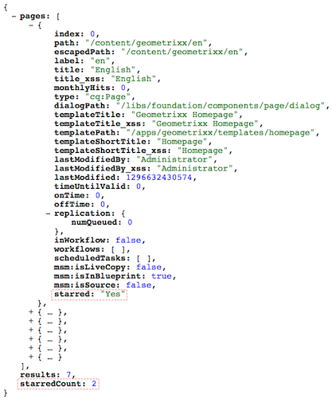

# Anpassen der Websites-Konsole (klassische Benutzeroberfläche){#customizing-the-websites-console-classic-ui}

## Hinzufügen einer benutzerdefinierten Spalte zur Websites-Konsole (siteadmin) {#adding-a-custom-column-to-the-websites-siteadmin-console}

Die Websites-Administrationskonsole kann erweitert werden, um benutzerdefinierte Spalten anzuzeigen. Die Konsole basiert auf einem JSON-Objekt, das erweitert werden kann, indem ein OSGi-Dienst erstellt wird, der die Schnittstelle `ListInfoProvider` implementiert. Ein solcher Dienst modifiziert das JSON-Objekt, das an den Client gesendet wird, um die Konsole zu erstellen.

In diesem Schritt-für-Schritt-Tutorial wird erläutert, wie Sie eine neue Spalte in der Websites-Administrationskonsole anzeigen, indem Sie die Schnittstelle `ListInfoProvider` implementieren. Er umfasst die folgenden Schritte:

1. [Erstellen des OSGi-Dienstes](#creating-the-osgi-service) und Bereitstellung des Bundles, das das Bundle enthält, auf dem AEM Server.
1. (optional) [Testen des neuen Dienstes](#testing-the-new-service) durch einen JSON-Aufruf zum Anfordern des JSON-Objekts, das zum Erstellen der Konsole verwendet wird.
1. [Anzeigen der neuen Spalte](#displaying-the-new-column) durch Erweiterung der Knotenstruktur der Konsole im Repository.

>[!NOTE]
>
>Dieses Tutorial kann auch verwendet werden, um die folgenden Administrationskonsolen zu erweitern:
>
>* die Digital Assets-Konsole
>* die Community-Konsole
>

### Erstellen von OSGi-Diensten {#creating-the-osgi-service}

Die Schnittstelle `ListInfoProvider` definiert zwei Methoden:

* `updateListGlobalInfo`, um die globalen Eigenschaften der Liste zu aktualisieren,
* `updateListItemInfo`, um ein einzelnes Listenelement zu aktualisieren.

Die Argumente für beide Methoden lauten:

* `request`, das zugeordnete Sling-HTTP-Anforderungsobjekt,
* `info`, das zu aktualisierende JSON-Objekt, bei dem es sich um die globale Liste bzw. das aktuelle Listenelement handelt,
* `resource`, eine Sling-Ressource.

Die Beispielimplementierung sieht wie folgt aus:

* Es wird eine Eigenschaft *starred* für jedes Element hinzugefügt, deren Wert auf `true` festgelegt ist, wenn der Seitenname mit *e* beginnt. Andernfalls ist der Wert auf `false` festgelegt.

* Fügt eine *starredCount* -Eigenschaft, die für die Liste global ist und die Anzahl der Listenelemente mit dem Sternchen enthält.

So erstellen Sie den OSGi-Dienst:

1. CRXDE Lite: [Bundle erstellen](/help/sites-developing/developing-with-crxde-lite.md#managing-a-bundle).
1. Fügen Sie den Beispielcode unten hinzu.
1. Erstellen Sie das Bundle.

Der neue Dienste wird ordnungsgemäß ausgeführt.

```java
package com.test;

import com.day.cq.commons.ListInfoProvider;
import com.day.cq.i18n.I18n;
import com.day.cq.wcm.api.Page;
import org.apache.felix.scr.annotations.Component;
import org.apache.felix.scr.annotations.Service;
import org.apache.sling.api.SlingHttpServletRequest;
import org.apache.sling.api.resource.Resource;
import org.apache.sling.commons.json.JSONException;
import org.apache.sling.commons.json.JSONObject;

@Component(metatype = false)
@Service(value = ListInfoProvider.class)
public class StarredListInfoProvider implements ListInfoProvider {

    private int count = 0;

    public void updateListGlobalInfo(SlingHttpServletRequest request, JSONObject info, Resource resource) throws JSONException {
        info.put("starredCount", count);
        count = 0; // reset for next execution
    }

    public void updateListItemInfo(SlingHttpServletRequest request, JSONObject info, Resource resource) throws JSONException {
        Page page = resource.adaptTo(Page.class);
        if (page != null) {
            // Consider starred if page name starts with 'e'
            boolean starred = page.getName().startsWith("e");
            if (starred) {
                count++;
            }
            I18n i18n = new I18n(request);
            info.put("starred", starred ? i18n.get("Yes") : i18n.get("No"));
        }
    }

}
```

>[!CAUTION]
>
>* Ihre Implementierung sollte anhand der bereitgestellten Anforderung und/oder Ressource bestimmen, ob die Informationen zum JSON-Objekt hinzugefügt werden sollen.
>* Wenn `ListInfoProvider` -Implementierung definiert eine Eigenschaft, die im Antwortobjekt vorhanden ist. Ihr Wert wird durch den von Ihnen angegebenen Wert überschrieben.
>
>  Sie können [service ranking](https://docs.osgi.org/javadoc/r2/org/osgi/framework/Constants.html#SERVICE_RANKING) verwenden, um die Ausführungsreihenfolge mehrerer `ListInfoProvider` Implementierungen zu verwalten.

### Testen des neuen Dienstes {#testing-the-new-service}

Wenn Sie die Websites-Administrationskonsole öffnen und Ihre Site durchsuchen, gibt der Browser einen Ajax-Aufruf aus, um das JSON-Objekt abzurufen, das zum Erstellen der Konsole verwendet wird. Wenn Sie beispielsweise zum Ordner `/content/geometrixx` navigieren, wird die folgende Anforderung an den AEM-Server gesendet, um die Konsole zu erstellen:

[https://localhost:4502/content/geometrixx.pages.json?start=0&amp;limit=30&amp;predicate=siteadmin](https://localhost:4502/content/geometrixx.pages.json?start=0&amp;limit=30&amp;predicate=siteadmin)

Gehen Sie wie folgt vor, um sicherzustellen, dass der neue Dienst nach der Bereitstellung des Bundles, das ihn enthält, ausgeführt wird:

1. Lassen Sie Ihren Browser auf die folgende URL verweisen:
   [https://localhost:4502/content/geometrixx.pages.json?start=0&amp;limit=30&amp;predicate=siteadmin](https://localhost:4502/content/geometrixx.pages.json?start=0&amp;limit=30&amp;predicate=siteadmin)

1. Die Antwort sollte die neuen Eigenschaften wie folgt anzeigen:



### Anzeigen neuer Spalten {#displaying-the-new-column}

Der letzte Schritt besteht darin, die Knotenstruktur der Websites-Administrationskonsole so anzupassen, dass die neue Eigenschaft für alle Geometrixx-Seiten durch Überlagerung von `/libs/wcm/core/content/siteadmin` angezeigt wird. Gehen Sie wie folgt vor:

1. Erstellen Sie in CRXDE Lite die Knotenstruktur `/apps/wcm/core/content` mit Knoten des Typs `sling:Folder`, um die Struktur `/libs/wcm/core/content` widerzuspiegeln.

1. Kopieren Sie den Knoten `/libs/wcm/core/content/siteadmin` und fügen Sie ihn unter `/apps/wcm/core/content` ein.

1. Kopieren Sie den Knoten `/apps/wcm/core/content/siteadmin/grid/assets` nach `/apps/wcm/core/content/siteadmin/grid/geometrixx` und ändert seine Eigenschaften:

   * Entfernen Sie **pageText**.

   * Satz **pathRegex** nach `/content/geometrixx(/.*)?`
Dadurch wird die Rasterkonfiguration für alle Geometrixx-Websites aktiviert.

   * Legen Sie **storeProxySuffix** auf `.pages.json` fest

   * Bearbeiten Sie die mehrwertige Eigenschaft **storeReaderFields** und fügen Sie den Wert `starred` hinzu.

   * Um die MSM-Funktion zu aktivieren, fügen Sie die folgenden MSM-Parameter zur Eigenschaft &quot;multiString&quot;hinzu **storeReaderFields**:

      * **msm:isSource**
      * **msm:isInBlueprint**
      * **msm:isLiveCopy**

1. Fügen Sie einen Knoten `starred` (des Typs **nt:unstructured**) unter `/apps/wcm/core/content/siteadmin/grid/geometrixx/columns` mit den folgenden Eigenschaften hinzu:

   * **dataIndex**: `starred` des Typs „String“

   * **header**: `Starred` des Typs „String“

   * **xtype**: `gridcolumn` des Typs „String“

1. (optional) Legen Sie die Spalten ab, die nicht angezeigt werden sollen unter `/apps/wcm/core/content/siteadmin/grid/geometrixx/columns`

1. `/siteadmin` ist ein Vanity-Pfad, der standardmäßig auf `/libs/wcm/core/content/siteadmin` verweist.
So leiten Sie dies zu Ihrer Version von siteadmin auf `/apps/wcm/core/content/siteadmin`, definieren Sie die Eigenschaft . `sling:vanityOrder` , um einen höheren Wert als den für definierten zu haben. `/libs/wcm/core/content/siteadmin`. Der Standardwert lautet 300, also sind alle höheren Werte geeignet.

1. Wechseln Sie zu Websites-Administrationskonsole und navigieren Sie zur folgenden Geometrixx-Website:
   [https://localhost:4502/siteadmin#/content/geometrixx](https://localhost:4502/siteadmin#/content/geometrixx).

1. Die neue Spalte **Starred** ist nun verfügbar und zeigt benutzerdefinierte Informationen wie folgt an:


>[!CAUTION]
>
>Wenn mehrere Rasterkonfigurationen mit dem angeforderten Pfad übereinstimmen, der von der **pathRegex** -Eigenschaft, wird die erste und nicht die spezifischste verwendet, was bedeutet, dass die Reihenfolge der Konfigurationen wichtig ist.

### Beispielpaket {#sample-package}

Das Ergebnis dieses Tutorials ist im Paket [Anpassen der Website-Administrationskonsole](https://localhost:4502/crx/packageshare/index.html/content/marketplace/marketplaceProxy.html?packagePath=/content/companies/public/adobe/packages/helper/customizing-siteadmin) bei Package Share verfügbar.
