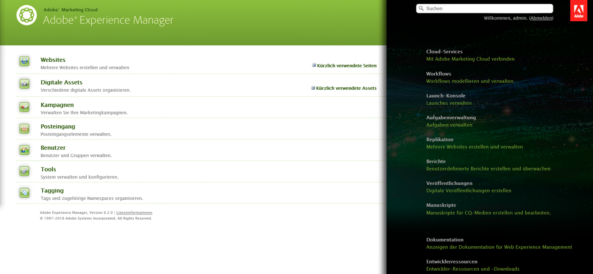
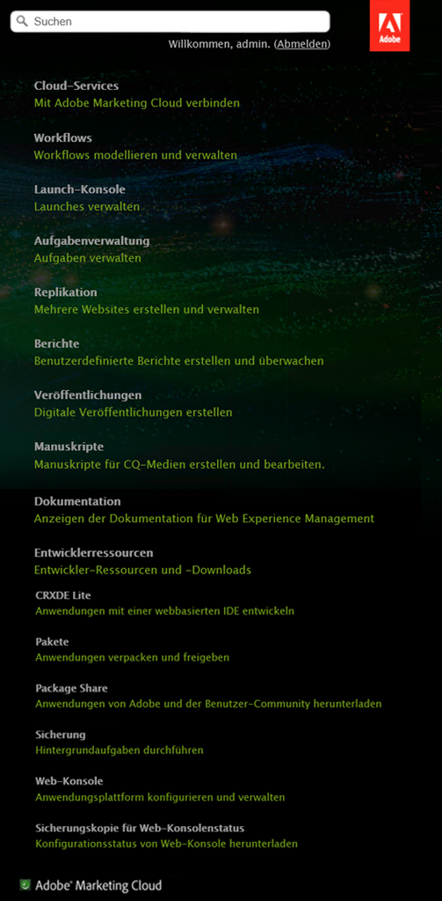

# Anpassung der Willkommens-Konsole (klassische Benutzeroberfläche){#customizing-the-welcome-console-classic-ui}

>[!CAUTION]
>
>Diese Seite behandelt die klassische Benutzeroberfläche.
>
>Unter [Anpassung der Konsolen ](/help/sites-developing/customizing-consoles-touch.md) finden Sie genauere Informationen zur standardmäßigen Touch-optimierten Benutzeroberfläche.

Die Willkommens-Konsole bietet eine Liste mit Links zu den unterschiedlichen Konsolen und Funktionen innerhalb von AEM.

Sie können die sichtbaren Links konfigurieren. Sie können diese Konfiguration auch für bestimmte Benutzer und/oder Gruppen vornehmen. Die erforderlichen Handlungen hängen vom Zieltyp ab. Dieser hängt vom Abschnitt der Konsole ab, in dem sich die Ziele befinden:

* [Hauptkonsolen](#links-in-main-console-left-pane) – Links in der Hauptkonsole (linker Bereich)
* [Ressourcen, Dokumentation und Verweis, Eigenschaften](#links-in-sidebar-right-pane) – Links in der Seitenleiste (rechter Bereich)

## Links in der Hauptkonsole (linker Bereich)  {#links-in-main-console-left-pane}

Dies sind die Hauptkonsolen von AEM.

### Legt fest, ob Hauptkonsolen-Links sichtbar sind {#configuring-whether-main-console-links-are-visible}

Berechtigungen auf Knotenebene legen fest, ob der Link sichtbar ist. Die betreffenden Knoten sind Folgende:

* **Websites:** `/libs/wcm/core/content/siteadmin`

* **digitalen Assets:** `/libs/wcm/core/content/damadmin`

* **Community:** `/libs/collab/core/content/admin`

* **Kampagnen:** `/libs/mcm/content/admin`

* **Posteingang:** `/libs/cq/workflow/content/inbox`

* **Benutzer:** `/libs/cq/security/content/admin`

* **Tools:** `/libs/wcm/core/content/misc`

* **Tagging:** `/libs/cq/tagging/content/tagadmin`

Beispiel:

* Um den Zugriff auf **Tools** zu beschränken, entfernen Sie den Lesezugriff von

   `/libs/wcm/core/content/misc`

Im [Abschnitt „Sicherheit“](/help/sites-administering/security.md) finden Sie weitere Informationen zum Festlegen der gewünschten Berechtigungen.

### Links in der Seitenleiste (rechter Bereich)  {#links-in-sidebar-right-pane}

Diese Links basieren auf dem Vorhandensein *und* dem Lesezugriff auf Knoten unter dem folgenden Pfad:

`/libs/cq/core/content/welcome`

Drei Abschnitte werden standardmäßig bereitgestellt (leicht getrennt):

<table>
 <tbody>
  <tr>
   <td><strong>Ressourcen</strong></td>
   <td> </td>
  </tr>
  <tr>
   <td> Cloud Services</td>
   <td><code>/libs/cq/core/content/welcome/resources/cloudservices</code></td>
  </tr>
  <tr>
   <td> Workflows</td>
   <td><code>/libs/cq/core/content/welcome/resources/workflows</code></td>
  </tr>
  <tr>
   <td> Aufgabenverwaltung</td>
   <td><code>/libs/cq/core/content/welcome/resources/taskmanager</code></td>
  </tr>
  <tr>
   <td> Replikation</td>
   <td><code>/libs/cq/core/content/welcome/resources/replication</code></td>
  </tr>
  <tr>
   <td> Berichte</td>
   <td><code>/libs/cq/core/content/welcome/resources/reports</code></td>
  </tr>
  <tr>
   <td> Veröffentlichungen</td>
   <td><code>/libs/cq/core/content/welcome/resources/publishingadmin</code></td>
  </tr>
  <tr>
   <td> Manuskripte</td>
   <td><code>/libs/cq/core/content/welcome/resources/manuscriptsadmin</code></td>
  </tr>
  <tr>
   <td><strong>Dokumentation und Referenz</strong></td>
   <td> </td>
  </tr>
  <tr>
   <td> Dokumentation</td>
   <td><code>/libs/cq/core/content/welcome/docs/docs</code></td>
  </tr>
  <tr>
   <td> Entwicklungsressourcen</td>
   <td><code>/libs/cq/core/content/welcome/docs/dev</code></td>
  </tr>
  <tr>
   <td><strong>Funktionen</strong></td>
   <td> </td>
  </tr>
  <tr>
   <td> CRXDE Lite</td>
   <td><code>/libs/cq/core/content/welcome/features/crxde</code></td>
  </tr>
  <tr>
   <td> Pakete</td>
   <td><code>/libs/cq/core/content/welcome/features/packages</code></td>
  </tr>
  <tr>
   <td> Package Share</td>
   <td><code>/libs/cq/core/content/welcome/features/share</code></td>
  </tr>
  <tr>
   <td> Cluster</td>
   <td><code>/libs/cq/core/content/welcome/features/cluster</code></td>
  </tr>
  <tr>
   <td> Sicherung</td>
   <td><code>/libs/cq/core/content/welcome/features/backup</code></td>
  </tr>
  <tr>
   <td> Web-Konsole  </td>
   <td><code>/libs/cq/core/content/welcome/features/config</code></td>
  </tr>
  <tr>
   <td> Sicherungskopie für Web-Konsolenstatus  </td>
   <td><code>/libs/cq/core/content/welcome/features/statusdump</code></td>
  </tr>
 </tbody>
</table>

#### Konfiguration der Sichtbarkeit von Seitenleisten-Links {#configuring-whether-sidebar-links-are-visible}

Sie können einen Link für bestimmte Benutzer oder Gruppen ausblenden, indem Sie den Lesezugriff auf die Knoten entfernen, die diesen Link repräsentieren.

* Ressourcen - Entfernen des Zugriffs auf:

   `/libs/cq/core/content/welcome/resources/<link-target>`

* Dokumente - Entfernen Sie den Zugriff auf:

   `/libs/cq/core/content/welcome/docs/<link-target>`

* Funktionen - Entfernen Sie den Zugriff auf:

   `/libs/cq/core/content/welcome/features/<link-target>`

Beispiel:

* Um den Link zu **Berichten** zu entfernen, entfernen Sie den Lesezugriff von

   `/libs/cq/core/content/welcome/resources/reports`

* Um den Link zu **Packages** zu entfernen, entfernen Sie den Lesezugriff von

   `/libs/cq/core/content/welcome/features/packages`

Im [Abschnitt „Sicherheit“](/help/sites-administering/security.md) finden Sie weitere Informationen zum Festlegen der gewünschten Berechtigungen.

### Link-Auswahlmechanismus  {#link-selection-mechanism}

In `/libs/cq/core/components/welcome/welcome.jsp` wird [ConsoleUtil](https://helpx.adobe.com/experience-manager/6-5/sites/developing/using/reference-materials/javadoc/com/day/cq/commons/ConsoleUtil.html) verwendet, was eine Abfrage für Knoten mit der Eigenschaft ausführt:

* `jcr:mixinTypes` durch den Wert:  `cq:Console`

>[!NOTE]
>
>Führen Sie die folgende Abfrage aus, um die bestehende Liste zu finden:
>
>* `select * from cq:Console`

>

Wenn ein Benutzer oder eine Gruppe keine Leseberechtigungen für einen Knoten mit dem Mixin `cq:Console` hat, wird dieser Knoten nicht mit der `ConsoleUtil`-Suche abgerufen und wird daher nicht in der Konsole aufgeführt.

### Hinzufügen eines benutzerdefinierten Elements {#adding-a-custom-item}

Mit dem [Link-Auswahlmechanismus](#link-selection-mechanism) können Sie Ihr selbst definiertes Element zur Linkliste hinzufügen.

Fügen Sie Ihr benutzerdefiniertes Element zur Liste hinzu, indem Sie das Mixin `cq:Console` zu Ihrem Widget oder Ihrer Ressource hinzufügen. Definieren Sie dazu die Eigenschaft:

* `jcr:mixinTypes` durch den Wert:  `cq:Console`
