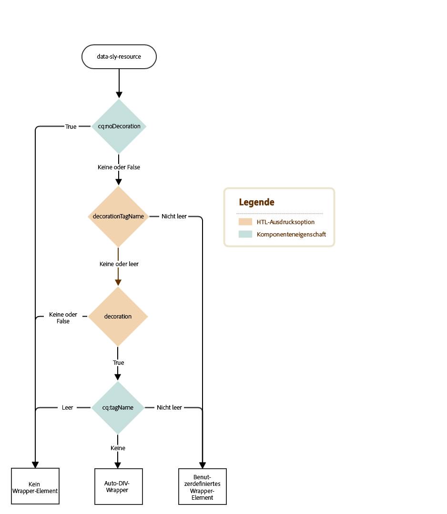
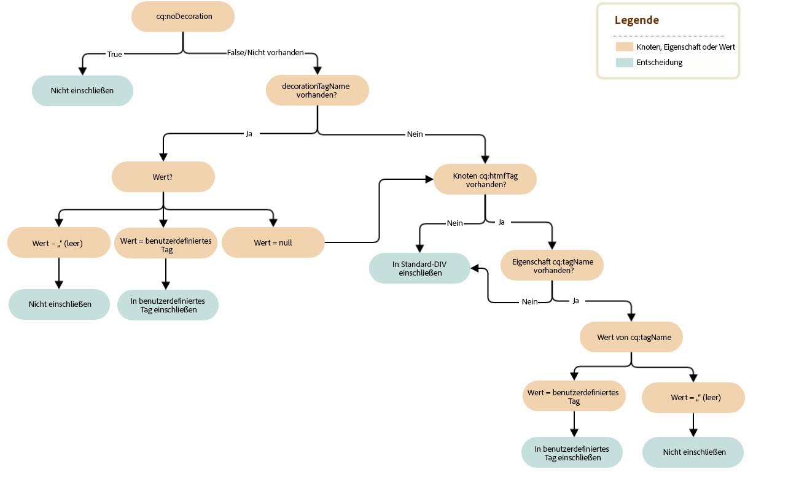

# Decoration-Tag {#decoration-tag}

Wenn eine Komponente einer Web-Seite gerendert wird, kann ein HTML-Element generiert werden, das die gerenderte Komponente in sich einschließt. Dies hat zwei Hauptgründe:

* Eine Komponente kann nur bearbeitet werden, wenn sie in einem HTML-Element eingeschlossen ist.
* Das einschließende Element wird verwendet, um HTML-Klassen anzuwenden, die Folgendes bieten:

   * Layoutinformationen
   * Styling-Informationen

Für Entwickler bietet AEM eine klare und einfache Logik für die Steuerung von Decoration-Tags, die enthaltene Komponenten einschließen. Ob und wie das Decoration-Tag gerendert wird, hängt von zwei Faktoren ab, die auf dieser Seite genauer erläutert werden:

* Die Komponenten selbst können ihr Decoration-Tag mit einer Gruppe von Eigenschaften konfigurieren.
* Die Skripte, die Komponenten enthalten (HTL, JSP, Dispatcher usw.) können die Eigenschaften des Decoration-Tags mit include-Parametern definieren.

## Empfehlungen {#recommendations}

Es folgen einige allgemeine Empfehlungen, wann Sie ein einschließendes Element verwenden sollten, um unerwartete Probleme zu vermeiden:

* Das einschließende Element sollte unabhängig von WCMModes (Bearbeitungs- oder Vorschaumodus), Instanzen (Autor oder Veröffentlichung) oder Umgebung (Staging oder Produktion) vorhanden bzw. nicht vorhanden sein, damit der CSS- und JavaScript-Code der Seite stets gleich funktionieren.
* Das einschließende Element sollte allen bearbeitbaren Komponenten hinzugefügt werden, sodass der Seiteneditor sie korrekt initialisieren und aktualisieren kann.
* Bei nicht bearbeitbaren Komponenten kann das einschließende Element weggelassen werden, wenn es keinen bestimmten Zweck erfüllt, um das Markup nicht unnötig zu vergrößern.

## Komponentensteuerungen {#component-controls}

Die folgenden Eigenschaften und Knoten können auf Komponenten angewendet werden, um das Verhalten ihrer Decoration-Tags zu steuern:

* **`cq:noDecoration {boolean}`:** Diese Eigenschaft kann einer Komponente hinzugefügt werden. Wenn der Wert „true“ lautet, darf AEM keine einschließenden Elemente für die Komponente generieren.

* **`cq:htmlTag`node :** Dieser Knoten kann unter einer Komponente hinzugefügt werden und die folgenden Eigenschaften aufweisen:

   * **`cq:tagName {String}`:** Damit können Sie ein eigenes HTML-Tag angeben, das die Komponenten anstatt des standardmäßigen DIV-Elements einschließen soll.
   * **`class {String}`:** Damit können Sie css-Klassennamen angeben, die dem einschließenden Element hinzugefügt werden sollen.
   * Andere Eigenschaftsnamen werden als HTML-Attribute mit demselben angegebenen String-Wert hinzugefügt.

## Skript-Steuerung   {#script-controls}

Das Wrapper-Verhalten unterscheidet sich jedoch je nachdem, ob [HTL](/help/sites-developing/decoration-tag.md#htl) oder [JSP](/help/sites-developing/decoration-tag.md#jsp) verwendet wird, um das Element einzuschließen.

### HTL {#htl}

Im Allgemeinen lässt sich das Wrapper-Verhalten in HTL wie folgt beschreiben:

* Standardmäßig wird kein Wrapper-DIV gerendert (wenn nur `data-sly-resource="foo"` ausgeführt wird).
* Alle wcm-Modi (deaktiviert, Vorschau, Bearbeiten für Autor oder Veröffentlichung) werden identisch dargestellt.

Das Verhalten des Wrappers kann auch vollständig kontrolliert werden.

* Das HTL-Skript hat die vollständige Kontrolle über das resultierende Verhalten des Wrapper-Tags.
* Komponenteneigenschaften (wie `cq:noDecoration` und `cq:tagName`) können ebenfalls das Wrapper-Tag definieren.

Sie können das Verhalten der Wrapper-Tags von HTL-Skripten und der zugehörigen Logik vollständig kontrollieren.

Weitere Informationen zur Entwicklung in HTL finden Sie in der [HTL-Dokumentation](https://docs.adobe.com/content/help/de/experience-manager-htl/using/overview.html).

#### Entscheidungsbaum {#decision-tree}

Dieser Entscheidungsbaum fasst die Logik zusammen, die das Verhalten der Wrapper-Tags bestimmt.



#### Anwendungsfälle {#use-cases}

Die folgenden drei Anwendungsfälle stellen Beispiele dafür dar, wie die Wrapper-Tags behandelt werden, und zeigen außerdem, wie einfach es ist, das gewünschte Verhalten der Wrapper-Tags zu steuern.

In allen Beispielen werden die folgende Inhaltsstruktur und die folgenden Komponenten angenommen:

```
/content/test/
  @resourceType = "test/components/one"
  child/
    @resourceType = "test/components/two"
```

```
/apps/test/components/
  one/
    one.html
  two/
    two.html
    cq:htmlTag/
      @cq:tagName = "article"
      @class = "component-two"
```

#### Anwendungsfall 1: Einfügen einer Komponente zur Wiederverwendung von Code {#use-case-include-a-component-for-code-reuse}

Der häufigste Anwendungsfall besteht darin, dass eine Komponente eine andere Komponente enthält, damit Code erneut verwendet werden kann. In diesem Fall soll die enthaltene Komponente nicht mit ihrer eigenen Symbolleiste und ihrem eigenen Dialogfeld bearbeitbar sein, sodass kein Wrapper notwendig ist. Das `cq:htmlTag` der Komponente wird ignoriert. Dies gilt als das Standardverhalten.

`one.html: <sly data-sly-resource="child"></sly>`

`two.html: Hello World!`

Dies ergibt die Ausgabe auf `/content/test.html`:

**`Hello World!`**

Ein Beispiel wäre etwa eine Komponente, die eine grundlegende Bildkomponente enthält, um ein Bild anzuzeigen. Dazu verwendet sie normalerweise eine künstliche Ressource, für die eine virtuelle untergeordnete Komponente eingefügt wird, indem ein Map-Objekt an data-sly-resource weitergegeben wird, das alle Eigenschaften enthält, die die Komponente aufweisen würde.

#### Anwendungsfall 2: Einfügen einer bearbeitbaren Komponente {#use-case-include-an-editable-component}

Bei einem weiteren häufigen Anwendungsfall enthalten Container-Komponenten bearbeitbare untergeordnete Komponenten z. B. einen Layout-Container. In diesem Fall benötigt jedes enthaltene untergeordnete Element einen Wrapper, damit der Editor funktioniert (es sei denn, dies ist explizit mit der Eigenschaft `cq:noDecoration` deaktiviert).

Da die eingefügte Komponente in diesem Fall eine unabhängige Komponente ist, benötigt sie ein Wrapper-Element, damit der Editor funktioniert und um Layout und Stil anzuwenden. Die Option `decoration=true` löst dieses Verhalten aus.

`one.html: <sly data-sly-resource="${'child' @ decoration=true}"></sly>`

`two.html: Hello World!`

Dies ergibt die Ausgabe auf `/content/test.html`:

**`<article class="component-two">Hello World!</article>`**

#### Anwendungsfall 3: Benutzerdefiniertes Verhalten {#use-case-custom-behavior}

Es sind unendlich viele komplexe Anwendungsfälle möglich, die einfach umgesetzt werden können, indem HTL Folgendes explizit angibt:

* **`decorationTagName='ELEMENT_NAME'`** Definiert den Elementnamen des Wrappers.
* **`cssClassName='CLASS_NAME'`** Definiert die CSS-Klassennamen, die darauf festgelegt werden sollen.

`one.html: <sly data-sly-resource="${'child' @ decorationTagName='aside', cssClassName='child'}"></sly>`

`two.html: Hello World!`

Dies ergibt die Ausgabe auf `/content/test.html`:

**`<aside class="child">Hello World!</aside>`**

## JSP {#jsp}

Wenn Sie eine Komponente mit `cq:includ`e oder `sling:include` einschließen, besteht das Standardverhalten in AEM darin, das Element mit einem DIV zu umgeben. Sie können dieses Verhalten jedoch auf zwei Arten anpassen:

* Geben Sie mit `cq:noDecoration` explizit an, dass AEM die Komponente nicht einschließen soll.
* Verwenden Sie ein benutzerdefiniertes HTML-Tag, um die Komponente mit `cq:htmlTag`/ `cq:tagName` oder `decorationTagName` zu umgeben.

### Entscheidungsbaum {#decision-tree-1}

Die folgende Entscheidungsstruktur zeigt, wie `cq:noDecoration`, `cq:htmlTag`, `cq:tagName` und `decorationTagName` das Wrapper-Verhalten beeinflussen.


