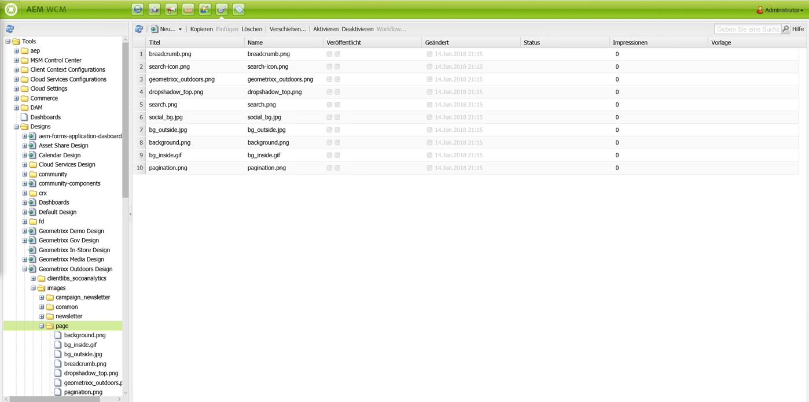
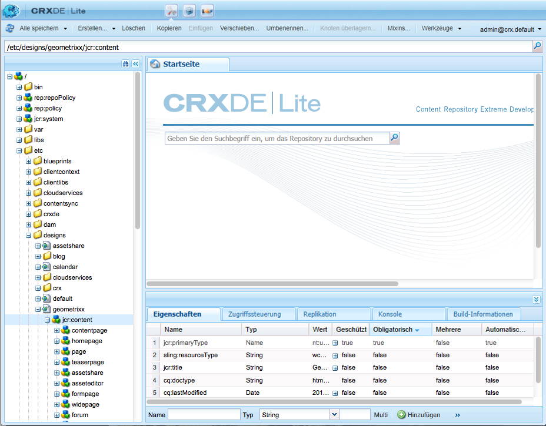

# Designs und der Designer{#designs-and-the-designer}

>[!CAUTION]
>
>In diesem Artikel wird erläutert, wie Sie Websites über die klassische Benutzeroberfläche erstellen. Adobe empfiehlt die Verwendung der neuesten AEM für Ihre Websites, wie im Artikel ausführlich beschrieben [Erste Schritte bei der Entwicklung von AEM Sites](/help/sites-developing/getting-started.md).

Mit dem Designer erstellen Sie mit der [klassischen Benutzeroberfläche](/help/release-notes/touch-ui-features-status.md) in AEM einen Entwurf für Ihre Website.

>[!NOTE]
>
>Weitere Informationen zur Barrierefreiheit im Web finden Sie unter [AEM und Richtlinien für barrierefreien Web-Zugang](/help/managing/web-accessibility.md).

## Verwenden von Designer {#using-the-designer}

Das Design wird auf der Registerkarte **Tools** im Abschnitt **Designs** definiert:



Hier erstellen Sie die Struktur, die zum Speichern des Designs erforderlich ist, und laden dann die erforderlichen Cascaded Style Sheet und Bilder hoch.

Designs werden gespeichert unter `/apps/<your-project>`. Der Pfad zu einem Design, das für eine Website verwendet wird, wird anhand der Eigenschaft `cq:designPath` des Knotens `jcr:content` angegeben.



>[!NOTE]
>
>Alle Änderungen, die auf einer Seite im Designmodus vorgenommen werden, bleiben unter dem Design-Knoten der Site erhalten und werden automatisch auf alle Seiten angewendet, die dasselbe Design aufweisen.

## Was Sie benötigen {#what-you-will-need}

Zur Realisierung Ihres Designs benötigen Sie Folgendes:

**CSS**: Cascading Style Sheets definieren die Formate bestimmter Bereiche auf Ihren Seiten.
**Bild**: Alle Bilder, die Sie für Funktionen wie Hintergrundbilder oder Schaltflächen benötigen.

### Überlegungen zum Entwurf Ihrer Website {#considerations-when-designing-your-website}

Für die Entwicklung einer Website wird nachdrücklich empfohlen, dass Sie Bilder und CSS-Dateien im Ordner `/apps/<your-project>` speichern, damit Sie anhand des aktuellen Designs auf Ihre Ressourcen verweisen können. Der folgende Ausschnitt verdeutlicht dies.

```xml
<%= currentDesign.getPath() + "/static/img/icon.gif %>
```

Das vorstehende Beispiel bietet verschiedene Vorteile:

* Je nach Designpfad verschiedener Websites haben Komponenten ein anderes Erscheinungsbild.
* Die Umgestaltung einer Website erfolgt einfach, indem der Verweis des Designpfads in einen anderen Knoten am Stamm der Website geändert wird, z. B. von `design/v1` in `design/v2.`.

* `/etc/designs` und `/content` sind die einzigen externen URLs, die der Browser erkennt. So sind Sie geschützt vor externen Benutzern, die herauszufinden versuchen, was sich unterhalb Ihrer `/apps`-Baumstruktur befindet. Die obigen URL-Vorteile helfen auch Ihrer bzw. Ihrem Systemadmin, bessere Sicherheitsmaßnahmen einzurichten, weil die Angriffsfläche der Assets auf wenige spezifische Orte beschränkt wird.
