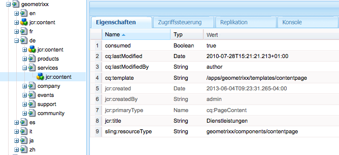

# Erstellen und Verarbeiten von Aufträgen für die Abladung{#creating-and-consuming-jobs-for-offloading}

Die Apache Sling Discovery-Funktion stellt eine Java-API bereit, die das Erstellen von JobManager-Aufträgen und JobConsumer-Diensten ermöglicht, die sie verarbeiten.

Weitere Informationen zum Erstellen von Abladetopologien und zum Konfigurieren der Themenverarbeitung finden Sie unter [Abladen von Aufträgen](/help/sites-deploying/offloading.md).

## Verarbeiten von Auftragsnutzlasten  {#handling-job-payloads}

Das Abladungs-Framework definiert zwei Auftragseigenschaften zum Identifizieren der Auftragsnutzlast. Die Replikationsagenten zur Abladung ziehen diese Eigenschaften heran, um die Ressourcen für die Replikation der Instanzen in der Topologie zu identifizieren:

* `offloading.job.input.payload`: Eine kommagetrennte Liste von Inhaltspfaden. Der Inhalt wird auf der Instanz repliziert, die den Auftrag ausführt.
* `offloading.job.output.payload`: Eine kommagetrennte Liste von Inhaltspfaden. Wenn die Auftragsausführung abgeschlossen ist, wird die Auftragsnutzlast unter diesen Pfaden auf der Instanz repliziert, die den Auftrag erstellt hat.

Verwenden Sie die Aufzählung `OffloadingJobProperties`, um auf die Eigenschaftsnamen zu verweisen:

* `OffloadingJobProperties.INPUT_PAYLOAD.propertyName()`
* `OffloadingJobProperties.OUTPUT_PAYLOAD.propetyName()`

Für Aufträge sind keine Nutzlasten erforderlich. Eine Nutzlast ist jedoch dann notwendig, wenn der Auftrag die Bearbeitung einer Ressource erfordert und er auf einen Computer abgeladen wird, der den Auftrag nicht erstellt hat.

## Erstellen von Aufträgen für die Abladung  {#creating-jobs-for-offloading}

Erstellen Sie einen Client, der die Methode „JobManager.addJob“ aufruft, um einen Auftrag zu erstellen, den von einem automatisch ausgewählten JobConsumer-Dienst ausgeführt wird. Geben Sie die folgenden Informationen an, um den Auftrag zu erstellen:

* Thema: Das Auftragsthema.
* Name: (Optional)
* Eigenschaftenzuordnung: Ein `Map<String, Object>` -Objekt, das eine beliebige Anzahl von Eigenschaften enthält, wie z. B. die Pfade der Eingabenutzlast und die Payload-Ausgabepfade. Dieses Zuordnungsobjekt ist für das JobConsumer-Objekt verfügbar, das den Auftrag ausführt.

Der Dienst im folgenden Beispiel erstellt einen Auftrag für ein bestimmtes Thema und einen bestimmten Nutzlastpfad.

```java
package com.adobe.example.offloading;

import org.apache.felix.scr.annotations.Component;
import org.apache.felix.scr.annotations.Service;
import org.apache.felix.scr.annotations.Reference;

import java.util.HashMap;

import org.apache.sling.event.jobs.Job;
import org.apache.sling.event.jobs.JobManager;

import org.apache.sling.api.resource.ResourceResolverFactory;
import org.apache.sling.api.resource.ResourceResolver;

import com.adobe.granite.offloading.api.OffloadingJobProperties;

@Component
@Service
public class JobGeneratorImpl implements JobGenerator  {

 @Reference
 private JobManager jobManager;
 @Reference ResourceResolverFactory resolverFactory;

 public String createJob(String topic, String payload) throws Exception {
  Job offloadingJob;

  ResourceResolver resolver = resolverFactory.getResourceResolver(null);
  if(resolver.getResource(payload)!=null){

   HashMap<String, Object> jobprops = new HashMap<String, Object>();
   jobprops.put(OffloadingJobProperties.INPUT_PAYLOAD.propertyName(), payload);

   offloadingJob = jobManager.addJob(topic, null, jobprops);
  } else {
   throw new Exception("Payload for job cannot be found");
  }
  if (offloadingJob == null){
   throw new Exception ("Offloading job could not be created");
  }
  return offloadingJob.getId();
 }
}
```

Das Protokoll enthält die folgende Meldung, wenn JobGeneratorImpl.createJob für das `com/adobe/example/offloading`-Thema und die `/content/geometrixx/de/services`-Payload aufgerufen wird:

```shell
10.06.2013 15:43:33.868 *INFO* [JobHandler: /etc/workflow/instances/2013-06-10/model_1554418768647484:/content/geometrixx/en/company] com.adobe.example.offloading.JobGeneratorImpl Received request to make job for topic com/adobe/example/offloading and payload /content/geometrixx/de/services
```

## Entwickeln von JobConsumer-Diensten {#developing-a-job-consumer}

Um Aufträge zu verarbeiten, entwickeln Sie einen OSGi-Dienst, der die Schnittstelle `org.apache.sling.event.jobs.consumer.JobConsumer` implementiert. Identifizieren Sie das zu verarbeitende Thema mithilfe der Eigenschaft `JobConsumer.PROPERTY_TOPICS`.

Die folgende Beispielimplementierung JobConsumer registriert sich beim `com/adobe/example/offloading` -Thema. Der JobConsumer-Dienst legt einfach den Wert für die Eigenschaft „Consumed“ des Nutzlast-Inhaltknotens auf „true“ fest.

```java
package com.adobe.example.offloading;

import org.apache.felix.scr.annotations.Component;
import org.apache.felix.scr.annotations.Property;
import org.apache.felix.scr.annotations.Reference;
import org.apache.felix.scr.annotations.Service;
import org.apache.sling.api.resource.ResourceResolver;
import org.apache.sling.api.resource.ResourceResolverFactory;
import org.apache.sling.event.jobs.Job;
import org.apache.sling.event.jobs.JobManager;
import org.apache.sling.event.jobs.consumer.JobConsumer;
import org.slf4j.Logger;
import org.slf4j.LoggerFactory;

import javax.jcr.Session;
import javax.jcr.Node;

import com.adobe.granite.offloading.api.OffloadingJobProperties;

@Component
@Service
public class MyJobConsumer implements JobConsumer {

 public static final String TOPIC = "com/adobe/example/offloading";

 @Property(value = TOPIC)
 static final String myTopic = JobConsumer.PROPERTY_TOPICS;

 @Reference
 private ResourceResolverFactory resolverFactory;

 @Reference
 private JobManager jobManager;

 private final Logger log = LoggerFactory.getLogger(getClass());

 public JobResult process(Job job) {
  JobResult result = JobResult.FAILED;
  String topic = job.getTopic();
  log.info("Consuming job of topic: {}", topic);
  String payloadIn =  (String) job.getProperty(OffloadingJobProperties.INPUT_PAYLOAD.propertyName());
  String payloadOut =  (String) job.getProperty(OffloadingJobProperties.OUTPUT_PAYLOAD.propertyName());

  log.info("Job has Input Payload {} and Output Payload {}",payloadIn, payloadOut);

  ResourceResolver resolver = null;
  try {
   resolver = resolverFactory.getAdministrativeResourceResolver(null);
   Session session = resolver.adaptTo(Session.class);
   Node inNode = session.getNode(payloadIn);
   inNode.getNode(Node.JCR_CONTENT).setProperty("consumed",true);
   result = JobResult.OK;
  }catch (Exception e){
   log.info("ERROR -- JOB RESULT IS FAILURE " + e.getMessage());
   result = JobResult.FAILED;
  }
  log.info("Job OK for payload {}",payloadIn);
  return result;
 }
}
```

Die MyJobConsumer-Klasse generiert die folgenden Protokollmeldungen für die Eingabenutzlast /content/geometrixx/de/services:

```shell
10.06.2013 16:02:40.803 *INFO* [pool-7-thread-17-<main queue>(com/adobe/example/offloading)] com.adobe.example.offloading.MyJobConsumer Consuming job of topic: com/adobe/example/offloading
10.06.2013 16:02:40.803 *INFO* [pool-7-thread-17-<main queue>(com/adobe/example/offloading)] com.adobe.example.offloading.MyJobConsumer Job has Input Payload /content/geometrixx/de/services and Output Payload /content/geometrixx/de/services
10.06.2013 16:02:40.884 *INFO* [pool-7-thread-17-<main queue>(com/adobe/example/offloading)] com.adobe.example.offloading.MyJobConsumer Job OK for payload /content/geometrixx/de/services
```

Die Eigenschaft „Consumed“ kann mithilfe von CRXDE Lite überprüft werden:



## Maven-Abhängigkeiten {#maven-dependencies}

Fügen Sie die folgenden Abhängigkeitsdefinitionen zur Datei pom.xml hinzu, damit Maven abladungsbezogene Klassen auflösen kann.

```xml
<dependency>
   <groupId>org.apache.sling</groupId>
   <artifactId>org.apache.sling.event</artifactId>
   <version>3.1.5-R1485539</version>
   <scope>provided</scope>
</dependency>
<dependency>
   <groupId>com.adobe.granite</groupId>
   <artifactId>com.adobe.granite.offloading.core</artifactId>
   <version>1.0.4</version>
   <scope>provided</scope>
</dependency>
```

Für die vorherigen Beispiele sind auch die folgenden Abhängigkeitsdefinitionen erforderlich:

```xml
<dependency>
   <groupId>org.apache.sling</groupId>
   <artifactId>org.apache.sling.api</artifactId>
   <version>2.4.3-R1488084</version>
   <scope>provided</scope>
</dependency>

<dependency>
   <groupId>org.apache.sling</groupId>
   <artifactId>org.apache.sling.jcr.jcr-wrapper</artifactId>
   <version>2.0.0</version>
   <scope>provided</scope>
</dependency>
```
