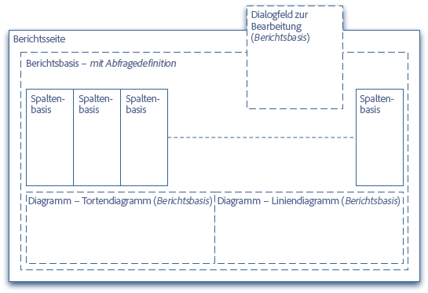
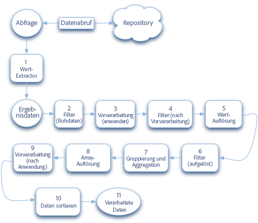

# Entwickeln von Berichten {#developing-reports}

Adobe Experience Manager (AEM) bietet eine Auswahl von [Standardberichten](/help/sites-administering/reporting.md), die größtenteils auf einem Framework für das Reporting basieren.

Mithilfe des Frameworks können Sie diese Standardberichte erweitern oder Ihre eigenen, neuen Berichte entwickeln. Das Framework für das Reporting setzt auf den bestehenden CQ5-Konzepten und -Prinzipien auf, sodass Entwickler ihre vorhandenen CQ5-Kenntnisse als Grundlage für die Entwicklung von Berichten nutzen können.

Für die mit AEM bereitgestellten Standardberichte gilt Folgendes:

* Die folgenden Berichte basieren auf dem Framework für das Reporting:

   * [Komponentenbericht](/help/sites-administering/reporting.md#component-report)
   * [Seitenaktivitätsbericht](/help/sites-administering/reporting.md#page-activity-report)
   * [Benutzerbericht](/help/sites-administering/reporting.md#user-report)
   * [Bericht der Workflow-Instanz](/help/sites-administering/reporting.md#workflow-instance-report)

* Die folgenden Berichte basieren auf speziellen Prinzipien und können daher nicht erweitert werden:

   * [Speichernutzung](/help/sites-administering/reporting.md#disk-usage)
   * [Konsistenzprüfung](/help/sites-administering/reporting.md#health-check)
   * [Workflow-Bericht](/help/sites-administering/reporting.md#workflow-report)

>[!NOTE]
>
>Im Tutorial [Erstellen eigener Berichte – ein Beispiel](#creating-your-own-report-an-example) wird außerdem erläutert, wie viele der im Folgenden aufgeführten Prinzipien angewendet werden können.
>
>Als weitere Implementierungsbeispiele können Sie auch die Standardberichte heranziehen.

>[!NOTE]
>
>In den hier aufgeführten Beispielen und Definitionen wird die folgende Notation verwendet:
>
>* Jede Zeile definiert einen Knoten oder eine Eigenschaft, wobei:
>  `N:<name> [<nodeType>]` : einen Knoten mit dem Namen `<*name*>` und des Knotentyps `<*nodeType*>`*beschreibt.*
>  `P:<name> [<propertyType]` : eine Eigenschaft mit dem Namen `<*name*>` und des Eigenschaftentyps `<*propertyType*>` beschreibt.
>  `P:<name> = <value>` : eine Eigenschaft mit dem Namen `<name>` beschreibt, deren Wert auf `<value>` festgelegt sein muss.
>
>* Die Einrückung veranschaulicht die hierarchischen Abhängigkeiten zwischen den Knoten.
>* Durch „|“ getrennte Elemente kennzeichnen eine Liste möglicher Elemente wie Typen oder Namen; `String|String[]` bedeutet beispielsweise, dass die Eigenschaft entweder „String“ oder „String[]“ lauten kann.
>
>* `[]` stellt ein Array dar, beispielsweise „String[]“ oder ein Array von Knoten wie in der [Abfragedefinition](#query-definition) festgelegt.
>
>Sofern nicht anders angegeben, lauten die Standardtypen:
>
>* Knoten – `nt:unstructured`
>* Eigenschaften - `String`

## Framework für das Reporting {#reporting-framework}

Dem Framework für das Reporting liegen die folgenden Prinzipien zugrunde:

* Sie basiert vollständig auf Ergebnissätzen, die von einer vom CQ5 QueryBuilder ausgeführten Abfrage zurückgegeben werden.
* Der Ergebnissatz legt fest, welche Dateien im Bericht angezeigten werden. Jede Zeile im Ergebnissatz entspricht einer Zeile in der Tabellenansicht des Berichts.
* Die für die Ausführung des Ergebnissatzes verfügbaren Vorgänge ähneln den RDBMS-Konzepten, in erster Linie *Gruppieren* und *Aggregation*.

* Der Datenabruf und die Datenverarbeitung erfolgen größtenteils Server-seitig.
* Die Kundin bzw. der Kunde ist allein für die Anzeige der vorverarbeiteten Daten verantwortlich. Nur kleinere Verarbeitungsaufgaben (z. B. das Erstellen von Links im Zellinhalt) werden Client-seitig ausgeführt.

Das Framework für das Reporting (am Beispiel der Struktur eines Standardberichts veranschaulicht) nutzt die folgenden Bausteine, die von der Verarbeitungswarteschlange gespeist werden:



### Berichtsseite {#report-page}

Die Berichtseite ist:

* eine standardmäßige CQ5-Seite.
* Basiert auf einer [für den Bericht konfigurierten CQ5-Standardvorlage](#report-template).

### Berichtsbasis {#report-base}

Die [`reportbase`-Komponente](#report-base-component) bildet die Grundlage eines jeden Berichts, denn sie:

* enthält die Definition der [Abfrage](#the-query-and-data-retrieval), die den zugrunde liegenden Ergebnissatz an Daten liefert.

* Sie ist ein angepasstes Absatzsystem, das alle Spalten (`columnbase`) enthält, die dem Bericht hinzugefügt werden.
* Sie legt fest, welche Diagrammtypen zur Verfügung stehen und welche gerade aktiv sind.
* Sie definiert das Dialogfeld für die Bearbeitung, über das Sie bestimmte Aspekte des Berichts konfigurieren können.

### Die columnbase-Komponente {#column-base}

Jede Spalte ist eine Instanz der [`columnbase`-Komponente](#column-base-component), für die Folgendes gilt:

* Sie ist ein Absatz, der vom Absatzsystem (`reportbase`) des entsprechenden Berichts verwendet wird.
* Definiert den Link zum [zugrunde liegenden Ergebnissatz](#the-query-and-data-retrieval). Das heißt, sie definiert die spezifischen Daten, auf die im Ergebnissatz verwiesen wird, und wie diese verarbeitet werden.
* Sie enthält neben jeglichen Standardwerten zusätzliche Definitionen, beispielsweise die verfügbaren Aggregate und Filter.

### Abfrage und Datenabruf {#the-query-and-data-retrieval}

Die Abfrage:

* ist als Teil der [`reportbase`](#report-base)-Komponente definiert.
* basiert auf dem [CQ QueryBuilder](https://developer.adobe.com/experience-manager/reference-materials/6-5/javadoc/com/day/cq/search/QueryBuilder.html).
* ruft die Daten ab, die als Grundlage für den Bericht dienen. Jede Zeile des Ergebnissatzes (der Tabelle) ist an einen Knoten gebunden, der von der Abfrage zurückgegeben wird. Aus diesem Datensatz werden dann spezifische Informationen für [einzelne Spalten](#column-base-component) extrahiert.

* Dies besteht meist aus:

   * einem Stammpfad.

     Dieser gibt die Unterstruktur des zu durchsuchenden Repositorys an.

     Um eine Beeinträchtigung der Leistung zu vermeiden, empfiehlt es sich, die Abfrage, wenn möglich, auf eine bestimmte Unterstruktur des Repositorys zu beschränken. Der Stammpfad kann im [Berichtsvorlage](#report-template) oder vom Benutzer in der [Dialogfeld &quot;Konfiguration (Bearbeiten)&quot;](#configuration-dialog).

   * [einem Kriterium oder mehreren Kriterien](#query-definition).

     Diese werden angewendet, um den (anfänglichen) Ergebnissatz zu generieren. Sie umfassen u. a. Einschränkungen hinsichtlich des Knotentyps oder Eigenschaftsbeschränkungen.

**Entscheidend hierbei ist, dass jeder einzelne im Ergebnissatz der Abfrage zurückgegebene Knoten verwendet wird, um eine einzelne Zeile im Bericht zu generieren (es handelt sich also um eine 1:1-Beziehung).**

Die Entwickelnden müssen sicherstellen, dass die für einen Bericht definierte Abfrage eine für diesen Bericht geeignete Knotengruppe zurückgibt. Der Knoten selbst muss jedoch nicht alle erforderlichen Informationen enthalten. Dies kann auch von übergeordneten und/oder untergeordneten Knoten abgeleitet werden. Beispielsweise wählt die für den [Benutzerbericht](/help/sites-administering/reporting.md#user-report) verwendete Abfrage Knoten auf Basis des Knotentyps aus (in diesem Fall `rep:user`). Die meisten Spalten dieses Berichts beziehen ihre Daten jedoch nicht direkt von diesen Knoten, sondern vom Unterknoten `profile`..

### Verarbeitungswarteschlange {#processing-queue}

Die [Abfrage](#the-query-and-data-retrieval) gibt einen Ergebnissatz von Daten zurück, die als Zeilen im Bericht angezeigt werden. Jede Zeile des Ergebnissatzes wird (serverseitig) in [mehreren Phasen](#phases-of-the-processing-queue) verarbeitet, bevor sie an den Client zur Anzeige im Bericht übergeben wird.

Dies ermöglicht Folgendes:

* das Extrahieren und Ableiten von Werten aus dem zugrunde liegenden Ergebnissatz.

  Beispielsweise lassen sich zwei Eigenschaftswerte als Einzelwert verarbeiten, indem die Differenz zwischen beiden berechnet wird.

* Das Auflösen der extrahierten Werte. Dies kann auf unterschiedliche Weise erfolgen.

  Beispielsweise können Pfade einem Titel zugeordnet werden (wie im menschenlesbareren Inhalt der entsprechenden Eigenschaft *jcr:title*).

* das Anwenden von Filtern an verschiedenen Stellen.
* das Erstellen zusammengesetzter Werte, falls erforderlich.

  Beispielsweise Werte, die aus einem Text bestehen, der den Benutzern angezeigt wird, einem Wert, nach dem sortiert werden soll, und einer zusätzlichen URL, die (Client-seitig) zum Erstellen eines Links verwendet wird.

#### Workflow der Verarbeitungswarteschlange {#workflow-of-the-processing-queue}

Der folgende Workflow stellt die Verarbeitungswarteschlange dar:



#### Phasen der Verarbeitungswarteschlange {#phases-of-the-processing-queue}

Die Schritte und Elemente lauten im Detail:

1. Transformiert die von der [Ausgangsabfrage (reportbase)](#query-definition) zurückgegebenen Ergebnisse in den grundlegenden Ergebnissatz unter Verwendung von Werteextraktionsfunktionen.

   Die Werteextraktionsfunktionen werden automatisch abhängig vom [Spaltentyp](#column-specific-definitions) ausgewählt. Sie dienen dazu, Werte aus der zugrunde liegenden JCR-Abfrage zu lesen und daraus einen Ergebnissatz zu erstellen. Danach kann eine weitere Verarbeitung erfolgen. Beispielsweise liest die Werteextraktionsfunktion für den Typ `diff` zwei Eigenschaften und berechnet den Einzelwert, der dann zum Ergebnissatz hinzugefügt wird. Die Werteextraktionsfunktionen können nicht konfiguriert werden.

1. Auf diesen ersten Ergebnissatz, der Rohdaten enthält, wird eine [anfängliche Filterung](#column-specific-definitions) (Phase *raw*) angewendet.

1. Die Werte werden [vorverarbeitet](#processing-queue), wie für die Phase *apply* definiert.

1. Die [Filterung](#column-specific-definitions) (zugewiesen zur Phase der *Vorverarbeitungs*) erfolgt anhand der vorverarbeiteten Werte.

1. Die Werte werden entsprechend dem [definierten Resolver](#processing-queue) aufgelöst.
1. Die [Filterung](#column-specific-definitions) (zugewiesen zur Phase der *Lösung*) erfolgt anhand der aufgelösten Werte.

1. Die Daten sind [gruppiert und aggregiert](#column-specific-definitions).
1. Array-Daten werden aufgelöst, indem sie in eine (zeichenfolgenbasierte) Liste konvertiert werden.

   Dies ist ein impliziter Schritt, bei dem ein mehrwertiges Ergebnis in eine anzeigbare Liste umgewandelt wird. Dies ist für (nicht aggregierte) Zellwerte erforderlich, die auf mehrwertigen JCR-Eigenschaften basieren.

1. Die Werte werden wieder [vorverarbeitet](#processing-queue), wie für die Phase *afterApply* definiert.

1. Die Daten werden sortiert.
1. Die verarbeiteten Daten werden an den Client übertragen.

>[!NOTE]
>
>Die Ausgangsabfrage, die den grundlegenden Datenergebnissatz zurückgibt, ist in der `reportbase`-Komponente definiert.
>
>Andere Elemente der Verarbeitungswarteschlange sind in den `columnbase`-Komponenten definiert.

## Aufbau und Konfiguration von Berichten {#report-construction-and-configuration}

Um einen Bericht zu erstellen und zu konfigurieren, wird Folgendes benötigt:

* ein [Speicherort für die Definition Ihrer Berichtskomponenten](#location-of-report-components)
* eine [`reportbase`-Komponente](#report-base-component)
* mindestens eine [`columnbase`-Komponente](#column-base-component)
* eine [Seitenkomponente](#page-component)
* ein [Berichts-Design](#report-design)
* eine [Berichtsvorlage](#report-template)

### Speicherort von Berichtskomponenten {#location-of-report-components}

Die standardmäßigen Berichtskomponenten befinden sich unter `/libs/cq/reporting/components`.

Es empfiehlt sich dringend, diese Knoten nicht zu aktualisieren, sondern eigene Komponentenknoten unter `/apps/cq/reporting/components` oder ggf. `/apps/<yourProject>/reports/components` zu erstellen.

Wobei (beispielsweise):

```
N:apps
    N:cq [nt:folder]
        N:reporting|reports [sling:Folder]
            N:components [sling:Folder]
```

Darunter legen Sie den Stamm für Ihren Bericht an und darunter die reportbase-Komponente und die columnbase-Komponenten:

```
N:apps
    N:cq [nt:folder]
        N:reporting|reports [sling:Folder]
            N:components [sling:Folder]
                N:<reportname> [sling:Folder]
                        N:<reportname> [cq:Component]  // report base component
                        N:<columnname> [cq:Component]  // column base component
```

### Seitenkomponente  {#page-component}

Eine Berichtseite muss den `sling:resourceType` von `/libs/cq/reporting/components/reportpage` verwenden.

Eine benutzerdefinierte Seitenkomponente sollte (normalerweise) nicht erforderlich sein.

## reportbase-Komponente {#report-base-component}

Jeder Berichtstyp benötigt eine von `/libs/cq/reporting/components/reportbase` abgeleitete Container-Komponente.

Diese Komponente dient als Container für den gesamten Bericht und stellt Informationen für Folgendes bereit:

* die [Abfragedefinition](#query-definition)
* ein [(optionales) Dialogfeld](#configuration-dialog) für die Konfiguration des Berichts
* sämtliche in den Bericht eingebundenen [Diagramme](#chart-definitions)

```
N:<reportname> [cq:Component]
    P:sling:resourceSuperType = "cq/reporting/components/reportbase"
    N:charting
    N:dialog [cq:Dialog]
    N:queryBuilder
```

### Abfragedefinition {#query-definition}

```xml
N:queryBuilder
    N:propertyConstraints
    [
        N:<name> // array of nodes (name irrelevant), each with the following properties:
            P:name
            P:value
    ]
    P:nodeTypes [String|String[]]
    P:mandatoryProperties [String|String[]
  ]
```

* `propertyConstraints`

  Beschränkt den Ergebnissatz auf Knoten, die bestimmte Eigenschaften mit bestimmten Werten aufweisen. Wenn mehrere Beschränkungen angegeben sind, muss der Knoten allen Beschränkungen entsprechen (AND-Vorgang).

  Beispiel:

  ```
  N:propertyConstraints
   [
   N:0
   P:sling:resourceType
   P:foundation/components/textimage
   N:1
   P:jcr:modifiedBy
   P:admin
   ]
  ```

  Gibt alle `textimage`-Komponenten zurück, die zuletzt vom `admin`-Benutzer geändert wurden.

* `nodeTypes`

  Wird verwendet, um den Ergebnissatz auf die angegebenen Knotentypen zu beschränken. Es können mehrere Knotentypen angegeben werden.

* `mandatoryProperties`

  Beschränkt den Ergebnissatz auf Knoten mit *allen* angegebenen Eigenschaften. Der Wert der Eigenschaften wird nicht berücksichtigt.

Alle Definitionen sind optional und können beliebig kombiniert werden, aber Sie müssen mindestens eine davon definieren.

### Diagrammdefinitionen {#chart-definitions}

```xml
N:charting
    N:settings
        N:active [cq:WidgetCollection]
        [
            N:<name> // array of nodes, each with the following property
                P:id   // must match the id of a child node of definitions
        ]
    N:definitions [cq:WidgetCollection]
    [
        N:<name> // array of nodes, each with the following properties
            P:id
            P:type
            // additional, chart type specific configurations
    ]
```

* `settings`

  Enthält Definitionen für die aktiven Diagramme.

   * `active`

     Da sich mehrere Einstellungen definieren lassen, können Sie damit festlegen, welche gerade aktiv sind. Diese werden durch ein Array von Knoten definiert (es gibt keine obligatorische Benennungskonvention für diese Knoten, für die Standardberichte wird aber häufig `0`, `1`.. `x` verwendet), die jeweils die folgende Eigenschaft aufweisen:

      * `id`

        Zum Identifizieren der aktiven Diagramme. Diese muss mit der ID einer der `definitions` des Diagramms übereinstimmen.

* `definitions`

  Definiert die Diagrammtypen, die für den Bericht verfügbar sein können. Die zu verwendenden `definitions` werden durch die `active`-Einstellungen angeben.

  Die Definitionen werden mithilfe eines Arrays von Knoten angegeben (auch in diesem Fall meist mit dem Namen `0`, `1`.. `x`), die jeweils die folgenden Eigenschaften aufweisen:

   * `id`

     Die Diagrammidentifizierung.

   * `type`

     Der Typ des verfügbaren Diagramms. Die folgenden Optionen stehen zur Auswahl:

      * `pie`
Tortendiagramm. Wird nur aus aktuellen Daten generiert.

      * `lineseries`
Eine Reihe von Linien (die Punkte verbinden, welche die eigentlichen Momentaufnahmen darstellen). Wird nur aus Verlaufsdaten generiert.

   * Je nach Diagrammtyp sind zusätzliche Eigenschaften verfügbar:

      * für den Diagrammtyp `pie`:

         * `maxRadius` ( `Double/Long`)

           Der maximal zulässige Radius für das Kreisdiagramm, daher die maximal zulässige Größe für das Diagramm (ohne Legende). Dieser wird ignoriert, wenn `fixedRadius` definiert ist.

         * `minRadius` ( `Double/Long`)

           Der minimal zulässige Radius für das Kreisdiagramm. Dieser wird ignoriert, wenn `fixedRadius` definiert ist.

         * `fixedRadius` ( `Double/Long`)
Definiert einen festen Radius für das Kreisdiagramm.

      * für den Diagrammtyp [`lineseries`](/help/sites-administering/reporting.md#display-limits):

         * `totals` ( `Boolean`)

           Sollte auf „true“ festgelegt sein, wenn eine zusätzliche Zeile mit der **Gesamtsumme** angezeigt werden soll.
Standardwert: `false`

         * `series` ( `Long`)

           Anzahl der anzuzeigenden Zeilen/Reihen.
Standardwert: `9` (dies ist auch der maximal zulässige Wert)

         * `hoverLimit` ( `Long`)

           Maximale Anzahl aggregierter Momentaufnahmen (Punkte, die auf jeder horizontalen Zeile angezeigt werden und unterschiedliche Werte darstellen), für die Popups angezeigt werden sollen. Das heißt, wenn Sie den Mauszeiger über einen bestimmten Wert oder eine entsprechende Bezeichnung in der Diagrammlegende bewegen.

           Standardwert: `35` (d. h. es werden überhaupt keine Popups angezeigt, wenn mehr als 35 verschiedene Werte für die aktuellen Diagrammeinstellungen gelten).

           Es gilt zusätzlich eine maximale Anzahl von 10 Popups, die parallel angezeigt werden können (es können mehrere Popups angezeigt werden, wenn mit der Maus über die Legendentexte gefahren wird).

### Konfigurationsdialogfeld {#configuration-dialog}

Jeder Bericht kann über ein Konfigurationsdialogfeld verfügen, in dem die Benutzenden verschiedene Parameter für den Bericht angeben können. Auf dieses Dialogfeld kann über die Schaltfläche **Bearbeiten** zugegriffen werden, wenn die Berichtseite geöffnet ist.

Dieses Dialogfeld ist ein CQ-[Standarddialogfeld](/help/sites-developing/components-basics.md#dialogs) und kann als solches konfiguriert werden (weitere Informationen finden Sie unter [CQ.Dialog](https://developer.adobe.com/experience-manager/reference-materials/6-5/widgets-api/index.html?class=CQ.Dialog)).

Ein Dialogfeld kann beispielsweise wie folgt aussehen:

```xml
<?xml version="1.0" encoding="UTF-8"?>
<jcr:root xmlns:cq="https://www.day.com/jcr/cq/1.0" xmlns:jcr="https://www.jcp.org/jcr/1.0"
    jcr:primaryType="cq:Dialog"
    height="{Long}424">
    <items jcr:primaryType="cq:WidgetCollection">
        <props jcr:primaryType="cq:Panel">
            <items jcr:primaryType="cq:WidgetCollection">
                <title
                    jcr:primaryType="cq:Widget"
                    path="/libs/cq/reporting/components/commons/title.infinity.json"
                    xtype="cqinclude"/>
                <description
                    jcr:primaryType="cq:Widget"
                    path="/libs/cq/reporting/components/commons/description.infinity.json"
                    xtype="cqinclude"/>
                <rootPath
                    jcr:primaryType="cq:Widget"
                    fieldLabel="Root path"
                    name="./report/rootPath"
                    rootPath=""
                    rootTitle="Repository root"
                    xtype="pathfield"/>
                <processing
                    jcr:primaryType="cq:Widget"
                    path="/libs/cq/reporting/components/commons/processing.infinity.json"
                    xtype="cqinclude"/>
                <scheduling
                    jcr:primaryType="cq:Widget"
                    path="/libs/cq/reporting/components/commons/scheduling.infinity.json"
                    xtype="cqinclude"/>
            </items>
        </props>
    </items>
</jcr:root>
```

Es stehen mehrere vorkonfigurierte Komponenten zur Verfügung, auf die im Dialogfeld über die Eigenschaft `xtype` mit dem Wert `cqinclude` verwiesen werden kann:

* **`title`**

  `/libs/cq/reporting/components/commons/title`

  Textfeld, das den Berichtstitel definiert.

* **`description`**

  `/libs/cq/reporting/components/commons/description`

  Textfeld, das die Berichtbeschreibung definiert.

* **`processing`**

  `/libs/cq/reporting/components/commons/processing`

  Auswahl für den Verarbeitungsmodus des Berichts (manuelles/automatisches Laden von Daten)

* **`scheduling`**

  `/libs/cq/reporting/components/commons/scheduling`

  Auswahl zum Planen von Momentaufnahmen für das historische Diagramm.

>[!NOTE]
>
>Die Komponenten, auf die verwiesen wird, müssen mit dem Suffix `.infinity.json` eingebunden werden (siehe obiges Beispiel).

### Stammverzeichnis {#root-path}

Zusätzlich kann ein Stammpfad für den Bericht definiert werden:

* **`rootPath`**

  Damit wird der Bericht auf einen bestimmten Abschnitt (Baum oder Unterbaumstruktur) des Repositorys beschränkt, was sich zur Leistungsoptimierung empfiehlt. Der Stammpfad wird durch die Eigenschaft `rootPath` des Knotens `report` jeder Berichtseite angegeben (wird bei der Seitenerstellung aus der Vorlage übernommen).

  Er kann durch Folgendes angegeben werden:

   * die [Berichtsvorlage](#report-template) (entweder als fester Wert oder als Standardwert für das Konfigurationsdialogfeld).
   * die Benutzerin bzw. der Benutzer (mithilfe dieses Parameters).

## columnbase-Komponente {#column-base-component}

Jeder Spaltentyp benötigt eine von `/libs/cq/reporting/components/columnbase` abgeleitete Komponente.

Eine Spaltenkomponente definiert eine Kombination aus folgenden Elementen:

* Die Konfiguration der [spaltenspezifischen Abfrage](#column-specific-query).
* Die [Resolver und die Vorverarbeitung](#resolvers-and-preprocessing).
* Die [spaltenspezifischen Definitionen](#column-specific-definitions) (beispielsweise Filter und Aggregate; untergeordneter Knoten `definitions`).
* [Spaltenstandardwerte](#column-default-values).
* Der [Client-Filter](#client-filter), um die anzuzeigenden Informationen aus den vom Server zurückgegebenen Daten zu extrahieren.
* Darüber hinaus muss eine Spaltenkomponente eine geeignete Instanz von `cq:editConfig` bereitstellen, um nach Bedarf [Ereignisse und Aktionen](#events-and-actions) zu definieren.
* Die Konfiguration für [generische Spalten](#generic-columns).

```
N:<columnname> [cq:Component]
    P:componentGroup
    P:jcr:title
    P:sling:resourceSuperType = "cq/reporting/components/columnbase"
    N:cq:editConfig [cq:EditConfig] // <a href="#events-and-actions">Events and Actions</a>
    N:defaults // <a href="#column-default-values">Column Default Values</a>
    N:definitions
      N:queryBuilder // <a href="#column-specific-query">Column Specific Query</a>
        P:property [String|String[]] // Column Specific Query
        P:subPath // Column Specific Query
        P:secondaryProperty [String|String[]] // Column Specific Query
        P:secondarySubPath // Column Specific Query
      N:data
        P:clientFilter [String] // <a href="#client-filter">Client Filter</a>
        P:resolver // <a href="#resolvers-and-preprocessing">Resolvers and Preprocessing</a>
        N:resolverConfig // Resolvers and Preprocessing
        N:preprocessing // Resolvers and Preprocessing
      P:type // <a href="#column-specific-definitions">Column Specific Definitions</a>
      P:groupable [Boolean] // Column Specific Definitions
      N:filters [cq:WidgetCollection] // Column Specific Definitions
      N:aggregates [cq:WidgetCollection] // Column Specific Definitions
```

Siehe auch [Definieren neuer Berichte](#defining-your-new-report).

### Spaltenspezifische Abfrage {#column-specific-query}

Diese definiert die spezifische Datenextraktion (aus dem [Datenergebnissatz des Berichts](#the-query-and-data-retrieval)) für die Verwendung in der jeweiligen Spalte..

```xml
N:definitions
    N:queryBuilder
        P:property [String|String[]]
        P:subPath
        P:secondaryProperty [String|String[]]
        P:secondarySubPath
```

* `property`

  Definiert die Eigenschaft, die für die Berechnung des tatsächlichen Zellwerts verwendet werden soll.

  Wenn eine Eigenschaft als Zeichenfolge[] definiert ist, werden mehrere Eigenschaften (in Folge) überprüft, um den tatsächlichen Wert zu finden.

  Wenn beispielsweise Folgendes vorliegt:

  `property = [ "jcr:lastModified", "jcr:created" ]`

  Der entsprechende Werteextraktor (der hier unter Kontrolle ist):

   * Er prüft, ob eine jcr:lastModified-Eigenschaft verfügbar ist. Falls ja, verwendet er sie.
   * Wenn keine jcr:lastModified-Eigenschaft verfügbar ist, wird stattdessen der Inhalt von „jcr:created“ verwendet.

* `subPath`

  Wenn sich das Ergebnis nicht auf dem Knoten befindet, der von der Abfrage zurückgegeben wird, definiert `subPath`, wo sich die Eigenschaft befindet.

* `secondaryProperty`

  Eine sekundäre Eigenschaft, die für die Berechnung des tatsächlichen Zellwerts verwendet werden muss. Diese Definition wird nur für bestimmte Spaltentypen verwendet (diff und sortable).

  Beispielsweise wird beim Bericht der Workflow-Instanz die angegebene Eigenschaft verwendet, um den tatsächlichen Wert der Zeitdifferenz (in Millisekunden) zwischen Start- und Endzeit zu speichern.

* `secondarySubPath`

  Ähnelt „subPath“, wenn `secondaryProperty` verwendet wird.

In der Regel wird nur `property` verwendet.

### Client-Filter {#client-filter}

Der Client-Filter extrahiert die anzuzeigenden Informationen aus den vom Server zurückgegebenen Daten.

>[!NOTE]
>
>Dieser Filter wird Client-seitig ausgeführt, nachdem die gesamte Server-seitige Verarbeitung erfolgt ist.

```xml
N:definitions
    N:data
        P:clientFilter [String]
```

Der `clientFilter` ist eine JavaScript-Funktion, die Folgendes tut:

* als Eingabe einen Parameter erhält – die vom Server zurückgegebenen Daten (also vollständig vorverarbeitet).
* als Ausgabe den gefilterten (verarbeiteten) Wert zurückgibt – die aus den Eingabeinformationen extrahierten oder abgeleiteten Daten.

Im folgenden Beispiel wird der entsprechende Seitenpfad aus einem Komponentenpfad extrahiert:

```
function(v) {
    var sepPos = v.lastIndexOf('/jcr:content');
    if (sepPos < 0) {
        return v;
    }
    return v.substring(sepPos + '/jcr:content'.length, v.length);
}
```

### Resolver und Vorverarbeitung {#resolvers-and-preprocessing}

Die [Verarbeitungswarteschlange](#processing-queue) definiert die verschiedenen Resolver und konfiguriert die Vorverarbeitung:

```xml
N:definitions
    N:data
        P:resolver
        N:resolverConfig
        N:preprocessing
            N:apply
            N:applyAfter
```

* `resolver`

  Definiert den zu verwendenden Resolver. Die folgenden Resolver sind verfügbar:

   * `const`

      Ordnet Werte anderen Werten zu, beispielsweise um Konstanten wie `en` in den entsprechenden Wert `English` aufzulösen.

   * `default`

     Der Standard-Resolver. Dies ist ein Platzhalter-Resolver, der eigentlich nichts auflöst.

   * `page`

       Löst einen Pfadwert zum Pfad der entsprechenden Seite auf, genauer gesagt zum entsprechenden Knoten `jcr:content`. Zum Beispiel wird `/content/.../page/jcr:content/par/xyz` nach `/content/.../page/jcr:content` aufgelöst.

   * `path`

     Löst einen Pfadwert auf, indem optional ein Unterpfad angehängt und der tatsächliche Wert aus einer Eigenschaft des Knotens (wie durch `resolverConfig` definiert) unter dem aufgelösten Pfad übernommen wird. Beispielsweise kann ein `path`, der `/content/.../page/jcr:content` lautet, zum Inhalt der Eigenschaft `jcr:title` aufgelöst werden. Dies würde bedeuten, dass ein Seitenpfad zum Seitentitel aufgelöst wird.

   * `pathextension`

     Löst einen Wert auf, indem ein Pfad vorangestellt wird und der aktuelle Wert aus einer Eigenschaft des Knotens unter dem aufgelösten Pfad übernommen wird. Einem Wert `de` könnte beispielsweise ein Pfad wie `/libs/wcm/core/resources/languages` vorangestellt werden, der den Wert aus der Eigenschaft `language` übernimmt, um den Länder-Code `de` in die Sprachbeschreibung `German` aufzulösen.

* `resolverConfig`

  Stellt Definitionen für den Resolver bereit. Die verfügbaren Optionen sind vom gewählten `resolver` abhängig.

   * `const`

     Verwenden Sie Eigenschaften, um die Konstanten zum Auflösen anzugeben. Der Name der Eigenschaft definiert die aufzulösende Konstante. Der Wert der Eigenschaft definiert den aufgelösten Wert.

     Beispielsweise wird eine Eigenschaft mit **Name**=`1` und **Value**`=One` 1 zu „One“ aufgelöst.

   * `default`

     Keine Konfiguration verfügbar.

   * `page`

      * `propertyName` (optional)

        Definiert den Namen der Eigenschaft, die für die Auflösung des Werts verwendet werden soll. Wenn kein Wert angegeben ist, wird der Standardwert *jcr:title* (der Seitentitel) verwendet. Für den Resolver `page` bedeutet dies, dass der Pfad zuerst zum Seitenpfad, dann weiter zum Seitentitel aufgelöst wird.

   * `path`

      * `propertyName` (optional)

        Gibt den Namen der Eigenschaft an, die für die Auflösung des Werts verwendet werden soll. Wenn kein Wert angegeben ist, wird der Standardwert `jcr:title` verwendet.

      * `subPath` (optional)

        Mit dieser Eigenschaft kann ein Suffix angegeben werden, das an den Pfad angehängt wird, bevor der Wert aufgelöst wird.

   * `pathextension`

      * `path` (mandatory)

        Definiert den Pfad, der vorangestellt werden soll.

      * `propertyName` (mandatory)

        Definiert die Eigenschaft für den aufgelösten Pfad, unter dem sich der aktuelle Wert befindet.

      * `i18n` (optional; Typ Boolesch)

        Legt fest, ob der aufgelöste Wert *internationalisiert* werden soll (d. h. mithilfe der [Internationalisierungsdienste von CQ5](/help/sites-administering/tc-manage.md)).

* `preprocessing`

  Die Vorverarbeitung ist optional und kann (separat) an die Verarbeitungsphasen *apply* oder *applyAfter* gebunden werden:

   * `apply`

     Die anfängliche Vorverarbeitungsphase ([Schritt 3 in der Darstellung der Verarbeitungswarteschlange](#processing-queue)).

   * `applyAfter`

     Zum Anwenden nach der Vorverarbeitung ([Schritt 9 in der Darstellung der Verarbeitungswarteschlange](#processing-queue)).

#### Resolver {#resolvers}

Die Resolver werden verwendet, um die erforderlichen Informationen zu extrahieren.  Beispiele für die verschiedenen Resolver:

**Const**

Im folgenden Beispiel wird ein konstanter Wert von `VersionCreated` in die Zeichenfolge `New version created` aufgelöst.

Siehe `/libs/cq/reporting/components/auditreport/typecol/definitions/data`.

```xml
N:data
    P:resolver=const
    N:resolverConfig
        P:VersionCreated="New version created"
```

**Seite**

Löst einen Pfadwert zur Eigenschaft „jcr:description“ des Knotens „jcr:content“ (untergeordnet) der entsprechenden Seite auf.

Siehe `/libs/cq/reporting/components/compreport/pagecol/definitions/data`.

```xml
N:data
    P:resolver=page
    N:resolverConfig
        P:propertyName="jcr:description"
```

**Pfad**

Im folgenden Beispiel wird ein Pfad, der `/content/.../page` lautet, zum Inhalt der Eigenschaft `jcr:title` aufgelöst werden. Dies würde bedeuten, dass ein Seitenpfad zum Seitentitel aufgelöst wird.

Siehe `/libs/cq/reporting/components/auditreport/pagecol/definitions/data`.

```xml
N:data
    P:resolver=path
    N:resolverConfig
        P:propertyName="jcr:title"
        P:subPath="/jcr:content"
```

**Pfaderweiterung**

Im folgenden Beispiel wird ein Wert `de` mit der Pfaderweiterung `/libs/wcm/core/resources/languages` vorangestellt, dann wird der Wert aus der Eigenschaft `language` übernommen, um den Länder-Code `de` zur Sprachbeschreibung `German` aufzulösen.

Siehe `/libs/cq/reporting/components/userreport/languagecol/definitions/data`.

```xml
N:data
    P:resolver=pathextension
    N:resolverConfig
        P:path="/libs/wcm/core/resources/languages"
        P:propertyName="language"
```

#### Vorverarbeitung {#preprocessing}

Die Definition `preprocessing` kann wahlweise auf Folgendes angewendet werden:

* Originalwert:

  Die Vorverarbeitungsdefinition für den ursprünglichen Wert wird für `apply` und/oder `applyAfter` direkt angegeben.

* Wert in seinem aggregierten Status:

  Bei Bedarf kann für jede Aggregation eine eigene Definition angegeben werden.

  Um eine explizite Vorverarbeitung für aggregierte Werte festzulegen, müssen sich die Vorverarbeitungsdefinitionen auf einem entsprechenden `aggregated` untergeordneten Knoten (`apply/aggregated`, `applyAfter/aggregated`) befinden. Wenn eine explizite Vorverarbeitung für verschiedene Aggregate erforderlich ist, befindet sich die Vorverarbeitungsdefinition in einem untergeordneten Knoten mit dem Namen des jeweiligen Aggregats (z. B. `apply/aggregated/min/max` oder anderen Aggregaten).

Sie können eine der folgenden bei der Vorverarbeitung zu verwendenden Optionen angeben:

* [Muster zum Suchen und Ersetzen](#preprocessing-find-and-replace-patterns) Wenn das angegebene Muster gefunden wird (das als regulärer Ausdruck definiert ist), wird es durch ein anderes Muster ersetzt. Dieses kann z. B. verwendet werden, um eine Teilzeichenfolge des ursprünglichen Musters zu extrahieren.

* [Datentypformatierer](#preprocessing-data-type-formatters)

  Konvertiert einen numerischen Wert in eine relative Zeichenfolge. Beispielsweise wird ein Wert, der eine Zeitdifferenz von einer Stunde angibt, in eine Zeichenfolge wie `1:24PM (1 hour ago)` aufgelöst.

Beispiel:

```xml
N:definitions
    N:data
        N:preprocessing
            N:apply|applyAfter
                P:pattern         // regex
                P:replace         // replacement for regex
                // and/or
                P:format          // data type formatter
```

#### Vorverarbeitung – Muster zum Suchen und Ersetzen {#preprocessing-find-and-replace-patterns}

Für die Vorverarbeitung können Sie ein `pattern` (definiert als [regulärer Ausdruck](https://de.wikipedia.org/wiki/Regulärer_Ausdruck) oder RegEx) angeben, das durch das Muster `replace` ersetzt wird:

* `pattern`

  Der reguläre Ausdruck, der verwendet wird, um eine Unterzeichenfolge zu finden.

* `replace`

  Die Zeichenfolge oder Darstellung der Zeichenfolge, die als Ersatz für die ursprüngliche Zeichenfolge verwendet wird. Häufig handelt es sich dabei um eine Teilzeichenfolge der Zeichenfolge, die durch den regulären Ausdruck `pattern` gefunden wird.

Ein Ersetzungsmuster kann beispielsweise wie folgt aufgeschlüsselt werden:

* Für den Knoten `definitions/data/preprocessing/apply` mit den folgenden zwei Eigenschaften:

   * `pattern`: `(.*)(/jcr:content)(/|$)(.*)`
   * `replace`: `$1`

* Eine Zeichenfolge, die wie folgt vorliegt:

   * `/content/geometrixx/en/services/jcr:content/par/text`

* wird in vier Abschnitte unterteilt:

   * `$1` - `(.*)` - `/content/geometrixx/en/services`
   * `$2` - `(/jcr:content)` - `/jcr:content`
   * `$3` - `(/|$)` - `/`
   * `$4` - `(.*)` - `par/text`

* und durch die Zeichenfolge ersetzt, die durch `$1` dargestellt wird:

   * `/content/geometrixx/en/services`

#### Vorverarbeitung – Datentypformatierer {#preprocessing-data-type-formatters}

Diese Formatierer konvertieren einen numerischen Wert in eine relative Zeichenfolge.

Dies kann beispielsweise für eine Zeitspalte verwendet werden, die die Aggregate `min`, `avg` und `max` zulässt. Da `min`/`avg`/`max`-Aggregate als *Zeitdifferenz* (z. B. `10 days ago`) dargestellt werden, benötigen sie einen Datenformatierer. Dazu wird auf die aggregierten Werte `min`/`avg`/`max` ein Formatierer `datedelta` angewendet. Wenn auch ein Aggregat `count` verfügbar ist, ist dafür kein Formatierer erforderlich, ebenso wenig wie für den ursprünglichen Wert.

Derzeit sind die folgenden Datentypformatierer verfügbar:

* `format`

  Datentypformatierer:

   * `duration`

     Die Dauer ist die Zeitspanne zwischen zwei definierten Terminen. Beispiel: Beginn und Ende einer Workflow-Aktion, die eine Stunde gedauert hat – sie hat am 13.02.11 um 11:23 Uhr begonnen und endete eine Stunde später am 13.02.11 um 12:23 Uhr.

     Der Formatierer konvertiert einen numerischen Wert (interpretiert als Millisekunden) in eine Dauerzeichenfolge, z. B. wird `30000` als * `30s`* formatiert.

   * `datedelta`

     Ein Datendelta ist die Zeitspanne zwischen einem in der Vergangenheit liegenden Datum und dem jetzigen Zeitpunkt (entsprechend fällt das Ergebnis anders aus, wenn der Bericht zu einem späteren Zeitpunkt angezeigt wird).

     Es konvertiert den numerischen Wert (interpretiert als Zeitdifferenz in Tagen) in eine relative Datumszeichenfolge. Beispielsweise wird „1“ als „vor 1 Tag“ formatiert.

Im folgenden Beispiel wird die Formatierung `datedelta` für die Aggregate `min` und `max` definiert:

```xml
N:definitions
    N:data
        N:preprocessing
            N:apply
                N:aggregated
                    N:min
                        P:format = "datedelta"
                    N:max
                        P:format = "datedelta"
```

### Spaltenspezifische Definitionen {#column-specific-definitions}

Die spaltenspezifischen Definitionen definieren die für diese Spalte verfügbaren Filter und Aggregate.

```xml
N:definitions
    P:type
    P:groupable [Boolean]
    N:filters [cq:WidgetCollection]
    [
        N:<name> // array of nodes (names irrelevant) with the following properties:
            P:filterType
            P:id
            P:phase
    ]
    N:aggregates [cq:WidgetCollection]
    [
        N:<name> // array of nodes (names irrelevant) with the following properties:
            P:text
            P:type
    ]
```

* `type`

  Die folgenden Optionen sind standardmäßig verfügbar:

   * `string`
   * `number`
   * `int`
   * `date`
   * `diff`
   * `timeslot`

     Diese Option wird verwendet, um Teile eines Datums zu extrahieren, das für die Aggregation benötigt wird (gruppieren Sie beispielsweise nach Jahr, um die Daten für die einzelnen Jahre zu aggregieren).

   * `sortable`

     Diese Option wird für Werte verwendet, die unterschiedliche Werte (aus unterschiedlichen Eigenschaften) zum Sortieren und Anzeigen verwenden.

  Außerdem kann jeder der oben genannten Werte als Mehrfachwert definiert werden, beispielsweise definiert `string[]` ein Zeichenfolgen-Array.

  Der Werte-Extractor wird durch den Spaltentyp ausgewählt. Wenn für einen Spaltentyp ein Werte-Extractor verfügbar ist, wird dieser Extractor verwendet. Andernfalls wird der standardmäßige Werte-Extractor verwendet.

  Ein Typ kann (optional) einen Parameter heranziehen. Beispielsweise extrahiert `timeslot:year` das Jahr aus einem Datumsfeld. Typen mit ihren Parametern:

   * `timeslot`: Die Werte sind mit den entsprechenden Konstanten von `java.utils.Calendar` vergleichbar.

      * `timeslot:year` - `Calendar.YEAR`
      * `timeslot:month-of-year` - `Calendar.MONTH`
      * `timeslot:week-of-year` - `Calendar.WEEK_OF_YEAR`
      * `timeslot:day-of-month` - `Calendar.DAY_OF_MONTH`
      * `timeslot:day-of-week` - `Calendar.DAY_OF_WEEK`
      * `timeslot:day-of-year` - `Calendar.DAY_OF_YEAR`
      * `timeslot:hour-of-day` - `Calendar.HOUR_OF_DAY`
      * `timeslot:minute-of-hour` - `Calendar.MINUTE`

* `groupable`

  Legt fest, ob der Bericht nach dieser Spalte gruppiert werden kann.

* `filters`

  Filterdefinitionen.

   * `filterType`

     Die verfügbaren Filter sind:

      * `string`

        Ein auf Zeichenfolgen basierender Filter.

   * `id`

     Filter-Kennung.

   * `phase`

     Verfügbare Phasen:

      * `raw`

        Der Filter wird auf Rohdaten angewendet.

      * `preprocessed`

        Der Filter wird auf vorverarbeitete Daten angewendet.

      * `resolved`

        Der Filter wird auf aufgelöste Daten angewendet.

* `aggregates`

  Aggregatdefinitionen.

   * `text`

     Textdarstellung des Namens des Aggregats. Wenn `text` nicht angegeben ist, wird die Standardbeschreibung des Aggregats verwendet. Beispiel: `minimum` wird für das `min`-Aggregat verwendet.

   * `type`

     Aggregattyp. Die verfügbaren Aggregate sind:

      * `count`

        Zählt die Anzahl der Zeilen.

      * `count-nonempty`

        Zählt die Anzahl der nicht leeren Zeilen.

      * `min`

        Es stellt den Mindestwert bereit.

      * `max`

        Es stellt den Höchstwert bereit.

      * `average`

        Es stellt den Durchschnittswert bereit.

      * `sum`

        Es stellt die Summe aller Werte bereit.

      * `median`

        Es stellt den Mittelwert bereit.

      * `percentile95`

        Verwendet das 95. Perzentil aller Werte.

### Spaltenstandardwerte {#column-default-values}

Definiert Standardwerte für die Spalte:

```xml
N:defaults
    P:aggregate
```

* `aggregate`

  Die gültigen `aggregate`-Werte sind dieselben wie für `type` unter `aggregates` (siehe [Spaltenspezifische Definitionen (Definitionen – Filter/Aggregate)](#column-specific-definitions)).

### Ereignisse und Aktionen {#events-and-actions}

Die Bearbeitungskonfiguration definiert sowohl die erforderlichen Ereignisse, die die Listener erkennen müssen, als auch die Aktionen, die nach dem Auftreten dieser Ereignisse ausgeführt werden sollen. Weitere Informationen finden Sie in der [Einführung zur Komponentenentwicklung](/help/sites-developing/components.md).

Die folgenden Werte müssen definiert werden, um sicherzustellen, dass alle erforderlichen Aktionen berücksichtigt werden:

```xml
N:cq:editConfig [cq:EditConfig]
    P:cq:actions [String[]] = "insert", "delete"
    P:cq:dialogMode = "floating"
    P:cq:layout = "auto"
    N:cq:listeners [cq:EditListenersConfig]
        P:aftercreate = "REFRESH_INSERTED"
        P:afterdelete = "REFRESH_SELF"
        P:afteredit = "REFRESH_SELF"
        P:afterinsert = "REFRESH_INSERTED"
        P:aftermove = "REFRESH_SELF"
        P:afterremove = "REFRESH_SELF"
```

### Generische Spalten {#generic-columns}

Generische Spalten sind eine Erweiterung, bei der die (meisten) Spaltendefinitionen in der Instanz des Spaltenknotens (und nicht im Komponentenknoten) gespeichert werden.

Sie verwenden ein (standardmäßiges) Dialogfeld, das Sie für die jeweilige generische Komponente anpassen können. In diesem Dialogfeld können Benutzende des Berichts die Spalteneigenschaften einer generischen Spalte auf der Berichtsseite definieren (mithilfe der Menüoption **Spalteneigenschaften…**).

Ein Beispiel hierfür ist die Spalte **Generisch** des **Benutzerberichts**. Siehe `/libs/cq/reporting/components/userreport/genericcol`.

Gehen Sie wie folgt vor, um eine Spalte als generisch zu definieren:

* Legen Sie die Eigenschaft `type` des Knotens `definition` der Spalte auf `generic` fest.

  Siehe `/libs/cq/reporting/components/userreport/genericcol/definitions`

* Geben Sie eine für das (standardmäßige) Dialogfeld unter dem Knoten `definition`definition der Spalte an.

  Siehe `/libs/cq/reporting/components/userreport/genericcol/definitions/dialog`

   * Die Felder des Dialogfelds müssen sich auf die gleichen Namen beziehen wie die entsprechende Komponenteneigenschaft, einschließlich ihres Pfads.

      Wenn Sie beispielsweise den Typ der generischen Spalte über das Dialogfeld als konfigurierbar festlegen möchten, verwenden Sie ein Feld mit dem Namen `./definitions/type`

   * Eigenschaften, die über die Benutzeroberfläche/das Dialogfeld definiert wurden, haben Vorrang vor denen, die in der `columnbase`-Komponente definiert wurden.

* Definieren Sie die Bearbeitungskonfiguration.

  Siehe `/libs/cq/reporting/components/userreport/genericcol/cq:editConfig`

* Verwenden Sie AEM-Standardmethoden, um (zusätzliche) Spalteneigenschaften zu definieren.

  Bei Eigenschaften, die sowohl für die Komponenten- als auch für Spalteninstanzen definiert sind, hat der Wert für die Spalteninstanz Vorrang.

  Die für eine generische Spalte zur Verfügung stehenden Eigenschaften lauten:

   * `jcr:title` – Spaltenname
   * `definitions/aggregates` – Aggregate
   * `definitions/filters` – Filter
   * `definitions/type` – der Typ der Spalte (dieser muss über das Dialogfeld definiert werden, entweder über eine Auswahl/ein Kombinationsfeld oder ein ausgeblendetes Feld)
   * `definitions/data/resolver` und `definitions/data/resolverConfig` (aber nicht `definitions/data/preprocessing` oder `.../clientFilter`) – der Resolver und die Konfiguration
   * `definitions/queryBuilder` – die QueryBuilder-Konfiguration
   * `defaults/aggregate` – das Standardaggregat

  Bei einer neuen Instanz der generischen Spalte im **Benutzerbericht** werden die über das Dialogfeld definierten Eigenschaften unter folgendem Pfad beibehalten:

  `/etc/reports/userreport/jcr:content/report/columns/genericcol/settings/generic`

## Berichts-Design {#report-design}

Mit dem Design wird festgelegt, welche Spaltentypen für die Erstellung eines Berichts zur Verfügung stehen.  Außerdem wird damit das Absatzsystem definiert, dem die Spalten hinzugefügt werden.

Adobe empfiehlt, für jeden Bericht ein eigenes Design zu erstellen. Dadurch wird eine umfassende Flexibilität gewährleistet. Siehe [Definieren neuer Berichte](#defining-your-new-report).

Die standardmäßigen Berichtskomponenten befinden sich unter `/etc/designs/reports`.

Der Speicherort für Ihre Berichte ist ggf. davon abhängig, wo sich Ihre Komponenten befinden:

* `/etc/designs/reports/<yourReport>` ist geeignet, wenn sich der Bericht unter `/apps/cq/reporting` befindet 

* `/etc/designs/<yourProject>/reports/<*yourReport*>` für Berichte, die das Muster `/apps/<yourProject>/reports` verwenden

Erforderliche Designeigenschaften werden unter `jcr:content/reportpage/report/columns` registriert (z. B. `/etc/designs/reports/<reportName>/jcr:content/reportpage/report/columns`):

* `components`

  Alle Komponenten und/oder Komponentengruppen, die für den Bericht zulässig sind.

* `sling:resourceType`

  Eigenschaft mit Wert dem Wert `cq/reporting/components/repparsys`.

Ein Beispiel für ein Design-Snippet (aus dem Design des Komponentenberichts):

```xml
<!-- ... -->
    <jcr:content
        jcr:primaryType="nt:unstructured"
        jcr:title="Component Report"
        sling:resourceType="wcm/core/components/designer">
        <reportpage jcr:primaryType="nt:unstructured">
            <report jcr:primaryType="nt:unstructured">
                <columns
                    jcr:primaryType="nt:unstructured"
                    sling:resourceType="cq/reporting/components/repparsys"
                    components="group:Component Report"/>
            </report>
        </reportpage>
    </jcr:content>
<!-- ... -->
```

Die Angabe von Designs für einzelne Spalten ist nicht erforderlich.  Verfügbare Spalten können im Design-Modus definiert werden.

>[!NOTE]
>
>Adobe empfiehlt, keine Änderungen an den standardmäßigen Berichts-Designs vorzunehmen. Dadurch wird sichergestellt, dass keine Änderungen beim Aktualisieren oder Installieren von Hotfixes verloren gehen.
>
>Kopieren Sie den Bericht und das entsprechende Design, wenn Sie einen Standardbericht anpassen möchten.

>[!NOTE]
>
>Standardspalten können beim Erstellen eines Berichts automatisch erstellt werden.  Diese werden in der Vorlage angegeben.

## Berichtsvorlage {#report-template}

Jeder Berichtstyp muss eine Vorlage bereitstellen.  Dabei handelt es sich um die standardmäßigen [CQ-Vorlagen](/help/sites-developing/templates.md), die auch als solche konfiguriert werden können.

Die Vorlage muss:

* den `sling:resourceType` auf `cq/reporting/components/reportpage` festlegen

* das zu verwendende Design angeben
* einen untergeordneten `report`-Knoten erstellen, der über die Eigenschaft `sling:resourceType` auf die Container-Komponente (`reportbase`) verweist

Beispiel für ein Vorlagen-Snippet (aus der Komponentenberichtsvorlage):

```xml
<!-- ... -->
    <jcr:content
        cq:designPath="/etc/designs/reports/compreport"
        jcr:primaryType="cq:PageContent"
        sling:resourceType="cq/reporting/components/reportpage">
        <report
            jcr:primaryType="nt:unstructured"
            sling:resourceType="cq/reporting/components/compreport/compreport"/>
    </jcr:content>
<!-- .. -->
```

Beispiel für ein Vorlagen-Snippet, das die Definition des Stammpfads (aus der Benutzerberichtsvorlage) zeigt:

```xml
<!-- ... -->
    <jcr:content
        cq:designPath="/etc/designs/reports/userreport"
        jcr:primaryType="cq:PageContent"
        sling:resourceType="cq/reporting/components/reportpage">
        <report
            jcr:primaryType="nt:unstructured"
            rootPath="/home/users"
            sling:resourceType="cq/reporting/components/compreport/compreport"/>
    </jcr:content>
<!-- .. -->
```

Die standardmäßigen Berichtsvorlagen befinden sich unter `/libs/cq/reporting/templates`.

Adobe empfiehlt jedoch, diese Knoten nicht zu aktualisieren. Erstellen Sie stattdessen Ihre eigenen Komponentenknoten unter `/apps/cq/reporting/templates` oder ggf. `/apps/<yourProject>/reports/templates`.

Dabei gilt beispielsweise Folgendes (siehe auch [Speicherort von Berichtskomponenten](#location-of-report-components)):

```xml
N:apps
    N:cq [nt:folder]
        N:reporting|reports [sling:Folder]
            N:templates [sling:Folder]
```

Erstellen Sie darunter den Stamm für Ihre Vorlage:

```xml
N:apps
    N:cq [nt:folder]
        N:reporting|reports [sling:Folder]
            N:templates [sling:Folder]
                N:<reportname> [sling:Folder]
```

## Erstellen eigener Berichte – Beispiel {#creating-your-own-report-an-example}

### Definieren neuer Berichte {#defining-your-new-report}

Um einen Bericht zu definieren, erstellen und konfigurieren Sie Folgendes:

1. den Stamm für Ihre Berichtskomponenten.
1. die reportbase-Komponente.
1. mindestens eine columnbase-Komponente.
1. das Berichts-Design.
1. den Stamm für Ihre Berichtsvorlage.
1. die Berichtsvorlage.

Um diese Schritte zu veranschaulichen, wird im folgenden Beispiel ein Bericht definiert, der alle OSGi-Konfigurationen im Repository auflistet. Das heißt, alle Instanzen des Knotens `sling:OsgiConfig`.

>[!NOTE]
>
>Alternativ kann auch ein vorhandener Bericht kopiert und die neue Version anschließend angepasst werden.

1. Erstellen Sie den Stammknoten für Ihren neuen Bericht.

   Zum Beispiel unter `/apps/cq/reporting/components/osgireport`.

   ```xml
   N:cq [nt:folder]
       N:reporting [sling:Folder]
           N:components [sling:Folder]
               N:osgireport [sling:Folder]
   ```

1. Definieren Sie Ihren Berichtsstamm. Zum Beispiel `osgireport[cq:Component]` unter `/apps/cq/reporting/components/osgireport`.

   ```xml
   N:osgireport [sling:Folder]
       N:osgireport [cq:Component]
           P:sling:resourceSuperType [String] = "cq/reporting/components/reportbase"
           N:charting [nt:unstructured]
               N:settings [nt:unstructured]
                   N:active [cq:WidgetCollection]
                       N:0 [nt:unstructured]
                           P:id [String] = "pie"
                       N:1 [nt:unstructured]
                           P:id [String] = "lineseries"
               N:definitions [cq:WidgetCollections]
                   N:0 [nt:unstructured]
                       P:id [String] = "pie"
                       P:maxRadius [Long] = 180
                       P:type [String] = "pie"
                   N:1 [nt:unstructured]
                       P:id [String] = "lineseries"
                       P:type [String] = "lineseries"
           N:dialog [cq:Dialog]
               P:height [Long] = 424
               N:items [cq:WidgetCollection]
                   N:props [cq:Panel]
                       N:items [cq:WidgetCollection]
                           N:title [cq:Widget]
                               P:path [String] = "/libs/cq/reporting/components/commons/title.infinity.json"
                               P:xtype [String] = "cqinclude"
                           N:description [cq:Widget]
                               P:path [String] = "/libs/cq/reporting/components/commons/description.infinity.json"
                               P:xtype [String] = "cqinclude"
                           N:rootPath [cq:Widget]
                               P:fieldLabel [String] = "Root path"
                               P:name [String] = "./report/rootPath"
                               P:xtype [String] = "pathfield"
                           N:processing [cq:Widget]
                               P:path [String] = "/libs/cq/reporting/components/commons/processing.infinity.json"
                               P:xtype [String] = "cqinclude"
                           N:scheduling [cq:Widget]
                               P:path [String] = "/libs/cq/reporting/components/commons/scheduling.infinity.json"
                               P:xtype [String] = "cqinclude"
           N:queryBuilder [nt:unstructured]
               P:nodeTypes [String[]] = "sling:OsgiConfig"
   ```

   Damit wird eine reportbase-Komponente definiert, die:

   * nach allen Knoten des Typs `sling:OsgiConfig` sucht.
   * sowohl `pie`- als auch `lineseries`-Diagramme anzeigt.
   * für die Benutzenden ein Dialogfeld zum Konfigurieren des Berichts bereitstellt.

1. Definieren Sie Ihre erste Spaltenkomponente („columnbase“).  Zum Beispiel `bundlecol[cq:Component]` unter `/apps/cq/reporting/components/osgireport`.

   ```xml
   N:osgireport [sling:Folder]
       N:bundlecol [cq:Component]
           P:componentGroup [String] = "OSGi Report"
           P:jcr:title = "Bundle"
           P:sling:resourceSuperType [String] = "cq/reporting/components/columnbase"
           N:cq:editConfig [cq:EditConfig]
               P:cq:actions [String[]] = "insert", "delete"
               P:cq:dialogMode [String] = "floating"
               P:cq:layout [String] = "auto"
               N:cq:listeners [cq:EditListenersConfig]
                   P:aftercreate [String] "REFRESH_INSERTED"
                   P:afterdelete [String] "REFRESH_SELF"
                   P:afteredit [String] "REFRESH_SELF"
                   P:afterinsert [String] "REFRESH_INSERTED"
                   P:aftermove [String] "REFRESH_SELF"
                   P:afterremove [String] "REFRESH_SELF"
           N:defaults [nt:unstructured]
               P:aggregate [String] = "count"
           N:definitions [nt:unstructured]
               P:groupable [Boolean] = false
               P:type [String] = "string"
               N:queryBuilder [nt:unstructured]
                   P:property [String] = "jcr:path"
   ```

   Damit wird eine columnbase-Komponente definiert, die:

   * den Wert sucht und zurückgibt, den sie vom Server erhält. In diesem Fall die Eigenschaft `jcr:path` für jeden Knoten `sling:OsgiConfig`.
   * das Aggregat `count` bereitstellt.
   * nicht gruppierbar ist.
   * den Titel `Bundle` aufweist (Spaltentitel in der Tabelle)
   * sich in der Sidekick-Gruppe `OSGi Report` befindet.
   * bei bestimmten Ereignissen aktualisiert wird.

   >[!NOTE]
   >
   >In diesem Beispiel liegen keine Definitionen von `N:data` und `P:clientFilter` vor. Das liegt daran, dass der vom Server empfangene Wert 1:1 zurückgegeben wird – dies ist das Standardverhalten.
   >
   >Dies entspricht den Definitionen:
   >
   >```
   >N:data [nt:unstructured]
   >   P:clientFilter [String] = "function(v) { return v; }"
   >```
   >
   >Dabei gibt die Funktion einfach den empfangenen Wert zurück.

1. Definieren Sie Ihr Berichts-Design. Zum Beispiel `osgireport[cq:Page]` unter `/etc/designs/reports`.

   ```xml
   N:osgireport [cq:Page]
       N:jcr:content [nt:unstructured]
           P:jcr:title [String] = "OSGi report"
           P:sling:resourceType [String] = "wcm/core/components/designer"
           N:reportpage [nt:unstructured]
               N:report [nt:unstructured]
                   N:columns [nt:unstructured]
                       P:components [String] = "group:OSGi Report"
                       P:sling:resourceType [String] = "cq/reporting/components/repparsys"
   ```

1. Erstellen Sie den Stammknoten für Ihre neue Berichtsvorlage.

   Zum Beispiel unter `/apps/cq/reporting/templates/osgireport`.

   ```xml
   N:cq [nt:folder]
       N:reporting [sling:Folder]
           N:templates [sling:Folder]
               N:osgireport [cq:Template]
   ```

1. Definieren Sie Ihre Berichtsvorlage. Zum Beispiel `osgireport[cq:Template]` unter `/apps/cq/reporting/templates`.

   ```xml
   N:osgireport [cq:Template]
       P:allowedPaths [String[]] = "/etc/reports(/.*)?"
       P:jcr:description [String] = "Use this report generator to create an OSGi report."
       P:jcr:title [String] = "OSGi Report Template"
       P:ranking [Long] = 100
       P:shortTitle [String] = "OSGi Report"
       N:jcr:content [cq:PageContent]
           P:cq:designPath [String] = "/etc/designs/reports/osgireport"
           P:sling:resourceType [String] = "cq/reporting/components/reportpage"
           N:report [nt:unstructured]
               P:rootPath [String] = "/"
               P:sling:resourceType [String] = "cq/reporting/components/osgireport/osgireport"
       N:thumbnail.png [nt:file]
   ```

   Damit wird eine Vorlage definiert, die:

   * Die `allowedPaths` für die resultierenden Berichte definiert – im obigen Fall an jeder beliebigen Stelle unter `/etc/reports`
   * Titel und Beschreibungen für die Vorlage bereitstellt.
   * eine Miniaturansicht für die Verwendung in der Vorlagenliste bereitstellt (die vollständige Definition dieses Knotens ist oben nicht aufgeführt – am einfachsten lässt sich eine Instanz von „thumbnail.png“ aus einem vorhandenen Bericht kopieren).

### Erstellen von Instanzen neuer Berichte {#creating-an-instance-of-your-new-report}

Sie können nun eine Instanz Ihres neuen Berichts erstellen:

1. Öffnen Sie die **Tools-Konsole**.

1. Wählen Sie im linken Bedienfeld **Berichte** aus.
1. Klicken Sie dann in der Symbolleiste auf **Neu…**. Definieren Sie einen **Titel** und **Namen**, wählen Sie Ihren neuen Berichtstyp (die **OSGi-Berichtsvorlage**) aus der Liste der Vorlagen aus und klicken Sie anschließen auf **Erstellen**.
1. Ihre neue Berichtsinstanz wird in der Liste angezeigt. Doppelklicken Sie darauf, um sie zu öffnen.
1. Ziehen Sie eine Komponente (in diesem Beispiel **Bundle** in der Gruppe **OSGi Report**) aus dem Sidekick, um die erste Spalte zu erstellen, und [beginnen Sie mit dem Definieren des Berichts](/help/sites-administering/reporting.md#the-basics-of-report-customization)..

   >[!NOTE]
   >
   >Da es in diesem Beispiel keine gruppierbaren Spalten gibt, sind die Diagramme nicht verfügbar. Legen Sie zum Anzeigen der Diagramme `groupable` auf `true` fest:
   >
   >```
   >N:osgireport [sling:Folder]
   > N:bundlecol [cq:Component]
   > N:definitions [nt:unstructured]
   > P:groupable [Boolean] = true
   >```
   >

## Konfigurieren der Dienste für das Framework für das Reporting {#configuring-the-report-framework-services}

In diesem Abschnitt werden die erweiterten Konfigurationsoptionen für die OSGi-Dienste beschrieben, die das Framework für das Reporting implementieren.

Diese können über das Konfigurationsmenü der Web-Konsole eingesehen werden (beispielsweise verfügbar unter `http://localhost:4502/system/console/configMgr`). Bei der Verwendung von AEM gibt es mehrere Methoden zur Verwaltung der Konfigurationseinstellungen für solche Dienste. Weitere Informationen und empfohlene Praktiken finden Sie unter [Konfigurieren von OSGi](/help/sites-deploying/configuring-osgi.md).

### Grundlegender Dienst („Day CQ Reporting Configuration“) {#basic-service-day-cq-reporting-configuration}

* **Zeitzone** definiert die Zeitzone, für die Verlaufsdaten erstellt werden. Damit soll sichergestellt werden, dass das Diagramm mit den Verlaufsdaten für jede Benutzerin oder jeden Benutzer weltweit dieselben Daten anzeigt.
* **Gebietsschema** definiert das Gebietsschema, das in Verbindung mit der **Zeitzone** für Verlaufsdaten verwendet werden soll. Das Gebietsschema wird verwendet, um einige gebietsschemaspezifische Kalendereinstellungen festzulegen (zum Beispiel, ob der erste Tag der Woche Sonntag oder Montag ist).

* **Momentaufnahmenpfad** definiert den Stammpfad, unter dem Momentaufnahmen für Diagramme mit Verlaufsdaten gespeichert werden.
* **Pfad zu Berichten** definiert den Pfad, unter dem sich die Berichte befinden. Dieser wird vom Momentaufnahmendienst verwendet, um die Berichte zu bestimmen, für die tatsächlich Momentaufnahmen erstellt werden sollen.
* **Tägliche Momentaufnahmen** definiert die Stunde jedes Tages, in der die täglichen Momentaufnahmen gemacht werden. Die angegebene Stunde bezieht sich auf die lokale Zeitzone des Servers.
* **Stündliche Momentaufnahmen** definiert die Minute jeder Stunde, in der stündliche Momentaufnahmen gemacht werden.
* **Zeilen (max.)** definiert die maximale Anzahl von Zeilen, die für jede Momentaufnahme gespeichert werden. Dieser Wert sollte mit Bedacht gewählt werden. Wenn er zu hoch ist, wirkt sich dies auf die Größe des Repositorys aus, wenn er zu niedrig ist, können Daten aufgrund der Art und Weise, wie Verlaufsdaten verarbeitet werden, ungenau sein.
* **Falsche Daten** – wenn diese Option aktiviert ist, können falsche Verlaufsdaten mithilfe der `fakedata`-Auswahl erstellt werden. Wenn diese Option deaktiviert ist, wird bei Verwendung der `fakedata`-Auswahl eine Ausnahme ausgelöst.

  Da es sich um falsche Daten handelt, dürfen sie *ausschließlich* zu Test- und Debugging-Zwecken verwendet werden.

  Durch das Verwenden der `fakedata`-Auswahl wird der Bericht implizit beendet, sodass alle vorhandenen Daten verloren gehen. Daten können manuell wiederhergestellt werden, dies kann jedoch zeitaufwendig sein.

* **Momentaufnahmenbenutzer** definiert einen optionalen Benutzer, der für die Aufnahme von Momentaufnahmen verwendet werden kann.

  Grundsätzlich werden Momentaufnahmen für den Benutzer erstellt, der das Reporting beendet hat. Unter Umständen (beispielsweise in einem Veröffentlichungssystem, in dem diese Person nicht existiert, da das Konto nicht repliziert wurde) empfiehlt es sich, eine Ausweichperson anzugeben, die stattdessen verwendet wird.

  Darüber hinaus kann die Angabe einer Person ein Sicherheitsrisiko darstellen.

* **Momentaufnahmenbenutzer erzwingen** – wenn diese Option aktiviert ist, werden alle Momentaufnahmen mit der unter *Momentaufnahmenbenutzer* angegebenen Person gemacht. Dies kann bei unsachgemäßem Vorgehen schwerwiegende Auswirkungen auf die Sicherheit haben.

### Cache-Einstellungen („Day CQ Reporting Cache“) {#cache-settings-day-cq-reporting-cache}

* **Aktivieren** ermöglicht es Ihnen, das Caching von Berichtsdaten zu aktivieren bzw. zu deaktivieren. Bei Aktivieren des Bericht-Caches werden die Berichtsdaten während mehrerer Anforderungen im Speicher vorgehalten.  Damit lässt sich zwar die Leistung steigern, allerdings wird auch mehr Speicherplatz beansprucht, was in unter extremen Umständen zu Speicherausfällen führen kann.
* **TTL** definiert die Zeit (in Sekunden), für die Berichtsdaten zwischengespeichert werden. Mit einem höheren Wert wird zwar die Leistung gesteigert, ggf. werden dann aber ungenaue Daten zurückgegeben, wenn sich die Daten innerhalb des Zeitraums ändern.
* **Max. Anzahl an Einträgen** definiert die maximale Anzahl an Berichten, die gleichzeitig zwischengespeichert werden.

>[!NOTE]
>
>Die Berichtsdaten können je nach Benutzerin bzw. Benutzer und Sprache unterschiedlich sein.  Daher werden die Berichtsdaten pro Bericht, Person und Sprache zwischengespeichert.  Dies bedeutet, dass ein Wert für **Max. Anzahl an Einträgen** von `2` Daten für Folgendes zwischenspeichert:
>
>* entweder für einen Bericht für zwei Benutzer mit unterschiedlichen Spracheinstellungen
>* oder für einen Benutzer und zwei Berichte
>
