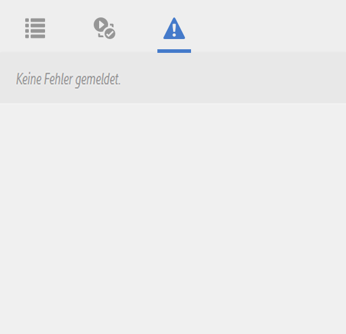

# Entwicklermodus{#developer-mode}

Beim Bearbeiten von Seiten in AEM sind diverse [Modi](/help/sites-authoring/author-environment-tools.md#modestouchoptimizedui) verfügbar, u. a. auch der Entwicklermodus. In diesem Modus wird ein Seitenbereich mit mehreren Registerkarten geöffnet, die Informationen für Entwickler über die aktuelle Seite bereitstellen. Die drei Registerkarten sind:

* **[Komponenten](#components)** zum Anzeigen von Struktur- und Leistungsdaten.
* **[Tests](#tests)** zum Ausführen von Tests und Analysieren der Ergebnisse.
* **[Fehler](#errors)** zur Anzeige auftretender Probleme.

Diese Informationen unterstützen Entwickler bei Folgendem:

* Identifizieren, welche Komponenten Seiten beinhalten.
* Debuggen, was an welcher Stelle und zu welchem Zeitpunkt geschieht und wie Probleme gelöst werden können. 
* Testen, ob sich die Anwendung wie erwartet verhält.

>[!CAUTION]
>
>Entwicklermodus:
>
>* Der Modus ist nur in der Touch-optimierten Oberfläche (beim Bearbeiten von Seiten) verfügbar.
>* Der Modus ist (aufgrund von Größenbeschränkungen) nicht auf mobilen Geräten oder in kleinen Desktop-Fenstern verfügbar.

   >
   >   
   * Dies gilt bei einer Breite von weniger als 1024 Pixel.
>* Ist nur für Benutzer verfügbar, die Mitglieder der Gruppe `administrators` sind.

>[!CAUTION]
>
>Der Entwicklermodus ist nur auf einer Standard-Autoreninstanz verfügbar, die nicht den Ausführungsmodus „nosamplecontent“ verwendet.
>
>Falls nötig, kann der Modus konfiguriert werden für die Verwendung:
>
>* auf einer Autoreninstanz im Ausführungsmodus nosamplecontent
>* auf einer Veröffentlichungsinstanz

>
>
Der Modus sollte nach der Verwendung wieder deaktiviert werden.

>[!NOTE]
>
>Weitere Tipps und Informationen zu Tools finden Sie:
>
>* im Knowledge-Base-Artikel [Beheben von Fehlern in der Touch-optimierten AEM-Benutzeroberfläche](https://helpx.adobe.com/experience-manager/kb/troubleshooting-aem-touchui-issues.html).
>* in der AEM-Gems-Sitzung zum [AEM 6.0-Entwicklermodus](https://docs.adobe.com/content/ddc/en/gems/aem-6-0-developer-mode.html).

>

## Öffnen des Entwicklermodus  {#opening-developer-mode}

Der Entwicklermodus ist als Seitenbereich im Seiten-Editor implementiert. Um den Bereich zu öffnen, wählen Sie in der Symbolleiste des Seiten-Editors aus der Modusauswahl die Option **Entwickler** aus:

Der Bereich ist in zwei Registerkarten unterteilt:

* **[Komponenten](/help/sites-developing/developer-mode.md#components)**  - Zeigt eine Komponentenstruktur an, ähnlich der  [Inhaltsstruktur ](/help/sites-authoring/author-environment-tools.md#content-tree) für Autoren

* **[Fehler](/help/sites-developing/developer-mode.md#errors)** – Wenn ein Problem auftritt, werden hier die Details für die jeweilige Komponente angezeigt.

### Komponenten  {#components}

Diese Registerkarte enthält eine Komponentenstruktur mit folgenden Attributen:

* Zeigt die Kette der Komponenten und Vorlagen, die auf dieser Seite gerendert wurden (SLY, JSP usw.). Die Struktur kann erweitert werden, sodass sie Kontext innerhalb der Hierarchie anzeigt.
* Zeigt die serverseitige Verarbeitungszeit, die zum Rendern der Komponente benötigt wird.
* Sie können die Struktur erweitern und spezifische Komponenten innerhalb der Struktur auswählen. Die Auswahl bietet Zugriff auf Komponentendetails, z. B.:

   * Repository-Pfad
   * Links zu den Skripten (Zugriff über CRXDE Lite)

* Ausgewählte Komponenten (im Inhaltsfluss durch einen blauen Rand gekennzeichnet) werden in der Inhaltsstruktur markiert (und umgekehrt).

Dies kann Folgendes erleichtern:

* Bestimmen und Vergleichen der Render-Zeit nach Komponente
* Anzeigen und Verstehen der Hierarchie
* Verstehen und Verbessern der Seitenladezeit durch Identifizieren langsamer Komponenten

Jeder Komponenteneintrag kann (z. B.) Folgendes beinhalten:

* **Details anzeigen**: ein Link zu einer Liste, die Folgendes enthält:

   * Alle zum Rendern der Komponente verwendeten Komponentenskripte
   * Den Repository-Inhaltspfad für diese spezifische Komponente

   

* **Skript bearbeiten**: ein Link, der:

   * das Komponentenskript in CRXDE Lite öffnet.

* Wenn Sie einen Komponenteneintrag erweitern, wird u. U. außerdem Folgendes angezeigt:

   * Die Hierarchie innerhalb der ausgewählten Komponente.
   * Die Render-Zeiten nur für die ausgewählte Komponente, für einzelne darin verschachtelte Komponenten und für alle Komponenten insgesamt. 

   

>[!CAUTION]
>
>Einige Links zeigen auf das Skript unter `/libs`. Diese dienen jedoch nur als Referenz. Sie dürfen **keine** Elemente unter `/libs` bearbeiten, da Ihre Änderungen möglicherweise verloren gehen. Grund dafür ist, dass diese Verzweigung jedes Mal geändert wird, wenn Sie ein Upgrade durchführen oder ein Hotfix/Feature Pack anwenden. Alle erforderlichen Änderungen sollten unter `/apps` vorgenommen werden, siehe [Überlagerungen und Überschreibungen](/help/sites-developing/overlays.md).

### Fehler {#errors}

Zwar ist zu hoffen, dass die Registerkarte **Fehler** niemals Daten anzeigt (wie oben), falls jedoch Probleme auftreten, werden zur jeweiligen Komponente folgende Details angezeigt:

* Eine Warnung, falls die Komponente einen Eintrag in das Fehlerprotokoll schreibt, und Details zum Fehler sowie direkte Links zum entsprechenden Code in CRXDE Lite.
* Eine Warnung, falls die Komponente eine Admin-Sitzung öffnet.

Wird beispielsweise eine nicht definierte Methode aufgerufen, wird der daraus resultierende Fehler auf der Registerkarte **Fehler** angezeigt:

Der Komponenteneintrag in der Struktur auf der Registerkarte „Komponenten“ wird ebenfalls entsprechend markiert, wenn ein Fehler auftritt.

### Tests {#tests}

>[!CAUTION]
>
>In AEM 6.2 wurden die Testfunktionen für den Entwicklermodus neu als eigenständige Toolanwendung implementiert.
>
>Ausführliche Informationen finden Sie unter [Testen der Benutzeroberfläche](/help/sites-developing/hobbes.md).
