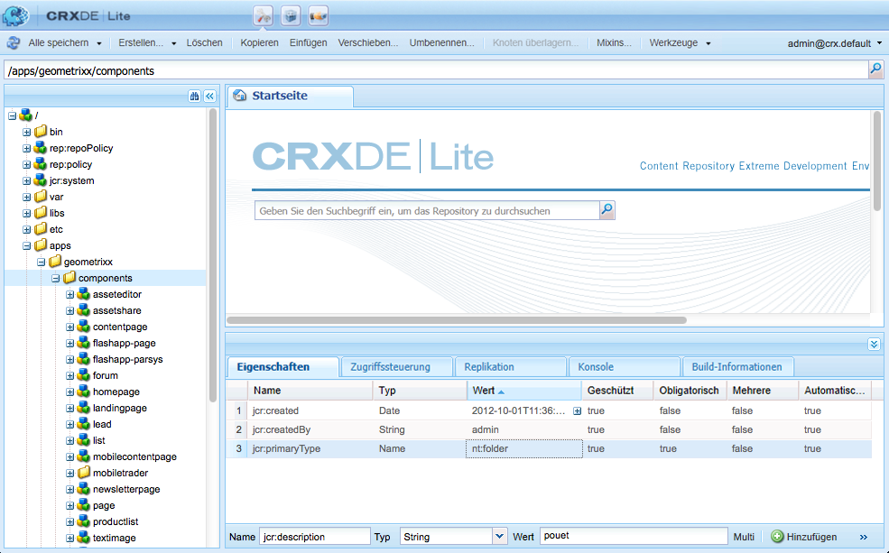
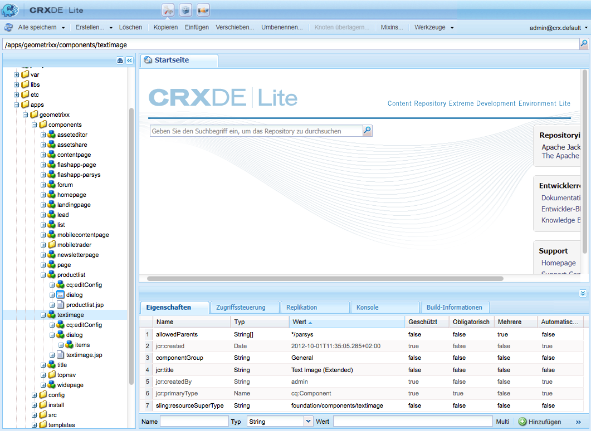
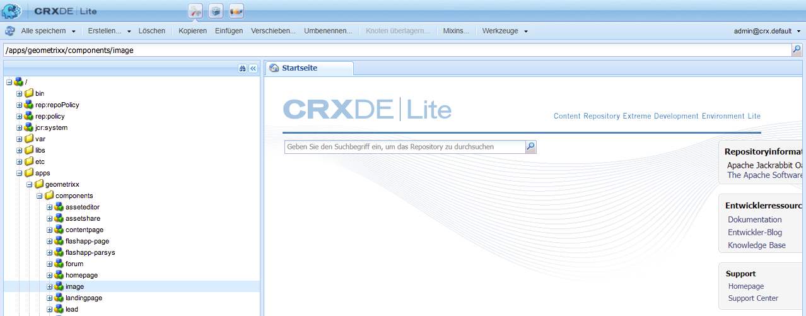
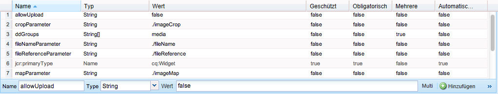
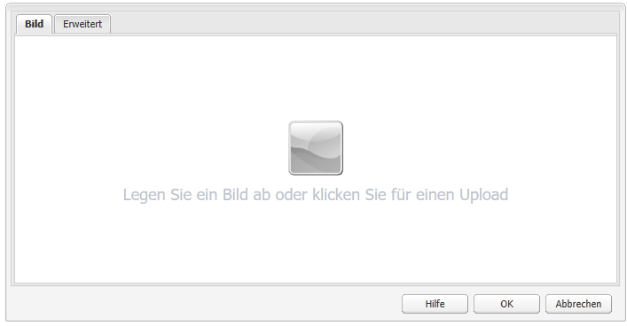
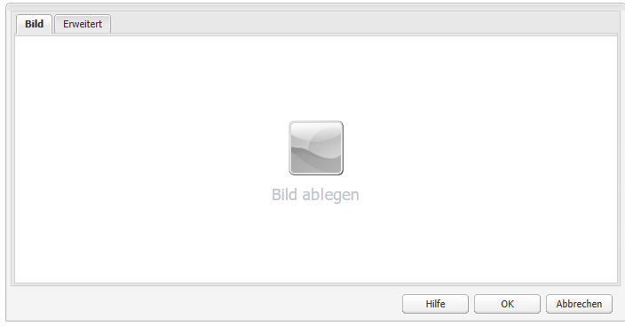

# Entwickeln von AEM-Komponenten (klassische Benutzeroberfläche){#developing-aem-components-classic-ui}

Die klassische Benutzeroberfläche nutzt ExtJS, um Widgets zu erstellen, die das Erscheinungsbild der Komponenten angeben. Aufgrund der Eigenschaften dieser Widgets gibt es einige Unterschiede zwischen der Interaktion von Komponenten mit der klassischen Benutzeroberfläche und der [Touch-optimierte Benutzeroberfläche](/help/sites-developing/developing-components.md).

>[!NOTE]
>
>Die klassische Benutzeroberfläche und die Touch-optimierte Benutzeroberfläche haben viele Aspekte der Komponentenentwicklung gemeinsam. **Lesen Sie daher unbedingt [AEM-Komponenten – die Grundlagen](/help/sites-developing/components-basics.md) vor** dieser Seite, die die spezifischen Eigenschaften der klassischen Benutzeroberfläche behandelt.

>[!NOTE]
>
>Auch wenn die HTML Template Language (HTL) und JSP beide für die Entwicklung von Komponenten für die klassische Benutzeroberfläche verwendet werden können, ist auf dieser Seite nur die Entwicklung mit JSP abgebildet. Dies liegt einzig an der Historie der Verwendung von JSP für die klassische Benutzeroberfläche.
>
>HTL ist jetzt die empfohlene Skriptsprache für AEM. Unter [HTL](https://experienceleague.adobe.com/docs/experience-manager-htl/content/overview.html?lang=de) und unter [Entwickeln von AEM-Komponenten](/help/sites-developing/developing-components.md) können Sie die Methoden vergleichen.

## Struktur {#structure}

Die grundlegende Struktur einer Komponente wird auf der Seite [AEM-Komponenten – die Grundlagen](/help/sites-developing/components-basics.md#structure) behandelt, die für Touch-optimierte und klassische Benutzeroberflächen gelten. Selbst wenn Sie die Einstellungen für die Touch-optimierte Benutzeroberfläche in Ihrer neuen Komponente nicht verwenden müssen, kann es hilfreich sein, sie beim Erben von vorhandenen Komponenten zu beachten.

## JSP Scripts {#jsp-scripts}

JSP Scripts oder Servlets können zum Rendern von Komponenten verwendet werden. Gemäß den Verarbeitungsregeln für Anfragen von Sling lautet der Name für das Standardskript:

`<*componentname*>.jsp`

## global.jsp {#global-jsp}

Die JSP-Skriptdatei `global.jsp` wird verwendet, um allen JSP-Skriptdateien, die zum Rendern einer Komponente verwendet werden, schnellen Zugriff auf bestimmte Objekte (d. h. Zugriff auf Inhalte) bereitzustellen.

Daher muss `global.jsp` in jedem JSP-Skript enthalten sein, das Komponenten rendert, bei dem mindestens ein in `global.jsp` bereitgestelltes Objekt verwendet wird.

Der Speicherort der standardmäßigen `global.jsp` ist:

`/libs/foundation/global.jsp`

>[!NOTE]
>
>Der Pfad `/libs/wcm/global.jsp`, der von den Versionen CQ 5.3 und früheren Versionen verwendet wurde, ist mittlerweile veraltet.

### Funktion von global.jsp, verwendeten APIs und Taglibs {#function-of-global-jsp-used-apis-and-taglibs}

Im Folgenden sind die wichtigsten Objekte aufgelistet, die die standardmäßige `global.jsp` bereitstellt:

Zusammenfassung:

* `<cq:defineObjects />`

   * `slingRequest` – das umschlossene Anfrageobjekt (`SlingHttpServletRequest`).
   * `slingResponse` – das umschlossene Antwortobjekt (`SlingHttpServletResponse`).
   * `resource` – das Sling-Ressourcen-Objekt (`slingRequest.getResource();`).
   * `resourceResolver` – das Sling Resource Resolver-Objekt (`slingRequest.getResoucreResolver();`).
   * `currentNode` – der aufgelöste JCR-Knoten für die Anfrage.
   * `log` – der standardmäßige Logger ().
   * `sling` – der Sling-Skript-Assistent.
   * `properties` – die Eigenschaften der betreffenden Ressource (`resource.adaptTo(ValueMap.class);`).
   * `pageProperties` – die Eigenschaften der Seite der betreffenden Ressource.
   * `pageManager` – der Seitenmanager für den Zugriff auf AEM-Inhalts-Seiten (`resourceResolver.adaptTo(PageManager.class);`).
   * `component` – das Komponentenobjekt der aktuellen AEM-Komponente.
   * `designer` – das Designer-Objekt zum Abrufen von Design-Informationen (`resourceResolver.adaptTo(Designer.class);`).
   * `currentDesign` – das Design der betreffenden Ressource.
   * `currentStyle` – der Stil der betreffenden Ressource.

### Zugreifen auf Inhalte {#accessing-content}

Es gibt drei Methoden für den Zugriff auf Inhalte in AEM WCM:

* Über das in `global.jsp` eingeführte Eigenschaftenobjekt:

  Das Eigenschaftenobjekt ist eine Instanz einer ValueMap (siehe [Sling-API](https://sling.apache.org/apidocs/sling5/org/apache/sling/api/resource/ValueMap.html)) und enthält alle Eigenschaften der aktuellen Ressource.

  Beispiel: `String pageTitle = properties.get("jcr:title", "no title");` wird im Renderskript einer Seitenkomponente verwendet.

  Beispiel: `String paragraphTitle = properties.get("jcr:title", "no title");` wird im Renderskript einer standardmäßigen Absatzkomponente verwendet.

* Über das in `global.jsp` eingeführte `currentPage`-Objekt:

  Das `currentPage`-Objekt ist eine Instanz einer Seite (siehe [AEM-API](https://helpx.adobe.com/experience-manager/6-5/sites/developing/using/reference-materials/javadoc/com/day/cq/wcm/api/Page.html)). Die Seitenklasse bietet verschiedene Methoden, um auf Inhalte zuzugreifen.

  Beispiel: `String pageTitle = currentPage.getTitle();`

* Über das in `global.jsp` eingeführte `currentNode`-Objekt:

  Das `currentNode`-Objekt ist eine Instanz eines Knotens (siehe [JCR-API](https://jackrabbit.apache.org/api/2.16/org/apache/jackrabbit/standalone/cli/core/CurrentNode.html)). Die Eigenschaften eines Knotens können über die `getProperty()`-Methode aufgerufen werden.

  Beispiel: `String pageTitle = currentNode.getProperty("jcr:title");`

## JSP-Tag-Bibliotheken {#jsp-tag-libraries}

Die Tag-Bibliotheken CQ und Sling bieten Zugriff auf bestimmte Funktionen, die im JSP-Skript Ihrer Vorlagen und Komponenten verwendet werden können.

Weitere Informationen finden Sie im Dokument [Tag-Bibliotheken](/help/sites-developing/taglib.md).

## Verwendung Client-seitiger HTML-Bibliotheken {#using-client-side-html-libraries}

Moderne Websites beruhen in hohem Maße auf der Client-seitigen Verarbeitung durch einen komplexen JavaScript- und CSS-Code. Die Organisation und Optimierung der Bereitstellung dieses Codes kann äußerst kompliziert sein.

Um Abhilfe zu schaffen, stellt AEM **Client-seitige Bibliotheksordner** zur Verfügung, mit denen Sie Ihren Client-seitigen Code im Repository speichern, in Kategorien gruppieren und definieren können, wann und wie jede Codekategorie dem Client bereitgestellt werden soll. Das Client-seitige Bibliotheksystem übernimmt dann das Herstellen der richtigen Links auf der endgültigen Webseite, um den korrekten Code zu laden.

Weitere Informationen finden Sie im Dokument [Verwendung Client-seitiger HTML-Bibliotheken](/help/sites-developing/clientlibs.md).

## Dialogfeld {#dialog}

Ihre Komponente benötigt ein Dialogfeld, in dem Autoren den Inhalt hinzufügen und konfigurieren können.

Weitere Details finden Sie unter [AEM-Komponenten – die Grundlagen](/help/sites-developing/components-basics.md#dialogs).

## Konfigurieren des Bearbeitungsverhaltens {#configuring-the-edit-behavior}

Sie können das Bearbeitungsverhalten einer Komponente konfigurieren. Dazu gehören Attribute wie für die Komponente verfügbare Aktionen, Eigenschaften des Editors für die Bearbeitung im Kontext und Listener, die sich auf Ereignisse in der Komponente beziehen. Die Konfiguration ist sowohl für die Touch-optimierte als auch für die klassische Benutzeroberfläche üblich, allerdings mit bestimmten spezifischen Unterschieden.

Um das [Bearbeitungsverhalten einer Komponente zu konfigurieren](/help/sites-developing/components-basics.md#edit-behavior), fügen Sie einen `cq:editConfig`-Knoten des Typs `cq:EditConfig` unter dem Komponentenknoten (des Typs `cq:Component`) hinzu sowie spezifische Eigenschaften und untergeordnete Knoten.

## Verwenden und Erweitern von ExtJS-Widgets {#using-and-extending-extjs-widgets}

Weitere Details finden Sie unter [Verwenden und Erweitern von ExtJS-Widgets](/help/sites-developing/widgets.md).

## Verwenden von xtypes für ExtJS-Widgets {#using-xtypes-for-extjs-widgets}

Siehe [Verwenden von xtypes](/help/sites-developing/xtypes.md) für weitere Details.

## Entwickeln neuer Komponenten {#developing-new-components}

In diesem Abschnitt wird beschrieben, wie Sie eigene Komponenten erstellen und zum Absatzsystem hinzufügen.

Eine schnelle Möglichkeit für den Einstieg ist das Kopieren einer vorhandenen Komponente, um anschließend die gewünschten Änderungen vorzunehmen.

Ein Beispiel für die Entwicklung einer Komponente wird ausführlich unter [Erweitern der Text- und Bildkomponente - ein Beispiel.](#extending-the-text-and-image-component-an-example)

### Entwickeln einer neuen Komponente (Anpassen vorhandener Komponenten) {#develop-a-new-component-adapt-existing-component}

Um neue Komponenten für AEM basierend auf einer vorhandenen Komponente zu entwickeln, können Sie die Komponente kopieren, eine JavaScript-Datei für die neue Komponente erstellen und sie an einem Speicherort speichern, der für AEM zugänglich ist (siehe auch [Anpassen von Komponenten und anderen Elementen](/help/sites-developing/dev-guidelines-bestpractices.md#customizing-components-and-other-elements)):

1. Erstellen Sie mit CRXDE Lite einen neuen Komponentenordner in:

   / `apps/<myProject>/components/<myComponent>`

   Erstellen Sie die Knotenstruktur wie in libs und kopieren Sie dann die Definition einer vorhandenen Komponente, z. B. der Textkomponente . Um beispielsweise die Textkomponente anzupassen, kopieren Sie diese

   * von `/libs/foundation/components/text`
   * nach `/apps/myProject/components/text`

1. Ändern Sie `jcr:title`, um den neuen Namen anzugeben.
1. Öffnen Sie den neuen Komponentenordner und nehmen Sie die erforderlichen Änderungen vor. Löschen Sie außerdem alle irrelevanten Informationen im Ordner.

   Sie können Änderungen vornehmen, z. B.:

   * Hinzufügen eines neuen Felds im Dialogfeld

      * `cq:dialog` – Dialogfeld für die Touch-optimierte Benutzeroberfläche
      * `dialog` – Dialogfeld für die klassische Benutzeroberfläche

   * Ersetzen der `.jsp`-Datei (Benennen Sie sie nach Ihrer neuen Komponente)
   * oder vollständiges Überarbeiten der gesamten Komponente, falls gewünscht

   Beispiel: Wenn Sie eine Kopie der standardmäßigen Textkomponente erstellen, können Sie dem Dialogfeld ein zusätzliches Feld hinzufügen und dann die `.jsp`-Datei aktualisieren, damit die hier vorgenommenen Eingaben verarbeitet werden.

   >[!NOTE]
   >
   >Eine Komponente für:
   >
   >* Die Touch-optimierte Benutzeroberfläche verwendet [Granite](https://helpx.adobe.com/de/experience-manager/6-5/sites/developing/using/reference-materials/granite-ui/api/jcr_root/libs/granite/ui/index.html)-Komponenten
   >* Klassische Benutzeroberfläche [ExtJS-Widgets](https://helpx.adobe.com/experience-manager/6-5/sites/developing/using/reference-materials/widgets-api/index.html)

   >[!NOTE]
   >
   >Ein für die klassische Benutzeroberfläche definiertes Dialogfeld wird in der Touch-optimierten Benutzeroberfläche verwendet.
   >
   >Ein Dialogfeld, das für die Touch-optimierte Benutzeroberfläche definiert ist, funktioniert nicht in der klassischen Benutzeroberfläche.
   >
   >Abhängig von Ihrer Instanz und der Autorenumgebung können Sie beide Arten eines Dialogfelds für Ihre Komponente definieren.

1. Einer der folgenden Knoten muss vorhanden und ordnungsgemäß initialisiert sein, damit die neue Komponente angezeigt wird:

   * `cq:dialog` – Dialogfeld für die Touch-optimierte Benutzeroberfläche
   * `dialog` – Dialogfeld für die klassische Benutzeroberfläche
   * `cq:editConfig` – Verhalten von Komponenten in der Bearbeitungsumgebung (z. B Ziehen und Ablegen)
   * `design_dialog` – Dialogfeld für den Design-Modus (nur klassische Benutzeroberfläche)

1. Aktivieren Sie die neue Komponente in Ihrem Absatzsystem anhand folgender Optionen:

   * Verwenden von CRXDE Lite zum Hinzufügen des Werts `<path-to-component>` (Beispiel: `/apps/geometrixx/components/myComponent`) zu den Eigenschaftenkomponenten des Knotens `/etc/designs/geometrixx/jcr:content/contentpage/par`
   * den Anweisungen unter [Hinzufügen neuer Komponenten zu Absatzsystemen](#adding-a-new-component-to-the-paragraph-system-design-mode)

1. Öffnen Sie AEM WCM eine Seite auf Ihrer Website und fügen Sie einen neuen Absatz des soeben erstellten Typs ein, um sicherzustellen, dass die Komponente ordnungsgemäß funktioniert.

>[!NOTE]
>
>Zum Anzeigen von Zeitstatistiken für das Laden von Seiten verwenden Sie Strg-Umschalt-U, wobei in der URL der Wert `?debugClientLibs=true` festgelegt ist.

### Hinzufügen einer neuen Komponente zum Absatzsystem (Design-Modus) {#adding-a-new-component-to-the-paragraph-system-design-mode}

Nachdem die Komponente entwickelt wurde, fügen Sie sie zum Absatzsystem hinzu, wodurch Autoren die Komponente auswählen und beim Bearbeiten einer Seite verwenden können.

1. Rufen Sie eine Seite in Ihrer Autorenumgebung auf, die das Absatzsystem verwendet, zum Beispiel `<contentPath>/Test.html`.
1. Wechseln Sie auf eine der folgenden Arten zum Design-Modus:

   * Hinzufügen von `?wcmmode=design` zum Ende der URL und erneuter Zugriff, z. B.:

     `<contextPath>/ Test.html?wcmmode=design`

   * Klicken auf Design in Sidekick

   Sie befinden sich jetzt im Design-Modus und können das Absatzsystem bearbeiten.

1. Klicken Sie auf „Bearbeiten“.

   Eine Liste der Komponenten, die zum Absatzsystem gehören, wird angezeigt. Ihre neue Komponente wird ebenfalls aufgelistet.

   Die Komponenten können aktiviert (oder deaktiviert) werden, um zu bestimmen, welche dem Autor beim Bearbeiten einer Seite angeboten werden.

1. Aktivieren Sie die Komponente und kehren Sie dann zum normalen Bearbeitungsmodus zurück, um zu bestätigen, dass sie verfügbar ist.

### Erweitern der Text- und Bildkomponente - ein Beispiel {#extending-the-text-and-image-component-an-example}

In diesem Abschnitt finden Sie ein Beispiel dafür, wie die häufig verwendete Text- und Bildstandardkomponente mit einer konfigurierbaren Bildplatzierungsfunktion erweitert werden kann.

Die Erweiterung der Text- und Bildkomponente ermöglicht es Editoren, alle vorhandenen Funktionen der Komponente zu verwenden. Außerdem bietet sie eine zusätzliche Option, um die Platzierung des Bildes anzugeben:

* Links im Text (aktuelles Verhalten und neuer Standard)
* sowie auf der rechten Seite

Nachdem Sie diese Komponente erweitert haben, können Sie die Bildplatzierung über das Dialogfeld der Komponente konfigurieren.

In dieser Übung werden die folgenden Techniken beschrieben:

* Kopieren des vorhandenen Komponentenknotens und Ändern der Metadaten
* Ändern des Komponentendialogfelds, einschließlich der Vererbung von Widgets aus übergeordneten Dialogfeldern
* Ändern des Skripts der Komponente zur Implementierung der neuen Funktion

>[!NOTE]
>
>Dieses Beispiel ist auf die klassische Benutzeroberfläche ausgerichtet.

>[!NOTE]
>
>Dieses Beispiel beruht auf dem Geometrixx-Beispielinhalt, der nicht mehr im Lieferumfang von AEM enthalten ist und durch We.Retail ersetzt wird. Im Dokument [We.Retail-Referenzimplementierung](/help/sites-developing/we-retail.md#we-retail-geometrixx) finden Sie Informationen zum Herunterladen und Installieren von Geometrixx.

#### Erweitern der vorhandenen textimage-Komponente {#extending-the-existing-textimage-component}

Zum Erstellen der neuen Komponente verwenden wir die standardmäßige textimage-Komponente als Grundlage und bearbeiten sie. Wir speichern die neue Komponente in der Geometrixx-AEM WCM-Beispielanwendung.

1. Kopieren Sie die standardmäßige textimage-Komponente aus `/libs/foundation/components/textimage` in den Geometrixx-Komponentenordner `/apps/geometrixx/components` und verwenden Sie textimage als Namen des Zielknotens. (Kopieren Sie die Komponente, indem Sie zur Komponente navigieren, mit der rechten Maustaste klicken, „Kopieren“ auswählen und zum Zielverzeichnis navigieren.)

   

1. Um dieses Beispiel einfach zu halten, navigieren Sie zu der Komponente, die Sie kopiert haben, und löschen alle Unterknoten des neuen textimage-Knotens mit Ausnahme der folgenden:

   * Dialogfeld-Definition: `textimage/dialog`
   * Komponentenskript: `textimage/textimage.jsp`
   * Bearbeitungskonfigurationsknoten (Ziehen und Ablegen von Assets erlauben): `textimage/cq:editConfig`

   >[!NOTE]
   >
   >Die Dialogfelddefinition hängt von der Benutzeroberfläche ab:
   >
   >* Touch-optimierte Benutzeroberfläche: `textimage/cq:dialog`
   >* Klassische Benutzeroberfläche: `textimage/dialog`

1. Bearbeiten Sie die Komponentenmetadaten:

   * Komponentenname

      * `jcr:description` wird auf `Text Image Component (Extended)` gesetzt
      * `jcr:title` wird auf `Text Image (Extended)` gesetzt

   * Gruppe, in der die Komponente im Sidekick aufgelistet ist (unverändert lassen)

      * `componentGroup` wird auf `General` belassen

   * Übergeordnete Komponente für die neue Komponente (die standardmäßige textimage-Komponente)

      * `sling:resourceSuperType` wird auf `foundation/components/textimage` gesetzt

   Nach diesem Schritt sieht der Komponentenknoten wie folgt aus:

   

1. Ändern Sie die `sling:resourceType`-Eigenschaft des Konfigurationsknotens „edit“ des Bildes (Eigenschaft: `textimage/cq:editConfig/cq:dropTargets/image/parameters/sling:resourceType`) zu `geometrixx/components/textimage.`

   Auf diese Weise wird beim Ablegen eines Bilds in der Komponente auf der Seite die `sling:resourceType`-Eigenschaft der erweiterten textimage-Komponente auf `geometrixx/components/textimage.` festgelegt.

1. Ändern Sie das Dialogfeld der Komponente, um die neue Option einzuschließen. Die neue Komponente übernimmt die Teile des Dialogfelds, die mit denen im Original übereinstimmen. Der einzige Zusatz, den wir machen, ist die Erweiterung der **Erweitert** Registerkarte, um eine **Bildposition** Dropdown-Liste mit Optionen **Left** und **Right**:

   * Lassen Sie die `textimage/dialog`-Eigenschaften unverändert.

   Beachten Sie, dass `textimage/dialog/items` vier Unterknoten aufweist, tab1 bis tab4, die den vier Registerkarten des textimage-Dialogfelds entsprechen.

   * Für die ersten beiden Registerkarten (tab1 und tab2):

      * Ändern Sie xtype in cqinclude (um von der Standardkomponente zu übernehmen).
      * Fügen Sie eine Pfadeigenschaft mit Werten `/libs/foundation/components/textimage/dialog/items/tab1.infinity.json` bzw. `/libs/foundation/components/textimage/dialog/items/tab2.infinity.json` hinzu.
      * Entfernen Sie alle anderen Eigenschaften oder Unterknoten.

   * Für tab3:

      * Lassen Sie die Eigenschaften und Unterknoten unverändert.
      * Fügen Sie `tab3/items`, der Knotenposition von Typ `cq:Widget`, eine neue Felddefinition hinzu.
      * Legen Sie die folgenden Eigenschaften (vom Typ „String“) für den neuen Knoten `tab3/items/position` fest:

         * `name`: `./imagePosition`
         * `xtype`: `selection`
         * `fieldLabel`: `Image Position`
         * `type`: `select`

      * Fügen Sie den Unterknoten `position/options` vom Typ `cq:WidgetCollection` hinzu, um die beiden Optionen für die Bildplatzierung darzustellen, und erstellen Sie darunter die beiden Knoten o1 und o2 vom Typ `nt:unstructured`.
      * Legen Sie für den Knoten `position/options/o1` die Eigenschaften wie folgt fest: `text` auf `Left` und `value` auf `left.`
      * Legen Sie für den Knoten `position/options/o2` die Eigenschaften wie folgt fest: `text` auf `Right` und `value` auf `right`.

   * Löschen Sie tab4.

   Die Bildposition wird im Inhalt als `imagePosition`-Eigenschaft des Knotens beibehalten, der für den Absatz `textimage` steht. Nach diesen Schritten sieht das Komponentendialogfeld folgendermaßen aus:

   

1. Erweitern Sie das Komponentenskript `textimage.jsp` um eine zusätzliche Bearbeitungsmöglichkeit des neuen Parameters:

   ```xml
   Image image = new Image(resource, "image");
   
   if (image.hasContent() || WCMMode.fromRequest(request) == WCMMode.EDIT) {
        image.loadStyleData(currentStyle);
   ```

   Wir ersetzen das hervorgehobene Code-Fragment *%>&lt;div class=&quot;image&quot;>&lt;%* durch einen neuen Code, der einen benutzerdefinierten Stil für dieses Tag generiert.

   ```xml
   // todo: add new CSS class for the 'right image' instead of using
   // the style attribute
   String style="";
        if (properties.get("imagePosition", "left").equals("right")) {
             style = "style=\"float:right\"";
        }
        %><div <%= style %> class="image"><%
   ```

1. Speichern Sie die Komponente im Repository. Die Komponente kann jetzt getestet werden.

#### Überprüfen der neuen Komponente {#checking-the-new-component}

Nachdem die Komponente entwickelt wurde, können Sie sie dem Absatzsystem hinzufügen, wodurch Autoren die Komponente auswählen und beim Bearbeiten einer Seite verwenden können. Mit diesen Schritten können Sie die Komponente testen.

1. Öffnen Sie eine Seite in Geometrixx wie Englisch / Firma.
1. Wechseln Sie in den Design-Modus, indem Sie im Sidekick auf „Design“ klicken.
1. Bearbeiten Sie das Absatzsystemdesign, indem Sie in der Mitte der Seite im Absatzsystem auf Bearbeiten klicken. Eine Liste von Komponenten, die im Absatzsystem platziert werden können, wird angezeigt. Sie sollte die neu entwickelte Komponente Textbild (erweitert) enthalten. Aktivieren Sie sie für das Absatzsystem, indem Sie sie auswählen und auf OK klicken.
1. Wechseln Sie zurück in den Bearbeitungsmodus.
1. Fügen Sie den Absatz Textbild (erweitert) zum Absatzsystem hinzu, initialisieren Sie Text und Bild mit Beispielinhalt. Speichern Sie die Änderungen.
1. Öffnen Sie das Dialogfeld des Text- und Bildabsatzes, ändern Sie die Bildposition auf der Registerkarte &quot;Erweitert&quot;in &quot;Rechts&quot;und klicken Sie auf &quot;OK&quot;, um die Änderungen zu speichern.
1. Der Absatz wird mit dem Bild auf der rechten Seite gerendert.
1. Die Komponente ist jetzt einsatzbereit.

Die Komponente speichert ihren Inhalt in einem Absatz auf der Unternehmensseite.

### Deaktivieren der Upload-Funktion der Bildkomponente {#disable-upload-capability-of-the-image-component}

Um diese Funktion zu deaktivieren, verwenden wir die standardmäßige image-Komponente als Grundlage und bearbeiten sie. Wir speichern die neue Komponente in der Geometrixx-Beispielanwendung.

1. Kopieren Sie die standardmäßige image-Komponente aus `/libs/foundation/components/image` in den Geometrixx-Komponentenordner `/apps/geometrixx/components` und verwenden Sie image als Namen des Zielknotens.

   

1. Bearbeiten Sie die Komponentenmetadaten:

   * Legen Sie **jcr:title** auf `Image (Extended)` fest

1. Navigieren Sie zu `/apps/geometrixx/components/image/dialog/items/image`.
1. Neue Eigenschaft hinzufügen:

   * **Name**: `allowUpload`
   * **Typ**: `String`
   * **Wert**: `false`

   

1. Klicken Sie auf **Alle speichern**. Die Komponente kann jetzt getestet werden.
1. Öffnen Sie eine Seite in Geometrixx wie Englisch / Firma.
1. Wechseln Sie in den Design-Modus und aktivieren Sie „Bild (erweitert)“.
1. Wechseln Sie zurück in den Bearbeitungsmodus und fügen Sie ihn zum Absatzsystem hinzu. Auf den nächsten Bildern sehen Sie die Unterschiede zwischen der ursprünglichen Bildkomponente und der soeben erstellten.

   Originalbildkomponente:

   

   Ihre neue image-Komponente:

   

1. Die Komponente ist jetzt einsatzbereit.
