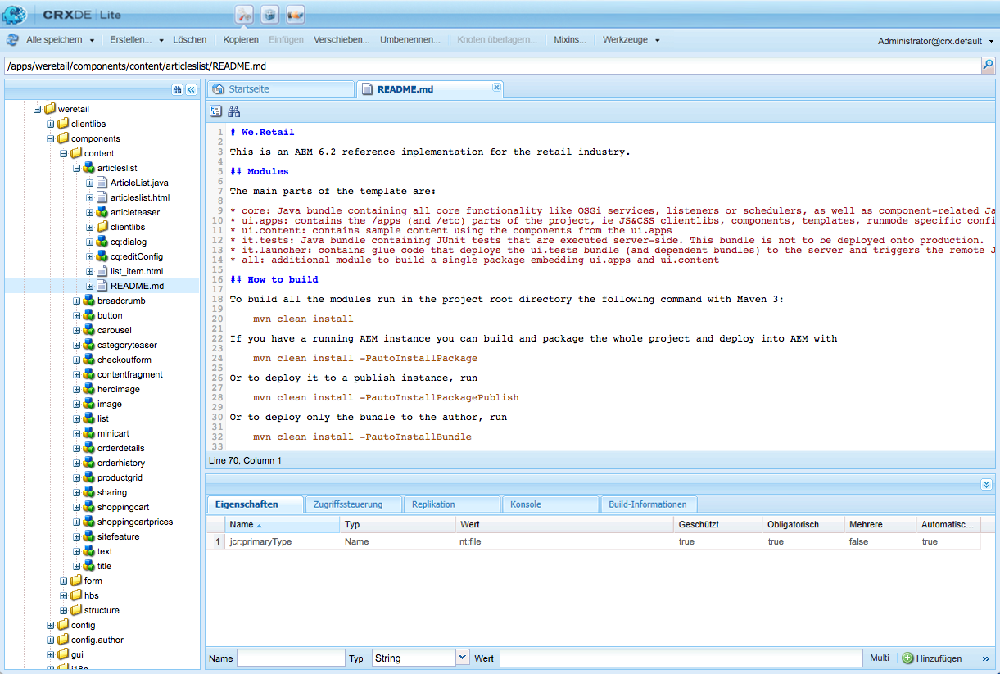

# Entwickeln von AEM-Komponenten{#developing-aem-components}

AEM-Komponenten werden verwendet, um den Inhalt, den Sie auf Ihren Web-Seiten bereitstellen, zu speichern, zu formatieren und zu rendern.

* Beim [Erstellen von Seiten](/help/sites-authoring/default-components.md) erlauben es die Komponenten den Autoren, den Inhalt zu bearbeiten und zu konfigurieren.

   * Beim Erstellen einer [Commerce](/help/commerce/cif-classic/administering/ecommerce.md)-Site können die Komponenten beispielsweise Informationen aus dem Katalog sammeln und rendern.
Weitere Informationen finden Sie unter [Entwicklung von eCommerce](/help/commerce/cif-classic/developing/ecommerce.md).

   * Wenn Sie eine [Communities](/help/communities/author-communities.md)-Site erstellen, können die Komponenten Informationen für Ihre Besucher bereitstellen und Informationen erfassen.
Weitere Informationen finden Sie unter [Entwicklung von Communities](/help/communities/communities.md).

* Auf der Veröffentlichungsinstanz rendern die Komponenten Ihren Inhalt und stellen ihn Ihren Besuchern wie gewünscht dar.

>[!NOTE]
>
>Diese Seite ist eine Fortsetzung des Dokuments [AEM Komponenten - Die Grundlagen](/help/sites-developing/components-basics.md).

>[!CAUTION]
>
>Komponenten unter `/libs/cq/gui/components/authoring/dialog` sind nur für die Verwendung im Editor vorgesehen (Komponentendialoge im Authoring). Wenn sie an anderer Stelle verwendet werden (z. B. in einem Assistentendialogfeld), verhalten sie sich möglicherweise nicht wie erwartet.

## Codebeispiele {#code-samples}

Diese Seite enthält die Referenzdokumentation (oder Links zur Referenzdokumentation) die für die Entwicklung neuer Komponenten für AEM erforderlich sind. Einige praktische Beispiele finden Sie unter [Entwickeln von AEM-Komponenten - Codebeispiele](/help/sites-developing/developing-components-samples.md).

## Struktur {#structure}

Die grundlegende Struktur einer Komponente wird auf der Seite [AEM Komponenten - Grundlagen](/help/sites-developing/components-basics.md#structure) beschrieben. Dieses Dokument umfasst sowohl die touchfähigen als auch die klassischen Benutzeroberflächen. Auch wenn Sie die klassischen Einstellungen in Ihrer neuen Komponente nicht verwenden müssen, kann es hilfreich sein, sie beim Erben von vorhandenen Komponenten zu beachten.

## Erweiterung bestehender Komponenten und Dialogfelder {#extending-existing-components-and-dialogs}

Abhängig von der Komponente, die Sie implementieren möchten, könnte es möglich sein, eine vorhandene Instanz zu erweitern oder anzupassen, anstatt die gesamte [Struktur](#structure) von Grund auf neu zu definieren und zu entwickeln.

Wenn Sie eine vorhandene Komponente oder ein bestehendes Dialogfeld erweitern oder anpassen, können Sie entweder die gesamte Struktur oder die für das Dialogfeld erforderliche Struktur kopieren oder replizieren, bevor Sie Ihre Änderungen vornehmen.

### Erweitern einer vorhandenen Komponente {#extending-an-existing-component}

Das Erweitern einer vorhandenen Komponente kann mit der [Ressourcentyphierarchie](/help/sites-developing/components-basics.md#component-hierarchy-and-inheritance) und den zugehörigen Vererbungsmechanismen erreicht werden.

>[!NOTE]
>
>Komponenten können mit einer Überlagerung ebenfalls neu definiert werden, die auf der Suchpfadlogik basiert. In diesem Fall wird der [Sling Resource Merger](/help/sites-developing/sling-resource-merger.md) nicht ausgelöst und `/apps` muss die gesamte Überlagerung definieren.

>[!NOTE]
>
>Die [Inhaltsfragmentkomponente](/help/sites-developing/customizing-content-fragments.md) kann auch angepasst und erweitert werden, obwohl die vollständige Struktur und die Beziehungen zu Assets berücksichtigt werden müssen.

### Anpassen eines vorhandenen Komponentendialogfelds  {#customizing-a-existing-component-dialog}

Es ist auch möglich, ein *Komponentendialogfeld* mithilfe des [Sling Resource Mergers](/help/sites-developing/sling-resource-merger.md) zu überschreiben und die Eigenschaft `sling:resourceSuperType` zu definieren.

Dies bedeutet, dass Sie nur die erforderlichen Unterschiede neu definieren müssen, anstatt den gesamten Dialog neu zu definieren (mit `sling:resourceSuperType`). Dies ist jetzt die empfohlene Methode für die Erweiterung eines Komponentendialogfelds

Siehe [Sling Resource Merger](/help/sites-developing/sling-resource-merger.md) für weitere Informationen.

## Definieren von Markup  {#defining-the-markup}

Ihre Komponente wird mit [HTML gerendert](https://www.w3schools.com/htmL/html_intro.asp). Ihre Komponente muss den HTML-Code definieren, der erforderlich ist, um den erforderlichen Inhalt zu übernehmen und anschließend in der Autoren- und Veröffentlichungsumgebung nach Bedarf zu rendern.

### Verwenden der HTML-Vorlagensprache {#using-the-html-template-language}

Die [HTML Vorlagensprache (HTL)](https://docs.adobe.com/content/help/de-DE/experience-manager-htl/using/overview.html), die mit AEM 6.0 eingeführt wurde, löst JSP (JavaServer Pages) als bevorzugtes und empfohlenes serverseitiges Vorlagensystem für HTML ab. Webentwicklern, die robuste Unternehmenswebsites erstellen müssen, hilft HTL, eine höhere Sicherheit und Entwicklungseffizienz zu erreichen.

>[!NOTE]
>
>Obwohl sowohl HTL als auch JSP zur Entwicklung von Komponenten verwendet werden können, zeigen wir auf dieser Seite die Entwicklung mit HTL, da dies die empfohlene Skriptsprache für AEM ist.

## Entwicklung der Inhaltslogik  {#developing-the-content-logic}

Diese optionale Logik wählt und/oder berechnet den Inhalt, der gerendert werden soll. Sie wird aus HTL-Ausdrücken mit dem entsprechenden Gebrauch-API Muster aufgerufen.

Der Mechanismus zum Trennen der Logik von der Erscheinung hilft zu verdeutlichen, was für eine gegebene Sicht aufgerufen wird. Er erlaubt auch unterschiedliche Logik für verschiedene Ansichten derselben Quelle.

### Verwendung von Java {#using-java}

[Mit der Java-Anwendungs-API von HTL kann eine HTL-Datei auf Hilfsmethoden in einer benutzerdefinierten Java-Klasse zugreifen.](https://helpx.adobe.com/de/experience-manager/htl/using/use-api-java.html) Dies ermöglicht es Ihnen, Java-Code zu verwenden, um die Logik zum Auswählen und Konfigurieren des Komponenteninhalts zu implementieren.

### Verwenden von JavaScript   {#using-javascript}

[Die HTL JavaScript Use-API ermöglicht es einer HTL-Datei, auf den in JavaScript geschriebenen Hilfscode zuzugreifen](https://helpx.adobe.com/experience-manager/htl/using/use-api-javascript.html). Dies ermöglicht es Ihnen, JavaScript-Code zu verwenden, um die Logik zum Auswählen und Konfigurieren des Komponenteninhalts zu implementieren.

### Verwendung clientseitiger HTML-Bibliotheken  {#using-client-side-html-libraries}

Moderne Websites beruhen in hohem Maße auf der clientseitigen Verarbeitung durch einen komplexen JavaScript- und CSS-Code. Die Organisation und Optimierung der Bereitstellung dieses Codes kann äußerst kompliziert sein.

Um dieses Problem zu lösen, stellt AEM **Clientseitige Bibliotheksordner** bereit, mit denen Sie den clientseitigen Code im Repository speichern, in Kategorien organisieren und definieren können, wann und wie die einzelnen Kategorien von Code dem Client bereitgestellt werden sollen. Das clientseitige Bibliotheksystem übernimmt dann das Herstellen der richtigen Links auf der endgültigen Webseite, um den korrekten Code zu laden.

Lesen Sie [Verwendung clientseitiger HTML-Bibliotheken](/help/sites-developing/clientlibs.md) für weitere Informationen.

## Konfigurieren des Bearbeitungsverhaltens  {#configuring-the-edit-behavior}

Sie können das Bearbeitungsverhalten einer Komponente konfigurieren, einschließlich Attributen wie Aktionen, die für die Komponente verfügbar sind, Eigenschaften des Editors für die Bearbeitung im Kontext, die sich auf Ereignisse für die Komponente beziehen. Die Konfiguration gilt dabei für die Touch-optimierte wie die klassische Benutzeroberfläche, wenn auch mit gewissen Unterschieden.

Das [Bearbeitungsverhalten einer Komponente wird konfiguriert, indem unter dem Komponentenknoten (vom Typ `cq:Component`) ein `cq:editConfig`-Knoten des Typs `cq:EditConfig` hinzugefügt und bestimmte Eigenschaften und untergeordnete Knoten hinzugefügt werden.](/help/sites-developing/components-basics.md#edit-behavior)

## Konfigurieren des Vorschauverhaltens {#configuring-the-preview-behavior}

Der [WCM-Modus](https://helpx.adobe.com/de/experience-manager/6-5/sites/developing/using/reference-materials/javadoc/com/day/cq/wcm/api/WCMMode.html)-Cookie wird beim Wechsel in den Vorschaumodus gesetzt, auch wenn die Seite nicht aktualisiert wird.****

Komponenten mit einem Rendering, die für den WCM-Modus empfindlich sind, müssen so definiert werden, dass sie sich selbst aktualisieren und sich dann auf den Wert des Cookies verlassen.

>[!NOTE]
>
>In der touchaktivierten Benutzeroberfläche werden nur die Werte `EDIT` und `PREVIEW` für das [WCM-Modus](https://helpx.adobe.com/experience-manager/6-5/sites/developing/using/reference-materials/javadoc/com/day/cq/wcm/api/WCMMode.html)-Cookie verwendet.

## Erstellen und Konfigurieren eines Dialogfelds {#creating-and-configuring-a-dialog}

Dialogfelder werden verwendet, um dem Autor die Interaktion mit der Komponente zu ermöglichen. Mithilfe eines Dialogfelds können Autoren und/oder Administratoren Inhalte bearbeiten, die Komponente konfigurieren oder Designparameter definieren (mithilfe eines [Designdialogs](#creating-and-configuring-a-design-dialog))

### Coral- und Granite-Benutzeroberfläche {#coral-ui-and-granite-ui}

Die [Coral-Benutzeroberfläche](https://helpx.adobe.com/de/experience-manager/6-5/sites/developing/using/reference-materials/coral-ui/coralui3/index.html) und die [Granite-Benutzeroberfläche](https://helpx.adobe.com/de/experience-manager/6-5/sites/developing/using/reference-materials/granite-ui/api/index.html) definieren das moderne Erscheinungsbild von AEM.

[Die Granite-Benutzeroberfläche bietet einen großen Bereich der grundlegenden Komponenten (Widgets)](https://helpx.adobe.com/experience-manager/6-5/sites/developing/using/reference-materials/granite-ui/api/index.html), die zum Erstellen Ihres Dialogfelds in der Autorenumgebung benötigt werden. Falls erforderlich, können Sie diese Auswahl erweitern und [Ihr eigenes Widget erstellen](#creatinganewwidget).

Weitere Informationen zum Entwickeln von Komponenten mit Coral- und Granite-Ressourcentypen finden Sie unter: [Erstellen von Experience Manager-Komponenten mit Coral/Granite-Ressourcentypen](https://helpx.adobe.com/experience-manager/using/aem64_coral_resourcetypes.html).

Ausführliche Informationen finden Sie hier:

* Coral-Benutzeroberfläche

   * Bietet eine konsistente Benutzeroberfläche für alle Cloud-Lösungen
   * [Konzepte der Touch-optimierten Benutzeroberfläche von AEM - Coral-Benutzeroberfläche](/help/sites-developing/touch-ui-concepts.md#coral-ui)
   * [Coral-Benutzeroberfläche - Handbuch](https://helpx.adobe.com/experience-manager/6-5/sites/developing/using/reference-materials/coral-ui/coralui3/index.html)

* Granite-Benutzeroberfläche

   * Bietet Markup der Coral-Benutzeroberfläche in Sling-Komponenten zum Erstellen von UI-Konsolen und -Dialogfeldern
   * [Konzepte der Touch-optimierten Benutzeroberfläche von AEM - Granite-Benutzeroberfläche](/help/sites-developing/touch-ui-concepts.md#coral-ui)
   * [Dokumentation zur Granite-Benutzeroberfläche](https://helpx.adobe.com/experience-manager/6-5/sites/developing/using/reference-materials/granite-ui/api/index.html)

>[!NOTE]
>
>Aufgrund der Art der Granite-Benutzeroberflächenkomponenten (und der Unterschiede zu den ExtJS-Widgets) gibt es einige Unterschiede zwischen der Interaktion zwischen Komponenten mit der Touch-optimierten Benutzeroberfläche und der klassischen [Benutzeroberfläche](/help/sites-developing/developing-components-classic.md).

### Erstellen eines neuen Dialogfelds  {#creating-a-new-dialog}

Dialogfelder für die Touch-optimierte Benutzeroberfläche:

* werden mit `cq:dialog` benannt.
* werden als `nt:unstructured`-Knoten mit der `sling:resourceType`-Eigenschaft definiert.

* befinden sich unter ihrem Knoten `cq:Component` und neben ihrer Komponentendefinition.
* werden auf der Serverseite (als Sling-Komponenten) basierend auf ihrer Inhaltsstruktur und der Eigenschaft `sling:resourceType` gerendert.
* verwenden das Framework der Granite-Benutzeroberfläche.
* enthalten eine Knotenstruktur, die die Felder im Dialogfeld beschreibt.

   * Diese Knoten sind `nt:unstructured` mit der erforderlichen `sling:resourceType`-Eigenschaft.

Eine Beispielknotenstruktur könnte wie folgt aussehen:

```xml
newComponent (cq:Component)
  cq:dialog (nt:unstructured)
    content
      layout
      items
        column
          items
            file
            description
```

Das Anpassen eines Dialogfelds ähnelt der Entwicklung einer Komponente, da das Dialogfeld selbst eine Komponente ist (z. B. Markup, das von einem Komponentenskript zusammen mit dem von einer Client-Bibliothek bereitgestellten Verhalten/Stil gerendert wird).

Beispiele finden Sie hier:

* `/libs/foundation/components/text/cq:dialog`
* `/libs/foundation/components/download/cq:dialog`

>[!NOTE]
>
>Wenn für eine Komponente kein Dialogfeld für die Touch-optimierte Benutzeroberfläche definiert wurde, wird das Dialogfeld für die klassische Benutzeroberfläche als Rückfall innerhalb einer Kompatibilitätsebene verwendet. Um ein solches Dialogfeld anzupassen, müssen Sie das Dialogfeld für die klassische Benutzeroberfläche anpassen. Siehe [AEM-Komponenten für die klassische Benutzeroberfläche](/help/sites-developing/developing-components-classic.md).

### Anpassen von Dialogfeldern {#customizing-dialog-fields}

>[!NOTE]
>
>Siehe:
>
>* AEM-Gems-Session zum [Anpassen von Dialogfeldern](https://docs.adobe.com/content/ddc/en/gems/customizing-dialog-fields-in-touch-ui.html).
>* Der zugehörige Beispielcode wird unter [Codebeispiel – So passen Sie Dialogfelder an](/help/sites-developing/developing-components-samples.md#code-sample-how-to-customize-dialog-fields) behandelt.

>


#### Erstellen eines neuen Felds {#creating-a-new-field}

Widgets für die Touch-optimierte Benutzeroberfläche sind als Granite-Benutzeroberflächenkomponenten implementiert.

Um ein neues Widget zur Verwendung in einem Komponentendialogfeld für die Touch-optimierte Benutzeroberfläche zu erstellen, müssen Sie eine [neue-Granite Benutzeroberflächenfeldkomponente erstellen](/help/sites-developing/granite-ui-component.md).

>[!NOTE]
>
>Vollständige Informationen zur Granite-Benutzeroberfläche finden Sie in der [Dokumentation zur Granite-Benutzeroberfläche](https://helpx.adobe.com/experience-manager/6-5/sites/developing/using/reference-materials/granite-ui/api/index.html).

Wenn Sie das Dialogfeld für einen einfachen Container für ein Formularelement halten, können Sie den Primärinhalt Ihres Dialogfeldinhalts als auch Formularfelder sehen. Um ein neues Formularfeld zu erstellen, müssen Sie einen Ressourcentyp erstellen. Dies entspricht dem Erstellen einer neuen Komponente. Um Ihnen bei dieser Aufgabe zu helfen, bietet die Granite-Benutzeroberfläche eine generische Feldkomponente, von der eine Vererbung möglich ist (mithilfe von `sling:resourceSuperType`):

`/libs/granite/ui/components/coral/foundation/form/field`

Genauer gesagt bietet die Granite-Benutzeroberfläche eine Reihe von Feldkomponenten, die für die Verwendung in Dialogfeldern (oder allgemein in [Formularen](https://helpx.adobe.com/de/experience-manager/6-5/sites/developing/using/reference-materials/granite-ui/api/jcr_root/libs/granite/ui/components/foundation/form/index.html)) geeignet sind.

>[!NOTE]
>
>Dies unterscheidet sich von der klassischen Benutzeroberfläche, bei der Widgets durch `cq:Widgets`-Knoten mit jeweils einem bestimmten `xtype` repräsentiert werden, um die Beziehung zum entsprechenden ExtJS-Widget herzustellen. Aus Sicht der Implementierung wurden diese Widgets auf der Client-Seite von ExtJS-Framewrrk gerendert.

Sobald Sie Ihren Ressourcentyp erstellt haben, können Sie Ihr Feld instanziieren, indem Sie in Ihrem Dialogfeld einen neuen Knoten hinzufügen, wobei die Eigenschaft `sling:resourceType` auf den Ressourcentyp verweist, den Sie gerade eingeführt haben.

#### Erstellen einer Client-Bibliothek für Stil und Verhalten {#creating-a-client-library-for-style-and-behavior}

Wenn Sie Stile und Verhalten für Ihre Komponente definieren möchten, können Sie eine dedizierte [Client-Bibliothek](/help/sites-developing/clientlibs.md) erstellen, die Ihre benutzerdefinierten CSS/LESS- und JS-Einstellungen definiert.

Damit Ihre Client-Bibliothek ausschließlich für Ihr Komponentendialogfeld geladen wird (d.h. sie wird nicht für eine andere Komponente geladen), müssen Sie die Eigenschaft `extraClientlibs`*** **Ihres Dialogfelds auf den Kategorien-Namen der Client-Bibliothek setzen, die Sie gerade erstellt haben. Dies empfiehlt sich, wenn die Client-Bibliothek recht groß ist und/oder das Feld für dieses Dialogfeld spezifisch ist und nicht in anderen Dialogfeldern benötigt wird.

Um die Client-Bibliothek für alle Dialogfelder zu laden, legen Sie die Kategorieeigenschaft Ihrer Client-Bibliothek auf `cq.authoring.dialog` fest. Dies ist der Kategoriename der Client-Bibliothek, die beim Rendern aller Dialogfelder standardmäßig enthalten ist. Dies empfiehlt sich, wenn Ihre Client-Bibliothek klein und/oder Ihr Feld generisch ist und in anderen Dialogfeldern wiederverwendet werden kann.

Ein Beispiel finden Sie unter:

* `cqgems/customizingfield/components/colorpicker/clientlibs`

   * im Abschnitt [Codebeispiel](/help/sites-developing/developing-components-samples.md#code-sample-how-to-customize-dialog-fields)

#### Erweiterung eines Felds (Vererbung)  {#extending-inheriting-from-a-field}

Abhängig von Ihren Anforderungen können Sie entweder:

* Ein gegebenes Granite-Benutzeroberflächenfeld um Komponentenvererbung (`sling:resourceSuperType`) erweitern
* Ein bestimmtes Widget aus der zugrunde liegenden Widget-Bibliothek (im Falle der Granite-Benutzeroberfläche ist dies die Coral-Benutzeroberfläche) erweitern, indem Sie der Widget-Bibliothek-API folgen (JS/CSS-Vererbung)

#### Zugriff auf Dialogfelder {#access-to-dialog-fields}

Sie können auch Render-Bedingungen (`rendercondition`) verwenden, um festzulegen, wer Zugriff auf bestimmte Registerkarten/Felder in Ihrem Dialogfeld hat. Beispielsweise:

```xml
+ mybutton
  - sling:resourceType = granite/ui/components/coral/foundation/button
  + rendercondition
    - sling:resourceType = myapp/components/renderconditions/group
    - groups = ["administrators"]
```

### Handhabung von Feldereignissen {#handling-field-events}

Die Methode zur Behandlung von Ereignissen in Dialogfeldern wird jetzt mit [Listenern in einer benutzerdefinierten Client-Bibliothek](#listeners-in-a-custom-client-library) ausgeführt. Dies ist eine Änderung gegenüber der älteren Methode, [Listener in der Inhaltsstruktur](#listenersinthecontentstructureclassicui) zu haben.

#### Listener in einer benutzerdefinierten Client-Bibliothek  {#listeners-in-a-custom-client-library}

Um Logik in Ihr Feld zu injizieren, sollten Sie Folgendes beachten:

1. Lassen Sie Ihr Feld mit einer bestimmten CSS-Klasse (dem *Hook*) markieren.
1. Definieren Sie in Ihrer Client-Bibliothek einen JS-Listener, der mit diesem CSS-Klassennamen verknüpft ist (dadurch wird sichergestellt, dass Ihre benutzerdefinierte Logik nur für Ihr Feld gilt und andere Felder desselben Typs nicht betroffen sind).

Um dies zu erreichen, müssen Sie die zugrunde liegende Widget-Bibliothek kennen, mit der Sie interagieren möchten. Informationen darüber, auf welches Ereignis Sie reagieren möchten, finden Sie in der [Dokumentation zur Coral-Benutzeroberfläche](https://helpx.adobe.com/experience-manager/6-5/sites/developing/using/reference-materials/coral-ui/coralui3/index.html). Dies ist dem Prozess sehr ähnlich, den Sie in der Vergangenheit mit ExtJS durchführen mussten: Suchen Sie die Dokumentationsseite eines bestimmten Widgets und überprüfen Sie dann die Details seiner Event-API.

Ein Beispiel finden Sie unter:

* `cqgems/customizingfield/components/clientlibs/customizingfield`

   * im Abschnitt [Codebeispiel](/help/sites-developing/developing-components-samples.md#code-sample-how-to-customize-dialog-fields)

#### Listener in der Inhaltsstruktur  {#listeners-in-the-content-structure}

In der klassischen Benutzeroberfläche mit ExtJS war es üblich, Listener für ein bestimmtes Widget in der Inhaltsstruktur zu haben. Das Gleiche gilt für die Touch-optimierte Benutzeroberfläche, da der JS-Listenercode (oder überhaupt kein Code) nicht mehr im Inhalt definiert ist.

Die Inhaltsstruktur beschreibt die semantische Struktur. Sie sollte (muss) nicht die Art des zugrunde liegenden Widget implizieren. Wenn Sie keinen JS-Code in der Inhaltsstruktur haben, können Sie die Implementierungsdetails ändern, ohne die Inhaltsstruktur ändern zu müssen. Mit anderen Worten, Sie können die Widget-Bibliothek ändern, ohne die Inhaltsstruktur zu berühren.

#### Erkennen der Verfügbarkeit des Dialogfelds {#dialog-ready}

Wenn Sie über ein benutzerdefiniertes JavaScript verfügen, das nur ausgeführt werden muss, wenn das Dialogfeld verfügbar und bereit ist, sollten Sie auf das `dialog-ready`-Ereignis achten.

Dieses Ereignis wird ausgelöst, wenn das Dialogfeld geladen (oder erneut geladen) wird und einsatzbereit ist, d. h., wenn eine Änderung (Erstellen/Aktualisieren) im DOM des Dialogfelds erfolgt.

`dialog-ready` kann verwendet werden, um in JavaScript benutzerdefinierten Code einzubinden, der Anpassungen an den Feldern in einem Dialogfeld oder ähnliche Aufgaben durchführt.

### Feldüberprüfung {#field-validation}

#### Pflichtfeld {#mandatory-field}

Um ein bestimmtes Feld als obligatorisch zu kennzeichnen, legen Sie die folgende Eigenschaft für den Inhaltsknoten Ihres Felds fest:

* Name: `required`
* Typ: `Boolean`

Ein Beispiel finden Sie unter:

```xml
/libs/foundation/components/page/cq:dialog/content/items/tabs/items/basic/items/column/items/title/items/title
```

#### Feldüberprüfung (Granite-Benutzeroberfläche)  {#field-validation-granite-ui}

Die Feldüberprüfung in der Granite-Benutzeroberfläche und den Granite-Benutzeroberflächenkomponenten (entspricht Widgets) erfolgt mithilfe der API `foundation-validation`. [Weitere Informationen finden Sie in der `foundation-valdiation` Granite-Dokumentation.](https://helpx.adobe.com/de/experience-manager/6-5/sites/developing/using/reference-materials/granite-ui/api/jcr_root/libs/granite/ui/components/coral/foundation/clientlibs/foundation/js/validation/index.html)

Beispiele finden Sie hier:

* `cqgems/customizingfield/components/clientlibs/customizingfield/js/validations.js`

   * im Abschnitt [Codebeispiele](/help/sites-developing/developing-components-samples.md#code-sample-how-to-customize-dialog-fields)

* `/libs/cq/gui/components/authoring/dialog/clientlibs/dialog/js/validations.js`

## Erstellen und Konfigurieren eines Design-Dialogfelds {#creating-and-configuring-a-design-dialog}

Das Design-Dialogfeld wird bereitgestellt, wenn eine Komponente Entwurfsdetails enthält, die im [Entwurfsmodus](/help/sites-authoring/default-components-designmode.md) bearbeitet werden können.

Die Definition ist der eines [Dialogfelds sehr ähnlich, das für die Bearbeitung von Inhalten](#creating-a-new-dialog) verwendet wird, mit dem Unterschied, dass es als Knoten definiert ist:

* Knotenname: `cq:design_dialog`
* Typ: `nt:unstructured`

## Erstellen und Konfigurieren eines Editors für die Bearbeitung im Kontext {#creating-and-configuring-an-inplace-editor}

Ein Editor für die Bearbeitung im Kontext ermöglicht es dem Benutzer, Inhalte direkt im Absatzfluss zu bearbeiten, ohne dass ein Dialogfeld geöffnet werden muss. Zum Beispiel haben die Standardkomponenten Text und Titel beide einen Editor für die Bearbeitung im Kontext.

Ein Editor für die Bearbeitung im Kontext ist nicht für jeden Komponententyp notwendig/sinnvoll.

Weitere Informationen finden Sie unter [Erweiterung der Seitenerstellung - Hinzufügen eines neuen Editors für die Bearbeitung im Kontext](/help/sites-developing/customizing-page-authoring-touch.md#add-new-in-place-editor).

## Anpassen der Komponentensymbolleiste  {#customizing-the-component-toolbar}

Die [Komponentensymbolleiste](/help/sites-developing/touch-ui-structure.md#component-toolbar) bietet dem Benutzer Zugriff auf eine Reihe von Aktionen für die Komponente, z. B. Bearbeiten, Konfigurieren, Kopieren und Löschen.

Für weitere Informationen siehe [Erweiterung der Seitenerstellung - Hinzufügen neuer Aktionen zu Komponentensymbolleisten](/help/sites-developing/customizing-page-authoring-touch.md#add-new-action-to-a-component-toolbar).

## Konfigurieren einer Komponente für die Verweisleiste (geliehen/verliehen)  {#configuring-a-component-for-the-references-rail-borrowed-lent}

Wenn Ihre neue Komponente auf Inhalte anderer Seiten verweist, können Sie sich überlegen, ob sie Auswirkungen auf die Abschnitte **Geliehener Inhalt** und **Verliehener Inhalt** der [**Verweisleiste**](/help/sites-authoring/basic-handling.md#references) haben soll.

Die Standardinstallation von AEM überprüft nur die Referenzkomponente. Um Ihre Komponente hinzuzufügen, müssen Sie die Referenzkonfiguration für das OSGi-Bundle **WCM Authoring Content** konfigurieren.

Erstellen Sie einen neuen Eintrag in der Definition und geben Sie Ihre Komponente zusammen mit der zu überprüfenden Eigenschaft an. Beispiel:

`/apps/<*your-Project*>/components/reference@parentPath`

>[!NOTE]
>
>Bei der Arbeit mit AEM gibt es verschiedene Methoden, die Konfigurationseinstellungen für solche Dienste zu verwalten. Weitere Informationen und empfohlene Vorgehensweisen finden Sie unter [Konfigurieren von OSGi](/help/sites-deploying/configuring-osgi.md).

## Aktivieren und Hinzufügen Ihrer Komponente zum Absatzsystem  {#enabling-and-adding-your-component-to-the-paragraph-system}

Nachdem die Komponente entwickelt wurde, muss sie für die Verwendung in einem geeigneten Absatzsystem aktiviert werden, damit sie auf den erforderlichen Seiten verwendet werden kann.

Dies kann erfolgen durch:

* den [Design-Modus](/help/sites-authoring/default-components-designmode.md), wenn eine bestimmte Seite gerade bearbeitet wird.
* [Definieren der Eigenschaft `components` im Absatzsystem einer Vorlage](/help/sites-developing/components-basics.md#adding-your-component-to-the-paragraph-system).

## Konfigurieren eines Absatzsystems, sodass beim Ziehen eines Assets eine Komponenteninstanz erstellt wird {#configuring-a-paragraph-system-so-that-dragging-an-asset-creates-a-component-instance}

AEM bietet die Möglichkeit, ein Absatzsystem auf Ihrer Seite zu konfigurieren, sodass [eine Instanz Ihrer neuen Komponente automatisch erstellt wird, wenn ein Benutzer ein (geeignetes) Asset auf eine Instanz dieser Seite zieht ](/help/sites-authoring/editing-content.md#insertingacomponenttouchoptimizedui)(anstatt immer eine leere Komponente auf die Seite ziehen zu müssen).

Dieses Verhalten und die erforderliche Beziehung zwischen Asset und Komponente können konfiguriert werden:

1. Unter der Absatzdefinition Ihres Seitendesigns. Beispiel:

   * `/etc/designs/<myApp>/page/par`

   Erstellen Sie einen neuen Knoten:

   * Name: `cq:authoring`
   * Typ: `nt:unstructured`


1. Erstellen Sie unter diesem einen neuen Knoten, der alle Zuordnungen zwischen Asset und Komponente enthält:

   * Name: `assetToComponentMapping`
   * Typ: `nt:unstructured`

1. Erstellen Sie für jede Zuordnung zwischen Asset und Komponente einen Knoten:

   * Name: Text, es wird empfohlen, dass der Name des Assets und den zugehörigen Komponententyp angibt; zum Beispiel, Bild
   * Typ: `nt:unstructured`

   Jeweils mit den folgenden Eigenschaften:

   * `assetGroup`:

      * Typ: `String`
      * Wert: die Gruppe, zu der der verbundene Vermögenswert gehört; zum Beispiel `media`
   * `assetMimetype`:

      * Typ: `String`
      * Wert: der mime-Typ des zugehörigen Assets; zum Beispiel `image/*`
   * `droptarget`:

      * Typ: `String`
      * Wert: die Dropdown-Zielgruppe; zum Beispiel `image`
   * `resourceType`:

      * Typ: `String`
      * Wert: die zugehörige Komponentenressource; zum Beispiel `foundation/components/image`
   * `type`:

      * Typ: `String`
      * Wert: der Typ, z. B. `Images`


Beispiele finden Sie unter:

* `/etc/designs/geometrixx/jcr:content/page/par/cq:authoring`
* `/etc/designs/geometrixx-outdoors/jcr:content/page/par/cq:authoring`
* `/etc/designs/geometrixx-media/jcr:content/article/article-content-par/cq:authoring`

CODE AUF GITHUB

Den Code dieser Seite finden Sie auf GitHub.

* [Open aem-project-archetype project on GitHub](https://github.com/Adobe-Marketing-Cloud/aem-project-archetype)
* Laden Sie das Projekt als [ZIP-Datei](https://github.com/Adobe-Marketing-Cloud/aem-project-archetype/archive/master.zip) herunter.

>[!NOTE]
>
>Die automatische Erstellung von Komponenteninstanzen kann jetzt problemlos in der Benutzeroberfläche konfiguriert werden, wenn [Kernkomponenten](https://docs.adobe.com/content/help/de-DE/experience-manager-core-components/using/introduction.html) und bearbeitbare Vorlagen verwendet werden. Weitere Informationen zum Definieren, welche Komponenten automatisch bestimmten Medientypen zugeordnet werden, finden Sie unter [Erstellen von Seitenvorlagen](/help/sites-authoring/templates.md#editing-a-template-structure-template-author).

## Verwenden von AEM Brackets-Erweiterungen {#using-the-aem-brackets-extension}

Die [AEM Brackets-Erweiterung](/help/sites-developing/aem-brackets.md) bietet einen reibungslosen Arbeitsablauf, um AEM-Komponenten und Client-Bibliotheken zu bearbeiten. Sie basiert auf dem Code-Editor [Brackets](https://brackets.io/).

Die Erweiterung:

* Erleichtert die Synchronisierung (kein Maven oder File Vault erforderlich), um die Effizienz der Entwickler zu erhöhen, und hilft Front-End-Entwicklern mit begrenztem AEM-Wissen, an Projekten teilzunehmen.
* Bietet einige Unterstützung für [HTL](https://docs.adobe.com/content/help/en/experience-manager-htl/using/overview.html), die Vorlagensprache, die die Komponentenentwicklung vereinfacht und die Sicherheit erhöht.

>[!NOTE]
>
>Brackets ist die empfohlene Vorgehensweise zum Erstellen von Komponenten. Es ersetzt die CRXDE Lite-Funktion „Komponente erstellen“, die für die klassische Benutzeroberfläche entwickelt wurde.

## Migration von einer klassischen Komponente  {#migrating-from-a-classic-component}

Wenn Sie eine Komponente, die für die Verwendung mit der klassischen Benutzeroberfläche konzipiert wurde, zu einer Komponente migrieren, die mit der Touch-optimierten Benutzeroberfläche (einzeln oder gemeinsam) verwendet werden kann, sollten die folgenden Probleme berücksichtigt werden:

* HTL

   * Die Verwendung von [HTL](https://docs.adobe.com/content/help/en/experience-manager-htl/using/overview.html) ist nicht obligatorisch, aber wenn Ihre Komponente aktualisiert werden muss, ist es ein idealer Zeitpunkt, eine [Migration von JSP zu HTL](/help/sites-developing/components-basics.md#htl-vs-jsp) in Betracht zu ziehen.

* Komponenten 

   * Migrieren Sie [`cq:listener`](/help/sites-developing/developing-components.md#migrating-cq-listener-code)-Code, der klassische benutzeroberflächespezifische Funktionen verwendet
   * RTE-Plug-in, für weitere Informationen siehe [Konfigurieren des Rich-Text-Editors](/help/sites-administering/rich-text-editor.md).
   * [Migrieren Sie `cq:listener`-Code](#migrating-cq-listener-code), der Funktionen verwendet, die für die klassische Benutzeroberfläche spezifisch sind

* Dialogfelder

   * Sie müssen ein neues Dialogfeld zur Verwendung in der Touch-optimierten Benutzeroberfläche erstellen. Aus Kompatibilitätsgründen kann die Touch-optimierte Benutzeroberfläche jedoch die Definition eines Dialogfelds der klassischen Benutzeroberfläche verwenden, wenn für die Touch-optimierte Benutzeroberfläche kein Dialogfeld definiert wurde.
   * Die [AEM Moderationstools](/help/sites-developing/modernization-tools.md) werden bereitgestellt, um Sie beim Erweitern vorhandener Komponenten zu unterstützen.
   * Das [Zuordnen von ExtJS zu Granite-UI-Komponenten](/help/sites-developing/touch-ui-concepts.md#extjs-and-corresponding-granite-ui-components) bietet einen praktischen Überblick über ExtJS-Xtypes und Knotentypen mit ihren entsprechenden Ressourcentypen in der Granite-Benutzeroberfläche.
   * Weitere Informationen finden Sie in der AEM Gems-Sitzung zum [Anpassen von Dialogfeldern](https://docs.adobe.com/content/ddc/en/gems/customizing-dialog-fields-in-touch-ui.html).
   * Migrieren von vtypes zur [Überprüfung in der Granite-Benutzeroberfläche](https://helpx.adobe.com/de/experience-manager/6-5/sites/developing/using/reference-materials/granite-ui/api/jcr_root/libs/granite/ui/components/foundation/clientlibs/foundation/js/validation/index.html)
   * Weitere Informationen zum Verwenden von JS-Listenern finden Sie unter [Umgang mit Feldereignissen](#handling-field-events) und in der AEM Gems-Sitzung zum [Anpassung von Dialogfeldern](https://docs.adobe.com/content/ddc/en/gems/customizing-dialog-fields-in-touch-ui.html).

### Migrieren von cq:listener-Code  {#migrating-cq-listener-code}

Wenn Sie ein Projekt migrieren, das für die klassische Benutzeroberfläche entwickelt wurde, verwendet der `cq:listener`-Code (und komponentenbezogene clientlibs) möglicherweise Funktionen, die für die klassische Benutzeroberfläche spezifisch sind (wie `CQ.wcm.*`). Für die Migration müssen Sie diesen Code mithilfe der entsprechenden Objekte/Funktionen in der Touch-optimierten Benutzeroberfläche aktualisieren.

Wenn Ihr Projekt vollständig auf die Touch-optimierte Benutzeroberfläche migriert wird, müssen Sie diesen Code ersetzen, um die für die Touch-optimierte Benutzeroberfläche relevanten Objekte und Funktionen zu verwenden.

Wenn Ihr Projekt jedoch während des Migrationszeitraums sowohl die klassische Benutzeroberfläche als auch die Touch-optimierte Benutzeroberfläche bedienen muss (das übliche Szenario), müssen Sie einen Schalter implementieren, um den separaten Code zu unterscheiden, der auf die entsprechenden Objekte verweist.

Dieser Schaltmechanismus kann implementiert werden als:

```
if (Granite.author) {
    // touch UI
} else {
    // classic UI
}
```

## Dokumentation Ihrer Komponente  {#documenting-your-component}

Als Entwickler möchten Sie einfachen Zugriff auf die Komponentendokumentation, damit Sie Folgendes schnell verstehen können:

* Beschreibung
* Beabsichtigter Verwendungszweck
* Inhaltstruktur und Eigenschaften
* Ausgesetzte APIs und Erweiterungspunkte
* usw.

Aus diesem Grund ist es sehr einfach, einen vorhandenen Dokumentations-Markdown innerhalb der Komponente selbst vorzunehmen.

Sie müssen lediglich eine `README.md`-Datei in der Komponentenstruktur platzieren. Dieser Markdown wird dann in der [Komponentenkonsole](/help/sites-authoring/default-components-console.md) angezeigt.



Der unterstützte Markdown ist derselbe wie der für [Inhaltsfragmente](/help/assets/content-fragments/content-fragments-markdown.md).
