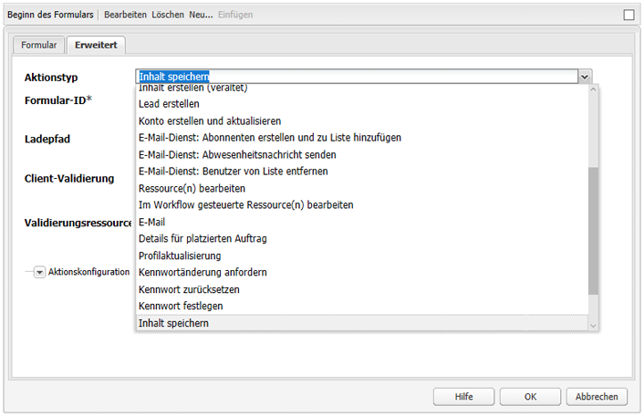
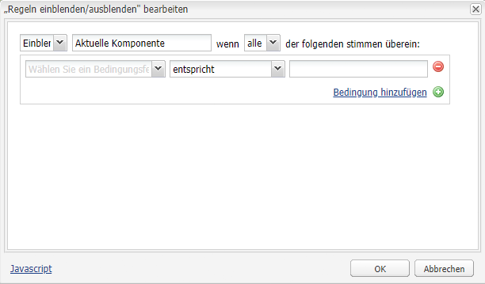
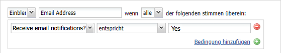
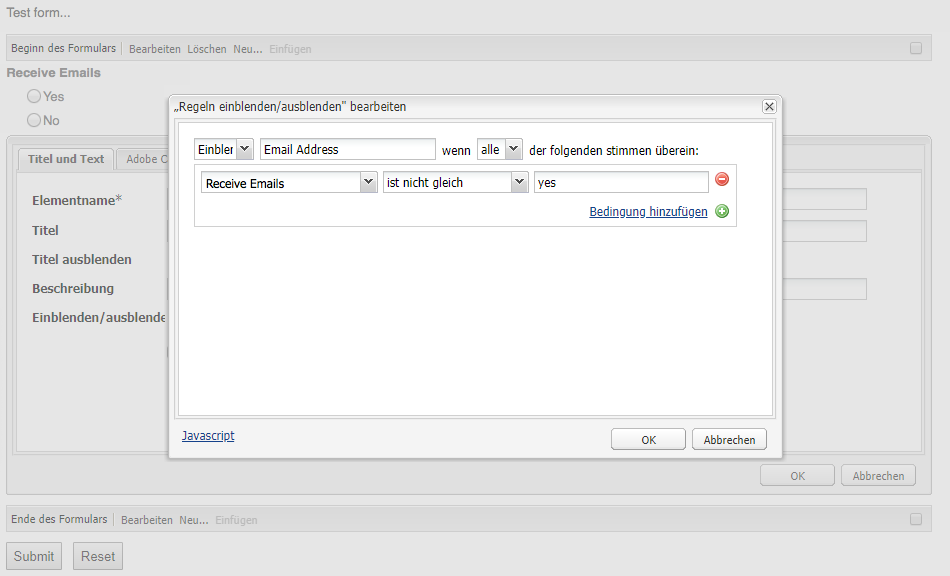
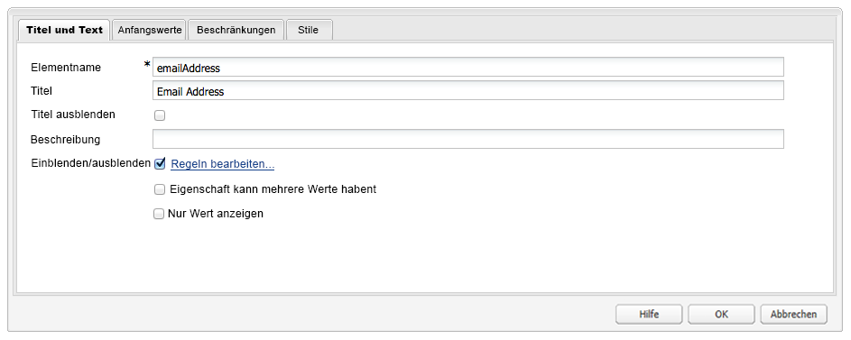

# Entwicklung von Formularen (klassische Benutzeroberfläche){#developing-forms-classic-ui}

Die grundlegende Struktur eines Formulars sieht wie folgt aus:

* Beginn des Formulars
* Formularelemente
* Ende des Formulars

All diese Ergebnisse werden mit einer Reihe von Standardwerten realisiert [Formularkomponenten](/help/sites-authoring/default-components.md#form), verfügbar in einer standardmäßigen AEM.

Neben der [Entwicklung neuer Komponenten](/help/sites-developing/developing-components-samples.md) für Ihre Formulare ist auch Folgendes möglich:

* [Ein Formular vorab mit Werten ausfüllen](#preloading-form-values)
* [(Bestimmte) Felder mit mehreren Werten vorab ausfüllen ](#preloading-form-fields-with-multiple-values)
* [Neue Aktionen entwickeln](#developing-your-own-form-actions)
* [Neue Einschränkungen entwickeln](#developing-your-own-form-constraints)
* [Bestimmte Formularfelder ein- oder ausblenden](#showing-and-hiding-form-components)

[Skripte verwenden](#developing-scripts-for-use-with-forms), um die Funktionalität bei Bedarf zu erweitern.

>[!NOTE]
>
>Dieses Dokument befasst sich hauptsächlich mit der Entwicklung von Formularen mit den [Foundation-Komponenten](/help/sites-authoring/default-components-foundation.md) in der klassischen Benutzeroberfläche. Adobe empfiehlt, bei der Formularentwicklung in der Touch-optimierten Benutzeroberfläche die neuen [Kernkomponenten](https://docs.adobe.com/content/help/de-DE/experience-manager-core-components/using/introduction.html) und [Ausblendebedingungen](/help/sites-developing/hide-conditions.md) zu nutzen.

## Vorausfüllen von Formularwerten {#preloading-form-values}

Die Formular-Start-Komponente stellt ein Feld für den **Ladepfad** bereit. Dies ist ein optionaler Pfad, der auf einen Knoten im Repository verweist.

Der Ladepfad ist der Pfad zu den Knoteneigenschaften, mit dem vordefinierte Werte in mehrere Felder im Formular geladen werden.

Dies ist ein optionales Feld, das den Pfad zu einem Knoten im Repository angibt. Wenn dieser Knoten Eigenschaften hat, die den Feldnamen entsprechen, werden die jeweiligen Felder im Formular vorab mit den Werten dieser Eigenschaften ausgefüllt. Wenn keine Übereinstimmung besteht, steht im Feld der Standardwert.

>[!NOTE]
>
>Eine [Formularaktion](#developing-your-own-form-actions) kann auch festlegen, von welcher Ressource die Anfangswerte geladen werden. Dies geschieht mithilfe von `FormsHelper#setFormLoadResource` inside `init.jsp`.
>
>Das Formular wird nur über den Pfad, den der Autor in der Formular-Start-Komponente festgelegt hat, ausgefüllt, wenn dies nicht festgelegt wurde.

### Vorabladen von Formularfeldern mit mehreren Werten {#preloading-form-fields-with-multiple-values}

Einige Formularfelder haben auch den **Element-Ladepfad**. Dies ist ein weiterer optionaler Pfad, der auf einen Knoten im Repository verweist.

Der **Element-Ladepfad** ist der Pfad zu Knoteneigenschaften, mit dem vordefinierte Werte in dieses Formularfeld geladen werden – z. B. eine [Dropdown-Liste](/help/sites-authoring/default-components-foundation.md#dropdown-list), eine [Gruppe von Kontrollkästchen](/help/sites-authoring/default-components-foundation.md#checkbox-group) oder eine [Gruppe von Optionsschaltern](/help/sites-authoring/default-components-foundation.md#radio-group).

#### Beispiel: Vorabladen einer Dropdown-Liste mit mehreren Werten {#example-preloading-a-dropdown-list-with-multiple-values}

Eine Dropdown-Liste kann mit Ihren Werten konfiguriert werden, die ausgewählt werden können.

Mit dem **Element-Ladepfad** kann auf eine Liste aus einem Ordner im Repository zugegriffen werden, die in das Feld geladen wird:

1. Erstellen Sie einen neuen Sling-Ordner ( `sling:Folder`), z. B. `/etc/designs/<myDesign>/formlistvalues`

1. Fügen Sie eine neue Eigenschaft hinzu (z. B. `myList`) vom Typ Zeichenfolge mit mehreren Werten ( `String[]`), um die Liste der Dropdown-Elemente zu enthalten. Sie können auch mithilfe eines Skripts Inhalte importieren, z. B. mit einem JSP-Skript oder cURL in einem Shell-Skript.

1. Verwenden Sie den vollständigen Pfad im **Element-Ladepfad** -Feld: Beispiel: `/etc/designs/geometrixx/formlistvalues/myList`

Beachten Sie Folgendes: Wenn die Werte in `String[]` sind wie folgt formatiert:

* `AL=Alabama`
* `AK=Alaska`
* usw.

generiert AEM die Liste wie folgt:

* `<option value="AL">Alabama</option>`
* `<option value="AK">Alaska</option>`

Diese Funktion kann beispielsweise in einer mehrsprachigen Umgebung nützlich sein.

### Entwicklung Ihrer eigenen Formularaktionen {#developing-your-own-form-actions}

Für ein Formular ist eine Aktion erforderlich. Die Aktion bestimmt den Vorgang, der ausgeführt wird, wenn das Formular mit Benutzerdaten eingereicht wird.

Mit einer Standardinstallation von AEM stehen verschiedene Aktionen zur Verfügung. Sie finden diese unter:

`/libs/foundation/components/form/actions`

und in der **Action Type**-Liste der **Formular**-Komponente:

Dieser Abschnitt erläutert, wie Sie Ihre eigene Formularaktion entwickeln und zu dieser Liste hinzufügen können.

Sie können Ihre eigene Aktion unter `/apps` wie folgt:

1. Erstellen Sie einen Knoten des Typs `sling:Folder`. Geben Sie einen Namen an, der der zu implementierenden Aktion entspricht.

   Beispiel:

   `/apps/myProject/components/customFormAction`

1. Definieren Sie in diesem Knoten die folgenden Eigenschaften und klicken Sie anschließend auf **Alle speichern**, um Ihre Änderungen zu speichern:

   * `sling:resourceType` - festgelegt als `foundation/components/form/action`

   * `componentGroup` - definieren als `.hidden`

   * Optional:

      * `jcr:title`: Geben Sie einen Titel Ihrer Wahl an, der in der Dropdown-Auswahlliste angezeigt wird. Wenn Sie dies nicht festlegen, wird der Name des Knotens angezeigt

      * `jcr:description` - geben Sie eine Beschreibung Ihrer Wahl ein.

1. Erstellen Sie im Ordner einen Dialogknoten:

   1. Fügen Sie Felder hinzu, damit der Autor das Formular-Dialogfeld bearbeiten kann, nachdem die Aktion ausgewählt wurde.

1. Im Ordner erstellen Sie entweder:

   1. Ein Postskript.
Der Name des Skripts lautet `post.POST.<extension>`, z. B. `post.POST.jsp`
Das Post-Skript wird aufgerufen, wenn ein Formular zur Verarbeitung des Formulars gesendet wird. Es enthält den Code, der die aus dem Formular eingehenden Daten verarbeitet 
`POST`.

   1. Fügen Sie ein Weiterleitungsskript hinzu, das aufgerufen wird, wenn das Formular eingereicht wird.
Der Name des Skripts lautet `forward.<extension`>, z. B. `forward.jsp`
Dieses Skript kann einen Pfad definieren. Die aktuelle Anfrage wird dann an den angegebenen Pfad weitergeleitet.
   Der erforderliche Aufruf lautet `FormsHelper#setForwardPath` (2 Varianten). Ein typischer Anwendungsfall besteht darin, eine Validierung oder Logik auszuführen, um den Zielpfad zu finden, und anschließend zu diesem Pfad weiterzuleiten. Dabei wird die Speicherung in JCR dem standardmäßigen Sling-POST-Servlet überlassen.

   Es kann auch ein weiteres Servlet verwendet werden, das die eigentliche Verarbeitung übernimmt. In diesem Fall stellen die Formularaktion und `forward.jsp` nur die Verbindung dar. Ein Beispiel dafür ist die E-Mail-Aktion unter `/libs/foundation/components/form/actions/mail`, der Details an `<currentpath>.mail.html`wo sich ein E-Mail-Servlet befindet.

   Das bedeutet:

   * Ein `post.POST.jsp` eignet sich für kleine Vorgänge, die vollständig von der Aktion selbst ausgeführt werden.
   * `forward.jsp` ist hingegen hilfreich, wenn nur Delegation erforderlich ist.

   Die Skripte werden in folgender Reihenfolge ausgeführt:

   * Beim Rendern des Formulars ( `GET`):

      1. `init.jsp`
      1. für alle Feldbeschränkungen: `clientvalidation.jsp`
      1. validationRT des Formulars: `clientvalidation.jsp`
      1. Das Formular wird über eine Laderessource geladen, wenn dies festgelegt ist
      1. `addfields.jsp` während des Renderns `<form></form>`
   * bei der Bearbeitung eines Formulars `POST`:

      1. `init.jsp`
      1. für alle Feldbeschränkungen: `servervalidation.jsp`
      1. validationRT des Formulars: `servervalidation.jsp`
      1. `forward.jsp`
      1. Wenn ein Weiterleitungspfad festgelegt wurde (`FormsHelper.setForwardPath`), leiten Sie die Anfrage weiter und rufen Sie anschließend `cleanup.jsp` auf

      1. Wenn kein Weiterleitungspfad festgelegt wurde, rufen Sie `post.POST.jsp` auf (der Vorgang ist hier beendet, `cleanup.jsp` wird nicht aufgerufen)

1. Auch hier können Sie optional Folgendes zum Ordner hinzufügen:

   1. Ein Skript für das Hinzufügen von Feldern.
Der Name des Skripts lautet `addfields.<extension>`, z. B. `addfields.jsp`
Ein 
`addfields` wird unmittelbar nach dem Schreiben der HTML für den Formularstart aufgerufen. Dadurch kann die Aktion benutzerdefinierte Eingabefelder oder sonstigen HTML-Code in das Formular einfügen.

   1. Ein Initialisierungsskript.
Der Name des Skripts lautet `init.<extension>`, z. B. `init.jsp`
Dieses Skript wird aufgerufen, wenn das Formular wiedergegeben wird. Es kann zur Initialisierung von handlungsspezifischen Elementen verwendet werden.

   1. Ein Bereinigungsskript.
Der Name des Skripts lautet `cleanup.<extension>`, z. B. `cleanup.jsp`
Dieses Skript kann für die Bereinigung verwendet werden.

1. Verwenden Sie die **Formular**-Komponente in einem parsys. Das Dropdown-Menü **Aktionstyp** enthält nun Ihre neue Aktion.

   >[!NOTE]
   >
   >So zeigen Sie weitere Standardaktionen, die im Produkt inbegriffen sind:
   >
   >
   >`/libs/foundation/components/form/actions`

### Entwicklung Ihrer eigenen Formulareinschränkungen {#developing-your-own-form-constraints}

Einschränkungen können auf zwei Ebenen angewendet werden:

* Für [einzelne Felder (siehe nachfolgendes Verfahren)](#constraints-for-individual-fields)
* Als [globale Validierung für das Formular](#form-global-constraints)

#### Einschränkungen für einzelne Felder {#constraints-for-individual-fields}

Sie können Ihre eigenen Einschränkungen für ein einzelnes Feld hinzufügen (unter `/apps`) wie folgt:

1. Erstellen Sie einen Knoten des Typs `sling:Folder`. Geben Sie einen Namen an, der der zu implementierenden Einschränkung entspricht.

   Beispiel:

   `/apps/myProject/components/customFormConstraint`

1. Definieren Sie in diesem Knoten die folgenden Eigenschaften und klicken Sie anschließend auf **Alle speichern**, um Ihre Änderungen zu speichern:

   * `sling:resourceType` - auf `foundation/components/form/constraint`

   * `constraintMessage`: eine individuelle Nachricht, die beim Einreichen des Formulars angezeigt wird, wenn das Feld gemäß der Einschränkung nicht gültig ist

   * Optional:

      * `jcr:title`: Geben Sie einen Titel Ihrer Wahl an, der in der Auswahlliste angezeigt wird. Wenn Sie dies nicht festlegen, wird der Name des Knotens angezeigt
      * `hint`: zusätzliche Informationen für den Benutzer zur Verwendung dieses Felds

1. In diesem Ordner benötigen Sie möglicherweise auch die folgenden Skripte:

   * Ein Client-Validierungsskript: Der Name des Skripts lautet `clientvalidation.<extension>`, z. B. `clientvalidation.jsp`
Dies wird aufgerufen, wenn das Formularfeld wiedergegeben wird. Es kann verwendet werden, um Client-JavaScript zur Validierung des Felds im Client zu erstellen.

   * Ein Servervalidierungsskript: Der Name des Skripts lautet `servervalidation.<extension>`, z. B. `servervalidation.jsp`
Dies wird beim Senden des Formulars aufgerufen. Es kann verwendet werden, um das Feld auf dem Server zu validieren, nachdem das Formular eingereicht wurde.

>[!NOTE]
>
>Sie finden einige Beispiele für Einschränkungen unter:
>
>`/libs/foundation/components/form/constraints`

#### Globale Formulareinschränkungen {#form-global-constraints}

Legen Sie die globale Validierung eines Formulars fest, indem Sie einen Ressourcentyp in der Start-Formularkomponente angeben ( `validationRT`). Beispiel:

`apps/myProject/components/form/validation`

Anschließend können Sie Folgendes definieren:

* a `clientvalidation.jsp` - wird nach den Client-Überprüfungsskripten des Felds eingefügt
* und `servervalidation.jsp` - wird auch nach den individuellen Feldservervalidierungen bei einer `POST`.

### Ein- und Ausblenden von Formularkomponenten {#showing-and-hiding-form-components}

Sie können das Formular so konfigurieren, dass Formularkomponenten abhängig vom Wert anderer Formularfelder ein- oder ausgeblendet werden.

Das Ändern der Sichtbarkeit eines Formularfelds ist nützlich, wenn das Feld nur unter besonderen Bedingungen erforderlich ist. Auf einem Feedback-Formular werden Kunden beispielsweise gefragt, ob ihnen Produktinformationen per E-Mail zugesendet werden sollen. Nach der Auswahl von „Ja“ wird ein Textfeld eingeblendet, damit der Kunde seine E-Mail-Adresse eingeben kann.

Legen Sie mit dem Dialogfeld **Einblenden-/Ausblenden-Regeln bearbeiten** die Bedingungen fest, unter denen eine Formularkomponente ein- oder ausgeblendet wird.

Legen Sie mit den Feldern, die im Dialogfeld oben sind, die folgenden Informationen fest:

* Ob Sie Bedingungen zum Ausblenden oder Einblenden der Komponente festlegen.
* Ob eine oder alle Bedingungen erfüllt sein müssen, um die Komponente ein- oder auszublenden.

Eine oder mehrere Bedingungen werden unter diesen Feldern eingeblendet. Eine Bedingung vergleicht den Wert einer anderen Formularkomponente (auf dem gleichen Formular) mit einem Wert. Wenn der tatsächliche Wert im Feld die Bedingung erfüllt, wird die Bedingung als wahr ausgewertet. Bedingungen enthalten die folgenden Informationen:

* Den Titel des Formularfeldes, das geprüft wird.
* Einen Operator.
* Einen Wert, mit dem der Feldwert verglichen wird.

Beispiel: eine Optionsfeldgruppen-Komponente mit dem Titel `Receive email notifications?`* * enthält `Yes` und `No` Optionsfelder. Eine Textfeldkomponente mit dem Titel `Email Address` verwendet die folgende Bedingung, damit sie sichtbar ist, wenn `Yes` ausgewählt ist:

In JavaScript verweisen Bedingungen mit dem Wert der Eigenschaft „Elementname“ auf Felder. Im vorherigen Beispiel lautet die Eigenschaft &quot;Elementname&quot;der Optionsfeldgruppen-Komponente `contact`. Der folgende Code entspricht dem JavaScript-Code für dieses Beispiel:

`((contact == "Yes"))`

**Ein- oder Ausblenden einer Formular-Komponente:**

1. Bearbeiten Sie die entsprechende Formular-Komponente.

1. Wählen Sie **Einblenden/Ausblenden**, um das Dialogfeld **Einblenden-/Ausblenden-Regeln bearbeiten** zu öffnen:

   * Wählen Sie in der ersten Dropdown-Liste entweder **Einblenden** oder **Ausblenden** aus, um anzugeben, ob die Bedingungen das Einblenden oder das Ausblenden der Komponente bestimmen.

   * Wählen Sie in der Dropdown-Liste am Ende der obersten Zeile Folgendes aus:

      * **Alle**: Wenn alle Bedingungen wahr sein müssen, um die Komponente ein- oder auszublenden.
      * **Beliebig**: Wenn nur eine oder mehrere Bedingungen wahr sein müssen, um die Komponente ein- oder auszublenden
   * Wählen Sie in der Bedingungszeile (eine wird als Standard gezeigt) eine Komponente und einen Operator aus und geben Sie einen Wert an.
   * Klicken Sie bei Bedarf auf **Bedingung hinzufügen**, um weitere Bedingungen hinzuzufügen.

   Beispiel:

   

1. Klicken Sie auf **OK**, um die Definition zu speichern.

1. Nachdem Sie Ihre Definition gespeichert haben, wird in den Eigenschaften der Formularkomponente der Link **Regeln bearbeiten** neben der Option **Einblenden/Ausblenden** angezeigt. Klicken Sie auf diesen Link, um das Dialogfeld **Einblenden-/Ausblenden-Regeln bearbeiten** zu öffnen, damit Sie Änderungen vornehmen können.

   Klicken Sie auf **OK**, um alle Änderungen zu speichern.

   

   >[!CAUTION]
   >
   >Sie können die Auswirkungen von Ein-/Ausblendedefinitionen überprüfen und testen:
   >
   >* im **Vorschaumodus** in der Autorenumgebung (Sie müssen die Seite neu laden, wenn Sie zum ersten Mal zur Vorschau wechseln)
   >
   >* in der Veröffentlichungsumgebung

#### Behandlung von nicht mehr gültigen Komponentenverweisen {#handling-broken-component-references}

Einblenden/Ausblenden-Bedingungen verweisen mit dem Wert der Eigenschaft „Elementname“ auf andere auf dem Formular befindliche Komponenten. Die Konfiguration &quot;Einblenden/Ausblenden&quot;ist ungültig, wenn eine der Bedingungen auf eine Komponente verweist, die gelöscht wird oder deren Eigenschaft &quot;Elementname&quot;geändert wurde. In diesen Fällen müssen Sie die Bedingungen manuell aktualisieren. Anderenfalls tritt beim Laden des Formulars ein Fehler auf.

Wenn die Konfiguration Anzeigen/Ausblenden ungültig ist, wird die Konfiguration nur als JavaScript-Code bereitgestellt. Bearbeiten Sie den Code, um die Probleme zu beheben. Der Code verwendet die Eigenschaft „Elementname“, mit der ursprünglich auf die Komponenten verwiesen wurde.

### Entwicklung von Skripten zur Verwendung mit Formularen {#developing-scripts-for-use-with-forms}

Weitere Informationen über die API-Elemente, die Sie zur Erstellung von Skripten verwenden können, finden Sie in den [javadocs zu Formularen](https://helpx.adobe.com/experience-manager/6-5/sites/developing/using/reference-materials/javadoc/com/day/cq/wcm/foundation/forms/package-summary.html).

Sie können dies z. B. verwenden, um einen Dienst aufzurufen, bevor das Formular übermittelt wird, und den Dienst abbrechen, wenn es fehlschlägt:

* Validierungs-Ressourcentyp definieren
* Aufnehmen eines Skripts zur Überprüfung:

   * Rufen Sie in der JSP den Webdienst auf und erstellen Sie ein Objekt `com.day.cq.wcm.foundation.forms.ValidationInfo` mit den Fehlermeldungen. Wenn Fehler auftreten, werden die Formulardaten nicht ausgegeben.
