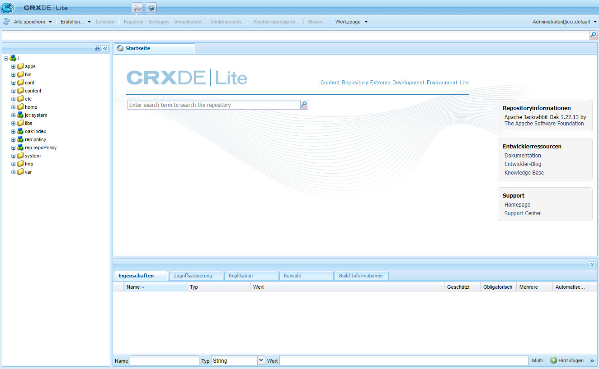

# Entwickeln mit CRXDE Lite{#developing-with-crxde-lite}

In diesem Abschnitt wird beschrieben, wie Sie Ihre Adobe Experience Manager(AEM)-Anwendung mit CRXDE Lite entwickeln.

Weitere Informationen zu den verschiedenen verfügbaren Entwicklungsumgebungen finden Sie in der Übersichtsdokumentation.

CRXDE Lite ist in AEM integriert und ermöglicht Ihnen die Durchführung von Standardentwicklungsaufgaben im Browser. Mit CRXDE Lite können Sie ein Projekt erstellen und Dateien (wie .jsp und .java), Ordner, Vorlagen, Komponenten, Dialogfelder, Knoten, Eigenschaften und Pakete erstellen und bearbeiten, während Sie protokollieren.
CRXDE Lite wird empfohlen, wenn Sie keinen direkten Zugriff auf den AEM-Server haben. Oder, wenn Sie eine Anwendung entwickeln, indem Sie die im Lieferumfang enthaltenen Komponenten und Java™-Bundle erweitern oder modifizieren, oder wenn Sie keinen dedizierten Debugger, Code-Vervollständigung und Syntaxhervorhebung benötigen.

>[!NOTE]
>
>Ab AEM 6.5.5.0 ist der anonyme Zugriff auf CRXDE Lite nicht mehr möglich.
>Benutzer werden zum Anmeldebildschirm weitergeleitet.

>[!NOTE]
>
>Adobe empfiehlt Ihnen, während der Projektentwicklung die [AEM Developer Tools for Eclipse](/help/sites-developing/aem-eclipse.md) und die [AEM HTL Brackets Extension](/help/sites-developing/aem-brackets.md) zu verwenden.

## Erste Schritte mit CRXDE Lite {#getting-started-with-crxde-lite}

Gehen Sie für die ersten Schritte mit CRXDE Lite wie folgt vor:

1. Installieren Sie AEM.
1. Geben Sie in Ihrem Browser `https://<host>:<port>/crx/de` ein. Standardmäßig ist dies `https://localhost:4502/crx/de`.
1. Geben Sie Ihren **Benutzernamen** und Ihr **Kennwort** ein. Standardmäßig ist es `admin` und `admin`.

1. Klicken Sie auf **OK**.

Die Benutzeroberfläche von CRXDE Lite sieht in Ihrem Browser wie folgt aus:

Jetzt können Sie CRXDE Lite verwenden, um Ihr Programm zu entwickeln.

## Überblick über die Benutzeroberfläche {#overview-of-the-user-interface}

CRXDE Lite bietet folgende Funktionen:

<table>
 <tbody>
  <tr>
   <td>Obere Wechselleiste</td>
   <td>Schnelles Wechseln zwischen CRXDE Lite, Package Manager und Package Share.</td>
  </tr>
  <tr>
   <td>Knotenpfad-Widget</td>
   <td>
Zeigt den Pfad zum ausgewählten Knoten.
 
Sie können es auch verwenden, um zu einem Knoten zu springen, indem Sie den Pfad manuell eingeben oder ihn von woanders einfügen und die Eingabetaste drücken.
 
Es bietet auch Unterstützung für die Suche nach Knoten mit einem bestimmten Knotennamen. Geben Sie den Namen des Knotens ein, den Sie suchen möchten, und warten Sie (oder klicken Sie auf das Suchsymbol auf der rechten Seite). Sie können z. B. versuchen, die Zeichenfolge <em>oak</em> in das Widget einzugeben, um zu sehen, wie es funktioniert. Wenn ein oder mehrere bestimmte Knoten in das Explorer-Fenster geladen werden, wird die Liste angezeigt, in der Sie einen Pfad auswählen und die Eingabetaste drücken können, um dorthin zu navigieren. Dies funktioniert nur für die Knoten, die in der CRXDE-Client-Anwendung im Browser geladen sind. Wenn Sie das gesamte Repository durchsuchen möchten, verwenden Sie „Tools“ &gt; „Abfrage“.
 </td>
  </tr>
  <tr>
   <td>Explorer-Bereich</td>
   <td>
Zeigt eine Baumstruktur aller Knoten im Repository an.
 
Klicken Sie auf einen Knoten, um seine Eigenschaften auf der Registerkarte <strong>Eigenschaften</strong> anzuzeigen. Nachdem Sie auf einen Knoten geklickt haben, können Sie eine Aktion in der Symbolleiste auswählen. Klicken Sie erneut auf den Knoten, um ihn umzubenennen.
 
Baumstrukturnavigationsfilter (Fernglassymbol): Ermöglicht es Ihnen, im Repository die Knoten zu filtern, deren Name den Eingabetext enthält. Gilt nur für Knoten, die lokal geladen wurden.  
 </td>
  </tr>
  <tr>
   <td>Bearbeitungsbereich</td>
   <td>
Registerkarte <strong>Home</strong>: Ermöglicht die Suche nach Inhalten und/oder Dokumentation sowie den Zugang zu Entwicklerressourcen (Dokumentation, Entwickler-Blog, Knowledgebase) und Support (Adobe-Homepage und Support Center).  
 
Doppelklicken Sie auf eine Datei im <strong>Explorer</strong>-Bereich, um den zugehörigen Inhalt anzuzeigen. Beispielsweise eine .jsp- oder eine .java-Datei. Anschließend können Sie diesen ändern und die Änderungen speichern.
 
Sobald eine Datei im <strong>Bearbeitungsbereich</strong> bearbeitet wurde, sind die folgenden Tools in der Symbolleiste verfügbar:  
 - <strong>In Struktur anzeigen</strong>: Zeigt die Datei in der Repository-Baumstruktur an.  – <strong>Suchen/Ersetzen</strong>: Führt einen Suchen- oder Ersetzen-Vorgang durch.    Durch einen Doppelklick auf die Statuszeile des <strong>Bearbeitungsfensters</strong> öffnen Sie das Dialogfeld <strong>Zu Zeile wechseln</strong>, in dem Sie eine bestimmte Zeilennummer eingeben können, um dorthin zu gelangen.  </td>
  </tr>
  <tr>
   <td>Registerkarte „Eigenschaften“  </td>
   <td>Zeigt die Eigenschaften des Knotens an, den Sie ausgewählt haben. Sie können neue Eigenschaften hinzufügen oder die vorhandenen löschen.  </td>
  </tr>
  <tr>
   <td>Registerkarte „Zugangssteuerung“</td>
   <td>
Zeigt Berechtigungen basierend auf dem Pfad, Repository-Level oder Prinzipal an.
 
Die Berechtigungen werden wie folgt aufgeschlüsselt:
 
– <strong>Gültige Richtlinie für die Zugriffssteuerung</strong>: Die Richtlinien, die auf die aktuelle Auswahl angewendet werden können.
 
– <strong>Richtlinien zur lokalen Zugriffssteuerung</strong>: Die Richtlinien, die lokal auf die Auswahl angewendet werden.
 
– <strong>Gültige Richtlinien zur Zugriffssteuerung</strong>: Die Richtlinien, die auf die Auswahl angewendet werden. Sie können lokal festgelegt oder von übergeordneten Knoten übernommen werden.
 
Hinweis. Um die Zugriffssteuerungsinformationen überhaupt zu sehen, muss die Person, die sich bei CRXDE Lite angemeldet hat, über Berechtigungen zum Lesen von ACL-Einträgen verfügen. Eine anonyme Person kann diese Informationen nicht standardmäßig sehen – melden Sie sich z. B. als Admin an, um die Informationen zu sehen.
 </td>
  </tr>
  <tr>
   <td>Registerkarte „Replikation“</td>
   <td>
Zeigt den Replikationsstatus des Knotens an. Sie können den Knoten replizieren oder replizieren und löschen.
 </td>
  </tr>
  <tr>
   <td>Registerkarte „Konsole“  </td>
   <td>
<strong>Server-Protokolle</strong>:
 
Zeigt Protokollmeldungen an. Sie können die Protokollebene konfigurieren, die Konsole löschen, an der ausgewählten Bildlaufposition anheften und die Anzeige von Meldungen aktivieren/deaktivieren.  
 
<strong>Versionskontrolle</strong>:
 
Zeigt Versionskontrollmeldungen an.  
 </td>
  </tr>
  <tr>
   <td>Registerkarte „Build-Informationen“   </td>
   <td>Zeigt Informationen an, wenn ein Bundle erstellt wird.  </td>
  </tr>
  <tr>
   <td>Aktualisieren  </td>
   <td>Aktualisiert die Auswahl. Änderungen von anderen Benutzenden werden in Ihrer Ansicht des Repositorys aktualisiert. Änderungen, die Sie vorgenommen haben, sind nicht betroffen.  </td>
  </tr>
  <tr>
   <td>Alle speichern</td>
   <td>
<strong>Alle speichern</strong>:  
 
Speichert alle von Ihnen vorgenommenen Änderungen. Solange Sie nicht auf „Speichern“ klicken, sind die Änderungen vorübergehend und gehen verloren, wenn Sie die Konsole verlassen.
 
<strong>Zurück zur letzten Version</strong>:
 
Verwirft alle Änderungen, die Sie seit dem letzten Speichervorgang für den ausgewählten Knoten vorgenommen haben, und lädt dann den Status des Repositorys für den ausgewählten Knoten erneut.
 
<strong>Alle zurücksetzen</strong>:
 
Verwirft alle Änderungen, die Sie seit dem letzten Speichervorgang im gesamten Repository vorgenommen haben, und lädt dann den Status des Repositorys erneut.
 </td>
  </tr>
  <tr>
   <td>Erstellen ...  </td>
   <td>
Dropdown-Menü, um Folgendes unter dem ausgewählten Knoten zu erstellen:  
 
- <strong>Knoten</strong>: Knoten mit einem beliebigen Knotentyp  
 
- <strong>Datei</strong>: nt:file-Knoten und dessen nt:ressource-Unterknoten
 
- <strong>Ordner</strong>: nt:folder-Knoten
 
- <strong>Vorlage</strong>: AEM-Vorlage
 
- <strong>Komponente</strong>: AEM-Komponente
 
- <strong>Dialogfeld</strong>: AEM-Dialogfeld
 </td>
  </tr>
  <tr>
   <td>Löschen  </td>
   <td>Löscht den ausgewählten Knoten.  </td>
  </tr>
  <tr>
   <td>Kopieren</td>
   <td>Kopiert den ausgewählten Knoten.  </td>
  </tr>
  <tr>
   <td>Einfügen  </td>
   <td>Fügt den kopierten Knoten unter dem ausgewählten Knoten ein.  </td>
  </tr>
  <tr>
   <td>Verschieben ...  </td>
   <td>Verschiebt den ausgewählten Knoten zu dem über das Dialogfeld festgelegten Knoten.</td>
  </tr>
  <tr>
   <td>Umbenennen ...  </td>
   <td>Benennt den ausgewählten Knoten um.  </td>
  </tr>
  <tr>
   <td>Mixins ...  </td>
   <td>Ermöglicht das Hinzufügen von Mixin-Typen zum Knotentyp. Die Mixin-Typen werden meist verwendet, um erweiterte Funktionen wie Versionierung, Zugriffssteuerung, Referenzierung und Knotensperre hinzuzufügen.</td>
  </tr>
  <tr>
   <td>Tools  </td>
   <td>
Dropdown-Menü mit den folgenden Tools:
 
- <strong>Server-Konfiguration</strong>: Zum Zugreifen auf die Felix-Konsole
 
- <strong>Abfrage</strong>: Zum Abfragen des Repositorys
 
- <strong>Berechtigungen</strong>: Zum Öffnen der Rechteverwaltung, in der Sie Berechtigungen anzeigen und hinzufügen können
 
– <strong>Zugriffssteuerung testen…</strong>: Ein Ort, an dem Sie die Berechtigung für einen bestimmten Pfad und/oder Prinzipal testen können.
 
- <strong>Knotentyp exportieren</strong>: Zum Exportieren von Knotentypen im System als CND-Notation
 
- <strong>Knotentyp importieren</strong>: Zum Importieren von Knotentypen unter Verwendung der CND-Notation
 
- <strong>SiteCatalyst Debugger installieren</strong>: Anweisungen zum Installieren von Analytics Debugger
 </td>
  </tr>
  <tr>
   <td>Anmelde-Widget  </td>
   <td>
Zeigt die angemeldeten Benutzenden und den Arbeitsbereich an, bei dem sie jeweils angemeldet sind, z. B. „admin@crx.default“.
 
Klicken Sie darauf, um sich als eine bestimmte Person anzumelden bzw. erneut anzumelden. Wenn Sie keinen Arbeitsbereich angeben, um sich anzumelden, werden Sie beim Standardarbeitsbereich, crx.default, angemeldet.
 
Wenn Sie das Repository anonym durchsuchen möchten, verwenden Sie <strong>Anonym</strong> als Anmeldenamen und ein beliebiges Kennwort (z. B. ein Leerzeichen oder einen Punkt).  
 
Wenn Ihre Autorisierung nicht mehr gültig ist (z. B. weil sie abgelaufen ist), zeigt das Anmelde-Widget „<strong>Nicht autorisiert – Anmelden…</strong>“ an. Klicken Sie darauf, um sich erneut anzumelden.
 </td>
  </tr>
 </tbody>
</table>

## Erstellen eines Ordners {#creating-a-folder}

So erstellen Sie einen Ordner mit CRXDE Lite:

1. Öffnen Sie CRXDE Lite in Ihrem Browser.
1. Klicken Sie im Navigationsfenster mit der rechten Maustaste auf den Ordner, unter dem Sie den neuen Ordner erstellen möchten, und wählen Sie **Erstellen…** und dann **Ordner erstellen…** aus.

1. Geben Sie den **Namen** des Ordners ein und klicken Sie auf **OK**.

1. Klicken Sie auf **Alle speichern**, um die Änderungen auf dem Server zu speichern.

## Erstellen einer Vorlage {#creating-a-template}

So erstellen Sie eine Vorlage mit CRXDE Lite:

1. Öffnen Sie CRXDE Lite in Ihrem Browser.
1. Klicken Sie im Navigationsfenster mit der rechten Maustaste auf den Ordner, in dem Sie die Vorlage erstellen möchten, wählen Sie **Erstellen...** und dann **Vorlage erstellen...**.

1. Geben Sie eine **Bezeichnung**, einen **Titel**, eine **Beschreibung**, einen **Ressourcentyp** und die **Rangfolge** der Vorlage an. Klicken Sie auf **Weiter**.

1. Dieser Schritt ist optional: Legen Sie die **zugelassenen Pfade** fest. Klicken Sie auf **Weiter**

1. Dieser Schritt ist optional: Legen Sie die **zugelassenen übergeordneten Elemente** fest. Klicken Sie auf **Weiter**.

1. Dieser Schritt ist optional: Legen Sie die **zugelassenen untergeordneten Elemente** fest. Klicken Sie auf **OK**.

1. Klicken Sie auf **Alle speichern**, um die Änderungen auf dem Server zu speichern.

Folgendes wird erstellt:

* Ein Knoten vom Typ `cq:Template` mit Vorlageneigenschaften

* Ein untergeordneter Knoten vom Typ `cq:PageContent` mit Seiteninhaltseigenschaften

Sie können Ihrer Vorlage Eigenschaften hinzufügen: Weitere Informationen finden Sie im Abschnitt [Erstellen einer Eigenschaft](#creating-a-property).

## Erstellen einer Komponente {#creating-a-component}

Die Funktion, die hier beschrieben wird, ist nur verfügbar, wenn CQ5 installiert ist, d. h. wenn der Knoten `cq:Component` im Repository verfügbar ist.

So erstellen Sie eine Komponente mit CRXDE Lite:

1. Öffnen Sie CRXDE Lite in Ihrem Browser.
1. Klicken Sie im Navigationsfenster mit der rechten Maustaste auf den Ordner, in dem die Komponente erstellt werden soll, wählen Sie **Erstellen...** und dann **Komponente erstellen...**.

1. Geben Sie die **Beschriftung**, den **Titel**, die **Beschreibung**, den **Superressourcentyp** und die **Gruppe** der Komponente ein. Klicken Sie auf **Weiter**.

1. Dieser Schritt ist optional: Legen Sie die Komponenteneigenschaften fest: **Ist Container**, **Keine Auszeichnung**, **Zellenname** und **Dialogpfad**. Klicken Sie auf **Weiter**.

1. Dieser Schritt ist optional: Legen Sie die Komponenteneigenschaft **Zugelassene übergeordnete Elemente** fest. Klicken Sie auf **Weiter**.

1. Dieser Schritt ist optional: Legen Sie die Komponenteneigenschaft **Zugelassene untergeordnete Elemente** fest. Klicken Sie auf **OK**.

1. Klicken Sie auf **Alle speichern**, um die Änderungen auf dem Server zu speichern.

Folgendes wird erstellt:

* Ein Knoten vom Typ `cq:Component`
* Komponenteneigenschaften
* Ein Komponenten-JSP-Skript

## Erstellen eines Dialogfelds {#creating-a-dialog}

So erstellen Sie ein Dialogfeld mit CRXDE Lite:

1. Öffnen Sie CRXDE Lite in Ihrem Browser.
1. Klicken Sie im Navigationsfenster mit der rechten Maustaste auf die Komponente, in der Sie das Dialogfeld erstellen möchten, wählen Sie **Erstellen...** und dann **Dialogfeld erstellen...**.

1. Geben Sie das **Label** und den **Titel** ein. Klicken Sie auf **OK**.

1. Klicken Sie auf **Alle speichern**, um die Änderungen auf dem Server zu speichern.

Es wird ein Dialogfeld mit der folgenden Struktur erstellt:

`dialog[cq:Dialog]/items[cq:Widget]/items[cq:WidgetCollection]/tab1[cq:Panel]`

Sie können nun das Dialogfeld an Ihre Bedürfnisse anpassen, indem Sie die Eigenschaften ändern oder Knoten erstellen.

Sie können den Dialogfeldeditor auch verwenden, um ein Dialogfeld zu bearbeiten. Mit einem Doppelklick auf den Dialogfeldknoten in CRXDE Lite wird der Editor geöffnet. Weitere Informationen über den Dialog-Editor finden Sie [hier](/help/sites-developing/dialog-editor.md).

## Erstellen eines Knotens {#creating-a-node}

So erstellen Sie einen Knoten mit CRXDE Lite:

1. Öffnen Sie CRXDE Lite in Ihrem Browser.
1. Klicken Sie im Navigationsfenster mit der rechten Maustaste auf den Knoten, in dem Sie den Knoten erstellen möchten, und wählen Sie **Erstellen…** und dann **Knoten erstellen…**.
1. Geben Sie den **Namen** und den **Typ** ein. Klicken Sie auf **OK**.
1. Klicken Sie auf **Alle speichern**, um die Änderungen auf dem Server zu speichern.

Jetzt können Sie den Knoten an Ihre Anforderungen anpassen, indem Sie die Eigenschaften ändern oder neue Knoten erstellen.

>[!NOTE]
>
>Die meisten Bearbeitungsvorgänge, einschließlich der Knotenerstellung, behalten alle Änderungen im Speicher und speichern sie erst beim Speichern (über die Schaltfläche „Alle speichern“) im Repository.  Einige Vorgänge wie das Verschieben werden jedoch automatisch beibehalten.
>
>Die Validierung, ob der neu erstellte Knoten vom Knotentyp des übergeordneten Knotens zugelassen ist, wird auch zuerst vom JCR-Repository ausgeführt, wenn Änderungen gespeichert werden sollen.  Wenn Sie beim Speichern eines Knotens eine Fehlermeldung erhalten, überprüfen Sie, ob die Inhaltsstruktur gültig ist (z. B. können Sie keinen `nt:unstructured`-Knoten als untergeordneten Knoten eines `nt:folder`-Knotens erstellen).

## Erstellen einer Eigenschaft {#creating-a-property}

So erstellen Sie eine Eigenschaft mit CRXDE Lite:

1. Öffnen Sie CRXDE Lite in Ihrem Browser.
1. Wählen Sie im Navigationsbereich den Knoten aus, an dem Sie die neue Eigenschaft hinzufügen möchten.
1. Geben Sie auf der Registerkarte **Eigenschaften** im unteren Fensterbereich den **Namen**, den **Typ** und den **Wert** ein. Klicken Sie auf **Hinzufügen**.

1. Klicken Sie auf **Alle speichern**, um die Änderungen auf dem Server zu speichern.

## Erstellen eines Skripts {#creating-a-script}

Erstellen eines Skripts:

1. Öffnen Sie CRXDE Lite in Ihrem Browser.
1. Klicken Sie im Navigationsbereich mit der rechten Maustaste auf die Komponente, in der Sie das Skript erstellen möchten, wählen Sie **Erstellen ...** und dann **Datei erstellen ...**.

1. Geben Sie den **Dateinamen** mit der Erweiterung ein. Klicken Sie auf **OK**.

1. Die neue Datei wird als Registerkarte im Bearbeitungsbereich geöffnet.
1. Bearbeiten Sie die Datei.
1. Klicken Sie auf **Alle speichern**, um die Änderungen zu speichern.

## Exportieren und Importieren von Knotentypen {#exporting-and-importing-node-types}

Mit CRXDE Lite können Sie Knotentypdefinitionen in der [CND-Notation (Compact Namespace and Node Type Definition)](https://jackrabbit.apache.org/jcr/node-type-notation.html) importieren und/oder exportieren.

So exportieren Sie eine Knotentypdefinition:

1. Öffnen Sie CRXDE Lite in Ihrem Browser.
1. Wählen Sie den gewünschten Knoten aus.
1. Wählen Sie **Tools** und dann **Knotentyp exportieren** aus.

1. Die Definition wird in CND-Notation in Ihrem Browser angezeigt. Speichern Sie die Informationen (falls erforderlich).

So importieren Sie eine Knotentypdefinition:

1. Öffnen Sie CRXDE Lite in Ihrem Browser.
1. Wählen Sie **Tools** und dann **Knotentyp importieren...**.

1. Geben Sie die CND-Notation für die Definition in das Textfeld ein.
1. Aktivieren Sie **Update zulassen**, wenn Sie eine vorhandene Definition aktualisieren.
1. Wählen Sie **Importieren**.

## Protokollierung {#logging}

Mit CRXDE Lite können Sie die Datei `error.log` anzeigen, die sich im Dateisystem unter `<crx-install-dir>/crx-quickstart/server/logs` befindet, und sie mit der entsprechenden Protokollebene filtern. Gehen Sie wie folgt vor:

1. Öffnen Sie CRXDE Lite in Ihrem Browser.
1. Wählen Sie auf der Registerkarte **Konsole** am unteren Rand des Fensters im Dropdown-Menü auf der rechten Seite **Serverprotokolle**.

1. Klicken Sie auf das **Stopp-Symbol**, um die Nachrichten anzuzeigen.

Sie haben folgende Möglichkeiten:

* Passen Sie die Protokollparameter in der Felix-Konsole an, indem Sie auf das Symbol **Protokollierungskonfigurationen** klicken.
* Löschen Sie die Meldungen, indem Sie auf das **Pinselsymbol** klicken.
* Heften Sie die Nachricht an der aktuellen Auswahl an, indem Sie auf das **Nadel-Symbol** klicken.
* Aktivieren oder deaktivieren Sie die Anzeige von Meldungen, indem Sie auf das **Stopp**-Symbol klicken.

## Zugriffssteuerung {#access-control}

>[!NOTE]
>
>Weitere Informationen finden Sie unter [Verwalten von Benutzenden, Gruppen und Zugriffsrechten](/help/sites-administering/user-group-ac-admin.md).
