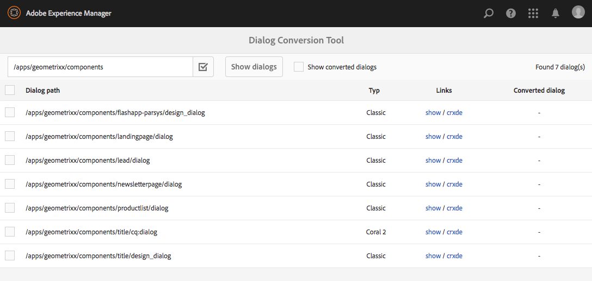

# Dialogfeldkonvertierungs-Tool{#dialog-conversion-tool}

Mit dem Dialogfeldkonvertierungs-Tool können Sie vorhandene Komponenten erweitern, für die nur ein Dialogfeld für die klassische Benutzeroberfläche auf Grundlage von ExtJS oder der Granite-Benutzeroberfläche und Coral 2 definiert ist. Das Tool verwendet das ursprüngliche Dialogfeld, um ein Dialogfeldduplikat zu erstellen, das für die Standardbenutzeroberfläche auf Grundlage der Granite-Benutzeroberfläche und Coral 3-basierten Benutzeroberfläche vorgesehen ist.

Ziel dieses Tools ist die weitestgehende Automatisierung der Aktualisierung, um die Effizienz zu steigern und Fehler zu vermeiden. Da das Tool jedoch nicht jedes Szenario abdecken kann, lässt sich der Prozess nicht vollständig automatisieren und die Benutzer müssen die konvertierten Dialogfelder überprüfen und eventuell weitere Anpassungen vornehmen. Das Tool soll Ihnen helfen, mit dem Konvertierungsprozess zu beginnen. Es zielt jedoch nicht darauf ab, die Konvertierung umfassend zu steuern.

Das Tool erstellt das neue Dialogfeld mithilfe der Standardbenutzeroberfläche, der Granite-Benutzeroberfläche und der Coral 3-basierten Benutzeroberfläche, überspringt jedoch alles, was es nicht konvertieren kann. Wenn keine Regel mit der spezifischen Komponente übereinstimmt, kann daher das resultierende Dialogfeld möglicherweise Knoten aus dem ursprünglichen Dialogfeld enthalten. Außerdem kann eine konvertierte Komponente einige nicht konvertierte Eigenschaften aufweisen, da keine geeignete Regel für deren Konvertierung vorlag.

>[!CAUTION]
>
>Das Tool kann nicht jedes Szenario abdecken, da die zugehörigen Konvertierungsregeln nicht erschöpfend sind und nach bestem Wissen und den bestehenden Möglichkeiten angewendet werden. Es konvertiert die am häufigsten verwendeten Elemente und Eigenschaften. Die Konvertierung ist jedoch unvollständig, wenn Anpassungen oder hochspezialisierte Dialogfelder verarbeitet werden. **Konvertierte Dialogfelder müssen ggf. zusätzlich angepasst werden. Darüber hinaus müssen alle Konvertierungen überprüft werden.**

>[!NOTE]
>
>Da die klassische Benutzeroberfläche nicht mehr weiterentwickelt wird, empfiehlt Adobe die Aktualisierung auf die Granite-Standardbenutzeroberfläche, um von den neuesten Technologien zu profitieren.
>
>Obwohl die Umstellung auf die neueste Plattform im Allgemeinen ratsam ist, ist die Migration von Coral 2 auf Coral 3 nicht kritisch. Allerdings sollten sämtliche neuen Projekte auf Grundlage von Coral 3 gestartet werden.

## Herunterladen und Installieren des Dialogfeldkonvertierungs-Tools {#download-and-install-the-dialog-conversion-tool}

Das Dialogfeldkonvertierungs-Tool steht als Open-Source-Lösung über GitHub zur Verfügung.

CODE AUF GITHUB

Den Code dieser Seite finden Sie auf GitHub

* [Öffnen Sie das AEM-Dialog-Konvertierungsprojekt auf GitHub](https://github.com/Adobe-Marketing-Cloud/aem-dialog-conversion)
* Laden Sie das Projekt als [ZIP-Datei](https://github.com/Adobe-Marketing-Cloud/aem-dialog-conversion/archive/master.zip) herunter

>[!NOTE]
>
>Das Dialogfeldkonvertierungs-Tool ist nicht standardmäßig in AEM enthalten. Sie müssen es herunterladen und installieren, um es verwenden zu können.

Führen Sie folgende Schritte aus, um das Tool zu installieren.

1. Laden Sie das Paket aus dem Projekt [Dialog Conversion Tool (Dialogfeldkonvertierungs-Tool)](https://github.com/Adobe-Marketing-Cloud/aem-dialog-conversion/releases) auf GitHub herunter.
1. Installieren Sie das Paket auf Ihrer Instanz. Weitere Informationen zur Paketverwaltung finden Sie unter [Arbeiten mit Paketen](/help/sites-administering/package-manager.md).

## Konvertieren von Dialogfeldern {#converting-a-dialog}

Das Tool konvertiert Dialoge, indem es eine entsprechende Granite-Benutzeroberfläche / Coral 3 Dialog an der gleichen Stelle wie das ursprüngliche Dialogfeld in der Inhaltsstruktur erstellt. In the case of Granite UI / Coral 2 dialogs, these are copied to a backup location (a `.coral2` suffix is appended to the dialog node name) so as not to be overridden. Das Tool kann Designdialogfelder und Bearbeitungsdialogfelder konvertieren.

Führen Sie zum Konvertieren von Dialogfeldern die folgenden Schritte aus:

1. Open the **Dialog Conversion** console, accessible from **Global Navigation** -> **Tools** -> **Operations**:

   `https://<hostname>:<port>/libs/cq/dialogconversion/content/console.html`

   

1. Enter the required path such as `/apps/geometrixx/components`. You can also enter a direct path to a single dialog such as `/apps/geometrixx/components/lead`.

   

1. Wählen Sie **Dialogfelder anzeigen** aus, um alle Dialogfelder unter diesem Speicherort anzuzeigen.

   

   Die Tabelle listet alle vorhandenen Dialoge unter dem eingegebenen Pfad auf. Jeder Dialog hat seinen Typ aufgelistet. Dazu zählen die folgenden Typen:

   * **** Klassisch: Knoten des Typs, `cq:Dialog` die über einen Knotennamen `dialog` oder `design_dialog`
   * **** Koralle 2: Nodes mit Namen `cq:dialog` oder `cq:design_dialog` mit Granite UI/Coral 2-Ressourcentyp auf ihrem untergeordneten Content-Knoten
   Jede Zeile enthält einen Link zum Anzeigen des Dialogfelds und einen Link zu CRXDE Lite zum Anzeigen des Knotenbaums.

   >[!NOTE]
   >
   >Komponenten, die überhaupt kein Dialogfeld für die klassische Benutzeroberfläche oder Coral 2 haben (d. h. mit der Granite-Benutzeroberfläche/Coral 3 entworfen wurden), werden nicht aufgeführt.

1. Select one or more dialogs for conversion and click or tap **Convert X dialog(s)** to start the conversion process.

   

1. Die ausgewählten Dialogfelder werden mit den Ergebnissen ihrer Konvertierungen aufgeführt. Wenn die Konvertierung erfolgreich war, enthält die Zeile Links, über die die konvertierten Dialogfelder angezeigt oder in CRXDE Lite geöffnet werden können.

   Klicken oder tippen Sie auf **Zurück**, um zum Dialogfeldkonvertierungs-Tool zurückzukehren.

   

1. Dort werden die konvertierten Dialogfelder anschließend nicht mehr in der Liste aufgeführt. Beachten Sie jedoch, dass die Gesamtanzahl der gefundenen Dialogfelder weiterhin aufgeführt wird, einschließlich der bereits konvertierten Dialogfelder, d. h. die Anzahl der Zeilen in der Tabelle stimmt nicht notwendigerweise mit der Anzahl der gefundenen Dialogfelder überein.

   

1. Aktivieren Sie das Kontrollkästchen **Konvertierte Dialogfelder anzeigen**, um die Dialogfelder anzuzeigen, die sich unter dem angegebenen Pfad befinden und bereits konvertiert wurden.

   

   Wenn das Dialogfeld bereits konvertiert wurde, werden auch Links zum konvertierten Dialogfeld bereitgestellt. Ein Dialogfeld gilt als konvertiert, wenn bereits ein gleichrangiges Dialogfeld für die Granite-Benutzeroberfläche/Coral 3 verfügbar ist.

## Neuschreibungsregeln für Dialogfelder {#dialog-rewrite-rules}

The dialog conversion tool is based on the concept of **graph rewriting**, consisting of transforming a subject graph by applying rewrite rules. Mit einer Neuschreibungsregel wird ein Muster mit einem Ersatzgraphen abgeglichen. Die Regel gleicht die Vorkommen eines bestimmten Teilgraphen im Kategoriegraphen ab und ersetzt sie anschließend. See also [https://en.wikipedia.org/wiki/Graph_rewriting](https://en.wikipedia.org/wiki/Graph_rewriting) for details on graph rewriting.

Das Dialogfeldkonvertierungs-Tool verwendet diesen Ansatz zum Neuschreiben eines vorhandenen Dialogfeldbaums, der für die klassische Benutzeroberfläche oder die Granite-Benutzeroberfläche/Coral 2 entworfen wurde, als Entsprechung für die Granite-Benutzeroberfläche/Coral 3. Dies hat den Vorteil, dass die Konvertierung äußerst flexibel ist und auch komplexe Komponenten berücksichtigen kann, da der Abgleich nicht nur auf einzelne Knoten oder Eigenschaften, sondern auch für tatsächliche Unterbaumstrukturen erfolgt.

### Algorithmus {#algorithm}

Der Neuschreibungsalgorithmus zieht als Parameter den umzuschreibenden Baum und eine Reihe von Neuschreibungsregeln heran. Er durchläuft den Baum vorab und prüft für jeden Knoten, ob eine Regel für die Unterbaumstruktur gilt, die sich an dem Stammknoten befindet. Die erste Regel, die übereinstimmt, wird auf diese Unterbaumstruktur angewendet, um sie neu zu schreiben. Der Durchlauf erfolgt dann vom Stamm ausgehend erneut. Der Algorithmus stoppt, sobald der gesamte Baum durchlaufen wurde und keine Regel mit einer Unterbaumstruktur übereinstimmt. Als Optimierungsmaßnahme verfolgt der Algorithmus einen Satz von Knoten, die endgültig sind und daher nicht erneut auf Übereinstimmungen in nachfolgenden Traversalen überprüft werden müssen. Welche Knoten des neugeschriebenen Baums endgültig sind und welche durch zukünftige Durchläufe des Algorithmus überprüft werden sollen, wird durch die Neuschreibungsregeln definiert.

The entry point for the conversion is the `DialogConversionServlet`, which is registered on POST requests to `/libs/cq/dialogconversion/content/convert.json`. Es akzeptiert einen Pfadanforderungsparameter, bei dem es sich um ein Array mit den Pfaden zu den zu konvertierenden Dialogen handelt. Für jedes Dialogfeld schreibt das Servlet dann den entsprechenden Dialogfeldbaum neu, indem es alle definierten Neuschreibungsregel für Dialogfelder anwendet.

### Neuschreibungsregeltypen {#rewrite-rule-types}

Die Neuschreibungsregeln können auf zwei verschiedene Arten definiert werden:

* JCR-Knotenstrukturen – [knotenbasierte Neuschreibungsregeln](/help/sites-developing/dialog-conversion.md#node-based-rewrite-rules)

* eine bestimmte Schnittstelle implementierende Java-Klassen – [Java-basierte Neuschreibungsregeln](/help/sites-developing/dialog-conversion.md#java-based-rewrite-rules)

Some are [provided out-of-the-box](#provided-rewrite-rules), but you can also define your own customized rules. [Beispielneuschreibungsregeln](/help/sites-developing/dialog-conversion.md#sample-rewrite-rules) sind ebenfalls verfügbar.

Für gewöhnlich ist eine Neuschreibungsregel für ein einzelnes Dialogfeld verantwortlich für das Neuschreiben eines einzelnen Dialogfeldelements, beispielsweise des Pfadbrowser-Eingabefelds.

>[!CAUTION]
>
>Rewrite loops are not detected by the algorithm, therefore **rewrite rules must not rewrite trees in a circular fashion**.

### Knotenbasierte Neuschreibungsregeln {#node-based-rewrite-rules}

Eine Neuschreibungsregel für Dialogfelder kann in puncto Knoten und Eigenschaften definiert werden.

```xml
rule
  - jcr:primaryType = nt:unstructured
  - cq:rewriteRanking = 4
  + patterns
    - jcr:primaryType = nt:unstructured
    + foo
      - ...
      + ...
    + foo1
      - ...
      + ...
  + replacement
    + bar
      - ...
      + ...
```

In diesem Beispiel werden eine Regel mit zwei **Mustern** (die Strukturen befinden sich bei `foo` und `foo1`) und eine **Ersetzung** (die Struktur befindet sich bei `bar`) definiert. Bei den Muster- und Ersetzungsstrukturen handelt es sich um arbiträre Strukturen mit Knoten und Eigenschaften. Die Regel stimmt mit einer Unterstruktur überein, wenn eines der definierten Muster übereinstimmt. Damit es zu einer Übereinstimmung kommt, muss der Kategoriebaum dieselben Knoten enthalten wie das Muster (übereinstimmende Namen) und alle im Muster definierten Eigenschaften müssen mit den Eigenschaften des Baums übereinstimmen.

Bei einer Übereinstimmung wird der übereinstimmende Unterbaum (der so genannte Originalbaum) durch den Ersatz ersetzt. Die Ersetzungsstruktur kann zugeordnete Eigenschaften definieren, die den Wert einer Eigenschaft in der ursprünglichen Struktur übernehmen. Sie müssen vom Typ `String` (Zeichenfolge) sein und das folgende Format aufweisen:

`${<path>}`

Wenn die referenzierte Eigenschaft im ursprünglichen Baum nicht vorhanden ist, wird die Eigenschaft ausgelassen. Alternativ kann für diesen Fall (nur möglich für Eigenschaften vom Typ „String“ (Zeichenfolge)) ein Standardwert angegeben werden:

`${<path>:<default>}`

Properties that contain &#39; `:`&#39; characters can be single quoted to avoid conflict with providing a default value. Boolean properties are negated if the expression is prefixed with &#39; `!`&#39;. Zugeordnete Eigenschaften können mit mehreren Werten versehen werden. In diesem Fall wird ihnen der Wert der ersten Eigenschaft zugewiesen, die in der entsprechenden Struktur vorhanden ist.

Beispielsweise `one` wird der folgenden Eigenschaft der Wert der Eigenschaft `./two/three` der übereinstimmenden Originalstruktur zugewiesen.

```xml
...
  + replacement
    + bar
      - one = ${./two/three}
      - negated = !${./some/boolean/prop}
      - default = ${./some/prop:default}
      - multi = [${./prop1}, ${./prop2}]
```

Regeln unterstützen auch die folgenden optionalen Eigenschaften.

* `cq:rewriteOptional` (Boolesch)

   Legen Sie diese Eigenschaft auf einem Musterknoten fest, um anzuzeigen, dass der Knoten nicht vorhanden sein muss, damit das Muster übereinstimmt

* `cq:rewriteRanking` (integer)

   Legen Sie diese Eigenschaft auf der Regelknoten fest, um die Reihenfolge zu beeinflussen, in der die Regeln angewendet werden. Dies kann nützlich sein, um sicherzustellen, dass Regeln, die spezifischere Strukturen behandeln, nicht durch allgemeinere Regeln überschrieben werden. Regeln mit einem niedrigeren Rang haben Vorrang vor denen mit einem höheren Rang. All rules by default receive `Integer.MAX_VALUE` as their ranking.

Der Ersetzungsbaum unterstützt außerdem die folgenden Spezialeigenschaften (beginnend mit `cq:rewrite`):

* `cq:rewriteMapChildren` (Zeichenfolge)

   The node containing this property will receive a copy of the children of the node in the original tree referenced by the property value (e.g. `cq:rewriteMapChildren=./items`).

* `cq:rewriteFinal` (Boolesch)

   Dies ist eine Optimierungsmaßnahme, die dem Algorithmus mitteilt, dass der Knoten, der diese Eigenschaft enthält, endgültig ist und nicht erneut überprüft werden muss, um passende Umformulierungsregeln zu erhalten. Wenn sie auf dem Ersatzknoten selbst platziert wird, wird die gesamte Ersatzstruktur als endgültig betrachtet.
* `cq:rewriteCommonAttrs` (Boolesch)

   Set this property on the replacement node ( `rule`/ `replacement`) to map relevant properties of the original root node to Granite common attribute equivalents in the copy root. It will handle data attributes by copying/creating the `granite:data` subnode on the target and writing `data-*` properties there.
* `cq:rewriteRenderCondition` (Boolesch)

   Set this property on the replacement node ( `rule`/ `replacement`) to copy any Granite render condition ( `rendercondition` or `granite:rendercondition`) child node from the original root node to a `granite:rendercondition` child of the copy root.

In addition, a `cq:rewriteProperties` node can be added to a replacement node to define string rewrites for mapped properties in the result. Der Knoten wird aus der Ersetzung entfernt. The properties of the `cq:rewriteProperties` node must be named the same as those which they are rewriting and accept a string array with two parameters:

* `pattern`: Regex zum Abgleichen mit z.B. `"(?:coral-Icon-)(.+)"`

* `replacement`: Wird für die `replaceAll` Funktion matcher bereitgestellt, z. `"$1"`

Im Folgenden finden Sie ein Beispiel für die Neuschreibung von Coral 2-Symboleigenschaften in Coral 3-Entsprechungen:

```xml
...
  + replacement
    + bar
      - icon = ${./icon}
      + cq:rewriteProperties
       - icon = [(?:coral-Icon--)(.+), $1]
```

#### Definieren eigener knotenbasierten Neuschreibungsregeln {#defining-your-own-node-based-rewrite-rules}

Die bereitgestellten Neuschreibungsregeln werden definiert unter:

`/libs/cq/dialogconversion/rules`

Die Regeln sind an dieser Stelle weiter unterteilt in Ordner für Neuschreibungsregeln für die klassische Benutzeroberfläche und Neuschreibungsregeln für Coral 2:

`/libs/cq/dialogconversion/rules/classic`

`/libs/cq/dialogconversion/rules/coral2`

Diese Regeln können durch das Bereitstellen einer Regelgruppe unter dem folgenden Pfad überschrieben werden:

`/apps/cq/dialogconversion/rules`

You can copy `/libs/cq/dialogconversion/rules` to `/apps` then modify existing and/or add new rules to this new instance ``.

### Java-basierte Neuschreibungsregeln {#java-based-rewrite-rules}

Komplexere Neuschreibungsregeln können als Java-Klassen definiert werden, die einen OSGi-Dienst der Oberfläche verfügbar machen `com.adobe.cq.dialogconversion.DialogRewriteRule`.

Eine derartige Klasse muss die folgenden Methoden implementieren:

```java
boolean matches(Node root) throws RepositoryException;
Node applyTo(Node root, Set<Node> finalNodes) throws DialogRewriteException, RepositoryException;
int getRanking();
```

The `matches` method must return `true` if the rule matches the subtree rooted at the supplied root node. If the rule matches, the tree rewriting algorithm will subsequently call the `applyTo` method, which must rewrite the subtree rooted at the specified root node. Durch diese Methode wird der ursprüngliche Baum für gewöhnlich umbenannt. Zudem werden dadurch der neue Baum als ein neues untergeordnetes Element des übergeordneten Knotens des ursprünglichen Baums erstellt (unter Verwendung der zugehörigen Knoten und Eigenschaften) und der ursprüngliche Baum schließlich entfernt. More detailed information can be found in the Javadoc of the `com.adobe.cq.dialogconversion.DialogRewriteRule` interface.

#### Weitere Informationen – Javadocs {#further-information-javadocs}

Weitere Informationen finden Sie unter Javadocs für [`com.adobe.cq.dialogconversion`](https://adobe-marketing-cloud.github.io/aem-touchui-dialogconversion-samples/javadoc/).

#### Definieren eigener Java-basierter Neuschreibungsregeln {#defining-your-own-java-based-rewrite-rules}

The following class shows an example of a custom rewrite rule implementing the `com.adobe.cq.dialogconversion.DialogRewriteRule` interface.

```java
@Component
@Service
public class CustomDialogRewriteRule implements DialogRewriteRule {

    public boolean matches(Node root) throws RepositoryException {
        // ...
    }

    public Node applyTo(Node root, Set<Node> finalNodes) throws DialogRewriteException, RepositoryException {
        // ...
    }

    int getRanking() {
        // ...
    }

}
```

Alternatively, you can extend `com.adobe.cq.dialogconversion.AbstractDialogRewriteRule` as below. The abstract class implements the `getRanking` method and uses the `service.ranking` OSGi property of the service to determine the ranking of the rule.

```java
@Component
@Service
@Properties({
        @Property(name="service.ranking", intValue = 10)
})
public class CustomDialogRewriteRule extends AbstractDialogRewriteRule {

    public boolean matches(Node root) throws RepositoryException {
        // ...
    }

    public Node applyTo(Node root, Set<Node> finalNodes) throws RewriteException, RepositoryException {
        // ...
    }

}
```

### Bereitgestellte Neuschreibungsregeln {#provided-rewrite-rules}

The `cq-dialog-conversion-content` package contains several predefined rewrite rules. For classic UI widgets see [Using xtypes](/help/sites-developing/xtypes.md) for more information).

<table>
 <tbody>
  <tr>
   <td><strong>Rule</strong></td>
   <td><strong>Alte Komponente</strong></td>
   <td><strong>Granite-Benutzeroberfläche/Kornaustausch 3</strong></td>
  </tr>
  <tr>
   <td><code>com.adobe.cq.dialogconversion.rules.CqDialogRewriteRule</code></td>
   <td>Node des Typs <code>cq:Dialog</code>, verarbeitet verschiedene Substrukturen</td>
   <td><p>Eine <code>granite/ui/components/foundation/container</code> mit einem <code>fixedcolumns</code> oder einem <code>tabs</code> Layout</p> <p>Die tatsächlichen Komponenten des Dialogfelds werden kopiert und in nachfolgenden Durchgängen des Algorithmus neu geschrieben.</p> </td>
  </tr>
  <tr>
   <td><code>com.adobe.cq.dialogconversion.rules.IncludeRule</code></td>
   <td>xtype = <code>cqinclude</code></td>
   <td>Der referenzierte Knoten wird in den Granite UI/Coral 3 Dialog kopiert und (möglicherweise) später vom Algorithmus neu geschrieben.</td>
  </tr>
  <tr>
   <td><code>com.adobe.cq.dialogconversion.rules.MultifieldRewriteRule</code></td>
   <td>xtype = <code>multifield</code></td>
   <td><p>A <code>granite/ui/components/coral/foundation/form/multifield</code></p> <p>Der <code>fieldConfig</code> untergeordnete Knoten (sofern vorhanden) wird separat neu geschrieben, sodass die unterstützten Komponenten nicht eingeschränkt werden.</p> </td>
  </tr>
  <tr>
   <td><code>/libs/cq/dialogconversion/rules/classic</code></td>
   <td><code class="code">button
      checkbox
      colorfield
      combobox
      componentselector
      datetime
      fieldset
      fileupload
      hidden
      numberfield
      panel
      password
      pathfield
      radio
      radiogroup
      select
      sizefield
      tabpanel
      tags
      textarea
      textfield</code></td>
   <td> </td>
  </tr>
  <tr>
   <td><code>/libs/cq/dialogconversion/rules/coral2</code></td>
   <td><code class="code">actionfield
      autocomplete
      button
      checkbox
      collapsible
      colorpicker
      container
      datepicker
      fieldset
      fileupload
      fixedcolumns
      heading
      hidden
      hyperlink
      include
      multifield
      nestedcheckboxlist
      nestedcheckboxlist-checkbox
      numberfield
      password
      pathbrowser
      radio
      radiogroup
      reset
      select
      submit
      switch
      tabs
      tags
      text
      textarea
      textfield
      userpicker
      well</code></td>
   <td> </td>
  </tr>
 </tbody>
</table>

### Beispielneuschreibungsregeln {#sample-rewrite-rules}

CODE AUF GITHUB

Den Code dieser Seite finden Sie auf GitHub

* [Öffnen Sie das Projekt aem-touchui-dialogconversions-samples auf GitHub](https://github.com/Adobe-Marketing-Cloud/aem-touchui-dialogconversion-samples)
* Laden Sie das Projekt als [ZIP-Datei](https://github.com/Adobe-Marketing-Cloud/aem-touchui-dialogconversion-samples/archive/master.zip) herunter

