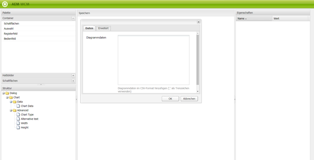

# Dialogfeldeditor{#dialog-editor}

Der Dialogfeldeditor bietet eine grafische Oberfläche zur einfachen Erstellung und Bearbeitung von Dialogfeldern und Gerüsten.

Um zu sehen, wie es funktioniert, gehen Sie zur CRXDE Lite, öffnen Sie den Explorer-Baum zu `/libs/foundation/components/chart` und doppelklicken Sie auf den Knoten `dialog`:

Der Dialogknoten wird anschließend im **Dialogfeldeditor** geöffnet:

## Benutzeroberfläche: Überblick {#user-interface-overview}

Die Oberfläche des Dialogfeldeditors besteht aus vier Bereichen:

* **Palette** links oben In diesem Bereich befinden sich die zum Erstellen eines Dialogfelds erforderlichen Widgets, etwa Registerkartenfelder, Textfelder, Auswahllisten und Schaltflächen. Sie können die verschiedenen Kategorien in der Palette maximieren, indem Sie auf die gewünschte Trennleiste klicken.
* **Struktur** links unten In diesem Bereich wird die hierarchische Struktur der Knoten angezeigt, aus der die Dialogfelddefinition besteht. Dieselbe Struktur können Sie sehen, wenn Sie den Dialogknoten in CRXDE Lite oder CRX Content Explorer maximieren.
* Der Bereich **render** in der Mitte des Fensters. Darin ist zu sehen, wie die im Strukturfenster definierte Dialogfelddefinition als tatsächliches Dialogfeld gerendert wird.
* **Eigenschaften** In diesem Bereich werden die Eigenschaften des aktuell im Bereich „Struktur“ markierten Knotens angezeigt.

### Verwenden des Dialogfeldeditors  {#using-the-dialog-editor}

Erstellen Sie ein Dialogfeld, indem Sie Elemente innerhalb der Dialogfeld-Definitionshierarchie aus der Palette in den Strukturbereich in Position ziehen.

Wenn Sie die gewünschte Struktur abgeschlossen haben, klicken Sie ganz oben im Bereich „Rendern“ auf **Speichern**.

>[!CAUTION]
>
>Beachten Sie, dass der Dialogfeldeditor für die Erstellung relativ einfacher Dialogfelder vorgesehen ist und Sie damit möglicherweise keine komplexen Dialogfelddefinitionen bearbeiten können. In Fällen, in denen der Editor die Bearbeitung einer Dialogfeldstruktur nicht zulässt, muss die Dialogfelddefinition manuell erstellt und/oder bearbeitet werden, indem die Knotenstruktur anhand von CRXDE Lite, CRX Content Explorer oder eines anderen Tools direkt bearbeitet wird.

### Erstellen eines neuen Dialogfelds  {#creating-a-new-dialog}

Erstellen Sie ein neues Dialogfeld, indem Sie die erforderliche Komponente auswählen, auf **Erstellen...** klicken und anschließend **Dialogfeld erstellen...** auswählen.

Geben Sie die erforderlichen Informationen ein und klicken Sie auf **Alle speichern**. Nun können Sie doppelt auf das Dialogfeld klicken, um es im Editor zu öffnen.

### Verwenden des Dialogfeldeditors für Gerüste {#using-the-dialog-editor-for-scaffolds}

Ein Gerüst ist eine spezielle Seite mit einem Formular, das in einem Schritt ausgefüllt und gesendet werden kann. Damit können Sie anhand der eingegebenen Inhalte sehr schnell eine Seite erstellen.

Das Formular, aus dem ein Gerüst besteht, wird durch eine Dialogfelddefinition definiert, im Grunde wie ein normales Dialogfeld, mit dem Unterschied, dass es auf der Gerüstseite in einer anderen Form erscheint. Da Dialogfelddefinitionen zum Definieren von Gerüsten verwendet werden, können Sie Gerüste mit dem Dialogfeldeditor entwerfen. Beachten Sie, dass bei dieser Verwendung des Dialogfeldeditors im Renderbereich die Dialogfelddefinition weiterhin in Form eines Dialogfelds angezeigt wird, nicht als Grundlage.

Weitere Informationen zum Erstellen von Gerüsten mithilfe des Dialogfeldeditors finden Sie in [Gerüste](/help/sites-authoring/scaffolding.md).
