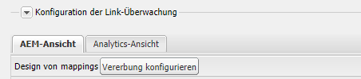
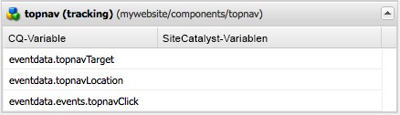

# Hinzufügen von Adobe Analytics-Tracking zu Komponenten{#adding-adobe-analytics-tracking-to-components}

## Einschließen des Adobe Analytics-Moduls in eine Seitenkomponente {#including-the-adobe-analytics-module-in-a-page-component}

Seitenvorlagenkomponenten (z. B. `head.jsp, body.jsp`) erfordert JSP-Includes, um den ContextHub und die Adobe Analytics-Integration (die Teil von Cloud Services ist) zu laden. Alle enthalten das Laden von JavaScript-Dateien.

Der ContextHub-Eintrag sollte direkt unter dem Tag `<head>` eingefügt werden, während Cloud Services in den Abschnitt `<head>` und vor dem Abschnitt `</body>` aufgenommen werden sollten. Beispiel:

```xml
<head>
   <sling:include path="contexthub" resourceType="granite/contexthub/components/contexthub" />
...
   <cq:include script="/libs/cq/cloudserviceconfigs/components/servicelibs/servicelibs.jsp"/>
...
</head>
<body>
...
    <cq:include path="cloudservices" resourceType="cq/cloudserviceconfigs/components/servicecomponents"/>
</body>
```

Das Skript `contexthub`, das Sie nach dem Element `<head>` einfügen, fügt die ContextHub-Funktionen zur Seite hinzu.

Die `cloudservices`-Skripte, die Sie in den Abschnitten `<head>` und `<body>` hinzufügen, gelten für die Cloud-Services-Konfigurationen, die der Seite hinzugefügt werden. (Wenn die Seite mehr als eine Cloud Services-Konfiguration verwendet, müssen Sie die ContextHub-JSP und die Cloud Services-JSP nur einmal einschließen.)

Wenn ein Adobe Analytics-Framework zur Seite hinzugefügt wird, generieren die `cloudservices`-Skripte Adobe Analytics-bezogenes JavaScript und Verweise auf clientseitige Bibliotheken, ähnlich dem folgenden Beispiel:

```xml
<div class="sitecatalyst cloudservice">
<script type="text/javascript" src="/etc/clientlibs/foundation/sitecatalyst/sitecatalyst.js"></script>
<script type="text/javascript" src="/etc/clientlibs/foundation/sitecatalyst/util.js"></script>
<script type="text/javascript" src="/content/geometrixx-outdoors/_jcr_content/analytics.sitecatalyst.js"></script>
<script type="text/javascript" src="/etc/clientlibs/mac/mac-sc.js"></script>
<script type="text/javascript" src="/etc/clientlibs/foundation/sitecatalyst/plugins.js"></script>
<script type="text/javascript">
<!--
CQ_Analytics.Sitecatalyst.frameworkComponents = ['foundation/components/page'];
/**
 * Sets Adobe Analytics variables accordingly to mapped components. If <code>options</code>
 * object is provided only variables matching the options.componentPath are set.
 *
 * @param {Object} options Parameter object from CQ_Analytics.record() call. Optional.
 */
CQ_Analytics.Sitecatalyst.updateEvars = function(options) {
    this.frameworkMappings = [];
 this.frameworkMappings.push({scVar:"pageName",cqVar:"pagedata.title",resourceType:"foundation/components/page"});
    for (var i=0; i<this.frameworkMappings.length; i++){
  var m = this.frameworkMappings[i];
  if (!options || options.compatibility || (options.componentPath == m.resourceType)) {
   CQ_Analytics.Sitecatalyst.setEvar(m);
  }
    }
}

CQ_Analytics.CCM.addListener("storesinitialize", function(e) {
 var collect = true;
    var lte = s.linkTrackEvents;
    s.pageName="content:geometrixx-outdoors:en";
    CQ_Analytics.Sitecatalyst.collect(collect);
    if (collect) {
  CQ_Analytics.Sitecatalyst.updateEvars();
     /************* DO NOT ALTER ANYTHING BELOW THIS LINE ! **************/
     var s_code=s.t();if(s_code)document.write(s_code);
     s.linkTrackEvents = lte;
     if(s.linkTrackVars.indexOf('events')==-1){delete s.events};
     $CQ(document).trigger("sitecatalystAfterCollect");
    }
});
//-->
</script>
<script type="text/javascript">
<!--
if(navigator.appVersion.indexOf('MSIE')>=0)document.write(unescape('%3C')+'\!-'+'-')
//-->
</script>
<noscript></noscript>
<span data-tracking="{event:'pageView', values:{}, componentPath:'foundation/components/page'}"></span>
<div id="cq-analytics-texthint" style="background:white; padding:0 10px; display:none;">
 <h3 class="cq-texthint-placeholder">Component clientcontext is missing or misplaced.</h3>
</div>
<script type="text/javascript">
$CQ(function(){
 if( CQ_Analytics &&
  CQ_Analytics.ClientContextMgr &&
  !CQ_Analytics.ClientContextMgr.isConfigLoaded )
  {
   $CQ("#cq-analytics-texthint").show();
  }
});
</script>
</div>
```

Dieser Code ist in allen AEM-Beispiel-Sites, wie Geometrixx Outdoors, eingeschlossen.

### sitecatalystAfterCollect-Ereignis  {#the-sitecatalystaftercollect-event}

Das Skript `cloudservices` Trigger das `sitecatalystAfterCollect` -Ereignis:

```
$CQ(document).trigger("sitecatalystAfterCollect");
```

Dieses Ereignis wird als Bestätigung ausgelöst, sobald die Seitenverfolgung abgeschlossen ist. Falls Sie auf dieser Seite zusätzliche Verfolgungsvorgänge durchführen, müssen Sie einen Listener für dieses Ereignis anstelle des documentload- oder documentready-Ereignisses verwenden. Durch Verwendung des Ereignisses `sitecatalystAfterCollect` werden Konflikte oder andere unvorhersehbare Verhaltensweisen vermieden.

>[!NOTE]
>
>Die Bibliothek `/libs/cq/analytics/clientlibs/sitecatalyst/sitecatalyst.js` enthält den Code aus der Adobe Analytics-Datei `s_code.js`.

## Implementieren des Adobe Analytics-Trackings für benutzerdefinierte Komponenten {#implementing-adobe-analytics-tracking-for-custom-components}

Aktivieren Sie Ihre AEM-Komponenten für die Interaktion mit dem Adobe Analytics-Framework. Konfigurieren Sie dann Ihr Framework so, dass Adobe Analytics die Komponentendaten verfolgt.

Komponenten, die mit dem Adobe Analytics-Framework interagieren, werden beim Bearbeiten eines Frameworks im SideKick angezeigt. Nachdem Sie die Komponente in das Framework gezogen haben, werden die Komponenteneigenschaften angezeigt und Sie können sie dann den Adobe Analytics-Eigenschaften zuordnen. (Siehe [Einrichten eines Frameworks für die einfache Verfolgung](/help/sites-administering/adobeanalytics-connect.md#creating-a-adobe-analytics-framework).)

Komponenten können mit dem Adobe Analytics-Framework interagieren, wenn die Komponente einen untergeordneten Knoten mit dem Namen `analytics` aufweist. Der Knoten `analytics` hat folgende Eigenschaften:

* `cq:trackevents`: Identifiziert die CQ-Ereignisse, die von der Komponente bereitgestellt werden. (Siehe „Benutzerdefinierte Ereignisse.)
* `cq:trackvars`: Benennt die CQ-Variablen, die den Adobe Analytics-Eigenschaften zugeordnet sind.
* `cq:componentName`: der Name der Komponente wird im Sidekick angezeigt.
* `cq:componentGroup`: Die Gruppe im Sidekick, die die Komponente enthält.

Der Code in der component.jsp fügt JavaScript zur Seite hinzu, der die Verfolgung auslöst, und definiert die zu verfolgenden Daten. Der Ereignisname und die Datennamen, die im JavaScript verwendet werden, müssen mit den entsprechenden Werten der Eigenschaften im Knoten `analytics` übereinstimmen.

* Verwenden Sie das data-tracking-Attribut, um Ereignisdaten beim Laden einer Seite zu verfolgen. (Siehe [Verfolgen von benutzerdefinierten Ereignissen beim Laden einer Seite](/help/sites-developing/extending-analytics.md#tracking-custom-events-on-page-load).)
* Verwenden Sie die Funktion CQ_Analytics.record, um Ereignisdaten zu verfolgen, wenn Benutzer mit den Seitenfunktionen interagieren. (Siehe [Verfolgen von benutzerdefinierten Ereignissen nach dem Laden einer Seite](/help/sites-developing/extending-analytics.md#tracking-custom-events-after-page-load).)

Wenn Sie diese Datenverfolgungsmethoden verwenden, führt das Adobe Analytics-Integrationsmodul automatisch Aufrufe an Adobe Analytics durch, um die Ereignisse und Daten aufzuzeichnen.

### Beispiel: Verfolgen von topnav-Klicks {#example-tracking-topnav-clicks}

Erweitern Sie die Foundation-topnav-Komponente, sodass Adobe Analytics Klicks auf Navigationslinks oben auf der Seite verfolgt. Wenn auf einen Navigations-Link geklickt wird, zeichnet Adobe Analytics den Link, auf den geklickt wurde, und die Seite auf, auf der er geklickt wurde.

Folgende Aufgaben müssen für die unten beschriebenen Verfahren bereits abgeschlossen sein:

* Erstellen einer CQ-Anwendung
* Eine Adobe Analytics-Konfiguration und ein Adobe Analytics-Framework erstellt.

#### Kopieren der topnav-Komponente {#copy-the-topnav-component}

Kopieren Sie der topnav- Komponente in die CQ-Anwendung. Dieses Verfahren setzt voraus, dass die Anwendung in CRXDE Lite eingerichtet ist.

1. Klicken Sie mit der rechten Maustaste auf den Knoten `/libs/foundation/components/topnav` und klicken Sie auf &quot;Kopieren&quot;.
1. Klicken Sie mit der rechten Maustaste auf den Ordner „Komponenten“ unter dem Anwendungsordner und dann auf „Einfügen“.
1. Klicken Sie auf Alle speichern.

#### Integrieren von topnav mit dem Adobe Analytics Framework {#integrating-topnav-with-the-adobe-analytics-framework}

Konfigurieren Sie die topnav-Komponente und bearbeiten Sie die JSP-Datei, um das Verfolgen von Ereignissen und Daten zu definieren.

1. Klicken Sie mit der rechten Maustaste auf den topnav-Knoten und anschließend auf „Erstellen“ und „Knoten erstellen“. Geben Sie folgende Eigenschaftenwerte ein und klicken Sie dann auf „OK“:

   * Name: `analytics`
   * Typ: `nt:unstructured`

1. Fügen Sie die folgende Eigenschaft zum analytics-Knoten hinzu, um das Verfolgungsereignis zu benennen:

   * Name: cq:trackevents
   * Typ: String
   * Wert: topnavClick

1. Fügen Sie die folgende Eigenschaft zum analytics-Knoten hinzu, um die Datenvariablen zu benennen:

   * Name: cq:trackvars
   * Typ: String
   * Wert: topnavTarget,topnavLocation

1. Fügen Sie die folgende Eigenschaft zum Knoten „analytics“ hinzu, um die Komponente für den Sidekick zu benennen:

   * Name: cq:componentName
   * Typ: String
   * Wert: topnav (tracking)

1. Fügen Sie die folgende Eigenschaft zum Knoten „analytics“ hinzu, um die Komponentengruppe für den Sidekick zu benennen:

   * Name: cq:componentGroup
   * Typ: String
   * Wert: General

1. Klicken Sie auf Alle speichern.
1. Öffnen Sie die Datei `topnav.jsp` .
1. Fügen Sie im a-Element das folgende Attribut hinzu:

   ```xml
   onclick = "tracknav('<%= child.getPath() %>.html')"
   ```

1. Fügen Sie unten auf der Seite folgenden JavaScript-Code hinzu:

   ```xml
   <script type="text/javascript">
       function tracknav(target) {
               if (CQ_Analytics.Sitecatalyst) {
                   CQ_Analytics.record({
                       event: 'topnavClick',
                       values: {
                           topnavTarget: target,
                           topnavLocation:'<%=currentPage.getPath() %>.html'
                       },
                       componentPath: '<%=resource.getResourceType()%>'
                   });
               }
       }
   </script>
   ```

1. Klicken Sie auf Alle speichern.

Der Inhalt der Datei `topnav.jsp` sollte wie folgt aussehen:

```xml
<%@page session="false"%><%--
  Copyright 1997-2008 Day Management AG
  Barfuesserplatz 6, 4001 Basel, Switzerland
  All Rights Reserved.

  This software is the confidential and proprietary information of
  Day Management AG, ("Confidential Information"). You shall not
  disclose such Confidential Information and shall use it only in
  accordance with the terms of the license agreement you entered into
  with Day.

  ==============================================================================

  Top Navigation component

  Draws the top navigation

--%><%@include file="/libs/foundation/global.jsp"%><%
%><%@ page import="java.util.Iterator,
        com.day.text.Text,
        com.day.cq.wcm.api.PageFilter,
        com.day.cq.wcm.api.Page,
        com.day.cq.commons.Doctype,
        org.apache.commons.lang3.StringEscapeUtils" %><%

    // get starting point of navigation
    long absParent = currentStyle.get("absParent", 2L);
    String navstart = Text.getAbsoluteParent(currentPage.getPath(), (int) absParent);

    //if not deep enough take current node
    if (navstart.equals("")) navstart=currentPage.getPath();

    Resource rootRes = slingRequest.getResourceResolver().getResource(navstart);
    Page rootPage = rootRes == null ? null : rootRes.adaptTo(Page.class);
    String xs = Doctype.isXHTML(request) ? "/" : "";
    if (rootPage != null) {
        Iterator<Page> children = rootPage.listChildren(new PageFilter(request));
        while (children.hasNext()) {
            Page child = children.next();
            %><a onclick = "tracknav('<%= child.getPath() %>.html')"  href="<%= child.getPath() %>.html"><%
            %>" src="<%= child.getPath() %>.navimage.png"<%= xs %>></a><%
        }
    }
%><script type="text/javascript">
    function tracknav(target) {
            if (CQ_Analytics.Sitecatalyst) {
                CQ_Analytics.record({
                    event: 'topnavClick',
                    values: {
                        topnavTarget:target,
                        topnavLocation:'<%=currentPage.getPath() %>.html'
                    },
                    componentPath: '<%=resource.getResourceType()%>'
                });
            }
    }
</script>
```

>[!NOTE]
>
>Es ist häufig wünschenswert, Daten aus dem ContextHub zu verfolgen. Informationen zur Verwendung von JavaScript zum Abrufen dieser Informationen finden Sie unter [Zugreifen auf Werte im ContextHub](/help/sites-developing/extending-analytics.md#accessing-values-in-the-contexthub).

#### Hinzufügen der Verfolgungskomponente zum Sidekick {#adding-the-tracking-component-to-sidekick}

Fügen Sie dem Sidekick Komponenten hinzu, die für das Tracking mit Adobe Analytics aktiviert sind, damit Sie sie zum Framework hinzufügen können.

1. Öffnen Sie das Adobe Analytics-Framework über Ihre Adobe Analytics-Konfiguration. ([http://localhost:4502/etc/cloudservices/sitecatalyst.html](http://localhost:4502/etc/cloudservices/sitecatalyst.html))
1. Klicken Sie im Sidekick auf die Schaltfläche „Design“.

   

1. Klicken Sie im Konfigurationsbereich für die Linkverfolgung auf „Vererbung konfigurieren“.

   

1. Wählen Sie aus der Liste „Zugelassene Komponenten“ im Abschnitt „Allgemein“ den Eintrag „topnav (tracking)“ aus und klicken Sie dann auf „OK“. 
1. Erweitern Sie den Sidekick, um in den Bearbeitungsmodus zu wechseln. Die Komponente ist jetzt in der Gruppe „Allgemein“ verfügbar.

#### Hinzufügen der topnav-Komponente zum Framework  {#adding-the-topnav-component-to-your-framework}

Ziehen Sie die topnav-Komponente in Ihr Adobe Analytics-Framework und ordnen Sie die Komponentenvariablen und -ereignisse Adobe Analytics-Variablen und -Ereignissen zu. (Siehe [Einrichten eines Frameworks für die einfache Verfolgung](/help/sites-administering/adobeanalytics-connect.md).)



Die topnav-Komponente ist jetzt in das Adobe Analytics-Framework integriert. Wenn Sie die Komponente zu einer Seite hinzufügen, werden durch Klicken auf die Elemente in der oberen Navigationsleiste Tracking-Daten an Adobe Analytics gesendet.

### Senden von s.products-Daten an Adobe Analytics {#sending-s-products-data-to-adobe-analytics}

Komponenten können Daten für die Variable s.products generieren, die an Adobe Analytics gesendet wird. Gestalten Sie Ihre Komponenten so, dass sie zur Variablen s.products beitragen:

* Zeichnen Sie einen Wert `product` mit einer spezifischen Struktur auf.
* Zeigen Sie die Datenmitglieder des Werts `product` an, damit sie im Adobe Analytics-Framework mit Adobe Analytics-Variablen gemappt werden können.

Die Variable &quot;s.products&quot;von Adobe Analytics verwendet die folgende Syntax:

```
s.products="category;product;quantity;price;eventY={value}|eventZ={value};evarA={value}|evarB={value}"
```

Das Adobe Analytics-Integrationsmodul erstellt die Variable `s.products` mithilfe der von AEM Komponenten generierten `product`-Werte. Der `product` -Wert im JavaScript, den AEM Komponenten generieren, ist ein Array von Werten mit der folgenden Struktur:

```
"product": [{
    "category": "",
    "sku"     : "path to product node",
    "quantity": quantity,
    "price"   : price,
    "events   : {
      "eventName1": "eventValue1",
      "eventName_n": "eventValue_n"
    }
    "evars"   : {
      "eVarName1": "eVarValue1",
      "eVarName_n": "eVarValue_n"
    }
}]
```

Wenn ein Datenelement im `product`-Wert ausgelassen wird, wird es als leere Zeichenfolge in s.products gesendet.

>[!NOTE]
>
>Wenn einem Produktwert kein Ereignis zugeordnet ist, verwendet Adobe Analytics standardmäßig das Ereignis `prodView` .

Der Knoten `analytics` der Komponente muss die Variablennamen mithilfe der Eigenschaft `cq:trackvars` verfügbar machen:

* product.category
* product.sku
* product.quantity
* product.price
* product.events.eventName1
* product.events.eventName_n
* product.evars.eVarName1
* product.evars.eVarName_n

Das eCommerce-Modul stellt eine Reihe von Komponenten bereit, die Daten für die s.products-Variable erzeugen. Die Komponente „submitorder“ ([http://localhost:4502/crx/de/index.jsp#/libs/commerce/components/submitorder/submitorder.jsp](http://localhost:4502/crx/de/index.jsp#/libs/commerce/components/submitorder/submitorder.jsp)) erzeugt beispielsweise JavaScript, das dem folgenden Beispiel ähnelt:

```
<script type="text/javascript">
    function trackCartPurchase() {
        if (CQ_Analytics.Sitecatalyst) {
            CQ_Analytics.record({
                "event": ["productsCartPurchase"],
                "values": {
                    "product": [
                        {
                            "category": "",
                            "sku"     : "/path/to/prod/1",
                            "quantity": 3,
                            "price"   : 179.7,
                            "evars"   : {
                                "childSku": "/path/to/prod/1/green/xs",
                                "size"    : "XS"
                            }
                        },
                        {
                            "category": "",
                            "sku"     : "/path/to/prod/2",
                            "quantity": 10,
                            "price"   : 150,
                            "evars"   : {
                                "childSku": "/path/to/prod/2",
                                "size"    : ""
                            }
                        },
                        {
                            "category": "",
                            "sku"     : "/path/to/prod/3",
                            "quantity": 2,
                            "price"   : 102,
                            "evars"   : {
                                "childSku": "/path/to/prod/3/m",
                                "size"    : "M"
                            }
                        }
                    ]
                },
                "componentPath": "commerce/components/submitorder"
            });
            CQ_Analytics.record({
                "event": ["discountRedemption"],
                "values": {
                    "discount": "/path/to/discount/1 - /path/to/discount/2",
                    "product" : [{
                        "category": "",
                        "sku"     : "Promotional Discount",
                        "events"  : {"discountRedemption": 20.00}
                    }]
                },
                "componentPath": "commerce/components/submitorder"
            });
            CQ_Analytics.record({
                "event": ["cartPurchase"],
                "values": {
                    "orderId"       : "00e40e2d-13a2-4a00-a8ee-01a9ebb0bf68",
                    "shippingMethod": "overnight",
                    "paymentMethod" : "Amex",
                    "billingState"  : "NY",
                    "billingZip"    : "10458",
                    "product"       : [{"category": "", "sku": "", "quantity": "", "price": ""}]
                },
                "componentPath": "commerce/components/submitorder"
            });
        }
        return true;
    }
</script>
```

#### Beschränken der Größe von Verfolgungsaufrufen  {#limiting-the-size-of-tracking-calls}

Im Allgemeinen beschränken Webbrowser die Größe von GET-Anforderungen. Da es sich beim CQ-Produkt und den SKU-Werten um Repository-Pfade handelt, können Produkt-Arrays mit mehreren Werten die Größenbeschränkung einer Anforderung überschreiten. Daher sollten Ihre Komponenten die Anzahl der Elemente im `product`-Array jedes `CQ_Analytics.record function`-Elements begrenzen. Erstellen Sie mehrere Funktionen, wenn die Anzahl der Elemente, die Sie verfolgen möchten, das Limit überschreiten kann.

Die submitorder-eCommerce-Komponente beschränkt z. B. die Anzahl der `product`-Elemente in einem Aufruf auf vier. Wenn der Warenkorb mehr als vier Produkte enthält, erzeugt sie mehrere `CQ_Analytics.record`-Funktionen.
