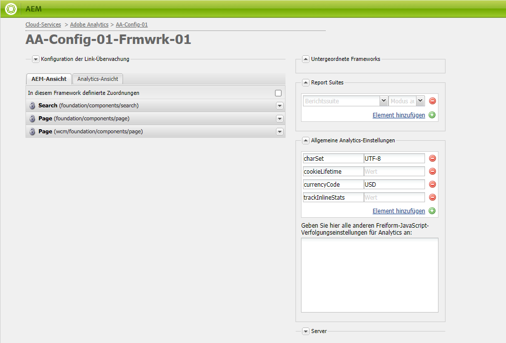
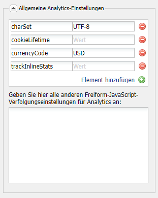

# Anpassen des Adobe Analytics Framework{#customizing-the-adobe-analytics-framework}

Das Adobe Analytics-Framework bestimmt die Informationen, die mit Adobe Analytics verfolgt werden. Um das Standard-Framework anzupassen, verwenden Sie JavaScript, um benutzerdefiniertes Tracking hinzuzufügen, Adobe Analytics-Plug-ins zu integrieren und allgemeine Einstellungen innerhalb des für das Tracking verwendeten Frameworks zu ändern.

## Über das generierte JavaScript für Frameworks {#about-the-generated-javascript-for-frameworks}

Wenn eine Seite mit einem Adobe Analytics-Framework verknüpft ist und die Seite [Verweise auf das Analytics-Modul](/help/sites-administering/adobeanalytics.md), wird automatisch eine Datei analytics.sitecatalyst.js für die Seite generiert.

Das JavaScript auf der Seite erstellt eine `s_gi`-Objekt (das die Adobe Analytics-Bibliothek s_code.js definiert) und weist seinen Eigenschaften Werte zu. Der Name der Objektinstanz ist `s`. Die Code-Beispiele, die in diesem Abschnitt gezeigt werden, verweisen häufiger auf diese `s`-Variable.

Der folgende Beispiel-Code ähnelt dem Code in der Datei analytics.sitecatalyst.js:

```
var s_account = "my_sitecatalyst_account";
var s = s_gi(s_account);
s.fpCookieDomainPeriods = "3";
s.currencyCode= 'USD';
s.trackInlineStats= true;
s.linkTrackVars= 'None';
s.charSet= 'UTF-8';
s.linkLeaveQueryString= false;
s.linkExternalFilters= '';
s.linkTrackEvents= 'None';
s.trackExternalLinks= true;
s.linkDownloadFileTypes= 'exe,zip,wav,mp3,mov,mpg,avi,wmv,doc,pdf,xls';
s.linkInternalFilters= 'javascript:,'+window.location.hostname;
s.trackDownloadLinks= true;

s.visitorNamespace = "mynamespace";
s.trackingServer = "xxxxxxx.net";
s.trackingServerSecure = "xxxxxxx.net";

/* Plugin Config */
/*
s.usePlugins=false;
function s_doPlugins(s) {
    //add your custom plugin code here
}
s.doPlugins=s_doPlugins;
*/
```

Wenn Sie benutzerdefinierten JavaScript-Code verwenden, um das Framework anzupassen, ändern Sie den Inhalt dieser Datei.

## Konfigurieren von Adobe Analytics-Eigenschaften {#configuring-adobe-analytics-properties}

Es gibt mehrere vordefinierte Variablen in Adobe Analytics, die in einem Framework konfiguriert werden können. Die **charset**, **cookieLifetime**, **currencyCode**, und **trackInlineStats** -Variablen sind in **Allgemeine Analytics-Einstellungen** standardmäßig auflisten.



Sie können Variablennamen und -werte zur Liste hinzufügen. Diese vordefinierten Variablen und alle Variablen, die Sie hinzufügen, werden für die Konfiguration der Eigenschaften des `s`-Objekts in der Datei analytics.sitecatalyst.js verwendet. Das folgende Beispiel zeigt, wie die `prop10` Eigenschaft des Werts `CONSTANT` wird im JavaScript-Code dargestellt:

```
var s_account = "my_sitecatalyst_account";
var s = s_gi(s_account);
s.fpCookieDomainPeriods = "3";
s.currencyCode= 'USD';
s.trackInlineStats= true;
s.linkTrackVars= 'None';
s.charSet= 'UTF-8';
s.linkLeaveQueryString= false;
s.linkExternalFilters= '';
s.linkTrackEvents= 'None';
s.trackExternalLinks= true;
s.linkDownloadFileTypes= 'exe,zip,wav,mp3,mov,mpg,avi,wmv,doc,pdf,xls';
s.prop10= 'CONSTANT';
s.linkInternalFilters= 'javascript:,'+window.location.hostname;
s.trackDownloadLinks= true;

s.visitorNamespace = "mynamespace";
s.trackingServer = "xxxxxxx.net";
s.trackingServerSecure = "xxxxxxx.net";
```

Mit dem folgenden Verfahren können Sie Variablen zur Liste hinzufügen:

1. Erweitern Sie auf der Adobe Analytics-Framework-Seite den Bereich **Allgemeine Analytics-Einstellungen**.
1. Klicken Sie unter der Liste der Variablen auf „Element hinzufügen“, um eine neue Variable zur Liste hinzuzufügen.
1. Geben Sie in der linken Zelle einen Namen für die Variable ein, beispielsweise: `prop10`.

1. Geben Sie in der rechten Spalte einen Wert für die Variable ein, beispielsweise: `CONSTANT`.

1. Um eine Variable zu entfernen, klicken Sie auf die Schaltfläche (-) neben der Variablen.

>[!NOTE]
>
>Stellen Sie bei der Eingabe von Variablen und Werten sicher, dass sie korrekt formatiert und geschrieben sind, oder **-Aufrufe werden nicht gesendet** mit dem richtigen Wert-/Variablenpaar. Falsch geschriebene Variablen und Werte können sogar Aufrufe verhindern.
>
>Wenden Sie sich an Ihren Adobe Analytics-Support-Mitarbeiter, um sicherzustellen, dass diese Variablen korrekt eingestellt sind.

>[!CAUTION]
>
>Einige der Variablen in dieser Liste sind **mandatory** , damit Adobe Analytics-Aufrufe ordnungsgemäß funktionieren (z. B. **currencyCode**, **charSet**).
>
>Selbst wenn diese Variablen vom Framework selbst entfernt werden, werden sie dennoch bei einem Adobe Analytics-Aufruf mit dem Standardwert angehängt.

### Hinzufügen von benutzerdefiniertem JavaScript zu einem Adobe Analytics Framework {#adding-custom-javascript-to-an-adobe-analytics-framework}

Das freie JavaScript-Feld im **Allgemeine Analytics-Einstellungen** -Bereich können Sie benutzerdefinierten Code zu einem Adobe Analytics-Framework hinzufügen.



Der Code, den Sie hinzufügen, wird an die Datei analytics.sitecatalyst.js angehängt. Daher können Sie auf die `s` -Variable, die eine Instanz der `s_gi` JavaScript-Objekt, das in definiert ist `s_code.js`. Wenn Sie beispielsweise den folgenden Code hinzufügen, entspricht dies dem Hinzufügen einer Variable namens `prop10` mit dem Wert `CONSTANT` (das Beispiel aus dem vorhergehenden Abschnitt):

`s.prop10= 'CONSTANT';`

Der Code in der Datei [analytics.sitecatalyst.js](/help/sites-developing/extending-analytics-components.md) (die auch den Inhalt der Adobe Analytics-Datei `s-code.js` umfasst) enthält die folgende Code-Zeile:

`if (s.usePlugins) s.doPlugins(s)`

Das folgende Verfahren zeigt die Verwendung des JavaScript-Felds zur Anpassung des Adobe Analytics-Trackings. Wenn Ihr JavaScript Adobe Analytics-Plug-ins verwenden muss, [integrieren](/help/sites-administering/adobeanalytics.md) in AEM.

1. Fügen Sie dem Feld den folgenden JavaScript-Code hinzu, damit `s.doPlugins` ausgeführt wird:

   ```
   s.usePlugins=true;
   function s_doPlugins(s) {
       //add your custom code here
   }
   s.doPlugins=s_doPlugins;
   ```

   >[!CAUTION]
   >
   >Dieser Code ist erforderlich, wenn Sie Variablen in einem Adobe Analytics-Aufruf senden möchten, die auf eine Weise angepasst wurden, die nicht über die einfache Drag&amp;Drop-Oberfläche ODER über Inline-JavaScript in der Adobe Analytics-Ansicht durchgeführt werden kann.
   >
   >Wenn die benutzerdefinierten Variablen außerhalb der s_doPlugins-Funktion liegen, werden sie beim Adobe Analytics-Aufruf als * undefined* gesendet.

1. Fügen Sie Ihren JavaScript-Code im **s_doPlugins** -Funktion.

Beim folgenden Beispiel werden die auf einer Seite erfassten Daten in hierarchischer Reihenfolge verbunden. Dabei wird das gemeinsame Trennzeichen „|“ genutzt.

Ein Adobe Analytics-Framework verfügt über die folgenden Konfigurationen:

* Die Adobe Analytics-Variable `prop2` wird der Website-Eigenschaft `pagedata.sitesection` zugeordnet.

* Die Adobe Analytics-Variable `prop3` wird der Website-Eigenschaft `pagedata.subsection` zugeordnet.

* Der folgende Code wird zum Freie-von-JavaScript-Feld hinzugefügt:

  ```
  s.usePlugins=true;
   function s_doPlugins(s) {
   s.prop1 = s.prop2+'|'+s.prop3;
   }
   s.doPlugins=s_doPlugins;
  ```

* Wenn die Web-Seite, die das Framework verwendet, aufgerufen wird (oder wenn die Seite im Bearbeitungsmodus neu geladen oder eine Vorschau von ihr angezeigt wird), werden die Aufrufe an Adobe Analytics durchgeführt.

Beispielsweise werden die folgenden Werte in Adobe Analytics erzeugt:


### Hinzufügen von globalem benutzerdefinierten Code für alle Adobe Analytics-Frameworks {#adding-global-custom-code-for-all-adobe-analytics-frameworks}

Bereitstellen von benutzerdefiniertem JavaScript-Code, der in alle Adobe Analytics-Frameworks integriert ist. Wenn das Adobe Analytics-Framework einer Seite keine benutzerdefinierten [Freiform-JavaScript](/help/sites-administering/adobeanalytics.md), wird das JavaScript, das das Skript /libs/cq/analytics/components/sitecatalyst/config.js.jsp generiert, an die [analytics.sitecatalyst.js](/help/sites-administering/adobeanalytics.md) -Datei. Standardmäßig hat das Skript keine Wirkung, da es auskommentiert ist. Zusätzlich legt der Code `s.usePlugins` auf `false` fest:

```
/* Plugin Config */
/*
s.usePlugins=false;
function s_doPlugins(s) {
    //add your custom plugin code here
}
s.doPlugins=s_doPlugins;
*/
```

Der Code in der Datei analytics.sitecatalyst.js (die auch den Inhalt der Adobe Analytics-Datei umfasst) enthält die folgende Code-Zeile:

if (s.usePlugins) s.doPlugins(s)

Daher sollte Ihr JavaScript `s.usePlugins` nach `true` sodass jeder Code im `s_doPlugins` ausgeführt wird. Um den Code anzupassen, überlagern Sie die Datei config.js.jsp mit einer Datei, die Ihr eigenes JavaScript verwendet. Wenn Ihr JavaScript Adobe Analytics-Plug-ins verwenden muss, [integrieren](/help/sites-administering/adobeanalytics.md) in AEM.

>[!NOTE]
>
>Bearbeiten Sie die Datei /libs/cq/analytics/components/sitecatalyst/config.js.jsp nicht. Bestimmte AEM Upgrade- oder Wartungsaufgaben können die Originaldatei neu installieren und Ihre Änderungen entfernen.

1. Erstellen Sie unter CRXDE Lite die Ordnerstruktur /apps/cq/analytics/components :

   1. Klicken Sie mit der rechten Maustaste auf den Ordner /apps und klicken Sie auf Erstellen > Ordner erstellen .
   1. Legen Sie als Ordnernamen `cq` fest und klicken Sie auf „OK“.
   1. Erstellen Sie auf dieselbe Weise die Ordner `analytics` und `components`.

1. Rechtsklicken Sie auf die `components` Ordner, den Sie erstellt haben, und klicken Sie auf Erstellen > Komponente erstellen . Legen Sie die folgenden Eigenschaftswerte fest:

   * Bezeichnung: `sitecatalyst`
   * Titel: `sitecatalyst`
   * Obertyp: `/libs/cq/analytics/components/sitecatalyst`
   * Gruppe: `hidden`

1. Klicken Sie mehrfach auf „Weiter“, bis die Schaltfläche „OK“ aktiviert wird, und klicken Sie dann auf „OK“.

   Die SiteCatalyst-Komponente enthält die automatisch erstellte Datei sitecatalyst.jsp .

1. Klicken Sie mit der rechten Maustaste auf die Datei sitecatalyst.jsp und klicken Sie dann auf „Löschen“.

1. Klicken Sie mit der rechten Maustaste auf die SiteCatalyst-Komponente und klicken Sie auf „Erstellen“ > „Datei erstellen“. Legen Sie den Namen `config.js.jsp` fest und klicken Sie dann auf „OK“.

   Die Datei config.js.jsp wird automatisch zur Bearbeitung geöffnet.

1. Fügen Sie den folgenden Text zur Datei hinzu und klicken Sie auf „Alle speichern“:

   ```java
   <%@page session="true"%>
   /* Plugin Config */
   s.usePlugins=true;
   function s_doPlugins(s) {
       //add your custom plugin code here
   }
   s.doPlugins=s_doPlugins;
   ```

   Der JavaScript-Code, den das Skript /apps/cq/analytics/components/sitecatalyst/config.js.jsp generiert, wird jetzt für alle Seiten, die ein Adobe Analytics-Framework verwenden, in die Datei analytics.sitecatalyst.js eingefügt.

1. Fügen Sie den JavaScript-Code hinzu, den Sie im `s_doPlugins` und klicken Sie dann auf Alle speichern.

>[!CAUTION]
>
>Wenn Text im Freiform-JavaScript des Frameworks einer Seite vorhanden ist (auch nur Leerzeichen), wird config.js.jsp ignoriert.

### Verwenden von Adobe Analytics-Plug-ins in AEM {#using-adobe-analytics-plugins-in-aem}

Rufen Sie den JavaScript-Code für Adobe Analytics-Plug-ins ab und integrieren Sie sie in Ihr Adobe Analytics-Framework in AEM. Fügen Sie den Code einem Client-Bibliotheksordner der Kategorie hinzu. `sitecatalyst.plugins` damit sie für Ihren benutzerdefinierten JavaScript-Code verfügbar sind.

Wenn Sie beispielsweise die `getQueryParams` -Plug-in können Sie das Plug-in aus dem `s_doPlugins` -Funktion Ihres benutzerspezifischen JavaScript-Elements verwenden. Der folgende Beispielcode sendet die Abfragezeichenfolge in **&quot;pid&quot;** von der URL des Referrers als **eVar1**, wenn ein Adobe Analytics-Aufruf ausgelöst wird.

```
s.usePlugins=true;
function s_doPlugins(s) {
   // take the query string from the referrer
   s.eVar1=s.getQueryParam('pid','',document.referrer);
}
s.doPlugins=s_doPlugins;
```

AEM installiert die folgenden Adobe Analytics-Plug-ins, sodass sie standardmäßig zur Verfügung stehen:

* getQueryParam()
* getPreviousValue()
* split()

Der Client-Bibliotheksordner /libs/cq/analytics/clientlibs/sitecatalyst/plugins enthält diese Plug-ins in der Kategorie sitecatalyst.plugins.

>[!NOTE]
>
>Erstellen Sie einen Client-Bibliotheksordner für Ihre Plug-ins. Fügen Sie keine Plug-ins zum Ordner `/libs/cq/analytics/clientlibs/sitecatalyst/plugins` hinzu. Dadurch wird sichergestellt, dass Ihre Beiträge zur Kategorie `sitecatalyst.plugins` bei erneuten Installationen oder Upgrades von AEM nicht überschrieben werden.

Führen Sie die folgenden Schritte aus, um den Client-Bibliotheksordner für Ihre Plug-ins zu erstellen. Sie müssen diesen Vorgang nur einmal ausführen. Über das darauffolgende Verfahren können Sie ein Plug-in zum Client-Bibliotheksordner hinzufügen.

1. Öffnen Sie CRXDE Lite in einem Webbrowser. ([http://localhost:4502/crx/de](http://localhost:4502/crx/de))

1. Klicken Sie mit der rechten Maustaste auf den Ordner /apps/my-app/clientlibs und klicken Sie auf „Erstellen“ > „Knoten erstellen“. Geben Sie die folgenden Eigenschaftswerte ein und klicken Sie dann auf „OK“:

   * Name: ein Name für den Client-Bibliotheksordner, z. B. „meine-plug-ins“

   * Typ: cq:ClientLibraryFolder

1. Wählen Sie den von Ihnen erstellten Client-Bibliotheksordner aus und verwenden Sie die untere rechte Eigenschaftenleiste, um die folgende Eigenschaft hinzuzufügen:

   * Name: categories
   * Typ: String
   * Wert: sitecatalyst.plugins
   * Multi: ausgewählt

   Klicken Sie im Eigenschaftsfenster auf „OK“, um den Eigenschaftswert zu bestätigen.

1. Klicken Sie mit der rechten Maustaste auf den von Ihnen erstellten Client-Bibliotheksordner und klicken Sie auf Erstellen > Datei erstellen . Geben Sie als Dateinamen „js.txt“ ein und klicken Sie dann auf „OK“.

1. Klicken Sie auf „Alle speichern“.

Mit dem folgenden Verfahren können Sie sich den Plug-in-Code beschaffen, den Code im AEM-Repository speichern und den Code zu Ihrem Client-Bibliotheksordner hinzufügen.

1. Melden Sie sich mit Ihrem Adobe Analytics-Konto bei [sc.omniture.com](https://sc.omniture.com/login/) an.
1. Navigieren Sie auf der Landingpage zu Hilfe > Hilfe-Startseite.
1. Klicken Sie im Inhaltsverzeichnis auf der linken Seite auf Plug-ins für Implementierungen.
1. Klicken Sie auf den Link zum Plug-in, das Sie hinzufügen möchten. Suchen Sie beim Öffnen der Seite den JavaScript-Quellcode für das Plug-in, wählen Sie den Code aus und kopieren Sie ihn.

1. Klicken Sie mit der rechten Maustaste auf Ihren Client-Bibliotheksordner und klicken Sie auf Erstellen > Datei erstellen . Geben Sie als Dateinamen den Namen des zu integrierenden Plug-ins gefolgt von .js ein und klicken Sie auf OK. Wenn Sie z. B. das Plug-in getQueryParam integrieren, nennen Sie die Datei „getQueryParam.js“.

   Wenn Sie die Datei erstellen, wird sie zur Bearbeitung geöffnet.

1. Fügen Sie den JavaScript-Code des Plug-ins in die Datei ein, klicken Sie auf &quot;Alle speichern&quot;und schließen Sie dann die Datei.

1. Öffnen Sie die Datei js.txt aus dem Client-Bibliotheksordner.

1. Fügen Sie in einer neuen Zeile den Namen der Datei hinzu, die das Plug-in enthält, z. B. getQueryParam.js. Klicken Sie dann auf „Alle speichern“ und schließen Sie die Datei.

>[!NOTE]
>
>Stellen Sie bei der Verwendung von Plug-ins sicher, dass Sie auch unterstützende Plug-ins integrieren. Andernfalls erkennt das Plug-in-JavaScript die Aufrufe, die es an die Funktionen im unterstützenden Plug-in sendet. Beispielsweise benötigt das Plug-in getPreviousValue() das Plug-in split() , um ordnungsgemäß zu funktionieren.
>
>Den Namen des unterstützenden Plug-ins müssen Sie ebenfalls in die Datei **js.txt** einfügen.
