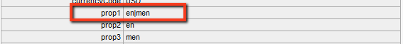

# Anpassen des Adobe Analytics Framework{#customizing-the-adobe-analytics-framework}

Das Adobe Analytics-Framework bestimmt die Informationen, die mit Adobe Analytics verfolgt werden. Um das Standard-Framework anzupassen, können Sie mit JavaScript benutzerdefiniertes Tracking hinzufügen, Adobe Analytics-Plug-ins integrieren und die allgemeinen Einstellungen in dem zum Tracking genutzten Framework ändern.

## Das generierte JavaScript für Frameworks {#about-the-generated-javascript-for-frameworks}

Wenn eine Seite mit einem Adobe Analytics-Framework verknüpft ist und die Seite [Verweise auf das Analytics-Modul](/help/sites-administering/adobeanalytics.md) enthält, wird automatisch die Datei analytics.sitecatalyst.js für diese Seite erstellt.

Das JavaScript auf der Seite erstellt ein `s_gi`-Objekt (das die s_code.js- Adobe Analytics-Bibliothek definiert) und weist seinen Eigenschaften Werte zu. Der Name der Objektinstanz ist `s`. Die Code-Beispiele, die in diesem Abschnitt gezeigt werden, verweisen häufiger auf diese `s`-Variable.

Der folgende Beispiel-Code ähnelt dem Code in der Datei analytics.sitecatalyst.js:

```
var s_account = "my_sitecatalyst_account";
var s = s_gi(s_account);
s.fpCookieDomainPeriods = "3";
s.currencyCode= 'USD';
s.trackInlineStats= true;
s.linkTrackVars= 'None';
s.charSet= 'UTF-8';
s.linkLeaveQueryString= false;
s.linkExternalFilters= '';
s.linkTrackEvents= 'None';
s.trackExternalLinks= true;
s.linkDownloadFileTypes= 'exe,zip,wav,mp3,mov,mpg,avi,wmv,doc,pdf,xls';
s.linkInternalFilters= 'javascript:,'+window.location.hostname;
s.trackDownloadLinks= true;

s.visitorNamespace = "mynamespace";
s.trackingServer = "xxxxxxx.net";
s.trackingServerSecure = "xxxxxxx.net";

/* Plugin Config */
/*
s.usePlugins=false;
function s_doPlugins(s) {
    //add your custom plugin code here
}
s.doPlugins=s_doPlugins;
*/
```

Wenn Sie mit angepasstem JavaScript-Code das Framework anpassen, ändern Sie den Inhalt dieser Datei.

## Konfigurieren von Adobe Analytics-Eigenschaften {#configuring-adobe-analytics-properties}

Es gibt mehrere vordefinierte Variablen in Adobe Analytics, die in einem Framework konfigurierbar sind. Die Variablen **charset**, **cookieLifetime**, **currencyCode** und **trackInlineStats** sind standardmäßig in der Liste **Allgemeine Analytics-Einstellungen** enthalten.


Sie können Variablennamen und -werte zur Liste hinzufügen. Diese vordefinierten Variablen und alle Variablen, die Sie hinzufügen, werden für die Konfiguration der Eigenschaften des `s`-Objekts in der Datei analytics.sitecatalyst.js verwendet. Das folgende Beispiel zeigt, wie die hinzugefügte Eigenschaft `prop10` mit dem Wert `CONSTANT` im JavaScript-Code dargestellt wird:

```
var s_account = "my_sitecatalyst_account";
var s = s_gi(s_account);
s.fpCookieDomainPeriods = "3";
s.currencyCode= 'USD';
s.trackInlineStats= true;
s.linkTrackVars= 'None';
s.charSet= 'UTF-8';
s.linkLeaveQueryString= false;
s.linkExternalFilters= '';
s.linkTrackEvents= 'None';
s.trackExternalLinks= true;
s.linkDownloadFileTypes= 'exe,zip,wav,mp3,mov,mpg,avi,wmv,doc,pdf,xls';
s.prop10= 'CONSTANT';
s.linkInternalFilters= 'javascript:,'+window.location.hostname;
s.trackDownloadLinks= true;

s.visitorNamespace = "mynamespace";
s.trackingServer = "xxxxxxx.net";
s.trackingServerSecure = "xxxxxxx.net";
```

Mit dem folgenden Verfahren können Sie Variablen zur Liste hinzufügen:

1. Erweitern Sie auf der Adobe Analytics-Framework-Seite den Bereich **Allgemeine Analytics-Einstellungen**.
1. Klicken Sie unter der Liste der Variablen auf „Element hinzufügen“, um eine neue Variable zur Liste hinzuzufügen.
1. Geben Sie in der linken Zelle einen Namenfür die Variable ein, zum Beispiel `prop10`.

1. Geben Sie in der rechten Spalte einen Wertfür die Variable ein, zum Beispiel `CONSTANT`.

1. Um eine Variable zu entfernen, klicken Sie auf das Minuszeichen (-) neben der Variablen.

>[!NOTE]
>
>Stellen Sie bei der Eingabe von Variablen und Werten sicher, dass sie korrekt formatiert und geschrieben sind. Andernfalls werden die **Aufrufe nicht** mit dem korrekten Wert/Variable-Paar gesendet. Falsch geschriebene Variablen und Werte können Aufrufe sogar komplett verhindern.
>
>Beraten Sie sich mit dem für Sie zuständigen Adobe Analytics-Mitarbeiter, um sicherzustellen, dass diese Variablen richtig festgelegt sind.

>[!CAUTION]
>
>Einige Variablen in dieser Liste sind **erforderlich**, damit Adobe Analytics-Aufrufe ordnungsgemäß funktionieren (z. B. **currencyCode**, **charSet**).
>
>Selbst wenn diese Variablen vom Framework selbst entfernt werden, werden sie dennoch bei einem Adobe Analytics-Aufruf mit dem Standardwert angehängt.

### Hinzufügen von benutzerdefiniertem JavaScript zu einem Adobe Analytics Framework {#adding-custom-javascript-to-an-adobe-analytics-framework}

Im Freiform-JavaScript-Feld im Bereich **Allgemeine Analytics-Einstellungen** können Sie benutzerdefinierten Code zu einem Adobe Analytics-Framework hinzufügen.


Der Code, den Sie hinzufügen, wird an die Datei analytics.sitecatalyst.js angehängt. Daher können Sie auf die `s`-Variable zugreifen, die eine Instanz des JavaScript-Objekts `s_gi` ist, das in `s_code.js` definiert wird. Wenn Sie beispielsweise den folgenden Code hinzufügen, entspricht dies dem Hinzufügen einer Variable namens `prop10` mit dem Wert `CONSTANT` (das Beispiel aus dem vorhergehenden Abschnitt):

`s.prop10= 'CONSTANT';`

Der Code in der Datei [analytics.sitecatalyst.js](/help/sites-developing/extending-analytics-components.md) (die auch den Inhalt der Adobe Analytics-Datei `s-code.js` umfasst) enthält die folgende Code-Zeile:

`if (s.usePlugins) s.doPlugins(s)`

Das folgende Verfahren zeigt, wie Sie über das JavaScript-Feld das Adobe Analytics-Tracking anpassen. Wenn Ihr JavaScript Adobe Analytics-Plug-ins benötigt, [integrieren Sie sie](/help/sites-administering/adobeanalytics.md) in AEM.

1. Fügen Sie den folgenden JavaScript-Code in das Feld ein, damit `s.doPlugins` ausgeführt wird:

   ```
   s.usePlugins=true;
   function s_doPlugins(s) {
       //add your custom code here
   }
   s.doPlugins=s_doPlugins;
   ```

   >[!CAUTION]
   >
   >Dieser Code ist erforderlich, wenn Sie Variablen in einem Adobe Analytics-Aufruf senden möchten, die auf eine Art angepasst wurden, die nicht über die grundlegende Drag-and-Drop-Oberfläche ODER mittels Inline-JavaScript in der Adobe Analytics-Ansicht erfolgen kann.
   >
   >Wenn die benutzerdefinierten Variablen außerhalb der s_doPlugins-Funktion liegen, werden sie beim Adobe Analytics-Aufruf als * undefined* gesendet.

1. Fügen Sie Ihren JavaScript-Code in der Funktion **s_doPlugins** hinzu.

Beim folgenden Beispiel werden die auf einer Seite erfassten Daten in hierarchischer Reihenfolge verbunden. Dabei wird das gemeinsame Trennzeichen „|“ genutzt.

Ein Adobe Analytics-Framework weist die folgenden Konfigurationen auf:

* Die Adobe Analytics-Variable `prop2` wird der Website-Eigenschaft `pagedata.sitesection` zugeordnet.

* Die Adobe Analytics-Variable `prop3` wird der Website-Eigenschaft `pagedata.subsection` zugeordnet.

* Der folgende Code wird im Freiform-JavaScript-Feld hinzugefügt:

   ```
   s.usePlugins=true;
    function s_doPlugins(s) {
    s.prop1 = s.prop2+'|'+s.prop3;
    }
    s.doPlugins=s_doPlugins;
   ```

* Wenn die Web-Seite, die das Framework verwendet, aufgerufen wird (oder wenn die Seite im Bearbeitungsmodus neu geladen oder eine Vorschau von ihr angezeigt wird), werden die Aufrufe an Adobe Analytics durchgeführt.

Beispielsweise werden die folgenden Werte in Adobe Analytics erzeugt:



### Hinzufügen von globalem benutzerdefinierten Code für alle Adobe Analytics-Frameworks {#adding-global-custom-code-for-all-adobe-analytics-frameworks}

Geben Sie benutzerdefinierten JavaScript-Code ein, der in alle Adobe Analytics-Frameworks integriert wird. Wenn das Adobe Analytics-Framework einer Seite kein benutzerdefiniertes [Freiform-JavaScript](/help/sites-administering/adobeanalytics.md) enthält, wird das vom Skript /libs/cq/analytics/components/sitecatalyst/config.js.jsp erzeugte JavaScript zur Datei [analytics.sitecatalyst.js](/help/sites-administering/adobeanalytics.md) hinzugefügt. Standardmäßig hat das Skript keine Wirkung, da es auskommentiert ist. Zusätzlich legt der Code `s.usePlugins` auf `false` fest:

```
/* Plugin Config */
/*
s.usePlugins=false;
function s_doPlugins(s) {
    //add your custom plugin code here
}
s.doPlugins=s_doPlugins;
*/
```

Der Code in der Datei analytics.sitecatalyst.js (die auch den Inhalt der Adobe Analytics-Datei umfasst) enthält die folgende Code-Zeile:

if (s.usePlugins) s.doPlugins(s)

Daher sollte Ihr JavaScript `s.usePlugins` auf `true` festlegen, damit jeder Code in der Funktion `s_doPlugins` ausgeführt wird. Um den Code anzupassen, überlagern Sie die Datei config.js.jsp mit einer Datei, die Ihr eigenes JavaScript nutzt. Wenn Ihr JavaScript Adobe Analytics-Plug-ins benötigt, [integrieren Sie sie](/help/sites-administering/adobeanalytics.md) in AEM.

>[!NOTE]
>
>Bearbeiten Sie die Datei /libs/cq/analytics/components/sitecatalyst/config.js.jsp nicht. Bei bestimmten AEM-Upgrade- oder Wartungsaufgaben wird möglicherweise die Originaldatei erneut installiert und ihre Änderungen werden dabei entfernt.

1. Erstellen Sie in CRXDE Lite die Ordnerstruktur /apps/cq/analytics/components:

   1. Klicken Sie mit der rechten Maustaste auf den Ordner /apps und anschließend auf „Erstellen“ > „Ordner erstellen“.
   1. Legen Sie als Ordnernamen `cq` fest und klicken Sie auf „OK“.
   1. Erstellen Sie auf dieselbe Weise die Ordner `analytics` und `components`.

1. Klicken Sie mit der rechten Maustaste auf den Ordner `components`, den Sie gerade erstellt haben, und klicken Sie auf „Erstellen“ > „Komponente erstellen“. Legen Sie die folgenden Eigenschaftswerte fest:

   * Bezeichnung: `sitecatalyst`
   * Titel: `sitecatalyst`
   * Obertyp: `/libs/cq/analytics/components/sitecatalyst`
   * Gruppe: `hidden`

1. Klicken Sie mehrfach auf „Weiter“, bis die Schaltfläche „OK“ aktiviert wird, und klicken Sie dann auf „OK“.

   Die SiteCatalyst-Komponente enthält die automatisch erstellte Datei sitecatalyst.jsp.

1. Klicken Sie mit der rechten Maustaste auf die Datei sitecatalyst.jsp und klicken Sie dann auf „Löschen“.

1. Klicken Sie mit der rechten Maustaste auf die SiteCatalyst-Komponente und klicken Sie auf „Erstellen“ > „Datei erstellen“. Legen Sie den Namen `config.js.jsp` fest und klicken Sie dann auf „OK“.

   Die Datei config.js.jsp wird automatisch zur Bearbeitung geöffnet.

1. Fügen Sie den folgenden Text zur Datei hinzu und klicken Sie auf „Alle speichern“:

   ```java
   <%@page session="true"%>
   /* Plugin Config */
   s.usePlugins=true;
   function s_doPlugins(s) {
       //add your custom plugin code here
   }
   s.doPlugins=s_doPlugins;
   ```

   Der JavaScript-Code, den das Skript /apps/cq/analytics/components/sitecatalyst/config.js.jsp erzeugt, wird nun für alle Seiten, die ein Adobe Analytics-Framework nutzen, in die Datei analytics.sitecatalyst.js eingefügt.

1. Fügen Sie den JavaScript-Code hinzu, den Sie in der Funktion `s_doPlugins` ausführen möchten, und klicken Sie auf „Alle speichern“.

>[!CAUTION]
>
>Wenn im Freiform-JavaScript des Frameworks einer Seite Text vorhanden ist (selbst, wenn es sich nur um Leerzeichen handelt), wird config.js.jsp ignoriert.

### Verwenden von Adobe Analytics-Plug-ins in AEM {#using-adobe-analytics-plugins-in-aem}

Beschaffen Sie sich den JavaScript-Code für Adobe Analytics-Plug-ins und integrieren Sie sie in das Adobe Analytics-Framework in AEM. Fügen Sie den Code zu einem Client-Bibliotheksordner der Kategorie `sitecatalyst.plugins` hinzu, damit sie für den angepassten JavaScript-Code verfügbar sind.

Wenn Sie beispielsweise das Plug-in `getQueryParams` integrieren, können Sie dieses Plug-in über die Funktion `s_doPlugins` des angepassten JavaScripts aufrufen. Der folgende Beispiel-Code sendet die Abfragezeichenfolge in **&quot;pid&quot;** von der Referrer-URL als **eVar1**, wenn ein Adobe Analytics-Aufruf ausgelöst wird.

```
s.usePlugins=true;
function s_doPlugins(s) {
   // take the query string from the referrer
   s.eVar1=s.getQueryParam('pid','',document.referrer);
}
s.doPlugins=s_doPlugins;
```

AEM installiert die folgenden Adobe Analytics-Plug-ins, sodass sie standardmäßig zur Verfügung stehen:

* getQueryParam()
* getPreviousValue()
* split()

Der Client-Bibliotheksordner /libs/cq/analytics/clientlibs/sitecatalyst/plugins enthält diese Plug-ins in der Kategorie sitecatalyst.plugins.

>[!NOTE]
>
>Erstellen Sie einen neuen Client-Bibliotheksordner für Ihre Plug-ins. Fügen Sie keine Plug-ins zum Ordner `/libs/cq/analytics/clientlibs/sitecatalyst/plugins` hinzu. Dadurch wird sichergestellt, dass Ihre Beiträge zur Kategorie `sitecatalyst.plugins` bei erneuten Installationen oder Upgrades von AEM nicht überschrieben werden.

Mit dem folgenden Verfahren können Sie den Client-Bibliotheksordner für Ihre Plug-ins erstellen. Sie müssen diesen Vorgang nur einmal durchführen. Über das darauffolgende Verfahren können Sie ein Plug-in zum Client-Bibliotheksordner hinzufügen.

1. Öffnen Sie CRXDE Lite in einem Webbrowser. ([http://localhost:4502/crx/de](http://localhost:4502/crx/de))

1. Klicken Sie mit der rechten Maustaste auf den Ordner /apps/my-app/clientlibs und klicken Sie auf „Erstellen“ > „Knoten erstellen“. Geben Sie die folgenden Eigenschaftswerte ein und klicken Sie dann auf „OK“:

   * Name: ein Name für den Client-Bibliotheksordner, z. B. „meine-plug-ins“

   * Typ: cq:ClientLibraryFolder

1. Wählen Sie den gerade erstellten Client-Bibliotheksordner aus und fügen Sie über die Eigenschaftsleiste rechts unten die folgende Eigenschaft hinzu:

   * Name: categories
   * Typ: String
   * Wert: sitecatalyst.plugins
   * Multi: ausgewählt

   Klicken Sie im Eigenschaftsfenster auf „OK“, um den Eigenschaftswert zu bestätigen.

1. Klicken Sie mit der rechten Maustaste auf den Client-Bibliotheksordner, den Sie gerade erstellt haben, und klicken Sie auf „Erstellen“ > „Datei erstellen“. Geben Sie als Dateinamen „js.txt“ ein und klicken Sie dann auf „OK“.

1. Klicken Sie auf „Alle speichern“.

Mit dem folgenden Verfahren können Sie sich den Plug-in-Code beschaffen, den Code im AEM-Repository speichern und den Code zu Ihrem Client-Bibliotheksordner hinzufügen.

1. Melden Sie sich mit Ihrem Adobe Analytics-Konto bei [sc.omniture.com](https://sc.omniture.com) an.
1. Klicken Sie auf der Landingpage auf „Hilfe“ > „Hilfe-Startseite“.
1. Klicken Sie im Inhaltsverzeichnis links auf „Implementierungs-Plug-ins“.
1. Klicken Sie auf den Link zu dem Plug-in, das Sie hinzufügen möchten. Wenn sich die Seite öffnet, suchen Sie den JavaScript-Quell-Code für das Plug-in, wählen Sie den Code aus und kopieren Sie ihn.

1. Klicken Sie mit der rechten Maustaste auf den Client-Bibliotheksordner und klicken Sie auf „Erstellen“ > „Datei erstellen“. Geben Sie als Dateinamen den Namen des zu integrierenden Plug-ins gefolgt von „.js“ ein und klicken Sie dann auf „OK“. Wenn Sie z. B. das Plug-in getQueryParam integrieren, nennen Sie die Datei „getQueryParam.js“.

   Wenn Sie die Datei erstellen, wird sie zur Bearbeitung geöffnet.

1. Kopieren Sie den JavaScript-Code des Plug-ins in die Datei, klicken Sie auf „Alle speichern“ und schließen Sie dann die Datei.

1. Öffnen Sie die Datei js.txt aus dem Client-Bibliotheksordner.

1. Fügen Sie in einer neuen Zeile den Namen der Datei ein, die das Plug-in enthält, z. B. getQueryParam.js. Klicken Sie dann auf „Alle speichern“ und schließen Sie die Datei.

>[!NOTE]
>
>Stellen Sie bei der Verwendung von Plug-ins sicher, dass Sie auch unterstützende Plug-ins integrieren. Andernfalls erkennt das JavaScript des Plug-ins die Aufrufe nicht, die an die Funktionen im unterstützenden Plug-in erfolgen. Beispielsweise muss für das Plug-in getPreviousValue() das Plug-in split() ordnungsgemäß funktionieren.
>
>Den Namen des unterstützenden Plug-ins müssen Sie ebenfalls in die Datei **js.txt** einfügen.
