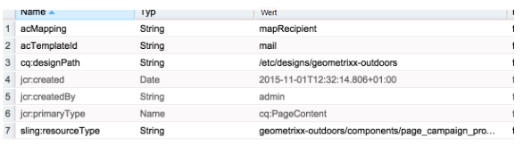

# Erstellen benutzerdefinierter AEM-Seitenvorlagen mit Adobe Campaign-Formularkomponenten{#creating-custom-aem-page-template-with-adobe-campaign-form-components}

Auf dieser Seite wird erläutert, wie Sie eine benutzerdefinierte Seitenvorlage erstellen, die [Adobe Campaign Form](/help/sites-authoring/adobe-campaign-components.md)-Komponenten verwendet, indem Sie untersuchen, wie die Geometrixx-Outdoors-Vorlage ( `/apps/geometrixx-outdoors/components/page_campaign_profile`) implementiert ist, und Sie auf wichtige Informationen verweisen, die Sie beim Erstellen Ihrer eigenen benutzerdefinierten Vorlage benötigen.

>[!NOTE]
>
>[E-Mail- und Formularbeispiele sind nur in Geometrixx verfügbar](/help/sites-developing/we-retail.md). Laden Sie Geometrixx-Beispielinhalt von Package Share herunter.

Um eine benutzerdefinierte AEM-Seitenvorlage mit Adobe Campaign-Formularkomponenten zu erstellen, müssen Sie sicherstellen, dass Sie über Folgendes verfügen:

1. **Die richtige resourceSuperType-Klasse**

   Stellen Sie sicher, dass die Seitenkomponente von `mcm/campaign/components/profile` erbt.

   Dies ist erforderlich, damit die Servlets Informationen abrufen und speichern können

   * `com.day.cq.mcm.campaign.servlets.TemplateListServlet`
   * `com.day.cq.mcm.campaign.servlets.SaveProfileServlet`

   

1. **ClientContext-Einstellungen**

   Wenn Sie sich die clientcontext-Einstellungen ( `/etc/designs/geometrixx-outdoors/jcr:content/page_campaign_profile`) ansehen, sehen Sie die folgenden Einstellungen:

   * ClientContext verweist auf `/etc/clientcontext/campaign`
   * Es ist außerdem ein zusätzlicher Knoten *config* vorhanden.

   

1. **head.jsp (/apps/geometrixx-outdoors/components/page_campaign_profile/head.jsp)**

   **head.jsp** enthält die folgenden Zeilen, die **clientcontext-config** und **cloudservice-hook** verwenden:

   ```
   <cq:include path="config" resourceType="cq/personalization/components/clientcontext_optimized/config"/>
   <sling:include path="contexthub" resourceType="granite/contexthub/components/contexthub"/>
   <cq:include script="/libs/cq/cloudserviceconfigs/components/servicelibs/servicelibs.jsp"/>
   ```

1. **body.jsp (/apps/geometrixx-outdoors/components/page_campaign_profile/body.jsp)**

   Unter **body.jsp** werden die Cloud-Dienste unten auf der Seite geladen:

   ```
   <cq:include path="cloudservices" resourceType="cq/cloudserviceconfigs/components/servicecomponents"/>
   ```

1. **Kampagnenseiteneigenschaften**

   Um eine Adobe Campaign-Vorlage auswählen zu können, müssen die Seiteneigenschaften um die Registerkarte **Kampagne** erweitert werden:

   `/apps/geometrixx-outdoors/components/page_campaign_profile/dialog/items/tabs/items/campaign`

   

1. **Vorlageneinstellungen**.

   In der Vorlage ( `/apps/geometrixx-outdoors/templates/campaign_profile/jcr:content`) sehen Sie die folgenden Standardwerte:

   | **acMapping** | mapRecipient (für Adobe Campaign 6.1), profile (für Adobe Campaign Standard) |
   |---|---|
   | **acTemplateId** | mail |

   
