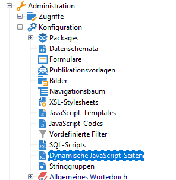
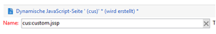
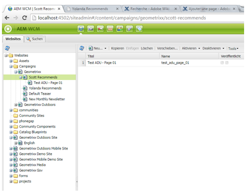

# Erstellen benutzerspezifischer Erweiterungen{#creating-custom-extensions}

Im Allgemeinen verwenden Sie beim Implementieren eines Projekts benutzerdefinierten Code in AEM und Adobe Campaign. Mit der vorhandenen API können Sie Ihren benutzerdefinierten Code in Adobe Campaign aus AEM oder aus AEM nach Adobe Campaign aufrufen. In diesem Dokument wird beschrieben, wie Sie dies durchführen.

## Voraussetzungen {#prerequisites}

Sie müssen Folgendes installiert haben:

* Adobe Experience Manager
* Adobe Campaign 6.1

Weitere Informationen finden Sie unter [Integrieren von AEM mit Adobe Campaign 6.1](/help/sites-administering/campaignonpremise.md).

## Beispiel 1: AEM nach Adobe Campaign {#example-aem-to-adobe-campaign}

Die Standardintegration zwischen AEM und Campaign basiert auf JSON und JSSP (JavaScript Server Page). Diese JSSP-Dateien befinden sich in der Campaign-Konsole und beginnen alle mit **aec** (Adobe Experience Cloud).



>[!NOTE]
>
>[Für dieses Beispiel verwenden Sie Geometrixx](/help/sites-developing/we-retail.md), das bei Package Share erhältlich ist.

In diesem Beispiel wurde eine neue benutzerdefinierte JSSP-Datei erstellt und diese von der AEM-Seite aus aufgerufen, um das Ergebnis abzurufen. So können Sie beispielsweise Daten von Adobe Campaign abrufen oder Daten in Adobe Campaign speichern.

1. Um in Adobe Campaign eine JSSP-Datei zu erstellen, klicken Sie auf das Symbol **Neu**.

   

1. Geben Sie den Namen dieser JSSP-Datei ein. In diesem Beispiel wird **cus:custom.jssp** verwendet (d. h. es liegt im Namespace **cus**).

   

1. Fügen Sie den folgenden Code in die jssp-Datei ein:

   ```
   <%
   var origin = request.getParameter("origin");
   document.write("Hello from Adobe Campaign, origin : " + origin);
   %>
   ```

1. Speichern Sie Ihre Arbeit. Die verbleibende Arbeit erfolgt in AEM.
1. Erstellen Sie ein einfaches Servlet in AEM, damit Sie dieses JSSP aufrufen können. In diesem Beispiel können Sie von Folgendem ausgehen:

   * Sie haben die Verbindung zwischen AEM und Campaign hergestellt
   * Der Campaign-Cloud-Service ist auf **/content/geometrixx-outdoor** konfiguriert

   Das wichtigste Objekt in diesem Beispiel ist **GenericCampaignConnector**, welches es Ihnen erlaubt, jssp-Dateien in Adobe Campaign aufzurufen (GET und POST).

   Im Folgenden finden Sie ein kleines Code-Snippet:

   ```
   @Reference
   private GenericCampaignConnector campaignConnector;
   ...
   Map<String, String> params = new HashMap<String, String>();
   params.put("origin", "AEM");
   CallResults results = campaignConnector.callGeneric("/jssp/cus/custom.jssp", params, credentials);
   return results.bodyAsString();
   ```

1. In diesem Beispiel müssen Sie die Anmeldeinformationen an den Aufruf übergeben. Sie können sie über die Methode „getCredentials()“ abrufen, bei der Sie eine Seite übergeben, auf der der Campaign-Cloud-Service konfiguriert ist.

   ```xml
   // page containing the cloudservice for Adobe Campaign
   Configuration config = campaignConnector.getWebserviceConfig(page.getContentResource().getParent());
   CampaignCredentials credentials = campaignConnector.retrieveCredentials(config);
   ```

Der vollständige Code lautet wie folgt:

```java
import java.io.IOException;
import java.io.PrintWriter;
import java.util.HashMap;
import java.util.Map;

import javax.servlet.ServletException;

import org.apache.felix.scr.annotations.Reference;
import org.apache.felix.scr.annotations.sling.SlingServlet;
import org.apache.sling.api.SlingHttpServletRequest;
import org.apache.sling.api.SlingHttpServletResponse;
import org.apache.sling.api.servlets.SlingSafeMethodsServlet;
import org.slf4j.Logger;
import org.slf4j.LoggerFactory;

import com.day.cq.mcm.campaign.CallResults;
import com.day.cq.mcm.campaign.CampaignCredentials;
import com.day.cq.mcm.campaign.GenericCampaignConnector;
import com.day.cq.wcm.api.Page;
import com.day.cq.wcm.api.PageManager;
import com.day.cq.wcm.api.PageManagerFactory;
import com.day.cq.wcm.webservicesupport.Configuration;

@SlingServlet(paths="/bin/campaign", methods="GET")
public class CustomServlet extends SlingSafeMethodsServlet {

 private final Logger log = LoggerFactory.getLogger(this.getClass());

 @Reference
 private GenericCampaignConnector campaignConnector;

 @Reference
 private PageManagerFactory pageManagerFactory;

 @Override
 protected void doGet(SlingHttpServletRequest request,
   SlingHttpServletResponse response) throws ServletException,
   IOException {

  PageManager pm = pageManagerFactory.getPageManager(request.getResourceResolver());

  Page page = pm.getPage("/content/geometrixx-outdoors");

  String result = null;
  if ( page != null) {
   result = callCustomFunction(page);
  }
  if ( result != null ) {
   PrintWriter pw = response.getWriter();
   pw.print(result);
  }
 }

 private String callCustomFunction(Page page ) {
  try {
   Configuration config = campaignConnector.getWebserviceConfig(page.getContentResource().getParent());
   CampaignCredentials credentials = campaignConnector.retrieveCredentials(config);

   Map<String, String> params = new HashMap<String, String>();
   params.put("origin", "AEM");
   CallResults results = campaignConnector.callGeneric("/jssp/cus/custom.jssp", params, credentials);
   return results.bodyAsString();
  } catch (Exception e ) {
   log.error("Something went wrong during the connection", e);
  }
  return null;

 }

}
```

## Beispiel 2: Adobe Campaign nach AEM {#example-adobe-campaign-to-aem}

AEM bietet vordefinierte APIs zum Abrufen der Objekte, die überall in der siteadmin-Explorer-Ansicht verfügbar sind.



>[!NOTE]
>
>[Für dieses Beispiel verwenden Sie Geometrixx](/help/sites-developing/we-retail.md), das bei Package Share erhältlich ist.

Für jeden Knoten im Explorer gibt es eine API, die damit verknüpft ist. Beispielsweise für den Knoten:

* [http://localhost:4502/siteadmin#/content/campaigns/geometrixx/scott-recommends](http://localhost:4502/siteadmin#/content/campaigns/geometrixx/scott-recommends)

Die API lautet:

* [http://localhost:4502/content/campaigns/geometrixx/scott-recommends.1.json](http://localhost:4502/content/campaigns/geometrixx/scott-recommends.2.json)

Das Ende der URL **.1.json** kann durch **.2.json**, **.3.json** ersetzt werden, je nach der Anzahl der Unterebenen, die Sie erhalten möchten. Um alle Suchbegriffe abzurufen, kann das Schlüsselwort **infinity** verwendet werden:

* [http://localhost:4502/content/campaigns/geometrixx/scott-recommends.infinity.json](http://localhost:4502/content/campaigns/geometrixx/scott-recommends.2.json)

Um die API zu nutzen, verwendet AEM die Standardauthentifizierung.

Eine JS-Bibliothek mit dem Namen **amcIntegration.js** ist in 6.1.1 (Build 8624 und höher) verfügbar und implementiert diese Logik unter mehreren anderen.

### AEM-API-Aufruf {#aem-api-call}

```java
loadLibrary("nms:amcIntegration.js");

var cmsAccountId = sqlGetInt("select iExtAccountId from NmsExtAccount where sName=$(sz)","aemInstance")
var cmsAccount = nms.extAccount.load(String(cmsAccountId));
var cmsServer = cmsAccount.server;

var request = new HttpClientRequest(cmsServer+"/content/campaigns/geometrixx.infinity.json")
aemAddBasicAuthentication(cmsAccount, request);
request.method = "GET"
request.header["Content-Type"] = "application/json; charset=UTF-8";
request.execute();
var response = request.response;
```
