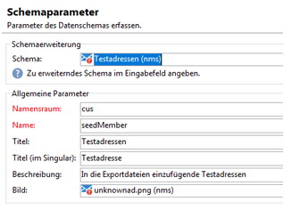
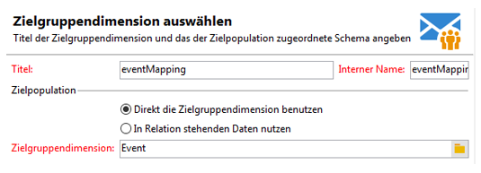
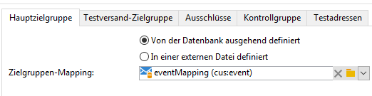
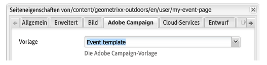
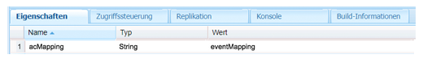
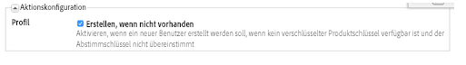
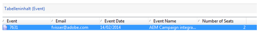

# Erstellen benutzerdefinierter Formularzuordnungen{#creating-custom-form-mappings}

Bei der Erstellung einer benutzerdefinierten Tabelle in Adobe Campaign ist es u. U. ratsam, in AEM ein Formular zu erstellen, das dieser benutzerdefinierten Tabelle zugeordnet wird.

In diesem Dokument wird beschrieben, wie Sie benutzerdefinierte Formularzuordnungen erstellen. Indem Sie die Schritte in diesem Dokument abschließen, stellen Sie Ihren Benutzern eine Ereignisseite zur Verfügung, auf der sie sich selbst für anstehende Ereignisse registrieren können. Diese Benutzer kontaktieren Sie dann nachfolgend via Adobe Campaign.

## Voraussetzungen {#prerequisites}

Sie müssen Folgendes installiert haben:

* Adobe Experience Manager
* Adobe Campaign Classic

Weitere Informationen finden Sie unter [AEM mit Adobe Campaign Classic integrieren](/help/sites-administering/campaignonpremise.md) .

## Erstellen benutzerdefinierter Formularzuordnungen {#creating-custom-form-mappings-2}

Zur Erstellung benutzerdefinierter Formularzuordnungen führen Sie die folgenden Schritte aus, die in den folgenden Abschnitten genauer beschrieben werden:

1. Benutzerdefinierte Tabelle erstellen
1. **Seed**-Tabelle erweitern
1. Benutzerdefinierte Zuordnung erstellen
1. Auf der benutzerdefinierten Zuordnung basierende Bereitstellung erstellen
1. Das Formular, das die erstellte Bereitstellung verwendet, in AEM erstellen
1. Das Formular zum Testen übermitteln

### Erstellen der benutzerdefinierten Tabelle in Adobe Campaign  {#creating-the-custom-table-in-adobe-campaign}

Beginner Sie mit der Erstellung einer benutzerdefinierten Tabelle in Adobe Campaign. In diesem Beispiel verwenden wir die folgende Definition, um eine Ereignistabelle zu erstellen:

```xml
<element autopk="true" label="Event" labelSingular="Event" name="event">
 <attribute label="Event Date" name="eventdate" type="date"/>
 <attribute label="Event Name" name="eventname" type="string"/>
 <attribute label="Email" name="email" type="string"/>
 <attribute label="Number of Seats" name="seats" type="long"/>
</element>
```

Führen Sie nach der Erstellung der Ereignistabelle den **Assistenten zur Aktualisierung der Datenbankstruktur** aus, um die Tabelle zu erstellen.

### Erweitern der Seed-Tabelle  {#extending-the-seed-table}

Klicken/tippen Sie in Adobe Campaign auf **Hinzufügen**, um eine neue Erweiterung für die Tabelle **Seed-Adressen (nms)** hinzuzufügen.



Verwenden Sie nun die Felder aus der Tabelle **event** , um die Tabelle **seed** zu erweitern:

```xml
<element label="Event" name="custom_cus_event">
 <attribute name="eventname" template="cus:event:event/@eventname"/>
 <attribute name="eventdate" template="cus:event:event/@eventdate"/>
 <attribute name="email" template="cus:event:event/@email"/>
 <attribute name="seats" template="cus:event:event/@seats"/>
 </element>
```

Führen Sie danach den **Assistenten zur Aktualisierung der Datenbank** aus, um die Änderungen zu übernehmen.

### Erstellen einer benutzerdefinierten Zielzuordnung  {#creating-custom-target-mapping}

Wechseln Sie unter **Administration/Kampagnenverwaltung** zu **Zielzuordnungen** und fügen Sie eine neue **Zielzuordnung** hinzu.

>[!NOTE]
>
>Verwenden Sie einen aussagekräftigen **internen Namen**.



### Erstellen einer benutzerdefinierten Bereitstellungsvorlage {#creating-a-custom-delivery-template}

In diesem Schritt fügen Sie eine Bereitstellungsvorlage hinzu, die die erstellte **Zielzuordnung** verwendet.

Wechseln Sie unter **Ressourcen/Vorlagen** zur Bereitstellungsvorlage und duplizieren Sie die bestehende AEM-Bereitstellung. Wenn Sie auf **Bis** klicken, wählen Sie die **Zielzuordnung** für „Ereignis erstellen“ aus.



### Erstellen des Formulars in AEM {#building-the-form-in-aem}

Vergewissern Sie sich, dass Sie in AEM unter **Seiteneigenschaften** einen Cloud-Service konfiguriert haben.

Wählen Sie dann auf der Registerkarte **Adobe Campaign** die Bereitstellung aus, die im Schritt [Erstellen einer benutzerdefinierten Bereitstellungsvorlage](#creating-a-custom-delivery-template) erstellt wurde.



Geben Sie bei der Konfiguration der Felder eindeutige Elementnamen für die Formularfelder an.

Nach der Konfiguration der Felder müssen Sie die Zuordnung manuell ändern.

Wechseln Sie in CRXDE Lite zum Knoten **jcr:content** der Seite und legen Sie als Wert von **acMapping** den internen Namen der **Zielzuordnung** fest.



Aktivieren Sie bei der Konfiguration des Formulars das Kontrollkästchen „Erstellen, wenn nicht vorhanden“.



### Übermitteln des Formulars {#submitting-the-form}

Sie können das Formular nun übermitteln, um in Adobe Campaign zu überprüfen, ob die Werte gespeichert wurden.



## Fehlerbehebung {#troubleshooting}

**&quot;Invalid type for value &#39;02/02/2015&#39; from element &#39;@eventdate&#39; (document of type &#39;Event ([adb:event])&#39;)&quot;**

Beim Übermitteln des Formulars wird dieser Fehler in der Datei **error.log** von AEM protokolliert.

Dies ist auf ein ungültiges Format für das Datumsfeld zurückzuführen. Die Lösung besteht darin, einen Wert im Format **JJJJ-MM-TT** anzugeben.
