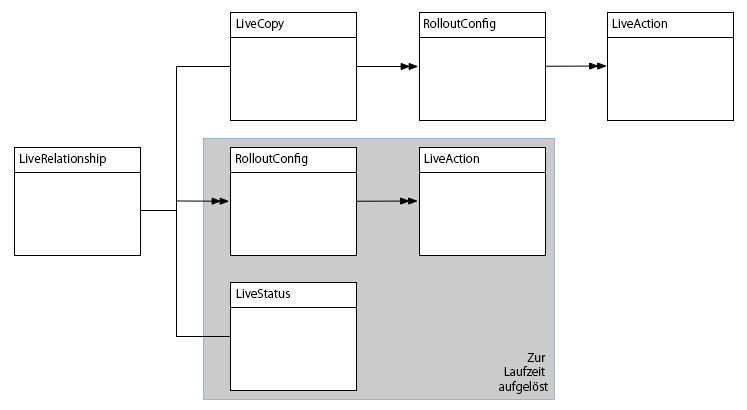
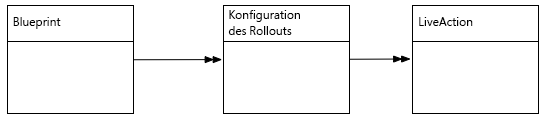
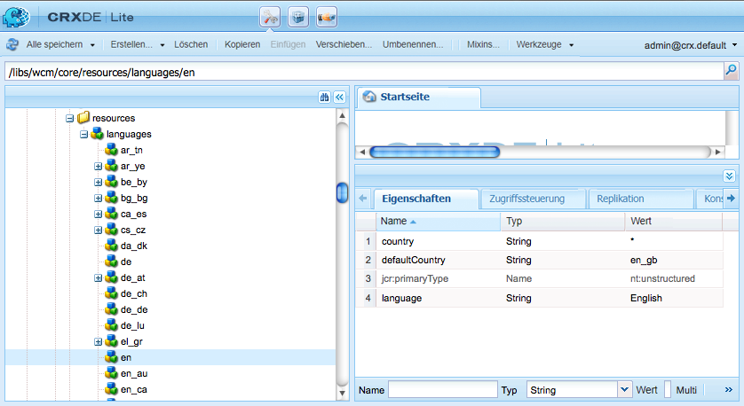

# Erweitern des Multi-Site-Managers{#extending-the-multi-site-manager}

Auf dieser Seite erfahren Sie, wie Sie die Funktionen des Multi-Site-Managers erweitern können:

* Erfahren Sie mehr über die wichtigsten MSM-Java-APIs.
* Erstellen Sie eine neue Synchronisierungsaktion, die in einer Rollout-Konfiguration verwendet werden kann.
* Ändern Sie die Standardsprache und die Ländercodes.

<!-- * Remove the "Chapters" step in the Create Site wizard. -->

>[!NOTE]
>
>Wir empfehlen, diese Seite in Verbindung mit [Wiederverwenden von Inhalten: Multi Site Manager](/help/sites-administering/msm.md).
>
>Die folgenden Abschnitte der Site-Repository-Umstrukturierung in AEM 6.4 könnten ebenfalls von Interesse sein:
>* [Blueprint-Konfigurationen für den Multi-Site-Manager](https://docs.adobe.com/content/help/en/experience-manager-64/deploying/restructuring/sites-repository-restructuring-in-aem-6-4.html#multi-site-manager-blueprint-configurations)
>* [Rollout-Konfigurationen für den Multi-Site-Manager](https://docs.adobe.com/content/help/en/experience-manager-64/deploying/restructuring/sites-repository-restructuring-in-aem-6-4.html#multi-site-manager-rollout-configurations)


>[!CAUTION]
>
>Multi Site Manager und die dazugehörige API werden beim Erstellen einer Website verwendet und sind daher ausschließlich für die Nutzung in einer Autorenumgebung gedacht.

## Überblick über die Java-API {#overview-of-the-java-api}

Multi Site Manager umfasst die folgenden Pakete:

* [com.day.cq.wcm.msm.api](https://helpx.adobe.com/experience-manager/6-5/sites/developing/using/reference-materials/javadoc/com/day/cq/wcm/msm/api/package-frame.html)
* [com.day.cq.wcm.msm.commons](https://helpx.adobe.com/experience-manager/6-5/sites/developing/using/reference-materials/javadoc/com/day/cq/wcm/msm/commons/package-frame.html)

Die wichtigsten MSM-API-Objekte interagieren wie folgt (siehe auch: [Verwendete Begriffe](/help/sites-administering/msm.md#terms-used)):



* **`Blueprint`**

   Ein `Blueprint` (wie in [Blueprint-Konfiguration](/help/sites-administering/msm.md#source-blueprints-and-blueprint-configurations)) gibt die Seiten an, von denen eine Live-Kopie Inhalte übernehmen kann.

   

   * Die Verwendung einer Blueprint-Konfiguration (`Blueprint`) ist optional, aber sie:

      * Ermöglicht dem Autor, die Option **Rollout** in der Quelle zu verwenden (um (explizit) Änderungen an Live-Kopien zu übertragen, die von dieser Quelle erben).
      * ermöglicht es dem Autor, **Site erstellen** zu nutzen, wodurch der Benutzer einfach Sprachen auswählen und die Struktur der Live Copy konfigurieren kann
      * definiert die standardmäßige Rollout-Konfiguration für alle entstehenden Live Copies.

* **`LiveRelationship`** Die `LiveRelationship` legt die Verbindung (Beziehung) zwischen einer Ressource im Live Copy-Zweig und der entsprechenden Quelle/Blueprint-Ressource fest.

   * Die Beziehungen werden bei der Umsetzung der Vererbung und des Rollouts genutzt.
   * `LiveRelationship` -Objekte Zugriff (Verweise) auf die Rollout-Konfigurationen (  `RolloutConfig`)  `LiveCopy`und  `LiveStatus` Objekte im Zusammenhang mit der Beziehung bieten.

   * Beispiel: Eine Live-Kopie wird in `/content/copy/us` aus der Quelle/Vorlage unter `/content/we-retail/language-masters` erstellt. Die Ressourcen `/content/we.retail/language-masters/en/jcr:content` und `/content/copy/us/en/jcr:content` bilden eine Beziehung.

* **`LiveCopy`** `LiveCopy` enthält die Konfigurationsdetails für die Beziehungen (  `LiveRelationship`) zwischen den Live-Kopierressourcen und ihren Quell-/Blaupausenressourcen.

   * Verwenden Sie die `LiveCopy`-Klasse, um auf den Pfad der Seite, den Pfad der Quell-/Blueprint-Seite, die Rollout-Konfigurationen und ob untergeordnete Seiten auch in `LiveCopy` enthalten sind.

   * Ein `LiveCopy`-Knoten wird jedes Mal erstellt, wenn **Site erstellen** oder **Live Copy erstellen** verwendet wird.

* **`LiveStatus`**

   `LiveStatus`-Objekte bieten Zugriff auf den Laufzeitstatus einer `LiveRelationship`. Sie können damit den Synchronisierungsstatus einer Live Copy abfragen.

* **`LiveAction`**

   Eine `LiveAction` ist eine Aktion, die auf jeder Ressource, die am Rollout beteiligt ist, ausgeführt wird.

   * LiveActions werden nur von RolloutConfigs erzeugt.

* **`LiveActionFactory`**

   Erstellt `LiveAction`-Objekte mit einer `LiveAction`-Konfiguration. Konfigurationen werden als Ressourcen im Repository gespeichert.

* **`RolloutConfig`** Die  `RolloutConfig` Liste ist bei Auslösung  `LiveActions`zu verwenden. Das `LiveCopy` übernimmt das `RolloutConfig` und das Ergebnis ist im `LiveRelationship` vorhanden.

   * Beim erstmaligen Einrichten einer Live Copy wird ebenfalls eine RolloutConfig genutzt (die die LiveActions auslöst).

## Erstellen einer neuen Synchronisierungsaktion  {#creating-a-new-synchronization-action}

Erstellen Sie benutzerdefinierte Synchronisierungsaktionen für die Nutzung mit Ihren Rollout-Konfigurationen. Wenn die [installierten Aktionen](/help/sites-administering/msm-sync.md#installed-synchronization-actions) Ihre spezifischen Anwendungsanforderungen nicht erfüllen, können Sie eine Synchronisierungsaktion erstellen. Hierfür erstellen Sie zwei Klassen:

* Eine Implementierung der [ `com.day.cq.wcm.msm.api.LiveAction`](https://helpx.adobe.com/experience-manager/6-5/sites/developing/using/reference-materials/javadoc/com/day/cq/wcm/msm/api/LiveAction.html)-Schnittstelle, die die Aktion ausführt.
* eine OSGi-Komponente, die die Schnittstelle [`com.day.cq.wcm.msm.api.LiveActionFactory`](https://helpx.adobe.com/experience-manager/6-5/sites/developing/using/reference-materials/javadoc/com/day/cq/wcm/msm/api/LiveActionFactory.html) implementiert und Instanzen der Klasse `LiveAction` erstellt.

`LiveActionFactory` erstellt Instanzen der `LiveAction`-Klasse für eine bestimmte Konfiguration:

* `LiveAction`-Klassen umfassen die folgenden Methoden:

   * `getName`: Gibt den Namen der Aktion zurück. Mit diesem Namen wird auf die Aktion verwiesen, z. B. in Rollout-Konfigurationen.
   * `execute`: Führt die Aufgabe der Aktion aus.

* `LiveActionFactory`-Klassen umfassen die folgenden Mitglieder:

   * `LIVE_ACTION_NAME`: Ein Feld, das den Namen der zugehörigen Variablen enthält  `LiveAction`. Dieser Name muss mit dem Wert übereinstimmen, der von der Methode `getName` der Klasse `LiveAction` zurückgegeben wird.

   * `createAction`: Erstellt eine Instanz der  `LiveAction`. Der optionale Parameter `Resource` kann verwendet werden, um Konfigurationsdaten bereitzustellen.

   * `createsAction`: Gibt den Namen der verknüpften Variablen zurück  `LiveAction`.

### Zugreifen auf den LiveAction-Konfigurationsknoten {#accessing-the-liveaction-configuration-node}

Mit dem `LiveAction`-Konfigurationsknoten im Repository können Sie Daten speichern, die das Laufzeitverhalten der `LiveAction`-Instanz beeinflussen. Der Knoten im Repository, in dem die `LiveAction`-Konfiguration gespeichert ist, steht dem `LiveActionFactory`-Objekt zur Laufzeit zur Verfügung. Somit können Sie Eigenschaften zum Konfigurationsknoten hinzufügen und sie bei Bedarf in Ihrer `LiveActionFactory`-Implementierung nutzen.

Beispielsweise muss eine `LiveAction` den Namen eines Blueprint-Autors speichern. Eine Eigenschaft des Konfigurationsknotens umfasst den Eigenschaftsnamen der Blueprint-Seite, in der die Informationen gespeichert werden. Zur Laufzeit ruft die `LiveAction` den Eigenschaftsnamen von der Konfiguration ab und erhält dann den Eigenschaftswert.

Der Parameter der ` [LiveActionFactory](https://helpx.adobe.com/experience-manager/6-5/sites/developing/using/reference-materials/javadoc/com/day/cq/wcm/msm/api/LiveActionFactory.html).createAction`-Methode ist ein `Resource`-Objekt. Dieses `Resource`-Objekt repräsentiert den Knoten `cq:LiveSyncAction` für diese Live-Aktion in der Rollout-Konfiguration; siehe: [Erstellen einer Rollout-Konfiguration](/help/sites-administering/msm-sync.md#creating-a-rollout-configuration). Wie bei Konfigurationsknoten gewohnt, sollten Sie ihn an ein `ValueMap`-Objekt anpassen:

```java
public LiveAction createAction(Resource resource) throws WCMException {
        ValueMap config;
        if (resource == null || resource.adaptTo(ValueMap.class) == null) {
            config = new ValueMapDecorator(Collections.<String, Object>emptyMap());
        } else {
            config = resource.adaptTo(ValueMap.class);
        }
        return new MyLiveAction(config, this);
}
```

### Zugreifen auf Zielknoten, Quellknoten und die LiveRelationship {#accessing-target-nodes-source-nodes-and-the-liverelationship}

Die folgenden Objekte sind als Parameter der `execute`-Methode vom `LiveAction`-Objekt verfügbar:

* ein [`Resource`-Objekt, das die Quelle der Live Copy repräsentiert](https://helpx.adobe.com/experience-manager/6-5/sites/developing/using/reference-materials/javadoc/org/apache/sling/api/resource/Resource.html)
* ein `Resource`-Objekt, das das Ziel der Live Copy repräsentiert
* das [`LiveRelationship`-Objekt für die Live Copy](https://helpx.adobe.com/experience-manager/6-5/sites/developing/using/reference-materials/javadoc/com/day/cq/wcm/msm/api/LiveRelationship.html)
* Der Wert `autoSave` gibt an, ob die `LiveAction` am Repository vorgenommene Änderungen speichern soll.

* Der Wert für das Zurücksetzen legt den Rollout-Modus für das Zurücksetzen fest.

Über diese Objekte können Sie alle Daten zur `LiveCopy` abrufen. Sie können auch die Objekte `Resource` verwenden, um die Objekte `ResourceResolver`, `Session` und `Node` abzurufen. Diese Objekte sind bei der Bearbeitung der Repository-Inhalte hilfreich:

In der ersten Zeile des folgenden Codes ist das `Resource`-Objekt der Quellseite die Quelle:

```java
ResourceResolver resolver = source.getResourceResolver();
Session session = resolver.adaptTo(javax.jcr.Session.class);
Node sourcenode = source.adaptTo(javax.jcr.Node.class);
```

>[!NOTE]
>
>Die `Resource`-Argumente können `null`- oder `Resources`-Objekte sein, die sich nicht an `Node`-Objekte anpassen, z. B. [ `NonExistingResource`](https://helpx.adobe.com/experience-manager/6-5/sites/developing/using/reference-materials/javadoc/org/apache/sling/api/resource/NonExistingResource.html)-Objekte.

## Erstellen einer neuen Rollout-Konfiguration {#creating-a-new-rollout-configuration}

Erstellen Sie eine Rollout-Konfiguration, wenn die installierten Rollout-Konfigurationen Ihre Anwendungsanforderungen nicht erfüllen:

* [Erstellen Sie die Rollout-Konfiguration](#create-the-rollout-configuration).
* [Fügen Sie Synchronisierungsaktionen zur Rollout-Konfiguration hinzu](#add-synchronization-actions-to-the-rollout-configuration).

Die neue Rollout-Konfiguration steht dann zur Verfügung, wenn Sie die Rollout-Konfigurationen auf einem Blueprint oder einer Live Copy-Seite festlegen.

>[!NOTE]
>
>Informationen hierzu finden Sie auch unter [Best Practices zum Anpassen von Rollouts](/help/sites-administering/msm-best-practices.md#customizing-rollouts).

### Erstellen der Rollout-Konfiguration  {#create-the-rollout-configuration}

So erstellen Sie eine neue Rollout-Konfiguration:

1. Offene CRXDE Lite; Beispiel:
   [http://localhost:4502/crx/de](http://localhost:4502/crx/de)

1. Navigieren Sie zu :
   `/apps/msm/<your-project>/rolloutconfigs`

   >[!NOTE]
   >Dies ist die benutzerdefinierte Version Ihres Projekts von:
   >`/libs/msm/wcm/rolloutconfigs`
   >Muss erstellt werden, wenn dies Ihre erste Konfiguration ist.

   >[!NOTE]
   >
   >Sie dürfen keinerlei Änderungen im Pfad /libs vornehmen.
   >Denn der Inhalt von /libs wird überschrieben, wenn Sie die Instanz das nächste Mal aktualisieren. (Außerdem kann der Inhalt auch durch Anwenden von Hotfixes oder Feature Packs überschrieben werden.)
   >Die empfohlene Methode zur Konfiguration und für andere Änderungen sieht wie folgt aus:
   >* Erstellen Sie das erforderliche Element neu (d. h. wie es in /libs aussieht) unter /apps.
   >* Nehmen Sie die gewünschten Änderungen in /apps vor.


1. Unter diesem **Erstellen** einen Knoten mit den folgenden Eigenschaften:

   * **Name**: Der Knotenname der Rollout-Konfiguration. md#installed-synchronization-actions), z. B. `contentCopy` oder `workflow`.
   * **Typ**: `cq:RolloutConfig`

1. Fügen Sie diesem Knoten die folgenden Eigenschaften hinzu:
   * **Name**: `jcr:title`

      **Typ**: `String`
      **Wert**: Ein Identifizierungstitel, der in der Benutzeroberfläche angezeigt wird.
   * **Name**:  `jcr:description`

      **Typ**: `String`
      **Wert**: Eine optionale Beschreibung.
   * **Name**:  `cq:trigger`

      **Typ**: `String`
      **Wert**: Der  [Rollout-](/help/sites-administering/msm-sync.md#rollout-triggers) Auslöser wird verwendet. Die folgenden Optionen stehen zur Auswahl:
      * `rollout`
      * `modification`
      * `publish`
      * `deactivate`

1. Klicken Sie auf **Alle speichern**.

### Hinzufügen von Synchronisierungsaktionen zur Rollout-Konfiguration {#add-synchronization-actions-to-the-rollout-configuration}

Rollout-Konfigurationen werden unter dem [Rollout-Konfigurationsknoten](#create-the-rollout-configuration) gespeichert, den Sie unter dem Knoten `/apps/msm/<your-project>/rolloutconfigs` erstellt haben.

hinzufügen untergeordneten Knoten des Typs `cq:LiveSyncAction`, um der Rollout-Konfiguration Synchronisierungsaktionen hinzuzufügen. Die Reihenfolge der Synchronisierungsaktionsknoten bestimmt die Reihenfolge, in der die Aktionen durchgeführt werden.

1. Wählen Sie noch in der CRXDE Lite den Knoten [Rollout-Konfiguration](#create-the-rollout-configuration) aus.

   Beispiel:
   `/apps/msm/myproject/rolloutconfigs/myrolloutconfig`

1. **Erstellen** Sie einen Knoten mit den folgenden Knoteneigenschaften:

   * **Name**: Der Knotenname der Synchronisierungsaktion.
Der Name muss mit dem Namen **Aktion** in der Tabelle unter [Synchronisierungsaktionen](/help/sites-administering/msm-sync.md#installed-synchronization-actions) übereinstimmen, z. B. `contentCopy` oder `workflow`.
   * **Typ**: `cq:LiveSyncAction`

1. Fügen Sie so viele Synchronisierungsaktionsknoten hinzu wie erforderlich. Ordnen Sie die Aktionen so an, dass sie die Reihenfolge aufweisen, in der sie ausgeführt werden sollen. Der oberste Aktionsknoten wird zuerst ausgeführt.

## Erstellen und Verwenden einer einfachen LiveActionFactory-Klasse {#creating-and-using-a-simple-liveactionfactory-class}

Mit den Verfahren, die in diesem Abschnitt erläutert werden, können Sie eine `LiveActionFactory` entwickeln und in einer Rollout-Konfiguration verwenden. Für die Entwicklung und Bereitstellung der `LiveActionFactory` werden Maven und Eclipse verwendet:

1. [Erstellen Sie das Maven-Projekt](#create-the-maven-project) und importieren Sie es in Eclipse.
1. [Fügen Sie Abhängigkeiten](#add-dependencies-to-the-pom-file) zur POM-Datei hinzu.
1. [Implementieren Sie die `LiveActionFactory`-Schnittstelle](#implement-liveactionfactory) und stellen Sie das OSGi-Bundle bereit.
1. [Erstellen Sie die Rollout-Konfiguration](#create-the-example-rollout-configuration).
1. [Erstellen Sie die Live Copy](#create-the-live-copy).

Das Maven-Projekt und der Quellcode der Java-Klasse sind im öffentlichen Git-Repository verfügbar.

CODE AUF GITHUB

Den Code dieser Seite finden Sie auf GitHub.

* [Open experiencemanager-java-msmrollout project on GitHub](https://github.com/Adobe-Marketing-Cloud/experiencemanager-java-msmrollout)
* Laden Sie das Projekt als [ZIP-Datei](https://github.com/Adobe-Marketing-Cloud/experiencemanager-java-msmrollout/archive/master.zip) herunter.

### Erstellen des Maven-Projekts {#create-the-maven-project}

Das folgende Verfahren setzt voraus, dass Sie das adobe-public-Profil zu Ihrer Maven-Einstellungsdatei hinzugefügt haben.

* Weitere Informationen zum adobe-public-Profil finden Sie unter [Beschaffen des Inhaltspaket-Maven-Plug-ins](/help/sites-developing/vlt-mavenplugin.md#obtaining-the-content-package-maven-plugin).
* Weitere Informationen zur Maven-Einstellungsdatei finden Sie in der [Referenz zu den Einstellungen](https://maven.apache.org/settings.html) für Maven.

1. Öffnen Sie eine Terminal- oder Befehlszeilensitzung und ändern Sie das Verzeichnis in den Ort, an dem Sie das Projekt erstellen möchten.
1. Geben Sie den folgenden Befehl ein:

   ```xml
   mvn archetype:generate -DarchetypeGroupId=com.day.jcr.vault -DarchetypeArtifactId=multimodule-content-package-archetype -DarchetypeVersion=1.0.0 -DarchetypeRepository=adobe-public-releases
   ```

1. Legen Sie auf interaktive Aufforderung die folgenden Werte fest:

   * `groupId`: `com.adobe.example.msm`
   * `artifactId`:  `MyLiveActionFactory`
   * `version`:  `1.0-SNAPSHOT`
   * `package`:  `MyPackage`
   * `appsFolderName`:  `myapp`
   * `artifactName`:  `MyLiveActionFactory package`
   * `packageGroup`:  `myPackages`

1. Starten Sie Eclipse und [importieren Sie das Maven-Projekt](/help/sites-developing/howto-projects-eclipse.md#import-the-maven-project-into-eclipse).

### Hinzufügen von Abhängigkeiten zur POM-Datei  {#add-dependencies-to-the-pom-file}

Fügen Sie Abhängigkeiten hinzu, damit der Eclipse-Compiler auf die Klassen verweisen kann, die im `LiveActionFactory`-Code verwendet werden.

1. Wählen Sie im Eclipse-Projekt-Explorer folgende Datei aus:

   `MyLiveActionFactory/pom.xml`

1. Klicken Sie im Editor auf die Registerkarte `pom.xml` und suchen Sie den Abschnitt `project/dependencyManagement/dependencies`.
1. Fügen Sie den folgenden XML-Code zum Element `dependencyManagement` hinzu und speichern Sie dann die Datei.

   ```xml
    <dependency>
     <groupId>com.day.cq.wcm</groupId>
     <artifactId>cq-msm-api</artifactId>
     <version>5.6.2</version>
     <scope>provided</scope>
    </dependency>
    <dependency>
     <groupId>org.apache.sling</groupId>
     <artifactId>org.apache.sling.api</artifactId>
     <version>2.4.3-R1488084</version>
     <scope>provided</scope>
    </dependency>
    <dependency>
     <groupId>com.day.cq.wcm</groupId>
     <artifactId>cq-wcm-api</artifactId>
     <version>5.6.6</version>
     <scope>provided</scope>
    </dependency>
    <dependency>
     <groupId>org.apache.sling</groupId>
     <artifactId>org.apache.sling.commons.json</artifactId>
     <version>2.0.6</version>
     <scope>provided</scope>
    </dependency>
    <dependency>
     <groupId>com.day.cq</groupId>
     <artifactId>cq-commons</artifactId>
     <version>5.6.4</version>
     <scope>provided</scope>
    </dependency>
    <dependency>
     <groupId>org.apache.sling</groupId>
     <artifactId>org.apache.sling.jcr.jcr-wrapper</artifactId>
     <version>2.0.0</version>
     <scope>provided</scope>
    </dependency>
    <dependency>
     <groupId>com.day.cq</groupId>
     <artifactId>cq-commons</artifactId>
     <version>5.6.4</version>
     <scope>provided</scope>
    </dependency>
   ```

1. Öffnen Sie im **Projekt-Explorer** unter `MyLiveActionFactory-bundle/pom.xml` die POM-Datei für das Bundle.
1. Klicken Sie im Editor auf die Registerkarte `pom.xml` und suchen Sie den Abschnitt project/dependencies. Fügen Sie den folgenden XML-Code zum Element „dependencies“ hinzu und speichern Sie dann die Datei:

   ```xml
    <dependency>
     <groupId>com.day.cq.wcm</groupId>
     <artifactId>cq-msm-api</artifactId>
    </dependency>
    <dependency>
     <groupId>org.apache.sling</groupId>
     <artifactId>org.apache.sling.api</artifactId>
    </dependency>
    <dependency>
     <groupId>com.day.cq.wcm</groupId>
     <artifactId>cq-wcm-api</artifactId>
    </dependency>
    <dependency>
     <groupId>org.apache.sling</groupId>
     <artifactId>org.apache.sling.commons.json</artifactId>
    </dependency>
    <dependency>
     <groupId>com.day.cq</groupId>
     <artifactId>cq-commons</artifactId>
    </dependency>
    <dependency>
     <groupId>org.apache.sling</groupId>
     <artifactId>org.apache.sling.jcr.jcr-wrapper</artifactId>
    </dependency>
    <dependency>
     <groupId>com.day.cq</groupId>
     <artifactId>cq-commons</artifactId>
    </dependency>
   ```

### Implementieren von LiveActionFactory  {#implement-liveactionfactory}

Die folgende `LiveActionFactory`-Klasse implementiert eine `LiveAction`, die Nachrichten zu Quell- und Zielseiten protokolliert und die Eigenschaft `cq:lastModifiedBy` vom Quell- zum Zielknoten kopiert. Der Name der Live-Aktion ist `exampleLiveAction`.

1. Klicken Sie im Eclipse Project Explorer mit der rechten Maustaste auf das `MyLiveActionFactory-bundle/src/main/java/com.adobe.example.msm`-Paket und klicken Sie auf **Neu** > **Klasse**. Geben Sie als **Name** den Wert `ExampleLiveActionFactory` ein und klicken Sie dann auf **Fertig**.
1. Öffnen Sie die Datei `ExampleLiveActionFactory.java`, ersetzen Sie den Inhalt durch den folgenden Code und speichern Sie die Datei.

   ```java
   package com.adobe.example.msm;
   
   import java.util.Collections;
   
   import org.apache.felix.scr.annotations.Component;
   import org.apache.felix.scr.annotations.Property;
   import org.apache.felix.scr.annotations.Service;
   import org.apache.sling.api.resource.Resource;
   import org.apache.sling.api.resource.ResourceResolver;
   import org.apache.sling.api.resource.ValueMap;
   import org.apache.sling.api.wrappers.ValueMapDecorator;
   import org.apache.sling.commons.json.io.JSONWriter;
   import org.apache.sling.commons.json.JSONException;
   
   import org.slf4j.Logger;
   import org.slf4j.LoggerFactory;
   
   import javax.jcr.Node;
   import javax.jcr.RepositoryException;
   import javax.jcr.Session;
   
   import com.day.cq.wcm.msm.api.ActionConfig;
   import com.day.cq.wcm.msm.api.LiveAction;
   import com.day.cq.wcm.msm.api.LiveActionFactory;
   import com.day.cq.wcm.msm.api.LiveRelationship;
   import com.day.cq.wcm.api.WCMException;
   
   @Component(metatype = false)
   @Service
   public class ExampleLiveActionFactory implements LiveActionFactory<LiveAction> {
    @Property(value="exampleLiveAction")
    static final String actionname = LiveActionFactory.LIVE_ACTION_NAME;
   
    public LiveAction createAction(Resource config) {
     ValueMap configs;
     /* Adapt the config resource to a ValueMap */
           if (config == null || config.adaptTo(ValueMap.class) == null) {
               configs = new ValueMapDecorator(Collections.<String, Object>emptyMap());
           } else {
               configs = config.adaptTo(ValueMap.class);
           }
   
     return new ExampleLiveAction(actionname, configs);
    }
    public String createsAction() {
     return actionname;
    }
    /************* LiveAction ****************/
    private static class ExampleLiveAction implements LiveAction {
     private String name;
     private ValueMap configs;
     private static final Logger log = LoggerFactory.getLogger(ExampleLiveAction.class);
   
     public ExampleLiveAction(String nm, ValueMap config){
      name = nm;
      configs = config;
     }
   
     public void execute(Resource source, Resource target,
       LiveRelationship liverel, boolean autoSave, boolean isResetRollout)
         throws WCMException {
   
      String lastMod = null;
   
      log.info(" *** Executing ExampleLiveAction *** ");
   
      /* Determine if the LiveAction is configured to copy the cq:lastModifiedBy property */
      if ((Boolean) configs.get("repLastModBy")){
   
       /* get the source's cq:lastModifiedBy property */
       if (source != null && source.adaptTo(Node.class) !=  null){
        ValueMap sourcevm = source.adaptTo(ValueMap.class);
        lastMod = sourcevm.get(com.day.cq.wcm.msm.api.MSMNameConstants.PN_PAGE_LAST_MOD_BY, String.class);
       }
   
       /* set the target node's la-lastModifiedBy property */
       Session session = null;
       if (target != null && target.adaptTo(Node.class) !=  null){
        ResourceResolver resolver = target.getResourceResolver();
        session = resolver.adaptTo(javax.jcr.Session.class);
        Node targetNode;
        try{
         targetNode=target.adaptTo(javax.jcr.Node.class);
         targetNode.setProperty("la-lastModifiedBy", lastMod);
         log.info(" *** Target node lastModifiedBy property updated: {} ***",lastMod);
        }catch(Exception e){
         log.error(e.getMessage());
        }
       }
       if(autoSave){
        try {
         session.save();
        } catch (Exception e) {
         try {
          session.refresh(true);
         } catch (RepositoryException e1) {
          e1.printStackTrace();
         }
         e.printStackTrace();
        }
       }
      }
     }
     public String getName() {
      return name;
     }
   
     /************* Deprecated *************/
     @Deprecated
     public void execute(ResourceResolver arg0, LiveRelationship arg1,
       ActionConfig arg2, boolean arg3) throws WCMException {
     }
     @Deprecated
     public void execute(ResourceResolver arg0, LiveRelationship arg1,
       ActionConfig arg2, boolean arg3, boolean arg4)
         throws WCMException {
     }
     @Deprecated
     public String getParameterName() {
      return null;
     }
     @Deprecated
     public String[] getPropertiesNames() {
      return null;
     }
     @Deprecated
     public int getRank() {
      return 0;
     }
     @Deprecated
     public String getTitle() {
      return null;
     }
     @Deprecated
     public void write(JSONWriter arg0) throws JSONException {
     }
    }
   }
   ```

1. Ändern Sie über eine Terminal- oder Befehlszeilensitzung das Verzeichnis in das Verzeichnis `MyLiveActionFactory` (das Maven-Projektverzeichnis). Geben Sie dann den folgenden Befehl ein:

   ```shell
   mvn -PautoInstallPackage clean install
   ```

   Die AEM-Datei `error.log` sollte angeben, dass das Bundle gestartet wurde.

   Beispiel: [https://localhost:4502/system/console/status-slinglogs](https://localhost:4502/system/console/status-slinglogs).

   ```xml
   13.08.2013 14:34:55.450 *INFO* [OsgiInstallerImpl] com.adobe.example.msm.MyLiveActionFactory-bundle BundleEvent RESOLVED
   13.08.2013 14:34:55.451 *INFO* [OsgiInstallerImpl] com.adobe.example.msm.MyLiveActionFactory-bundle BundleEvent STARTING
   13.08.2013 14:34:55.451 *INFO* [OsgiInstallerImpl] com.adobe.example.msm.MyLiveActionFactory-bundle BundleEvent STARTED
   13.08.2013 14:34:55.453 *INFO* [OsgiInstallerImpl] com.adobe.example.msm.MyLiveActionFactory-bundle Service [com.adobe.example.msm.ExampleLiveActionFactory,2188] ServiceEvent REGISTERED
   13.08.2013 14:34:55.454 *INFO* [OsgiInstallerImpl] org.apache.sling.audit.osgi.installer Started bundle com.adobe.example.msm.MyLiveActionFactory-bundle [316]
   ```

### Erstellen der Rollout-Beispielkonfiguration {#create-the-example-rollout-configuration}

Erstellen Sie die MSM-Rollout-Konfiguration, die die von Ihnen erstellte `LiveActionFactory` nutzt:

1. Erstellen und konfigurieren Sie eine [Rollout-Konfiguration über das Standardverfahren](/help/sites-administering/msm-sync.md#creating-a-rollout-configuration) – mit den folgenden Eigenschaften:

   * **Titel**: Rollout-Beispielkonfiguration
   * **Name**: examplerolloutconfig
   * **cq:Trigger**:  `publish`

### Hinzufügen der Live-Aktion zur Rollout-Beispielkonfiguration {#add-the-live-action-to-the-example-rollout-configuration}

Konfigurieren Sie die beim vorhergehenden Verfahren erstellte Rollout-Konfiguration so, dass sie die Klasse `ExampleLiveActionFactory` verwendet.

1. Offene CRXDE Lite; Beispiel: [https://localhost:4502/crx/de](https://localhost:4502/crx/de).
1. Erstellen Sie den folgenden Knoten unter `/apps/msm/rolloutconfigs/examplerolloutconfig/jcr:content`:

   * **Name**:  `exampleLiveAction`
   * **Typ**: `cq:LiveSyncAction`

1. Klicken Sie auf **Alle speichern**.
1. Wählen Sie den Knoten `exampleLiveAction` aus und fügen Sie die folgende Eigenschaft hinzu:

   * **Name**:  `repLastModBy`
   * **Typ**: `Boolean`
   * **Wert**: `true`

   Diese Eigenschaft teilt der Klasse `ExampleLiveAction` mit, dass die Eigenschaft `cq:LastModifiedBy` vom Quell- zum Zielknoten repliziert werden soll.

1. Klicken Sie auf **Alle speichern**.

### Erstellen der Live Copy  {#create-the-live-copy}

[Erstellen Sie eine Live Copy](/help/sites-administering/msm-livecopy.md#creating-a-live-copy-of-a-page) des English/Products-Zweigs der We.Retail-Referenzwebsite mit Ihrer Rollout-Konfiguration:

* **Quelle**:  `/content/we-retail/language-masters/en/products`

* **Rollout-Konfiguration**: Rollout-Beispielkonfiguration

Aktivieren Sie die (englische) Seite **Products** des Quellzweigs und beobachten Sie die Protokollnachrichten, die von der Klasse `LiveAction` erzeugt werden:

```xml
16.08.2013 10:53:33.055 *INFO* [Thread-444535] com.adobe.example.msm.ExampleLiveActionFactory$ExampleLiveAction  ***ExampleLiveAction has been executed.***
16.08.2013 10:53:33.055 *INFO* [Thread-444535] com.adobe.example.msm.ExampleLiveActionFactory$ExampleLiveAction  ***Target node lastModifiedBy property updated: admin ***
```

<!--
## Removing the Chapters Step in the Create Site Wizard {#removing-the-chapters-step-in-the-create-site-wizard}

In some cases, the **Chapters** selection is not required in the create site wizard (only the **Languages** selection is required). To remove this step in the default We.Retail English blueprint:

1. In CRX Explorer, remove the node:
   `/etc/blueprints/weretail-english/jcr:content/dialog/items/tabs/items/tab_chap`.

1. Navigate to `/libs/wcm/msm/templates/blueprint/defaults/livecopy_tab/items` and create a new node:

    1. **Name** = `chapters`; **Type** = `cq:Widget`.

1. Add following properties to the new node:

    1. **Name** = `name`; **Type** = `String`; **Value** = `msm:chapterPages`

    1. **Name** = `value`; **Type** = `String`; **Value** = `all`

    1. **Name** = `xtype`; **Type** = `String`; **Value** = `hidden`
-->

## Ändern von Sprachennamen und Standardländern {#changing-language-names-and-default-countries}

AEM verwendet einen Standardsatz an Sprachen und Ländercodes.

* Standard-Sprachcode ist der aus zwei Kleinbuchstaben bestehende Code nach ISO 639-1.
* Standard-Ländercode ist der aus zwei Klein- oder Großbuchstaben bestehende Code nach ISO 3166.

MSM bestimmt anhand einer gespeicherten Liste von Sprach- und Ländercodes den Namen des Landes, das mit dem Namen der Sprachversion Ihrer Seite verknüpft ist. Die folgenden Elemente der Liste können Sie bei Bedarf ändern:

* Sprachtitel
* Ländernamen
* Standardländer für Sprachen (unter anderem für Codes wie `en`, `de`)

Die sprachliche Liste wird unter dem Knoten `/libs/wcm/core/resources/languages` gespeichert. Jeder untergeordnete Knoten steht für eine Sprache oder ein Sprachland:

* Der Name des Knotens ist der Sprachencode (z. B. `en` oder `de`) oder der Sprachencode (z. B. `en_us` oder `de_ch`).

* In der Eigenschaft `language` des Knotens wird der volle Name der Sprache für den Code gespeichert.
* In der Eigenschaft `country` des Knotens wird der volle Name des Landes für den Code gespeichert.
* Wenn der Knotenname nur aus einem Sprachcode besteht (z. B. `en`), ist die Eigenschaft country `*` und eine zusätzliche `defaultCountry`-Eigenschaft speichert den Code des Landes, um das zu verwendende Land anzugeben.



So bearbeiten Sie die Sprachen:

1. Öffnen Sie die CRXDE Lite in Ihrem Webbrowser. zum Beispiel [https://localhost:4502/crx/de](https://localhost:4502/crx/de)
1. Wählen Sie den Ordner `/apps` aus und klicken Sie auf **Erstellen**, dann **Ordner erstellen.**

   Benennen Sie den neuen Ordner `wcm`.

1. Wiederholen Sie den vorherigen Schritt, um die Ordnerstruktur `/apps/wcm/core` zu erstellen. Erstellen Sie einen Knoten des Typs `sling:Folder` in `core` mit dem Namen `resources`. <!--  -->

1. Klicken Sie mit der rechten Maustaste auf den Knoten `/libs/wcm/core/resources/languages` und klicken Sie auf **Kopieren**.
1. Klicken Sie mit der rechten Maustaste auf den Ordner `/apps/wcm/core/resources` und klicken Sie auf **Einfügen**. Bearbeiten Sie die untergeordneten Knoten nach Bedarf.
1. Klicken Sie auf **Alle speichern**.
1. Klicken Sie auf **Tools** > **Vorgänge** > **Web-Konsole**. Klicken Sie in dieser Konsole auf **OSGi** > **Konfiguration**.
1. Klicken Sie auf **Day CQ WCM Language Manager** und ändern Sie den Wert von **Language Liste** in `/apps/wcm/core/resources/languages` und klicken Sie dann auf **Save**.

   

## Konfigurieren von MSM-Sperren bei Seiteneigenschaften (Touch-optimierte Benutzeroberfläche) {#configuring-msm-locks-on-page-properties-touch-enabled-ui}

Beim Erstellen einer benutzerdefinierten Seiteneigenschaft müssen Sie ggf. überlegen, ob die neue Eigenschaft für den Rollout auf allen Live Copies qualifiziert sein soll.

Beispiel: Zwei neue Seiteneigenschaften werden hinzugefügt:

* Contact Email:

   * Diese Eigenschaft muss nicht bereitgestellt werden, da sie in jedem Land (oder bei jeder Marke usw.) anders ausfällt.

* Key Visual Style:

   * Die Projektanforderung gibt die Bereitstellung dieser Eigenschaft vor, da sie (in der Regel) in allen Ländern (oder bei allen Marken usw.) gleich ist.

Dann müssen Sie Folgendes sicherstellen:

* E-Mail kontaktieren:

   * muss von den bereitgestellten Eigenschaften ausgeschlossen sein; siehe [Ausschließen von Eigenschaften und Knotentypen von der Synchronisierung](/help/sites-administering/msm-sync.md#excluding-properties-and-node-types-from-synchronization)

* Wichtiger visueller Stil:

   * Stellen Sie sicher, dass Sie diese Eigenschaft in der Touch-optimierten Benutzeroberfläche nur bearbeiten, wenn die Vererbung abgebrochen wird, damit Sie die Vererbung neu aktivieren können. Gesteuert wird dies durch Klicken auf das Kettensymbol bzw. das Symbol der gebrochenen Kette, die den Verbindungsstatus anzeigt.

Ob eine Seiteneigenschaft bereitgestellt werden soll und daher bei der Bearbeitung abhängig vom Abbruch/der erneuten Aktivierung der Vererbung ist, wird durch die folgende Dialogeigenschaft gesteuert:

* `cq-msm-lockable`

   * gilt für Elemente in einem Dialogfeld der Touch-optimierten Benutzeroberfläche
   * erstellt das Ketten-Linksymbol im Dialogfeld
   * lässt die Bearbeitung nur zu, wenn die Vererbung abgebrochen wird (also der Ketten-Link gebrochen ist)
   * nur für die erste untergeordnete Ebene der Ressource
   * **Typ**: `String`

   * **Wert**: den Namen der betreffenden Immobilie besitzt (und mit dem Wert der Immobilie vergleichbar ist  `name`; Siehe zum Beispiel
      `/libs/foundation/components/page/cq:dialog/content/items/tabs/items/basic/items/column/items/title/items/title`

Wenn `cq-msm-lockable` definiert wurde, interagiert das Öffnen oder Schließen der Kettenverbindung mit MSM wie folgt:

* wenn der Wert von `cq-msm-lockable`:

   * **Relativ** (z. B.  `myProperty` oder  `./myProperty`)

      * wird die Eigenschaft von `cq:propertyInheritanceCancelled` hinzugefügt und entfernt.
   * **Absolut**  (z.  `/image`)

      * Wenn Sie die Kette unterbrechen, wird die Vererbung abgebrochen, indem Sie `cq:LiveSyncCancelled` mixin zu `./image` hinzufügen und `cq:isCancelledForChildren` auf `true` setzen.

      * führt das Schließen der Kette zu einer erneuten Aktivierung der Vererbung


>[!NOTE]
>
>`cq-msm-lockable` wird auf die erste untergeordnete Ebene der zu bearbeitenden Ressource angewendet und funktioniert nicht auf einem übergeordneten Element, unabhängig davon, ob der Wert als absolut oder relativ definiert ist.

>[!NOTE]
>
>Wenn Sie die Vererbung erneut aktivieren, wird die Eigenschaft der Live Copy-Seite nicht automatisch mit der Quelleigenschaft synchronisiert. Sie können ggf. manuell eine Synchronisierung anfordern.
