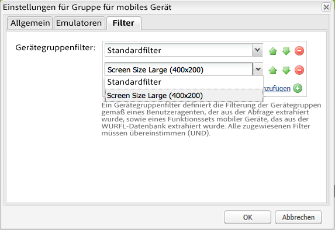
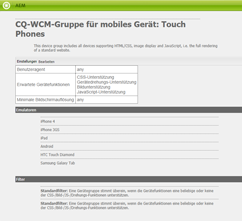

# Erstellen von Gerätegruppenfiltern{#creating-device-group-filters}

>[!NOTE]
>
>Adobe empfiehlt die Verwendung des SPA-Editors für Projekte, die ein Framework-basiertes clientseitiges Rendering von Einzelseiten-Apps erfordern (z. B. React). [Weitere Informationen](/help/sites-developing/spa-overview.md)

Erstellen Sie einen Gerätegruppenfilter, um eine Reihe von Gerätefunktionsanforderungen zu definieren. Erstellen Sie so viele Filter, wie Sie benötigen, um die erforderlichen Gruppen von Gerätefunktionen auszuwählen.

Entwerfen Sie Ihre Filter so, dass Sie Kombinationen von ihnen verwenden können, um die Gruppen von Funktionen zu definieren. In der Regel gibt es eine Überlappung der Funktionen verschiedener Gerätegruppen. Daher können Sie einige Filter mit mehreren Gerätegruppendefinitionen verwenden.

Nachdem Sie einen Filter erstellt haben, können Sie ihn im [Gruppenkonfiguration.](/help/sites-developing/mobile.md#creating-a-device-group)

## Die Filter Java-Klasse {#the-filter-java-class}

Ein Gerätegruppenfilter ist eine OSGi-Komponente, die die Schnittstelle [com.day.cq.wcm.mobile.api.device.DeviceGroupFilter](https://helpx.adobe.com/experience-manager/6-5/sites/developing/using/reference-materials/javadoc/index.html?com/day/cq/wcm/mobile/api/device/DeviceGroupFilter.html) implementiert. Nach der Bereitstellung stellt die Implementierungsklasse einen Filterdienst bereit, der für Gerätegruppenkonfigurationen verfügbar ist.

Die in diesem Artikel beschriebene Lösung verwendet das Apache Felix Maven-SCR-Plug-in, um die Entwicklung von Komponenten und Diensten zu erleichtern. Daher verwendet die Beispiel-Java-Klasse die Anmerkungen `@Component` und `@Service`. Die Klasse weist die folgende Struktur auf:

```java
package com.adobe.example.myapp;

import java.util.Map;

import com.day.cq.wcm.mobile.api.device.DeviceGroup;
import com.day.cq.wcm.mobile.api.device.DeviceGroupFilter;

import org.apache.felix.scr.annotations.Component;
import org.apache.felix.scr.annotations.Service;

@Component(metatype = false)
@Service
public class myDeviceGroupFilter implements DeviceGroupFilter {

       public String getDescription() {
  return null;
 }

 public String getTitle() {
  return null;
 }

 public boolean matches(DeviceGroup arg0, String arg1, Map arg2) {
  return false;
 }

}
```

Sie müssen Code für die folgenden Methoden bereitstellen:

* `getDescription`: Gibt die Filterbeschreibung zurück. Die Beschreibung wird im Konfigurationsdialogfeld „Gerätegruppe“ angezeigt.
* `getTitle`: Gibt den Namen des Filters zurück. Der Name wird angezeigt, wenn Sie Filter für die Gerätegruppe auswählen.
* `matches`: Legt fest, ob das Gerät über die erforderlichen Funktionen verfügt.

### Bereitstellung des Filternamens und der Beschreibung {#providing-the-filter-name-and-description}

Die `getTitle`- und `getDescription`-Methoden geben jeweils den Filternamen und die Beschreibung zurück. Der folgende Code veranschaulicht die einfachste Implementierung:

```java
public String getDescription() {
    return "An example device group filter";
}

public String getTitle() {
 return "myFilter";
}
```

Feste Programmierung des Namens und des Beschreibungtextes ist ausreichend für einsprachige Authoring-Umgebungen. Erwägen Sie, die Zeichenfolgen für die mehrsprachige Verwendung oder zum Ändern von Zeichenfolgen zu externalisieren, ohne den Quellcode neu zu kompilieren.

### Auswerten anhand von Filterkriterien {#evaluating-against-filter-criteria}

Die `matches`-Funktion gibt `true` zurück, wenn die Gerätefunktionen alle Filterkriterien erfüllen. Werten Sie die in den Methodenargumenten bereitgestellten Informationen aus, um festzustellen, ob das Gerät zur Gruppe gehört. Die folgenden Werte werden als Argumente bereitgestellt:

* Ein DeviceGroup-Objekt
* Der Name des Benutzeragenten
* Ein Map-Objekt, das die Gerätefunktionen enthält. Die Zuordnungsschlüssel sind die Namen der WURFL™-Funktionen und die Werte sind die entsprechenden Werte aus der WURFL™-Datenbank.

Die Schnittstelle[ com.day.cq.wcm.mobile.api.devicespecs.DeviceSpecsConstants](https://helpx.adobe.com/experience-manager/6-5/sites/developing/using/reference-materials/javadoc/index.html?com/day/cq/wcm/mobile/api/device/DeviceGroupFilter.html) enthält eine Teilmenge der WURFL™ -Fähigkeitsnamen in statischen Feldern. Verwenden Sie diese Feldkonstanten als Schlüssel beim Abrufen von Werten aus der Karte der Gerätefunktionen.

Zum Beispiel bestimmt das folgende Codebeispiel, ob das Gerät CSS unterstützt:

```xml
boolean cssSupport = true;
cssSupport = NumberUtils.toInt(capabilities.get(DeviceSpecsConstants.DSPEC_XHTML_SUPPORT_LEVEL)) > 1;
```

Das Paket `org.apache.commons.lang.math` stellt die `NumberUtils`-Klasse bereit.

>[!NOTE]
>
>Stellen Sie sicher, dass die WURFL™ -Datenbank, die für AEM bereitgestellt wird, die Funktionen enthält, die Sie als Filterkriterien verwenden. (Siehe [Geräteerkennung](/help/sites-developing/mobile.md#server-side-device-detection).)

### Beispielfilter für Bildschirmgröße {#example-filter-for-screen-size}

Die folgende Beispiel-Implementierung von DeviceGroupFilter bestimmt, ob die physische Größe des Geräts die Mindestanforderungen erfüllt. Dieser Filter soll der Touch-Gerätegruppe Granularität verleihen. Die Größe der Schaltflächen in der Anwendungsoberfläche sollte unabhängig von der physischen Bildschirmgröße gleich sein. Die Größe anderer Elemente, z. B. Text, kann variieren. Der Filter ermöglicht die dynamische Auswahl eines bestimmten CSS, das die Größe der Benutzeroberflächenelemente steuert.

Dieser Filter wendet Größenkriterien auf die WURFL™ -Eigenschaftsnamen `physical_screen_height` und `physical_screen_width` an.

```java
package com.adobe.example.myapp;

import java.util.Map;

import com.day.cq.wcm.mobile.api.device.DeviceGroup;
import com.day.cq.wcm.mobile.api.device.DeviceGroupFilter;

import org.apache.commons.lang.math.NumberUtils;
import org.apache.felix.scr.annotations.Component;
import org.apache.felix.scr.annotations.Service;

@Component(metatype = false)
@Service
@SuppressWarnings("unused")
public class ScreenSizeLarge implements DeviceGroupFilter {
    private int len=400;
    private int wid=200;
    public String getDescription() {

        return "Requires the physical size of the screen to have minimum dimensions " + len + "x" + wid+".";
    }

    public String getTitle() {
        return "Screen Size Large ("+len + "x" + wid+")";
    }

    public boolean matches(DeviceGroup deviceGroup, String userAgent,
            Map<String, String> deviceCapabilities) {

        boolean longEnough=true;
        boolean wideEnough=false;
        int dimension1=NumberUtils.toInt(deviceCapabilities.get("physical_screen_height"));
        int dimension2=NumberUtils.toInt(deviceCapabilities.get("physical_screen_width"));
        if(dimension1>dimension2){
            longEnough=dimension1>=len;
            wideEnough=dimension2>=wid;
        }else{
            longEnough=dimension2>=len;
            wideEnough=dimension1>=wid;
        }

        return longEnough && wideEnough;
    }
}
```

Der String -Wert, den die getTitle -Methode zurückgibt, wird in der Dropdown-Liste der Gerätegruppeneigenschaften angezeigt.



Die Stringwerte, die die getTitle- und getDescription-Methoden zurückgeben, sind am unteren Rand der Zusammenfassungsseite der Gerätegruppe enthalten.



### Die Maven-POM-Datei {#the-maven-pom-file}

Der folgende POM-Code ist nützlich, wenn Sie Maven zum Erstellen Ihrer Anwendungen verwenden. Das POM verweist auf mehrere erforderliche Plug-ins und Abhängigkeiten.

**Plug-ins:**

* Apache Maven Compiler Plugin: Kompiliert Java-Klassen aus dem Quellcode.
* Apache Felix Maven Bundle Plugin: Erstellt das Bundle und das Manifest
* Apache Felix Maven SCR Plugin: Erstellt die Komponentendeskriptordatei und konfiguriert die Manifestkopfzeile der Dienstkomponente.

**Abhängigkeiten:**

* `cq-wcm-mobile-api-5.5.2.jar`: Stellt die Schnittstellen DeviceGroup und DeviceGroupFilter bereit.

* `org.apache.felix.scr.annotations.jar`: Stellt die Anmerkungen zu Komponenten und Diensten bereit.

Die DeviceGroup- und DeviceGroupFilter-Schnittstellen sind im Day Communique 5 WCM Mobile API-Bundle enthalten. Die Felix-Anmerkungen sind im Bundle Apache Felix Declarative Services enthalten. Sie können diese JAR-Datei über das öffentliche Adobe-Repository beziehen.

Zum Zeitpunkt der Erstellung ist 5.5.2 die Version des WCM Mobile API-Bundles, das in der neuesten Version von AEM enthalten ist. Verwenden Sie die Adobe-Web-Konsole ([https://localhost:4502/system/console/bundles](https://localhost:4502/system/console/bundles)), um sicherzustellen, dass es sich um die Paketversion handelt, die in Ihrer Umgebung bereitgestellt wird.

**POM:**(Ihr POM wird eine andere groupId und Version verwenden.)

```xml
<project xmlns="https://maven.apache.org/POM/4.0.0"
        xmlns:xsi="https://www.w3.org/2001/XMLSchema-instance"
        xsi:schemaLocation="https://maven.apache.org/POM/4.0.0 https://maven.apache.org/xsd/maven-4.0.0.xsd">
      <modelVersion>4.0.0</modelVersion>
      <groupId>com.adobe.example.myapp</groupId>
      <artifactId>devicefilter</artifactId>
      <version>0.0.1-SNAPSHOT</version>
      <name>my app device filter</name>
      <url>https://dev.day.com/docs/en/cq/current.html</url>
  <packaging>bundle</packaging>
<build>
    <plugins>
        <plugin>
            <groupId>org.apache.maven.plugins</groupId>
            <artifactId>maven-compiler-plugin</artifactId>
            <configuration>
                <source>1.5</source>
                <target>1.5</target>
            </configuration>
        </plugin>
        <plugin>
            <groupId>org.apache.felix</groupId>
            <artifactId>maven-scr-plugin</artifactId>
            <executions>
                  <execution>
                    <id>generate-scr-scrdescriptor</id>
                    <goals>
                          <goal>scr</goal>
                    </goals>
                  </execution>
            </executions>
          </plugin>
        <plugin>
            <groupId>org.apache.felix</groupId>
            <artifactId>maven-bundle-plugin</artifactId>
            <version>1.4.3</version>
            <extensions>true</extensions>
            <configuration>
                <instructions>
                    <Export-Package>com.adobe.example.myapp.*;version=${project.version}</Export-Package>
                </instructions>
            </configuration>
        </plugin>
    </plugins>
</build>
<dependencies>
     <dependency>
         <groupId>com.day.cq.wcm</groupId>
         <artifactId>cq-wcm-mobile-api</artifactId>
         <version>5.5.2</version>
         <scope>provided</scope>
     </dependency>
     <dependency>
        <groupId>org.apache.felix</groupId>
        <artifactId>org.apache.felix.scr.annotations</artifactId>
        <version>1.6.0</version>
        <scope>compile</scope>
    </dependency>
</dependencies>
</project>
```

Fügen Sie das Profil, das im Abschnitt [Abrufen des Inhaltspaket-Maven-Plugins](/help/sites-developing/vlt-mavenplugin.md) enthalten ist, zu Ihrer Maven-Einstellungsdatei hinzu, um das öffentliche Adobe-Repository zu verwenden.
