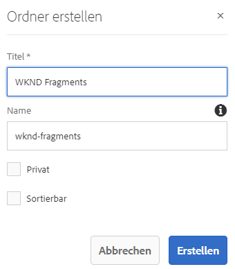
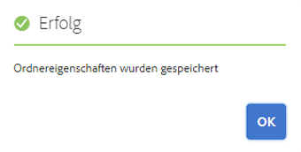

# Schnellstartanleitung zum Erstellen von Asset-Ordnern per Headless-Implementierung {#creating-an-assets-folder}

Verwenden Sie AEM-Inhaltsfragmentmodelle, um die Struktur von Inhaltsfragmenten zu definieren – die Grundlage für Ihren Headless-Content. Inhaltsfragmente werden dann in Asset-Ordnern gespeichert.

## Was ist ein Asset-Ordner? {#what-is-an-assets-folder}

[Nachdem Sie nun Inhaltsfragmentmodelle erstellt haben](create-content-model.md), die die Struktur definieren, die Sie für Ihre künftigen Inhaltsfragmente verwenden möchten, würden Sie sicher gern einige Fragmente erstellen.

Zunächst müssen Sie jedoch einen Ordner für Assets erstellen, in dem Sie diese speichern.

Asset-Ordner werden für [Organisieren von traditionellen Inhalts-Assets](/help/assets/manage-assets.md) wie Bilder und Videos und Inhaltsfragmente.

## Erstellen eines Asset-Ordners {#how-to-create-an-assets-folder}

Administratoren müssen nur gelegentlich Ordner erstellen, um Inhalte bei der Erstellung zu organisieren. Für die Zwecke dieser Anleitung für den Einstieg müssen wir nur einen Ordner erstellen.

1. Melden Sie sich bei AEM an und wählen Sie im Hauptmenü die Option **Navigation > Assets > Dateien**.
1. Klicks **Erstellen > Ordner**.
1. Geben Sie einen **Titel** und einen **Namen** für Ihren Ordner an.
   * Der **Titel** sollte beschreibend sein.
   * Der **Name** wird zum Knotennamen im Repository.
      * Er wird automatisch auf der Grundlage des Titels generiert und gemäß den [AEM-Benennungskonventionen](/help/sites-developing/naming-conventions.md) angepasst.
      * Er kann bei Bedarf angepasst werden.

   
1. Wählen Sie den von Ihnen erstellten Ordner aus und klicken Sie auf **Eigenschaften** über die Symbolleiste (oder verwenden Sie die `p` [Tastaturbefehl verwenden.](/help/sites-authoring/keyboard-shortcuts.md))
1. Wählen Sie im Fenster **Eigenschaften** die Registerkarte **Cloud-Services** aus.
1. Wählen Sie für die **Cloud-Konfiguration** die zuvor erstellte [Konfiguration aus.](create-configuration.md)
   
1. Klicken Sie auf **Speichern und schließen**.
1. Klicks **OK** im Bestätigungsfenster.

   

Sie können weitere Unterordner im von Ihnen erstellten Ordner erstellen. Die Unterordner übernehmen die **Cloud-Konfiguration** des übergeordneten Ordners. Dies kann jedoch überschrieben werden, wenn Sie Modelle aus einer anderen Konfiguration verwenden möchten.

Wenn Sie eine lokalisierte Site-Struktur verwenden, können Sie unter Ihrem neuen Ordner [einen Sprach-Stamm](/help/assets/multilingual-assets.md) erstellen.

## Nächste Schritte {#next-steps}

Nachdem Sie nun einen Ordner für Ihre Inhaltsfragmente erstellt haben, können Sie zum vierten Teil der Anleitung für den Einstieg übergehen und [Inhaltsfragmente erstellen](create-content-fragment.md).

>[!TIP]
>
>Ausführliche Informationen zur Verwaltung von Inhaltsfragmenten finden Sie in der [Dokumentation zu Inhaltsfragmenten](/help/assets/content-fragments/content-fragments.md).
