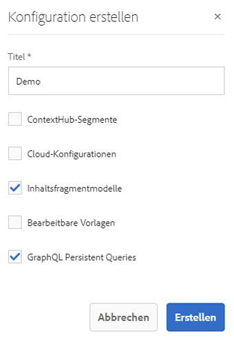

# Schnellstartanleitung für Headless: Erstellen einer Konfiguration {#creating-configuration}

Als ersten Schritt für den Einstieg in Headless in AEM 6.5 müssen Sie eine Konfiguration erstellen.

## Was ist eine Konfiguration? {#what-is-a-configuration}

Der Konfigurations-Browser bietet eine generische Konfigurations-API, eine Inhaltsstruktur und einen Auflösungsmechanismus für Konfigurationen in AEM.

Stellen Sie sich im Kontext von Headless-Content-Management in AEM eine Konfiguration als einen Arbeitsplatz in AEM vor, an dem Sie Ihre Inhaltsmodelle erstellen können, die die Struktur Ihrer zukünftigen Inhalte und Inhaltsfragmente definieren. Sie können über mehrere Konfigurationen verfügen, um diese Modelle zu trennen.

>[!NOTE]
>
>Wenn Sie mit [Seitenvorlagen in einer Full-Stack-AEM-Implementierung](/help/sites-authoring/templates.md) vertraut sind, ist die Verwendung von Konfigurationen für die Verwaltung von Inhaltsmodellen ähnlich.

## Erstellen einer Konfiguration {#how-to-create-a-configuration}

Ein Administrator muss eine Konfiguration nur einmal oder sehr selten erstellen, wenn für die Organisation Ihrer Inhaltsmodelle ein neuer Arbeitsbereich erforderlich ist. Für die Zwecke dieser ersten Schritte müssen wir nur eine Konfiguration erstellen.

1. Melden Sie sich bei AEM an und wählen Sie im Hauptmenü **Tools > Allgemein > Konfigurationsbrowser** aus.
1. Geben Sie einen **Titel** für Ihre Konfiguration ein.
   * Der Name wird automatisch auf Grundlage des Titels generiert gemäß den [AEM-Benennungskonventionen](/help/sites-developing/naming-conventions.md). Er wird zum Knotennamen im Repository.
1. Überprüfen Sie die folgenden Optionen:
   * **Inhaltsfragmentmodelle**
   * **Persistente GraphQL-Abfragen**

   

1. Tippen oder klicken Sie auf **Erstellen**

Sie können bei Bedarf mehrere Konfigurationen erstellen. Konfigurationen können auch verschachtelt sein.

>[!NOTE]
>
>Abhängig von Ihren Implementierungsanforderungen können zusätzlich zu **Inhaltsfragmentmodellen** und **persistenten GraphQL-Abfragen** Konfigurationsoptionen erforderlich sein.

## Nächste Schritte {#next-steps}

Mit dieser Konfiguration können Sie nun mit dem zweiten Teil der ersten Schritte fortfahren und [Inhaltsfragmentmodelle](create-content-model.md) erstellen.

<!--
>[!TIP]
>
>For complete details about the Configuration Browser, [see the Configuration Browser documentation.](/help/sites-developing/configurations.md)
-->
