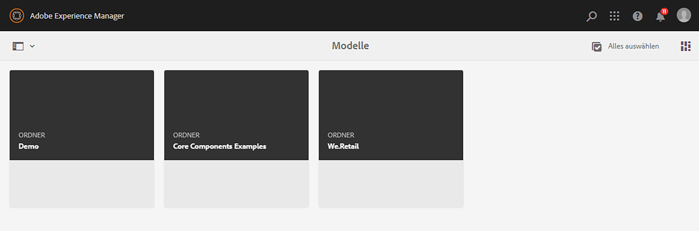
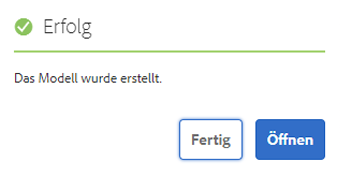
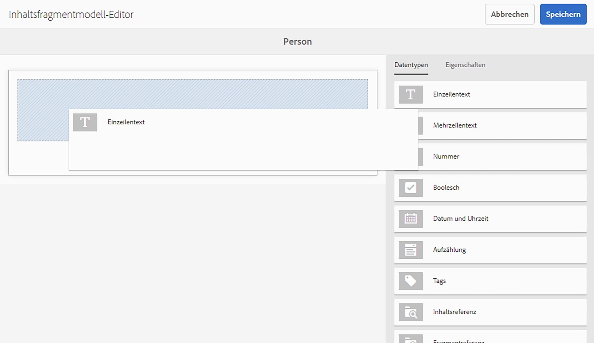
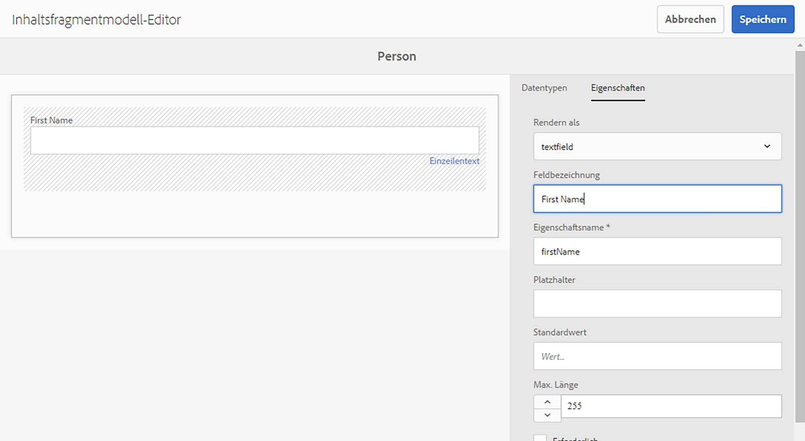
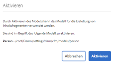

# Schnellstartanleitung zum Erstellen von Inhaltsfragmentmodellen per Headless-Implementierung {#creating-content-fragment-models}

Definieren Sie die Struktur des Inhalts, den Sie mithilfe der Headless-Funktionen von Adobe Experience Manager (AEM) erstellen und bereitstellen, indem Sie Inhaltsfragmentmodelle verwenden.

## Was sind Inhaltsfragmentmodelle? {#what-are-content-fragment-models}

[Nachdem Sie nun eine Konfiguration erstellt haben](create-configuration.md), können Sie damit Inhaltsfragmentmodelle erstellen.

Inhaltsfragmentmodelle definieren die Struktur der Daten und Inhalte, die Sie in AEM erstellen und verwalten. Sie dienen als Gerüst für Ihre Inhalte. Bei der Erstellung von Inhalten wählen Autoren aus den von Ihnen definierten Inhaltsfragmentmodellen aus, die sie bei der Erstellung von Inhalten anleiten.

## Erstellen eines Inhaltsfragmentmodells {#how-to-create-a-content-fragment-model}

Ein Informationsarchitekt würde diese Aufgaben nur sporadisch durchführen, da neue Modelle erforderlich sind. Für die Zwecke dieses Erste-Schritte-Handbuchs erstellen Sie nur ein Modell.

1. Melden Sie sich bei AEM an und wählen Sie im Hauptmenü die Option **Tools > Assets > Inhaltsfragmentmodelle**.
1. Klicken Sie auf den Ordner, der durch die Erstellung der Konfiguration erstellt wurde.

   
1. Klicken Sie auf **Erstellen**.
1. Stellen Sie eine **Modelltitel**, **Tags**, und **Beschreibung**. Sie können auch **Modell aktivieren** aus- oder abwählen, um zu steuern, ob das Modell unmittelbar nach der Erstellung aktiviert wird.

   
1. Klicken Sie im Bestätigungsfenster auf **Öffnen** um Ihr Modell zu konfigurieren.

   
1. Erstellen Sie mit dem **Inhaltsfragmentmodell-Editor** das Inhaltsfragmentmodell, indem Sie Felder aus der Spalte **Datentypen** ziehen und ablegen.

   

1. Nachdem Sie ein Feld platziert haben, müssen Sie dessen Eigenschaften konfigurieren. Der Editor wechselt automatisch zum **Eigenschaften** Registerkarte für das hinzugefügte Feld, in dem Sie die Pflichtfelder angeben können.

   
1. Wenn Sie mit dem Erstellen Ihres Modells fertig sind, klicken Sie auf **Speichern**.

1. Der Modus des neu erstellten Modells hängt davon ab, ob Sie beim Erstellen des Modells **Modell aktivieren** ausgewählt haben:
   * ausgewählt - das neue Modell ist bereits **Aktiviert**
   * nicht ausgewählt – das neue Modell wird im Modus **Entwurf** erstellt

1. Wenn nicht bereits aktiviert, muss das Modell **aktiviert** werden, um es zu verwenden.
   1. Wählen Sie das von Ihnen erstellte Modell aus und klicken Sie auf **Aktivieren**.

      
   1. Bestätigen Sie die Aktivierung des Modells, indem Sie im Bestätigungsdialogfeld auf **Aktivieren** tippen oder klicken.

      
1. Das Modell ist jetzt aktiviert und einsatzbereit.

   

Die **Inhaltsfragmentmodell-Editor** unterstützt viele verschiedene Datentypen wie einfache Textfelder, Asset-Verweise, Verweise auf andere Modelle und JSON-Daten.

Sie können mehrere Modelle erstellen. Modelle können auf andere Inhaltsfragmente verweisen. Verwenden Sie [Konfigurationen](create-configuration.md), um Ihre Modelle zu organisieren.

## Nächste Schritte {#next-steps}

Nachdem Sie die Strukturen Ihrer Inhaltsfragmente durch Erstellen von Modellen definiert haben, können Sie zum dritten Teil des Erste-Schritte-Handbuchs übergehen und [Erstellen Sie Ordner, in denen Sie die Fragmente speichern.](create-assets-folder.md)

>[!TIP]
>
>Ausführliche Informationen zu Inhaltsfragmentmodellen finden Sie unter [Dokumentation zu Inhaltsfragmentmodellen](/help/assets/content-fragments/content-fragments-models.md)
