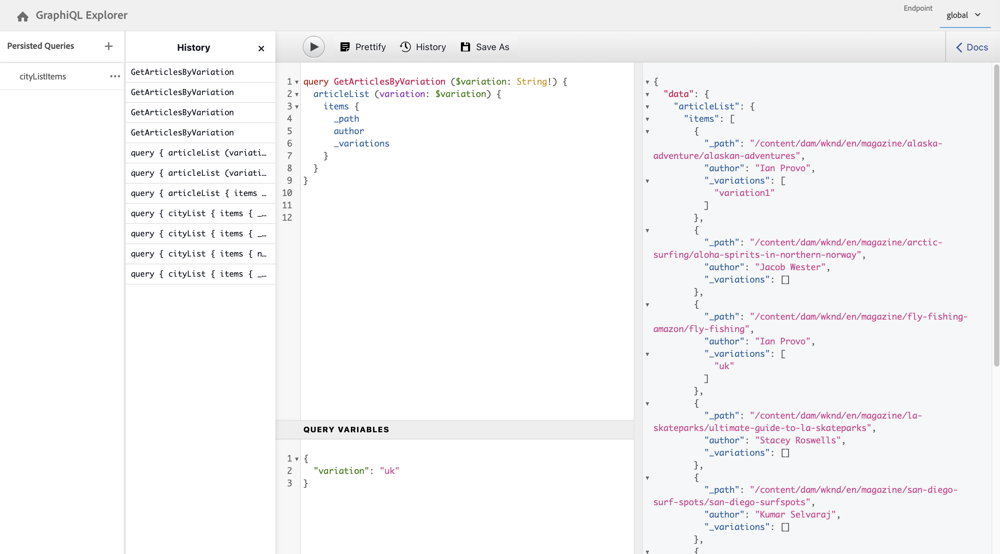

# AEM GraphQL-API zur Verwendung mit Inhaltsfragmenten {#graphql-api-for-use-with-content-fragments}

Erfahren Sie, wie Sie Inhaltsfragmente in Adobe Experience Manager (AEM) mit der AEM GraphQL-API für die Headless-Bereitstellung von Inhalten verwenden.

Die mit Inhaltsfragmenten verwendete GraphQL-API von AEM basiert stark auf der standardmäßigen Open-Source-GraphQL-API.

Die Verwendung der GraphQL-API in AEM ermöglicht die effiziente Bereitstellung von Inhaltsfragmenten an JavaScript-Clients in Headless CMS-Implementierungen:

* Vermeiden von iterativen API-Anfragen wie bei REST,
* Sicherstellen, dass die Bereitstellung auf die spezifischen Anforderungen beschränkt ist,
* Ermöglichen der Massenbereitstellung von genau dem, was zum Rendern als Antwort auf eine einzelne API-Anfrage benötigt wird.

>[!NOTE]
>
>GraphQL wird derzeit in zwei (separaten) Szenarios in Adobe Experience Manager (AEM) verwendet:
>
>* [AEM Commerce nutzt Daten von einer Commerce-Plattform über GraphQL](/help/commerce/cif/integrating/magento.md).
>* AEM-Inhaltsfragmente stellen in Kombination mit der AEM-GraphQL-API (einer auf GraphQL basierenden benutzerdefinierten Implementierung) strukturierte Inhalte für die Verwendung in Ihren Programmen bereit.


## Voraussetzungen {#prerequisites}

Kunden, die GraphQL verwenden, sollten das AEM Inhaltsfragment mit GraphQL Index Package 1.0.5 installieren. Siehe [Versionshinweise](/help/release-notes/release-notes.md#install-aem-graphql-index-add-on-package) für weitere Informationen.

## Die GraphQL-API {#graphql-api}

GraphQL ist:

* „*...eine Abfragesprache für APIs und eine Laufzeitumgebung zur Erfüllung dieser Abfragen mit Ihren vorhandenen Daten. GraphQL bietet eine vollständige und verständliche Beschreibung der Daten in Ihrer API, gibt Kunden die Möglichkeit, genau das abzufragen, was sie benötigen, und nicht mehr, macht es einfacher, APIs im Laufe der Zeit weiterzuentwickeln, und ermöglicht leistungsstarke Entwicklerwerkzeuge.*“

   Weitere Informationen finden Sie unter [GraphQL.org](https://graphql.org)

* „*...eine offene Spezifikation für eine flexible API-Schicht. Legen Sie GraphQL über Ihre bestehenden Backends, um Produkte schneller als je zuvor zu erstellen ...*“

   Weitere Informationen finden Sie unter [GraphQL entdecken](https://www.graphql.com).

* *„... eine Datenabfragesprache und -spezifikation, die 2012 intern von Facebook entwickelt wurde, bevor sie 2015 öffentlich als Open Source zur Verfügung gestellt wurde. Sie bietet eine Alternative zu REST-basierten Architekturen mit dem Ziel, die Produktivität von Entwicklern zu erhöhen und die Menge der übertragenen Daten zu minimieren. GraphQL wird von Hunderten von Unternehmen aller Größenordnungen in der Produktion eingesetzt ...“*

   Siehe [GraphQL Foundation](https://foundation.graphql.org/).

<!--
"*Explore GraphQL is maintained by the Apollo team. Our goal is to give developers and technical leaders around the world all of the tools they need to understand and adopt GraphQL.*". 
-->

Weitere Informationen zur GraphQL-API finden Sie in den folgenden Abschnitten (neben vielen anderen Ressourcen):

* Unter [graphql.org](https://graphql.org):

   * [Einführung in GraphQL](https://graphql.org/learn)

   * [GraphQL-Spezifikation](https://spec.graphql.org/)

* Unter [graphql.com](https://graphql.com):

   * [Handbücher](https://www.graphql.com/guides/)

   * [Tutorials](https://www.graphql.com/tutorials/)

   * [Fallstudien](https://www.graphql.com/case-studies/)

Die Implementierung von GraphQL für AEM basiert auf der standardmäßigen GraphQL-Java-Bibliothek. Siehe:

* [graphQL.org – Java](https://graphql.org/code/#java)

* [GraphQL-Java auf GitHub](https://github.com/graphql-java)

### GraphQL-Terminologie {#graphql-terminology}

GraphQL verwendet Folgendes:

* **[Abfragen](https://graphql.org/learn/queries/)**

* **[Schemata und Typen](https://graphql.org/learn/schema/)**:

   * Schemata werden von AEM basierend auf den Inhaltsfragmentmodellen generiert.
   * GraphQL stellt mithilfe Ihrer Schemata die Typen und Vorgänge dar, die für die GraphQL-Implementierung für AEM zulässig sind.

* **[Felder](https://graphql.org/learn/queries/#fields)**

* **[GraphQL-Endpunkt](/help/sites-developing/headless/graphql-api/graphql-endpoint.md#graphql-aem-endpoint)**
   * Der Pfad in AEM, der auf GraphQL-Abfragen antwortet und Zugriff auf die GraphQL-Schemata bietet.

   * Weitere Informationen finden Sie unter [Aktivieren des GraphQL-Endpunkts](/help/sites-developing/headless/graphql-api/graphql-endpoint.md#enabling-graphql-endpoint).

In der [(GraphQL.org) Einführung in GraphQL](https://graphql.org/learn/) finden Sie ausführliche Informationen, einschließlich der [Best Practices](https://graphql.org/learn/best-practices/).

### GraphQL-Abfragetypen {#graphql-query-types}

Mit GraphQL können Sie Abfragen für Folgendes durchführen:

* Einen **einzelnen Eintrag**

* Eine **[Liste von Einträgen](https://graphql.org/learn/schema/#lists-and-non-null)**

AEM bietet Funktionen zum Konvertieren von Abfragen (beide Typen) in [](/help/sites-developing/headless/graphql-api/persisted-queries.md)persistente Abfragen, die vom Dispatcher und CDN zwischengespeichert werden können.

### Best Practices für GraphQL-Abfragen (Dispatcher und CDN) {#graphql-query-best-practices}

Die [persistenten Abfragen](/help/sites-developing/headless/graphql-api/persisted-queries.md) sind die empfohlene Methode für die Nutzung bei Veröffentlichungsinstanzen, da:

* sie zwischengespeichert werden
* Sie werden zentral von AEM verwaltet

<!-- is this fully accurate? -->
>[!NOTE]
>
>In der Regel gibt es keinen Dispatcher/CDN auf der Autoreninstanz, sodass die Verwendung persistenter Abfragen dort keinen Leistungsgewinn bringt. außer sie zu testen.

GraphQL-Abfragen über POST werden nicht empfohlen, da sie nicht zwischengespeichert werden. Daher ist der Dispatcher auf einer Standardinstanz so konfiguriert, dass er solche Abfragen blockiert.

GraphQL unterstützt zwar auch GET-Anfragen, diese können jedoch Einschränkungen unterliegen (z. B. die Länge der URL), die durch die Verwendung persistenter Abfragen vermieden werden können.

>[!NOTE]
>
>Die Möglichkeit, direkte Abfragen durchzuführen, könnte irgendwann in der Zukunft entfernt werden.

## GraphiQL-Schnittstelle {#graphiql-interface}

Eine Implementierung der [GraphiQL](https://graphql.org/learn/serving-over-http/#graphiql)-Standardschnittstelle steht zur Verwendung mit AEM-GraphQL zur Verfügung.

>[!NOTE]
>
>GraphiQL ist in allen Umgebungen von AEM enthalten (kann jedoch nur bei der Konfiguration Ihrer Endpunkte aufgerufen/angezeigt werden).
>
>In früheren Versionen war ein Paket erforderlich, um die GraphiQL-IDE zu installieren. Sollten Sie ein solches Paket installiert haben, kann es jetzt entfernt werden.

Über diese Schnittstelle können Sie Abfragen direkt eingeben und testen.

Beispiel:

* `http://localhost:4502/content/graphiql.html`

Dies bietet Funktionen wie Syntaxhervorhebung, automatische Vervollständigung, automatische Vorschläge sowie einen Verlauf und eine Online-Dokumentation:


>[!NOTE]
>
>Weitere Informationen finden Sie unter [Verwenden der GraphiQL-IDE](/help/sites-developing/headless/graphql-api/graphiql-ide.md).

## Anwendungsfälle für Autoren- und Veröffentlichungsumgebungen {#use-cases-author-publish-environments}

Die Anwendungsfälle können vom Typ der AEM-Umgebung abhängen:

* Veröffentlichungsumgebung; wird verwendet, um:
   * Daten für das JS-Programm (Standardanwendungsfall) abzufragen

* Autorenumgebung; wird verwendet, um:
   * Daten für „Content-Management-Zwecke“ abzufragen:
      * GraphQL in AEM ist derzeit eine schreibgeschützte API.
      * Die REST-API kann für CR(u)D-Vorgänge verwendet werden.

## Berechtigungen {#permission}

Die Berechtigungen sind diejenigen, die für den Zugriff auf Assets erforderlich sind.

GraphQL-Abfragen werden mit der Berechtigung der AEM-Benutzenden der zugrunde liegenden Anfrage ausgeführt. Wenn die Benutzenden keinen Lesezugriff auf einige (als Assets gespeicherte) Fragmente haben, werden diese nicht Teil der Ergebnismenge.

Außerdem benötigen die Benutzenden Zugriff auf einen GraphQL-Endpunkt, um GraphQL-Abfragen ausführen zu können.

## Schema-Generierung {#schema-generation}

GraphQL ist eine stark typisierte API, was bedeutet, dass die Daten klar strukturiert und nach Typ geordnet sein müssen.

Die GraphQL-Spezifikation enthält eine Reihe von Richtlinien zum Erstellen einer robusten API zum Abfragen von Daten in einer bestimmten Instanz. Dazu muss ein Client das [Schema](#schema-generation) abrufen, das alle für eine Abfrage erforderlichen Typen enthält.

Bei Inhaltsfragmenten basieren die GraphQL-Schemata (Struktur und Typen) auf **aktivierten** [Inhaltsfragmentmodellen](/help/assets/content-fragments/content-fragments-models.md) und deren Datentypen.

>[!CAUTION]
>
>Alle GraphQL-Schemata (abgeleitet von Inhaltsfragmentmodellen, die **aktiviert** wurden) können über den GraphQL-Endpunkt gelesen werden.
>
>Das bedeutet, dass Sie sicherstellen müssen, dass keine vertraulichen Daten verfügbar sind, da sie auf diese Weise an die Öffentlichkeit gelangen könnten. Dazu gehören beispielsweise Informationen, die als Feldnamen in der Modelldefinition vorhanden sein könnten.

Wenn ein Benutzer beispielsweise ein Inhaltsfragmentmodell mit dem Namen `Article` erstellt hat, generiert AEM das Objekt `article`, das dem Typ `ArticleModel` entspricht. Die Felder dieses Typs entsprechen den im Modell definierten Feldern und Datentypen.

1. Ein Inhaltsfragmentmodell:

   

1. Das entsprechende GraphQL-Schema (Ausgabe aus der automatischen GraphiQL-Dokumentation):
   

   Dies zeigt, dass der generierte Typ `ArticleModel` mehrere [Felder](#fields) enthält.

   * Drei davon wurden vom Benutzer kontrolliert: `author`, `main` und `referencearticle`.

   * Die anderen Felder wurden automatisch von AEM hinzugefügt und stellen hilfreiche Methoden dar, um Informationen zu einem bestimmten Inhaltsfragment bereitzustellen. In diesem Beispiel `_path`, `_metadata` und `_variations`. Diese [Hilfsfelder](#helper-fields) sind mit einem vorangestellten `_` gekennzeichnet, um zu unterscheiden, was vom Benutzer definiert und was automatisch generiert wurde.

1. Nachdem ein Benutzer ein Inhaltsfragment basierend auf dem Modell „Article“ erstellt hat, kann es über GraphQL abgefragt werden. Beispiele finden Sie in den [Beispielabfragen](/help/sites-developing/headless/graphql-api/content-fragments-graphql-samples.md#graphql-sample-queries) (basierend auf einer [Beispielstruktur für Inhaltsfragmente zur Verwendung mit GraphQL](/help/sites-developing/headless/graphql-api/content-fragments-graphql-samples.md#content-fragment-structure-graphql)).

In GraphQL für AEM ist das Schema flexibel. Dies bedeutet, dass es jedes Mal automatisch generiert wird, wenn ein Inhaltsfragmentmodell erstellt, aktualisiert oder gelöscht wird. Die Datenschema-Caches werden auch aktualisiert, wenn Sie ein Inhaltsfragmentmodell aktualisieren.

Der Sites GraphQL-Service überwacht (im Hintergrund) alle Änderungen, die an einem Inhaltsfragmentmodell vorgenommen werden. Wenn Aktualisierungen erkannt werden, wird nur dieser Teil des Schemas neu generiert. Diese Optimierung spart Zeit und sorgt für Stabilität.

Wenn Sie zum Beispiel:

1. ein Paket installieren, das `Content-Fragment-Model-1` und `Content-Fragment-Model-2` enthält:

   1. Es werden GraphQL-Typen für `Model-1` und `Model-2` generiert.

1. anschließend `Content-Fragment-Model-2` ändern:

   1. Nur der GraphQL-Typ `Model-2` wird aktualisiert.

   1. `Model-1` bleibt unverändert.

>[!NOTE]
>
>Dies ist wichtig, wenn Sie Massenaktualisierungen von Inhaltsfragmentmodellen über die REST-API oder auf andere Weise durchführen möchten.

Das Schema wird über denselben Endpunkt wie die GraphQL-Abfragen bereitgestellt, wobei der Client die Tatsache behandelt, dass das Schema mit der `GQLschema`-Erweiterung aufgerufen wird. Wenn Sie beispielsweise eine einfache `GET`-Anfrage an `/content/cq:graphql/global/endpoint.GQLschema` ausführen, wird das Schema mit dem Inhaltstyp ausgegeben: `text/x-graphql-schema;charset=iso-8859-1`.

### Schemagenerierung – Nicht veröffentlichte Modelle {#schema-generation-unpublished-models}

Wenn Inhaltsfragmente verschachtelt sind, kann es vorkommen, dass ein übergeordnetes Inhaltsfragmentmodell veröffentlicht wird, ein referenziertes Modell jedoch nicht.

>[!NOTE]
>
>Die AEM-Benutzeroberfläche verhindert dies, aber wenn die Veröffentlichung programmgesteuert oder mit Inhaltspaketen erfolgt, kann es vorkommen.

In diesem Fall generiert AEM ein *unvollständiges* Schema für das übergeordnete Inhaltsfragmentmodell. Das bedeutet, dass die Fragmentreferenz, die vom nicht veröffentlichten Modell abhängt, aus dem Schema entfernt wird.

## Felder {#fields}

Innerhalb des Schemas gibt es einzelne Felder, die zwei grundlegenden Kategorien angehören:

* Von Ihnen generierte Felder.

   Eine Auswahl von [Feldtypen](#field-types) wird verwendet, um Felder basierend auf der Konfiguration des Inhaltsfragmentmodells zu erstellen. Die Feldnamen werden aus dem Feld **Eigenschaftsname** des **Datentyps** entnommen.

   * Es ist auch die Eigenschaft **Rendern als** zu berücksichtigen, da Benutzer bestimmte Datentypen konfigurieren können, beispielsweise als einzeiligen oder mehrzeiligen Text.

* GraphQL für AEM generiert auch eine Reihe von [Hilfsfeldern](#helper-fields).

   Diese werden verwendet, um ein Inhaltsfragment zu identifizieren oder um weitere Informationen zu einem Inhaltsfragment abzurufen.

### Feldtypen {#field-types}

GraphQL für AEM unterstützt eine Liste von Typen. Alle unterstützten Datentypen für Inhaltsfragmentmodelle und die entsprechenden GraphQL-Typen werden dargestellt:

| Datentyp für Inhaltsfragmentmodelle | GraphQL-Typ | Beschreibung |
|--- |--- |--- |
| Einzeilentext | Zeichenfolge, [Zeichenfolge] |  Wird für einfache Zeichenfolgen wie Autorennamen, Ortsnamen usw. verwendet. |
| Mehrzeilentext | Zeichenfolge |  Wird für die Ausgabe von Text verwendet, z. B. für den Textkörper eines Artikels |
| Zahl |  Gleitkommazahl, [Gleitkommazahl] | Wird für die Anzeige von Gleitkommazahlen und regulären Zahlen verwendet |
| Boolesch |  Boolesch |  Wird für die Anzeige von Kontrollkästchen → einfachen Wahr/Falsch-Aussagen verwendet |
| Datum und Uhrzeit | Kalender |  Wird verwendet, um Datum und Uhrzeit in einem ISO 8086-Format anzuzeigen. Je nach ausgewähltem Typ gibt es drei Varianten, die in AEM-GraphQL verwendet werden können: `onlyDate`, `onlyTime`, `dateTime` |
| Aufzählung |  Zeichenfolge |  Wird verwendet, um eine Option aus einer Liste von Optionen anzuzeigen, die bei der Modellerstellung definiert wurde |
|  Tags |  [Zeichenfolge] |  Wird verwendet, um eine Liste von Zeichenfolgen anzuzeigen, die in AEM verwendete Tags darstellen |
| Inhaltsreferenz |  Zeichenfolge |  Wird verwendet, um den Pfad zu einem anderen Asset in AEM anzuzeigen |
| Fragmentreferenz |  *Ein Modelltyp* |  Wird verwendet, um auf ein anderes Inhaltsfragment eines bestimmten Modelltyps zu verweisen, das beim Erstellen des Modells definiert wurde |

### Hilfsfelder {#helper-fields}

Zusätzlich zu den Datentypen für benutzergenerierte Felder generiert GraphQL für AEM eine Reihe von *Hilfsfeldern*, um ein Inhaltsfragment zu identifizieren oder zusätzliche Informationen zu einem Inhaltsfragment bereitzustellen.

#### Pfad {#path}

Das Feld „path“ (Pfad) wird in GraphQL als Bezeichner verwendet. Es stellt den Pfad des Inhaltsfragment-Assets im AEM Repository dar. Wir haben es als Bezeichner für ein Inhaltsfragment ausgewählt, da es:

* innerhalb von AEM eindeutig ist,
* leicht abgerufen werden kann.

Der folgende Code zeigt die Pfade aller Inhaltsfragmente an, die auf der Grundlage des Inhaltsfragmentmodells `Person` erstellt wurden.

```xml
{
  personList {
    items {
      _path
    }
  }
}
```

Um ein einzelnes Inhaltsfragment eines bestimmten Typs abzurufen, müssen Sie auch zuerst dessen Pfad bestimmen. Beispiel:

```xml
{
  personByPath(_path: "/content/dam/path/to/fragment/john-doe") {
    item {
      _path
      firstName
      name
    }
  }
}
```

Siehe [Beispielabfrage – ein Einzelstadtfragment](/help/sites-developing/headless/graphql-api/content-fragments-graphql-samples.md#sample-single-specific-city-fragment).

#### Metadaten {#metadata}

Mit GraphQL stellt AEM auch die Metadaten eines Inhaltsfragments zur Verfügung. Metadaten sind die Informationen, die ein Inhaltsfragment beschreiben, z. B. der Titel eines Inhaltsfragments, der Pfad der Miniatur, die Beschreibung eines Inhaltsfragments, das Erstellungsdatum usw.

Da Metadaten über den Schema-Editor generiert werden und daher keine bestimmte Struktur haben, wurde der GraphQL-Typ `TypedMetaData` implementiert, um die Metadaten eines Inhaltsfragments anzuzeigen. `TypedMetaData` stellt die Informationen gruppiert nach den folgenden Skalartypen bereit:

| Feld |
|--- |
| `stringMetadata:[StringMetadata]!` |
| `stringArrayMetadata:[StringArrayMetadata]!` |
| `intMetadata:[IntMetadata]!` |
| `intArrayMetadata:[IntArrayMetadata]!` |
| `floatMetadata:[FloatMetadata]!` |
| `floatArrayMetadata:[FloatArrayMetadata]!` |
| `booleanMetadata:[BooleanMetadata]!` |
| `booleanArrayMetadata:[booleanArrayMetadata]!`  |
| `calendarMetadata:[CalendarMetadata]!` |
| `calendarArrayMetadata:[CalendarArrayMetadata]!` |

Jeder Skalartyp repräsentiert entweder ein einzelnes Name-Wert-Paar oder ein Array von Name-Wert-Paaren, wobei der Wert dieses Paares dem Typ entspricht, in dem er gruppiert wurde.

Wenn Sie beispielsweise den Titel eines Inhaltsfragments abrufen möchten, wissen wir, dass diese Eigenschaft eine Zeichenfolgeneigenschaft ist. Daher würden wir eine Abfrage für alle Zeichenfolgenmetadaten durchführen:

Abfragen von Metadaten:

```xml
{
  personByPath(_path: "/content/dam/path/to/fragment/john-doe") {
    item {
      _path
      _metadata {
        stringMetadata {
          name
          value
        }
      }
    }
  }
}
```

Sie können alle GraphQL-Typen für Metadaten anzeigen, wenn Sie das generierte GraphQL-Schema anzeigen. Alle Modelltypen haben dieselben `TypedMetaData`.

>[!NOTE]
>
>**Unterschied zwischen normalen und Array-Metadaten**
>Beachten Sie, dass sich `StringMetadata` und `StringArrayMetadata` beide auf das beziehen, was im Repository gespeichert ist, und nicht darauf, wie Sie sie abrufen.
>
>Wenn Sie beispielsweise das Feld `stringMetadata` aufrufen, erhalten Sie ein Array aller im Repository gespeicherten Metadaten als `String` und wenn Sie `stringArrayMetadata` aufrufen, erhalten Sie ein Array aller Metadaten, die im Repository als `String[]` gespeichert wurden.

Weitere Informationen finden Sie unter [Beispielabfrage für Metadaten – Liste der Metadaten für Auszeichnungen mit dem Titel „GB“](/help/sites-developing/headless/graphql-api/content-fragments-graphql-samples.md#sample-metadata-awards-gb).

#### Varianten {#variations}

Das Feld `_variations` wurde implementiert, um die Abfrage der Varianten eines Inhaltsfragments zu vereinfachen. Beispiel:

```xml
{
  personByPath(_path: "/content/dam/path/to/fragment/john-doe") {
    item {
      _variations
    }
  }
}
```

Weitere Informationen finden Sie unter [Beispielabfrage – Alle Städte mit einer gegebenen Variante.](/help/sites-developing/headless/graphql-api/content-fragments-graphql-samples.md#sample-cities-named-variation)

>[!NOTE]
>
>Wenn die angegebene Variante für ein Inhaltsfragment nicht existiert, wird standardmäßig die Master-Variante (als Fallback) zurückgegeben.

<!--
## Security Considerations {#security-considerations}
-->

## GraphQL-Variablen {#graphql-variables}

Mit GraphQL können Variablen in die Abfrage eingefügt werden. Weitere Informationen finden Sie in der [GraphQL-Dokumentation zu Variablen](https://graphql.org/learn/queries/#variables).

Um beispielsweise alle Inhaltsfragmente vom Typ `Article` abzurufen, die eine bestimmte Variante aufweisen, können Sie die Variable `variation` in GraphiQL angeben.



```xml
### query
query GetArticlesByVariation($variation: String!) {
    articleList(variation: $variation) {
        items {
            _path
            author
            _variations
        }
    }
}
 
### in query variables
{
    "variation": "uk"
}
```

## GraphQL-Anweisungen {#graphql-directives}

In GraphQL besteht die Möglichkeit, die Abfrage basierend auf Variablen zu ändern, die als GraphQL-Anweisungen bezeichnet werden.

Sie können beispielsweise das Feld `adventurePrice` basierend auf einer Variablen `includePrice` in eine Abfrage für alle `AdventureModels` einfügen.


```xml
### query
query GetAdventureByType($includePrice: Boolean!) {
  adventureList {
    items {
      adventureTitle
      adventurePrice @include(if: $includePrice)
    }
  }
}
 
### in query variables
{
    "includePrice": true
}
```

## Filtern {#filtering}

Sie können auch Filterung in Ihren GraphQL-Abfragen verwenden, um bestimmte Daten zurückzugeben.

Beim Filtern wird eine Syntax verwendet, die auf logischen Operatoren und Ausdrücken basiert.

Beispielsweise werden mit der folgenden (einfachen) Abfrage alle Personen mit dem Namen `Jobs` oder `Smith` gefiltert:

```xml
query {
  personList(filter: {
    name: {
      _logOp: OR
      _expressions: [
        {
          value: "Jobs"
        },
        {
          value: "Smith"
        }
      ]
    }
  }) {
    items {
      name
      firstName
    }
  }
}
```

Weitere Beispiele finden Sie unter:

* Details zu den [Erweiterungen von GraphQL für AEM](#graphql-extensions)

* [Beispielabfragen unter Verwendung dieses Beispielinhalts und dieser Beispielstruktur](/help/sites-developing/headless/graphql-api/content-fragments-graphql-samples.md#graphql-sample-queries-sample-content-fragment-structure)

   * Und [Beispielinhalt und -struktur](/help/sites-developing/headless/graphql-api/content-fragments-graphql-samples.md#content-fragment-structure-graphql) speziell für die Verwendung in Beispielabfragen

* [Beispielabfragen basierend auf dem WKND-Projekt](/help/sites-developing/headless/graphql-api/content-fragments-graphql-samples.md#sample-queries-using-wknd-project)

## GraphQL für AEM – Zusammenfassung der Erweiterungen {#graphql-extensions}

Die grundlegende Funktionsweise von Abfragen mit GraphQL für AEM entspricht der Standard-GraphQL-Spezifikation. Für GraphQL-Abfragen mit AEM gibt es einige Erweiterungen:

* Wenn Sie ein einzelnes Ergebnis benötigen:
   * Verwenden Sie den Modellnamen, z. B. „city“

* Wenn Sie eine Ergebnisliste erwarten:
   * Fügen Sie `List` zum Modellnamen hinzu, z. B. `cityList`
   * Siehe [Beispielabfrage – Alle Informationen zu allen Städten](#sample-all-information-all-cities)

* Der Filter `includeVariations` ist im `List`-Abfragetyp enthalten.  Um Inhaltsfragmentvarianten in den Abfrageergebnissen abzurufen, muss der Filter `includeVariations` auf `true` festgelegt sein.

   >[!CAUTION]
   >Der Filter `includeVariations` kann nicht zusammen mit dem systemgenerierten Feld `_variation` verwendet werden.

* Wenn Sie ein logisches ODER verwenden möchten:
   * Verwenden Sie ` _logOp: OR`
   * [Beispielabfrage – Alle Personen mit dem Namen „Jobs“ oder „Smith“](/help/sites-developing/headless/graphql-api/content-fragments-graphql-samples.md#sample-all-persons-jobs-smith)

* Es gibt ebenfalls ein logisches UND, es ist aber (oft) implizit.

* Sie können Feldnamen abfragen, die den Feldern im Inhaltsfragmentmodell entsprechen.
   * [Beispielabfrage – Vollständige Details über den CEO und die Mitarbeiter eines Unternehmens](/help/sites-developing/headless/graphql-api/content-fragments-graphql-samples.md#sample-full-details-company-ceos-employees)

* Zusätzlich zu den Feldern aus Ihrem Modell gibt es einige vom System generierte Felder (denen ein Unterstrich vorangestellt ist):

   * Für Inhalte:

      * `_locale`: Anzeigen der Sprache; basierend auf Language Manager
         * Siehe [Beispielabfrage für mehrere Inhaltsfragmente eines bestimmten Gebietsschemas](/help/sites-developing/headless/graphql-api/content-fragments-graphql-samples.md#sample-wknd-multiple-fragments-given-locale)
      * `_metadata`: Anzeigen von Metadaten für Ihr Fragment
         * Siehe [Beispielabfrage für Metadaten – Liste der Metadaten für Auszeichnungen mit dem Titel „GB“](/help/sites-developing/headless/graphql-api/content-fragments-graphql-samples.md#sample-metadata-awards-gb)
      * `_model`: Zulassen von Abfragen nach einem Inhaltsfragmentmodell (Pfad und Titel)
         * Siehe [Beispielabfrage für ein Inhaltsfragmentmodell anhand eines Modells](/help/sites-developing/headless/graphql-api/content-fragments-graphql-samples.md#sample-wknd-content-fragment-model-from-model)
      * `_path`: Der Pfad zu Ihrem Inhaltsfragment im Repository
         * Siehe [Beispielabfrage – ein Einzelstadtfragment](/help/sites-developing/headless/graphql-api/content-fragments-graphql-samples.md#sample-single-specific-city-fragment)
      * `_reference`: Anzeigen von Verweisen; einschließlich Inline-Verweisen im Rich-Text-Editor
         * Siehe [Beispielabfrage für mehrere Inhaltsfragmente mit vorab abgerufenen Verweisen](/help/sites-developing/headless/graphql-api/content-fragments-graphql-samples.md#sample-wknd-multiple-fragments-prefetched-references)
      * `_variation`: Anzeige bestimmter Varianten in Ihrem Inhaltsfragment

         >[!NOTE]
         >
         >Wenn die angegebene Variante für ein Inhaltsfragment nicht existiert, wird standardmäßig die Master-Variante (als Fallback) zurückgegeben.

         >[!CAUTION]
         >Das systemgenerierte Feld `_variation` kann nicht zusammen mit dem Filter `includeVariations` verwendet werden.

         * Weitere Informationen finden Sie unter [Beispielabfrage – Alle Städte mit einer gegebenen Variante](/help/sites-developing/headless/graphql-api/content-fragments-graphql-samples.md#sample-cities-named-variation)
      * `_tags`: um die IDs von Inhaltsfragmenten oder Varianten anzuzeigen, die Tags enthalten; dies ist ein Array von `cq:tags`-Kennungen.

         * Siehe [Beispielabfrage – Namen aller Städte, die als Städtereisen markiert sind](/help/sites-developing/headless/graphql-api/content-fragments-graphql-samples.md#sample-names-all-cities-tagged-city-breaks)
         * Siehe [Beispielabfrage für Inhaltsfragmentvarianten eines bestimmten Modells, an die ein bestimmtes Tag angehängt ist](/help/sites-developing/headless/graphql-api/content-fragments-graphql-samples.md#sample-wknd-fragment-variations-given-model-specific-tag)

         >[!NOTE]
         >
         >Tags können auch durch Auflisten der Metadaten eines Inhaltsfragments abgefragt werden.
   * Und Operationen:

      * `_operator`: bestimmte Operatoren anwenden; `EQUALS`, `EQUALS_NOT`, `GREATER_EQUAL`, `LOWER`, `CONTAINS`, `STARTS_WITH`
         * Siehe [Beispielabfrage – Alle Personen, die nicht den Namen „Jobs“ haben](/help/sites-developing/headless/graphql-api/content-fragments-graphql-samples.md#sample-all-persons-not-jobs)
         * Siehe [Beispielabfrage – Alle Abenteuer, bei denen `_path` mit einem bestimmten Präfix beginnt](/help/sites-developing/headless/graphql-api/content-fragments-graphql-samples.md#sample-wknd-all-adventures-cycling-path-filter)
      * `_apply`: bestimmte Bedingungen anwenden; zum Beispiel `AT_LEAST_ONCE`
         * Siehe [Beispielabfrage – Filtern eines Arrays nach einem Element, das mindestens einmal vorkommen muss](/help/sites-developing/headless/graphql-api/content-fragments-graphql-samples.md#sample-array-item-occur-at-least-once)
      * `_ignoreCase`: Groß-/Kleinschreibung bei der Abfrage ignorieren
         * Siehe [Beispielabfrage – Alle Städte mit SAN im Namen, unabhängig von der Groß-/Kleinschreibung](/help/sites-developing/headless/graphql-api/content-fragments-graphql-samples.md#sample-all-cities-san-ignore-case)


* GraphQL-Vereinigungstypen werden unterstützt:

   * Verwenden Sie `... on`
      * Siehe [Beispielabfrage für ein Inhaltsfragment eines bestimmten Modells mit einer Inhaltsreferenz](/help/sites-developing/headless/graphql-api/content-fragments-graphql-samples.md#sample-wknd-fragment-specific-model-content-reference)

* Fallback bei der Abfrage verschachtelter Fragmente:

   * Wenn die angeforderte Variante nicht in einem verschachtelten Fragment vorhanden ist, wird die **primäre Variante** ausgegeben.

### CORS-Filter {#cors-filter}

>[!NOTE]
>
>Einen detaillierten Überblick über die CORS-Richtlinie zur gemeinsamen Nutzung von Ressourcen in AEM finden Sie unter [Grundlegendes zur gemeinsamen Nutzung gemeinsamer Ressourcen (Cross-Origin Resource Sharing – CORS)](https://experienceleague.adobe.com/docs/experience-manager-learn/foundation/security/understand-cross-origin-resource-sharing.html?lang=de#understand-cross-origin-resource-sharing-(cors)).

Um auf den GraphQL-Endpunkt zugreifen zu können, muss eine CORS-Richtlinie im Git-Repository des Kunden konfiguriert werden. Dazu wird eine entsprechende OSGi-CORS-Konfigurationsdatei für den/die gewünschten Endpunkt(e) hinzugefügt.

Diese Konfiguration muss eine vertrauenswürdige Website-Herkunft `alloworigin` oder `alloworiginregexp` angeben, für die der Zugriff gewährt werden muss.

Um beispielsweise den Zugriff auf den GraphQL-Endpunkt und den Persistenzabfrage-Endpunkt für `https://my.domain` zu gewähren, können Sie Folgendes verwenden:

```xml
{
  "supportscredentials":true,
  "supportedmethods":[
    "GET",
    "HEAD",
    "POST"
  ],
  "exposedheaders":[
    ""
  ],
  "alloworigin":[
    "https://my.domain"
  ],
  "maxage:Integer":1800,
  "alloworiginregexp":[
    ""
  ],
  "supportedheaders":[
    "Origin",
    "Accept",
    "X-Requested-With",
    "Content-Type",
    "Access-Control-Request-Method",
    "Access-Control-Request-Headers"
  ],
  "allowedpaths":[
    "/content/_cq_graphql/global/endpoint.json",
    "/graphql/execute.json/.*"
  ]
}
```

Wenn Sie einen Vanity-Pfad für den Endpunkt konfiguriert haben, können Sie ihn auch in `allowedpaths` verwenden.

### Referrer-Filter {#referrer-filter}

Zusätzlich zur CORS-Konfiguration muss ein Referrer-Filter konfiguriert werden, um den Zugriff von Drittanbieter-Hosts zu ermöglichen.

Dazu fügen Sie eine entsprechende OSGi-Referrer-Filter-Konfigurationsdatei hinzu, die:

* einen vertrauenswürdigen Website-Hostnamen angibt (entweder `allow.hosts` oder `allow.hosts.regexp`),
* Zugriff auf diesen Hostnamen gewährt.

Um beispielsweise Zugriff auf Anfragen mit dem Referrer `my.domain` zu gewähren, können Sie:

```xml
{
    "allow.empty":false,
    "allow.hosts":[
      "my.domain"
    ],
    "allow.hosts.regexp":[
      ""
    ],
    "filter.methods":[
      "POST",
      "PUT",
      "DELETE",
      "COPY",
      "MOVE"
    ],
    "exclude.agents.regexp":[
      ""
    ]
}
```

>[!CAUTION]
>
>Der Kunde ist für Folgendes verantwortlich:
>
>* Nur Zugriff auf vertrauenswürdige Domains gewähren
>* Sicherstellen, dass keine vertraulichen Informationen offengelegt werden
>* Keine Platzhaltersyntax [*] verwenden. Dadurch wird der authentifizierte Zugriff auf den GraphQL-Endpunkt deaktiviert und zusätzlich der Öffentlichkeit zugänglich gemacht.


>[!CAUTION]
>
>Alle GraphQL-[Schemata](#schema-generation) (abgeleitet von Inhaltsfragmentmodellen, die **aktiviert** wurden) können über den GraphQL-Endpunkt gelesen werden.
>
>Das bedeutet, dass Sie sicherstellen müssen, dass keine vertraulichen Daten verfügbar sind, da sie auf diese Weise an die Öffentlichkeit gelangen könnten. Dazu gehören beispielsweise Informationen, die als Feldnamen in der Modelldefinition vorhanden sein könnten.

## Authentifizierung {#authentication}

Siehe [Authentifizierung für AEM-GraphQL-Remote-Abfragen in Inhaltsfragmenten](/help/sites-developing/headless/graphql-api/graphql-authentication-content-fragments.md).

## Häufig gestellte Fragen {#faqs}

Es wurden folgende Fragen aufgeworfen:

1. **F**: „*Wie unterscheidet sich die GraphQL-API für AEM von der Query Builder-API?*“

   * **A**:
„*Die AEM-GraphQL-API bietet vollständige Kontrolle über die JSON-Ausgabe und ist ein Industriestandard für die Abfrage von Inhalten.
Für die Zukunft plant AEM, in die AEM GraphQL-API zu investieren.*“

## Tutorial – Erste Schritte mit AEM Headless und GraphQL {#tutorial}

Suchen Sie nach einem praktischen Tutorial? Lesen Sie das umfassende Tutorial [Erste Schritte mit AEM Headless und GraphQL](https://experienceleague.adobe.com/docs/experience-manager-learn/getting-started-with-aem-headless/graphql/overview.html?lang=de), in dem veranschaulicht wird, wie Inhalte mithilfe der GraphQL-APIs von AEM erstellt und verfügbar gemacht und von einem externen Programm in einem Headless CMS-Szenario verwendet werden.
