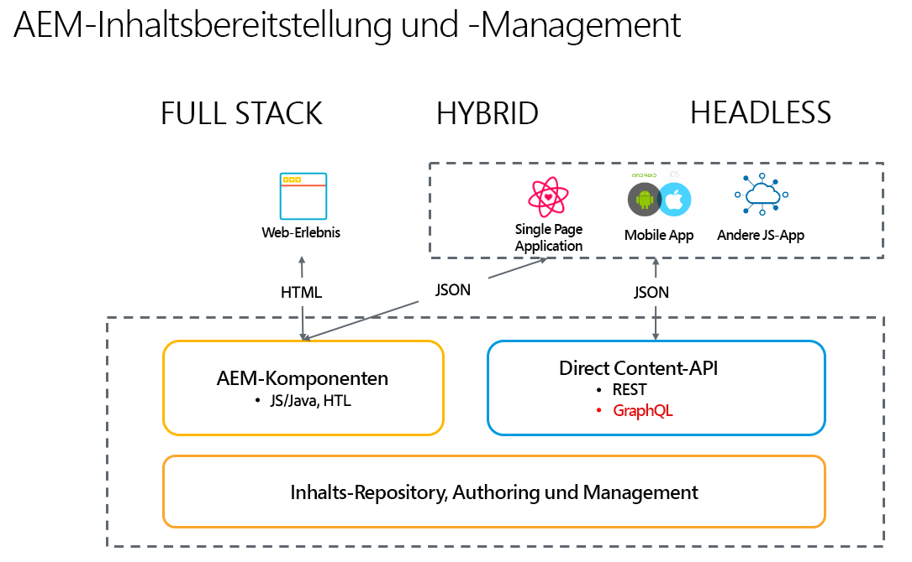

# Headless-Entwicklung für AEM 6.5 Sites {#headless-development}

Erfahren Sie, wie AEM leistungsstarken Headless-Funktionen wie Inhaltsmodelle, Inhaltsfragmente und die GraphQL-API von 6.5 zusammenarbeiten, damit Sie Ihre Erlebnisse zentral verwalten und kanalübergreifend bereitstellen können.

## Übersicht {#overview}

Die Headless-Implementierung wird immer wichtiger, wenn es darum geht, Erlebnisse für Ihr Zielgruppe überall und unabhängig vom Kanal bereitzustellen.

Die Headless-Implementierung verzichtet auf das Seiten- und Komponenten-Management, wie es bei Full-Stack- und Hybrid-Lösungen üblich ist, und konzentriert sich auf die Erstellung kanalneutraler, wiederverwendbarer Inhaltsfragmente und deren kanalübergreifende Bereitstellung. Es handelt sich um ein modernes und dynamisches Entwicklungsmuster zur Implementierung von Web-Erlebnissen.

## Vergleich von Headful und Headless {#headful-headless}

Dieses Dokument konzentriert sich auf das vollständige Headless-Implementierungsmodell von AEM. In AEM muss die Entscheidung zwischen Headful und Headless aber keine Entweder-Oder-Entscheidung sein. Headless-Funktionen können verwendet werden, um Content zu verwalten und für verschiedene Endpunkte bereitzustellen sowie um Inhaltserstellern gleichzeitig die Bearbeitung von Single Page Applications zu ermöglichen. Alles in AEM.

<!--
>[!TIP]
>
>See the document [Headful and Headless in AEM](/help/implementing/developing/headful-headless.md) for more information.
-->

## AEM 6.5 und Headless {#aem-headless}

AEM 6.5 ist ein flexibles Tool für die Headless-Implementierung, das drei leistungsstarke Dienste anbietet:

1. Inhaltsmodelle
   * Inhaltsmodelle sind strukturierte Darstellungen von Inhalten.
   * Diese werden von Informationsarchitekten im Inhaltsfragmentmodell-Editor in AEM definiert.
   * Inhaltsmodelle dienen als Grundlage für Inhaltsfragmente.
1. Inhaltsfragmente
   * Inhaltsfragmente sind Instanziierungen von Inhaltsmodellen.
   * Diese werden von Inhaltsautoren mit dem Inhaltsfragment-Editor in AEM erstellt.
   * Sie werden in AEM Assets gespeichert und in der Administrator-Benutzeroberfläche von Assets verwaltet.
1. Inhalts-API für die Bereitstellung
   * Die AEM-GraphQL-API unterstützt die Bereitstellung von Inhaltsfragmenten.
   * Die AEM Assets-REST-API unterstützt CRUD-Vorgänge für Inhaltsfragmente.
   * Die direkte Bereitstellung von Inhalten ist auch mit dem [JSON-Export der Kernkomponenten für Inhaltsfragmente](https://experienceleague.adobe.com/docs/experience-manager-core-components/using/components/content-fragment-component.html?lang=de) möglich.

## Erste Schritte mit AEM Headless {#first-steps}

Es stehen eine Reihe von Ressourcen zur Verfügung, mit denen Sie mit AEM Headless-Funktionen beginnen können. Sie sind für verschiedene Anwendungsfälle vorgesehen, bieten jedoch alle einen umfassenden Überblick über AEM Headless-Funktionen.

| Ressource | Beschreibung | Typ | Zielgruppe | Schätzung Zeit |
|---|---|---|---|---|
| [Praktisches Tutorial für die ersten Schritte mit AEM Headless](https://experienceleague.adobe.com/docs/experience-manager-learn/getting-started-with-aem-headless/graphql/multi-step/overview.html?lang=de) | **Wenn Sie einen praxisnahen Ansatz bevorzugen und mit AEM vertraut sind**, taucht dieses Tutorial direkt in die Erstellung eines einfachen Headless-Projekts ein. | Tutorial | Entwickler | 2 Stunden |

<!--
|Resource|Description|Type|Audience|Est. Time|
|---|---|---|---|---|
|[Headless Developer Journey](/help/journey-headless/developer/overview.md)|**For users new to AEM and headless** technologies, start here for a comprehensive introduction to AEM and its headless features from the theory of headless through going live with your first headless project.|Guide|Developers **new to AEM and headless**|1 hour|
|[Headless Getting Started Guide](/help/implementing/developing/headless/getting-started/introduction.md)|**For experienced AEM users** who need a short summary of the key AEM headless features, check out this quick start overview.|Quick Start|Developers, Administrators **with AEM experience**|20 minutes|
|[Getting Started with AEM Headless hands-on tutorial](https://experienceleague.adobe.com/docs/experience-manager-learn/getting-started-with-aem-headless/graphql/multi-step/overview.html)|**If you prefer a hands-on approach and are familiar with AEM**, this tutorial dives directly into creating a simple headless project.|Tutorial|Developers|2 hours|
-->
