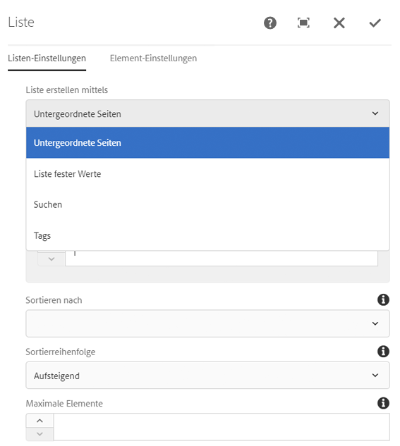
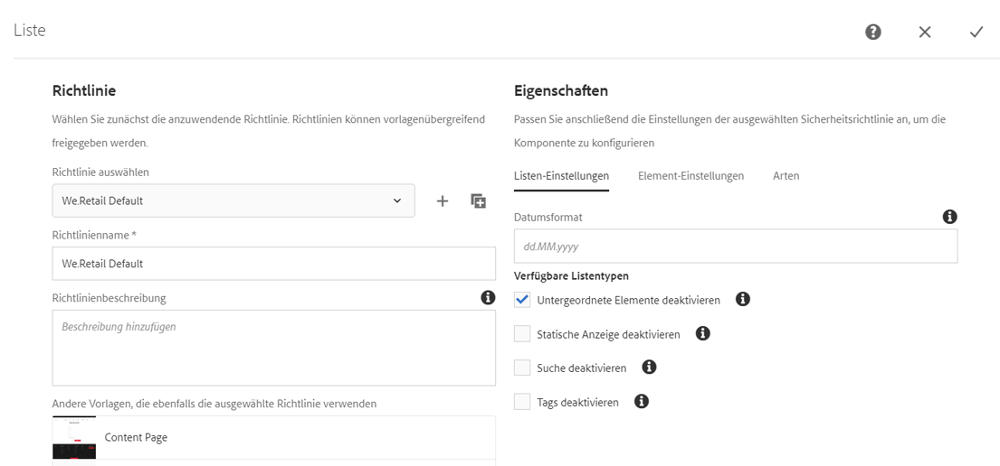
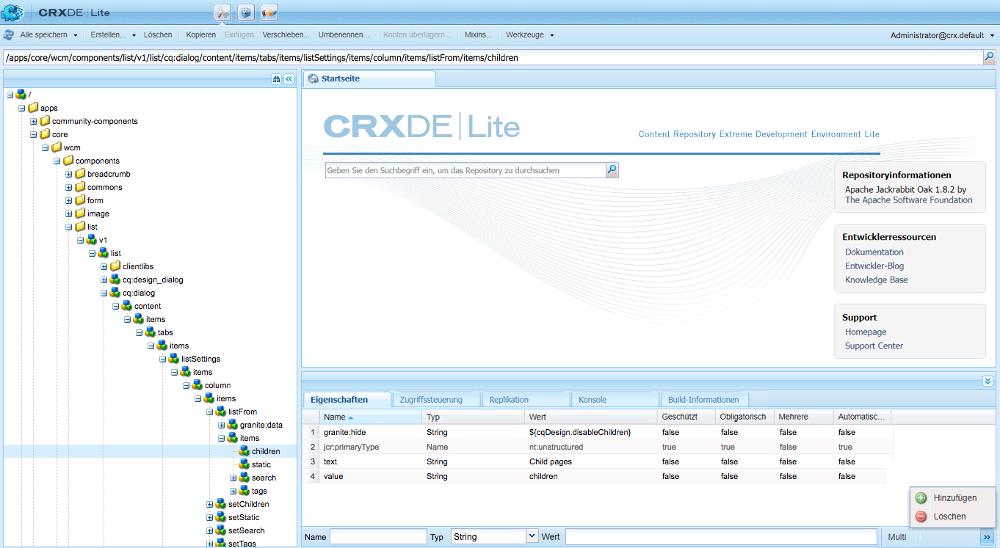
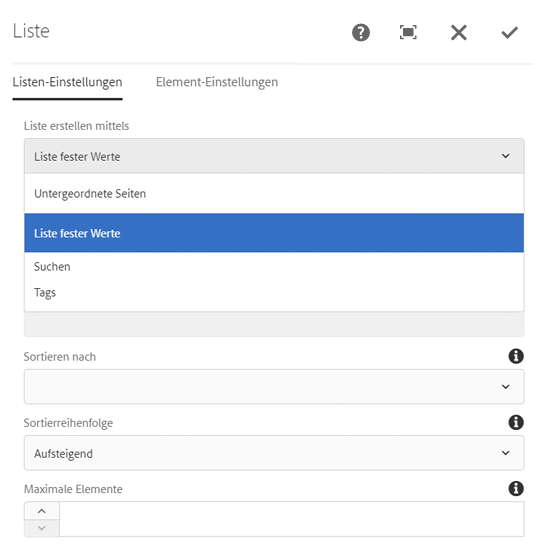

# Verwenden von Bedingungen zum Ausblenden  {#using-hide-conditions}

Bedingungen zum Ausblenden können verwendet werden, um festzustellen, ob eine Komponentenressource gerendert wird. Etwa wenn ein Vorlagenautor die Kernkomponente [Listenkomponente](https://helpx.adobe.com/experience-manager/core-components/using/list.html) im [Vorlageneditor](/help/sites-authoring/templates.md) konfiguriert und beschließt, die Optionen zum Erstellen der Liste auf Basis untergeordneter Seiten zu deaktivieren. Durch das Deaktivieren dieser Option im Designdialogfeld wird eine Eigenschaft so festgelegt, dass beim Rendern der Listenkomponente die Bedingung zum Ausblenden ausgewertet und die Option zum Anzeigen untergeordneter Seiten nicht angezeigt wird.

## Überblick {#overview}

Dialogfelder können aufgrund der zahlreichen Optionen sehr komplex für die Benutzer sein, die möglicherweise nur einen kleinen Teil der ihnen zur Verfügung stehenden Optionen nutzen. Dies kann dazu führen, dass die Benutzeroberfläche unübersichtlich wird.

Durch die Verwendung von Bedingungen zum Ausblenden haben Administratoren, Entwickler und Superuser die Möglichkeit, Ressourcen anhand von Regeln auszublenden. Mit dieser Funktion können sie entscheiden, welche Ressourcen angezeigt werden sollen, wenn ein Autor Inhalte bearbeitet.

>[!NOTE]
>
>Das Ausblenden einer Ressource auf Grundlage eines Ausdrucks ersetzt nicht die ACL-Berechtigungen. Der Inhalt bleibt bearbeitbar, wird aber einfach nicht angezeigt.

## Implementierung und Nutzungsdetails   {#implementation-and-usage-details}

`com.adobe.granite.ui.components.FilteringResourceWrapper` ist verantwortlich für das Filtern der Ressourcen basierend auf dem Vorhandensein und dem Wert der Eigenschaft `granite:hide` für das zu filternde Feld. Die Implementierung `/libs/cq/gui/components/authoring/dialog/dialog.jsp` umfasst eine Instanz von `FilteringResourceWrapper.`

Die Implementierung greift auf die [ELResolver-API](https://helpx.adobe.com/de/experience-manager/6-5/sites/developing/using/reference-materials/granite-ui/api/jcr_root/libs/granite/ui/docs/server/el.html) von Granite zurück und fügt über den ExpressionCustomizer eine benutzerdefinierte `cqDesign`-Variable hinzu.

Im Folgenden sind einige Beispiele für Bedingungen zum Ausblenden für einen Design-Knoten aufgeführt, die sich entweder unter `etc/design` befinden oder als Inhaltsrichtlinie vorliegen.

```
${cqDesign.myProperty}
${!cqDesign.myProperty}
${cqDesign.myProperty == 'someText'}
${cqDesign.myProperty != 'someText'}
${cqDesign.myProperty == true}
${cqDesign.myProperty == true}
${cqDesign.property1 == 'someText' && cqDesign.property2 || cqDesign.property3 != 1 || header.myHeader}
```

Beachten Sie beim Definieren Ihrer Bedingung zum Ausblenden Folgendes:

* Damit sie gültig ist, sollte der Bereich, in dem sich die Eigenschaft befindet, ausgedrückt werden (beispielsweise `cqDesign.myProperty`).
* Werte sind schreibgeschützt.
* Funktionen (falls erforderlich) sollten auf eine bestimmte, vom Service vorgegebene Auswahl beschränkt sein.

## Beispiel {#example}

Beispiele für Bedingungen zum Ausblenden finden sich überall in AEM und insbesondere in den [Kernkomponenten](https://docs.adobe.com/content/help/de/experience-manager-core-components/using/introduction.html). etwa der [Listenkernkomponente](https://helpx.adobe.com/experience-manager/core-components/using/list.html).

[Mit dem Vorlageneditor](/help/sites-authoring/templates.md) kann der Vorlagenautor im Design-Dialogfeld festlegen, welche Optionen der Listenkomponente dem Seitenautor zur Verfügung stehen. Optionen wie die, ob die Liste eine statische Liste, eine Liste mit untergeordneten Seiten, eine Liste getaggter Seiten usw. sein darf, können aktiviert oder deaktiviert werden.

Wenn Vorlagenautoren die Option für die untergeordneten Seiten deaktivieren, wird eine Designeigenschaft festgelegt und eine Bedingung zum Ausblenden dagegen ausgewertet, was dazu führt, dass die Option für Seitenautoren nicht gerendert wird.

1. Standardmäßig können Seitenautoren die Listenkernkomponente verwenden, um eine Liste mit untergeordneten Seiten zu erstellen, indem sie die Option **Untergeordnete Seiten** auswählen.

   

1. Im Design-Dialogfeld der Listenkomponente können Vorlagenautoren die Option **Untergeordnete Elemente deaktivieren** auswählen, um zu verhindern, dass Seitenautoren eine Liste mit untergeordneten Seiten angezeigt wird.

   

1. Ein Richtlinienknoten wird unter `/conf/we-retail/settings/wcm/policies/weretail/components/content/list` erstellt, wobei die Eigenschaft `disableChildren` auf `true` festgelegt wird.
1. Die Bedingung zum Ausblenden wird als Wert der Eigenschaft `granite:hide` des Dialogfeldeigenschafts-Knotens `/conf/we-retail/settings/wcm/policies/weretail/components/content/list` definiert.

   

1. Der Wert von `disableChildren` wird aus der Design-Konfiguration gezogen und der Ausdruck `${cqDesign.disableChildren}` wird als `false` ausgewertet, was bedeutet, dass die Option nicht als Teil der Komponente gerendert wird.

   Sie können den hide-Ausdruck als Wert der Eigenschaft `granite:hide` hier [auf GitHub](https://github.com/Adobe-Marketing-Cloud/aem-core-wcm-components/blob/master/content/src/content/jcr_root/apps/core/wcm/components/list/v1/list/_cq_dialog/.content.xml#L40) ansehen.

1. Die Option **Untergeordnete Seiten** wird für Seitenautoren bei Verwendung der Listenkomponente nicht mehr gerendert.

   
