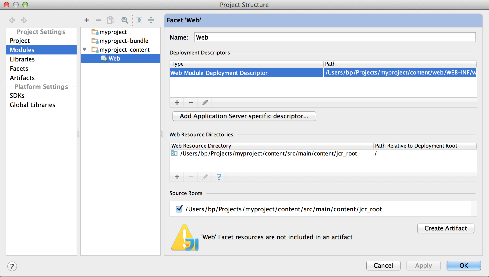

# Entwicklung von AEM-Projekten mit IntelliJ IDEA{#how-to-develop-aem-projects-using-intellij-idea}

## Überblick {#overview}

Die folgenden Schritte sind erforderlich, um mit der AEM-Entwicklung unter IntelliJ zu beginnen.

Im Rest dieser Anleitung werden die einzelnen Schritte genauer ausgeführt.

* Installieren von IntelliJ
* Einrichten Ihres AEM-Projekts auf Grundlage von Maven
* Vorbereiten der JSP-Unterstützung für IntelliJ im Maven-POM
* Importieren des Maven-Projekts in IntelliJ

>[!NOTE]
>
>Diese Anleitung basiert auf der IntelliJ IDEA Ultimate Edition 12.1.4 und AEM 5.6.1.

### Installieren von IntelliJ IDEA {#install-intellij-idea}

Laden Sie IntelliJ IDEA auf [der Downloadseite bei JetBrains](https://www.jetbrains.com/idea/download/index.html) herunter.

Folgen Sie anschließend den Installationsanweisungen auf der Seite.

### Einrichten Ihres AEM-Projekts auf Grundlage von Maven  {#set-up-your-aem-project-based-on-maven}

Richten Sie anschließend Ihr Projekt mit Maven ein, wie unter [Wie Sie AEM Projekte mit Apache Maven](/help/sites-developing/ht-projects-maven.md) erstellen beschrieben.

Um mit AEM Projekten in IntelliJ IDEA zu arbeiten, genügt das grundlegende Setup unter [Erste Schritte in 5 Minuten](https://maven.apache.org/guides/getting-started/maven-in-five-minutes.html).

### Vorbereiten der JSP-Unterstützung für IntelliJ IDEA {#prepare-jsp-support-for-intellij-idea}

IntelliJ IDEA bietet darüber hinaus Unterstützung für die Arbeit mit JSP, z. B.

* automatische Vervollständigung von Tag-Bibliotheken,
* Achtsamkeit der von `<cq:defineObjects />` und `<sling:defineObjects />` definierten Objekte

Um dies zu erreichen, befolgen Sie die Anweisungen unter [So-Arbeiten mit JSPs](/help/sites-developing/ht-projects-maven.md#how-to-work-with-jsps) in [Anleitung zum Erstellen AEM Projekte mit Apache Maven](/help/sites-developing/ht-projects-maven.md).

### Importieren des Maven-Projekts {#import-the-maven-project}

1. Öffnen Sie das Dialogfeld **Import** in IntelliJ IDEA von

   * Wählen Sie auf dem Startbildschirm **Projekt importieren**, wenn noch kein Projekt geöffnet ist.
   * Wählen Sie **Datei -> Projekt importieren** aus dem Hauptmenü

1. Wählen Sie im Importdialogfeld die POM-Datei Ihres Projekts aus.

   

1. Fahren Sie, wie im folgenden Dialogfeld zu sehen, mit den Standardeinstellungen fort.

   

1. Fahren Sie mit den folgenden Dialogfeldern fort, indem Sie auf **Weiter** und **Fertigstellen** klicken.
1. Sie können nun mit der AEM-Entwicklung mit IntelliJ IDEA beginnen!

   

### Debuggen von JSPs mit IntelliJ IDEA {#debugging-jsps-with-intellij-idea}

Zum Debuggen von JSPs mit IntelliJ IDEA sind die folgenden Schritte notwendig:

* Richten Sie ein Web-Facet im Projekt ein.
* Installieren des Plug-ins zur JSR45-Unterstützung
* Konfigurieren Sie ein Debugprofil.
* Konfigurieren Sie AEM für den Debugmodus.

#### Richten Sie ein Web-Facet im Projekt ein.  {#set-up-a-web-facet-in-the-project}

IntelliJ IDEA muss wissen, wo die JSPs zum Debuggen gefunden werden können. Da IDEA die `content-package-maven-plugin`-Einstellungen nicht interpretieren kann, muss dies manuell konfiguriert werden.

1. Gehen Sie zu **Datei -> Projektstruktur**
1. Wählen Sie das Modul **Inhalt** aus.
1. Klicken Sie auf **+** über der Liste der Module und wählen Sie **Web**
1. Wählen Sie als Web-Ressourcen-Verzeichnis das `content/src/main/content/jcr_root subdirectory` Ihres Projekts aus, wie im Screenshot unten dargestellt.



#### Installieren des Plug-ins zur JSR45-Unterstützung {#install-the-jsr-support-plugin}

1. Wechseln Sie in den IntelliJ IDEA-Einstellungen zum Bereich **Plugins**
1. Navigieren Sie zum **JSR45 Integration**-Plugin und aktivieren Sie das Kontrollkästchen neben diesem
1. Klicken Sie auf **Übernehmen**
1. Starten Sie IntelliJ IDEA neu, wenn Sie dazu aufgefordert werden.


#### Konfigurieren Sie ein Debugprofil.{#configure-a-debug-profile}

1. Gehen Sie zu **Ausführen -> Konfigurationen bearbeiten**
1. Heben Sie **+** auf und wählen Sie **JSR45 Remote**
1. Wählen Sie im Konfigurationsdialogfeld **Konfigurieren** neben **Anwendungsserver** und konfigurieren Sie einen generischen Server
1. Legen Sie die Startseite auf eine passende URL fest, wenn Sie beim Beginn des Debuggens einen Browser öffnen möchten.
1. Entfernen Sie alle **Vor dem Start**-Aufgaben, wenn Sie vlt autosync verwenden, oder konfigurieren Sie geeignete Maven-Aufgaben, wenn Sie dies nicht tun
1. Passen Sie im Bereich **Startup/Connection** den Anschluss bei Bedarf an
1. Kopieren Sie die Befehlszeilenargumente, die IntelliJ IDEA vorschlägt.

 

#### Konfigurieren Sie AEM für den Debugmodus.{#configure-aem-for-debug-mode}

Starten Sie als letzten erforderlichen Schritt AEM mit den von IntelliJ IDEA vorgeschlagenen JVM-Optionen.

Starten Sie dazu die AEM-JAR-Datei direkt und fügen Sie diese Optionen hinzu, zum Beispiel mit der folgenden Befehlszeile:

`java -Xdebug -Xrunjdwp:transport=dt_socket,address=58242,suspend=n,server=y -Xmx1024m -XX:MaxPermSize=256M -jar cq-quickstart-5.6.1.jar`

Sie haben auch die Möglichkeit, diese Optionen, wie im Folgenden zu sehen, Ihrem Startskript in `crx-quickstart/bin/start` hinzuzufügen.

```shell
# ...

# default JVM options
if [ -z "$CQ_JVM_OPTS" ]; then
 CQ_JVM_OPTS='-server -Xmx1024m -XX:MaxPermSize=256M -Djava.awt.headless=true'
fi

CQ_JVM_OPTS="$CQ_JVM_OPTS -Xdebug -Xrunjdwp:transport=dt_socket,address=58242,suspend=n,server=y"

# ...
```

#### Starten des Debuggens {#start-debugging}

Sie können nun mit dem Debuggen Ihrer JSPs in AEM beginnen.

1. Wählen Sie **Ausführen -> Debuggen -> Ihr Debug-Profil**
1. Legen Sie in Ihrem Komponentencode Haltepunkte fest.
1. Greifen Sie in Ihrem Browser auf eine Seite zu.


### Debuggen von Paketen mit IntelliJ IDEA {#debugging-bundles-with-intellij-idea}

Code in Paketen können Sie mithilfe einer standardmäßigen generischen Debug-Remoteverbindung debuggen. Weitere Informationen finden Sie in der [JetBrains-Dokumentation zum Remote-Debugging](https://www.jetbrains.com/idea/webhelp/run-debug-configuration-remote.html).
