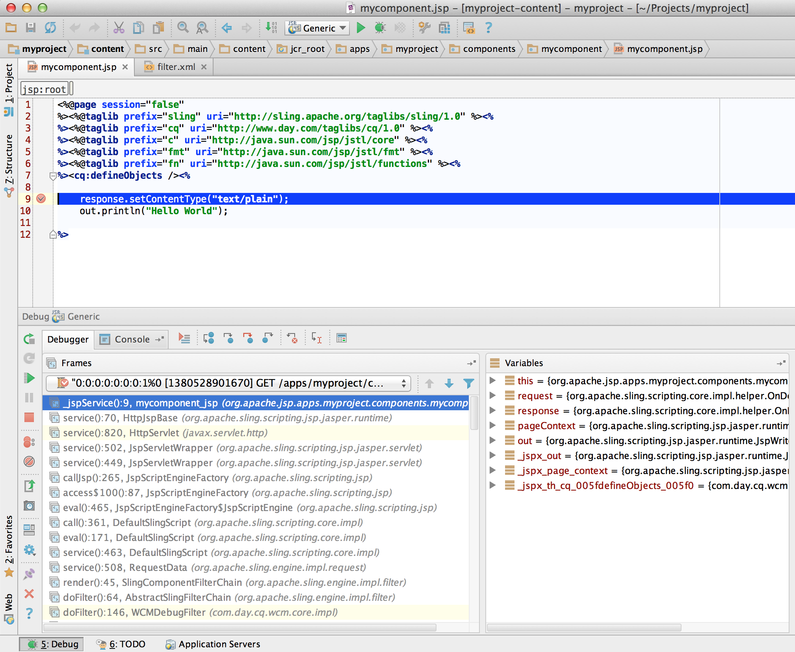

# Entwicklung von AEM-Projekten mit IntelliJ IDEA{#how-to-develop-aem-projects-using-intellij-idea}

## Übersicht {#overview}

Um mit der AEM-Entwicklung auf IntelliJ zu beginnen, sind die folgenden Schritte erforderlich.

Jeder Schritt wird später in diesem Thema ausführlicher erläutert.

* Installieren von IntelliJ
* Einrichten Ihres AEM-Projekts auf Grundlage von Maven
* Vorbereiten der JSP-Unterstützung für IntelliJ im Maven-POM
* Importieren des Maven-Projekts in IntelliJ

>[!NOTE]
>
>Dieses Handbuch basiert auf IntelliJ IDEA Ultimate Edition 12.1.4 und AEM 5.6.1.

### Installieren von IntelliJ IDEA {#install-intellij-idea}

Laden Sie IntelliJ IDEA von [der Download-Seite bei JetBrains](https://www.jetbrains.com/idea/download/) herunter.

Folgen Sie anschließend den Installationsanweisungen auf der Seite.

### Einrichten Ihres AEM-Projekts auf Grundlage von Maven {#set-up-your-aem-project-based-on-maven}

Richten Sie Ihr Projekt anschließend wie in [So erstellen Sie AEM-Projekte mit Apache Maven](/help/sites-developing/ht-projects-maven.md) beschrieben mit Maven ein.

Beginnen Sie damit, AEM-Projekte in IntelliJ IDEA zu bearbeiten, indem Sie sich an dem in [Erste Schritte in 5 Minuten](https://maven.apache.org/guides/getting-started/maven-in-five-minutes.html) beschriebenen grundlegenden Setup orientieren.

### Vorbereiten der JSP-Unterstützung für IntelliJ IDEA {#prepare-jsp-support-for-intellij-idea}

IntelliJ IDEA kann auch die Arbeit mit JSP unterstützen, z. B.:

* automatische Vervollständigung von Tag-Bibliotheken
* Wahrnehmung von Objekten, die durch `<cq:defineObjects />` und `<sling:defineObjects />` definiert sind

Folgen Sie den Anweisungen im Abschnitt [So arbeiten Sie mit JSPs](/help/sites-developing/ht-projects-maven.md#how-to-work-with-jsps) in [So erstellen Sie AEM-Projekte mit Apache Maven](/help/sites-developing/ht-projects-maven.md), damit das funktioniert.

### Importieren des Maven-Projekts {#import-the-maven-project}

1. Öffnen Sie das Dialogfeld **Importieren** in IntelliJ IDEA, indem Sie

   * auf dem Willkommensbildschirm **Projekt importieren** auswählen, sofern Sie noch kein Projekt geöffnet haben, oder
   * Auswählen von **Datei > Projekt importieren** im Hauptmenü

1. Wählen Sie im Importdialogfeld die POM-Datei Ihres Projekts aus.

   

1. Fahren Sie, wie im folgenden Dialogfeld zu sehen, mit den Standardeinstellungen fort.

   

1. Navigieren Sie durch die folgenden Dialogfelder, indem Sie auf **Weiter** und **Beenden** klicken.
1. Sie können nun mit der AEM-Entwicklung mit IntelliJ IDEA beginnen!

   

### Debuggen von JSPs mit IntelliJ IDEA {#debugging-jsps-with-intellij-idea}

Zum Debuggen von JSPs mit IntelliJ IDEA sind die folgenden Schritte notwendig:

* Einrichten einer Web-Facette im Projekt
* Installieren des Plug-ins zur JSR45-Unterstützung
* Konfigurieren eines Debug-Profils
* AEM für den Debugging-Modus konfigurieren

#### Einrichten einer Web-Facette im Projekt {#set-up-a-web-facet-in-the-project}

IntelliJ IDEA muss wissen, wo die JSPs zum Debugging zu finden sind. Da IDEA die `content-package-maven-plugin`-Einstellungen nicht interpretieren kann, muss es manuell konfiguriert werden.

1. Gehen Sie zu **Datei > Projektstruktur**.
1. Wählen Sie das Modul **Inhalte** aus
1. Klicken Sie über der Modulliste auf **+** und wählen Sie **Web** aus.
1. Wählen Sie als Webressourcen-Verzeichnis das `content/src/main/content/jcr_root subdirectory` Ihres Projekts, wie im folgenden Screenshot gezeigt.


#### Installieren des Plug-ins zur JSR45-Unterstützung {#install-the-jsr-support-plugin}

1. Rufen Sie in den Einstellungen von IntelliJ IDEA das Fenster **Plug-ins** auf.
1. Gehen Sie zum Plug-in **JSR45-Integration** und aktivieren Sie das Kontrollkästchen daneben.
1. Klicken Sie auf **Übernehmen**
1. Starten Sie IntelliJ IDEA neu, wenn Sie dazu aufgefordert werden.


#### Konfigurieren Sie ein Debugprofil. {#configure-a-debug-profile}

1. Gehen Sie zu **Ausführen > Konfigurationen bearbeiten**.
1. Klicken Sie auf das **+** und wählen Sie **JSR45 Remote** aus.
1. Wählen Sie im Konfigurationsdialogfeld **Konfigurieren** neben **Anwendungsserver** aus und konfigurieren Sie einen generischen Server.
1. Legen Sie die Startseite auf eine passende URL fest, wenn Sie beim Beginn des Debuggens einen Browser öffnen möchten.
1. Alle entfernen **Vor dem Start** Aufgaben, wenn Sie vlt autosync verwenden, oder konfigurieren Sie geeignete Maven-Aufgaben, falls Sie dies nicht tun
1. Passen Sie im Fenster **Start/Verbindung** den Port an, sofern erforderlich.
1. Kopieren Sie die Befehlszeilenargumente, die IntelliJ IDEA vorschlägt.

 

#### AEM für den Debugging-Modus konfigurieren {#configure-aem-for-debug-mode}

Der letzte erforderliche Schritt besteht darin, AEM mit den von IntelliJ IDEA vorgeschlagenen JVM-Optionen zu starten.

Starten Sie dazu die AEM-JAR-Datei direkt und fügen Sie diese Optionen hinzu, zum Beispiel mit der folgenden Befehlszeile:

`java -Xdebug -Xrunjdwp:transport=dt_socket,address=58242,suspend=n,server=y -Xmx1024m -jar cq-quickstart-6.5.0.jar`

Sie haben auch die Möglichkeit, diese Optionen, wie im Folgenden zu sehen, Ihrem Startskript in `crx-quickstart/bin/start` hinzuzufügen.

```shell
# ...

# default JVM options
if [ -z "$CQ_JVM_OPTS" ]; then
 CQ_JVM_OPTS='-server -Xmx1024m -Djava.awt.headless=true'
fi

CQ_JVM_OPTS="$CQ_JVM_OPTS -Xdebug -Xrunjdwp:transport=dt_socket,address=58242,suspend=n,server=y"

# ...
```

#### Starten des Debuggens {#start-debugging}

Sie können nun mit dem Debuggen Ihrer JSPs in AEM beginnen.

1. Wählen Sie **Ausführen > Debugging > Ihr Debugging-Profil** aus.
1. Legen Sie in Ihrem Komponenten-Code Haltepunkte fest.
1. Greifen Sie in Ihrem Browser auf eine Seite zu.



### Debuggen von Paketen mit IntelliJ IDEA {#debugging-bundles-with-intellij-idea}

Code in Paketen können Sie mithilfe einer standardmäßigen generischen Remote-Debugging-Verbindung debuggen. Weitere Informationen finden Sie in der [Jetbrain-Dokumentation zum Remote-Debugging](https://www.jetbrains.com/help/idea/remote-debugging-with-product.html#remote-interpreter).
