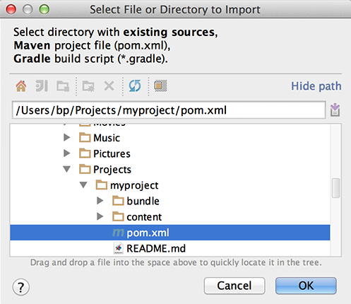

# Entwicklung von AEM-Projekten mit IntelliJ IDEA{#how-to-develop-aem-projects-using-intellij-idea}

## Übersicht {#overview}

Um mit AEM Entwicklung auf IntelliJ zu beginnen, sind die folgenden Schritte erforderlich.

Jeder Schritt wird im Rest dieses Themas ausführlicher erläutert.

* Installieren von IntelliJ
* Richten Sie Ihr AEM Projekt auf Grundlage von Maven ein.
* Vorbereiten der JSP-Unterstützung für IntelliJ im Maven-POM
* Importieren des Maven-Projekts in IntelliJ

>[!NOTE]
>
>Dieses Handbuch basiert auf IntelliJ IDEA Ultimate Edition 12.1.4 und AEM 5.6.1.

### Installieren von IntelliJ IDEA {#install-intellij-idea}

IntelliJ IDEA herunterladen [die Downloadseite bei JetBrains](https://www.jetbrains.com/idea/download/).

Folgen Sie dann den Installationsanweisungen auf dieser Seite.

### Richten Sie Ihr AEM Projekt auf Grundlage von Maven ein. {#set-up-your-aem-project-based-on-maven}

Richten Sie Ihr Projekt anschließend wie in [So erstellen Sie AEM-Projekte mit Apache Maven](/help/sites-developing/ht-projects-maven.md) beschrieben mit Maven ein.

Um mit AEM Projekten in IntelliJ IDEA zu arbeiten, müssen Sie die grundlegende Einrichtung in [Erste Schritte in 5 Minuten](https://maven.apache.org/guides/getting-started/maven-in-five-minutes.html) ausreichend ist.

### Vorbereiten der JSP-Unterstützung für IntelliJ IDEA {#prepare-jsp-support-for-intellij-idea}

IntelliJ IDEA kann auch die Arbeit mit JSP unterstützen, z. B.:

* automatische Vervollständigung von Tag-Bibliotheken
* Wahrnehmung von Objekten, die durch `<cq:defineObjects />` und `<sling:defineObjects />` definiert sind

Folgen Sie den Anweisungen im Abschnitt [So arbeiten Sie mit JSPs](/help/sites-developing/ht-projects-maven.md#how-to-work-with-jsps) in [So erstellen Sie AEM-Projekte mit Apache Maven](/help/sites-developing/ht-projects-maven.md), damit das funktioniert.

### Importieren des Maven-Projekts {#import-the-maven-project}

1. Öffnen Sie das Dialogfeld **Importieren** in IntelliJ IDEA, indem Sie

   * auf dem Willkommensbildschirm **Projekt importieren** auswählen, sofern Sie noch kein Projekt geöffnet haben, oder
   * **Datei -> Projekt importieren** im Hauptmenü auswählen.

1. Wählen Sie im Importdialogfeld die POM-Datei Ihres Projekts aus.

   

1. Fahren Sie, wie im folgenden Dialogfeld zu sehen, mit den Standardeinstellungen fort.

   

1. Navigieren Sie durch die folgenden Dialogfelder, indem Sie auf **Weiter** und **Beenden** klicken.
1. Sie können nun mit der AEM-Entwicklung mit IntelliJ IDEA beginnen!

   

### Debugging von JSPs mit IntelliJ IDEA {#debugging-jsps-with-intellij-idea}

Die folgenden Schritte sind zum Debugging von JSPs mit IntelliJ IDEA erforderlich

* Einrichten einer Web-Facette im Projekt
* Installieren des Plug-ins zur JSR45-Unterstützung
* Konfigurieren eines Debug-Profils
* AEM für den Debug-Modus konfigurieren

#### Einrichten einer Web-Facette im Projekt {#set-up-a-web-facet-in-the-project}

IntelliJ IDEA muss wissen, wo die JSPs zum Debugging zu finden sind. Da IDEA die `content-package-maven-plugin` -Einstellungen, muss sie manuell konfiguriert werden.

1. Gehen Sie zu **Datei -> Projektstruktur**
1. Wählen Sie das Modul **Inhalte** aus
1. Klicken Sie über der Modulliste auf **+** und wählen Sie **Web** aus.
1. Wählen Sie als Verzeichnis der Web-Ressourcen die `content/src/main/content/jcr_root subdirectory` des Projekts, wie im Screenshot unten dargestellt.


#### Installieren des Plug-ins zur JSR45-Unterstützung {#install-the-jsr-support-plugin}

1. Rufen Sie in den Einstellungen von IntelliJ IDEA das Fenster **Plug-ins** auf.
1. Gehen Sie zum Plug-in **JSR45-Integration** und aktivieren Sie das Kontrollkästchen daneben.
1. Klicken Sie auf **Übernehmen**
1. Starten Sie IntelliJ IDEA neu, wenn Sie dazu aufgefordert werden.


#### Konfigurieren Sie ein Debugprofil. {#configure-a-debug-profile}

1. Gehen Sie zu **Ausführen -> Konfigurationen bearbeiten**
1. Klicken Sie auf das **+** und wählen Sie **JSR45 Remote** aus.
1. Wählen Sie im Konfigurationsdialogfeld **Konfigurieren** neben **Anwendungsserver** aus und konfigurieren Sie einen generischen Server.
1. Legen Sie die Startseite auf eine passende URL fest, wenn Sie beim Beginn des Debuggens einen Browser öffnen möchten.
1. Entfernen Sie alle **Vor dem Start**-Aufgaben, falls Sie die automatische Synchronisierung von VLT nutzen, oder konfigurieren Sie geeignete Maven-Aufgaben, falls nicht.
1. Im **Start/Verbindung** Bereich, passen Sie bei Bedarf den Anschluss an.
1. Kopieren Sie die Befehlszeilenargumente, die IntelliJ IDEA vorschlägt.

 

#### AEM für den Debug-Modus konfigurieren {#configure-aem-for-debug-mode}

Der letzte erforderliche Schritt besteht darin, mit den von IntelliJ IDEA vorgeschlagenen JVM-Optionen zu AEM.

Starten Sie die AEM JAR-Datei direkt und fügen Sie diese Optionen hinzu, z. B. mit der folgenden Befehlszeile:

`java -Xdebug -Xrunjdwp:transport=dt_socket,address=58242,suspend=n,server=y -Xmx1024m -jar cq-quickstart-6.5.0.jar`

Sie haben auch die Möglichkeit, diese Optionen, wie im Folgenden zu sehen, Ihrem Startskript in `crx-quickstart/bin/start` hinzuzufügen.

```shell
# ...

# default JVM options
if [ -z "$CQ_JVM_OPTS" ]; then
 CQ_JVM_OPTS='-server -Xmx1024m -Djava.awt.headless=true'
fi

CQ_JVM_OPTS="$CQ_JVM_OPTS -Xdebug -Xrunjdwp:transport=dt_socket,address=58242,suspend=n,server=y"

# ...
```

#### Debugging starten {#start-debugging}

Sie sind jetzt alle für das Debugging Ihrer JSPs in AEM eingerichtet.

1. Wählen Sie **Ausführen -> Debuggen** und anschließend Ihr Debugprofil aus.
1. Festlegen von Haltepunkten im Komponenten-Code
1. Zugriff auf eine Seite in Ihrem Browser


### Debuggen von Paketen mit IntelliJ IDEA {#debugging-bundles-with-intellij-idea}

Code in Bundles kann mit einer standardmäßigen generischen Remote-Debug-Verbindung debuggt werden. Sie können dem [JetBrain-Dokumentation zum Remote-Debugging](https://www.jetbrains.com/help/idea/remote-debugging-with-product.html#remote-interpreter).
