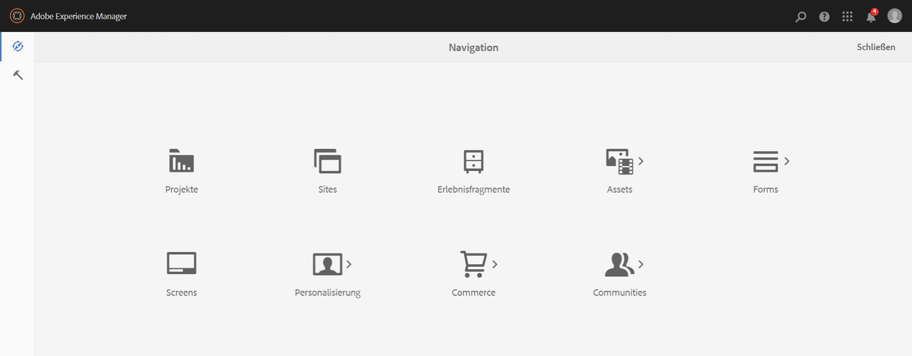

# Internationalisierung von UI-Zeichenfolgen {#internationalizing-ui-strings}

Mit Java- und JavaScript-APIs können Sie Zeichenfolgen in den folgenden Ressourcentypen internationalisieren:

* Java-Quelldateien.
* JSP-Skripte.
* JavaScript in clientseitigen Bibliotheken oder in der Seitenquelle.
* JCR-Knoteneigenschaftswerte, die in Dialogfeldern und Komponentenkonfigurationseigenschaften verwendet werden.

Einen Überblick über den Internationalisierungs- und Lokalisierungsprozess finden Sie unter [Internationalisierung von Komponenten](/help/sites-developing/i18n.md).

## Internationalisieren von Zeichenfolgen in Java- und JSP-Code {#internationalizing-strings-in-java-and-jsp-code}

Mit dem Java-Paket `com.day.cq.i18n` können Sie lokalisierte Zeichenfolgen in Ihrer Benutzeroberfläche anzeigen. Die `I18n`-Klasse stellt die `get`-Methode zur Verfügung, die lokalisierte Zeichenfolgen aus dem AEM-Wörterbuch abruft. Der einzige erforderliche Parameter der `get`-Methode ist das Literal des Zeichenfolgen in englischer Sprache. Englisch ist die standardmäßige Sprache der UI. Im folgenden Beispiel wird das Wort `Search` lokalisiert:

`i18n.get("Search");`

Das Identifizieren der Zeichenfolge in englischer Sprache unterscheidet sich von typischen Internationalisierungs-Frameworks, bei denen eine ID eine Zeichenfolge identifiziert und zur Laufzeit zum Verweisen auf die Zeichenfolge verwendet wird. Die Verwendung des englischen Zeichenfolgenliterals bietet die folgenden Vorteile:

* Code ist leicht zu verstehen.
* Die Zeichenfolge in der Standardsprache ist immer verfügbar.

### Festlegen der Sprache des Benutzers {#determining-the-user-s-language}

Es gibt zwei Möglichkeiten, die Sprache zu bestimmen, die der Benutzer bevorzugt:

* Legen Sie für authentifizierte Benutzer die Sprache in den Voreinstellungen im Benutzerkonto fest.
* Das Gebietsschema der angeforderten Seite.

Die Spracheigenschaft des Benutzerkontos ist die bevorzugte Methode, da sie zuverlässiger ist. Der Benutzer muss jedoch angemeldet sein, um diese Methode verwenden zu können.

#### I18n-Java-Objekt erstellen {#creating-the-i-n-java-object}

Die I18n-Klasse stellt zwei Konstruktoren bereit. Wie Sie die bevorzugte Sprache des Benutzers bestimmen, bestimmt den zu verwendenden Konstruktor.

Um die Zeichenfolge in der Sprache darzustellen, die im Benutzerkonto angegeben ist, verwenden Sie den folgenden Konstruktor (nachdem Sie `com.day.cq.i18n.I18n)` importiert haben):

```java
I18n i18n = new I18n(slingRequest);
```

Der Konstruktor verwendet `SlingHTTPRequest`, um die Spracheinstellung des Benutzers abzurufen.

Um mithilfe des Gebietsschemas der Seite die Sprache zu bestimmen, müssen Sie zunächst das ResourceBundle für die Sprache der angeforderten Seite abrufen:

```java
Locale pageLang = currentPage.getLanguage(false);
ResourceBundle resourceBundle = slingRequest.getResourceBundle(pageLang);
I18n i18n = new I18n(resourceBundle);
```

#### Internationalisierung eines Strings {#internationalizing-a-string}

Verwenden Sie die `get`-Methode des `I18n`-Objekts, um eine Zeichenfolge zu internationalisieren. Der einzige erforderliche Parameter der `get`-Methode ist die Zeichenfolge, die internationalisiert werden soll. Die Zeichenfolge entspricht einer Zeichenfolge in einem Übersetzer-Wörterbuch. Die get -Methode sucht die Zeichenfolge im Wörterbuch und gibt die Übersetzung für die aktuelle Sprache zurück.

Das erste Argument der `get`-Methode muss folgende Regeln einhalten:

* Der Wert muss ein Zeichenfolgenliteral sein. Eine Variable des Typs `String` ist nicht zulässig.
* Das Zeichenfolgenliteral muss in einer einzigen Zeile ausdrücken.
* Bei der Zeichenfolge wird zwischen Groß- und Kleinschreibung unterschieden.

```xml
i18n.get("Enter a search keyword");
```

#### Verwenden von Übersetzungshinweisen {#using-translation-hints}

Geben Sie den [Übersetzungshinweis](/help/sites-developing/i18n-translator.md#adding-changing-and-removing-strings) der internationalisierten Zeichenfolge an, um zwischen mehrfach vorhandenen Zeichenfolgen im Wörterbuch zu unterscheiden. Geben Sie den Übersetzungshinweis mit dem zweiten, optionalen Parameter der `get`-Methode an. Der Übersetzungshinweis muss mit der Kommentareigenschaft des Elements im Wörterbuch genau übereinstimmen.

Beispielsweise enthält das Wörterbuch die Zeichenfolge `Request` zweimal: einmal als Verb und einmal als Substantiv. Der folgende Code enthält den Übersetzungshinweis als Argument in der `get`-Methode:

```java
i18n.get("Request","A noun, as in a request for a web page");
```

#### Einschließen von Variablen in lokalisierten Sätzen {#including-variables-in-localized-sentences}

Sie können Variablen in die lokalisierte Zeichenfolge einfügen, um dem Satz Kontextbedeutung zu geben. Ein Beispiel: Nach der Anmeldung bei einer Webanwendung wird auf der Homepage folgende Nachricht angezeigt: „Willkommen zurück, Administrator. Sie haben zwei Nachrichten in Ihrem Posteingang.“ Der Seitenkontext bestimmt den Benutzernamen und die Anzahl der Nachrichten.

[Im Wörterbuch](/help/sites-developing/i18n-translator.md#adding-changing-and-removing-strings)festgelegt ist, werden die Variablen in Zeichenfolgen in Klammern als Indizes dargestellt. Geben Sie die Werte der Variablen als Argumente der `get`-Methode an. Die Argumente werden nach dem Übersetzungshinweis platziert und die Indizes entsprechen der Reihenfolge der Argumente:

```xml
i18n.get("Welcome back {0}. You have {1} messages.", "user name, number of messages", user.getDisplayName(), numItems);
```

Die internationalisierte Zeichenfolge und der Übersetzungshinweis müssen genau mit der Zeichenfolge und dem Kommentar im Wörterbuch übereinstimmen. Sie können den Lokalisierungshinweis auslassen, indem Sie einen `null`-Wert als zweites Argument angeben.

#### Verwendung der statischen get-Methode {#using-the-static-get-method}

Die `I18N`-Klasse definiert eine statische `get`-Methode, die sich zur Lokalisierung einer kleinen Anzahl von Zeichenfolgen eignet. Zusätzlich zu den Parametern der `get`-Methode eines Objekts benötigt die statische Methode das Objekt `SlingHttpRequest` oder das `ResourceBundle`, das Sie verwenden, je nachdem, wie Sie die bevorzugte Sprache des Nutzers bestimmen:

* Wenn Sie die Spracheinstellungen des Nutzers verwenden, geben Sie das SlingHttpRequest-Objekt als ersten Parameter an.

  `I18n.get(slingHttpRequest, "Welcome back {}. You have {} messages.", "user name, number of messages", user.getDisplayName(), numItems);`
* Wenn Sie die Seitensprache verwenden, geben Sie das ResourceBundle als ersten Parameter an.

  `I18n.get(resourceBundle,"Welcome back {}. You have {} messages.", "user name, number of messages", user.getDisplayName(), numItems);`

### Internationalisieren von Zeichenfolgen in JavaScript-Code {#internationalizing-strings-in-javascript-code}

Mit der JavaScript-API können Sie Zeichenfolgen auf dem Client lokalisieren. Als [Java und JSP](#internationalizing-strings-in-java-and-jsp-code) -Code, können Sie mit der JavaScript-API zu lokalisierende Zeichenfolgen identifizieren, Lokalisierungshinweise bereitstellen und Variablen in die lokalisierten Zeichenfolgen aufnehmen.

Die `granite.utils` [Client-Bibliotheksordner](/help/sites-developing/clientlibs.md) stellt die JavaScript-API bereit. Um die API zu verwenden, fügen Sie diesen Client-Bibliotheksordner in Ihre Seite ein. Lokalisierungsfunktionen verwenden den `Granite.I18n`-Namespace.

Bevor Sie lokalisierte Zeichenfolgen darstellen, müssen Sie das Gebietsschema mithilfe der `Granite.I18n.setLocale`-Funktion festlegen. Diese Funktion erfordert den Sprach-Code des Gebietsschemas als Argument:

```
Granite.I18n.setLocale("fr");
```

Um eine lokalisierte Zeichenfolge darzustellen, verwenden Sie die Funktion `Granite.I18n.get`:

```
Granite.I18n.get("string to localize");
```

Im folgenden Beispiel wird die Zeichenfolge &quot;Welcome back&quot;internationalisiert:

```
Granite.I18n.setLocale("fr");
Granite.I18n.get("string to localize", [variables], "localization hint");
```

Die Funktionsparameter unterscheiden sich von der Java I18n.get -Methode:

* Der erste Parameter ist das zu lokalisierende Zeichenfolgenliteral.
* Der zweite Parameter ist ein Array von Werten, die in das Zeichenfolgenliteral eingefügt werden sollen.
* Der dritte Parameter ist der Lokalisierungshinweis.

Im folgenden Beispiel wird JavaScript verwendet, um den &quot;Welcome back Administrator&quot;zu lokalisieren. Sie haben zwei Nachrichten in Ihrem Posteingang.“ Satz:

```
Granite.I18n.setLocale("fr");
Granite.I18n.get("Welcome back {0}. You have {1} new messages in your inbox.", [username, numMsg], "user name, number of messages");
```

### Internationalisieren von Zeichenfolgen von JCR-Knoten {#internationalizing-strings-from-jcr-nodes}

Benutzeroberflächen-Zeichenfolgen basieren häufig auf den JCR-Knoteneigenschaften. Die Eigenschaft `jcr:title` einer Seite wird beispielsweise häufig als Inhalt des `h1`-Elements im Seiten-Code verwendet. Die `I18n`-Klasse stellt die `getVar`-Methode zur Lokalisierung dieser Zeichenfolgen bereit.

Das folgende JSP-Skriptbeispiel ruft die `jcr:title`-Eigenschaft aus dem Repository ab und zeigt die folgende lokalisierte Zeichenfolge auf der Seite an:

```java
<% title = properties.get("jcr:title", String.class);%>
<h1><%=i18n.getVar(title) %></h1>
```

#### Festlegen von Übersetzungshinweisen für JCR-Knoten {#specifying-translation-hints-for-jcr-nodes}

Ähnlich wie [Übersetzungshinweise in der Java-API](#using-translation-hints)können Sie Übersetzungshinweise bereitstellen, um doppelte Zeichenfolgen im Wörterbuch zu unterscheiden. Geben Sie den Übersetzungshinweis als Eigenschaft des Knotens an, der die internationalisierte Eigenschaft enthält. Der Name der Hinweiseigenschaft besteht aus dem Namen der internationalisierten Eigenschaft mit dem Suffix `_commentI18n`:

`${prop}_commentI18n`

Ein `cq:page`-Knoten enthält beispielsweise die Eigenschaft jcr:title, die lokalisiert wird. Der Hinweis wird als Wert der Eigenschaft jcr:title_commentI18n bereitgestellt.

### Internationalisierungsabdeckung testen {#testing-internationalization-coverage}

Testen Sie, ob Sie alle Zeichenfolgen in Ihrer Benutzeroberfläche internationalisiert haben. Um zu sehen, welche Zeichenfolgen abgedeckt sind, setzen Sie die Benutzersprache auf zz_ZZ und öffnen Sie die Benutzeroberfläche im Webbrowser. Die internationalisierten Zeichenfolgen werden mit einer Stub-Übersetzung im folgenden Format angezeigt:

`USR_*Default-String*_尠`

Die folgende Abbildung zeigt die Platzhalterübersetzung für die AEM-Homepage:



Um die Sprache für den Benutzer festzulegen, konfigurieren Sie die Spracheigenschaft des Knotens Voreinstellungen für das Benutzerkonto.

Der Knoten Voreinstellungen eines Benutzers hat einen Pfad wie den folgenden:

`/home/users/<letter>/<hash>/preferences`


