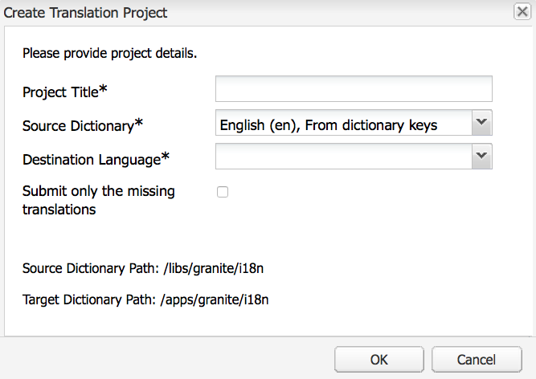

# Verwalten von Wörterbüchern mithilfe des Übersetzers{#using-translator-to-manage-dictionaries}

AEM stellt eine Konsole für die Verwaltung der verschiedenen Übersetzungen von Texten bereit, die auf der Komponentenbenutzeroberfläche verwendet werden. Diese Konsole ist verfügbar unter

`https://<hostname>:<port-number>/libs/cq/i18n/translator.html`

Mithilfe des Übersetzertools können Sie englischsprachige Zeichenfolgen und die dazugehörigen Übersetzungen verwalten. Die Wörterbücher werden im Repository erstellt, z. B. /apps/myproject/i18n.

Hinweis: Das Übersetzertool und die Wörterbücher, die Sie verwalten, dienen zur Darstellung der Komponentenbenutzeroberfläche in verschiedenen Sprachen. Informationen zum Übersetzen von Seiteninhalten oder benutzergenerierten Inhalten finden Sie in [Übersetzen von Inhalten für mehrsprachige Sites](/help/sites-administering/translation.md) bzw. in [Übersetzen von benutzergenerierten Inhalten](/help/communities/translate-ugc.md).

>[!CAUTION]
>
>Bearbeiten Sie nur Wörterbücher, die für Ihr Projekt erstellt wurden und sich unter `/apps` befinden.
>
>In diesem Tool sind auch AEM-Systemwörterbücher verfügbar. Die AEM-Systemwörterbücher dürfen nicht geändert werden, da dies zu Problemen mit der AEM-Benutzeroberfläche führen kann. Änderungen können außerdem bei einem Upgrade verloren gehen. AEM Systemwörterbücher befinden sich unter `/libs`.

>[!NOTE]
>
>Obwohl das Übersetzer-Tool über eine klassische Benutzeroberfläche verfügt, wird es unabhängig von der Oberfläche, in der diese Ausdrücke gefunden werden, für die Übersetzung von Ausdrücken verwendet.

Das Übersetzertool zeigt die in AEM verwendeten Texte zusammen mit den verschiedenen Übersetzungen nebeneinander an:


Sie können die englischen und übersetzten Texte durchsuchen, filtern und bearbeiten. Darüber hinaus können Sie Wörterbücher zur Übersetzung in das XLIFF-Format konvertieren und die Übersetzungen anschließend wieder in die Wörterbücher importieren.

Über diese Konsole ist es auch möglich, die i18n-Wörterbücher einem Übersetzungsprojekt hinzuzufügen. Sie können entweder ein neues Projekt erstellen oder ein bereits vorhandenes Projekt verwenden.

1. Klicken Sie auf **Wörterbuch übersetzen**.

   

1. Klicken Sie je nach Bedarf auf „Erstellen“ oder auf „Hinzufügen“. Ein Dialogfeld wird geöffnet.

   

1. Füllen Sie die Felder nach Bedarf aus und klicken Sie auf „OK“. 

1. Nun können Sie auf **OK** klicken oder das Zielwörterbuch anzeigen.

   >[!NOTE]
   >
   >Weitere Informationen zu Übersetzungsprojekten finden Sie unter [Verwalten von Übersetzungsprojekten](/help/sites-administering/tc-manage.md).

## Erstellen eines Wörterbuchs  {#creating-a-dictionary}

Erstellen Sie ein Wörterbuch zur Verwaltung Ihrer lokalisierten Zeichenfolgen für die Benutzeroberfläche. Nach der Erstellung kann das Wörterbuch mithilfe des Übersetzungstools verwaltet werden.

1. Fügen Sie mithilfe von CRXDE Lite den Stammknoten (`sling:Folder`) für Ihr neues Wörterbuch als Struktur für die Sprachdefinitionen hinzu:

   ` /apps/<projectName>/i18n`

   Beispiel: `/apps/myProject/i18n`

1. Fügen Sie die erforderliche Sprachstruktur unter diesem Stamm hinzu. Beispiel:

   ```shell
   /apps/myProject/i18n [sling:Folder]
       - de.json [nt:file] [mix:language]
           + jcr:language = de
       - fr.json [nt:file] [mix:language]
           + jcr:language = fr
   ```

   >[!NOTE]
   >
   >Dies ist die Struktur des [Sling-i18n-Moduls](https://sling.apache.org/site/internationalization-support.html).

1. Laden Sie den Übersetzer und den Wörterbuchpfad neu (z. B. `/apps/myProject/i18n`) in der Dropdown-Auswahl in der Symbolleiste verfügbar sein. Wählen Sie diese aus, um mit dem Hinzufügen von Zeichenfolgen und deren Übersetzungen zu beginnen.

   >[!NOTE]
   >
   >Der Übersetzer speichert nur Übersetzungen für Sprachen, die tatsächlich unter dem Pfad vorhanden sind (z. B. `/apps/myProject/i18n`).
   >
   >Achten Sie darauf, dass diese den im Raster dargestellten Sprachen entsprechen.

## Verwalten von Wörterbuchzeichenfolgen {#managing-dictionary-strings}

Verwenden Sie das Übersetzungstool, um die Zeichenfolgen in Ihren Wörterbüchern zu verwalten. Sie können englische Zeichenfolgen hinzufügen, ändern und entfernen sowie übersetzte Zeichenfolgen bereitstellen.

>[!CAUTION]
>
>Bearbeiten Sie nur Wörterbücher, die für Ihr Projekt erstellt wurden und sich unter `/apps` befinden.
>
>Die AEM-Systemwörterbücher dürfen nicht geändert werden, da dies zu Problemen mit der AEM-Benutzeroberfläche führen kann. Änderungen können außerdem bei einem Upgrade verloren gehen. AEM Systemwörterbücher befinden sich unter `/libs`.

### Hinzufügen, Ändern und Entfernen von Zeichenfolgen {#adding-changing-and-removing-strings}

Fügen Sie einem Wörterbuch englische Zeichenfolgen hinzu, die Ihre Komponente internationalisiert hat. Fügen Sie nur internationalisierte Zeichenfolgen hinzu, um keine Ressourcen für die Übersetzung nicht verwendeter Zeichenfolgen zu vergeuden.

Die Zeichenfolgen, die Sie einem Wörterbuch hinzufügen, müssen jeweils exakt der im Code angegebenen Zeichenfolge entsprechen. Wenn die englische Standardzeichenfolge aus dem Code nicht der englischen Zeichenfolge in einem Wörterbuch entspricht, wird die übersetzte Zeichenfolge nicht auf der Benutzeroberfläche angezeigt, wenn sie benötigt wird. Bei Zeichenfolgen muss die Groß-/Kleinschreibung beachtet werden.

**Angeben von Übersetzungshinweisen**

Verwenden Sie die Kommentareigenschaft der Wörterbuchzeichenfolge, um den Übersetzer mit Informationen zur Bedeutung der Zeichenfolge bei seiner Arbeit zu unterstützen. Benutzer können die Bedeutung mehrdeutiger Wörter in der Regel anhand der Benutzeroberfläche erschließen. Der Übersetzer sieht die Zeichenfolge allerdings nicht im Kontext der Benutzeroberfläche. Mit einem Übersetzungshinweis können mögliche Mehrdeutigkeiten beseitigt werden. Beispielsweise hilft ein Kommentar dem Übersetzer zu verstehen, dass das englische Wort &quot;Request&quot;als Substantiv und nicht als Verb verwendet wird.

Übersetzungshinweise ermöglichen auch die Unterscheidung identischer Zeichenfolgen mit unterschiedlicher Bedeutung. So kann beispielsweise das Wort „Search“ ein Verb oder ein Substantiv sein, weshalb das Wörterbuch zwei Einträge mit unterschiedlichen Übersetzungshinweisen enthalten muss. Der Übersetzungshinweis ist auch in dem Code enthalten, der die Zeichenfolge anfordert, sodass auf der Benutzeroberfläche die korrekte Zeichenfolge verwendet wird.

**Einschließen indizierter Variablen**

Sie können Variablen in die lokalisierte Zeichenfolge einfügen, um dem Satz Kontextbedeutung zu geben. Ein Beispiel: Nach der Anmeldung bei einer Webanwendung wird auf der Homepage folgende Nachricht angezeigt: „Willkommen zurück, Administrator. Sie haben zwei Nachrichten in Ihrem Posteingang.“ Der Seitenkontext bestimmt den Benutzernamen und die Anzahl der Nachrichten.

Um Variablen in die lokalisierte Zeichenfolge einzubeziehen, platzieren Sie in Klammern gesetzte Indizes an der Position der Variablen im ersten Argument der get -Methode. Beschreiben Sie die Werte in einem Übersetzungshinweis. Der Übersetzer muss die Bedeutung der Variablen kennen, da andere Sprachen ggf. eine andere Satzstruktur erfordern.

[Der Code, der die übersetzte Zeichenfolge anfordert](/help/sites-developing/i18n-dev.md#including-variables-in-localized-sentences), gibt abhängig vom Kontext entsprechende Werte für die indizierten Variablen an.

Wenn sich ein Benutzer also beispielsweise bei einer Website anmeldet, wird folgende Zeichenfolge angezeigt, und diese Zeichenfolge ist auch im Wörterbuch enthalten:

`Welcome back {0}. You have {1} messages.`

Der folgende Kommentar beschreibt die Variablen:

`{0} = the user name, {1} = the number of items in the user's inbox`

**Ändern von Zeichenfolgen**

Ändern oder entfernen Sie englische Zeichenfolgen, wenn sich diese im Code ändern oder aus dem Code entfernt werden. Wenn Sie eine Zeichenfolge ändern, wird die ursprüngliche Zeichenfolge beibehalten und eine neue Zeichenfolge erstellt, die die Änderung beinhaltet. Vergewissern Sie sich vor dem Entfernen einer Zeichenfolge, dass sie in keinem Code verwendet wird.

Gehen Sie wie folgt vor, um eine Zeichenfolge hinzuzufügen:

1. Wählen Sie im Dropdown-Menü „Wörterbücher“ das Wörterbuch aus, dem Sie eine Zeichenfolge hinzufügen möchten. Im Dropdown-Menü sind Wörterbücher mit ihrem Repositorypfad angegeben.
1. Klicken Sie über der Tabelle mit den Zeichenfolgen und Übersetzungen auf „Hinzufügen“.

   

1. Geben Sie im Feld „Zeichenfolge“ des Dialogfelds „Zeichenfolge hinzufügen“ die englische Zeichenfolge ein. Geben Sie bei Bedarf im Kommentarfeld einen Übersetzungshinweis für den Übersetzer ein.
1. Klicken Sie auf OK.
1. Klicken Sie auf Speichern.

   

Gehen Sie wie folgt vor, um eine Zeichenfolge in einem Wörterbuch zu ändern:

1. Wählen Sie im Dropdown-Menü „Wörterbücher“ das Wörterbuch aus, das die zu ändernde Zeichenfolge enthält.
1. Doppelklicken Sie auf die Zeichenfolge, die Sie ändern möchten.
1. Klicken Sie im Dialogfeld „Zeichenfolge bearbeiten“ auf „Zeichenfolge oder Kommentar ändern (erstellt eine Kopie)“.

   

1. Ändern Sie die Zeichenfolge oder den Kommentar und klicken Sie anschließend auf „OK“.
1. Klicken Sie auf Speichern.

   

Gehen Sie wie folgt vor, um eine Zeichenfolge aus einem Wörterbuch zu entfernen:

1. Wählen Sie im Dropdown-Menü „Wörterbücher“ das Wörterbuch aus, aus dem Sie eine Zeichenfolge entfernen möchten.
1. Klicken Sie auf „Entfernen“.

   

1. Klicken Sie auf Speichern.

   

### Suchen nach Zeichenfolgen {#searching-for-strings}

Die Suchleiste am unteren Rand des Übersetzertools bietet verschiedene Auswahloptionen für Zeichenfolgen:

* **Nach Text filtern:** Ein Muster, das mit der englischen Zeichenfolge, dem Kommentar oder den Übersetzungen übereinstimmt. Nur Elemente, die dem Muster ganz oder teilweise entsprechen, werden in der Tabelle angezeigt.
* **Änderungen: Beliebige, geänderte, neue, gelöschte:** Zeigt Elemente an, die geändert und nicht gespeichert wurden.

   * Beliebig: Zeigt Elemente an, die geändert, hinzugefügt oder entfernt wurden.
   * Geändert: Zeigt geänderte Elemente an.
   * Neu: Zeigt hinzugefügte Elemente an.
   * Gelöscht: Zeigt Elemente an, die entfernt werden sollen.
   * Mehrfachauswahl: Zeigt Elemente an, die über alle ausgewählten Eigenschaften verfügen.

* **Mit Kommentar:** Zeigt Elemente mit Kommentaren für Übersetzer an.
* **Fehlende Übersetzungen:** Zeigt Elemente an, bei denen für mindestens eine Sprache keine Übersetzung vorliegt.


1. Wählen Sie auf der Suchleiste die gewünschten Filteroptionen aus.
1. Klicken Sie auf „Filtern“, um die Filteroptionen anzuwenden.
1. Wenn Sie den Filter entfernen und wieder alle Elemente aus dem Wörterbuch anzeigen möchten, klicken Sie auf „Löschen“.

### Bearbeiten von übersetzten Zeichenfolgen  {#editing-translated-strings}

Nachdem Sie die englische Zeichenfolge einem Wörterbuch hinzugefügt haben, können Sie Übersetzungen der Zeichenfolge hinzufügen. Sie können auch [das Wörterbuch exportieren](/help/sites-developing/i18n-translator.md#exporting-a-dictionary), um es von einem Drittanbieter übersetzen zu lassen.

1. Wählen Sie [Ihr projektspezifisches Wörterbuch](#creating-a-dictionary) aus, da es den Pfad im Repository angibt, unter dem sich die Übersetzungen befinden. Wählen Sie unter **Wörterbücher** also beispielsweise Folgendes aus:

   `/apps/myProject/i18n`

   >[!CAUTION]
   >
   >Bearbeiten Sie nur Wörterbücher, die für Ihr Projekt erstellt wurden und sich unter `/apps` befinden.
   >
   >In diesem Tool sind auch AEM-Systemwörterbücher verfügbar. Die AEM-Systemwörterbücher dürfen nicht geändert werden, da dies zu Problemen mit der AEM-Benutzeroberfläche führen kann. Änderungen können außerdem bei einem Upgrade verloren gehen. AEM Systemwörterbücher befinden sich unter `/libs`.

1. Die übersetzten Texte für die Zeichenfolgen können wie folgt bearbeitet werden:

   * doppelt auf die entsprechende Sprache für die gewünschte Zeichenfolge klicken, um diesen einzelnen Text zu bearbeiten, oder

   

   * doppelt auf die Felder **Zeichenfolge** oder **Kommentar** klicken, damit die gewünschte Zeichenfolge im Dialogfenster **Zeichenfolge bearbeiten** geöffnet wird, die Übersetzungen nach Bedarf bearbeiten und schließlich auf **OK** klicken, um das Dialogfeld zu schließen.

   

1. Klicken Sie auf der Symbolleiste auf **Speichern**, um die Änderungen zu übernehmen.

   >[!NOTE]
   >
   >Wenn Sie anstelle von **Speichern** auf **Zurücksetzen und aktualisieren** klicken, werden alle Änderungen an den vorherigen Texten rückgängig gemacht.

## Verwenden externer Übersetzer {#using-third-party-translators}

Mit dem Übersetzungstool können Sie Wörterbücher für externe Übersetzungsdienste exportieren und anschließend wieder importieren.

### Exportieren eines Wörterbuchs  {#exporting-a-dictionary}

Exportieren Sie ein Wörterbuch in eine XLIFF-Datei, damit die Wörterbuchzeichenfolgen von einem Drittanbieter übersetzt werden können.

* Exportieren Sie ein Wörterbuch mit den englischen und übersetzten Begriffen für eine Sprache.
* Exportieren Sie einige oder alle der englischen Zeichenfolgen.

Wenn Sie eine XLIFF-Datei exportieren und eine Sprache einschließen, muss diese Sprache in der Knotenstruktur des Wörterbuchs im Repository enthalten sein. Ist die Sprache nicht enthalten, treten Fehler auf. Wenn Sie also beispielsweise die XLIFF-Datei für Französisch exportieren möchten, muss der Wörterbuchordner unter `mix:language` den untergeordneten Knoten `fr` enthalten. (Siehe [Erstellen eines Wörterbuchs](/help/sites-developing/i18n-translator.md#creating-a-dictionary).)

Gehen Sie wie folgt vor, um eine XLIFF-Datei für eine bestimmte Sprache zu exportieren:

1. Öffnen Sie das Übersetzungstool `http://<host>:<port>/libs/cq/i18n/translator.html`
1. Wählen Sie im Dropdown-Menü „Wörterbücher“ das Wörterbuch aus, das Sie exportieren möchten.
1. Klicken Sie auf „Exportieren“ > „Vollständige XLIFF-Optionen für *XX* exportieren“, wobei *XX* der aus zwei Buchstaben bestehende Sprachcode (etwa „DE“ oder „FR“) ist.

   Die XLIFF-Datei wird auf einer neuen Registerkarte oder in einem neuen Fenster geöffnet.

1. Speichern Sie die Seite mithilfe der Befehle des Webbrowsers als Datei auf Ihrem System (beispielsweise über „Datei“ > „Seite speichern unter“).

Gehen Sie wie folgt vor, um alle oder einige der englischen Zeichenfolgen zu exportieren:

1. Öffnen Sie das Übersetzungstool.`http://<host>:<port>/libs/cq/i18n/translator.html`
1. Wählen Sie im Dropdown-Menü „Wörterbücher“ das Wörterbuch aus, das Sie exportieren möchten.
1. Wenn Sie nur einen Teil der Zeichenfolgen exportieren möchten, wählen Sie die gewünschten Wörterbuchelemente aus. Sind keine Elemente ausgewählt, werden alle Elemente exportiert.
1. Klicken Sie auf „Exportieren“ > „Auswahl als XLIFF exportieren (nur Zeichenfolgen)“.
1. Kopieren Sie im daraufhin angezeigten Dialogfeld den Text und fügen Sie ihn in eine Textdatei ein.

### Importieren eines Wörterbuchs  {#importing-a-dictionary}

Importieren Sie eine XLIFF-Datei in ein Wörterbuch, um das Wörterbuch zu füllen. Falls im Wörterbuch eine Übersetzung für eine englische Zeichenfolge enthalten ist und die XLIFF-Datei eine andere Übersetzung für die gleiche Zeichenfolge enthält, wird die Übersetzung im Wörterbuch ersetzt.

1. Öffnen Sie das Übersetzungstool `http://<host>:<port>/libs/cq/i18n/translator.html`
1. Klicken Sie auf „Importieren“ > „XLIFF-Übersetzungen“.
1. Wählen Sie die zu importierende Datei aus und klicken Sie auf „OK“.

## Verwalten unterstützter Sprachen  {#managing-supported-lanuages}

Fügen Sie vom Übersetzungstool unterstützte Sprachen hinzu, die Benutzern auf Ihren Webseiten angezeigt werden, oder entfernen Sie sie.

### Ändern der in der Wörterbuchtabelle aufgeführten Sprachen  {#changing-languages-listed-in-the-dictionary-table}

Das Übersetzer-Tool enthält die folgenden Sprachen in der Wörterbuchtabelle:

* de – Deutsch
* fr – Französisch
* it – Italienisch
* es – Spanisch
* ja – Japanisch
* pt-br: Portugiesisch (Brasilien)
* zh-cn: Chinesisch (Kurzzeichen)
* zh-tw: Chinesisch (traditionell) (eingeschränkte Unterstützung)
* ko-kr: Koreanisch

Gehen Sie wie folgt vor, um Sprachen hinzuzufügen oder zu entfernen:

1. Erstellen Sie mithilfe von CRXDE Lite einen neuen Knoten:

   `/etc/languages`

1. Erstellen Sie in diesem Knoten eine Eigenschaft:

   * **Name**: `languages`
   * **Typ**: `Multi-String`
   * **Wert**: Eine Liste mit den Sprachen, die angezeigt werden sollen. Beispiel:

      * fr
      * es

   >[!NOTE]
   >
   >Die Sprachcodes müssen in Kleinbuchstaben geschrieben sein.

1. Klicken Sie in CRXDE Lite auf **Alle speichern** und laden Sie den Übersetzer neu. Das Raster wird aktualisiert und zeigt nun die definierten Sprachen an.

   >[!NOTE]
   >
   >Der Übersetzer speichert Übersetzungen nur für Sprachen, die tatsächlich [im Wörterbuch](#creating-a-dictionary) vorhanden sind (d. h. unter dem Wörterbuchpfad wie `/apps/myProject/i18n`).
   >
   >Achten Sie darauf, dass diese den im Raster dargestellten Sprachen entsprechen.

### Verfügbarmachen von Sprachen für Autoren {#making-languages-available-to-authors}

Nachdem Sie ein Wörterbuch für eine neue Sprache für Ihre AEM-Instanz definiert haben, müssen Sie es den Autoren zur Auswahl zur Verfügung stellen (z. B. zur Verwendung in **Voreinstellungen**):

1. Gehen Sie wie folgt vor, um die Liste mit den Sprachen zu ändern, die in der **Sicherheitskonsole** unter **Voreinstellungen** verfügbar sind:

   1. Erstellen Sie eine Überlagerung in Ihrem Anwendungscode für:

      ```
              /libs/cq/security/widgets/source/widgets/security/Preferences.js
       and update as required.
      ```

1. Nehmen Sie an Ihrer Anwendung folgende Änderungen vor, um die Sprache in den **Voreinstellungen** Ihrer **Websites-Konsole** verfügbar zu machen:

   1. Erstellen Sie eine Überlagerung für die Struktur unter:

      `/libs/cq/security/content/tools/userProperties`

   1. Aktualisieren Sie die Sprachliste innerhalb der Überlagerung unter:

      `items/common/items /lang/options`

1. Speichern Sie alles und laden Sie die entsprechende Konsole neu.

### Ändern von Sprachennamen und Standardländern  {#changing-language-names-and-default-countries}

In vielen Ländern wird die gleiche Sprache gesprochen – beispielsweise Englisch in den USA, in Großbritannien und in Australien. Dies wird durch einen Code gekennzeichnet, der sowohl Sprache als auch Land angibt, z. B. `en_US`, `en_GB` und `en_AU`.

Die Standardländer werden verwendet, wenn Flaggen angezeigt werden (etwa im Dialogfeld zum Kopieren einer Sprache) und dienen zum Auflösen des Landes für einen Sprachcode.

>[!NOTE]
>
>Für Lokalisierungen, die wie beschrieben durch den Übersetzer verwaltet werden, funktioniert nur die genaue Sprache. Wenn die Dropdown-Liste mit den Spracheinstellungen `en_uk` verwendet, muss im Repository ein `en_uk` -Wörterbuch vorhanden sein.

So ändern Sie die Standarddefinitionen:

1. Eine Sprachliste ist unter dem folgenden Pfad gespeichert:

   `/libs/wcm/core/resources/languages`

   Überlagern Sie sie, indem Sie sie in das folgende Verzeichnis kopieren:

   `/apps/wcm/core/resources/languages`

   Ändern oder erweitern Sie die Liste dort. Die Eigenschaft `defaultCountry` auf einem Sprachknoten (z. B. `ja`) muss den vollständigen Code enthalten, z. B. `ja_jp`, der `jp` als Standardland für die Sprache `ja` definiert.

1. Aktualisieren Sie den **CQ WCM Language Manager**.

   * **Sprachliste**:

      Der Pfad zur Sprachliste im Repository Legen Sie dies auf den Speicherort fest, der für die Überlagerung verwendet wird:

      ```
             /apps/wcm/core/resources/languages
      ```
   Hierzu können Sie die OSGi-Web-Konsole verwenden:

   ```shell
   https://<hostname>:<port-number>/system/console/configMgr/com.day.cq.wcm.core.impl.LanguageManagerImpl
   ```

## Veröffentlichen von Wörterbüchern {#publishing-dictionaries}

Integrieren Sie Ihre Wörterbücher in die Releaseverwaltung Ihrer AEM-Anwendungen. Schließen Sie das Wörterbuch beispielsweise in das Inhaltspaket Ihrer Anwendung ein, um es für die Veröffentlichungsinstanz bereitzustellen. Diese Strategie bietet folgende Vorteile:

* Wörterbücher sind für Komponenten in ihrer Veröffentlichungsumgebung verfügbar.
* Änderungen an Zeichenfolgen der Komponentenbenutzeroberfläche werden zusammen mit den aktualisierten Übersetzungen bereitgestellt.

Des Weiteren empfiehlt es sich, Wörterbuchzeichenfolgen im Rahmen des regulären Softwareentwicklungszyklus zu testen.

>[!NOTE]
>
>Regelmäßige Veröffentlichungsfunktionen oder Replikation sollten nicht für Wörterbücher verwendet werden. Stattdessen sollten Wörterbücher genauso behandelt werden wie Code und Konfiguration. Dazu gehört die Verwendung der Quell-Code-Kontrolle zur Verfolgung von Änderungen und die Verwendung von Inhaltspaketen zur Anwendung von Änderungen auf Autoren- und Veröffentlichungsinstanz.

>[!NOTE]
>
>Bei Verwendung von Dispatcher müssen Sie [zwischengespeicherte Seiten ungültig machen](https://helpx.adobe.com/experience-manager/dispatcher/using/page-invalidate.html), um neue Wörterbuchzeichenfolgen in gerenderte Komponenten-Zeichenfolgen einzuschließen.
