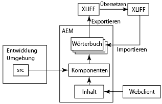
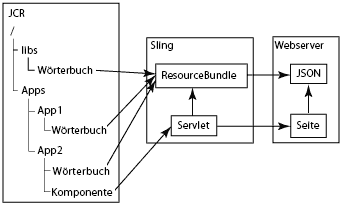

# Internationalisieren von Komponenten{#internationalizing-components}

Internationalisieren Sie Komponenten und Dialogfelder, damit die zugehörigen Zeichenfolgen der Benutzeroberfläche in unterschiedlichen Sprachen angezeigt werden können. Komponenten, die für die Internationalisierung konzipiert sind, ermöglichen die Externalisierung, Übersetzung und den anschließenden Import von UI-Zeichenfolgen in das Repository. Zur Laufzeit bestimmen die Spracheinstellungen der Benutzenden oder das Gebietsschema der Seite, welche Sprache in der Benutzeroberfläche angezeigt wird.

Verwenden Sie den folgenden Prozess, um Ihre Komponenten zu internationalisieren und die Benutzeroberfläche in verschiedenen Sprachen bereitzustellen:

1. [Implementieren Sie Ihre Komponenten mit Code, der Zeichenfolgen internationalisiert.](/help/sites-developing/i18n-dev.md)Ihr Code identifiziert die zu übersetzenden Zeichenfolgen und wählt die Sprache aus, die zur Laufzeit angezeigt werden soll.
1. [Erstellen Sie Wörterbücher](/help/sites-developing/i18n-translator.md#creating-a-dictionary) und [fügen Sie](/help/sites-developing/i18n-translator.md#adding-changing-and-removing-strings) die zu übersetzenden englischen Zeichenfolgen hinzu.

1. [Exportieren](/help/sites-developing/i18n-translator.md#exporting-a-dictionary) Sie das Wörterbuch in das XLIFF-Format, übersetzen Sie die Zeichenfolgen und [importieren](/help/sites-developing/i18n-translator.md#importing-a-dictionary) Sie die XLIFF-Dateien zurück in AEM. Alternativ können Sie [Übersetzungen manuell zum Wörterbuch hinzufügen](/help/sites-developing/i18n-translator.md#editing-translated-strings).

1. [Integrieren Sie das Wörterbuch in den Versionsverwaltungsprozess Ihrer Anwendung](/help/sites-developing/i18n-translator.md#publishing-dictionaries).

>[!NOTE]
>
>Die hier beschriebenen Methoden zur Internationalisierung von Komponenten sind für die Übersetzung statischer Zeichenfolgen gedacht. Wenn von Änderungen der Komponentenzeichenfolgen ausgegangen wird, sollten Sie herkömmliche Übersetzungs-Workflows verwenden. Wenn Autorinnen bzw. Autoren beispielsweise eine UI-Zeichenfolge mithilfe von Eigenschaften im Dialogfeld „Bearbeiten“ einer Komponente bearbeiten können, sollten Sie kein Sprachwörterbuch verwenden, um die Zeichenfolge zu internationalisieren.

## Sprachwörterbücher {#language-dictionaries}

Das AEM-Internationalisierungs6Framework verwendet Wörterbücher im Repository, um englische Zeichenfolgen und deren Übersetzungen in andere Sprachen zu speichern. Englisch ist die Standardsprache für das Framework. Zeichenfolgen werden anhand ihrer englischen Version identifiziert. In der Regel verwenden Internationalisierungs-Frameworks alphanumerische IDs für UI-Zeichenfolgen. Die Verwendung der englischen Version der Zeichenfolge als ID bietet mehrere Vorteile:

* Code ist leicht zu lesen.
* Die Standardsprache ist immer verfügbar.

Lokalisierte Zeichenfolgen können in mehreren Wörterbüchern im Repository gespeichert werden. AEM-Systemwörterbücher befinden sich unter dem Knoten `/libs`. Sie können für die Komponenten Wörterbücher unter dem Knoten `/apps` erstellen. Beim AEM-Internationalisierungs-Framework werden Wörterbücher kombiniert und in Sling als einzelnes `ResourceBundle`-Objekt bereitgestellt. Beim Rendern rufen Komponenten die übersetzten Zeichenfolgen aus dem ResourceBundle-Objekt ab. Die kombinierten Wörterbücher werden auch auf dem Webserver im JSON-Format bereitgestellt, um übersetzte Zeichenfolgen in JavaScript-Code auf Webseiten verfügbar zu machen.

Mit dem [Übersetzungs-Tool](/help/sites-developing/i18n-translator.md) können Sie außerdem alle Wörterbücher an einer zentralen Stelle verwalten.

>[!NOTE]
>
>Ändern Sie keine AEM-Systemwörterbücher, die sich unter dem Knoten `/libs` befinden.

### Überschreiben von Zeichenfolgen in Systemwörterbüchern {#overlaying-strings-in-system-dictionaries}

Zeichenfolgen in Wörterbüchern unter dem Knoten `/apps` überschreiben doppelte Zeichenfolgen in Wörterbüchern unter dem Knoten `/libs`. Wenn Ihre Komponenten Zeichenfolgen verwenden, die in den AEM-Systemwörterbüchern enthalten sind, duplizieren Sie die Zeichenfolge in Ihrem eigenen Wörterbuch. Alle Komponenten verwenden dann die Zeichenfolgen aus Ihrem Wörterbuch.

Beachten Sie, dass sich nicht vorhersagen lässt, welche Übersetzung verwendet wird, wenn Zeichenfolgen in Wörterbüchern unter dem Knoten `/apps` doppelt vorliegen.
