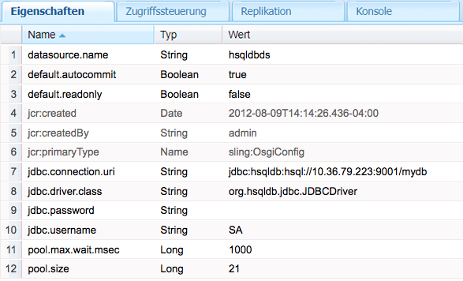

# Verbinden mit SQL-Datenbanken{#connecting-to-sql-databases}

Greifen Sie auf eine externe SQL-Datenbank zu, damit Ihre CQ-Programme mit den Daten interagieren können:

1. [Erstellen oder beziehen Sie ein OSGi-Bundle, das das JDBC-Treiberpaket exportiert](#bundling-the-jdbc-database-driver).
1. [Konfigurieren Sie einen JDBC-Datenquellen-Pool-Anbieter](#configuring-the-jdbc-connection-pool-service).
1. [Rufen Sie ein Datenquellenobjekt ab und erstellen Sie die Verbindung in Ihrem Code](#connecting-to-the-database).

## Bündelung des JDBC-Datenbanktreibers {#bundling-the-jdbc-database-driver}

Einige Datenbankanbieter stellen JDBC-Treiber in einem OSGi-Paket bereit, z. B. [MySQL](https://dev.mysql.com/downloads/connector/j/). Wenn der JDBC-Treiber für Ihre Datenbank nicht als OSGi-Bundle verfügbar ist, rufen Sie die Treiber-JAR-Datei ab und verpacken Sie sie in einem OSGi-Paket. Das Bundle muss die Pakete exportieren, die für die Interaktion mit dem Datenbankserver erforderlich sind. Das Bundle muss außerdem die Pakete importieren, die es referenziert.

Das folgende Beispiel verwendet das [Bundle-Plug-in für Maven](https://felix.apache.org/documentation/subprojects/apache-felix-maven-bundle-plugin-bnd.html), um den HSQLDB-Treiber in einem OSGi-Bundle zu verpacken. Das POM weist das Plug-in an, die hsqldb.jar-Datei einzubetten, die als Abhängigkeit angegeben ist. Alle org.hsqldb-Pakete werden exportiert.

Das Plug-in bestimmt automatisch, welche Pakete importiert werden sollen, und listet sie in der Datei „MANIFEST.MF“ des Bundles auf. Wenn eines der Pakete nicht auf dem CQ-Server verfügbar ist, startet das Bundle nicht bei der Installation. Zwei mögliche Lösungen sind:

* Geben Sie im POM an, dass die Pakete optional sind. Verwenden Sie diese Lösung, wenn die JDBC-Verbindung nicht die Paketmitglieder benötigt. Verwenden Sie das Import-Paketelement, um wie im folgenden Beispiel optionale Pakete anzugeben:

  `<Import-Package>org.jboss.*;resolution:=optional,*</Import-Package>`
* Verpacken Sie die JAR-Dateien, die die Pakete enthalten, in einem OSGi-Bundle, das die Pakete exportiert, und stellen Sie das Bundle bereit. Verwenden Sie diese Lösung, wenn die Paketmitglieder während der Ausführung des Codes erforderlich sind.

Entscheiden Sie anhand Ihrer Kenntnis des Quellcodes, welche Lösung geeignet ist. Sie können auch beide Lösungen ausprobieren und Tests durchführen, um sie zu validieren.

### POM, das hsqldb.jar bündelt {#pom-that-bundles-hsqldb-jar}

```xml
<project xmlns="https://maven.apache.org/POM/4.0.0"
  xmlns:xsi="https://www.w3.org/2001/XMLSchema-instance"
  xsi:schemaLocation="https://maven.apache.org/POM/4.0.0 https://maven.apache.org/xsd/maven-4.0.0.xsd">
  <modelVersion>4.0.0</modelVersion>

  <groupId>com.adobe.example.myapp</groupId>
  <artifactId>hsqldb-jdbc-driver-bundle</artifactId>
  <version>0.0.1-SNAPSHOT</version>
  <name>wrapper-bundle-hsqldb-driver</name>
  <url>www.adobe.com</url>
  <description>Exports the HSQL JDBC driver</description>
  <packaging>bundle</packaging>
  <properties>
    <project.build.sourceEncoding>UTF-8</project.build.sourceEncoding>
  </properties>
  <build>
    <plugins>
      <plugin>
        <groupId>org.apache.felix</groupId>
        <artifactId>maven-bundle-plugin</artifactId>
        <version>1.4.3</version>
        <extensions>true</extensions>
        <configuration>
         <instructions>
            <Embed-Dependency>*</Embed-Dependency>
            <_exportcontents>org.hsqldb.*</_exportcontents>
          </instructions>
        </configuration>
      </plugin>
    </plugins>
  </build>
  <dependencies>
    <dependency>
      <groupId>hsqldb</groupId>
      <artifactId>hsqldb</artifactId>
      <version>2.2.9</version>
    </dependency>
  </dependencies>
</project>
```

Die folgenden Links öffnen die Download-Seiten für einige beliebte Datenbankprodukte:

* [Microsoft® SQL Server](https://www.microsoft.com/de-de/sql-server/sql-server-downloads)
* [Oracle](https://www.oracle.com/database/technologies/appdev/jdbc-downloads.html)
* [IBM® DB2®](https://www.ibm.com/support/pages/download-db2-fix-packs-version-db2-linux-unix-and-windows)

### Konfigurieren des JDBC Connection Pool-Dienstes {#configuring-the-jdbc-connection-pool-service}

Fügen Sie eine Konfiguration für den JDBC Connections Pool-Dienst hinzu. Dieser Dienst verwendet den JDBC-Treiber, um Datenquellenobjekte zu erstellen. Ihr Anwendungs-Code verwendet diesen Dienst, um das Objekt abzurufen und eine Verbindung zur Datenbank herzustellen.

JDBC Connections Pool (`com.day.commons.datasource.jdbcpool.JdbcPoolService`) ist ein Factory Service. Wenn Sie Verbindungen benötigen, die unterschiedliche Eigenschaften verwenden, zum Beispiel schreibgeschützten oder Lese-/Schreibzugriff, erstellen Sie mehrere Konfigurationen.

Wenn Sie mit CQ arbeiten, gibt es mehrere Methoden, um die Konfigurationseinstellungen für solche Dienste zu verwalten; siehe [Konfiguration von OSGi](/help/sites-deploying/configuring-osgi.md) für weitere Details.

Die folgenden Eigenschaften sind bei der Konfiguration eines Pool-Verbindungsdienstes verfügbar. Die Eigenschaftsnamen werden so aufgelistet, wie sie in der Web-Konsole angezeigt werden. Der entsprechende Name für einen `sling:OsgiConfig`-Knoten wird in Klammern aufgeführt. Die angegebenen Beispielwerte gelten für einen HSQLDB-Server und eine Datenbank mit dem Alias `mydb`:

* JDBC-Treiberklasse ( `jdbc.driver.class`): Die zu verwendende Java™-Klasse, die die Schnittstelle „java.sql.Driver“ implementiert, zum Beispiel `org.hsqldb.jdbc.JDBCDriver`. Der Datentyp ist `String`.

* JDBC Connection URI ( `jdbc.connection.uri`): Die URL der für die Verbindungsherstellung zu verwendenden Datenbank. Beispiel: `jdbc:hsqldb:hsql//10.36.79.223:9001/mydb`. Das Format der URL muss mit der getConnection-Methode der java.sql.DriverManager-Klasse verwendbar sein. Der Datentyp ist `String`.

* Username (`jdbc.username`): Der zur Authentifizierung beim Datenbankserver zu verwendende Benutzername. Der Datentyp ist `String`.

* Password (`jdbc.password`): Das für die Authentifizierung des Benutzers zu verwendende Kennwort. Der Datentyp ist `String`.

* Validation Query ( `jdbc.validation.query`): Das SQL-Statement, mit dem die erfolgreiche Verbindung bestätigt werden soll, z. B. `select 1 from INFORMATION_SCHEMA.SYSTEM_USERS`. Der Datentyp ist `String`.

* Readonly By Default (default.readonly): Wählen Sie diese Option aus, wenn die Verbindung nur Lesezugriff gewähren soll. Der Datentyp ist `Boolean`.
* Autocommit By Default (`default.autocommit`): Wählen Sie diese Option aus, um für jeden SQL-Befehl, der an die Datenbank gesendet wird, eine separate Transaktion zu erstellen. Jede Transaktion wird automatisch übergeben. Wählen Sie diese Option nicht aus, wenn Sie Transaktionen in Ihrem Code explizit übergeben. Der Datentyp ist `Boolean`.

* Pool Size (`pool.size`): Die Anzahl der gleichzeitig möglichen Verbindung mit der Datenbank. Der Datentyp ist `Long`.

* Pool wait (`pool.max.wait.msec`): Der Zeitraum bis zur Zeitüberschreitung von Verbindungsanfragen. Der Datentyp ist `Long`.

* Datasource Name (`datasource.name`): Der Name dieser Datenquelle. Der Datentyp ist `String`.

* Additional Service Properties (`datasource.svc.properties`): Eine Gruppe von Name/Wert-Paaren, die Sie an die Verbindungs-URL anhängen möchten. Der Datentyp ist `String[]`.

Der JDBC Connections Pool-Dienst ist eine Factory. Wenn Sie also einen `sling:OsgiConfig`-Knoten verwenden, um den Verbindungsdienst zu konfigurieren, muss der Name des Knotens die Factory-Dienst-PID gefolgt von *`-alias`* enthalten. Der Alias, den Sie verwenden, muss unter allen Konfigurationsknoten für diese PID eindeutig sein. Ein Beispiel für einen Knotennamen ist `com.day.commons.datasource.jdbcpool.JdbcPoolService-myhsqldbpool`.



### Verbindung zur Datenbank aufbauen {#connecting-to-the-database}

In Ihrem Java™-Code verwenden Sie den DataSourcePool-Dienst, um ein `javax.sql.DataSource`-Objekt für die Konfiguration, die Sie erstellt haben, zu erhalten. Der DataSourcePool-Dienst stellt die Methode `getDataSource` bereit, die ein `DataSource`-Objekt für einen angegebenen Datenquellennamen zurückgibt. Verwenden Sie als Argument der Methode den Wert der Datenquellennamen-Eigenschaft (oder `datasource.name`), den Sie für die JDBC Connections Pool-Konfiguration angegeben haben.

Der folgende JSP-Beispiel-Code ruft eine Instanz der hsqldbds-Datenquelle ab, führt eine einfache SQL-Abfrage aus und zeigt die Anzahl der zurückgegebenen Ergebnisse an.

#### JSP-Code, der eine Datenbankabfrage durchführt {#jsp-that-performs-a-database-lookup}

```java
<%@include file="/libs/foundation/global.jsp"%><%
%><%@page session="false"%><%
%><%@ page import="com.day.commons.datasource.poolservice.DataSourcePool" %><%
%><%@ page import="javax.sql.DataSource" %><%
%><%@ page import="java.sql.Connection" %><%
%><%@ page import="java.sql.SQLException" %><%
%><%@ page import="java.sql.Statement" %><%
%><%@ page import="java.sql.ResultSet"%><%
%><html>
<cq:include script="head.jsp"/>
<body>
<%DataSourcePool dspService = sling.getService(DataSourcePool.class);
  try {
     DataSource ds = (DataSource) dspService.getDataSource("hsqldbds");
     if(ds != null) {
         %><p>Obtained the datasource!</p><%
         %><%final Connection connection = ds.getConnection();
          final Statement statement = connection.createStatement();
          final ResultSet resultSet = statement.executeQuery("SELECT * from INFORMATION_SCHEMA.SYSTEM_USERS");
          int r=0;
          while(resultSet.next()){
             r=r+1;
          }
          resultSet.close();
          %><p>Number of results: <%=r%></p><%
      }
   }catch (Exception e) {
        %><p>error! <%=e.getMessage()%></p><%
    }
%></body>
</html>
```

>[!NOTE]
>
>Wenn die getDataSource-Methode eine Ausnahme ausgibt, da die Datenquelle nicht gefunden wird, stellen Sie sicher, dass die Konfiguration des Connections Pool-Diensts korrekt ist. Überprüfen Sie die Eigenschaftsnamen, Werte und Datentypen.
>

<!-- Link below redirects to the "Get started with AEM Sites - WKND tutorial"
>[!NOTE]
>
>To learn how to inject a DataSourcePool into an OSGi bundle, see [Injecting a DataSourcePool Service into an Adobe Experience Manager OSGi bundle](https://helpx.adobe.com/experience-manager/using/datasourcepool.html). -->
