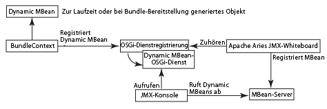

# Integrieren von Diensten mit der JMX-Konsole{#integrating-services-with-the-jmx-console}

Erstellen Sie mit der JMX-Konsole MBeans für die Verwaltung von Diensten und stellen Sie sie bereit. Veröffentlichen Sie Dienstattribute und -vorgänge, damit Administrationsaufgaben durchgeführt werden können.

Weitere Informationen zur Nutzung der JMX-Konsole finden Sie unter [Überwachen von Serverressourcen mit der JMX-Konsole](/help/sites-administering/jmx-console.md).

## Das JMX-Framework bei Felix und CQ5 {#the-jmx-framework-in-felix-and-cq}

Auf der Apache Felix-Plattform stellen Sie MBeans als OSGi-Dienste bereit. Wenn ein MBean-Dienst in der OSGi Service Registry registriert ist, registriert das Aries JMX Whiteboard-Modul das MBean automatisch beim MBean-Server. Das MBean ist dann für die JMX-Konsole verfügbar, die die öffentlichen Attribute und Vorgänge veröffentlicht.



## Erstellen von MBeans für CQ5 und CRX {#creating-mbeans-for-cq-and-crx}

MBeans, die Sie für die Verwaltung von CQ5- oder CRX-Ressourcen erstellen, basieren auf der Schnittstelle javax.management.DynamicMBean . Um sie zu erstellen, halten Sie sich an die gängigen Entwicklungsmuster, die in der JMX-Spezifikation festgelegt sind:

* Erstellen Sie die Verwaltungsschnittstelle, einschließlich Get-, Set- und Is-Methoden zur Definition von Attributen und anderen Methoden zur Definition von Vorgängen.
* Erstellen Sie die Implementierungsklasse. Die Klasse muss DynamicMBean implementieren oder eine Implementierungsklasse von DynamicMBean erweitern.
* Befolgen Sie die standardmäßige Namenskonvention, sodass der Name der Implementierungsklasse der Schnittstellenname mit dem MBean-Suffix ist.

Neben der Verwaltungsschnittstelle definiert die Schnittstelle auch die Schnittstelle des OSGi-Dienstes. Die Implementierungsklasse implementiert den OSGi-Dienst.

### Verwenden von Anmerkungen für die Angabe von MBean-Daten {#using-annotations-to-provide-mbean-information}

Das Paket [com.adobe.granite.jmx.annotation](https://helpx.adobe.com/experience-manager/6-5/sites/developing/using/reference-materials/javadoc/com/adobe/granite/jmx/annotation/package-summary.html) bietet mehrere Anmerkungen und Klassen für die einfache Bereitstellung von MBean-Metadaten für die JMX-Konsole. Verwenden Sie diese Anmerkungen und Klassen, anstatt Daten direkt zum MBeanInfo-Objekt des MBean hinzuzufügen.

**Anmerkungen**

Fügen Sie Anmerkungen zur Verwaltungsschnittstelle hinzu, um MBean-Metadaten anzugeben. Diese Daten werden in der JMX-Konsole für jede bereitgestellte Implementierungsklasse angezeigt. Folgende Anmerkungen sind verfügbar (vollständige Informationen finden Sie in den [com.adobe.granite.jmx.annotation JavaDocs](https://helpx.adobe.com/experience-manager/6-5/sites/developing/using/reference-materials/javadoc/com/adobe/granite/jmx/annotation/package-summary.html)):

* **Description:** Eine Beschreibung der MBean-Klasse oder -Methode. Wenn diese Anmerkung bei der Deklaration der Klasse genutzt wird, wird die Beschreibung für das MBean auf der JMX-Konsolenseite angezeigt. Wenn sie bei einer Methode verwendet wird, wird die Beschreibung als Mouseover-Text für das entsprechende Attribut bzw. den entsprechenden Vorgang angezeigt.
* **Impact:** Die Auswirkung einer Methode. Gültige Parameterwerte sind die von [javax.management.MBeanOperationInfo](https://docs.oracle.com/javase/1.5.0/docs/api/javax/management/MBeanOperationInfo.html) definierten Felder.

* **Name:** Legt den anzuzeigenden Namen für einen Vorgangsparameter fest. Mit dieser Anmerkung können Sie den tatsächlichen Namen des Methodenparameters überschreiben, der in der Oberfläche genutzt wird.
* **OpenTypeInfo:** Legt die Klasse fest, die für die Anzeige der zusammengefassten Daten oder Tabellendaten in der JMX-Konsole genutzt werden soll. Zur Nutzung mit Open MBeans.
* **TabularTypeInfo:** für Anmerkungen für die Klasse, die für die Anzeige von Tabellendaten genutzt wird

**Klassen**

Klassen werden für die Erstellung von Dynamic MBeans bereitgestellt, die die Anmerkungen nutzen, die Sie zu ihren Schnittstellen hinzufügen:

* **AnnotatedStandardMBean:** eine Unterklasse der Klasse javax.management.StandardMBean, die der JMX-Konsole die Anmerkungs-Metadaten automatisch bereitstellt.
* **OpenAnnotatedStandardMBean:** Eine Unterklasse der Klasse AnnotatedStandardMBean zum Erstellen von Open MBean, die die OpenTypeInfo-Ankündigung nutzen.

### Entwickeln von MBeans {#developing-mbeans}

In der Regel ist ein MBean ein Abbild des OSGi-Dienstes, den Sie verwalten möchten. Auf der Felix-Plattform erstellen Sie das MBean so, als würden Sie es auf anderen Java-Serverplattformen bereitstellen. Ein wesentlicher Unterschied liegt darin, dass Sie mit Anmerkungen MBean-Daten angeben können:

* Verwaltungsschnittstelle: Definiert Attribute mit Get-, Set- und Is-Methoden. Definiert Vorgänge mit anderen öffentlichen Methoden. Stellt mithilfe von Anmerkungen Metadaten für das BeanInfo-Objekt bereit.
* MBean-Klasse: Implementiert die Verwaltungsschnittstelle. Erweitert die Klasse AnnotatedStandardMBean, sodass sie die Anmerkungen auf der Schnittstelle verarbeitet.

Das folgende Beispiel-MBean stellt Daten zum CRX-Repository bereit. Die Schnittstelle stellt mit der Beschreibungsanmerkung Daten für die JMX-Konsole bereit.

#### Verwaltungsschnittstelle {#management-interface}

```java
package com.adobe.example.myapp;

import com.adobe.granite.jmx.annotation.Description;

@Description("Example MBean that exposes repository properties.")
public interface ExampleMBean {

    @Description("The name of the repository.")
    String getRepositoryName();

    @Description("The vendor of the repository.")
    String   getRepositoryVendor();

    @Description("The URL of repository vendor.")
    String getVendorUrl();
}
```

Die Implementierungsklasse ruft mit dem SlingRepository-Dienst Daten zum CRX-Repository ab.

#### MBean-Implementierungsklasse {#mbean-implementation-class}

```java
package com.adobe.example.myapp;

import org.apache.felix.scr.annotations.*;
import org.apache.sling.jcr.api.SlingRepository;

import com.adobe.granite.jmx.annotation.AnnotatedStandardMBean;

import javax.management.*;

public class ExampleMBeanImpl extends AnnotatedStandardMBean implements ExampleMBean {

    @Reference(cardinality = ReferenceCardinality.OPTIONAL_UNARY)
    private SlingRepository repository;

    public ExampleMBeanImpl() throws NotCompliantMBeanException {
        super(ExampleMBean.class);
    }

    public String getRepositoryName() {
        return repository.getDescriptor("jcr.repository.name");
    }

    public String getRepositoryVendor() {
        return repository.getDescriptor("jcr.repository.vendor");
    }

    public String getVendorUrl() {
        return repository.getDescriptor("jcr.repository.vendor.url");
    }
}
```

Die folgende Abbildung zeigt die Seite für dieses MBean in der JMX-Konsole.


### Registrieren von MBeans {#registering-mbeans}

Wenn Sie MBeans als OSGi-Dienst registrieren, werden sie automatisch beim MBean-Server registriert. Um ein MBean in CQ5 zu installieren, schließen Sie es in ein Bundle ein und exportieren Sie den MBean-Dienst wie jeden beliebigen anderen OSGi-Dienst.

Neben den zu OSGi gehörenden Metadaten müssen Sie auch die Metadaten angeben, die das Aries JMX Whiteboard-Modul für die Registrierung des MBean beim MBean-Server benötigt:

* **Name der DynamicMBean-Schnittstelle:** Deklarieren Sie, dass der MBean-Dienst die  `javax.management.DynamicMBea`n-Schnittstelle implementiert. Diese Deklaration informiert das Aries JMX Whiteboard-Modul darüber, dass es sich bei dem Dienst um einen MBean-Dienst handelt.

* **MBean-Domäne und Schlüsseleigenschaften:** In Felix geben Sie diese Informationen als Eigenschaft des OSGi-Dienstes des MBean an. Dabei handelt es sich um dieselben Daten, die Sie für gewöhnlich dem MBean-Server in einem `javax.management.ObjectName`-Objekt bereitstellen.

Wenn Ihr MBean das Abbild eines einzelnen Dienstes ist, ist nur eine einzige Instanz des MBean-Dienstes erforderlich. In diesem Fall können Sie, wenn Sie das Felix SCR Maven-Plug-in verwenden, mit den Apache Felix Service Component Runtime (SCR)-Anmerkungen auf der MBean-Implementierungsklasse die JMX-Metadaten festlegen. Um mehrere MBean-Instanzen zu initiieren, könnten Sie eine weitere Klasse erstellen, die die Registrierung des OSGi-Dienstes des MBean durchführt. In diesem Fall werden die JMX-Metadaten bei Laufzeit erzeugt.

**Einzelnes MBean**

MBeans, für die Sie alle Attribute und Vorgänge bei der Entwicklung definieren können, können Sie mit SCR-Anmerkungen in der MBean-Implementierungsklasse bereitstellen. Im folgenden Beispiel deklariert das Attribut `value` der Anmerkung `Service`, dass der Dienst die Schnittstelle `DynamicMBean` implementiert. Das Attribut `name` der Anmerkung `Property` legt die JMX-Domäne und die wichtigsten Eigenschaften fest.

#### MBean-Implementierungsklasse mit SCR-Anmerkungen {#mbean-implementation-class-with-scr-annotations}

```java
package com.adobe.example.myapp;

import org.apache.felix.scr.annotations.*;
import org.apache.sling.jcr.api.SlingRepository;

import com.adobe.granite.jmx.annotation.AnnotatedStandardMBean;

import javax.management.*;

@Component(immediate = true)
@Property(name = "jmx.objectname", value="com.adobe.example:type=CRX")
@Service(value = DynamicMBean.class)
public class ExampleMBeanImpl extends AnnotatedStandardMBean implements ExampleMBean {

    @Reference(cardinality = ReferenceCardinality.OPTIONAL_UNARY)
    private SlingRepository repository;

    public ExampleMBeanImpl() throws NotCompliantMBeanException {
        super(ExampleMBean.class);
    }

    public String getRepositoryName() {
        return repository.getDescriptor("jcr.repository.name");
    }

    public String getRepositoryVendor() {
        return repository.getDescriptor("jcr.repository.vendor");
    }

    public String getVendorUrl() {
        return repository.getDescriptor("jcr.repository.vendor.url");
    }
}
```

**Mehrere MBean-Dienstinstanzen**

Um mehrere Instanzen eines verwalteten Dienstes zu verwalten, erstellen Sie mehrere Instanzen des entsprechenden MBean-Dienstes. Darüber hinaus sollten MBean-Dienstinstanzen erstellt oder entfernt werden, wenn verwaltete Dienste gestartet oder angehalten werden. Sie können eine MBean-Managerklasse erstellen, die MBean-Dienste zur Laufzeit initiiert und den Dienstlebenszyklus verwaltet.

Mit BundleContext können Sie das MBean als OSGi-Dienst registrieren. Schließen Sie die JMX-Daten in das Wörterbuch-Objekt ein, das Sie als Argument der Methode BundleContext.registerService nutzen.

Im folgenden Code-Beispiel wird der Dienst ExampleMBean programmatisch registriert. Das Objekt componentContext ist der ComponentContext, der Zugriff auf BundleContext bietet.

#### Code-Ausschnitt: programmatische MBean-Dienstregistrierung {#code-snippet-programmatic-mbean-service-registration}

```java
Dictionary mbeanProps = new Hashtable();
mbeanProps.put("jmx.objectname", "com.adobe.example:type=CRX");
ExampleMBeanImpl mbean = new ExampleMBeanImpl();
ServiceRegistration serviceregistration =
            componentContext.getBundleContext().registerService(DynamicMBean.class.getName(), mbean, mbeanProps);
```

Das Beispiel-MBean im nächsten Abschnitt bietet detailliertere Angaben.

Ein MBean-Dienstmanager ist nützlich, wenn Dienstkonfigurationen im Repository gespeichert sind. Der Manager kann Dienstinformationen abrufen und zur Konfiguration und Erstellung des entsprechenden MBean nutzen. Die Managerklasse kann auch Repository-Änderungsereignisse abfragen und die MBean-Dienste entsprechend aktualisieren.

## Beispiel: Überwachung von Workflow-Modellen mit JMX {#example-monitoring-workflow-models-using-jmx}

In diesem Beispiel stellt das MBean Daten zu den CQ5-Workflow-Modellen bereit, die im Repository gespeichert sind. Eine MBean-Managerklasse erstellt MBeans basierend auf Workflow-Modellen, die im Repository gespeichert sind, und registriert ihre OSGi-Dienste zur Laufzeit. Dieses Beispiel besteht aus einem einzelnen Bundle, das die folgenden Mitglieder enthält:

* WorkflowMBean: die Verwaltungsschnittstelle
* WorkflowMBeanImpl: die MBean-Implementierungsklasse
* WorkflowMBeanManager: die Schnittstelle der MBean-Managerklasse
* WorkflowMBeanManagerImpl: die Implementierungsklasse des MBean-Managers

**Hinweis:** Um das Beispiel zu vereinfachen, führt der Beispielcode keine Protokollierungsaufgaben durch und reagiert nicht auf gemeldete Ausnahmen.

WorkflowMBeanManagerImpl enthält eine Komponenten-Aktivierungsmethode. Wenn die Komponente aktiviert wird, führt die Methode die folgenden Aufgaben durch:

* Sie ruft einen BundleContext für das Bundle ab.
* Sie fragt beim Repository die Pfade der vorhandenen Workflow-Modelle ab.
* Erstellt MBeans für jedes Workflow-Modell.
* Sie registriert die MBeans in der OSGi-Dienst-Registrierung.

Die MBean-Metadaten werden in der JMX-Konsole mit der Domäne com.adobe.example und dem workflow_model-Typ angezeigt. Als Eigenschaft ist der Pfad des Workflow-Modellkonfigurationsknotens angegeben.


### Das Beispiel-MBean {#the-example-mbean}

Dieses Beispiel setzt eine MBean-Schnittstelle und -Implementierung voraus, die ein Abbild der Schnittstelle `com.day.cq.workflow.model.WorkflowModel` ist. Das MBean ist sehr einfach, damit der Schwerpunkt des Beispiels auf der Konfiguration und Bereitstellung des Designs liegen kann. Das MBean veröffentlicht ein einziges Attribut, nämlich den Modellnamen.

#### WorkflowMBean-Schnittstelle {#workflowmbean-interface}

```java
package com.adobe.example.myapp.api;

import com.adobe.granite.jmx.annotation.Description;

@Description("Example MBean that exposes Workflow model properties.")
public interface WorkflowMBean {

 @Description("The name of the Workflow model.")
 String getModelName();
}
```

#### WorkflowMBeanImpl {#workflowmbeanimpl}

```java
package com.adobe.example.myapp.impl;

import javax.management.NotCompliantMBeanException;

import com.day.cq.workflow.model.WorkflowModel;
import com.adobe.example.myapp.api.WorkflowMBean;
import com.adobe.granite.jmx.annotation.AnnotatedStandardMBean;

public class WorkflowMBeanImpl extends AnnotatedStandardMBean implements WorkflowMBean {

 WorkflowModel model;

 protected WorkflowMBeanImpl(WorkflowModel inmodel)
   throws NotCompliantMBeanException {
  super(WorkflowMBean.class);
  model=inmodel;
 }

 public String getModelName() {
  return model.getTitle();
 }
}
```

### Der Beispiel-MBean-Manager {#the-example-mbean-manager}

Der WorkflowMBeanManager-Dienst umfasst die Komponenten-Aktivierungsmethode, die WorkflowMBean-Dienste erstellt. Die Dienstimplementierung beinhaltet die folgenden Methoden:

* activate: Aktiviert die Komponente. Sie erstellt die JCR-Sitzung für das Lesen der WorkflowModel-Konfigurationsknoten. Der Stammknoten, in dem Modellkonfigurationen gespeichert werden, wird in einem statischen Feld definiert. Der Name des Konfigurationsknotens wird ebenfalls in einem statischen Feld definiert. Diese Methode ruft andere Methoden auf, die die Knotenmodellpfade abrufen und die Modell-WorkflowMBeans erstellen.
* getModelIds: Durchquert das Repository unter dem Stammknoten und ruft den Pfad jedes Modellknotens ab.
* makeMBean: Erstellt mit dem Modellpfad ein WorkflowModel-Objekt, erstellt ein WorkflowMBean dafür und registriert den OSGi-Dienst.

>[!NOTE]
>
>Die WorkflowMBeanManager-Implementierung erstellt nur MBean-Dienste für Modellkonfigurationen, die bei der Aktivierung der Komponente vorhanden sind. Eine zuverlässigere Implementierung fragt Repository-Ereignisse in Zusammenhang mit neuen Modellkonfigurationen und Änderungen oder Löschungen vorhandener Modellkonfigurationen ab. Wenn eine Änderung durchgeführt wird, kann der Manager den zugehörigen WorkflowMBean-Dienst erstellen, bearbeiten oder löschen.

#### WorkflowMBeanManager-Schnittstelle {#workflowmbeanmanager-interface}

```java
package com.adobe.example.myapp.api;

public interface WorkflowMBeanManager {

}
```

#### WorkflowMBeanManagerImpl {#workflowmbeanmanagerimpl}

```java
package com.adobe.example.myapp.impl;

import java.util.*;

import org.apache.felix.scr.annotations.*;

import javax.jcr.Session;
import javax.jcr.Node;
import javax.jcr.NodeIterator;
import javax.jcr.RepositoryException;
import javax.management.ObjectName;

import org.apache.sling.jcr.api.SlingRepository;
import org.osgi.framework.ServiceRegistration;
import org.osgi.service.component.ComponentContext;

import org.slf4j.Logger;
import org.slf4j.LoggerFactory;

import com.day.cq.workflow.WorkflowService;
import com.day.cq.workflow.WorkflowSession;
import com.adobe.example.myapp.api.WorkflowMBean;
import com.adobe.example.myapp.api.WorkflowMBeanManager;

/**Instantiates and registers WorkflowMBean services */
@Component(immediate=true)
@Service(value=WorkflowMBeanManager.class)
public class WorkflowMBeanManagerImpl implements WorkflowMBeanManager {
 //The ComponentContext provides access to the BundleContext
 private ComponentContext componentContext;

 //Use the SlingRepository service to read model nodes
 @Reference
        private SlingRepository repository = null;

 //Use the WorkflowService service to create WorkflowModel objects
 @Reference
 private WorkflowService workflowservice = null;

  private Session session;

         //Details about model nodes
  private static final String MODEL_ROOT ="/etc/workflow/models";
  private static final String MODEL_NODE = "model";

  private Set<String> modelIds = new HashSet<String>();

        //Storage for ServiceRegistrations for MBean services
  private Collection<ServiceRegistration> mbeanRegistrations= new Vector<ServiceRegistration>(0,1);

 @Activate
        protected void activate(ComponentContext ctx) {
             //Traverse the repository and load the model nodes
             try {
                   session = repository.loginAdministrative(null);
                   // load and store model node paths
                   if (session.nodeExists(MODEL_ROOT)) {
                          getModelIds(session.getNode(MODEL_ROOT));
                   }
                   //Create MBeans for each model
                   for(String modid: modelIds){
                    makeMBean(modid);
                    }
             }catch(Exception e){ }
          }

        /**
         * Add JMX domain and key properties to a collection
         * Instantiate a WorkflowModel and its WorkflowMBeanImpl object
         * Register the MBean OSGi service
         */
 private void makeMBean(String modelId) {
             // create MBean for the model
             try {
                 Dictionary<String, String> mbeanProps = new Hashtable<String, String>();
                 //These properties appear on the JMX Console home page
                 mbeanProps.put("jmx.objectname", "com.adobe.example:type=workflow_model,id=" + ObjectName.quote(modelId));
                 WorkflowSession wfsession = workflowservice.getWorkflowSession(session);
                 WorkflowMBeanImpl mbean = new WorkflowMBeanImpl(wfsession.getModel(modelId));

                ServiceRegistration serviceregistration = componentContext.getBundleContext().registerService(WorkflowMBean.class.getName(), mbean, mbeanProps);
                //Store the ServiceRegistration objects for deactivation
                mbeanRegistrations.add(serviceregistration);
             } catch (Throwable t) {}
         }

        /**
         * Traverses the repository branch below a given Node. Stores the path of each model node.
         */
 private void getModelIds(Node node) throws RepositoryException {
  try{
                     NodeIterator iter = node.getNodes();
                     while (iter.hasNext()) {
                           Node n = iter.nextNode();
                           //Look for "jcr:content" nodes
                           if (n.getName().equals("jcr:content")) {
                                //get the path of the model node and save it
                                if(n.hasNode(MODEL_NODE)){
                                      modelIds.add(n.getNode(MODEL_NODE).getPath());
                                 }
                           } else{
                                   //Scan child nodes
                                   getModelIds(n);
                           }
                       }
  }catch(Exception e){ }
       }

        /**
         * Log out of the JCR session and unregister WorkflowMBean services
         */
        @Deactivate
        protected void deactivate() {
          session.logout();
          session=null;
          for(ServiceRegistration sr:mbeanRegistrations){
         sr.unregister();
          }
        }
}
```

### Die POM-Datei für das Beispiel-MBean {#the-pom-file-for-the-example-mbean}

Der Einfachheit halber können Sie den folgenden XML-Code in Ihre Projektdatei pom.xml kopieren, um das Komponenten-Bundle zu erstellen. Das POM verweist auf mehrere erforderliche Plug-ins und Abhängigkeiten.

**Plug-ins:**

* Apache Maven Compiler-Plug-in: Kompiliert Java-Klassen aus dem Quellcode
* Apache Felix Maven Bundle Plug-in: Erstellt das Bundle und das Manifest
* Apache Felix Maven SCR-Plug-in: Erstellt die Komponentendeskriptordatei und konfiguriert den Manifestheader der Servicekomponente

**Hinweis:** Zum Zeitpunkt, als dieser Text verfasst wird, ist das Maven SCR-Plug-in nicht mit dem m2e-Plug-in für Eclipse kompatibel. (Siehe [Felix-Bug 3170](https://issues.apache.org/jira/browse/FELIX-3170).) Um die Eclipse IDE zu verwenden, installieren Sie Maven und nutzen Sie die Befehlszeile für die Entwicklung.

#### POM-Beispieldatei {#example-pom-file}

```xml
<project xmlns="https://maven.apache.org/POM/4.0.0"
  xmlns:xsi="https://www.w3.org/2001/XMLSchema-instance"
  xsi:schemaLocation="https://maven.apache.org/POM/4.0.0 https://maven.apache.org/xsd/maven-4.0.0.xsd">
  <modelVersion>4.0.0</modelVersion>
  <groupId>com.adobe.example.myapp</groupId>
  <artifactId>workflow-mbean</artifactId>
  <version>0.0.2-SNAPSHOT</version>
  <name>mbean-simple</name>
  <url>www.adobe.com</url>
  <description>A simple MBean</description>
  <packaging>bundle</packaging>
    <properties>
        <project.build.sourceEncoding>UTF-8</project.build.sourceEncoding>
    </properties>
    <build>
        <plugins>
        <plugin>
            <groupId>org.apache.maven.plugins</groupId>
            <artifactId>maven-compiler-plugin</artifactId>
            <configuration>
                <source>1.5</source>
                <target>1.5</target>
            </configuration>
        </plugin>
            <plugin>
                <groupId>org.apache.felix</groupId>
                <artifactId>maven-scr-plugin</artifactId>
                <version>1.7.2</version>
                <executions>
                    <execution>
                        <id>generate-scr-scrdescriptor</id>
              <goals>
                 <goal>scr</goal>
              </goals>
            </execution>
         </executions>
            </plugin>
             <plugin>
            <groupId>org.apache.felix</groupId>
            <artifactId>maven-bundle-plugin</artifactId>
            <version>1.4.3</version>
            <extensions>true</extensions>
            <configuration>
                <instructions>
                    <Export-Package>com.adobe.example.myapp.*;version=${project.version}</Export-Package>
                </instructions>
            </configuration>
        </plugin>
        </plugins>
    </build>
    <dependencies>
        <dependency>
            <groupId>org.apache.felix</groupId>
            <artifactId>org.apache.felix.scr.annotations</artifactId>
            <version>1.6.0</version>
            <scope>provided</scope>
        </dependency>
         <dependency>
            <groupId>org.apache.sling</groupId>
            <artifactId>org.apache.sling.api</artifactId>
            <version>2.0.8</version>
            <scope>provided</scope>
        </dependency>
         <dependency>
            <groupId>org.apache.felix</groupId>
            <artifactId>org.apache.felix.scr</artifactId>
            <version>1.6.1-R1236132</version>
            <scope>provided</scope>
        </dependency>
        <dependency>
            <groupId>org.apache.sling</groupId>
            <artifactId>org.apache.sling.jcr.api</artifactId>
            <version>2.0.4</version>
        </dependency>
        <dependency>
            <groupId>com.adobe.granite</groupId>
            <artifactId>com.adobe.granite.jmx</artifactId>
            <version>0.1.6</version>
            <scope>provided</scope>
        </dependency>
        <dependency>
       <groupId>com.day.cq.wcm</groupId>
       <artifactId>cq-wcm-mobile-api</artifactId>
       <version>5.5.2</version>
       <scope>provided</scope>
      </dependency>
      <dependency>
       <groupId>com.day.cq.workflow</groupId>
       <artifactId>cq-workflow-api</artifactId>
       <version>5.5.0</version>
       <scope>provided</scope>
      </dependency>
      <dependency>
       <groupId>javax.jcr</groupId>
       <artifactId>jcr</artifactId>
       <version>2.0</version>
       <scope>provided</scope>
      </dependency>
      <dependency>
                <groupId>org.slf4j</groupId>
  <artifactId>slf4j-api</artifactId>
  <version>1.6.4</version>
  <scope>provided</scope>
 </dependency>
    </dependencies>
</project>
```

Fügen Sie das folgende Profil zu Ihren Maven-Einstellungen hinzu, um das öffentliche Adobe-Repository zu nutzen.

#### Maven-Profil {#maven-profile}

```xml
<profile>
    <id>adobe-public</id>
    <activation>
         <activeByDefault>false</activeByDefault>
    </activation>
    <properties>
         <releaseRepository-Id>adobe-public-releases</releaseRepository-Id>
         <releaseRepository-Name>Adobe Public Releases</releaseRepository-Name>
         <releaseRepository-URL>https://repo1.maven.org/maven2/com/adobe/</releaseRepository-URL>
    </properties>
    <repositories>
         <repository>
             <id>adobe-public-releases</id>
             <name>Adobe  Public Repository</name>
             <url>https://repo1.maven.org/maven2/com/adobe/</url>
             <releases>
                 <enabled>true</enabled>
                 <updatePolicy>never</updatePolicy>
             </releases>
             <snapshots>
                 <enabled>false</enabled>
             </snapshots>
         </repository>
     </repositories>
     <pluginRepositories>
         <pluginRepository>
             <id>adobe-public-releases</id>
             <name>Adobe Public Repository</name>
             <url>https://repo1.maven.org/maven2/com/adobe/</url>
             <releases>
                 <enabled>true</enabled>
                 <updatePolicy>never</updatePolicy>
             </releases>
             <snapshots>
                 <enabled>false</enabled>
             </snapshots>
         </pluginRepository>
     </pluginRepositories>
</profile>
```
