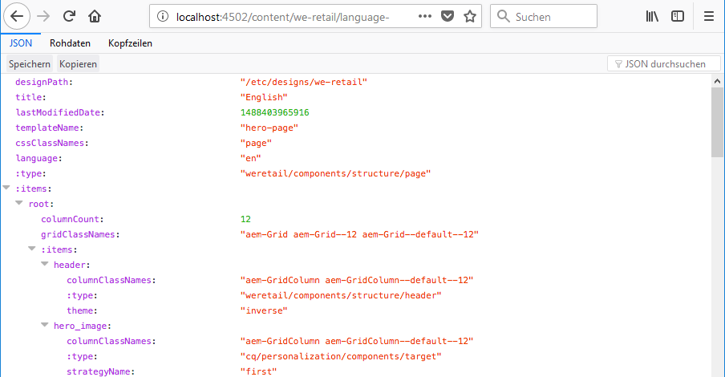
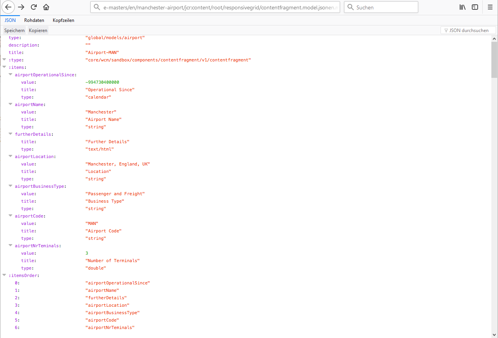

# JSON-Exporter für Content Services {#json-exporter-for-content-services}

Mit den AEM Content Services können die Beschreibung und Bereitstellung von Inhalten in/über AEM über einen Fokus auf Web-Seiten hinweg generalisiert werden.

Sie ermöglichen die Bereitstellung von Inhalten in Kanälen, die keine traditionellen AEM-Web-Seiten sind, und nutzen standardisierte Methoden, die von allen Clients genutzt werden können. Diese Kanäle können Folgendes sein:

* [Single Page Applications](spa-walkthrough.md)
* native Mobile Apps
* weitere AEM-externe Kanäle und Touchpoints

Über Inhaltsfragmente, die strukturierte Inhalte verwenden, können Sie Content Services zur Verfügung stellen, indem Sie die Inhalte mit JSON Exporter auf einer (beliebigen) AEM-Seite im JSON-Datenmodellformat bereitstellen. Diese können dann von Ihren eigenen Anwendungen genutzt werden.

>[!NOTE]
>
>Die hier beschriebene Funktionalität steht für alle Kernkomponenten seit der [Version 1.1.0 der Kernkomponenten](https://docs.adobe.com/content/docs/de/core-components/v1.html) zur Verfügung.

## JSON Exporter mit Inhaltsfragment-Kernkomponenten  {#json-exporter-with-content-fragment-core-components}

Mit dem AEM JSON Exporter können Sie die Inhalte auf einer (beliebigen) AEM-Seite im JSON-Datenmodellformat bereitstellen. Diese können dann von Ihren eigenen Anwendungen genutzt werden.

In AEM erfolgt die Bereitstellung mit dem `model`-Selektor und der `.json`-Erweiterung.

`.model.json`

1. Zum Beispiel werden über eine URL wie:

   ```shell
   http://localhost:4502/content/we-retail/language-masters/en.model.json
   ```

1. Inhalte der folgenden Art bereitgestellt:

   

Alternativ können Sie die Inhalte eines strukturierten Inhaltsfragments bereitstellen, indem Sie dieses spezifisch nachverfolgen.

Verwenden Sie dazu den vollständigen Pfad zum Fragment (über `jcr:content`); beispielsweise mit dem folgenden Suffix:

`.../jcr:content/root/responsivegrid/contentfragment.model.json`

Ihre Seite kann entweder ein einzelnes Inhaltsfragment oder mehrere Komponenten verschiedener Art enthalten. Sie können außerdem Mechanismen wie Listenkomponenten verwenden, um automatisch nach relevantem Inhalt zu suchen.

* Zum Beispiel werden über eine URL wie:

   ```shell
   http://localhost:4502/content/we-retail/language-masters/en/manchester-airport/jcr:content/root/responsivegrid/contentfragment.model.json
   ```

* Inhalte der folgenden Art bereitgestellt:

   

   >[!NOTE]
   >
   >Sie können [Ihre eigenen Komponenten anpassen](/help/sites-developing/json-exporter-components.md), um auf diese Daten zuzugreifen und sie zu verwenden.

   >[!NOTE]
   >
   >Obwohl es sich nicht um eine Standardimplementierung handelt, werden [mehrere Selektoren unterstützt,](json-exporter-components.md#multiple-selectors) jedoch muss `model` der erste sein.

### Weiterführende Informationen {#further-information}

Siehe auch:

* Assets-HTTP-API

   * [Assets-HTTP-API](/help/assets/mac-api-assets.md)

* Sling-Modelle:

   * [Sling-Modelle – Zuweisung von Modellklassen und Ressourcentypen seit 1.3.0](https://sling.apache.org/documentation/bundles/models.html#associating-a-model-class-with-a-resource-type-since-130)

* AEM mit JSON:

   * [Ermitteln von Seiteninformationen im JSON-Format](/help/sites-developing/pageinfo.md)

## Verwandte Dokumentation {#related-documentation}

Weitere Informationen finden Sie unter:

* Das [Thema „Inhaltsfragmente“·im Assets-Benutzerhandbuch](https://helpx.adobe.com/experience-manager/6-4/assets/user-guide.html?topic=/experience-manager/6-4/assets/morehelp/content-fragments.ug.js)

* [Inhaltsfragmentmodelle](/help/assets/content-fragments/content-fragments-models.md)
* [Bearbeitung mit Inhaltsfragmenten](/help/sites-authoring/content-fragments.md)
* [Aktivieren eines JSON-Exports für eine Komponente](/help/sites-developing/json-exporter-components.md)

* [Kernkomponenten](https://docs.adobe.com/content/help/de-DE/experience-manager-core-components/using/introduction.html) und die [Inhaltsfragmentkomponente](https://helpx.adobe.com/experience-manager/core-components/using/content-fragment-component.html)

