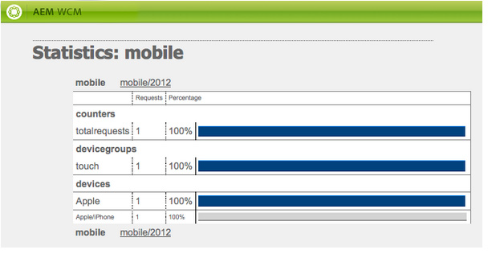

# Erstellen von Websites für Mobilgeräte{#creating-sites-for-mobile-devices}

>[!NOTE]
>
>Adobe empfiehlt die Verwendung des SPA-Editors für Projekte, die ein Framework-basiertes clientseitiges Rendering von Einzelseiten-Apps erfordern (z. B. React). [Weitere Informationen](/help/sites-developing/spa-overview.md)

Das Erstellen einer mobilen Website ähnelt dem Erstellen einer Standardwebsite, da auch Vorlagen und Komponenten erstellt werden müssen Weitere Informationen zum Erstellen von Vorlagen und Komponenten finden Sie auf den folgenden Seiten: [Vorlagen](/help/sites-developing/templates.md), [Komponenten](/help/sites-developing/components.md), und [Erste Schritte bei der Entwicklung von AEM Sites](/help/sites-developing/getting-started.md). Der Hauptunterschied besteht darin, die integrierten mobilen Funktionen von Adobe Experience Manager (AEM) innerhalb der Site zu aktivieren. Dies wird erreicht, indem eine Vorlage erstellt wird, die auf der mobilen Seitenkomponente basiert.

Verwenden Sie [responsives Design](/help/sites-developing/responsive.md)erstellen, eine einzelne Site erstellen, die mehrere Bildschirmgrößen unterstützt.

Beginnen Sie mit dem **Demosite &quot;We.Retail Mobile&quot;** , die in AEM verfügbar ist.

Gehen Sie wie folgt vor, um eine mobile Site zu erstellen:

1. Erstellen Sie die Seitenkomponente:

   * Legen Sie die Eigenschaft `sling:resourceSuperType` auf `wcm/mobile/components/page` fest.
Auf diese Weise beruht die Komponente auf der Mobile-Seiten-Komponente.

   * Erstellen Sie die `body.jsp` mit der projektspezifischen Logik.

1. Erstellen Sie die Seitenvorlage:

   * Legen Sie die Eigenschaft `sling:resourceType` auf die neu erstellte Seitenkomponente fest.
   * Legen Sie die Eigenschaft `allowedPaths` fest.

1. Erstellen Sie die Design-Seite für die Website.
1. Erstellen Sie die Website-Root-Seite unter dem Knoten `/content`:

   * Legen Sie die Eigenschaft `cq:allowedTemplates` fest.
   * Legen Sie die Eigenschaft `cq:designPath` fest.

1. Legen Sie in den Seiteneigenschaften der Website-Root-Seite die Gerätegruppen auf der Registerkarte **Mobile** fest.
1. Erstellen Sie die Website-Seiten mithilfe der neuen Vorlage.

Die Mobile-Seiten-Komponente (`/libs/wcm/mobile/components/page`):

* Fügt die Registerkarte **Mobile** zum Dialogfeld „Seiteneigenschaften“ hinzu.
* Über ihre `head.jsp` ruft sie die aktuelle Mobilgerätegruppe aus der Anfrage ab und verwendet, wenn eine Gerätegruppe gefunden wird, die Methode `drawHead()` der Gruppe, um die zugehörige Emulator-Init-Komponente der Gerätegruppe (nur im Autorenmodus) und das Rendering-CSS der Gerätegruppe einzuschließen.

>[!NOTE]
>
>Die Root-Seite der mobilen Website muss sich auf der Ebene 1 der Knotenhierarchie befinden. Es wird empfohlen, dass sie sich unterhalb des Knotens/Inhalt befindet.

## Erstellen einer mobilen Site mit dem Multi-Site-Manager {#creating-a-mobile-site-with-the-multi-site-manager}

Verwenden Sie den Multi-Site-Manager (MSM), um eine mobile Live Copy von einer Standardseite zu erstellen. Die Standard-Site wird automatisch in eine mobile Site umgewandelt: Die mobile Site verfügt über alle Funktionen der mobilen Sites (z. B. Bearbeitung in einem Emulator) und kann synchron mit der Standard-Site verwaltet werden. Siehe den Abschnitt [Erstellen einer Live Copy für unterschiedliche Kanäle](/help/sites-administering/msm.md) auf der Multi-Site-Manager-Seite.

## Server-seitige Mobile-API {#server-side-mobile-api}

Die Java™-Pakete, die die Mobilklassen enthalten, sind:

* [com.day.cq.wcm.mobile.api](https://developer.adobe.com/experience-manager/reference-materials/6-5/javadoc/com/day/cq/wcm/mobile/api/device/capability/package-summary.html) – definiert MobileConstants.
* [com.day.cq.wcm.mobile.api.device](https://developer.adobe.com/experience-manager/reference-materials/6-5/javadoc/com/day/cq/wcm/mobile/api/device/package-summary.html) - definiert Device, DeviceGroup und DeviceGroupList.
* [com.day.cq.wcm.mobile.api.device.capability](https://developer.adobe.com/experience-manager/reference-materials/6-5/javadoc/com/day/cq/wcm/mobile/api/device/capability/package-summary.html) – definiert DeviceCapability.
* [com.day.cq.wcm.mobile.api.wurfl](https://developer.adobe.com/experience-manager/reference-materials/6-5/javadoc/com/day/cq/wcm/workflow/api/package-summary.html) – definiert WurflQueryEngine.
* [com.day.cq.wcm.mobile.core](https://developer.adobe.com/experience-manager/reference-materials/6-5/javadoc/com/day/cq/wcm/mobile/core/package-summary.html) – definiert MobileUtil, das verschiedene Hilfsmethoden um WCM Mobile herum bereitstellt.

### Mobile Komponenten {#mobile-components}

Die **We.Retail Mobile-Demo-Website** verwendet die folgenden Mobile-Komponenten, die sich unter `/libs/foundation/components` befinden:

<table>
 <tbody>
  <tr>
   <td>Name</td>
   <td>Gruppe</td>
   <td>Merkmale</td>
  </tr>
  <tr>
   <td>mobilefooter</td>
   <td>hidden</td>
   <td>- Fußzeile</td>
  </tr>
  <tr>
   <td>mobileimage</td>
   <td>Mobilgerät</td>
   <td>- basierend auf der „image foundation“-Komponente<br /> – rendert ein Bild, wenn das Gerät dazu imstande ist<br /> </td>
  </tr>
  <tr>
   <td>mobilelist</td>
   <td>Mobilgerät</td>
   <td>- basierend auf der „list foundation“-Komponente<br /> – listitem_teaser.jsp rendert ein Bild, wenn das Gerät dazu imstande ist<br /> </td>
  </tr>
  <tr>
   <td>mobilelogo</td>
   <td>hidden</td>
   <td>- basierend auf der „logo foundation“-Komponente<br /> – rendert ein Bild, wenn das Gerät dazu imstande ist<br /> </td>
  </tr>
  <tr>
   <td>mobilereference</td>
   <td>Mobilgerät</td>
   <td><p>- ähnlich der „reference foundation“-Komponente</p> <p>- ordnet eine „textimage“-Komponente einer „mobiletextimage“-Komponente und eine „image“-Komponente einer „mobileimage“-Komponente zu</p> </td>
  </tr>
  <tr>
   <td>mobiletextimage</td>
   <td>Mobilgerät</td>
   <td>- basierend auf der „textimage foundation“-Komponente<br /> – rendert ein Bild, wenn das Gerät dazu imstande ist</td>
  </tr>
  <tr>
   <td>mobiletopnav</td>
   <td>hidden</td>
   <td><p>- basierend auf der „topnav foundation“-Komponente</p> <p>- nur Text wird gerendert</p> </td>
  </tr>
 </tbody>
</table>

#### Erstellen einer mobilen Komponente {#creating-a-mobile-component}

Mit dem mobilen Framework AEM können Sie Komponenten entwickeln, die für das Gerät, das die Anforderung ausgibt, empfindlich sind. Die folgenden Code-Beispiele zeigen, wie Sie die AEM-Mobile-API in einer Komponenten-jsp verwenden und insbesondere wie Sie:

* das Gerät aus der Anfrage abrufen:
  `Device device = slingRequest.adaptTo(Device.class);`

* die Gerätegruppe abrufen:
  `DeviceGroup deviceGroup = device.getDeviceGroup();`

* die Funktionen der Gerätegruppe abrufen:
  `Collection<DeviceCapability> capabilities = deviceGroup.getCapabilities();`

* die Geräteattribute abrufen (Raw-Funktions-Schlüssel/-Werte aus der WURFL-Datenbank):
  `Map<String,String> deviceAttributes = device.getAttributes();`

* den Gerätebenutzeragenten abrufen:
  `String userAgent = device.getUserAgent();`

* die Gerätegruppenliste (Gerätegruppen, die der Seite vom Autor zugewiesen wurden) von der aktuellen Seite abrufen:
  `DeviceGroupList deviceGroupList = currentPage.adaptTo(DeviceGroupList.class);`

* Überprüfen Sie, ob die Gerätegruppe Bilder unterstützt.
  `if (deviceGroup.hasCapability(DeviceCapability.CAPABILITY_IMAGES)) {`
... ODER
  `if MobileUtil.hasCapability(request, DeviceCapability.CAPABILITY_IMAGES) {`
...

>[!NOTE]
>
>In einem jsp ist `slingRequest` über das Tag `<sling:defineObjects>` und `currentPage` über das Tag `<cq:defineObjects>` verfügbar.

### Emulatoren {#emulators}

Emulator-basiertes Authoring bietet Autoren die Mittel, Inhaltsseiten für mobile Clients zu erstellen. Das Authoring mobiler Inhalte folgt dem gleichen Prinzip der direkten WYSIWYG-Bearbeitung. Damit Autoren die Seitenerscheinung auf einem mobilen Gerät erkennen können, wird eine mobile Inhaltsseite mithilfe eines Geräteemulators bearbeitet.

Mobilgeräte-Emulatoren basieren auf dem generischen Emulator-Framework. Weitere Informationen finden Sie unter [Emulatoren](/help/sites-developing/emulators.md).

Der Geräteemulator zeigt das tragbare Gerät auf der Seite, während die übliche Bearbeitung (parsys, Komponenten) auf dem Gerätebildschirm erfolgt. Der Geräteemulator hängt von den Gerätegruppen ab, die für die Seite konfiguriert wurden. Mehrere Emulatoren können einer Gerätegruppe zugewiesen werden. Alle Emulatoren sind dann auf der Inhaltsseite verfügbar. Standardmäßig wird der erste Emulator angezeigt, der der ersten Gerätegruppe zugewiesen ist, die der Seite zugewiesen ist. Emulatoren können entweder über das Emulator-Karussell am oberen Rand der Seite oder über die Schaltfläche „Bearbeiten“ des Sidekicks geschaltet werden.

**Erstellen eines Emulators**

Informationen zum Erstellen eines Emulators finden Sie unter [Erstellen eines benutzerdefinierten Mobile Emulators](/help/sites-developing/emulators.md) auf der generischen Seite &quot;Emulatoren&quot;.

**Hauptmerkmale von mobilen Emulatoren**

* Eine Gerätegruppe besteht aus einem oder mehreren Emulatoren: Die Gerätegruppenkonfigurationsseite, z. B. /etc/mobile/groups/touch, enthält die `emulators` -Eigenschaft unterhalb der `jcr:content` Knoten.
Hinweis: Obwohl es möglich ist, dass derselbe Emulator zu mehreren Gerätegruppen gehört, ist dies nicht sehr sinnvoll.

* Über das Konfigurationsdialogfeld der Gerätegruppe wird die `emulators` -Eigenschaft mit dem Pfad der gewünschten Emulatoren festgelegt ist. Beispiel: `/libs/wcm/mobile/components/emulators/iPhone4`.

* Die Emulator-Komponenten (z. B. `/libs/wcm/mobile/components/emulators/iPhone4`) die mobile Basisemulatorkomponente ( `/libs/wcm/mobile/components/emulators/base`).

* Jede Komponente, die den mobilen Basisemulator erweitert, kann beim Konfigurieren einer Gerätegruppe ausgewählt werden. Benutzerdefinierte Emulatoren können so einfach erstellt oder erweitert werden.
* Zum Zeitpunkt der Anfrage im Bearbeitungsmodus wird die Emulator-Implementierung zum Rendern der Seite verwendet.
* Wenn die Vorlage der Seite auf der mobilen Seitenkomponente basiert, werden die Emulatorfunktionalitäten automatisch in die Seite integriert (über die `head.jsp` der mobilen Seitenkomponente).

### Gerätegruppen {#device-groups}

Mobilgerätegruppen ermöglichen die Segmentierung von Mobilgeräten basierend auf den Gerätefunktionen. Eine Gerätegruppe stellt die Informationen bereit, die für das emulatorbasierte Authoring auf der Autoreninstanz und für das korrekte Rendern von Inhalten in der Veröffentlichungsinstanz erforderlich sind: Sobald Autoren der mobilen Seite Inhalt hinzugefügt und veröffentlicht haben, kann die Seite in der Veröffentlichungsinstanz angefordert werden. Dort wird die Inhaltsseite anstelle der Bearbeitungsansicht des Emulators mit einer der konfigurierten Gerätegruppen gerendert. Die Auswahl der Gerätegruppe erfolgt basierend auf der [Erkennung mobiler Geräte](#devicedetection). Die entsprechende Gerätegruppe stellt dann die erforderlichen Styling-Informationen bereit.

Gerätegruppen werden als Inhaltsseiten unter `/etc/mobile/devices` definiert und verwenden die Vorlage **Mobilgerätegruppe**. Die Gerätegruppenvorlage dient als Konfigurationsvorlage für Gerätegruppendefinitionen in Form von Inhaltsseiten. Die wichtigsten Merkmale sind:

* Speicherort: `/libs/wcm/mobile/templates/devicegroup`
* Zulässiger Pfad: `/etc/mobile/groups/*`
* Seitenkomponente: `wcm/mobile/components/devicegroup`

#### Zuweisen von Gerätegruppen zu Ihrer Site {#assigning-device-groups-to-your-site}

Wenn Sie eine mobile Seite erstellen, müssen Sie Ihrer Seite Gerätegruppen zuweisen. AEM stellt je nach HTML und JavaScript-Rendering des Geräts drei Gerätegruppen bereit:

* **Funktion** Telefone, für Feature-Geräte wie die Sony Ericsson W800 mit Unterstützung für grundlegende HTML, aber keine Unterstützung für Bilder und JavaScript.
* **Smart** Telefone, für Geräte wie BlackBerry® mit Unterstützung für einfache HTML und Bilder, aber keine Unterstützung für JavaScript.

* **Touch** Smartphones, für Geräte wie die iPad mit voller Unterstützung für HTML, Bilder, JavaScript und die Geräterotation.

Da Emulatoren einer Gerätegruppe zugeordnet werden können (siehe Abschnitt [Erstellen einer Gerätegruppe](#creating-a-device-group)), können Autoren bei der Zuweisung einer Gerätegruppe zu einer Website zwischen den Emulatoren wählen, die der Gerätegruppe zugeordnet sind, um die Seite zu bearbeiten.

So weisen Sie Ihrer Site eine Gerätegruppe zu:

1. Navigieren Sie in Ihrem Browser zur **Siteadmin**-Konsole.
1. Öffnen Sie die Stammseite Ihrer mobilen Site unten **Websites**.
1. Öffnen Sie die Seiteneigenschaften.
1. Wählen Sie die **Mobilnummer** tab:

   * Definieren Sie die Gerätegruppen.
   * Klicken Sie auf **OK**.

>[!NOTE]
>
>Wenn die Gerätegruppen für eine Site definiert wurden, werden sie von allen Seiten der Site übernommen.

#### Gerätegruppenfilter: {#device-group-filters}

Gerätegruppenfilter definieren funktionsgestützte Kriterien, um zu bestimmen, ob ein Gerät zu der Gruppe gehört. Wenn Sie eine Gerätegruppe erstellt haben, können Sie die Filter auswählen, um sie zur Gerätebewertung zu verwenden.

Zur Laufzeit, wenn AEM eine HTTP-Anforderung von einem Gerät empfängt, vergleicht jeder Filter, der einer Gruppe zugeordnet ist, die Gerätefunktionen mit bestimmten Kriterien. Das Gerät wird als zu der Gruppe gehörend betrachtet, wenn es über alle Funktionen verfügt, die von den Filtern benötigt werden. Die Funktionen werden aus der WURFL™-Datenbank abgerufen.

Gerätegruppen können null oder mehr Filter zur Erkennung von Funktionen verwenden. Außerdem kann ein Filter mit mehreren Gerätegruppen verwendet werden. AEM bietet einen Standardfilter, der bestimmt, ob das Gerät über die für eine Gruppe ausgewählten Funktionen verfügt:

* CSS
* JPG- und PNG-Dateien
* JavaScript
* Gerätedrehung

Wenn die Gerätegruppe keinen Filter verwendet, sind die ausgewählten Funktionen, die für die Gruppe konfiguriert sind, die einzigen Funktionen, die ein Gerät benötigt.

Weitere Informationen hierzu finden Sie unter [Erstellen von Gerätegruppenfiltern](/help/sites-developing/groupfilters.md).

#### Erstellen einer Gerätegruppe {#creating-a-device-group}

Erstellen Sie eine Gerätegruppe, wenn die Gruppen, die AEM installieren, nicht Ihren Anforderungen entsprechen.

1. Navigieren Sie in Ihrem Browser zum **Instrumente** Konsole.
1. Erstellen einer Seite unten **Instrumente** > **Mobilnummer** > **Gerätegruppen**. Im Dialogfeld **Seite erstellen**:

   * As **Titel**, eingeben `Special Phones`.

   * As **Name**, eingeben `special`.

   * Wählen Sie die **Gruppenvorlage für Mobilgeräte**.
   * Klicken Sie auf **Erstellen**.

1. Fügen Sie in CRXDE eine Datei **static.css** hinzu, die die Stile für die Gerätegruppe unterhalb des Knotens `/etc/mobile/groups/special` enthält.

1. Öffnen Sie die Seite **Spezielle Telefone**.
1. Klicken Sie zum Konfigurieren der Gerätegruppe auf die Schaltfläche **Bearbeiten** neben **Einstellungen**.
Auf der Registerkarte **Allgemein**:

   * **Titel**: Der Name der Gruppe von Mobilgeräten.
   * **Beschreibung**: Beschreibung der Gruppe.
   * **Benutzeragent**: user-agent-String, mit dem die Geräte abgeglichen werden. Es ist optional und kann ein Regex sein. Beispiel: `BlackBerryZ10`
   * **Funktionen**: definiert, ob die Gruppe Bilder, CSS, JavaScript oder Gerätedrehungen verarbeiten kann.
   * **Minimale Bildschirmbreite** und **Höhe**
   * **Emulator deaktivieren**: zum Aktivieren/Deaktivieren des Emulators während der Inhaltsbearbeitung.

   Im **Emulatoren** tab:

   * **Emulatoren**: Wählen Sie die Emulatoren aus, die dieser Gerätegruppe zugewiesen sind.

   Im **Filter** tab:

   * Um einen Filter hinzuzufügen, klicken Sie auf Element hinzufügen und wählen Sie einen Filter aus der Dropdownliste aus.
   * Filter werden in der Reihenfolge ausgewertet, in der sie angezeigt werden. Wenn ein Gerät die Kriterien eines Filters nicht erfüllt, werden nachfolgende Filter in der Liste nicht ausgewertet.

1. Klicken Sie auf „OK“.

Das Konfigurationsdialogfeld für Mobilgerätegruppen sieht wie folgt aus:


#### Benutzerdefinierte CSS pro Gerätegruppe {#custom-css-per-device-group}

Wie bereits beschrieben, ist es möglich, eine benutzerdefinierte CSS mit einer Gerätegruppenseite zu verknüpfen, ähnlich wie die CSS einer Designseite. Diese CSS wird verwendet, um das gerätegruppenspezifische Rendering des Seiteninhalts auf der Autoren- und Veröffentlichungsinstanz zu beeinflussen. Diese CSS wird dann automatisch eingefügt:

* Auf der Seite in der Autoreninstanz für jeden Emulator, der von dieser Gerätegruppe verwendet wird.
* Wenn der Benutzeragent der Anfrage auf der Seite in der Veröffentlichungsinstanz mit einem Mobilgerät in dieser bestimmten Gerätegruppe übereinstimmt.

## Server-seitige Geräterkennung {#server-side-device-detection}

Verwenden Sie Filter und eine Bibliothek mit Gerätespezifikationen, um die Funktionen des Geräts zu ermitteln, das die HTTP-Anforderung ausführt.

### Entwickeln von Gerätegruppenfiltern {#develop-device-group-filters}

Erstellen Sie einen Gerätegruppenfilter, um eine Reihe von Gerätefunktionsanforderungen zu definieren. Erstellen Sie so viele Filter, wie Sie benötigen, um die erforderlichen Gruppen von Gerätefunktionen auszuwählen.

Entwerfen Sie Ihre Filter so, dass Sie Kombinationen von ihnen verwenden können, um die Gruppen von Funktionen zu definieren. In der Regel gibt es eine Überlappung der Funktionen verschiedener Gerätegruppen. Daher können Sie einige Filter mit mehreren Gerätegruppendefinitionen verwenden.

Nachdem Sie einen Filter erstellt haben, können Sie ihn in der Gruppenkonfiguration verwenden.

Weitere Informationen finden Sie unter [Erstellen von Gerätegruppenfiltern](/help/sites-developing/groupfilters.md).

### Verwenden der WURFL™-Datenbank {#using-the-wurfl-database}

AEM verwendet eine abgeschnittene Version der [WURFL](https://wurfl.sourceforge.net/)™ -Datenbank zur Abfrage von Gerätefunktionen, wie Bildschirmauflösung oder JavaScript-Unterstützung, basierend auf dem Benutzeragenten des Geräts.

Der XML-Code der WURFL™-Datenbank wird durch Analyse der Datei `wurfl.xml` in `/libs/wcm/mobile/devicespecs/wurfl.xml.` als Knoten unter `/var/mobile/devicespecs` dargestellt. Die Erweiterung auf Knoten erfolgt zum ersten Mal, wenn das Paket `cq-mobile-core` gestartet wird.

Gerätefunktionen werden als Knoteneigenschaften gespeichert, und Knoten stellen Gerätemodelle dar. Sie können Abfragen verwenden, um die Funktionen eines Geräts oder Benutzeragenten abzurufen.

Da sich die WURFL™-Datenbank weiterentwickelt, müssen Sie sie möglicherweise anpassen oder ersetzen. Um die Datenbank für Mobilgeräte zu aktualisieren, haben Sie die folgenden Optionen:

* Ersetzen Sie die Datei durch die neueste Version, wenn Sie über eine Lizenz verfügen, die diese Verwendung zulässt. Siehe Installieren einer anderen WURFL-Datenbank .
* Verwenden Sie die Version, die in AEM verfügbar ist, und konfigurieren Sie eine Regex, die Ihren Benutzeragenten-Strings entspricht und auf ein vorhandenes WURFL™ -Gerät verweist. Siehe [Hinzufügen einer auf regulären Ausdrücken basierenden Benutzeragenten-Zuordnung](#adding-a-regexp-based-user-agent-matching).

#### Testen der Zuordnung eines Benutzeragenten zu WURFL™-Funktionen {#testing-the-mapping-of-a-user-agent-to-wurfl-capabilities}

Wenn ein Gerät auf Ihre mobile Website zugreift, erkennt AEM das Gerät, ordnet es gemäß seiner Funktionen einer Gerätegruppe zu und sendet eine Ansicht der Seite, die der Gerätegruppe entspricht. Die passende Gerätegruppe liefert die notwendigen Styling-Informationen. Die Zuordnungen können auf der Testseite für Mobile-Benutzeragenten getestet werden:

`https://localhost:4502/etc/mobile/useragent-test.html`

#### Installieren einer anderen WURFL™-Datenbank {#installing-a-different-wurfl-database}

Die mit AEM installierte abgeschnittene WURFL™-Datenbank ist eine Version, die vor dem 30. August 2011 veröffentlicht wurde. Wenn Ihre Version des WURFL nach dem 30. August 2011 veröffentlicht wurde, stellen Sie sicher, dass Ihre Nutzung Ihrer Lizenz entspricht.

So installieren Sie eine WURFL™-Datenbank:

1. Erstellen Sie in CRXDE Lite den folgenden Ordner: `/apps/wcm/mobile/devicespecs`
1. Kopieren Sie die WURFL™-Datei in den Ordner.
1. Benennen Sie die Datei in `wurfl.xml` um.

AEM analysiert die Datei `wurfl.xml` automatisch und aktualisiert die Knoten unter `/var/mobile/devicespecs`.

>[!NOTE]
>
>Wenn die vollständige WURFL™-Datenbank aktiviert ist, kann das Analysieren und die Aktivierung einige Minuten dauern. In den Protokollen finden Sie Informationen zum Fortschritt.

#### Hinzufügen einer regexp-basierten Benutzeragenten-Übereinstimmung {#adding-a-regexp-based-user-agent-matching}

Fügen Sie einen Benutzeragenten als regulären Ausdruck unter /apps/wcm/mobile/devicespecs/wurfl/regexp hinzu, um auf einen vorhandenen WURFL™-Gerätetyp zu verweisen.

1. In **CRXDE Lite** Erstellen Sie einen Knoten unter /apps/wcm/mobile/devicespecs/regexp, z. B. `apple_ipad_ver1`.
1. Fügen Sie dem Knoten folgende Eigenschaften hinzu:

   * **regexp**: regulärer Ausdruck, der Benutzeragenten definiert, z. B. .&#42;Mozilla.&#42;iPad.&#42;AppleWebKit.&#42;Safari.&#42;
   * **deviceId**: die Geräte-ID, wie in der wurfl.xml definiert, z. B. `apple_ipad_ver1`

Die obige Konfiguration führt dazu, dass Geräte, für die der Benutzeragent dem angegebenen regulären Ausdruck entspricht, der WURFL™-Geräte-ID apple_ipad_ver1 zugeordnet werden, sofern diese vorhanden ist.

## Client-seitige Geräterkennung {#client-side-device-detection}

In diesem Abschnitt wird beschrieben, wie Sie die Client-seitige Erkennung von AEM verwenden, um das Seiten-Rendering zu optimieren oder dem Client alternative Website-Versionen bereitzustellen.

AEM unterstützt die Client-seitige Erkennung auf der Basis von `BrowserMap`. `BrowserMap` wird in AEM als Client-Bibliothek unter `/etc/clientlibs/browsermap` bereitgestellt.

`BrowserMap` bietet Ihnen drei Strategien, mit denen Sie einem Kunden eine alternative Website bereitstellen können, die in der folgenden Reihenfolge verwendet wird:

1. [Alternative Links](#providing-alternate-links)
1. [Gerätegruppenspezifische URL](#definingdevicegroupspecificurl)
1. [Selektorbasierte URL](#defining-selector-based-urls)

>[!NOTE]
>
>Weitere Informationen zur Integration der Client-Bibliothek finden Sie unter [Verwenden Client-seitiger HTML-Bibliotheken](/help/sites-developing/clientlibs.md).

### Bereitstellen alternativer Links {#providing-alternate-links}

Der OSGi-Service `PageVariantsProvider` kann alternative Links für Websites generieren, die zur selben Familie gehören. Um Sites zu konfigurieren, die vom Dienst berücksichtigt werden sollen, muss ein `cq:siteVariant` -Knoten muss zum `jcr:content` -Knoten aus dem Stammverzeichnis der Site.

Die `cq:siteVariant` -Knoten muss die folgenden Eigenschaften aufweisen:

* `cq:childNodesMapTo` - bestimmt, welchem Attribut des Link-Elements die untergeordneten Knoten zugeordnet werden. Es wird empfohlen, den Inhalt Ihrer Website so zu organisieren, dass die untergeordneten Elemente des Stammknotens den Stamm für eine Sprachvariante Ihrer globalen Website darstellen (z. B. `/content/mysite/en`, `/content/mysite/de`), wobei der Wert der `cq:childNodesMapTo` sollte `hreflang`;
* `cq:variantDomain` - gibt an, `Externalizer` -Domäne verwendet wird, um die absoluten URLs der Seitenvarianten zu generieren. Wenn dieser Wert nicht festgelegt ist, werden die Seitenvarianten mithilfe relativer Links generiert.
* `cq:variantFamily` – gibt an, zu welcher Familie von Websites diese Seite gehört; mehrere gerätespezifische Darstellungen derselben Website sollten derselben Familie angehören;
* `media` – speichert die Werte des Medienattributs des Link-Elements; Es wird empfohlen, den Namen der `BrowserMap`-registrierten `DeviceGroups` zu verwenden, damit die `BrowserMap`-Bibliothek die Clients automatisch an die richtige Variante der Website weiterleiten kann.

#### PageVariantsProvider und Externalizer {#pagevariantsprovider-and-externalizer}

Wenn der Wert der `cq:variantDomain` -Eigenschaft eines `cq:siteVariant` -Knoten nicht leer ist, wird die `PageVariantsProvider` -Dienst generiert absolute Links, wobei dieser Wert als konfigurierte Domäne für die `Externalizer` -Dienst. Stellen Sie sicher, dass Sie den `Externalizer`-Service entsprechend Ihren Einstellungen konfigurieren.

>[!NOTE]
>
>Bei der Verwendung von AEM gibt es mehrere Methoden zur Verwaltung der Konfigurationseinstellungen für solche Dienste. Weitere Informationen und empfohlene Praktiken finden Sie unter [Konfigurieren von OSGi](/help/sites-deploying/configuring-osgi.md).

### Definieren einer gerätegruppenspezifischen URL {#defining-a-device-group-specific-url}

Wenn Sie keine alternativen Links verwenden möchten, können Sie für jede `DeviceGroup`. Adobe empfiehlt, eine eigene Client-Bibliothek zu erstellen, die die `browsermap.standard` Client-Bibliothek, definiert jedoch die Gerätegruppen neu.

BrowserMap ist so konzipiert, dass Gerätegruppendefinitionen überschrieben werden können, indem eine Gerätegruppe mit demselben Namen erstellt und zum `BrowserMap` -Objekt aus Ihrer benutzerdefinierten Client-Bibliothek.

>[!NOTE]
>
>Weitere Informationen finden Sie unter [Benutzerdefinierte BrowserMap](#creatingacustomisedbrowsermap).

### Definieren von Selektor-basierten URLs {#defining-selector-based-urls}

Wenn keiner der vorherigen Mechanismen eingesetzt wurde, um einen alternativen Standort für `BrowserMap`, dann Selektoren, die die Namen der `DeviceGroups` wird zum `URL`s: In diesem Fall sollten Sie Ihre eigenen Servlets bereitstellen, die die Anfragen verarbeiten.

Beispiel: Ein Gerät durchsuchen `www.example.com/index.html` identifiziert als `smartphone` von BrowserMap wird an weitergeleitet. `www.example.com/index.smartphone.html.`

### Verwenden von BrowserMap auf Ihren Seiten {#using-browsermap-on-your-pages}

Um die standardmäßige BrowserMap-Client-Bibliothek in einer Seite zu verwenden, müssen Sie die `/libs/wcm/core/browsermap/browsermap.jsp` Datei mithilfe einer `cq:include`-Tag in der `head` Abschnitt.

```xml
<cq:include script="/libs/wcm/core/browsermap/browsermap.jsp" />
```

Neben dem Hinzufügen der `BrowserMap`-Client-Bibliothek in Ihren `JSP`-Dateien müssen Sie auch eine `cq:deviceIdentificationMode`-String-Eigenschaft, die auf `client-side` festgelegt ist, zum `jcr:content`-Knoten unter dem Stammordner Ihrer Website hinzufügen.

### Überschreiben des Standardverhaltens von BrowserMap {#overriding-browsermap-s-default-behaviour}

Wenn Sie `BrowserMap` - durch Überschreiben der `DeviceGroups` oder weitere Sonden hinzufügen: Erstellen Sie dann Ihre eigene clientseitige Bibliothek, in die Sie die `browsermap.standard`Client-seitige Bibliothek.

Außerdem müssen Sie die Methode `BrowserMap.forwardRequest()` in Ihrem `JavaScript`-Code manuell aufrufen.

>[!NOTE]
>
>Weitere Informationen zur Integration der Client-Bibliothek finden Sie unter [Verwenden Client-seitiger HTML-Bibliotheken](/help/sites-developing/clientlibs.md).

Nachdem Sie Ihre angepassten `BrowserMap` Client-Bibliothek, schlägt Adobe den folgenden Ansatz vor:

1. Erstellen Sie eine Datei `browsermap.jsp` in Ihrem Programm.

   ```xml
   <%@include file="/libs/foundation/global.jsp" %>
   <%@ taglib prefix="c" uri="https://java.sun.com/jsp/jstl/core" %>
   <%@ page import="
       com.day.cq.wcm.api.variants.PageVariant,
       com.day.cq.wcm.api.variants.PageVariantsProvider,
       com.day.cq.wcm.api.devicedetection.DeviceIdentificationMode,
       com.day.cq.wcm.api.WCMMode"
   %>
   <%
       final PageVariantsProvider p = sling.getService(PageVariantsProvider.class);
       if(p == null) {
           throw new IllegalStateException("Missing PageVariantsProvider service");
       }
       for(PageVariant v : p.getVariants(currentPage, slingRequest)) {
           final String curVar = v.getAttributes().get("data-current-variant");
           String media = v.getAttributes().get("media");
           if (media != null) {
               media = media.replaceAll(" ", "");
           }
   %>
       <link
           rel="alternate"
           data-cq-role="site.variant"
           title="<%= xssAPI.encodeForHTMLAttr(v.getTitle()) %>"
           hreflang="<%= xssAPI.encodeForHTMLAttr(v.getAttributes().get("hreflang")) %>"
           media="<%= xssAPI.encodeForHTMLAttr(media) %>"
           href="<%= xssAPI.getValidHref(v.getURL()) %>"
           <% if(curVar != null) { %> data-current-variant="<%= curVar %>"<% } %>
       />
   <%
       }
       Boolean browserMapEnabled = true;
       final DeviceIdentificationMode dim = sling.getService(DeviceIdentificationMode.class);
       String[] selectors  = slingRequest.getRequestPathInfo().getSelectors();
       boolean isPortletRequest = false;
       for (int i = 0; i < selectors.length; i++) {
           if ("portlet".equals(selectors[i])) {
               isPortletRequest = true;
               break;
           }
       }
       if (isPortletRequest) {
           log.debug("Request was made by a portlet container - BrowserMap will not be embedded");
       } else {
           final WCMMode wcmMode = WCMMode.fromRequest(slingRequest);
           boolean shouldIncludeClientLib = false;
           if (WCMMode.EDIT != wcmMode && WCMMode.PREVIEW != wcmMode && WCMMode.DESIGN != wcmMode) {
               if (dim != null) {
                   final String mode = dim.getDeviceIdentificationModeForPage(currentPage);
                   shouldIncludeClientLib = DeviceIdentificationMode.CLIENT_SIDE.equals(mode);
                   if (shouldIncludeClientLib) {
                       browserMapEnabled = (Boolean) request.getAttribute("browsermap.enabled");
                       if (browserMapEnabled == null) {
                           browserMapEnabled = true;
                       }
                   }
               }
           }
   %>
           <c:if test="<%= !browserMapEnabled %>">
               <meta name="browsermap.enabled" content="false">
           </c:if>
           <c:if test="<%= shouldIncludeClientLib %>">
               <meta name="viewport" content="width=device-width, initial-scale=1.0">
               <cq:includeClientLib categories="browsermap.custom"/>
           </c:if>
   <%
       }
   %>
   ```

1. Fügen Sie die Datei `broswermap.jsp` in Ihren Kopfabschnitt ein.

   ```xml
   <cq:include script="browsermap.jsp" />
   ```

### Ausschließen von BrowserMap von bestimmten Seiten {#excluding-browsermap-from-certain-pages}

Wenn Sie die BrowserMap-Bibliothek aus einigen Seiten ausschließen möchten, für die Sie keine Client-Erkennung benötigen, können Sie ein Anforderungsattribut hinzufügen:

```xml
<%
request.setAttribute("browsermap.enabled", false);
%>
```

Dadurch wird das Skript `/libs/wcm/core/browsermap/browsermap.jsp` dazu gebracht, der Seite ein Meta-Tag hinzuzufügen, damit `BrowserMap` keine Erkennung durchführt:

```xml
<meta name="browsermap.enabled" content="false">
```

### Testen einer bestimmten Version einer Website {#testing-a-specific-version-of-a-web-site}

Normalerweise leitet das BrowserMap-Skript Besucher immer zur am besten geeigneten Version der Website weiter und leitet Besucher in der Regel bei Bedarf zum Desktop oder zur mobilen Site um.

Sie können das Gerät einer beliebigen Anforderung zwingen, eine bestimmte Version einer Website zu testen, indem Sie die `device` Parameter auf Ihre URL. Die folgende URL rendert die mobile Version der Geometrixx Outdoors-Website.

`https://localhost:4502/content/geometrixx-outdoors/en.html?wcmmode=disabled&device=smartphone`

>[!NOTE]
>
>Die `wcmmode` -Parameter auf `disabled` um das Verhalten einer Veröffentlichungsinstanz zu simulieren.

Der übergeordnete Gerätewert wird in einem Cookie gespeichert, sodass Sie Ihre Website durchsuchen können, ohne die `device` Parameter für jeden `URL`.

Daher müssen Sie denselben `URL` mit dem `device` auf `browser` , um zur Desktop-Version der Website zurückzukehren.

>[!NOTE]
>
>BrowserMap speichert den überschreibenden Gerätewert in einem Cookie namens `BMAP_device`. Durch das Löschen dieses Cookies wird sichergestellt, dass CQ die entsprechende Version der Website entsprechend Ihrem aktuellen Gerät (z. B. Desktop oder Mobilgerät) bereitstellt.

## Verarbeitung mobiler Anfragen {#mobile-request-processing}

AEM verarbeitet eine Anfrage, die von einem Mobilgerät ausgegeben wird, das zur Touch-Gerätegruppe gehört, wie folgt:

1. Eine iPad sendet beispielsweise eine Anfrage an die AEM Veröffentlichungsinstanz. `https://localhost:4503/content/geometrixx_mobile/en/products.html`
1. AEM ermittelt, ob die Site der angeforderten Seite eine mobile Site ist (indem überprüft wird, ob die Seite der ersten Ebene `/content/geometrixx_mobile` erweitert die mobile Seitenkomponente). Wenn ja:
1. AEM sucht die Gerätefunktionen basierend auf dem Benutzeragenten im Anfrage-Header.
1. AEM ordnet die Gerätefunktionen der Gerätegruppe zu und legt `touch` als Gerätegruppenselektor fest.
1. AEM leitet die Anfrage an `https://localhost:4503/content/geometrixx_mobile/en/products.touch.html.` weiter.
1. AEM sendet die Antwort an das iPad:

   * `products.touch.html` wird auf die übliche Weise gerendert und kann zwischengespeichert werden.
   * Die Rendering-Komponenten verwenden Selektoren, um die Präsentation anzupassen.
   * AEM fügt den Mobile-Selektor automatisch allen internen Links auf der Seite hinzu.

### Statistiken {#statistics}

Sie können einige Statistiken zur Anzahl der Anfragen erhalten, die von Mobilgeräten an den AEM-Server gesendet wurden. Die Anzahl der Anfragen kann aufgeschlüsselt werden:

* nach Gerätegruppe und Gerät
* pro Jahr, Monat und Tag

So zeigen Sie die Statistiken an:

1. Navigieren Sie zu **Instrumente** Konsole.
1. Öffnen Sie die **Gerätestatistiken** Seite unten **Instrumente** > **Mobilnummer**.
1. Klicken Sie auf den Link, um die Statistiken für ein bestimmtes Jahr, einen bestimmten Monat oder einen bestimmten Tag anzuzeigen.

Die **Statistik** -Seite wie folgt aussieht:



>[!NOTE]
>
>Die Seite **Statistik** wird erstellt, wenn ein Mobilgerät zum ersten Mal auf AEM zugreift und erkannt wird. Zuvor ist sie nicht verfügbar.

Wenn Sie einen Eintrag in der Statistik generieren müssen, können Sie wie folgt vorgehen:

1. Verwenden Sie ein Mobilgerät oder einen Emulator (z. B. https://chrispederick.com/work/user-agent-switcher/ in Firefox).
1. Fordern Sie eine mobile Seite in der Autoreninstanz an, indem Sie den Bearbeitungsmodus deaktivieren, z. B.:
   `https://localhost:4502/content/geometrixx_mobile/en/products.html?wcmmode=disabled`

Die **Statistikseite** ist jetzt verfügbar.

### Unterstützen von Seiten-Caching für „Link an einen Freund senden“ {#supporting-page-caching-for-send-link-to-a-friend-links}

Mobilseiten können im Dispatcher zwischengespeichert werden, da für eine Gerätegruppe gerenderte Seiten in der Seiten-URL durch die Gerätegruppenauswahl unterschieden werden, beispielsweise `/content/mobilepage.touch.html`. Eine Anfrage an eine mobile Seite ohne einen Selektor wird niemals zwischengespeichert, da in diesem Fall die Geräteerkennung arbeitet und schließlich zu der entsprechenden Gerätegruppe (oder „Nomatch“) umgeleitet wird. Eine mit einem Gerätegruppenselektor gerenderte mobile Seite wird vom Link-Rewriter verarbeitet, der alle Links auf der Seite neu schreibt, um auch die Gerätegruppenauswahl zu enthalten. Dadurch wird verhindert, dass die Gerätesuche bei jedem Klick auf eine bereits qualifizierte Seite erneut ausgeführt wird.

Daher könnte das folgende Szenario eintreten:

Benutzerin Alice wird zu `coolpage.feature.html` umgeleitet und sendet diese URL an einen Freund Bob, der mit einem anderen Client, der in die `touch`-Gerätegruppe fällt, darauf zugreift.

Wenn `coolpage.feature.html` von einem Frontend-Cache geliefert wird, erhält AEM keine Chance, die Anfrage zu analysieren, um herauszufinden, dass der mobile Selektor nicht mit dem neuen Benutzeragenten übereinstimmt, und Bob erhält die falsche Darstellung.

Um dieses Problem zu lösen, können Sie auf den Seiten eine einfache Auswahlbenutzeroberfläche einfügen, über die Endbenutzer die Gerätegruppe überschreiben können, die von AEM ausgewählt wurde. Im obigen Beispiel ermöglicht ein Link (oder ein Symbol) auf der Seite dem Endbenutzer, zu `coolpage.touch.html` wenn sie denken, dass ihr Gerät gut genug dafür ist.
