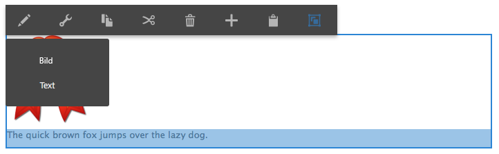

# Konfigurieren mehrerer Editoren für Bearbeitung im Kontext {#configure-multiple-in-place-editors}

Sie können den Rich-Text-Editor in Adobe Experience Manager so konfigurieren, dass er über mehrere Editoren für Bearbeitung im Kontext verfügt. Nach der Konfiguration können Sie den entsprechenden Inhalt auswählen und den passenden Editor öffnen.



## Konfigurieren mehrerer Editoren {#configure-multiple-editors}

Um die Verwendung mehrerer Editoren für Bearbeitung in Kontext zu ermöglichen, wurde die Struktur des Knotentyps `cq:InplaceEditingConfig` um die Definition des Knotentyps `cq:ChildEditorConfig` erweitert.

Beispiel:

```js
   /**
       * Configures in-place editing of a component.
       *
       * @prop active true to activate in-place editing for the component.
       * @prop editorType ID of in-place editor to use.
       * @prop cq:childEditors collection of {@link cq:ChildEditorConfig} nodes.
       * @prop configPath path to editor's config (optional).
       * @node config editor's config (used if no configPath is specified; optional).
     */
    [cq:InplaceEditingConfig] > nt:unstructured
      - active (boolean)
      - editorType (string)
      + cq:childEditors (nt:base) = nt:unstructured
      - configPath (string)
      + config (nt:unstructured) = nt:unstructured

    /**
      * Configures one child editor for a sub-component. The name of the this node is
      * used as DD ID.
      *
      * @prop type type of the inline editor. For example, ["image"].
      * @prop title Title of the inline editor.
      * @prop icon Icon to represent the inline editor.
    */
    [cq:ChildEditorConfig] > nt:unstructured
      orderable
      - type (string)
      - title (string)
```

Gehen Sie wie folgt vor, um mehrere Editoren zu konfigurieren:

1. Definieren Sie im Knoten `cq:inplaceEditing` (vom Typ `cq:InplaceEditingConfig`) die folgenden Eigenschaften:

   * Name:`editorType`
   * Typ: `String`
   * Wert: `hybrid`

1. Erstellen Sie unter diesem Knoten einen Knoten:

   * Name: `cq:ChildEditors`
   * Typ: `nt:unstructured`

1. Erstellen Sie unter dem Knoten `cq:childEditors` für jeden Editor für Bearbeitung in Kontext einen Knoten:

   * Name: Der Name jedes Knotens sollte wie bei Ablagezielen dem Namen der Eigenschaft entsprechen, die er repräsentiert. Zum Beispiel `image` und `text`.
   * Typ: `cq:ChildEditorConfig`

   >[!NOTE]
   >
   >Es besteht eine Korrelation zwischen den definierten Ablagezielen und den untergeordneten Editoren. Der Name des Knotens `cq:ChildEditorConfig` gilt als ID des Ablageziels und dient als Parameter für den ausgewählten untergeordneten Editor. Wenn der bearbeitbare Unterbereich kein Ablageziel hat (z. B. bei einer Textkomponente), dient der Name des untergeordneten Editors dennoch als ID zur Identifizierung des entsprechenden bearbeitbaren Bereichs.

1. Definieren Sie auf jedem dieser Knoten (`cq:ChildEditorConfig`) die folgenden Eigenschaften:

   * Name: `type`.
   * Wert: Durch Name des registrierten Editors für Bearbeitung in Kontext, beispielsweise `image` und `text`.

   * Name: `title`.
   * Wert: Der Titel, der in der Komponentenauswahlliste der verfügbaren Editoren angezeigt wird. Zum Beispiel `Image` und `Text`.

### Zusätzliche Konfiguration für Rich-Text-Editoren {#additional-configuration-for-rich-text-editors}

Die Konfiguration mehrerer Rich-Text-Editoren unterscheidet sich etwas vom zuvor beschriebenen Verfahren, da Sie jede einzelne RTE-Instanz separat konfigurieren können. Weitere Informationen finden Sie unter [Konfigurieren des Rich-Text-Editors](/help/sites-administering/rich-text-editor.md). Um mehrere RTEs verwenden zu können, benötigen Sie eine Konfiguration für jeden Rich-Text-Editor für Bearbeitung in Kontext. Adobe empfiehlt die Erstellung des neuen Konfigurationsknotens unter `cq:InplaceEditingConfig`, da jeder einzelne RTE eine andere Konfiguration haben kann. Legen Sie unter dem neuen Knoten die einzelnen RTE-Konfigurationen an.

```xml
    texttext
        cq:dialog
        cq:editConfig
            cq:inplaceEditing
                cq:childEditors
                    someconfig
                        text1
                            rtePlugins
                        text2
                            rtePlugins
```

>[!NOTE]
>
>Für Rich-Text-Editoren wird jedoch die Eigenschaft `configPath` unterstützt, wenn es nur eine Instanz des Text-Editors (bearbeitbarer Unterbereich) in der Komponente gibt. Diese Verwendung von `configPath` dient der Abwärtskompatibilität mit Dialogfeldern für ältere Benutzeroberflächen der Komponente.

>[!CAUTION]
>
>Benennen Sie den RTE-Konfigurationsknoten nicht mit `config`. Andernfalls sind die RTE-Konfigurationen nur für die Admins und nicht für die Benutzenden in der Gruppe `content-author` verfügbar.

## Code-Beispiele {#code-samples}

Den Code dieser Seite finden Sie unter [Projekt aem-authoring-hybrideditors auf GitHub](https://github.com/Adobe-Marketing-Cloud/aem-authoring-hybrideditors). Sie können das gesamte Projekt als [ZIP-Archiv](https://github.com/Adobe-Marketing-Cloud/aem-authoring-hybrideditors/archive/master.zip) herunterladen.

## Hinzufügen eines Editors für Bearbeitung im Kontext {#add-an-in-place-editor}

Allgemeine Informationen zum Hinzufügen eines Editors für Bearbeitung in Kontext finden Sie im Dokument [Anpassen der Seitenbearbeitung](/help/sites-developing/customizing-page-authoring-touch.md#add-new-in-place-editor).

>[!MORELIKETHIS]
>
>* [Konfigurieren des Rich-Text-Editors in Experience Manager](/help/sites-administering/rich-text-editor.md).
