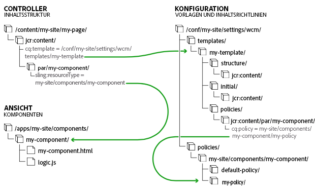

# Bearbeitbare Seitenvorlagen {#page-templates-editable}

Bearbeitbare Vorlagen wurden eingeführt in:

* Ermöglichen spezialisierten Autoren Folgendes [Vorlagen erstellen und bearbeiten](/help/sites-authoring/templates.md).

   * Diese spezialisierten Autoren werden als **Vorlagenautoren** bezeichnet.
   * Vorlagenautoren müssen Mitglieder der Gruppe `template-authors` sein.

* Stellen Sie Vorlagen bereit, die eine dynamische Verbindung zu allen daraus erstellten Seiten beibehalten. Dadurch wird sichergestellt, dass alle Änderungen an der Vorlage auf den Seiten selbst übernommen werden.
* Machen Sie die Seitenkomponente allgemeiner, damit die Seitenkomponente ohne Anpassung verwendet werden kann.

Mit bearbeitbaren Vorlagen werden die Teile, die eine Seite bilden, innerhalb von Komponenten isoliert. Sie können die erforderlichen Komponentenkombinationen in einer Benutzeroberfläche konfigurieren, sodass Sie die Entwicklung einer neuen Seitenkomponente für jede Seitenvariante vermeiden.

>[!NOTE]
>
>[Statische Vorlagen](/help/sites-developing/page-templates-static.md) sind auch verfügbar.

Dieses Dokument:

* Bietet einen Überblick über das Erstellen bearbeitbarer Vorlagen

   * Umfassende Informationen finden Sie unter [Erstellen von Seitenvorlagen](/help/sites-authoring/templates.md).

* Beschreibt die zum Erstellen bearbeitbarer Vorlagen erforderlichen Admin-/Entwickleraufgaben
* Beschreibt die technischen Grundlagen bearbeitbarer Vorlagen

Bei den in diesem Dokument beschriebenen Schritten wird vorausgesetzt, dass Sie bereits mit dem Erstellen und Bearbeiten von Vorlagen vertraut sind. Weitere Informationen finden Sie im Dokument [Erstellen von Seitenvorlagen](/help/sites-authoring/templates.md) für Autoren, das detailliert beschreibt, welche Funktionen Vorlagenautoren mit bearbeitbaren Vorlagen zur Verfügung stehen.

>[!NOTE]
>
>Das folgende Tutorial kann auch für das Einrichten einer bearbeitbaren Seitenvorlage in einem neuen Projekt von Interesse sein:
>[Erste Schritte mit AEM Sites Teil 2 – Erstellen einer Basisseite und Vorlage](https://experienceleague.adobe.com/docs/experience-manager-learn/getting-started-wknd-tutorial-develop/project-archetype/pages-templates.html?lang=en)

## Erstellen neuer Vorlagen {#creating-a-new-template}

Bearbeitbare Vorlagen werden von Vorlagenautoren in erster Linie mit der [Vorlagenkonsole und dem Vorlagen-Editor](/help/sites-authoring/templates.md) erstellt. In diesem Abschnitt finden Sie einen Überblick über diesen Prozess, der anschließend aus technischer Perspektive beleuchtet wird.

Informationen zur Verwendung bearbeitbarer Vorlagen in einem AEM finden Sie unter [Erstellen eines AEM mit Lazybones](https://experienceleaguecommunities.adobe.com/t5/adobe-experience-manager/create-aem-project-structure-using-lazybones/m-p/186478).

Gehen Sie zum Erstellen einer neuen bearbeitbaren Vorlage wie folgt vor:

1. Erstellen Sie eine [Ordner für die Vorlagen](#template-folders). Dieser Ordner ist nicht obligatorisch, wird jedoch als Best Practice empfohlen.
1. Wählen Sie einen [Vorlagentyp](#template-type) aus. Dieser Typ wird kopiert, um die [Vorlagendefinition](#template-definitions).

   >[!NOTE]
   >
   >Eine Auswahl von Vorlagentypen ist standardmäßig verfügbar. Sie können auch [eigene Site-spezifische Vorlagentypen erstellen](/help/sites-developing/page-templates-editable.md#creating-template-types), falls erforderlich.

1. Konfigurieren Sie die Struktur, die Inhaltsrichtlinien, den anfänglichen Inhalt und das Layout der neuen Vorlage.

   **Struktur**

   * Die Struktur ermöglicht die Definition von Komponenten und Inhalten für Ihre Vorlage.
   * Komponenten, die in der Vorlagenstruktur definiert sind, können nicht auf einer resultierenden Seite verschoben oder von den resultierenden Seiten gelöscht werden.

      * Wenn Sie eine Vorlage in einem benutzerdefinierten Ordner außerhalb der `We.Retail` Beispielinhalt: Sie können Foundation-Komponenten auswählen oder [Kernkomponenten](https://experienceleague.adobe.com/docs/experience-manager-core-components/using/developing/overview.html?lang=de).
   * Wenn Seitenautoren Komponenten hinzufügen und entfernen können sollen, fügen Sie der Vorlage ein Absatzsystem hinzu.
   * Komponenten lassen sich entsperren und erneut sperren, damit Sie den anfänglichen Inhalt definieren können.

   Einzelheiten dazu, wie Vorlagenautoren Strukturen definieren können, finden Sie unter [Erstellen von Seitenvorlagen](/help/sites-authoring/templates.md#editing-a-template-structure-template-author).

   Technische Details zur Struktur werden in diesem Dokument unter [Struktur](/help/sites-developing/page-templates-editable.md#structure) erläutert.

   **Richtlinien**

   * Die Richtlinien für Inhalte definieren die Design-Eigenschaften einer Komponente.

      * Zum Beispiel die verfügbaren Komponenten oder minimale/maximale Abmessungen.
   * Diese Richtlinien gelten für die Vorlage (und die mit der Vorlage erstellten Seiten).

   Weitere Informationen dazu, wie Vorlagenautoren Richtlinien definieren, finden Sie unter [Erstellen von Seitenvorlagen](/help/sites-authoring/templates.md#editing-a-template-structure-template-author).

   Technische Details zu Richtlinien finden Sie unter [Inhaltsrichtlinien](/help/sites-developing/page-templates-editable.md#content-policies) in diesem Dokument.

   **Anfänglicher Inhalt**

   * Anfänglicher Inhalt definiert Inhalte, die angezeigt werden, wenn eine Seite zum ersten Mal auf der Grundlage der Vorlage erstellt wird.
   * Anfänglicher Inhalt kann dann von Seitenautoren bearbeitet werden.

   Einzelheiten dazu, wie Vorlagenautoren Strukturen definieren können, finden Sie unter [Erstellen von Seitenvorlagen](/help/sites-authoring/templates.md#editing-a-template-initial-content-author).

   Technische Details zum anfänglichen Inhalt finden Sie unter [Anfänglicher Inhalt](/help/sites-developing/page-templates-editable.md#initial-content) in diesem Dokument.

   **Layout**

   * Sie können das Vorlagen-Layout für verschiedene Geräte definieren.
   * Responsives Layout funktioniert für Vorlagen ebenso wie für die Seitenbearbeitung.

   Weitere Informationen dazu, wie Vorlagenautoren das Vorlagenlayout definieren, finden Sie unter [Erstellen von Seitenvorlagen](/help/sites-authoring/templates.md#editing-a-template-layout-template-author).

   Technische Details zum Vorlagenlayout finden Sie unter [Layout](/help/sites-developing/page-templates-editable.md#layout) in diesem Dokument.

1. Aktivieren Sie die Vorlage und lassen Sie sie dann für bestimmte Inhaltsbäume zu.

   * Eine Vorlage kann aktiviert oder deaktiviert werden, damit sie für Seitenautoren verfügbar oder nicht verfügbar ist.
   * Eine Vorlage kann für bestimmte Seitenverzweigungen verfügbar oder nicht verfügbar gemacht werden.

   Weitere Informationen dazu, wie Vorlagenautoren Vorlagen aktivieren, finden Sie unter [Erstellen von Seitenvorlagen](/help/sites-authoring/templates.md#enabling-and-allowing-a-template-template-author).

   Technische Details zum Aktivieren von Vorlagen werden in diesem Dokument unter [Aktivieren und Zulassen von Vorlagen](/help/sites-developing/page-templates-editable.md#enabling-and-allowing-a-template-for-use) erläutert.

1. Verwenden Sie sie, um Inhaltsseiten zu erstellen.

   * Wenn Sie eine Vorlage zum Erstellen einer Seite verwenden, gibt es keinen sichtbaren Unterschied und keinen Hinweis zwischen statischen und bearbeitbaren Vorlagen.
   * Für die Seitenautoren ist der Prozess transparent.

   Einzelheiten dazu, wie Seitenautoren Vorlagen zum Erstellen von Seiten verwenden können, finden Sie unter [Erstellen und Organisieren von Seiten](/help/sites-authoring/managing-pages.md#templates).

   Technische Details zu den Richtlinien werden in diesem Dokument unter [Resultierende Inhaltsseiten](/help/sites-developing/page-templates-editable.md#resultant-content-pages) erläutert.

>[!TIP]
>
>Geben Sie in eine Vorlage nie Informationen ein, die internationalisiert werden müssen. Für die Zwecke der Internalisierung [Lokalisierungsfunktion der Kernkomponenten](https://experienceleague.adobe.com/docs/experience-manager-core-components/using/get-started/localization.html?lang=de) wird empfohlen.

>[!NOTE]
>
>Vorlagen sind leistungsstarke Tools zur Optimierung des Seitenerstellungs-Workflows. Allerdings können zu viele Vorlagen die Autoren überwältigen und das Erstellen von Seiten unübersichtlich machen. Eine gute Faustregel ist, die Anzahl der Vorlagen unter 100 zu halten.
>
>Adobe empfiehlt, aufgrund möglicher Leistungsauswirkungen nicht mehr als 1.000 Vorlagen zu verwenden.

>[!NOTE]
>
>Die Client-Bibliothek des Editors setzt voraus, dass die `cq.shared` -Namespace in Inhaltsseiten. Wenn sie nicht vorhanden ist, tritt der JavaScript-Fehler auf `Uncaught TypeError: Cannot read property 'shared' of undefined`.
>
>Alle Beispielinhaltsseiten enthalten `cq.shared`, sodass jeglicher darauf basierender Inhalt automatisch `cq.shared` umfasst. Wenn Sie sich jedoch ganz neue eigene Inhaltsseiten erstellen möchten, die nicht auf Beispielinhalt basieren, müssen Sie sicherstellen, dass Sie den Namespace `cq.shared` einbinden.
>
>Weitere Informationen finden Sie unter [Verwendung Client-seitiger Bibliotheken](/help/sites-developing/clientlibs.md).

## Vorlagenordner {#template-folders}

Zum Organisieren Ihrer Vorlagen können Sie die folgenden Ordner verwenden:

* **global**
* Site-spezifisch Die Site-spezifischen Ordner, die Sie zum Organisieren Ihrer Vorlagen erstellen, werden mit einem Konto mit Administratorrechten erstellt.

>[!NOTE]
>
>Obwohl Sie Ihre Ordner verschachteln können, werden sie den Benutzern in der **Vorlagenkonsole** als flache Struktur angezeigt.

In einer AEM Standardinstanz wird die **global** -Ordner in der Vorlagenkonsole vorhanden ist. Dieser Ordner enthält Standardvorlagen und dient als Fallback, wenn keine Richtlinien und/oder Vorlagentypen im aktuellen Ordner gefunden werden. Sie können diesem Ordner Ihre Standardvorlagen hinzufügen oder einen Ordner erstellen (empfohlen).

>[!NOTE]
>
>Es empfiehlt sich, einen Ordner für Ihre benutzerdefinierten Vorlagen zu erstellen und nicht den Ordner &quot;global&quot;.

>[!CAUTION]
>
>Ordner müssen von einem Benutzer mit `admin`-Rechten erstellt werden.

Arten von Vorlagen und Richtlinien werden gemäß der folgenden Rangordnung in allen Ordnern übernommen:

1. der aktuelle Ordner.
1. Übergeordnete Elemente oder übergeordnete Elemente des aktuellen Ordners.
1. `/conf/global`
1. `/apps`
1. `/libs`

Eine Liste aller zulässigen Einträge wird erstellt. Wenn sich Konfigurationen (`path`/`label`) überschneiden, wird den Benutzern nur die Instanz angezeigt, die dem aktuellen Ordner am nächsten ist.

Gehen Sie wie folgt vor, um einen Ordner zu erstellen:

* Programmierbar oder mit CRXDE Lite
* Verwenden des Konfigurations-Browsers

## Verwenden von CRXDE Lite  {#using-crxde-lite}

1. Ein neuer Ordner (unter „/conf“) kann für Ihre Instanz entweder programmgesteuert oder mit CRXDE Lite erstellt werden.

   Die folgende Struktur muss verwendet werden:

   ```xml
   /conf
       <your-folder-name> [sling:Folder]
           settings [sling:Folder]
               wcm [cq:Page]
                   templates [cq:Page]
                   policies [cq:Page]
   ```

1. Anschließend können Sie die folgenden Eigenschaften für den Stammknoten des Ordners definieren:

   `<your-folder-name> [sling:Folder]`

   Name: `jcr:title`

   * Typ: `String`

   * Wert: Der Titel (für den Ordner), der in der **Vorlagen**-Konsole angezeigt werden soll

1. In *Addition* auf die standardmäßigen Authoring-Berechtigungen und -Berechtigungen (z. B. `content-authors`), weisen Sie Gruppen zu und definieren Sie die erforderlichen Zugriffsrechte (ACLs), damit Ihre Autoren Vorlagen im neuen Ordner erstellen können.

   Die `template-authors` -Gruppe ist die Standardgruppe, die zugewiesen werden muss. Weitere Informationen finden Sie im folgenden Abschnitt [ACLs und Gruppen](/help/sites-developing/page-templates-editable.md#acls-and-groups).

   Umfassende Informationen zum Verwalten und Zuweisen von Zugriffsrechten finden Sie unter [Verwalten von Zugriffsrechten](/help/sites-administering/user-group-ac-admin.md#access-right-management).

### Verwenden des Konfigurations-Browsers {#using-the-configuration-browser}

1. Wechseln Sie zu **Globale Navigation** > **Tools** > **Konfigurations-Browser**.

   Die vorhandenen Ordner werden links aufgelistet, einschließlich des Ordners **global**.

1. Klicken Sie auf **Erstellen**.
1. Im **Konfiguration erstellen** angezeigt werden, müssen die folgenden Felder konfiguriert werden:

   * **Titel**: Geben Sie einen Titel für den Konfigurationsordner an
   * **Bearbeitbare Vorlagen**: Aktivieren Sie diese Option, um bearbeitbare Vorlagen in diesem Ordner zuzulassen.

1. Klicken Sie auf **Erstellen**.

>[!NOTE]
>
>Im Konfigurationsbrowser können Sie den Ordner &quot;global&quot;bearbeiten und die **Bearbeitbare Vorlagen** , wenn Sie Vorlagen in diesem Ordner erstellen möchten. Diese Vorgehensweise wird jedoch nicht empfohlen.
>
>Weitere Informationen finden Sie in der Dokumentation zum [Konfigurationsbrowser](/help/sites-administering/configurations.md).

### ACLs und Gruppen {#acls-and-groups}

Nachdem Ihre Vorlagenordner erstellt wurden (entweder über CRXDE oder mit dem Konfigurations-Browser), müssen ACLs für die entsprechenden Gruppen für die Vorlagenordner definiert werden, um eine ordnungsgemäße Sicherheit zu gewährleisten.

Die Vorlagenordner für die [`We.Retail` Referenzimplementierung](/help/sites-developing/we-retail.md) kann als Beispiel verwendet werden.

#### Die Gruppe „template-authors“  {#the-template-authors-group}

Die Gruppe `template-authors` ist die Gruppe zum Verwalten des Zugriffs auf Vorlagen und standardmäßig in AEM integriert. Sie ist aber leer. Benutzer müssen der Gruppe für das Projekt bzw. die Site hinzugefügt werden.

>[!CAUTION]
>
>Die `template-authors` Gruppe ist *only* für Benutzer, die Vorlagen erstellen können müssen.
>
>Die Bearbeitung von Vorlagen ist leistungsstark und bei nicht ordnungsgemäßer Ausführung können vorhandene Vorlagen beschädigt werden. Daher sollte diese Rolle fokussiert sein und nur qualifizierte Benutzer einschließen.

In der folgenden Tabelle sind die erforderlichen Berechtigungen für die Vorlagenbearbeitung aufgeführt.

<table>
 <tbody>
  <tr>
   <th>Pfad</th>
   <th>Rolle/Gruppe</th>
   <th>Berechtigungen<br /> </th>
   <th>Beschreibung</th>
  </tr>
  <tr>
   <td rowspan="3"><code>/conf/&lt;<i>your-folder</i>&gt;/settings/wcm/templates</code></td>
   <td>Vorlagenautoren<br /> </td>
   <td>lesen, schreiben, replizieren</td>
   <td>Vorlagenautoren, die Vorlagen erstellen, lesen, aktualisieren, löschen und replizieren Site-spezifisch <code>/conf</code> space</td>
  </tr>
  <tr>
   <td>Anonymer Web-Anwender</td>
   <td>lesen</td>
   <td>Anonymer Web-Anwender muss Vorlagen beim Rendern einer Seite lesen</td>
  </tr>
  <tr>
   <td>Autoren von Inhalten</td>
   <td>replizieren</td>
   <td>replicateContent-Autoren müssen beim Aktivieren einer Seite die Vorlagen einer Seite aktivieren</td>
  </tr>
  <tr>
   <td rowspan="3"><code>/conf/&lt;<i>your-folder</i>&gt;/settings/wcm/policies</code></td>
   <td><code>Template Author</code></td>
   <td>lesen, schreiben, replizieren</td>
   <td>Vorlagenautoren, die Vorlagen erstellen, lesen, aktualisieren, löschen und replizieren Site-spezifisch <code>/conf</code> space</td>
  </tr>
  <tr>
   <td>Anonymer Web-Anwender</td>
   <td>lesen</td>
   <td>Anonymer Web-Anwender muss beim Rendern einer Seite Richtlinien lesen</td>
  </tr>
  <tr>
   <td>Autoren von Inhalten</td>
   <td>replizieren</td>
   <td>Inhaltsautoren müssen beim Aktivieren einer Seite die Richtlinien einer Vorlage einer Seite aktivieren</td>
  </tr>
  <tr>
   <td rowspan="2"><code>/conf/&lt;site&gt;/settings/template-types</code></td>
   <td>Vorlagenautor</td>
   <td>lesen</td>
   <td>Der Vorlagenautor erstellt eine Vorlage anhand eines der vordefinierten Vorlagentypen.</td>
  </tr>
  <tr>
   <td>Anonymer Web-Anwender</td>
   <td>keine</td>
   <td>Anonymer Web-Anwender darf nicht auf die Vorlagentypen zugreifen</td>
  </tr>
 </tbody>
</table>

Diese standardmäßige `template-authors`-Gruppe umfasst nur die Projekteinstellungen, bei denen alle Mitglieder von `template-authors` auf alle Vorlagen zugreifen und diese erstellen dürfen. Für komplexere Setups, bei denen mehrere Vorlagenautorengruppen den Zugriff auf Vorlagen trennen müssen, müssen weitere benutzerdefinierte Vorlagenautorengruppen erstellt werden. Die Berechtigungen für die Vorlagenautorengruppen sind jedoch weiterhin identisch.

#### Ältere Vorlagen unter /conf/global {#legacy-templates-under-conf-global}

Speichern Sie keine Vorlagen in `/conf/global`. Bei einigen älteren Installationen gibt es jedoch möglicherweise noch Vorlagen an diesem Speicherort. *Nur* in solchen Legacy-Situationen sollte Folgendes `/conf/global` Pfade explizit konfiguriert werden.

<table>
 <tbody>
  <tr>
   <th>Pfad</th>
   <th>Rolle/Gruppe</th>
   <th>Berechtigungen<br /> </th>
   <th>Beschreibung</th>
  </tr>
  <tr>
   <td rowspan="3"><code>/conf/global/settings/wcm/templates</code></td>
   <td>Vorlage   Autoren</td>
   <td>lesen, schreiben, replizieren</td>
   <td>Vorlagenautoren, die Vorlagen erstellen, lesen, aktualisieren, löschen und replizieren <code>/conf/global</code></td>
  </tr>
  <tr>
   <td>Anonymer Web-Anwender</td>
   <td>lesen</td>
   <td>Anonymer Web-Anwender muss Vorlagen beim Rendern einer Seite lesen</td>
  </tr>
  <tr>
   <td>Autoren von Inhalten</td>
   <td>replizieren</td>
   <td>Inhaltsautoren müssen beim Aktivieren einer Seite die Vorlagen einer Seite aktivieren</td>
  </tr>
  <tr>
   <td rowspan="3"><code>/conf/global/settings/wcm/policies</code></td>
   <td><code>Template Author</code></td>
   <td>lesen, schreiben, replizieren</td>
   <td>Vorlagenautoren, die Vorlagen erstellen, lesen, aktualisieren, löschen und replizieren <code>/conf/global</code></td>
  </tr>
  <tr>
   <td>Anonymer Web-Anwender</td>
   <td>lesen</td>
   <td>Anonymer Web-Anwender muss beim Rendern einer Seite Richtlinien lesen</td>
  </tr>
  <tr>
   <td>Autoren von Inhalten</td>
   <td>replizieren</td>
   <td>Inhaltsautoren müssen beim Aktivieren einer Seite die Richtlinien einer Vorlage einer Seite aktivieren</td>
  </tr>
  <tr>
   <td rowspan="2"><code>/conf/global/settings/wcm/template-types</code></td>
   <td>Vorlagenautor</td>
   <td>lesen</td>
   <td>Der Vorlagenautor erstellt eine Vorlage basierend auf einem der vordefinierten Vorlagentypen</td>
  </tr>
  <tr>
   <td>Anonymer Web-Anwender</td>
   <td>keine</td>
   <td>Anonymer Web-Anwender darf nicht auf die Vorlagentypen zugreifen</td>
  </tr>
 </tbody>
</table>

## Vorlagentyp {#template-type}

Geben Sie beim Erstellen einer Vorlage einen Vorlagentyp an:

* Vorlagentypen stellen effektiv Vorlagen für eine Vorlage bereit. Bei der Erstellung einer Vorlage werden Struktur und anfänglicher Inhalt des ausgewählten Vorlagentyps zum Erstellen der Vorlage verwendet.

   * Der Vorlagentyp wird kopiert, um die Vorlage zu erstellen.
   * Sobald die Kopie erfolgt ist, ist die einzige Verbindung zwischen der Vorlage und dem Vorlagentyp eine statische Referenz zu Informationszwecken.

* Mit Vorlagentypen können Sie Folgendes definieren:

   * Der Ressourcentyp der Seitenkomponente.
   * Die Richtlinie des Stammknotens, die die im Vorlageneditor zulässigen Komponenten definiert.
   * Adobe empfiehlt, die Haltepunkte für das responsive Raster und die Einrichtung des mobilen Emulators auf dem Vorlagentyp zu definieren. Dieser Schritt ist optional, da die Konfiguration auch für die jeweilige Vorlage definiert werden kann (siehe [Vorlagentyp und Mobilgerätegruppen](/help/sites-developing/page-templates-editable.md#p-template-type-and-mobile-device-groups-br-p)).

* AEM stellt einige vordefinierte Vorlagentypen wie HTML5-Seiten und Seiten mit adaptivem Formular bereit.

   * Weitere Beispiele finden Sie im Abschnitt [`We.Retail`](/help/sites-developing/we-retail.md) Beispielinhalt.

* Vorlagentypen werden normalerweise von Entwicklern definiert.

Die vordefinierten Vorlagentypen werden unter folgendem Pfad gespeichert:

* `/libs/settings/wcm/template-types`

>[!CAUTION]
>
>Ändern Sie nichts im `/libs` Pfad. Der Grund dafür ist, dass der Inhalt von `/libs` wird beim nächsten Upgrade Ihrer Instanz überschrieben (und kann überschrieben werden, wenn Sie einen Hotfix oder ein Feature Pack anwenden).

Ihre Site-spezifischen Vorlagentypen sollten an einer mit dem folgenden Pfad vergleichbaren Stelle gespeichert werden:

* `/apps/settings/wcm/template-types`

Definitionen für Ihre benutzerdefinierten Vorlagentypen sollten in benutzerdefinierten Ordnern (empfohlen) oder alternativ im Ordner `global` gespeichert werden. Beispiel:

* `/conf/<my-folder-01>/<my-folder-02>/settings/wcm/template-types`
* `/conf/<my-folder>/settings/wcm/template-types`
* `/conf/global/settings/wcm/template-types`

>[!CAUTION]
>
>Die Vorlagentypen müssen die richtige Ordnerstruktur (d. h. `/settings/wcm/...`), andernfalls werden die Vorlagentypen nicht gefunden.

### Vorlagentyp und Mobilgerätegruppen {#template-type-and-mobile-device-groups-br}

Die [Gerätegruppen](/help/sites-developing/mobile.md#device-groups), die für eine bearbeitbare Vorlage verwendet werden (als relativer Pfad der Eigenschaft `cq:deviceGroups` festgelegt), definieren, welche mobilen Geräte als Emulatoren im [Layout-Modus](/help/sites-authoring/responsive-layout.md) der Seitenbearbeitung verfügbar sind. Dieser Wert kann an zwei Stellen festgelegt werden:

* Über den bearbeitbaren Vorlagentyp
* Auf der bearbeitbaren Vorlage

Beim Erstellen einer neuen bearbeitbaren Vorlage wird der Wert aus dem Vorlagentyp in die jeweilige Vorlage kopiert. Wenn der Wert nicht für den Typ festgelegt ist, kann er für die Vorlage festgelegt werden. Sobald eine Vorlage erstellt wurde, findet keine Vererbung vom Typ auf die Vorlage statt.

>[!CAUTION]
>
>Der Wert von `cq:deviceGroups` muss als relativer Pfad wie `mobile/groups/responsive` festgelegt werden und nicht als absoluter Pfad wie `/etc/mobile/groups/responsive`.

>[!NOTE]
>
>Bei [statischen Vorlagen](/help/sites-developing/page-templates-static.md) lässt sich der Wert von `cq:deviceGroups` im Stammverzeichnis der Site festlegen.
>
>Bei bearbeitbaren Vorlagen wird dieser Wert nun auf Vorlagenebene gespeichert und nicht mehr auf der Stammebene der Seiten unterstützt.

### Erstellen von Vorlagentypen {#creating-template-types}

Wenn Sie eine Vorlage erstellt haben, die als Grundlage für andere Vorlagen dienen kann, können Sie diese Vorlage als Vorlagentyp kopieren.

1. Erstellen Sie eine Vorlage wie jede andere bearbeitbare Vorlage [wie hier beschrieben](/help/sites-authoring/templates.md#creating-a-new-template-template-author), der als Grundlage für Ihren Vorlagentyp dienen kann.
1. Kopieren Sie mithilfe von CRXDE Lite die neu erstellte Vorlage aus dem `templates` Knoten zu `template-types` Knoten unter [Vorlagenordner](/help/sites-developing/page-templates-editable.md#template-folders).
1. Löschen Sie die Vorlage aus dem Knoten `templates` unter dem [Vorlagenordner](/help/sites-developing/page-templates-editable.md#template-folders).
1. Löschen Sie in der Kopie der Vorlage, die sich unter dem `template-types`-Knoten befindet, alle `cq:template`- und `cq:templateType`-Eigenschaften aus allen `jcr:content`-Knoten.

Sie können auch Ihren eigenen Vorlagentyp entwickeln, indem Sie eine bearbeitbare Beispielvorlage von GitHub als Grundlage verwenden.

CODE FÜR GITHUB

Den Code dieser Seite finden Sie auf GitHub.

* [Öffnen Sie das Projekt aem-sites-example-custom-template-type auf GitHub](https://github.com/Adobe-Marketing-Cloud/aem-sites-example-custom-template-type).
* Laden Sie das Projekt als [ZIP-Datei](https://codeload.github.com/Adobe-Marketing-Cloud/aem-sites-example-custom-template-type/zip/refs/heads/master) herunter.

## Vorlagendefinitionen {#template-definitions}

Definitionen für bearbeitbare Vorlagen werden in [benutzerdefinierten Ordnern](/help/sites-developing/page-templates-editable.md#template-folders) (empfohlen) oder alternativ im Ordner `global` gespeichert. Beispiel:

* `/conf/<my-folder>/settings/wcm/templates`
* `/conf/<my-folder-01>/<my-folder-02>/settings/wcm/templates`
* `/conf/global/settings/wcm/templates`

Der Stammknoten der Vorlage weist den Typ `cq:Template` und das folgende Strukturgerüst auf:

```xml
<template-name>
  initial
    jcr:content
      root
        <component>
        ...
        <component>
  jcr:content
    @property status
  policies
    jcr:content
      root
        @property cq:policy
        <component>
          @property cq:policy
        ...
        <component>
          @property cq:policy
  structure
    jcr:content
      root
        <component>
        ...
        <component>
      cq:responsive
        breakpoints
  thumbnail.png
```

Die Hauptelemente sind:

* `<template-name>`

   * ` [initial](#initial-content)`
   * `jcr:content`
   * ` [structure](#structure)`
   * ` [policies](#policies)`
   * `thumbnail.png`

### jcr:content {#jcr-content}

Dieser Knoten enthält Eigenschaften für die Vorlage:

* **Name**: `jcr:title`

* **Name**: `status`

   * **Typ**: `String`

   * **Wert**: `draft`, `enabled`oder `disabled`

### Struktur {#structure}

Definiert die Struktur der resultierenden Seite:

* Wird mit dem anfänglichen Inhalt zusammengeführt ( `/initial`) beim Erstellen einer Seite.
* Änderungen an der Struktur werden auf allen Seiten übernommen, die mit der Vorlage erstellt werden.
* Die `root` ( `structure/jcr:content/root`) definiert die Liste der Komponenten, die auf der resultierenden Seite verfügbar sind.

   * Komponenten, die in der Vorlagenstruktur definiert sind, können in resultierenden Seiten nicht verschoben oder gelöscht werden.
   * Nachdem eine Komponente entsperrt wurde, wird die `editable` -Eigenschaft auf `true`.

   * Nachdem eine Komponente, die bereits Inhalt enthält, entsperrt wurde, wird dieser Inhalt in die `initial` -Verzweigung.

* Der Knoten `cq:responsive` enthält Definitionen für das responsive Layout.

### Anfänglicher Inhalt {#initial-content}

Definiert den anfänglichen Inhalt, den eine neue Seite bei der Erstellung hat:

* Er enthält einen Knoten `jcr:content`, der auf alle neue Seiten kopiert wird.
* Ist mit der Struktur zusammengeführt ( `/structure`) beim Erstellen einer Seite.
* Alle vorhandenen Seiten werden aktualisiert, wenn der anfängliche Inhalt nach der Erstellung geändert wird.
* Die `root` -Knoten enthält eine Liste von Komponenten, um zu definieren, was auf der resultierenden Seite verfügbar ist.
* Wenn einer Komponente im Strukturmodus Inhalt hinzugefügt wird und diese Komponente später entsperrt (oder umgekehrt) wird, wird dieser Inhalt als anfänglicher Inhalt verwendet.

### Layout {#layout}

Wann [Vorlagen bearbeiten, können Sie das Layout definieren](/help/sites-authoring/templates.md)verwendet diese Vorgehensweise [Standard-responsives Layout](/help/sites-authoring/responsive-layout.md) das auch [konfiguriert](/help/sites-administering/configuring-responsive-layout.md).

### Inhaltsrichtlinien {#content-policies}

Die Inhalts- (oder Design-)Richtlinien definieren die Designeigenschaften einer Komponente, z. B. die Verfügbarkeit der Komponente oder minimale/maximale Dimensionen. Diese Richtlinien gelten für die Vorlage (und die mit der Vorlage erstellten Seiten). Inhaltsrichtlinien können mit dem Vorlageneditor erstellt und ausgewählt werden.

* Die Eigenschaft `cq:policy` im Knoten `root`
   `/conf/<your-folder>/settings/wcm/templates/<your-template>/policies/jcr:content/root`
Stellt einen relativen Verweis auf die Inhaltsrichtlinie für das Absatzsystem der Seite bereit.

* Die Eigenschaft `cq:policy` der komponentenexpliziten Knoten unter `root` stellt Links zu den Richtlinien für die einzelnen Komponenten bereit.

* Die tatsächlichen Richtliniendefinitionen werden gespeichert unter:
   `/conf/<your-folder>/settings/wcm/policies/wcm/foundation/components`

>[!NOTE]
>
>Die Pfade der Richtliniendefinitionen sind vom Pfad der Komponente abhängig. Die `cq:policy` enthält einen relativen Verweis auf die Konfiguration selbst.

>[!NOTE]
>
>Für Seiten, die anhand bearbeitbarer Vorlagen erstellt wurden, steht der Design-Modus im Seiten-Editor nicht zur Verfügung.
>
>Die Baumstruktur `policies` einer bearbeitbaren Vorlage weist dieselbe Hierarchie auf wie die Designmodus-Konfiguration einer statischen Vorlage unter:
>
>`/etc/designs/<my-site>/jcr:content/<component-name>`
>
>Die Designmoduskonfiguration einer statischen Vorlage wurde pro Seitenkomponente definiert.

### Seitenrichtlinien {#page-policies}

Seitenrichtlinien ermöglichen es, die [Inhaltsrichtlinie](#content-policies) für die Seite (Hauptabsatzsystem) entweder in der Vorlage oder den resultierenden Seiten zu definieren.

### Aktivieren und Zulassen einer Vorlage {#enabling-and-allowing-a-template-for-use}

1. **Aktivieren der Vorlage**

   Bevor eine Vorlage verwendet werden kann, muss sie wie folgt aktiviert werden:

   * [Vorlage aktivieren](/help/sites-authoring/templates.md#enablingatemplateauthor) von **Vorlagen** Konsole.

   * Durch Festlegen der Statuseigenschaft des Knotens `jcr:content`

      * Zum Beispiel unter:
         `/conf/<your-folder>/settings/wcm/templates/<your-template>/jcr:content`

      * Definieren Sie die Eigenschaft:

         * Name: status
         * Typ: String
         * Wert: `enabled`

1. **Zugelassene Vorlagen**

   * [Definieren Sie die Pfade für zulässige Vorlagen auf der **Seiteneigenschaften**](/help/sites-authoring/templates.md#allowing-a-template-author) der entsprechenden Seite oder Stammseite einer Unterverzweigung.
   * Legen Sie die folgende Eigenschaft fest:
      `cq:allowedTemplates`
Im 
`jcr:content`-Knoten der erforderlichen Verzweigung.
   Beispielsweise mit dem Wert:

   `/conf/<your-folder>/settings/wcm/templates/.*`

## Resultierende Inhaltsseiten {#resultant-content-pages}

Für Seiten, die anhand bearbeitbarer Vorlagen erstellt wurden, gilt Folgendes:

* Sie werden mit einer Unterbaumstruktur erstellt, die aus `structure` und `initial` in der Vorlage zusammengeführt wird.

* Sie enthalten Verweise auf Informationen, die in der Vorlage und im Vorlagentyp enthalten sind. Diese Funktion können Sie mit einer `jcr:content` Knoten mit den Eigenschaften:

   * `cq:template`
Stellt den dynamischen Verweis auf die aktuelle Vorlage bereit und ermöglicht es, Änderungen an der Vorlage auf den aktuellen Seiten widerzuspiegeln.

   * `cq:templateType`
Stellt einen Verweis auf den Vorlagentyp bereit.



Das obige Diagramm veranschaulicht, wie Vorlagen, Inhalte und Komponenten zusammenhängen:

* Controller – `/content/<my-site>/<my-page>`
Die resultierende Seite, die auf die Vorlage verweist. Der Inhalt steuert den gesamten Prozess. Gemäß den Definitionen greift er auf die entsprechende Vorlage und Komponenten zu.

* Konfiguration – `/conf/<my-folder>/settings/wcm/templates/<my-template>`
Die [Vorlage und zugehörigen Inhaltsrichtlinien](#template-definitions) definieren die Seitenkonfiguration.

* Modell – OSGi-Bundles Die [OSGi-Bundles](/help/sites-deploying/osgi-configuration-settings.md) implementieren die Funktionalität.

* Anzeigen - `/apps/<my-site>/components`
Sowohl in der Autoren- als auch in der Veröffentlichungsumgebung wird der Inhalt von [Komponenten](/help/sites-developing/components.md).

Beim Rendern einer Seite:

* **Vorlagen**:

   * Die `cq:template` -Eigenschaft `jcr:content` -Knoten referenziert wird, um auf die Vorlage zuzugreifen, die dieser Seite entspricht.

* **Komponenten**:

   * Die Seitenkomponente führt die `structure/jcr:content` Struktur der Vorlage mit der `jcr:content` Baum der Seite.

   * Die Seitenkomponente ermöglicht es dem Autor nur, die Knoten der Vorlagenstruktur zu bearbeiten, die als bearbeitbar gekennzeichnet wurden (und alle untergeordneten Elemente).
   * Beim Rendern einer Komponente auf einer Seite wird der relative Pfad dieser Komponente aus dem `jcr:content` Knoten; derselbe Pfad unter `policies/jcr:content` -Knoten der Vorlage durchsucht.

      * Die `cq:policy` -Eigenschaft dieses Knotens auf die eigentliche Inhaltsrichtlinie verweist (d. h. sie enthält die Designkonfiguration für diese Komponente).

      * Mit dieser Funktion können Sie über mehrere Vorlagen verfügen, die dieselben Inhaltsrichtlinienkonfigurationen wiederverwenden.
