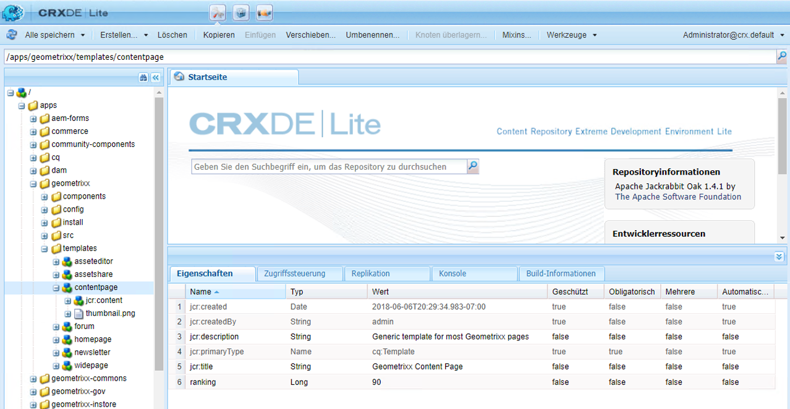
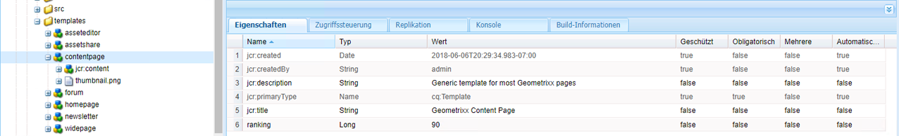
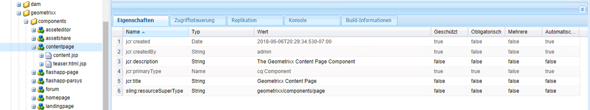
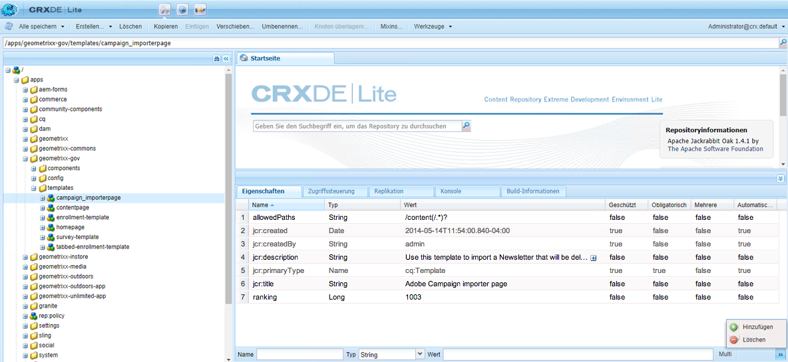
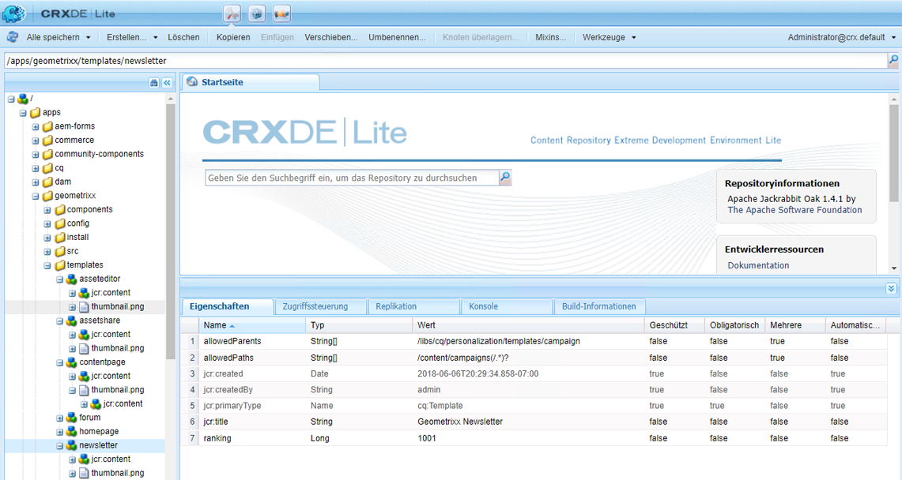

# Seitenvorlagen - statisch{#page-templates-static}

Eine Vorlage wird verwendet, um eine Seite zu erstellen. Sie definiert, welche Komponenten im ausgewählten Umfang genutzt werden können. Eine Vorlage ist eine Hierarchie von Knoten, die dieselbe Struktur aufweist wie die zu erstellende Seite, aber keine Inhalte.

Jede Vorlage stellt Ihnen eine Auswahl an Komponenten bereit, die Sie verwenden können.

* Vorlagen bestehen aus [Komponenten](/help/sites-developing/components.md).
* Komponenten nutzen Widgets und bieten Zugriff auf Widgets. Mit Widgets werden die Inhalte gerendert.

>[!NOTE]
>
>[Auch bearbeitbare ](/help/sites-developing/page-templates-editable.md) Vorlagen stehen zur Verfügung und sind der empfohlene Typ von Vorlagen für höchste Flexibilität und die neuesten Funktionen.

## Eigenschaften und untergeordnete Knoten einer Vorlage {#properties-and-child-nodes-of-a-template}

Eine Vorlage ist ein Knoten des Typs cq:Template mit den folgenden Eigenschaften und untergeordneten Knoten:

<table>
 <tbody>
  <tr>
   <td><strong>Name   </strong></td>
   <td><strong>Typ   </strong></td>
   <td><strong>Beschreibung   </strong></td>
  </tr>
  <tr>
   <td>.   </td>
   <td> cq:Template</td>
   <td>Aktuelle Vorlage. Eine Vorlage weist den Knotentyp cq:Template auf  </td>
  </tr>
  <tr>
   <td> allowedChildren </td>
   <td> Zeichenfolge[]</td>
   <td>Pfad einer Vorlage, die dieser Vorlage untergeordnet sein darf.  </td>
  </tr>
  <tr>
   <td> allowedParents</td>
   <td> Zeichenfolge[]</td>
   <td>Pfad einer Vorlage, die als übergeordnetes Element dieser Vorlage zulässig ist.  </td>
  </tr>
  <tr>
   <td> allowedPaths</td>
   <td> Zeichenfolge[]</td>
   <td>Pfad einer Seite, für die diese Vorlage zulässig ist.  </td>
  </tr>
  <tr>
   <td> jcr:created</td>
   <td> Datum </td>
   <td>Erstellungsdatum der Vorlage.  </td>
  </tr>
  <tr>
   <td> jcr:description</td>
   <td> Zeichenfolge</td>
   <td>Beschreibung der Vorlage.  </td>
  </tr>
  <tr>
   <td> jcr:title</td>
   <td> Zeichenfolge</td>
   <td>Titel der Vorlage.  </td>
  </tr>
  <tr>
   <td> Ranking</td>
   <td> Long</td>
   <td>Rang der Vorlage. Wird verwendet, um die Vorlage in der Benutzeroberfläche anzuzeigen  </td>
  </tr>
  <tr>
   <td> jcr:content</td>
   <td> cq:PageContent</td>
   <td>Knoten, der den Inhalt der Vorlage enthält.  </td>
  </tr>
  <tr>
   <td> thumbnail.png</td>
   <td> nt:file</td>
   <td>Miniaturansicht der Vorlage.  </td>
  </tr>
  <tr>
   <td> icon.png</td>
   <td> nt:file</td>
   <td>Symbol der Vorlage.  </td>
  </tr>
 </tbody>
</table>

Eine Vorlage ist die Basis einer Seite.

Um eine Seite zu erstellen, muss die Vorlage kopiert werden (Knotenbaum `/apps/<myapp>/template/<mytemplate>`) und an die entsprechende Position in der Site-Struktur: Dies geschieht, wenn eine Seite mit der Registerkarte **Websites** erstellt wird.

Über diesen Kopiervorgang erhält die Seite auch ihren anfänglichen Inhalt (in der Regel nur den Inhalt der obersten Ebene) und die Eigenschaft sling:resourceType, den Pfad zur Seitenkomponente, die zum Rendern der Seite genutzt wird (alles im untergeordneten Knoten jcr:content).

## Struktur von Vorlagen {#how-templates-are-structured}

Zwei Aspekte müssen berücksichtigt werden:

* die Struktur der Vorlage selbst
* die Struktur des Inhalts, der bei Verwendung einer Vorlage erstellt wird

### Die Struktur einer Vorlage  {#the-structure-of-a-template}

Eine Vorlage wird unter einem Knoten des Typs **cq:Template** erstellt.

Verschiedene Eigenschaften können festgelegt werden, insbesondere:

* **jcr:title** – Titel für die Vorlage; wird beim Erstellen einer Seite im Dialogfeld angezeigt
* **jcr:description** – Beschreibung für die Vorlage; wird beim Erstellen einer Seite im Dialogfeld angezeigt

Dieser Knoten enthält einen Knoten jcr:content (cq:PageContent), der als Basis für den Inhaltsknoten der erzeugten Seiten genutzt wird. Dabei wird mit sling:resourceType auf die Komponenten verwiesen, die für das Rendering des tatsächlichen Inhalts einer neuen Seite verwendet werden sollen.

Mit dieser Komponente wird die Struktur und das Design des Inhalts definiert, wenn eine neue Seite erstellt wird.

### Der von einer Vorlage erstellte Inhalt {#the-content-produced-by-a-template}

Mit Vorlagen werden Seiten des Typs `cq:Page` erstellt (wie bereits erwähnt, ist eine Seite eine besondere Art der Komponente). Jede AEM Seite hat einen strukturierten Knoten `jcr:content`. Dies:

* ist vom Typ cq:PageContent
* ist ein strukturierter Knotentyp, der eine festgelegte Inhaltsdefinition enthält
* weist die Eigenschaft `sling:resourceType` auf, die auf die Komponente verweist, welche die Sling-Skripte zum Rendern des Inhalts enthält

### Standardvorlagen {#default-templates}

AEM bietet eine Reihe von Standardvorlagen, die standardmäßig verfügbar sind. In einigen Fällen können Sie die Vorlagen unverändert nutzen. In diesem Fall müssen Sie sicherstellen, dass die Vorlage für Ihre Website verfügbar ist.

AEM enthält beispielsweise verschiedene Vorlagen, darunter eine Inhaltsseite und eine Homepage.

| **Titel** | **Komponente** | **Standort** | **Zweck** |
|---|---|---|---|
| Startseite | homepage | geometrixx | Die Vorlage für die Geometrixx-Homepage. |
| Inhalts-Seite | contentpage | geometrixx | Die Vorlage für die Geometrixx-Inhaltsseite. |

#### Anzeigen von Standardvorlagen {#displaying-default-templates}

Eine Liste aller Vorlagen im Repository können Sie mit dem folgenden Verfahren anzeigen:

1. Öffnen Sie in CRXDE Lite das Menü **Tools** und klicken Sie auf **Abfrage**.

1. In der Registerkarte „Abfrage“
1. Wählen Sie als **Typ** die Option **XPath**.

1. Geben Sie im Eingabefeld **Abfrage** die folgende Zeichenfolge ein:
//element(*, cq:Template)

1. Klicken Sie auf **Ausführen**. Die Liste wird im Ergebnisfeld angezeigt.

In den meisten Fällen können Sie eine vorhandene Vorlage verwenden und auf dieser Basis eine neue Vorlage zur eigenen Verwendung entwickeln. Weitere Informationen finden Sie unter [Entwickeln von Seitenvorlagen](#developing-page-templates).

Um eine vorhandene Vorlage für Ihre Website zu aktivieren und sie im Dialogfeld **Seite erstellen** anzuzeigen, wenn Sie eine Seite direkt unter **Websites** in der **Websites**-Konsole erstellen, stellen Sie die Eigenschaft allowedPaths des Vorlagenknotens auf Folgendes ein: **/content(/.*)?**

## Anwenden von Vorlagendesigns {#how-template-designs-are-applied}

Wenn Stile in der Benutzeroberfläche mit [Designmodus](/help/sites-authoring/default-components-designmode.md) definiert werden, wird der Entwurf an dem exakten Pfad des Inhaltsknotens, für den der Stil definiert wird, beibehalten.

>[!CAUTION]
>
>Adobe empfiehlt nur die Anwendung von Entwürfen im [Designmodus](/help/sites-authoring/default-components-designmode.md).
>
>Das Ändern von Designs in CRX DE ist beispielsweise nicht ratsam und die Anwendung derartiger Designs kann von erwarteten Verhaltensweisen abweichen.

Wenn Entwürfe nur im Designmodus angewendet werden, sind die folgenden Abschnitte nicht anwendbar: [Designpfad-Auflösung](/help/sites-developing/page-templates-static.md#design-path-resolution), [Entscheidungsstruktur](/help/sites-developing/page-templates-static.md#decision-tree) und [Beispiel](/help/sites-developing/page-templates-static.md#example).

### Designpfad-Auflösung {#design-path-resolution}

Beim Rendern von Inhalten, die auf einer statischen Vorlage basieren, versucht AEM, die relevantesten Entwürfe und Stile auf den Inhalt anzuwenden, basierend auf einer Umgehung der Inhaltshierarchie.

AEM bestimmt den relevantesten Stil für einen Inhaltsknoten in der folgenden Reihenfolge:

* Wenn ein Entwurf für den vollständigen und exakten Pfad des Inhalts-Knotens vorhanden ist (z. B. wenn der Entwurf im Designmodus definiert wird), verwenden Sie diesen Entwurf.
* Wenn ein Entwurf für den Inhaltsknoten des übergeordneten Elements vorhanden ist, verwenden Sie diesen Entwurf.
* Wenn ein Entwurf für einen beliebigen Knoten auf dem Pfad des Inhalts-Knotens vorhanden ist, verwenden Sie diesen Entwurf.

Wenn in den letzten beiden Fällen mehr als ein entsprechender Entwurf vorhanden ist, verwenden Sie den Entwurf, der der Inhaltsknoten am nächsten liegt.

### Entscheidungsbaum {#decision-tree}

Dies ist eine grafische Darstellung der [Designpfad-Auflösung](/help/sites-developing/page-templates-static.md#design-path-resolution)-Logik.

### Beispiel {#example}

Betrachten Sie eine einfache Inhaltsstruktur wie folgt, bei der ein Entwurf auf einen der Knoten angewendet werden könnte:

`/root/branch/leaf`

In der folgenden Tabelle wird beschrieben, wie AEM einen Entwurf auswählen.

<table>
 <tbody>
  <tr>
   <td><strong>Suchen von Entwürfen für  </strong></td>
   <td><strong>Entwürfe vorhanden für  </strong></td>
   <td><strong>Ausgewähltes Design  </strong></td>
   <td><strong>Kommentar</strong></td>
  </tr>
  <tr>
   <td><code class="code">leaf
      </code></td>
   <td>
<code>root</code>
 
<code>branch</code>
 
<code>leaf</code>
 </td>
   <td><code>leaf</code></td>
   <td>Die genaueste Übereinstimmung wird immer getroffen.  </td>
  </tr>
  <tr>
   <td><code>leaf</code></td>
   <td>
<code>root</code>
 
<code>branch</code>
 </td>
   <td><code>branch</code></td>
   <td>Kehren Sie zurück zum nächstgelegenen Spiel unten im Baum.</td>
  </tr>
  <tr>
   <td><code>leaf</code></td>
   <td><code>root</code></td>
   <td><code>root</code></td>
   <td>Wenn alles andere fehlschlägt, nehmen Sie das übrige.  </td>
  </tr>
  <tr>
   <td><code>branch</code></td>
   <td><code>branch</code></td>
   <td><code>branch</code></td>
   <td> </td>
  </tr>
  <tr>
   <td><code>branch</code></td>
   <td>
<code>branch</code>
 
<code class="code">leaf
       </code>
 </td>
   <td><code>branch</code></td>
   <td> </td>
  </tr>
  <tr>
   <td><code>branch</code></td>
   <td>
<code>root</code>
 
<code class="code">branch
       </code>
 </td>
   <td><code>branch</code></td>
   <td> </td>
  </tr>
  <tr>
   <td><code>branch</code></td>
   <td>
<code>root</code>
 
<code class="code">leaf
       </code>
 </td>
   <td><code>root</code></td>
   <td>
Wenn es keine exakte Übereinstimmung gibt, nehmen Sie die eine unten im Baum.
 
Es wird davon ausgegangen, dass dies immer anwendbar sein wird, aber weiter oben im Baum zu spezifisch sein kann.  
 </td>
  </tr>
 </tbody>
</table>

## Entwickeln von Seitenvorlagen {#developing-page-templates}

AEM-Seitenvorlagen sind schlicht Modelle, die zum Erstellen neuer Seiten genutzt werden. Sie können anfänglich so wenig oder viel Inhalt enthalten, wie erforderlich ist. Ihre Aufgabe besteht darin, die korrekten anfänglichen Knotenstrukturen zu erstellen, wobei die benötigten Eigenschaften (v. a. sling:resourceType) so eingestellt werden, dass sie die Bearbeitung und das Rendering zulassen.

### Erstellen einer neuen Vorlage (basierend auf einer vorhandenen Vorlage)  {#creating-a-new-template-based-on-an-existing-template}

Selbstverständlich können Sie eine Vorlage komplett von Anfang an neu erstellen. Um Zeit und Aufwand zu reduzieren, können Sie aber auch eine vorhandene Vorlage kopieren und aktualisieren. So können Sie z. B. zum Einstieg die Vorlagen von Geometrixx nutzen.

So erstellen Sie eine neue Vorlage (basierend auf einer vorhandenen Vorlage):

1. Kopieren Sie eine vorhandene Vorlage (vorzugsweise mit einer Definition, die der von Ihnen gewünschten Definition möglichst ähnlich ist) zu einem neuen Knoten.

   Vorlagen sind in der Regel im Verzeichnis **/apps/&lt;Website-Name>/templates/&lt;Vorlagenname>** gespeichert.

   >[!NOTE]
   >
   >Die Liste der verfügbaren Vorlagen hängt vom Ort der neuen Seite und den Einschränkungen für die Platzierung ab, die in jeder Vorlage vorgegeben sind. Siehe [Vorlagenverfügbarkeit](#templateavailibility).

1. Ändern Sie die **jcr:title** des neuen Vorlagenknotens, um seine Rolle widerzuspiegeln. Sie können bei Bedarf außerdem die **jcr:description** aktualisieren. Stellen Sie sicher, dass Sie die Vorlagenverfügbarkeit der Seite entsprechend ändern.

   >[!NOTE]
   >
   >Damit Ihre Vorlage im Dialogfeld **Seite erstellen** angezeigt wird, wenn Sie eine Seite direkt unter **Websites** in der **Websites-Konsole** erstellen, legen Sie für die Eigenschaft `allowedPaths` folgenden Wert fest: `/content(/.*)?`

   

1. Kopieren Sie die Komponente, auf der die Vorlage basiert (sie ist an der Eigenschaft **sling:resourceType** des Knotens **jcr:content** in der Vorlage zu erkennen), um eine neue Instanz zu erstellen.

   Komponenten sind in der Regel im Verzeichnis **/apps/&lt;Website-Name>/components/&lt;Komponentenname>** gespeichert.

1. Aktualisieren Sie die **jcr:title** und **jcr:description** der neuen Komponente.
1. Ersetzen Sie die Datei thumbnail.png, wenn Sie möchten, dass eine neue Miniaturansicht in der Vorlagen-Auswahlliste angezeigt wird (Größe: 128x98 Pixel).
1. Aktualisieren Sie die **sling:resourceType** des Knotens **jcr:content** der Vorlage, um auf die neue Komponente zu verweisen
1. Nehmen Sie alle weiteren Änderungen an der Funktionalität oder am Design der Vorlage und/oder der zugrunde liegenden Komponente vor.

   >[!NOTE]
   >
   >Änderungen, die am Knoten **/apps/&lt;Website>/templates/&lt;Vorlagenname>** vorgenommen werden, wirken sich auf die Vorlageninstanz aus (wie in der Auswahlliste).
   Änderungen, die am Knoten **/apps/&lt;Website>/components/&lt;Komponentenname>** vorgenommen werden, wirken sich auf die Inhaltsseite aus, die mit der Vorlage erstellt wird.

   Sie können jetzt eine Seite Ihrer Website mit der neuen Vorlage erstellen.

>[!NOTE]
Die Client-Bibliothek des Editors setzt voraus, dass der Namespace `cq.shared` in den Inhaltsseiten vorhanden ist. Wenn er nicht vorhanden ist, wird der JavaScript-Fehler `Uncaught TypeError: Cannot read property 'shared' of undefined` gemeldet.
Alle Beispielinhaltsseiten enthalten `cq.shared`, sodass jeglicher darauf basierender Inhalt automatisch `cq.shared` umfasst. Wenn Sie sich jedoch ganz neue eigene Inhaltsseiten erstellen möchten, die nicht auf Beispielinhalt basieren, müssen Sie sicherstellen, dass Sie den Namespace `cq.shared` einbinden.
Weitere Informationen finden Sie unter [Verwendung Client-seitiger Bibliotheken](/help/sites-developing/clientlibs.md).

## Bereitstellen einer vorhandenen Vorlage {#making-an-existing-template-available}

Dieses Beispiel erklärt, wie Sie zulassen können, dass eine Vorlage für bestimmte Inhaltspfade genutzt werden kann. Die Vorlagen, die dem Seitenautor beim Erstellen neuer Seiten zur Verfügung stehen, werden durch die in [Vorlagenverfügbarkeit](/help/sites-developing/templates.md#template-availability) definierte Logik bestimmt.

1. Navigieren Sie in CRXDE Lite zu der Vorlage, die Sie für Ihre Seite verwenden möchten, z. B. zur Newsletter-Vorlage.
1. Ändern Sie die Eigenschaft `allowedPaths` und andere Eigenschaften, die für die [Vorlagenverfügbarkeit](/help/sites-developing/templates.md#template-availability) genutzt werden. Beispiel: `/content/geometrixx-outdoors/[^/]+(/.*)?` bedeutet, dass diese Vorlage in jedem Pfad unter `/content/geometrixx-outdoors` zulässig ist.`allowedPaths`

   
