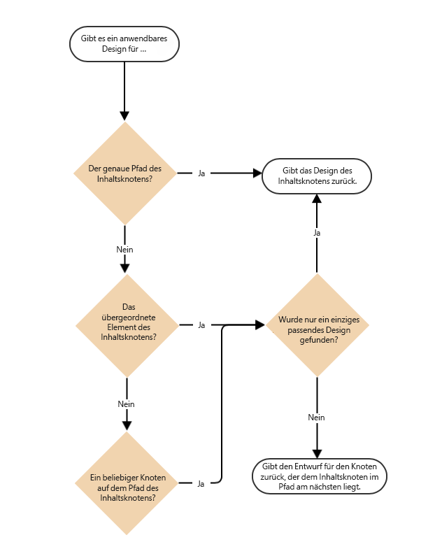

# Seitenvorlagen – statisch{#page-templates-static}

Eine Vorlage wird verwendet, um eine Seite zu erstellen, und definiert, welche Komponenten im ausgewählten Bereich verwendet werden können. Eine Vorlage ist eine Hierarchie von Knoten, die dieselbe Struktur wie die zu erstellende Seite aufweist, jedoch keinen tatsächlichen Inhalt hat.

Jede Vorlage stellt Ihnen eine Auswahl an Komponenten zur Verfügung, die Sie verwenden können.

* Vorlagen bestehen aus [Komponenten](/help/sites-developing/components.md);
* Komponenten verwenden Widgets und ermöglichen den Zugriff auf Widgets und diese werden zum Rendern des Inhalts verwendet.

>[!NOTE]
>
>[Bearbeitbare Vorlagen](/help/sites-developing/page-templates-editable.md) sind ebenfalls verfügbar und sind der empfohlene Typ von Vorlagen für die größte Flexibilität und die neuesten Funktionen.

## Eigenschaften und untergeordnete Knoten einer Vorlage {#properties-and-child-nodes-of-a-template}

Eine Vorlage ist ein Knoten des Typs cq:Template und hat die folgenden Eigenschaften und untergeordneten Knoten:

<table>
 <tbody>
  <tr>
   <td><strong>Name   </strong></td>
   <td><strong>Typ   </strong></td>
   <td><strong>Beschreibung   </strong></td>
  </tr>
  <tr>
   <td>.   </td>
   <td> cq:Template</td>
   <td>Aktuelle Vorlage. Eine Vorlage weist den Knotentyp cq:Template auf  </td>
  </tr>
  <tr>
   <td> allowedChildren </td>
   <td> Zeichenfolge[]</td>
   <td>Pfad einer Vorlage, die ein untergeordnetes Element dieser Vorlage sein kann.  </td>
  </tr>
  <tr>
   <td> allowedParents</td>
   <td> Zeichenfolge[]</td>
   <td>Pfad einer Vorlage, die ein übergeordnetes Element dieser Vorlage sein kann.  </td>
  </tr>
  <tr>
   <td> allowedPaths</td>
   <td> Zeichenfolge[]</td>
   <td>Pfad einer Seite, die auf dieser Vorlage basieren darf.  </td>
  </tr>
  <tr>
   <td> jcr:created</td>
   <td> Datum</td>
   <td>Datum der Erstellung der Vorlage.  </td>
  </tr>
  <tr>
   <td> jcr:description</td>
   <td> Zeichenfolge</td>
   <td>Beschreibung der Vorlage.  </td>
  </tr>
  <tr>
   <td> jcr:title</td>
   <td> Zeichenfolge</td>
   <td>Titel der Vorlage.  </td>
  </tr>
  <tr>
   <td> Rangfolge</td>
   <td> Long</td>
   <td>Rang der Vorlage. Wird verwendet, um die Vorlage in der Benutzeroberfläche anzuzeigen  </td>
  </tr>
  <tr>
   <td> jcr:content</td>
   <td> cq:PageContent</td>
   <td>Knoten, der den Inhalt der Vorlage enthält.  </td>
  </tr>
  <tr>
   <td> thumbnail.png</td>
   <td> nt:file</td>
   <td>Miniaturansicht der Vorlage.  </td>
  </tr>
  <tr>
   <td> icon.png</td>
   <td> nt:file</td>
   <td>Symbol der Vorlage.  </td>
  </tr>
 </tbody>
</table>

Eine Vorlage ist die Basis einer Seite.

Um eine Seite zu erstellen, müssen Sie die Vorlage (Knotenbaumstruktur `/apps/<myapp>/template/<mytemplate>`) an die entsprechende Stelle in der Website-Baumstruktur kopieren: Dies geschieht, wenn eine Seite über die Registerkarte **Websites** erstellt wird.

Durch diese Kopieraktion erhält die Seite auch ihren anfänglichen Inhalt (normalerweise nur Inhalte der obersten Ebene) und die Eigenschaft sling:resourceType, den Pfad zur Seitenkomponente, die zum Rendern der Seite verwendet wird (alles im untergeordneten Knoten jcr:content).

## Strukturierung von Vorlagen {#how-templates-are-structured}

Zwei Aspekte sind zu berücksichtigen:

* die Struktur der Vorlage selbst
* die Struktur des Inhalts, der bei Verwendung einer Vorlage erzeugt wird

### Die Struktur einer Vorlage {#the-structure-of-a-template}

Eine Vorlage wird unter einem Knoten des Typs **cq:Template**.

Verschiedene Eigenschaften können festgelegt werden, insbesondere:

* **jcr:title** - Titel für die Vorlage; wird beim Erstellen einer Seite im Dialogfeld angezeigt.
* **jcr:description** - Beschreibung für die Vorlage; wird beim Erstellen einer Seite im Dialogfeld angezeigt.

Dieser Knoten enthält einen Knoten jcr:content (cq:PageContent) , der als Grundlage für den Inhaltsknoten der resultierenden Seiten verwendet wird. Er verweist mithilfe von sling:resourceType auf die Komponente, die zum Rendern des tatsächlichen Inhalts einer neuen Seite verwendet werden soll.

Mit dieser Komponente wird die Struktur und das Design des Inhalts definiert, wenn eine neue Seite erstellt wird.

### Der von einer Vorlage erstellte Inhalt {#the-content-produced-by-a-template}

Mit Vorlagen werden Seiten des Typs `cq:Page` erstellt (wie bereits erwähnt, ist eine Seite eine besondere Art der Komponente). Jede AEM-Seite weist den strukturierten Knoten `jcr:content` auf. Dies:

* vom Typ cq:PageContent
* ist ein strukturierter Knotentyp, der eine definierte Inhaltsdefinition enthält
* weist die Eigenschaft `sling:resourceType` auf, die auf die Komponente verweist, welche die Sling-Skripte zum Rendern des Inhalts enthält

### Standardvorlagen {#default-templates}

AEM enthält standardmäßig verschiedene Standardvorlagen. Manchmal sollten Sie die Vorlagen unverändert verwenden. In diesem Fall müssen Sie sicherstellen, dass die Vorlage für Ihre Website verfügbar ist.

Beispielsweise enthält AEM mehrere Vorlagen, darunter eine Inhaltsseite und eine Homepage.

| **Titel** | **Komponente** | **Speicherort** | **Zweck** |
|---|---|---|---|
| Startseite | homepage | geometrixx | Die Geometrixx-Homepage-Vorlage. |
| Inhaltsseite | contentpage | geometrixx | Die Inhaltsseitenvorlage des Geometrixx. |

#### Anzeigen von Standardvorlagen {#displaying-default-templates}

Um eine Liste aller Vorlagen im Repository anzuzeigen, gehen Sie wie folgt vor:

1. Öffnen Sie unter CRXDE Lite die **Instrumente** Menü und klicken Sie **Abfrage**.

1. Im Tab Abfrage
1. As **Typ** auswählen **XPath**.

1. Geben Sie in das Eingabefeld **Abfrage** diese Zeichenfolge ein: //element(&#42;, cq:Template)

1. Klicken Sie auf **Ausführen**. Die Liste wird im Ergebnisfeld angezeigt.

Normalerweise nehmen Sie eine vorhandene Vorlage und entwickeln eine neue für Ihre eigene Verwendung. Siehe [Entwickeln von Seitenvorlagen](#developing-page-templates) für weitere Informationen.

Damit eine vorhandene Vorlage für Ihre Website aktiviert und im Dialogfeld **Seite erstellen** angezeigt wird, wenn Sie eine Seite direkt unter **Websites** in der **Websites**-Konsole erstellen, legen Sie für die Eigenschaft „allowedPaths“ des Vorlagenknotens folgenden Wert fest: **/content(/.&#42;)?**

## Anwenden von Vorlagendesigns {#how-template-designs-are-applied}

Wenn Stile in der Benutzeroberfläche im [Designmodus](/help/sites-authoring/default-components-designmode.md) definiert werden, wird das Design am genauen Pfad des Inhaltsknotens, für den der Stil definiert wird, beibehalten.

>[!CAUTION]
>
>Adobe empfiehlt nur die Anwendung von Designs durch den [Designmodus](/help/sites-authoring/default-components-designmode.md).
>
>Das Ändern von Designs beispielsweise im CRXDE Lite ist keine Best Practice und die Anwendung solcher Designs kann vom erwarteten Verhalten abweichen.

Wenn Entwürfe nur im Designmodus angewendet werden, sind die folgenden Abschnitte, [Auflösung des Designpfads](/help/sites-developing/page-templates-static.md#design-path-resolution), [Entscheidungsbaum](/help/sites-developing/page-templates-static.md#decision-tree) und das [Beispiel](/help/sites-developing/page-templates-static.md#example), nicht anwendbar.

### Auflösung des Designpfads {#design-path-resolution}

Beim Rendern von Inhalten, die auf einer statischen Vorlage basieren, versucht AEM, das relevanteste Design und die relevantesten Stile auf den Inhalt anzuwenden, basierend auf einer Umkehrung der Inhaltshierarchie.

AEM bestimmt den relevantesten Stil für einen Inhaltsknoten in der folgenden Reihenfolge:

* Wenn ein Design für den vollständigen und genauen Pfad des Inhaltsknotens vorhanden ist (wie bei der Definition des Designs im Designmodus), verwende dieses Design.
* Wenn ein Design für den Inhaltsknoten des übergeordneten Elements vorhanden ist, verwenden dieses Design.
* Wenn sich ein Design für einen Knoten im Pfad des Inhaltsknotens befindet, verwende dieses Design.

Wenn es in den letzten beiden Fällen mehr als ein geeignetes Design gibt, verwende das Design, das dem Inhaltsknoten am nächsten ist.

### Entscheidungsbaum {#decision-tree}

Dies ist eine grafische Darstellung der Logik der [Auflösung des Designpfads](/help/sites-developing/page-templates-static.md#design-path-resolution).

### Beispiel {#example}

Denken Sie an eine einfache Inhaltsstruktur wie die folgende, bei der ein Design auf jeden der Knoten angewendet werden könnte:

`/root/branch/leaf`

In der folgenden Tabelle wird beschrieben, wie AEM einen Entwurf auswählt.

<table>
 <tbody>
  <tr>
   <td><strong>Suchen nach einem Design für  </strong></td>
   <td><strong>Designs vorhanden für  </strong></td>
   <td><strong>Ausgewähltes Design  </strong></td>
   <td><strong>Kommentar</strong></td>
  </tr>
  <tr>
   <td><code class="code">leaf
      </code></td>
   <td>
<code>root</code>
 
<code>branch</code>
 
<code>leaf</code>
 </td>
   <td><code>leaf</code></td>
   <td>Es wird immer die genaueste Übereinstimmung gewählt.  </td>
  </tr>
  <tr>
   <td><code>leaf</code></td>
   <td>
<code>root</code>
 
<code>branch</code>
 </td>
   <td><code>branch</code></td>
   <td>Fallen Sie zurück auf die nächstgelegene Übereinstimmung weiter unten in der Baumstruktur.</td>
  </tr>
  <tr>
   <td><code>leaf</code></td>
   <td><code>root</code></td>
   <td><code>root</code></td>
   <td>Wenn alles andere fehlschlägt, nehmen Sie, was übrig ist.  </td>
  </tr>
  <tr>
   <td><code>branch</code></td>
   <td><code>branch</code></td>
   <td><code>branch</code></td>
   <td> </td>
  </tr>
  <tr>
   <td><code>branch</code></td>
   <td>
<code>branch</code>
 
<code class="code">leaf
       </code>
 </td>
   <td><code>branch</code></td>
   <td> </td>
  </tr>
  <tr>
   <td><code>branch</code></td>
   <td>
<code>root</code>
 
<code class="code">branch
       </code>
 </td>
   <td><code>branch</code></td>
   <td> </td>
  </tr>
  <tr>
   <td><code>branch</code></td>
   <td>
<code>root</code>
 
<code class="code">leaf
       </code>
 </td>
   <td><code>root</code></td>
   <td>
Wenn es keine exakte Übereinstimmung gibt, nehmen Sie das Design ganz unten in der Baumstruktur.
 
Es wird davon ausgegangen, dass dieses immer anwendbar ist, aber weiter oben im Baum zu spezifisch sein kann.  
 </td>
  </tr>
 </tbody>
</table>

## Entwickeln von Seitenvorlagen {#developing-page-templates}

AEM Seitenvorlagen sind einfach Modelle, die zum Erstellen von Seiten verwendet werden. Sie können so wenig oder so viel anfänglichen Inhalt wie nötig enthalten. Ihre Rolle besteht darin, die richtigen anfänglichen Knotenstrukturen zu erstellen, wobei die erforderlichen Eigenschaften (hauptsächlich sling:resourceType) so eingestellt sind, dass sie die Bearbeitung und Wiedergabe ermöglichen.

### Erstellen einer Vorlage (basierend auf einer vorhandenen Vorlage) {#creating-a-new-template-based-on-an-existing-template}

Eine neue Vorlage kann komplett neu erstellt werden, aber oft wird stattdessen eine vorhandene Vorlage kopiert und aktualisiert, um Ihnen Zeit und Mühe zu sparen. Beispielsweise können die Vorlagen in Geometrixx für die ersten Schritte verwendet werden.

So erstellen Sie eine Vorlage basierend auf einer vorhandenen Vorlage:

1. Kopieren Sie eine vorhandene Vorlage (vorzugsweise mit einer Definition, die dem, was Sie erreichen möchten, möglichst ähnlich ist) in einen neuen Knoten.

   Vorlagen werden in **/apps/&lt;website-name>/templates/&lt;template-name>**.

   >[!NOTE]
   >
   >Die Liste der verfügbaren Vorlagen hängt vom Speicherort der neuen Seite und den in den einzelnen Vorlagen angegebenen Platzierungsbeschränkungen ab. Siehe [Formularverfügbarkeit](#templateavailibility).

1. Ändern Sie die **jcr:title** des neuen Vorlagenknotens, um dessen neue Rolle widerzuspiegeln. Sie können auch die **jcr:description** gegebenenfalls. Stellen Sie sicher, dass Sie die Vorlagenverfügbarkeit der Seite entsprechend ändern.

   >[!NOTE]
   >
   >Damit Ihre Vorlage im Dialogfeld **Seite erstellen** angezeigt wird, wenn Sie eine Seite direkt unter **Websites** in der **Websites-Konsole** erstellen, legen Sie für die Eigenschaft `allowedPaths` folgenden Wert fest: `/content(/.*)?`

   

1. Kopieren Sie die Komponente, auf der die Vorlage basiert (dies wird durch die Variable **sling:resourceType** -Eigenschaft der **jcr:content** -Knoten in der Vorlage), um eine Instanz zu erstellen.

   Komponenten werden unter **/apps/&lt;website-name>/components/&lt;component-name>**.

1. Aktualisieren Sie die **jcr:title** und **jcr:description** der neuen Komponente.
1. Ersetzen Sie thumbnail.png , wenn ein neues Miniaturbild in der Vorlagenauswahlliste angezeigt werden soll (Größe 128 x 98 Pixel).
1. Aktualisieren Sie die **sling:resourceType** der Vorlage **jcr:content** -Knoten, um auf die neue Komponente zu verweisen.
1. Nehmen Sie zusätzliche Änderungen an der Funktionalität oder dem Design der Vorlage, der zugrunde liegenden Komponente oder beidem vor.

   >[!NOTE]
   >
   >Änderungen an den **/apps/&lt;website>/templates/&lt;template-name>** -Knoten wirken sich auf die Vorlageninstanz aus (wie in der Auswahlliste).
   >
   >
   Änderungen an den **/apps/&lt;website>/components/&lt;component-name>** -Knoten wirken sich auf die Inhaltsseite aus, die bei Verwendung der Vorlage erstellt wird.

   Jetzt können Sie mit der neuen Vorlage eine Seite auf Ihrer Website erstellen.

>[!NOTE]
>
Die Client-Bibliothek des Editors setzt voraus, dass die `cq.shared` -Namespace in Inhaltsseiten verwenden, und wenn dies nicht vorhanden ist, wird der JavaScript-Fehler `Uncaught TypeError: Cannot read property 'shared' of undefined` Ergebnisse.
>
Alle Beispielinhaltsseiten enthalten `cq.shared`, sodass jeglicher darauf basierender Inhalt automatisch `cq.shared` umfasst. Wenn Sie sich jedoch ganz neue eigene Inhaltsseiten erstellen möchten, die nicht auf Beispielinhalt basieren, müssen Sie sicherstellen, dass Sie den Namespace `cq.shared` einbinden.
>
Weitere Informationen finden Sie unter [Verwendung Client-seitiger Bibliotheken](/help/sites-developing/clientlibs.md).

## Verfügbarmachen einer vorhandenen Vorlage {#making-an-existing-template-available}

Dieses Beispiel zeigt, wie eine Vorlage für bestimmte Inhaltspfade verwendet werden kann. Die Vorlagen, die dem Seitenautor beim Erstellen von Seiten zur Verfügung stehen, werden durch die Logik bestimmt, die in [Formularverfügbarkeit](/help/sites-developing/templates.md#template-availability).

1. Navigieren Sie in CRXDE Lite zu der Vorlage, die Sie für Ihre Seite verwenden möchten, z. B. zur Newsletter-Vorlage.
1. Ändern Sie die `allowedPaths` -Eigenschaft und andere Eigenschaften, die für [Vorlagenverfügbarkeit](/help/sites-developing/templates.md#template-availability). Beispielsweise `allowedPaths`: `/content/geometrixx-outdoors/[^/]+(/.*)?` bedeutet, dass diese Vorlage in jedem Pfad unter `/content/geometrixx-outdoors` zulässig ist.

   
