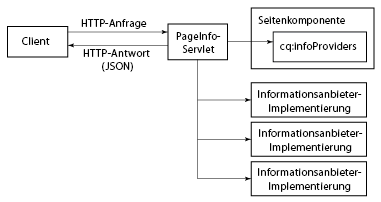
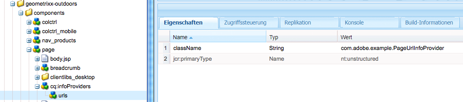

# Ermitteln von Seiteninformationen im JSON-Format{#obtaining-page-information-in-json-format}

Senden Sie zum Abrufen von Seiteninformationen eine Anforderung an das PageInfo-Servlet, um die Seitenmetadaten im JSON-Format zu erhalten.

Das PageInfo-Servlet gibt Informationen zu Ressourcen im Repository zurück. Das Servlet ist an die URL `https://<server>:<port>/libs/wcm/core/content/pageinfo.json` gebunden und verwendet den Parameter `path`, um die Ressource zu identifizieren. Die folgende Beispiel-URL gibt Informationen zum Knoten `/content/we-retail/us/en` zurück:

```shell
http://localhost:4502/libs/wcm/core/content/pageinfo.json?path=/content/we-retail/us/en
```

>[!NOTE]
>
>Wenn Sie Seiteninformationen im JSON-Format benötigen, um Inhalte für Kanäle bereitzustellen, bei denen es sich nicht um herkömmliche AEM-Webseiten handelt, beispielsweise:
>
>* Single Page Applications
>* native Mobile Apps
>* Andere Kanäle und Touchpoints außerhalb von AEM

>
>
dann finden Sie weitere Informationen im Dokument [JSON-Exporter für Content Services](/help/sites-developing/json-exporter.md).

## PageInfoProvider-Dienste {#page-information-providers}

Seitenkomponenten können einem oder mehreren `com.day.cq.wcm.api.PageInfoProvider`-Diensten zugeordnet werden, die Seitenmetadaten generieren. Das PageInfo-Servlet ruft jeden PageInfoProvider-Dienst auf und aggregiert die Metadaten:

1. Der HTTP-Client sendet eine Anforderung an das PageInfo-Servlet, das die URL der Seite enthält.
1. Das PageInfo-Servlet erkennt, welche Komponente die Seite rendert.
1. Das PageInfo-Servlet ruft jeden PageInfoProvider-Dienst auf, der der Komponente zugeordnet ist.
1. Das Servlet aggregiert die Metadaten, die jeder PageInfoProvider-Dienst zurückgibt, und fügt die Metadaten der HTTP-Antwort in einem JSON-Objekt hinzu.



>[!NOTE]
>
>Ähnlich wie PageInfoProvider-Dienste verwenden Sie ListInfoProvider-Dienste, um Listen von Informationen im JSON-Format zu aktualisieren. (Siehe [Anpassen der Website-Administrationskonsole](/help/sites-developing/customizing-siteadmin.md).)

## Standardmäßige PageInfoProvider-Dienste  {#default-page-information-providers}

Die Komponente `/libs/foundation/components/page` ist mit den folgenden PageInfoProvider-Diensten verknüpft:

* **DefaultPageStatusProvider-Dienst**: Informationen zum Seitenstatus, beispielsweise ob die Seite gesperrt ist, die Nutzlast eines aktiven Workflows ist oder welche Workflows für die Seite zur Verfügung stehen.
* **LiveRelationshipInfoProvider-Dienst**: Informationen zum Multi-Site Management (MSM), beispielsweise ob die Seite Teil eines Blueprints ist und ob es sich um eine Live Copy handelt.
* **ContentLanguageServlet-Dienst**: Die Sprache der aktuellen Seite und Informationen zu jeder Sprache, in der die Seite verfügbar ist.
* **WorkflowStatusProvider-Dienst**: Statusinformationen zum ausgeführten Workflow, der die Seite als Nutzlast aufweist.
* **WorkflowPackageInfoProvider-Dienst**: Informationen zu jedem Workflow-Paket, das im Repository gespeichert ist, und dazu, ob die einzelnen Pakete die aktuelle Ressource enthalten.
* **EmulatorInfoProvider-Dienst**: Informationen zu den für diese Ressource verfügbaren Emulatoren für mobile Geräte. Wenn die Seitenkomponente keine mobilen Seiten rendert, sind keine Emulatoren verfügbar.
* **AnnotationsInfoProvider-Dienst**: Informationen über Anmerkungen, die sich auf der Seite befinden.

Beispielsweise gibt das PageInfo-Servlet die folgende JSON-Antwort für den Knoten `/content/we-retail/us/en` zurück:

```
{
   "status":{
      "path":"/content/we-retail/us/en",
      "isLocked":false,
      "lockOwner":"",
      "canUnlock":false,
      "lastModified":1467202845038,
      "lastModifiedBy":"admin",
      "timeUntilValid":0,
      "onTime":0,
      "offTime":0,
      "replication":{
         "numQueued":0
      },
      "isDesignable":true,
      "isDeveloper":true
   },
   "isPage":true,
   "pageResourceType":"weretail/components/structure/page",
   "enableFragmentIdentifier":false,
   "workflow":{
      "isRunning":false
   },
   "workflows":{
      "wcm":{
         "models":[
            {
               "wid":"/etc/workflow/models/dam/adddamsize/jcr:content/model",
               "label":"Add Asset Size",
               "label_xss":"Add Asset Size"
            },
            {
               "wid":"/etc/workflow/models/ac-newsletter-workflow-simple/jcr:content/model",
               "label":"Approve for Adobe Campaign",
               "label_xss":"Approve for Adobe Campaign"
            },
            {
               "wid":"/etc/workflow/models/dam/dam-autotag-assets/jcr:content/model",
               "label":"DAM Smart Tag Assets",
               "label_xss":"DAM Smart Tag Assets"
            },
            {
               "wid":"/etc/workflow/models/dam/update_asset/jcr:content/model",
               "label":"DAM Update Asset",
               "label_xss":"DAM Update Asset"
            },
            {
               "wid":"/etc/workflow/models/cloudservices/DTM_bundle_download/jcr:content/model",
               "label":"Default DTM Bundle Download",
               "label_xss":"Default DTM Bundle Download"
            },
            {
               "wid":"/etc/workflow/models/dam/dam_download_asset/jcr:content/model",
               "label":"Download Asset",
               "label_xss":"Download Asset"
            },
            {
               "wid":"/etc/workflow/models/dam/dynamic-media-video-thumbnail-replacement/jcr:content/model",
               "label":"Dynamic Media Video Thumbnail Replacement",
               "label_xss":"Dynamic Media Video Thumbnail Replacement"
            },
            {
               "wid":"/etc/workflow/models/dam/dynamic-media-video-user-uploaded-thumbnail/jcr:content/model",
               "label":"Dynamic Media Video User Uploaded Thumbnail Process",
               "label_xss":"Dynamic Media Video User Uploaded Thumbnail Process"
            },
            {
               "wid":"/etc/workflow/models/projects/approval_workflow/jcr:content/model",
               "label":"Project Approval Workflow",
               "label_xss":"Project Approval Workflow"
            },
            {
               "wid":"/etc/workflow/models/publish_example/jcr:content/model",
               "label":"Publish Example",
               "label_xss":"Publish Example"
            },
            {
               "wid":"/etc/workflow/models/publish_to_campaign/jcr:content/model",
               "label":"Publish to Adobe Campaign",
               "label_xss":"Publish to Adobe Campaign"
            },
            {
               "wid":"/etc/workflow/models/s7dam/request_to_publish_to_youtube/jcr:content/model",
               "label":"Publish to YouTube",
               "label_xss":"Publish to YouTube"
            },
            {
               "wid":"/etc/workflow/models/projects/request_copy/jcr:content/model",
               "label":"Request Copy",
               "label_xss":"Request Copy"
            },
            {
               "wid":"/etc/workflow/models/request_for_activation/jcr:content/model",
               "label":"Request for Activation",
               "label_xss":"Request for Activation"
            },
            {
               "wid":"/etc/workflow/models/request_for_deactivation/jcr:content/model",
               "label":"Request for Deactivation",
               "label_xss":"Request for Deactivation"
            },
            {
               "wid":"/etc/workflow/models/request_for_deletion/jcr:content/model",
               "label":"Request for Deletion",
               "label_xss":"Request for Deletion"
            },
            {
               "wid":"/etc/workflow/models/request_to_complete_move_operation/jcr:content/model",
               "label":"Request to complete Move operation",
               "label_xss":"Request to complete Move operation"
            },
            {
               "wid":"/etc/workflow/models/screens-update-asset/jcr:content/model",
               "label":"Screens Update Asset",
               "label_xss":"Screens Update Asset"
            },
            {
               "wid":"/etc/workflow/models/s7dam/request_to_remove_from_youtube/jcr:content/model",
               "label":"Unpublish from YouTube",
               "label_xss":"Unpublish from YouTube"
            },
            {
               "wid":"/etc/workflow/models/wcm-translation/create_language_copy/jcr:content/model",
               "label":"WCM: Create Language Copy",
               "label_xss":"WCM: Create Language Copy"
            },
            {
               "wid":"/etc/workflow/models/wcm-translation/prepare_translation_project/jcr:content/model",
               "label":"WCM: Prepare Translation Project",
               "label_xss":"WCM: Prepare Translation Project"
            },
            {
               "wid":"/etc/workflow/models/wcm-translation/translate-i18n-dictionary/jcr:content/model",
               "label":"WCM: Prepare and Translate I18n-Dictionary",
               "label_xss":"WCM: Prepare and Translate I18n-Dictionary"
            },
            {
               "wid":"/etc/workflow/models/wcm-translation/sync_translation_job/jcr:content/model",
               "label":"WCM: Sync Translation Job",
               "label_xss":"WCM: Sync Translation Job"
            },
            {
               "wid":"/etc/workflow/models/wcm-translation/update_language_copy/jcr:content/model",
               "label":"WCM: Update Language Copy",
               "label_xss":"WCM: Update Language Copy"
            }
         ]
      },
      "translation":{
         "models":[
            {
               "wid":"/etc/workflow/models/dam/adddamsize/jcr:content/model",
               "label":"Add Asset Size",
               "label_xss":"Add Asset Size"
            },
            {
               "wid":"/etc/workflow/models/ac-newsletter-workflow-simple/jcr:content/model",
               "label":"Approve for Adobe Campaign",
               "label_xss":"Approve for Adobe Campaign"
            },
            {
               "wid":"/etc/workflow/models/dam/dam-autotag-assets/jcr:content/model",
               "label":"DAM Smart Tag Assets",
               "label_xss":"DAM Smart Tag Assets"
            },
            {
               "wid":"/etc/workflow/models/cloudservices/DTM_bundle_download/jcr:content/model",
               "label":"Default DTM Bundle Download",
               "label_xss":"Default DTM Bundle Download"
            },
            {
               "wid":"/etc/workflow/models/dam/dam_download_asset/jcr:content/model",
               "label":"Download Asset",
               "label_xss":"Download Asset"
            },
            {
               "wid":"/etc/workflow/models/dam/dynamic-media-video-thumbnail-replacement/jcr:content/model",
               "label":"Dynamic Media Video Thumbnail Replacement",
               "label_xss":"Dynamic Media Video Thumbnail Replacement"
            },
            {
               "wid":"/etc/workflow/models/dam/dynamic-media-video-user-uploaded-thumbnail/jcr:content/model",
               "label":"Dynamic Media Video User Uploaded Thumbnail Process",
               "label_xss":"Dynamic Media Video User Uploaded Thumbnail Process"
            },
            {
               "wid":"/etc/workflow/models/projects/approval_workflow/jcr:content/model",
               "label":"Project Approval Workflow",
               "label_xss":"Project Approval Workflow"
            },
            {
               "wid":"/etc/workflow/models/publish_to_campaign/jcr:content/model",
               "label":"Publish to Adobe Campaign",
               "label_xss":"Publish to Adobe Campaign"
            },
            {
               "wid":"/etc/workflow/models/s7dam/request_to_publish_to_youtube/jcr:content/model",
               "label":"Publish to YouTube",
               "label_xss":"Publish to YouTube"
            },
            {
               "wid":"/etc/workflow/models/projects/request_copy/jcr:content/model",
               "label":"Request Copy",
               "label_xss":"Request Copy"
            },
            {
               "wid":"/etc/workflow/models/request_for_deletion/jcr:content/model",
               "label":"Request for Deletion",
               "label_xss":"Request for Deletion"
            },
            {
               "wid":"/etc/workflow/models/request_to_complete_move_operation/jcr:content/model",
               "label":"Request to complete Move operation",
               "label_xss":"Request to complete Move operation"
            },
            {
               "wid":"/etc/workflow/models/screens-update-asset/jcr:content/model",
               "label":"Screens Update Asset",
               "label_xss":"Screens Update Asset"
            },
            {
               "wid":"/etc/workflow/models/translation/jcr:content/model",
               "label":"Translation Prepare",
               "label_xss":"Translation Prepare"
            },
            {
               "wid":"/etc/workflow/models/s7dam/request_to_remove_from_youtube/jcr:content/model",
               "label":"Unpublish from YouTube",
               "label_xss":"Unpublish from YouTube"
            }
         ]
      }
   },
   "translation":{

   },
   "design":{
      "path":"/conf/we-retail/settings/wcm/templates/hero-page/policies",
      "lastModified":0
   },
   "componentsRef":"/libs/wcm/core/content/components.1497341312569.json",
   "editableTemplate":"/conf/we-retail/settings/wcm/templates/hero-page",
   "msm":{
      "msm:isLiveCopy":true,
      "msm:isInBlueprint":false,
      "msm:isSource":false
   },
   "launches":{
      "isLaunch":false,
      "isInLaunch":false
   },
   "language":"en",
   "languages":{
      "rows":[
         {
            "path":"/content/we-retail/us/en",
            "exists":true,
            "hasContent":true,
            "lastModified":0,
            "iso":"en",
            "country":"gb",
            "language":"English"
         },
         {
            "path":"/content/we-retail/us/es",
            "exists":true,
            "hasContent":true,
            "lastModified":0,
            "iso":"es",
            "country":"es",
            "language":"Spanish"
         }
      ]
   },
   "workflowInfo":{
      "isRunning":false
   },
   "workflowPackageInfo":{
      "workflowPackages":[

      ],
      "selectedWorkflowPackages":[

      ],
      "runningSelectedWorkflowPackages":[

      ]
   },
   "emulators":{
      "groups":{
         "responsive":{
            "title":"Responsive Devices",
            "description":"The devices in this group are able to display a website built using responsive design patterns.",
            "path":"/etc/mobile/groups/responsive",
            "galaxy5":{
               "text":"Galaxy S5",
               "action":"start",
               "path":"/libs/wcm/mobile/components/emulators/galaxy5",
               "canRotate":true,
               "hasTouchScrolling":true,
               "contentCssPath":"/etc/mobile/groups/responsive/static.css",
               "width":1080,
               "height":1920,
               "device-pixel-ratio":3
            },
            "ipad":{
               "text":"iPad",
               "action":"start",
               "path":"/libs/wcm/mobile/components/emulators/ios/ipad",
               "canRotate":true,
               "hasTouchScrolling":true,
               "contentCssPath":"/etc/mobile/groups/responsive/static.css",
               "width":768,
               "height":1024,
               "device-pixel-ratio":1
            },
            "iphone5":{
               "text":"iPhone 5",
               "action":"start",
               "path":"/libs/wcm/mobile/components/emulators/ios/iphone5",
               "canRotate":true,
               "hasTouchScrolling":true,
               "contentCssPath":"/etc/mobile/groups/responsive/static.css",
               "width":640,
               "height":1136,
               "device-pixel-ratio":2
            },
            "iphone6":{
               "text":"iPhone 6",
               "action":"start",
               "path":"/libs/wcm/mobile/components/emulators/ios/iphone6",
               "canRotate":true,
               "hasTouchScrolling":true,
               "contentCssPath":"/etc/mobile/groups/responsive/static.css",
               "width":750,
               "height":1334,
               "device-pixel-ratio":2
            },
            "iphone4":{
               "text":"iPhone 4",
               "action":"start",
               "path":"/libs/wcm/mobile/components/emulators/ios/iphone4",
               "canRotate":true,
               "hasTouchScrolling":true,
               "contentCssPath":"/etc/mobile/groups/responsive/static.css",
               "width":640,
               "height":960,
               "device-pixel-ratio":2
            },
            "iphone6plus":{
               "text":"iPhone 6 Plus",
               "action":"start",
               "path":"/libs/wcm/mobile/components/emulators/ios/iphone6plus",
               "canRotate":true,
               "hasTouchScrolling":true,
               "contentCssPath":"/etc/mobile/groups/responsive/static.css",
               "width":1080,
               "height":1920,
               "device-pixel-ratio":2.6
            },
            "nexuss":{
               "text":"Nexus S",
               "action":"start",
               "path":"/libs/wcm/mobile/components/emulators/nexuss",
               "canRotate":true,
               "hasTouchScrolling":true,
               "contentCssPath":"/etc/mobile/groups/responsive/static.css",
               "width":320,
               "height":533,
               "device-pixel-ratio":1
            }
         }
      }
   },
   "annotations":[

   ],
   "permissions":{
      "modify":true,
      "replicate":true,
      "read":true,
      "create":true,
      "delete":true,
      "acl_read":true,
      "acl_edit":true
   },
   "isTargetable":"true",
   "responsive":{
      "breakpoints":{
         "phone":{
            "width":650,
            "title":"Smaller Screen"
         },
         "tablet":{
            "width":1200,
            "title":"Tablet"
         }
      }
   }
}
```

## Filtern von Informationen zu Workflow-Paketen {#filtering-workflow-package-information}

Konfigurieren Sie den Dienst Day CQ WCM Workflow Package Info Provider so, dass er nur Informationen zu den Workflow-Paketen zurückgibt, an denen Sie interessiert sind. Standardmäßig gibt der Workflow Package Info Provider-Dienst Informationen zu jedem Workflow-Paket im Repository zurück. Die Serverressourcen werden weniger beansprucht, wenn nur ein Teil der Workflow-Pakete durchlaufen wird.

>[!NOTE]
>
>Die Registerkarte „Workflow“ des Sidekicks verwendet das PageInfo-Servlet, um eine Liste von Workflow-Paketen abzurufen. Aus der Liste können Sie das Paket auswählen, zu dem die aktuelle Seite hinzugefügt werden soll. Die Filter, die Sie erstellen, wirken sich auf diese Liste aus.


Die ID des Diensts lautet `com.day.cq.wcm.workflow.impl.WorkflowPackageInfoProvider`. Um einen Filter zu erstellen, geben Sie einen Wert für eine `workflowpackageinfoprovider.filter`-Eigenschaft an.

Eigenschaftswerten wird ein Plus- oder Minuszeichen vorangestellt, gefolgt vom Paketpfad:

* Der Pfad ist der Pfad des Stammknotens des Workflow-Pakets. Der Pfad verwendet die FileVault-Syntax.
* Versehen Sie den Eigenschaftswert mit einem vorangestellten Pluszeichen, um ein Paket einzuschließen.
* Versehen Sie den Eigenschaftswert mit einem vorangestellten Minuszeichen, um ein Paket auszuschließen.

Der Dienst wendet das kumulierte Ergebnis aller Filter an. Beispielsweise werden mit den folgenden Filterwerten alle Workflow-Pakete mit Ausnahme derjenigen im Ordner „Editions“ ausgeschlossen:

```
-/etc/workflow/packages(/.*)?
+/etc/workflow/packages/Editions(/.&ast;)?
```

>[!NOTE]
>
>Beim Arbeiten mit AEM gibt es mehrere Möglichkeiten, die Konfigurationseinstellungen für solche Dienste zu verwalten. Weitere Informationen hierzu finden Sie unter [Konfigurieren von OSGi](/help/sites-deploying/configuring-osgi.md).

Gehen Sie beispielsweise zum Konfigurieren des Diensts mithilfe von CRXDE Lite wie folgt vor:

1. Öffnen Sie CRXDE Lite ([http://localhost:4502/crx/de](http://localhost:4502/crx/de)).
1. Erstellen Sie im Ordner „config“ Ihrer Anwendung einen Knoten:

   * Name: `com.day.cq.wcm.workflow.impl.WorkflowPackageInfoProvider`
   * Typ: `sling:OsgiConfig`

1. Wählen Sie den Knoten aus und fügen Sie eine Eigenschaft hinzu:

   * Name: `workflowpackageinfoprovider.filter`
   * Typ: `String[]`
   * Wert: Der Pfad zum Workflow-Paket mit dem richtigen Format.

1. Klicken Sie auf Alle speichern.

Gehen Sie wie folgt vor, um den Dienst in Ihrer Projektquelle zu konfigurieren:

1. Suchen oder erstellen Sie den Konfigurationsordner für Ihre AEM-Anwendung in Ihrer Projektquelle.

   Wenn Sie beispielsweise den Archetyp multimodule des Inhaltspaket-Maven-Plug-ins zum Erstellen Ihres Projekts verwendet haben, lautet der Ordnerpfad `<projectroot>/content/src/ for example content/src/main/content/jcr_root/apps/<appname>/config`.
1. Erstellen Sie im Ordner „config“ eine Textdatei mit dem Namen com.day.cq.wcm.workflow.impl.WorkflowPackageInfoProvider.xml.
1. Kopieren Sie den folgenden Text in die Datei:

   ```
   <?xml version="1.0" encoding="UTF-8"?>
    <jcr:root xmlns:sling="https://sling.apache.org/jcr/sling/1.0"
    xmlns:jcr="https://www.jcp.org/jcr/1.0"
    jcr:primaryType="sling:OsgiConfig"
    workflowpackageinfoprovider.filter="[]"/>
   ```

1. Geben Sie in den Klammern (`[]`), die die `workflowpackageinfoprovider.filter`-Eigenschaft umgeben, eine kommagetrennte Liste mit Filterwerten ein, die dem folgenden Beispiel ähnelt:

   `workflowpackageinfoprovider.filter="[-/etc/workflow/packages(/.*)?,+/etc/workflow/packages/Editions(/.*)?]"/>`

1. Speichern Sie die Datei.

## Erstellen von PageInfoProvider-Diensten  {#creating-a-page-information-provider}

Erstellen Sie einen benutzerdefinierten PageInfoProvider-Dienst, um Seitenmetadaten hinzuzufügen, die Ihre Anwendung leicht abrufen kann.

1. Implementieren Sie die Schnittstelle `com.day.cq.wcm.api.PageInfoProvider`.
1. Bündeln Sie die Klasse und stellen Sie sie als OSGi-Dienst bereit.
1. Erstellen Sie eine Seitenkomponente in Ihrer Anwendung. Verwenden Sie `foundation/components/page` als Wert der Eigenschaft `sling:resourceSuperType` .

1. Fügen Sie einen Knoten unter dem Komponentenknoten `cq:infoProviders` hinzu.
1. Fügen Sie unter dem Knoten `cq:infoProviders` einen Knoten für Ihren PageInfoProvider-Dienst hinzu. Sie können einen beliebigen Namen für den Knoten angeben.
1. Fügen Sie die folgende Eigenschaft zu Ihrem PageInfoProvider-Knoten hinzu:

   * Name: className
   * Typ: String
   * Wert: Die PID Ihres PageInfoProvider-Diensts

Für Ressourcen, die Ihre Anwendungsseitenkomponente als `sling:resourceType` verwenden, gibt das PageInfo-Servlet die benutzerdefinierten PageInfoProvider-Metadaten zusätzlich zu den standardmäßigen PageInfoProvider-Metadaten zurück.

### PageInfoProvider-Beispielimplementierung {#example-pageinfoprovider-implementation}

Die folgende Java-Klasse implementiert [PageInfoProvider](https://helpx.adobe.com/experience-manager/6-5/sites/developing/using/reference-materials/javadoc/index.html) und gibt die veröffentlichte URL der aktuellen Seitenressource zurück.

```java
package com.adobe.example;

import org.apache.felix.scr.annotations.Component;
import org.apache.felix.scr.annotations.Properties;
import org.apache.felix.scr.annotations.Property;
import org.apache.felix.scr.annotations.ReferenceCardinality;
import org.apache.felix.scr.annotations.Service;
import org.apache.felix.scr.annotations.Reference;

import org.apache.sling.api.SlingHttpServletRequest;
import org.apache.sling.api.resource.Resource;
import org.apache.sling.api.resource.ResourceResolver;

import org.apache.sling.commons.json.JSONException;
import org.apache.sling.commons.json.JSONObject;

import com.day.cq.wcm.api.Page;
import com.day.cq.wcm.api.PageInfoProvider;

@Component(metatype = false)
@Properties({
 @Property(name="service.description", value="Returns the public URL of a resource.")
})
@Service
public class PageUrlInfoProvider implements PageInfoProvider {

 @Reference(cardinality = ReferenceCardinality.OPTIONAL_UNARY)
 private com.day.cq.commons.Externalizer externalizer;

 private String fetchExternalUrl(ResourceResolver rr, String path) {
  return externalizer.publishLink(rr, path);
 }

 public void updatePageInfo(SlingHttpServletRequest request, JSONObject info, Resource resource)
   throws JSONException {

  Page page = resource.adaptTo(Page.class);
  JSONObject urlinfo = new JSONObject();
  urlinfo.put("publishURL", fetchExternalUrl(null,page.getPath()));
  info.put("URLs",urlinfo);
 }
}
```

Das folgende Beispiel in CRXDE Lite zeigt die Seitenkomponente, die für die Verwendung des PageUrlInfoProvider-Diensts konfiguriert ist:



Der PageUrlInfoProvider-Dienst gibt die folgenden Daten für den Knoten `/content/we-retail/us/en` zurück:

```xml
"URLs": {
    "publishURL": "http://localhost:4503/content/we-retail/us/en"
}
```
