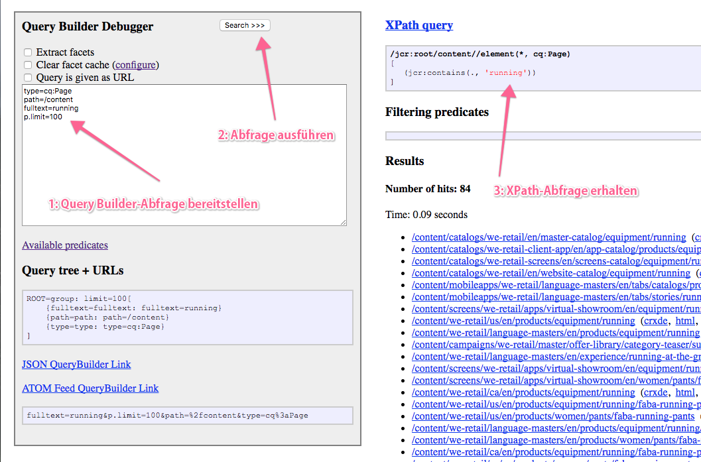

# Query Builder-API{#query-builder-api}

Die Funktionalität der [Asset Share Query Builder](/help/assets/assets-finder-editor.md) wird über eine Java™-API und eine REST-API verfügbar gemacht. In diesem Abschnitt werden diese APIs beschrieben.

Der serverseitige Abfragegenerator ( [`QueryBuilder`](https://helpx.adobe.com/experience-manager/6-5/sites/developing/using/reference-materials/javadoc/com/day/cq/search/QueryBuilder.html)) akzeptiert eine Abfragebeschreibung, erstellt und führt eine XPath-Abfrage aus, filtert optional den Ergebnissatz und extrahiert bei Bedarf auch Facetten.

Die Abfragebeschreibung ist einfach eine Gruppe mit Eigenschaften ([`Predicate`](https://helpx.adobe.com/experience-manager/6-5/sites/developing/using/reference-materials/javadoc/com/day/cq/search/Predicate.html)). Beispiel hierfür ist eine Volltexteigenschaft, die der Funktion `jcr:contains()` in XPath entspricht.

Für jeden Eigenschaftentyp ist eine Auswertungskomponente ([`PredicateEvaluator`](https://helpx.adobe.com/experience-manager/6-5/sites/developing/using/reference-materials/javadoc/com/day/cq/search/eval/PredicateEvaluator.html)) vorhanden, die weiß, wie die jeweilige Eigenschaft für XPath, die Filterung und die Facettenextraktion verarbeitet werden muss. Es ist einfach, benutzerdefinierte Auswerter zu erstellen, die über die Laufzeit der OSGi-Komponente eingebunden werden.

Die REST-API bietet Zugriff auf dieselben Funktionen über HTTP, wobei Antworten in JSON gesendet werden.

>[!NOTE]
>
>Die Query Builder-API wird mithilfe der JCR-API erstellt. Sie können das Adobe Experience Manager-JCR auch abfragen, indem Sie die JCR-API aus einem OSGi-Bundle heraus verwenden. Weitere Informationen erhalten Sie unter [Adobe Experience Manager mit der JCR-API](https://experienceleague.adobe.com/docs/experience-manager-65/developing/platform/access-jcr.html).

## Gem-Sitzung {#gem-session}

[Adobe Experience Manager (AEM) Gems](https://experienceleague.adobe.com/docs/experience-manager-gems-events/gems/overview.html?lang=de) ist eine Reihe technischer Vertiefungen in Adobe Experience Manager, die von Adobe-Experten angeboten werden. Diese dem Query Builder vorbehaltene Sitzung ist nützlich für einen Überblick und die Verwendung des Tools.

>[!NOTE]
>
>AEM Gem-Sitzung [Suchformulare, die mit QueryBuilder AEM wurden](https://experienceleague.adobe.com/docs/experience-manager-gems-events/gems/gems2017/aem-search-forms-using-querybuilder.html?lang=de) für einen detaillierten Überblick über den Query Builder.

## Beispielabfragen {#sample-queries}

Diese Beispiele sind in der Notation des Java™-Eigenschaftenstils angegeben. Für die Nutzung mit der Java™-API können Sie ein Java™-`HashMap`-Element im folgenden API-Beispiel verwenden.

Für das `QueryBuilder`-JSON-Servlet enthält jedes Beispiel einen Link zu Ihrer lokalen CQ-Installation (am Standardspeicherort `http://localhost:4502`). Melden Sie sich bei Ihrer CQ-Instanz an, bevor Sie diese Links verwenden.

>[!CAUTION]
>
>Standardmäßig zeigt das JSON-Servlet des Query Builders maximal zehn Treffer an.
>
>Wenn der folgende Parameter hinzugefügt wird, kann das Servlet alle Abfrageergebnisse anzeigen:
>
>**`p.limit=-1`**

>[!NOTE]
>
>Zum Anzeigen der zurückgegebenen JSON-Daten in Ihrem Browser kann die Verwendung eines Plug-ins nützlich sein, z. B. JSONView für Firefox.

### Alle Ergebnisse zurückgeben {#returning-all-results}

Die folgende Abfrage **zehn Ergebnisse zurückgeben** (oder, genauer gesagt, maximal zehn), aber informieren Sie über die **Anzahl der Treffer:** die verfügbar sind:

`http://localhost:4502/bin/querybuilder.json?path=/content&1_property=sling:resourceType&1_property.value=foundation/components/text&1_property.operation=like&orderby=path`

```xml
path=/content
1_property=sling:resourceType
1_property.value=foundation/components/text
1_property.operation=like
orderby=path
```

Mit derselben Abfrage (mit dem Parameter `p.limit=-1`) werden **alle Ergebnisse zurückgegeben** (dies kann je nach Instanz eine relativ große Zahl sein):

`http://localhost:4502/bin/querybuilder.json?path=/content&1_property=sling:resourceType&1_property.value=foundation/components/text&1_property.operation=like&p.limit=-1&orderby=path`

```xml
path=/content
1_property=sling:resourceType
1_property.value=foundation/components/text
1_property.operation=like
p.limit=-1
orderby=path
```

### Verwenden von „p.guessTotal“ zum Zurückgeben der Ergebnisse {#using-p-guesstotal-to-return-the-results}

Der Zweck der `p.guessTotal` gibt die entsprechende Anzahl von Ergebnissen zurück, die durch Kombination der minimalen praktikablen p.offset- und p.limit-Werte angezeigt werden können. Der Vorteil der Nutzung dieses Parameters ist eine verbesserte Leistung bei großen Ergebnissätzen. Dadurch wird verhindert, dass die Gesamtsumme berechnet (z. B. result.getSize() aufgerufen) und die gesamte Ergebnismenge gelesen wird, die bis zur Oak-Engine und dem Oak-Index optimiert wurde. Dies kann einen signifikanten Unterschied bei 100.000 Ergebnissen sowohl in der Ausführungszeit als auch bei der Speichernutzung darstellen.

Der Nachteil besteht bei diesem Parameter darin, dass Anwendern die genaue Gesamtsumme nicht angezeigt wird. Sie können jedoch eine Mindestzahl wie p.guessTotal=1000 festlegen, sodass immer bis zu 1000 gelesen wird, sodass Sie genaue Summen für kleinere Ergebnismengen erhalten, aber wenn es mehr ist, können Sie nur &quot;und mehr&quot;anzeigen.

Fügen Sie der Abfrage unten `p.guessTotal=true` hinzu, um die Funktionsweise zu testen:

`http://localhost:4502/bin/querybuilder.json?path=/content&1_property=sling:resourceType&1_property.value=foundation/components/text&1_property.operation=like&p.guessTotal=true&orderby=path`

```xml
path=/content
1_property=sling:resourceType
1_property.value=foundation/components/text
1_property.operation=like
p.guessTotal=true
orderby=path
```

Die Abfrage gibt gemäß dem Standardwert `p.limit` `10` Ergebnisse mit einem Versatz von `0` zurück:

```xml
"success": true,
"results": 10,
"total": 10,
"more": true,
"offset": 0,
```

Ab AEM 6.0 SP2 können Sie auch einen numerischen Wert verwenden, um bis zu einer benutzerdefinierten Anzahl von maximalen Ergebnissen zu zählen. Verwenden Sie die gleiche Abfrage wie oben, aber ändern Sie den Wert von `p.guessTotal` in `50`:

`http://localhost:4502/bin/querybuilder.json?path=/content&1_property=sling:resourceType&1_property.value=foundation/components/text&1_property.operation=like&p.guessTotal=50&orderby=path`

Es wird eine Zahl mit dem gleichen Standardwert von zehn Ergebnissen mit einem Versatz von 0 zurückgegeben, es werden jedoch nur maximal 50 Ergebnisse angezeigt:

```xml
"success": true,
"results": 10,
"total": 50,
"more": true,
"offset": 0,
```

### Implementieren der Paginierung {#implementing-pagination}

Standardmäßig stellt der Query Builder auch die Anzahl der Treffer bereit. Abhängig von der Ergebnisgröße kann dies lange dauern, da bei der Ermittlung der genauen Anzahl jedes Ergebnis auf Zugriffskontrolle überprüft werden muss. Meistens wird die Gesamtsumme verwendet, um die Paginierung für die Benutzeroberfläche des Endbenutzers zu implementieren. Da die genaue Anzahl langsam ermittelt werden kann, wird empfohlen, die Paginierung mit der Funktion guessTotal zu implementieren.

Beispielsweise kann für die Benutzeroberfläche der folgende Ansatz genutzt werden:

* Rufen Sie die genaue Anzahl der Gesamttreffer ([SearchResult.getTotalMatches()](https://helpx.adobe.com/experience-manager/6-5/sites/developing/using/reference-materials/javadoc/com/day/cq/search/result/SearchResult.html#gettotalmatches) oder die Summe in der querybuilder.json-Antwort) ab, und zeigen Sie sie an (kleiner oder gleich 100).
* Legen Sie `guessTotal` auf 100 fest, während Sie den Query Builder-Aufruf durchführen.

* Die Antwort kann das folgende Ergebnis enthalten:

   * `total=43`, `more=false` – gibt an, dass die Gesamtzahl der Treffer 43 beträgt. Auf der Benutzeroberfläche können auf der ersten Seite bis zu zehn Ergebnisse angezeigt werden und für die nächsten drei Seiten können Seitenumbrüche genutzt werden. Sie können diese Implementierung auch verwenden, um einen beschreibenden Text wie **„43 Ergebnisse gefunden“** anzuzeigen.
   * `total=100`, `more=true` – gibt an, dass die Gesamtzahl der Treffer größer als 100 und die genaue Anzahl unbekannt ist. Auf der Benutzeroberfläche können auf der ersten Seite bis zu zehn Ergebnisse angezeigt werden und für die nächsten zehn Seiten können Seitenumbrüche genutzt werden. Sie können dies auch verwenden, um Text wie **&quot;mehr als 100 Ergebnisse gefunden&quot;**. Wenn der Anwender auf die nächsten Seiten zugreift, würden Query Builder-Aufrufe dazu führen, dass sich die Beschränkung von `guessTotal` und auch die Parameter `offset` und `limit` erhöhen.

`guessTotal` sollte in Fällen verwendet werden, in denen die Benutzeroberfläche unendliches Scrollen verwenden muss, um zu verhindern, dass der Query Builder die genaue Trefferanzahl ermittelt.

### Suchen nach und Sortieren von JAR-Dateien (neueste zuerst) {#find-jar-files-and-order-them-newest-first}

`http://localhost:4502/bin/querybuilder.json?type=nt:file&nodename=*.jar&orderby=@jcr:content/jcr:lastModified&orderby.sort=desc`

```xml
type=nt:file
nodename=*.jar
orderby=@jcr:content/jcr:lastModified
orderby.sort=desc
```

### Suchen nach allen Seiten und Sortieren nach der letzten Änderung {#find-all-pages-and-order-them-by-last-modified}

`http://localhost:4502/bin/querybuilder.json?type=cq:Page&orderby=@jcr:content/cq:lastModified`

```xml
type=cq:Page
orderby=@jcr:content/cq:lastModified
```

### Suchen nach allen Seiten und Sortieren nach der letzten Änderung (absteigend) {#find-all-pages-and-order-them-by-last-modified-but-descending}

`http://localhost:4502/bin/querybuilder.json?type=cq:Page&orderby=@jcr:content/cq:lastModified&orderby.sort=desc]`

```xml
type=cq:Page
orderby=@jcr:content/cq:lastModified
orderby.sort=desc
```

### Volltextsuche, sortiert nach Bewertung {#fulltext-search-ordered-by-score}

`http://localhost:4502/bin/querybuilder.json?fulltext=Management&orderby=@jcr:score&orderby.sort=desc`

```xml
fulltext=Management
orderby=@jcr:score
orderby.sort=desc
```

### Suchen nach Seiten, die mit einem bestimmten Tag versehen sind {#search-for-pages-tagged-with-a-certain-tag}

`http://localhost:4502/bin/querybuilder.json?type=cq:Page&tagid=marketing:interest/product&tagid.property=jcr:content/cq:tags`

```xml
type=cq:Page
tagid=marketing:interest/product
tagid.property=jcr:content/cq:tags
```

Verwenden Sie die Eigenschaft `tagid` wie im Beispiel, wenn Sie die explizite Tag-ID kennen.

Verwenden Sie die Eigenschaft `tag` für den Tag-Titelpfad (ohne Leerstellen).

Im vorherigen Beispiel, weil Sie nach Seiten suchen ( `cq:Page` -Knoten) den relativen Pfad von diesem Knoten für `tagid.property` predicate, was `jcr:content/cq:tags`. Standardmäßig würde `tagid.property` einfach `cq:tags` lauten.

### Suchen unter mehreren Pfaden (mit Gruppen) {#search-under-multiple-paths-using-groups}

`http://localhost:4502/bin/querybuilder.json?fulltext=Management&group.1_path=/content/geometrixx/en/company/management&group.2_path=/content/geometrixx/en/company/bod&group.p.or=true`

```xml
fulltext=Management
group.p.or=true
group.1_path=/content/geometrixx/en/company/management
group.2_path=/content/geometrixx/en/company/bod
```

Für diese Abfrage wird eine *Gruppe* (mit dem Namen „`group`“) verwendet. Dies dient dem Abtrennen von Unterausdrücken in einer Abfrage, ähnlich wie mit Klammern in Standardnotationen. Beispielweise kann die vorherige Abfrage wie folgt auf vertrautere Weise ausgedrückt werden:

`"Management" and ("/content/geometrixx/en/company/management" or "/content/geometrixx/en/company/bod")`

Im Beispiel wird in der Gruppe die Eigenschaft `path` mehrere Male genutzt. Um die beiden Instanzen der Eigenschaft zu unterscheiden und zu sortieren (die Sortierung ist für einige Eigenschaften erforderlich), müssen Sie den Eigenschaften *N* voranstellen, wobei `_ where`*N* für den Sortierungsindex steht. Im obigen Beispiel lauten die sich ergebenden Eigenschaften `1_path` und `2_path`.

Das `p` in `p.or` ist ein spezielles Trennzeichen, mit dem angezeigt wird, dass ein `or`Parameter *der Gruppe folgt (in diesem Fall ein*) und keine Untereigenschaft der Gruppe, z. B. `1_path`.

Wenn `p.or` nicht angegeben wird, werden alle Eigenschaften per UND verbunden, sodass für jedes Ergebnis alle Eigenschaften erfüllt werden müssen.

>[!NOTE]
>
>Sie können dasselbe numerische Präfix nicht in einer einzelnen Abfrage verwenden – auch nicht für verschiedene Eigenschaften.

### Suchen nach Eigenschaften {#search-for-properties}

Hier suchen Sie nach allen Seiten einer bestimmten Vorlage, indem Sie die Eigenschaft `cq:template` verwenden:

`http://localhost:4502/bin/querybuilder.json?property=cq%3atemplate&property.value=%2fapps%2fgeometrixx%2ftemplates%2fhomepage&type=cq%3aPageContent`

```xml
type=cq:PageContent
property=cq:template
property.value=/apps/geometrixx/templates/homepage
```

Dies hat den Nachteil, dass nicht die Seiten selbst, sondern die `jcr:content`-Knoten der Seiten zurückgegeben werden. Die Lösung besteht hierbei darin, nach dem relativen Pfad zu suchen:

`http://localhost:4502/bin/querybuilder.json?property=jcr%3acontent%2fcq%3atemplate&property.value=%2fapps%2fgeometrixx%2ftemplates%2fhomepage&type=cq%3aPage`

```xml
type=cq:Page
property=jcr:content/cq:template
property.value=/apps/geometrixx/templates/homepage
```

### Suchen nach mehreren Eigenschaften {#search-for-multiple-properties}

Beim mehrfachen Verwenden des Eigenschaftsprädikats müssen Sie die Präfixe für die Anzahl erneut hinzufügen:

`http://localhost:4502/bin/querybuilder.json?1_property=jcr%3acontent%2fcq%3atemplate&1_property.value=%2fapps%2fgeometrixx%2ftemplates%2fhomepage&2_property=jcr%3acontent%2fjcr%3atitle&2_property.value=English&type=cq%3aPage`

```xml
type=cq:Page
1_property=jcr:content/cq:template
1_property.value=/apps/geometrixx/templates/homepage
2_property=jcr:content/jcr:title
2_property.value=English
```

### Suchen nach mehreren Eigenschaftswerten {#search-for-multiple-property-values}

So vermeiden Sie große Gruppen, wenn Sie nach mehreren Werten einer Eigenschaft suchen möchten ( `"A" or "B" or "C"`), können Sie mehrere Werte für die `property` predicate:

`http://localhost:4502/bin/querybuilder.json?property=jcr%3atitle&property.1_value=Products&property.2_value=Square&property.3_value=Events`

```xml
property=jcr:title
property.1_value=Products
property.2_value=Square
property.3_value=Events
```

Bei Eigenschaften mit mehreren Werten können Sie auch festlegen, dass mehrere Werte übereinstimmen müssen ( `"A" and "B" and "C"`):

`http://localhost:4502/bin/querybuilder.json?property=jcr%3atitle&property.and=true&property.1_value=test&property.2_value=foo&property.3_value=bar`

```xml
property=jcr:title
property.and=true
property.1_value=test
property.2_value=foo
property.3_value=bar
```

## Verfeinern der Rückgabe {#refining-what-is-returned}

Standardmäßig gibt das Query Builder-JSON-Servlet für jeden Knoten, der im Suchergebnis enthalten ist, einen Standardsatz mit Eigenschaften zurück (zum Beispiel Pfad, Name und Titel). Wenn Sie steuern möchten, welche Eigenschaften zurückgegeben werden, können Sie eine der folgenden Vorgehensweisen wählen:

Geben Sie

```
p.hits=full
```

an, um alle Eigenschaften für jeden Knoten einzubinden:

`http://localhost:4502/bin/querybuilder.json?p.hits=full&property=jcr%3atitle&property.value=Triangle`

```xml
property=jcr:title
property.value=Triangle
p.hits=full
```

Verwenden Sie

```
p.hits=selective
```

und geben Sie die Eigenschaften durch ein Leerzeichen getrennt an, die Sie in

```
p.properties
```

abrufen möchten:

`http://localhost:4502/bin/querybuilder.json?p.hits=selective&property=jcr%3atitle&property.value=Triangle`

[`http://localhost:4502/bin/querybuilder.json?`](http://localhost:4502/bin/querybuilder.json?p.hits=selective&amp;p.properties=sling%3aresourceType%20jcr%3aprimaryType&amp;property=jcr%3atitle&amp;property.value=Triangle) [p.hits=selected&amp;](http://localhost:4502/bin/querybuilder.json?p.hits=selective&amp;p.nodedepth=5&amp;p.properties=sling%3aresourceType%20jcr%3apath&amp;property=jcr%3atitle&amp;property.value=Triangle)p.properties=sling%3aresourceType%20jcr%3aprimaryType&amp;property=jcr%3atitle&amp;property.value=Triangle

```xml
property=jcr:title
property.value=Triangle
p.hits=selective
p.properties=sling:resourceType jcr:primaryType
```

Eine andere Möglichkeit besteht darin, untergeordnete Knoten in die QueryBuilder-Antwort einzufügen. Dazu müssen Sie Folgendes angeben:

```
p.nodedepth=n
```

an, wobei `n` die Anzahl der Ebenen ist, die die Abfrage zurückgeben soll. Damit ein untergeordneter Knoten zurückgegeben wird, muss er über die Eigenschaftenauswahl angegeben werden:

```
p.hits=full
```

Beispiel:

`http://localhost:4502/bin/querybuilder.json?p.hits=full&p.nodedepth=5&property=jcr%3atitle&property.value=Triangle`

```xml
property=jcr:title
property.value=Triangle
p.hits=full
p.nodedepth=5
```

## Weitere Eigenschaften {#morepredicates}

Weitere Eigenschaften (Prädikate) finden Sie auf der [Seite mit der Referenz zu Query Builder-Eigenschaften](/help/sites-developing/querybuilder-predicate-reference.md).

Sie können auch das [Javadoc für die `PredicateEvaluator`-Klassen](https://helpx.adobe.com/experience-manager/6-5/sites/developing/using/reference-materials/javadoc/com/day/cq/search/eval/PredicateEvaluator.html) überprüfen. Das Javadoc für diese Klassen enthält die Liste mit den Eigenschaften, die Sie verwenden können.

Das Präfix des Klassennamens (z. B. „`similar`“ in [`SimilarityPredicateEvaluator`](https://helpx.adobe.com/experience-manager/6-5/sites/developing/using/reference-materials/javadoc/com/day/cq/search/eval/SimilarityPredicateEvaluator.html)) ist die *Haupteigenschaft* der Klasse. Diese Eigenschaft ist auch der Name der Eigenschaft, die in der Abfrage verwendet wird (in Kleinbuchstaben).

Für Haupteigenschaften dieser Art können Sie die Abfrage verkürzen und anstelle der vollqualifizierten Variante „`similar=/content/en`“ die Kurzversion „`similar.similar=/content/en`“ verwenden. Die vollqualifizierte Form muss für alle Eigenschaften einer Klasse genutzt werden, bei denen es sich nicht um die Haupteigenschaften handelt.

## Beispiel für die Nutzung der Query Builder-API {#example-query-builder-api-usage}

```java
   String fulltextSearchTerm = "Geometrixx";

    // create query description as hash map (simplest way, same as form post)
    Map<String, String> map = new HashMap<String, String>();

// create query description as hash map (simplest way, same as form post)
    map.put("path", "/content");
    map.put("type", "cq:Page");
    map.put("group.p.or", "true"); // combine this group with OR
    map.put("group.1_fulltext", fulltextSearchTerm);
    map.put("group.1_fulltext.relPath", "jcr:content");
    map.put("group.2_fulltext", fulltextSearchTerm);
    map.put("group.2_fulltext.relPath", "jcr:content/@cq:tags");

    // can be done in map or with Query methods
    map.put("p.offset", "0"); // same as query.setStart(0) below
    map.put("p.limit", "20"); // same as query.setHitsPerPage(20) below

    Query query = builder.createQuery(PredicateGroup.create(map), session);
    query.setStart(0);
    query.setHitsPerPage(20);

    SearchResult result = query.getResult();

    // paging metadata
    int hitsPerPage = result.getHits().size(); // 20 (set above) or lower
    long totalMatches = result.getTotalMatches();
    long offset = result.getStartIndex();
    long numberOfPages = totalMatches / 20;

    //Place the results in XML to return to client
    DocumentBuilderFactory factory =     DocumentBuilderFactory.newInstance();
    DocumentBuilder builder = factory.newDocumentBuilder();
    Document doc = builder.newDocument();

    //Start building the XML to pass back to the AEM client
    Element root = doc.createElement( "results" );
    doc.appendChild( root );

    // iterating over the results
    for (Hit hit : result.getHits()) {
       String path = hit.getPath();

      //Create a result element
      Element resultel = doc.createElement( "result" );
      root.appendChild( resultel );

      Element pathel = doc.createElement( "path" );
      pathel.appendChild( doc.createTextNode(path ) );
      resultel.appendChild( pathel );
    }
```

>[!NOTE]
>
>Informationen zum Erstellen eines OSGi-Bundles, das die QueryBuilder-API verwendet und dieses OSGi-Bundle in einer Adobe Experience Manager-Anwendung verwendet, finden Sie unter [Erstellen von Adobe CQ OSGi-Bundles, die die Query Builder-API verwenden](https://helpx.adobe.com/experience-manager/using/using-query-builder-api.html)I.

Ausführung der gleichen Abfrage per HTTP mit dem Query Builder-Servlet (JSON):

`http://localhost:4502/bin/querybuilder.json?path=/content&type=cq:Page&group.p.or=true&group.1_fulltext=Geometrixx&group.1_fulltext.relPath=jcr:content&group.2_fulltext=Geometrixx&group.2_fulltext.relPath=jcr:content/@cq:tags&p.offset=0&p.limit=20`

## Speichern und Laden von Abfragen {#storing-and-loading-queries}

Abfragen können zur späteren Verwendung im Repository gespeichert werden. Der `QueryBuilder` stellt die `storeQuery`-Methode mit der folgenden Signatur bereit:

```java
void storeQuery(Query query, String path, boolean createFile, Session session) throws RepositoryException, IOException;
```

Bei Verwendung der [`QueryBuilder#storeQuery`](https://helpx.adobe.com/experience-manager/6-5/sites/developing/using/reference-materials/javadoc/com/day/cq/search/QueryBuilder.html#storequerycomdaycqsearchqueryjavalangstringbooleanjavaxjcrsession)-Methode wird die jeweilige Abfrage (`Query`) gemäß dem Argumentwert `createFile` im Repository als Datei oder als Eigenschaft gespeichert. Im folgenden Beispiel wird veranschaulicht, wie Sie eine `Query` unter dem Pfad `/mypath/getfiles` als Datei speichern:

```java
builder.storeQuery(query, "/mypath/getfiles", true, session);
```

Alle zuvor gespeicherten Abfragen können mit der [`QueryBuilder#loadQuery`](https://helpx.adobe.com/experience-manager/6-5/sites/developing/using/reference-materials/javadoc/com/day/cq/search/QueryBuilder.html#loadqueryjavalangstringjavaxjcrsession)-Methode aus dem Repository geladen werden:

```java
Query loadQuery(String path, Session session) throws RepositoryException, IOException
```

Eine unter dem Pfad `/mypath/getfiles` gespeicherte `Query` kann beispielsweise mit dem folgenden Snippet geladen werden:

```java
Query loadedQuery = builder.loadQuery("/mypath/getfiles", session);
```

## Testen und Debuggen {#testing-and-debugging}

Um QueryBuilder-Abfragen wiederzugeben und zu debuggen, können Sie die QueryBuilder-Debugger-Konsole unter

`http://localhost:4502/libs/cq/search/content/querydebug.html`

Oder alternativ das json-Servlet &quot;querybuilder&quot; unter

`http://localhost:4502/bin/querybuilder.json?path=/tmp`

( `path=/tmp` ist nur ein Beispiel).

### Allgemeine Empfehlungen für das Debuggen {#general-debugging-recommendations}

### Abrufen von erläuterbarem XPath per Protokollierung {#obtain-explain-able-xpath-via-logging}

Erklären Sie **alle** Abfragen während des Entwicklungszyklus anhand des Zielindex-Satzes.

* Aktivieren Sie DEBUG-Protokolle für Query Builder, um eine zugrunde liegende, erklärbare XPath-Abfrage zu erhalten.

   * Navigieren Sie zu https://&lt;Server-Adresse>:&lt;Serverport>/system/console/slinglog. Erstellen Sie einen neuen Logger für `com.day.cq.search.impl.builder.QueryImpl` unter **DEBUG**.

* Nachdem DEBUG für die obige Klasse aktiviert wurde, zeigen die Protokolle den von Query Builder generierten XPath an.
* Kopieren Sie die XPath-Abfrage aus dem Protokolleintrag für die zugeordnete QueryBuilder-Abfrage, z. B.:

   * `com.day.cq.search.impl.builder.QueryImpl XPath query: /jcr:root/content//element(*, cq:Page)[(jcr:contains(jcr:content, "Geometrixx") or jcr:contains(jcr:content/@cq:tags, "Geometrixx"))]`

* Fügen Sie die XPath-Abfrage unter [Abfrage erläutern](/help/sites-administering/operations-dashboard.md#explain-query) als XPath ein, um den Abfrageplan abzurufen.

### Abrufen von erläuterbarem XPath über den Query Builder-Debugger {#obtain-explain-able-xpath-via-the-query-builder-debugger}

* Verwenden Sie den AEM QueryBuilder-Debugger, um eine erläuterbare XPath-Abfrage zu generieren:

Erklären Sie **alle** Abfragen während des Entwicklungszyklus anhand des Zielindex-Satzes.

**Abrufen von erläuterbarem XPath per Protokollierung**

* Aktivieren Sie DEBUG-Protokolle für Query Builder, um eine zugrunde liegende, erklärbare XPath-Abfrage zu erhalten.

   * Navigieren Sie zu https://&lt;Server-Adresse>:&lt;Serverport>/system/console/slinglog. Erstellen Sie einen neuen Logger für `com.day.cq.search.impl.builder.QueryImpl` unter **DEBUG**.

* Nachdem DEBUG für die obige Klasse aktiviert wurde, zeigen die Protokolle den von Query Builder generierten XPath an.
* Kopieren Sie die XPath-Abfrage aus dem Protokolleintrag für die zugeordnete QueryBuilder-Abfrage, z. B.:

   * `com.day.cq.search.impl.builder.QueryImpl XPath query: /jcr:root/content//element(*, cq:Page)[(jcr:contains(jcr:content, "Geometrixx") or jcr:contains(jcr:content/@cq:tags, "Geometrixx"))]`

* Fügen Sie die XPath-Abfrage unter [Abfrage erläutern](/help/sites-administering/operations-dashboard.md#explain-query) als XPath ein, um den Abfrageplan abzurufen.

**Abrufen von erläuterbarem XPath über den Query Builder-Debugger**

* Verwenden Sie den AEM QueryBuilder-Debugger, um eine erläuterbare XPath-Abfrage zu generieren:



1. Stellen Sie die Query Builder-Abfrage im Query Builder-Debugger bereit.
1. Führen Sie die Suche durch.
1. Rufen Sie den generierten XPath ab.
1. Fügen Sie die XPath-Abfrage unter „Abfrage erläutern“ als XPath ein, um den Abfrageplan abzurufen.

>[!NOTE]
>
>Abfragen, die nicht über Abfragen verfügen (XPath, JCR-SQL2), können direkt zur Erläuterung der Abfrage bereitgestellt werden.

Eine Übersicht über das Debugging von Abfragen mit QueryBuilder finden Sie im folgenden Video.

>[!NOTE]
>
>[https://www.youtube.com/watch?v=BnyXjhRKYKc](https://www.youtube.com/watch?v=BnyXjhRKYKc)

## Debuggen von Abfragen per Protokollierung {#debugging-queries-with-logging}

>[!NOTE]
>
>Die Konfiguration der Logger wird im Abschnitt [Erstellen Ihrer eigenen Logger und Writer](/help/sites-deploying/configure-logging.md#creating-your-own-loggers-and-writers) beschrieben.

Die Protokollausgabe (INFO-Ebene) der Query Builder-Implementierung bei der Ausführung der Abfrage, die unter Testen und Debuggen beschrieben wird:

```xml
com.day.cq.search.impl.builder.QueryImpl executing query (predicate tree):
null=group: limit=20, offset=0[
    {group=group: or=true[
        {1_fulltext=fulltext: fulltext=Geometrixx, relPath=jcr:content}
        {2_fulltext=fulltext: fulltext=Geometrixx, relPath=jcr:content/@cq:tags}
    ]}
    {path=path: path=/content}
    {type=type: type=cq:Page}
]
com.day.cq.search.impl.builder.QueryImpl XPath query: /jcr:root/content//element(*, cq:Page)[(jcr:contains(jcr:content, "Geometrixx") or jcr:contains(jcr:content/@cq:tags, "Geometrixx"))]
com.day.cq.search.impl.builder.QueryImpl no filtering predicates
com.day.cq.search.impl.builder.QueryImpl query execution took 69 ms
```

Wenn Sie eine Abfrage mit Auswertungen von Eigenschaften verwenden, bei denen eine Filterung durchgeführt oder ein anwenderdefinierter Order-By-Vergleich verwendet wird, wird dies auch in der Abfrage angegeben:

```xml
com.day.cq.search.impl.builder.QueryImpl executing query (predicate tree):
null=group: [
    {nodename=nodename: nodename=*.jar}
    {orderby=orderby: orderby=@jcr:content/jcr:lastModified}
    {type=type: type=nt:file}
]
com.day.cq.search.impl.builder.QueryImpl custom order by comparator: jcr:content/jcr:lastModified
com.day.cq.search.impl.builder.QueryImpl XPath query: //element(*, nt:file)
com.day.cq.search.impl.builder.QueryImpl filtering predicates: {nodename=nodename: nodename=*.jar}
com.day.cq.search.impl.builder.QueryImpl query execution took 272 ms
```

## Javadoc-Links {#javadoc-links}

| **Javadoc** | **Beschreibung** |
|---|---|
| [com.day.cq.search](https://helpx.adobe.com/experience-manager/6-5/sites/developing/using/reference-materials/javadoc/com/day/cq/search/package-summary.html) | Einfache QueryBuilder- und Query-API |
| [com.day.cq.search.result](https://helpx.adobe.com/experience-manager/6-5/sites/developing/using/reference-materials/javadoc/com/day/cq/search/result/package-summary.html) | Ergebnis-API |
| [com.day.cq.search.facets](https://helpx.adobe.com/experience-manager/6-5/sites/developing/using/reference-materials/javadoc/com/day/cq/search/facets/package-summary.html) | Facetten |
| [com.day.cq.search.facets.buckets](https://helpx.adobe.com/experience-manager/6-5/sites/developing/using/reference-materials/javadoc/com/day/cq/search/facets/buckets/package-summary.html) | Behälter (in Facetten enthalten) |
| [com.day.cq.search.eval](https://helpx.adobe.com/experience-manager/6-5/sites/developing/using/reference-materials/javadoc/com/day/cq/search/eval/package-summary.html) | Eigenschaftenauswertungen |
| [com.day.cq.search.facets.extractors](https://helpx.adobe.com/experience-manager/6-5/sites/developing/using/reference-materials/javadoc/com/day/cq/search/facets/extractors/package-summary.html) | Facettenextraktoren (für Auswertungen) |
| [com.day.cq.search.writer](https://helpx.adobe.com/experience-manager/6-5/sites/developing/using/reference-materials/javadoc/com/day/cq/search/writer/package-summary.html) | JSON Result Hit Writer für das QueryBuilder-Servlet (/bin/querybuilder.json) |
