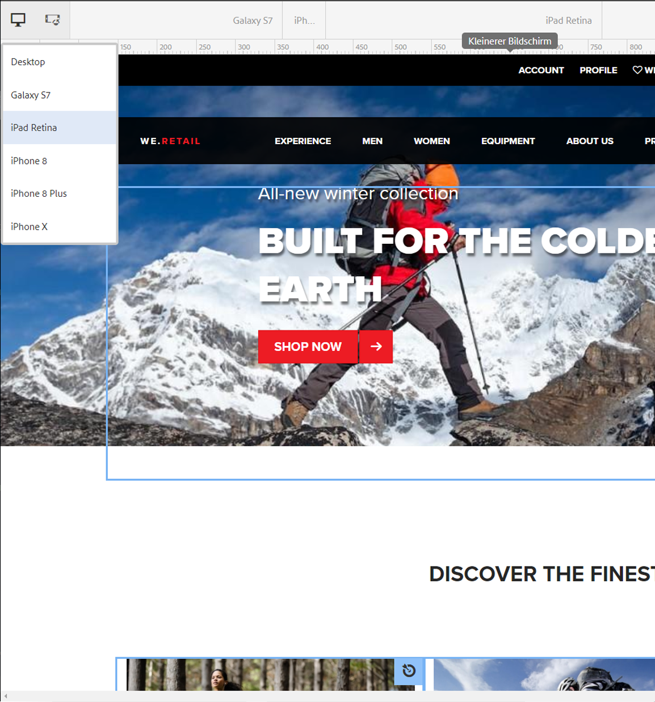
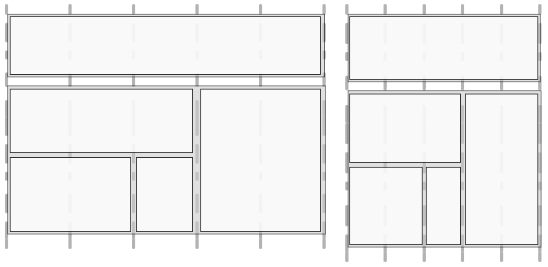

# Responsives Design für Webseiten{#responsive-design-for-web-pages}

>[!NOTE]
>
>Adobe empfiehlt die Verwendung des SPA-Editors für Projekte, die ein Framework-basiertes clientseitiges Rendern von Einzelseiten-Apps erfordern (z. B. _React_). [Weitere Informationen](/help/sites-developing/spa-overview.md).


Gestalten Sie Ihre Webseiten so, dass sie sich dem Client-Darstellungsfeld anpassen, auf dem sie angezeigt werden. Responsives Design ermöglicht die effektive Darstellung derselben Web-Seiten auf verschiedenen Geräten in beiden Ausrichtungen. Die folgende Grafik zeigt eine Reihe von Möglichkeiten, wie eine Seite auf Änderungen der Fenstergröße reagieren kann:

* Layout: Verwenden Sie einspaltige Layouts für kleinere Fenstergrößen und mehrspaltige Layouts für größere Fenstergrößen.
* Textgröße: Verwenden Sie für größere Fenstergrößen größere Schriftgrößen (wo passend, z. B. Überschriften).
* Inhalt: Zeigen Sie auf kleineren Geräten nur die wichtigsten Inhalte an.
* Navigation: Gerätespezifische Tools werden für den Zugriff auf andere Seiten zur Verfügung gestellt.
* Bilder: Stellen Sie anhand der Fenstergröße dem Client-Darstellungsfeld entsprechende Bilddarstellungen zur Verfügung.


Entwickeln Sie Adobe Experience Manager (AEM)-Anwendungen, die HTML5-Seiten generieren, die sich an verschiedene Fenstergrößen und Ausrichtungen anpassen. Beispielsweise entsprechen die folgenden Darstellungsfeldbreiten unterschiedlichen Gerätetypen und Ausrichtungen:

* Maximale Breite von 480 Pixel (Smartphone, Hochformat)
* Maximale Breite von 767 Pixel (Smartphone, Querformat)
* Breite zwischen 768 Pixel und 979 Pixel (Tablet, Hochformat)
* Breite zwischen 980 Pixel und 1199 Pixel (Tablet, Querformat)
* Breite von 1200 Pixel oder mehr (Desktop)

Weitere Informationen finden Sie unter den folgenden Themen zur Implementierung von responsivem Design:

* [Medienabfragen](/help/sites-developing/responsive.md#using-media-queries)
* [Fließende Raster](/help/sites-developing/responsive.md#developing-a-fluid-grid)
* [Adaptive Bilder](/help/sites-developing/responsive.md#using-adaptive-images)

Verwenden Sie beim Entwerfen **[!UICONTROL Sidekick]**, um eine Vorschau Ihrer Seiten für verschiedene Bildschirmgrößen anzuzeigen.

## Vor der Entwicklung von {#before-you-develop}

Vor der Entwicklung eines AEM-Programms, das Ihre Web-Seiten unterstützt, müssen Sie einige Design-Entscheidungen treffen. Beispielsweise benötigen Sie die folgenden Informationen:

* Auf welche Geräte der Entwicklungsprozess ausgerichtet ist.
* Die Größe der Zieldarstellungsfelder.
* Die Seiten-Layouts für die berücksichtigten Zieldarstellungsfelder.

### Anwendungsstruktur {#application-structure}

Die typische AEM-Programmstruktur unterstützt alle Implementierungen responsiven Designs:

* Seitenkomponenten befinden sich unter /apps/*application_name*/components.
* Vorlagen befinden sich unter /apps/*application_name*/templates.
* Designs befinden sich unter /etc/designs.

## Verwenden von Medienabfragen {#using-media-queries}

Medienabfragen ermöglichen die selektive Nutzung von CSS-Stilen für das Seiten-Rendering. AEM-Entwicklungs-Tools und -funktionen ermöglichen Ihnen die effektive und effiziente Implementierung von Medienabfragen in Programmen.

Die W3C-Gruppe stellt die [Medienabfragen](https://www.w3.org/TR/css3-mediaqueries/)-Empfehlung zur Verfügung, die diese CSS3-Funktion und die Syntax beschreibt.

### Erstellen der CSS-Datei {#creating-the-css-file}

Definieren Sie in der CSS-Datei Medienabfragen anhand der Eigenschaften der Zielgeräte. Die folgende Implementierungsstrategie kann für die Verwaltung der Stile der verschiedenen Medienabfragen verwendet werden:

* Verwenden Sie einen ClientLibraryFolder, um das CSS zu definieren, das zusammengestellt wird, wenn die Seite gerendert wird.
* Definieren Sie die Medienabfragen und die zugehörigen Stile in separaten CSS-Dateien. Dabei ist es hilfreich, Dateinamen zu verwenden, die die Geräteeigenschaften der Medienabfrage darstellen.
* Definieren Sie Stile, die alle Geräte gemeinsam haben, in einer separaten CSS-Datei.
* Sortieren Sie in der Datei css.txt des ClientLibraryFolder die Liste der CSS-Dateien, wie es in der zusammengestellten CSS-Datei erforderlich ist.

Das Beispiel „We.Retail Media“ verwendet diese Strategie zur Definition von Styles beim Website-Design. Die von We.Retail verwendete CSS-Datei befindet sich unter `*/apps/weretail/clientlibs/clientlib-site/less/grid.less`.

In der folgenden Tabelle werden die Dateien im untergeordneten css-Ordner aufgeführt.

<table>
 <tbody>
  <tr>
   <th>Dateiname</th>
   <th>Beschreibung</th>
   <th>Medienabfrage</th>
  </tr>
  <tr>
   <td>style.css</td>
   <td>Allgemeine Stile.</td>
   <td>Nicht zutreffend</td>
  </tr>
  <tr>
   <td>bootstrap.css</td>
   <td>Allgemeine Stile, die vom Twitter-Bootstrap definiert werden.</td>
   <td>Nicht zutreffend</td>
  </tr>
  <tr>
   <td>responsive-1200px.css</td>
   <td>Stile für alle Medien, die mindestens 1200 Pixel breit sind.</td>
   <td><p>@media (min-width: 1200px) {<br /> ...<br /> }</p> </td>
  </tr>
  <tr>
   <td>responsive-980px-1199px.css</td>
   <td>Stile für Medien, die zwischen 980 Pixel und 1199 Pixel breit sind.</td>
   <td><p>@media (min-width: 980px) und (max-width: 1199px) {<br /> ...<br /> }</p> </td>
  </tr>
  <tr>
   <td>responsive-768px-979px.css</td>
   <td>Stile für Medien mit einer Breite zwischen 768 Pixel und 979 Pixel. </td>
   <td><p>@media (min-width: 768 px) und (max-width: 979px) {<br /> ...<br /> }</p> </td>
  </tr>
  <tr>
   <td>responsive-767px-max.css</td>
   <td>Stile für alle Medien, die weniger als 768 Pixel breit sind.</td>
   <td><p>@media (max-width: 767px) {<br /> ...<br /> }</p> </td>
  </tr>
  <tr>
   <td>responsive-480px.css</td>
   <td>Stile für alle Medien, die weniger als 481 Pixel breit sind.</td>
   <td>@media (max-width: 480) {<br /> ...<br /> }</td>
  </tr>
 </tbody>
</table>

Die Datei css.txt im Ordner `/etc/designs/weretail/clientlibs` listet die CSS-Dateien auf, die der Client-Bibliotheksordner enthält. Die Reihenfolge der Dateien gibt die Priorität der Styles vor. Je kleiner das Gerät, desto spezifischer sind Styles.

`#base=css`

```
style.css
 bootstrap.css
```

```
responsive-1200px.css
 responsive-980px-1199px.css
 responsive-768px-979px.css
 responsive-767px-max.css
 responsive-480px.css
```

**Tipp**: Mithilfe beschreibender Dateinamen können Sie die gewünschte Darstellungsfeldgröße einfach identifizieren.

### Nutzung von Medienabfragen mit AEM-Seiten {#using-media-queries-with-aem-pages}

Binden Sie den Client-Bibliotheksordner in das JSP-Skript Ihrer Seitenkomponente ein, um die CSS-Datei zu erzeugen, die die Medienabfragen enthält, und auf die Datei zu verweisen.

```xml
<ui:includeClientLib categories="apps.weretail.all"/>
```

>[!NOTE]
>
>Der Client-Bibliotheksordner `apps.weretail.all` bettet die clientlibs-Bibliothek ein.

Das JSP-Skript generiert den folgenden HTML-Code, der auf die Stylesheets verweist:

```xml
<link rel="stylesheet" href="/etc/designs/weretail/clientlibs-all.css" type="text/css">
<link href="/etc/designs/weretail.css" rel="stylesheet" type="text/css">
```

## Vorschau für bestimmte Geräte {#previewing-for-specific-devices}

Sie haben die Möglichkeit, Vorschauen Ihrer Seiten in verschiedenen Größen anzuzeigen, um das Verhalten Ihres responsiven Designs zu testen. Im Modus **[!UICONTROL Vorschau]** enthält **[!UICONTROL Sidekick]** ein Dropdown-Menü **[!UICONTROL Geräte]**, das Sie zum Auswählen eines Geräts verwenden. Wenn Sie ein Gerät auswählen, passt sich die Seite der jeweiligen Darstellungsfeldgröße an.



Um die Gerätevorschau in **[!UICONTROL Sidekick]** zu aktivieren, müssen Sie die Seite und den Dienst **[!UICONTROL MobileEmulatorProvider]** konfigurieren. Eine andere Seitenkonfiguration steuert die Liste der Geräte, die in der Liste **[!UICONTROL Geräte]** angezeigt wird.

### Hinzufügen der Liste „Geräte“{#adding-the-devices-list}

Die Liste **[!UICONTROL Geräte]** wird in **[!UICONTROL Sidekick]** angezeigt, wenn Ihre Seite das JSP-Skript enthält, das die Liste **[!UICONTROL Geräte]** rendert. Um die Liste **[!UICONTROL Geräte]** zu **[!UICONTROL Sidekick]** hinzuzufügen, fügen Sie das Skript `/libs/wcm/mobile/components/simulator/simulator.jsp` in den Abschnitt `head` Ihrer Seite ein.

Fügen Sie folgenden Code in das JSP-Skript ein, das den Abschnitt `head` definiert:

`<cq:include script="/libs/wcm/mobile/components/simulator/simulator.jsp"/>`

Um ein Beispiel anzuzeigen, öffnen Sie die Datei `/apps/weretail/components/page/head.jsp` in CRXDE Lite.

### Registrieren von Seitenkomponenten für die Simulation {#registering-page-components-for-simulation}

Registrieren Sie Ihre Seitenkomponenten beim Werksdienst „MobileEmulatorProvider“ und definieren Sie die Eigenschaft `mobile.resourceTypes`, um zur Unterstützung Ihrer Seiten den Gerätesimulator zu aktivieren.

In AEM können Sie die Konfigurationseinstellungen für solche Dienste auf unterschiedliche Weise vornehmen. Umfassende Informationen finden Sie unter [Konfigurieren von OSGi](/help/sites-deploying/configuring-osgi.md).

Erstellen Sie beispielsweise einen Knoten ` [sling:OsgiConfig](/help/sites-deploying/configuring-osgi.md#adding-a-new-configuration-to-the-repository)` in Ihrer Anwendung:

* Übergeordneter Ordner: `/apps/application_name/config`
* Name: `com.day.cq.wcm.mobile.core.impl.MobileEmulatorProvider-*alias*`

   Das Suffix - `*alias*` ist erforderlich, da der MobileEmulatorProvider-Dienst ein Factory-Dienst ist. Verwenden Sie ein beliebiges eindeutiges Alias für diese Factory.

* jcr:primaryType: `sling:OsgiConfig`

Fügen Sie folgende Knoteneigenschaft hinzu:

* Name: `mobile.resourceTypes`
* Typ: `String[]`
* Wert: Die Pfade zu den Seitenkomponenten, die Ihre Webseiten rendern. Die App &quot;geometrixx-media&quot;verwendet beispielsweise die folgenden Werte:

   ```
   geometrixx-media/components/page
    geometrixx-unlimited/components/pages/page
    geometrixx-unlimited/components/pages/coverpage
    geometrixx-unlimited/components/pages/issue
   ```

### Festlegen der Gerätegruppen {#specifying-the-device-groups}

Zur Angabe der Gerätegruppen, die in der Liste „Geräte“ angezeigt werden, fügen Sie dem Knoten `cq:deviceGroups` der Stammseite Ihrer Website eine Eigenschaft `jcr:content` hinzu. Der Wert der Eigenschaft ist ein Array von Pfaden zu den Gerätegruppeknoten.

Gerätegruppenknoten befinden sich im Ordner `/etc/mobile/groups` .

Beispielsweise ist die Stammseite der Geometrixx Media-Site `/content/geometrixx-media`. Der Knoten `/content/geometrixx-media/jcr:content` enthält die folgende Eigenschaft:

* Name: `cq:deviceGroups`
* Typ: `String[]`
* Wert: `/etc/mobile/groups/responsive`

Verwenden Sie die Tools-Konsole, um [Gerätegruppen zu erstellen und zu bearbeiten](/help/sites-developing/groupfilters.md).

>[!NOTE]
>
>Bearbeiten Sie Gerätegruppen, die Sie für responsives Design verwenden, und wählen Sie auf der Registerkarte „Allgemein“ die Option „Emulator deaktivieren“ aus. Diese Option verhindert, dass das Emulatorkarussel angezeigt wird, das für responsives Design nicht relevant ist.


## Verwenden adaptiver Bilder {#using-adaptive-images}

Mithilfe von Medienabfragen können Sie eine Bildressource auswählen, die auf der Seite angezeigt wird. Allerdings werden alle Ressourcen, die eine Medienabfrage verwenden, um ihre Nutzung mit Bedingungen zu belegen, auf den Client heruntergeladen. Die Medienabfrage bestimmt lediglich, ob die heruntergeladene Ressource angezeigt wird.

Bei großen Ressourcen (z. B. Bildern) stellt das Herunterladen aller Ressourcen keine effiziente Nutzung der Client-Datenleitung dar. Verwenden Sie JavaScript zum Initiieren der Ressourcenanfrage, nachdem die Medienabfragen die Auswahl durchgeführt haben, um Ressourcen selektiv herunterzuladen.

Die folgende Strategie lädt eine einzelne Ressource, die mithilfe von Medienabfragen ausgewählt wird:

1. Fügen Sie für jede Version der Ressource ein DIV-Element hinzu. Schließen Sie den URI der Ressource als Wert eines Attributwerts mit ein. Der Browser interpretiert das Attribut nicht als Ressource.
1. Fügen Sie jedem DIV-Element eine Medienabfrage hinzu, die für die Ressource geeignet ist.
1. Wenn das Dokument lädt oder die Größe des Fensters geändert wird, prüft JavaScript-Code die Medienabfragen aller DIV-Elemente.
1. Anhand der Abfrageergebnisse entscheiden Sie, welche Ressourcen Sie einschließen.
1. Fügen Sie in dem DOM, das auf die Ressource verweist, ein HTML-Element ein.

### Medienabfragen mit JavaScript auswerten {#evaluating-media-queries-using-javascript}

Implementierungen der [MediaQueryList-Schnittstelle](https://dev.w3.org/csswg/cssom-view/#the-mediaquerylist-interface), die vom W3C definiert wird, ermöglichen es Ihnen, Medienabfragen mithilfe von JavaScript zu bewerten. Sie können Logik auf die Medienabfrageergebnisse anwenden und Skripte ausführen, die für das aktive Fenster bestimmt sind:

* Browser, die die MediaQueryList-Schnittstelle implementieren, unterstützen die Funktion `window.matchMedia()` . Diese Funktion testet Medienabfragen anhand einer gegebenen Zeichenfolge. Die Funktion gibt ein `MediaQueryList`-Objekt zurück, das Zugriff auf die Abfrageergebnisse bietet.

* Für Browser, die die Schnittstelle nicht implementieren, können Sie ein `matchMedia()` -Polyfill verwenden, z. B. [matchMedia.js](https://github.com/paulirish/matchMedia.js), eine frei verfügbare JavaScript-Bibliothek.

#### Auswählen medienspezifischer Ressourcen {#selecting-media-specific-resources}

Das von W3C-vorgeschlagene [Bildelement](https://picture.responsiveimages.org/) verwendet Medienabfragen, um die für Bildelemente zu verwendende Quelle zu ermitteln. Das Bildelement verwendet Elementattribute, um Medienabfragen Bildpfaden zuzuordnen.

Die frei verfügbare Bibliothek [picturefill.js](https://github.com/scottjehl/picturefill) bietet ähnliche Funktionen wie das vorgeschlagene Element `picture` und verwendet eine ähnliche Strategie. Die picturefill.js-Bibliothek ruft `window.matchMedia` auf, um die Medienabfragen zu prüfen, die für einen Satz von `div`-Elementen definiert sind. Alle `div`-Elemente geben auch eine Bildquelle an. Die Quelle wird verwendet, wenn die Medienabfrage des `div`-Elements `true` zurückgibt.

Die `picturefill.js`-Bibliothek erfordert HTML-Code, der dem folgenden Beispiel ähnelt:

```xml
<div data-picture>
    <div data-src='path to default image'></div>
    <div data-src='path to small image'    data-media="(media query for phone)"></div>
    <div data-src='path to medium image'   data-media="(media query for tablet)"></div>
    <div data-src='path to large image'     data-media="(media query for monitor)"></div>
</div>
```

Wenn die Seite gerendert wird, fügt picturefull.js ein `img` -Element als letztes untergeordnetes Element des Elements `<div data-picture>` ein:

```xml
<div data-picture>
    <div data-src='path to default image'></div>
    <div data-src='path to small image'    data-media="(media query for phone)"></div>
    <div data-src='path to medium image'   data-media="(media query for tablet)"></div>
    <div data-src='path to large image'     data-media="(media query for monitor)"></div>
    
</div>
```

Auf einer AEM Seite ist der Wert des Attributs `data-src` der Pfad zu einer Ressource im Repository.

### Implementieren adaptiver Bilder in AEM {#implementing-adaptive-images-in-aem}

Sie müssen die erforderlichen JavaScript-Bibliotheken hinzufügen und auf Ihren Seiten das erforderliche HTML-Markup einfügen, um in einer AEM-Anwendung adaptive Bilder zu implementieren.

**Bibliotheken**

Beziehen Sie die folgenden JavaScript-Bibliotheken und fügen Sie sie in einen Client-Bibliotheksordner ein:

* [matchMedia.js](https://github.com/paulirish/matchMedia.js)  (für Browser, die die MediaQueryList-Schnittstelle nicht implementieren)
* [picturefill.js](https://github.com/scottjehl/picturefill)
* jquery.js (verfügbar über den Client-Bibliotheksordner `/etc/clientlibs/granite/jquery` (category = jquery)
* [jquery.debouncedresize.js](https://github.com/louisremi/jquery-smartresize) (ein jquery-Ereignis, das auftritt, nachdem die Größe des Fensters verändert wurde)

**Tipp:** Sie können mehrere Client-Bibliotheksordner automatisch verketten, indem Sie sie  [einbetten](/help/sites-developing/clientlibs.md#embedding-code-from-other-libraries).

**HTML**

Erstellen Sie eine Komponente, die die erforderlichen div-Elemente generiert, die der picturefill.js-Code erwartet. Auf einer AEM Seite ist der Wert des data-src -Attributs der Pfad zu einer Ressource im Repository. Beispielsweise kann eine Seitenkomponente die Medienabfragen und die zugeordneten Pfade für Bilddarstellungen in DAM fest programmieren. Alternativ können Sie eine benutzerdefinierte Bildkomponente erstellen, die es Autoren ermöglicht, Bilddarstellungen auszuwählen oder Laufzeit-Render-Optionen anzugeben.

Im folgenden HTML-Codebeispiel wird aus 2 DAM-Darstellungen desselben Bilds ausgewählt.

```xml
<div data-picture>
    <div data-src='/content/dam/geometrixx-media/articles/meridien.png'></div>
    <div data-src='/content/dam/geometrixx-media/articles/meridien.png/jcr:content/renditions/cq5dam.thumbnail.319.319.png'    data-media="(min-width: 769px)"></div>
    <div data-src='/content/dam/geometrixx-media/articles/meridien.png/jcr:content/renditions/cq5dam.thumbnail.140.100.png'   data-media="(min-width: 481px)"></div>
</div>
```

>[!NOTE]
>
>Die Foundation-Komponente „Adaptive Image“ implementiert adaptive Bilder:
>
>* Client-Bibliotheksordner: `/libs/foundation/components/adaptiveimage/clientlibs`
>* Skript, das den HTML-Code generiert: `/libs/foundation/components/adaptiveimage/adaptiveimage.jsp`

>
>
Der folgende Abschnitt enthält Details zu dieser Komponente.


### Verstehen des Bild-Renderings in AEM {#understanding-image-rendering-in-aem}

Sie müssen die standardmäßige AEM-Implementierung des Renderings für statische Bilder verstehen, um das Bild-Rendering anzupassen. AEM stellt die Bildkomponente und ein Bild-Render-Servlet zur Verfügung, die zusammenarbeiten, um Bilder für Webseiten zu rendern. Die folgende Ereignissequenz tritt auf, wenn die Bildkomponente im Absatzsystem der Seite enthalten ist:

1. Bearbeiten: Autoren bearbeiten die Bildkomponente so, dass die Bilddatei angegeben wird, die in einer HTML-Seite enthalten sein soll. Der Dateipfad wird als Eigenschaftswert des Bildkomponentenknotens gespeichert.
1. Seitenanforderung: Das JSP der Seitenkomponente generiert den HTML-Code. Das JSP der Bildkomponente generiert ein img-Element und fügt es auf der Seite ein.
1. Bildanforderung: Der Webbrowser lädt die Seite und fordert das Bild anhand des src-Attributs des img-Elements an.
1. Bild-Rendering: Das Servlet für das Bild-Rendering gibt das Bild an den Webbrowser zurück.


Beispielsweise erzeugt das JSP der Bildkomponente das folgende HTML-Element:

``

Wenn der Browser die Seite lädt, fordert er das Bild an und nutzt dazu den Wert des src-Attributs als URL. Sling zerlegt die URL:

* Ressource: `/content/mywebsite/en/_jcr_content/par/image_0`
* Dateinamenerweiterung: `.jpg`
* Selektor: `img`
* Suffix: `1358372073597.jpg`

Der Knoten `image_0` hat den Wert `jcr:resourceType` von `foundation/components/image`, der den Wert `sling:resourceSuperType` von `foundation/components/parbase` aufweist. Die parbase-Komponente umfasst das Skript img.GET.java, das mit dem Selektor und der Dateierweiterung der Anfrage-URL übereinstimmt. CQ verwendet dieses Skript (Servlet), um das Bild zu rendern.

Um den Quellcode des Skripts anzuzeigen, verwenden Sie die CRXDE Lite zum Öffnen von `/libs/foundation/components/parbase/img.GET.java`
-Datei.

## Skalieren von Bildern für die aktuelle Darstellungsfeldgröße {#scaling-images-for-the-current-viewport-size}

Skalieren Sie Bilder zur Laufzeit entsprechend den Eigenschaften des Client-Darstellungsfeldes, um Bilder zur Verfügung zu stellen, die den Prinzipien des responsiven Designs entsprechen. Verwenden Sie dasselbe Designmuster wie für das Rendering statischer Bilder und verwenden Sie ein Servlet und eine Bearbeitungskomponente.

Die Komponente muss die folgenden Aufgaben durchführen:

* Speichern des Pfads und der gewünschten Abmessungen der Bildressource als Eigenschaftswerte
* Generieren Sie `div` -Elemente, die Medienselektoren und Service-Aufrufe zum Rendern des Bildes enthalten.

>[!NOTE]
>
>Der Webclient verwendet die JavaScript-Bibliotheken &quot;matchMedia&quot;und &quot;Picturefill&quot;(oder ähnliche Bibliotheken), um die Medienselektoren zu bewerten.


Das Servlet, das die Bildanforderung verarbeitet, muss die folgenden Aufgaben ausführen:

* Abrufen des Pfads und der Abmessungen des Bilds aus den Komponenteneigenschaften
* Skalieren des Bilds gemäß der Eigenschaften und Zurückgeben des Bilds

**Verfügbare Lösungen**

AEM installiert die folgenden Implementierungen, die Sie verwenden oder erweitern können.

* Die Foundation-Komponente für adaptive Bilder, die Medienabfragen generiert, und HTTP-Anfragen an „Adaptive Image Component Servlet“ sendet, das die Bilder skaliert.
* Das Paket „Geometrixx Commons“ installiert die Image Reference Modification Servlet-Beispiel-Servlets, die die Bildauflösung verändern.

### Grundlegendes zur Adaptive Image-Komponente {#understanding-the-adaptive-image-component}

Die Komponente Adaptives Bild generiert Aufrufe an das Servlet für adaptive Bildkomponenten, um ein Bild zu rendern, das entsprechend dem Gerätebildschirm skaliert wird. Die Komponente enthält die folgenden Ressourcen:

* JSP: Fügt div-Elemente hinzu, die Medienabfragen mit Aufrufen von „Adaptive Image Component Servlet“ verknüpfen.
* Client-Bibliotheken: Der Ordner clientlibs ist ein `cq:ClientLibraryFolder` , der die JavaScript-Bibliothek matchMedia-Polyfill und eine modifizierte JavaScript-Bibliothek Picturefill zusammenstellt.
* Dialogfeld &quot;Bearbeiten&quot;: Der Knoten `cq:editConfig` überschreibt die CQ Foundation-Bildkomponente, sodass das Ablageziel eine adaptive Bildkomponente und keine Foundation-Bildkomponente erstellt.

#### Hinzufügen der DIV-Elemente {#adding-the-div-elements}

Das Skript „adaptive-image.jsp“ enthält den folgenden Code, der div-Elemente und Medienabfragen generiert:

```
<div data-picture data-alt='<%= alt %>'>
    <div data-src='<%= path + ".img.320.low." + extension + suffix %>'       data-media="(min-width: 1px)"></div>                                        <%-- Small mobile --%>
    <div data-src='<%= path + ".img.320.medium." + extension + suffix %>'    data-media="(min-width: 320px)"></div>  <%-- Portrait mobile --%>
    <div data-src='<%= path + ".img.480.medium." + extension + suffix %>'    data-media="(min-width: 321px)"></div>  <%-- Landscape mobile --%>
    <div data-src='<%= path + ".img.476.high." + extension + suffix %>'      data-media="(min-width: 481px)"></div>   <%-- Portrait iPad --%>
    <div data-src='<%= path + ".img.620.high." + extension + suffix %>'      data-media="(min-width: 769px)"></div>  <%-- Landscape iPad --%>
    <div data-src='<%= path + ".img.full.high." + extension + suffix %>'     data-media="(min-width: 1025px)"></div> <%-- Desktop --%>

    <%-- Fallback content for non-JS browsers. Same img src as the initial, unqualified source element. --%>
    <noscript>
        ' alt='<%= alt %>'>
    </noscript>
</div>
```

die Variable `path` enthält den Pfad der aktuellen Ressource (der Komponentenknoten für adaptive Bilder). Der Code generiert eine Reihe von `div`-Elementen mit der folgenden Struktur:

`<div data-scr = "*path-to-parent-node*.adaptive-image.adapt.*width*.*quality*.jpg" data-media="*media query*"></div>`

Der Wert des Attributs `data-scr` ist eine URL, die Sling auflöst, um „Adaptive Image Component Servlet“ zu erhalten, das das Bild rendert. Das Datenmedienattribut umfasst die Medienabfrage, die anhand der Client-Eigenschaften geprüft wird.

Der folgende HTML-Code ist ein Beispiel für die `div` -Elemente, die von JSP generiert werden:

```xml
<div data-src='/content/geometrixx-media/en/events/the-lineup-you-ve-been-waiting-for/jcr:content/article-content-par/adaptive_image.adapt.320.low.jpg'></div>
    <div data-src='/content/geometrixx-media/en/events/the-lineup-you-ve-been-waiting-for/jcr:content/article-content-par/adaptive_image.adapt.320.medium.jpg'    data-media="(min-width: 320px)"></div>
    <div data-src='/content/geometrixx-media/en/events/the-lineup-you-ve-been-waiting-for/jcr:content/article-content-par/adaptive_image.adapt.480.medium.jpg'    data-media="(min-width: 321px)"></div>
    <div data-src='/content/geometrixx-media/en/events/the-lineup-you-ve-been-waiting-for/jcr:content/article-content-par/adaptive_image.adapt.476.high.jpg'     data-media="(min-width: 481px)"></div>
    <div data-src='/content/geometrixx-media/en/events/the-lineup-you-ve-been-waiting-for/jcr:content/article-content-par/adaptive_image.adapt.620.high.jpg'     data-media="(min-width: 769px)"></div>
    <div data-src='/content/geometrixx-media/en/events/the-lineup-you-ve-been-waiting-for/jcr:content/article-content-par/adaptive_image.adapt.full.high.jpg'     data-media="(min-width: 1025px)"></div>
```

#### Bildgrößenselektoren {#changing-the-image-size-selectors} ändern

Falls Sie die adaptive Bildkomponente anpassen und die Breitenselektoren ändern, müssen Sie auch „Adaptive Image Component Servlet“ so konfigurieren, dass es die Breiten unterstützt.

### Einblick in „Adaptive Image Component Servlet“  {#understanding-the-adaptive-image-component-servlet}

„Adaptive Component Servlet“ ändert die Größe eines JPEG-Bilds in eine gegebene Breite und legt die JPEG-Qualität fest.

#### Die Benutzeroberfläche des Adaptive Image Component Servlet {#the-interface-of-the-adaptive-image-component-servlet}

„Adaptive Image Component Servlet“ ist an das standardmäßige Sling-Servlet gebunden und unterstützt die Dateiformate JPG, JPEG, GIF und PNG. Der Servlet-Selektor ist img.

>[!CAUTION]
>
>Animierte GIF-Dateien werden in AEM für adaptive Darstellungen nicht unterstützt.

Deshalb löst Sling HTTP-Anforderungs-URLs im folgenden Format in dieses Servlet auf:

`*path-to-node*.img.*extension*`

Beispielsweise leitet Sling HTTP-Anforderungen mit der URL `http://localhost:4502/content/geometrixx/adaptiveImage.img.jpg` an das Adaptive Image Component Servlet weiter.

Zwei weitere Selektoren definieren die angeforderte Bildbreite und JPEG-Qualität. Im folgenden Beispiel wird ein Bild mit einer Breite von 480 Pixel und von mittlerer Qualität angefordert:

`http://localhost:4502/content/geometrixx/adaptiveImage.adapt.480.MEDIUM.jpg`

**Unterstützte Bildeigenschaften**

Das Servlet akzeptiert eine begrenzte Anzahl von Bildbreiten und -qualitäten. Die folgenden Breiten werden standardmäßig unterstützt (in Pixel):

* vollständig
* 320
* 480
* 476
* 620

Der Wert „vollständig“ bedeutet, dass keine Skalierung vorgenommen wird.

Die folgenden Werte für die JPEG-Qualität werden unterstützt:

* LOW
* MEDIUM
* HIGH

Sie entsprechen jeweils den numerischen Werten 0,4, 0,82 und 1,0.

**Ändern der standardmäßig unterstützten Breiten**

Konfigurieren Sie die unterstützten Breiten von „Adobe CQ Adaptive Image Component Servlet“ anhand der Web-Konsole ([http://localhost:4502/system/console/configMgr](http://localhost:4502/system/console/configMgr)) oder eines sling:OsgiConfig-Knotens.

Weitere Informationen dazu, wie Sie AEM-Dienste konfigurieren, finden Sie unter [Konfigurieren von OSGi](/help/sites-deploying/configuring-osgi.md).

<table>
 <tbody>
  <tr>
   <th> </th>
   <th>Webkonsole</th>
   <th>sling:OsgiConfig</th>
  </tr>
  <tr>
   <th>Name des Dienstes oder Knotens</th>
   <td>Der Dienstname auf der Registerkarte "Konfiguration"ist Adobe CQ Adaptive Image Component Servlet</td>
   <td>com.day.cq.wcm.foundation.impl. AdaptiveImageComponentServlet</td>
  </tr>
  <tr>
   <th>Property</th>
   <td><p>Unterstützte Breiten</p>
    <ul>
     <li>Um eine unterstützte Breite hinzuzufügen, klicken Sie auf die Schaltfläche + und geben Sie eine positive Ganzzahl ein.</li>
     <li>Um eine unterstützte Breite zu entfernen, klicken Sie auf die zugehörige Schaltfläche - .</li>
     <li>Zum Bearbeiten einer unterstützten Breite bearbeiten Sie den Feldwert.</li>
    </ul> </td>
   <td><p>adapt.supported.widths</p>
    <ul>
     <li>Die Eigenschaft ist ein mehrwertiger String -Wert.</li>
    </ul> </td>
  </tr>
 </tbody>
</table>

#### Implementierungsdetails {#implementation-details}

Die Klasse `com.day.cq.wcm.foundation.impl.AdaptiveImageComponentServlet` erweitert die Klasse [AbstractImageServlet](https://helpx.adobe.com/experience-manager/6-5/sites/developing/using/reference-materials/javadoc/com/day/cq/wcm/commons/AbstractImageServlet.html) . Der Quellcode von AdaptiveImageComponentServlet befindet sich im Ordner `/libs/foundation/src/impl/src/com/day/cq/wcm/foundation/impl` .

Die Klasse verwendet Felix SCR-Benachrichtigungen zum Konfigurieren des Ressourcentyps und der Dateierweiterung, die dem Servlet zugeordnet werden, und des Namens des ersten Selektors.

```java
@Component(metatype = true, label = "Adobe CQ Adaptive Image Component Servlet",
        description = "Render adaptive images in a variety of qualities")
@Service
@Properties(value = {
    @Property(name = "sling.servlet.resourceTypes", value = "foundation/components/adaptiveimage", propertyPrivate = true),
    @Property(name = "sling.servlet.selectors", value = "img", propertyPrivate = true),
    @Property(name = "sling.servlet.extensions", value ={
            "jpg",
            "jpeg",
            "png",
            "gif"
    }, propertyPrivate = true)
})
```

Das Servlet verwendet die Property-SCR-Anmerkung zum Festlegen der standardmäßig unterstützten Bildqualitäten und -abmessungen.

```java
@Property(value = {
            "320", // iPhone portrait
            "480", // iPhone landscape
            "476", // iPad portrait
            "620" // iPad landscape
    },
            label = "Supported Widths",
            description = "List of widths this component is permitted to generate.")
```

Die `AbstractImageServlet`-Klasse stellt die `doGet`-Methode bereit, die die HTTP-Anforderung verarbeitet. Diese Methode bestimmt die Ressource, die mit der Anfrage verknüpft ist, ruft Ressourceneigenschaften aus dem Repository ab und gibt sie in einem [ImageContext](https://helpx.adobe.com/experience-manager/6-5/sites/developing/using/reference-materials/javadoc/com/day/cq/wcm/commons/AbstractImageServlet.ImageContext.html) -Objekt zurück.

>[!NOTE]
>
>Die Klasse [com.day.cq.commons.DownloadResource](https://helpx.adobe.com/experience-manager/6-5/sites/developing/using/reference-materials/javadoc/com/day/cq/commons/DownloadResource.html) stellt die Klasse `getFileReference method` bereit, die den Wert der Eigenschaft `fileReference` der Ressource abruft.

Die `AdaptiveImageComponentServlet`-Klasse überschreibt die `createLayer`-Methode. Die Methode ruft den Pfad der Bildressource und die angeforderte Bildbreite vom `ImageContext`-Objekt ab. Dann ruft Sie die Methoden der Klasse `info.geometrixx.commons.impl.AdaptiveImageHelper`   auf, die die tatsächliche Bildskalierung durchführen.

Die Klasse AdaptiveImageComponentServlet überschreibt auch die Methode writeLayer . Diese Methode wendet die JPEG-Qualität auf das Bild an.

### Image Reference Modification Servlet (Geometrixx Common)  {#image-reference-modification-servlet-geometrixx-common}

Das beispielhafte „Image Reference Modification Servlet“ generiert Größenattribute für das img-Element zum Skalieren eines Bilds auf der Webseite.

#### Aufrufen des Servlets  {#calling-the-servlet}

Das Servlet ist an `cq:page`-Ressourcen gebunden und unterstützt das Dateiformat JPG. Der Servlet-Selektor ist `image`. Deshalb löst Sling HTTP-Anforderungs-URLs im folgenden Format in dieses Servlet auf:

`path-to-page-node.image.jpg`

Beispielsweise leitet Sling HTTP-Anforderungen mit der URL `http://localhost:4502/content/geometrixx/en.image.jpg` an das Image Reference Modification Servlet weiter.

Drei weitere Selektoren definieren die angeforderte Bildbreite, -höhe und (optional) -qualität. Im folgenden Beispiel wird ein Bild mit einer Breite von 770 Pixel, einer Höhe von 360 Pixel und von mittlerer Qualität angefordert.

`http://localhost:4502/content/geometrixx/en.image.770.360.MEDIUM.jpg`

**Unterstützte Bildeigenschaften**

Das Servlet akzeptiert eine begrenzte Anzahl von Bildabmessungen und Qualitätswerten.

Die folgenden Werte werden standardmäßig unterstützt (Breite x Höhe):

* 256x192
* 370x150
* 480x200
* 127x127
* 770x360
* 620x290
* 480x225
* 320 x 150
* 375x175
* 303x142
* 1170x400
* 940x340
* 770x300
* 480x190

Die folgenden Werte für die Bildqualität werden unterstützt:

* low
* medium
* high

Bei AEM können Sie die Konfigurationseinstellungen für Dienste dieser Art auf unterschiedliche Weise vornehmen. Ausführliche Details finden Sie unter [Konfigurieren von OSGi](/help/sites-deploying/configuring-osgi.md).

#### Festlegen der Bildressource  {#specifying-the-image-resource}

Der Bildpfad, die Abmessungen und die Qualitätswerte müssen als Eigenschaften eines Knotens im Repository gespeichert werden:

* Der Knotenname ist `image`.
* Der übergeordnete Knoten ist der Knoten `jcr:content` einer `cq:page`-Ressource.

* Der Bildpfad wird als Wert einer Eigenschaft mit der Bezeichnung `fileReference` gespeichert.

Verwenden Sie beim Erstellen einer Seite **Sidekick** , um das Bild anzugeben und den Knoten `image` zu den Seiteneigenschaften hinzuzufügen:

1. Klicken Sie in **Sidekick** auf die Registerkarte **Seite** und klicken Sie dann auf **Seiteneigenschaften**.
1. Klicken Sie auf die Registerkarte **Bild** und geben Sie das Bild an.
1. Klicken Sie auf **OK**.

#### Implementierungsdetails {#implementation-details-1}

Die Klasse info.geometrixx.commons.impl.servlets.ImageReferenceModificationServlet erweitert die Klasse [AbstractImageServlet](https://helpx.adobe.com/experience-manager/6-5/sites/developing/using/reference-materials/javadoc/com/day/cq/wcm/commons/AbstractImageServlet.html) . Wenn Sie das Paket cq-geometrixx-commons-pkg installiert haben, befindet sich der Quellcode ImageReferenceModificationServlet im Ordner `/apps/geometrixx-commons/src/core/src/main/java/info/geometrixx/commons/impl/servlets` .

Die Klasse verwendet Felix SCR-Benachrichtigungen zum Konfigurieren des Ressourcentyps und der Dateierweiterung, die dem Servlet zugeordnet werden, und des Namens des ersten Selektors.

```java
@Component(metatype = true, label = "Adobe CQ Image Reference Modification Servlet",
        description = "Render the image associated with a page in a variety of dimensions and qualities")
@Service
@Properties(value = {
    @Property(name = "sling.servlet.resourceTypes", value = NameConstants.NT_PAGE, propertyPrivate = true),
    @Property(name = "sling.servlet.selectors", value = "image", propertyPrivate = true),
    @Property(name = "sling.servlet.extensions", value = "jpg", propertyPrivate = true)
})
```

Das Servlet verwendet die Property-SCR-Anmerkung zum Festlegen der standardmäßig unterstützten Bildqualitäten und -abmessungen.

```java
@Property(label = "Image Quality",
            description = "Quality must be a double between 0.0 and 1.0", value = "0.82")
@Property(value = {
                "256x192", // Category page article list images
                "370x150", // "Most popular" desktop & iPad & carousel min-width: 1px
                "480x200", // "Most popular" phone
                "127x127", // article summary phone square images
                "770x360", // article summary, desktop
                "620x290", // article summary, tablet
                "480x225", // article summary, phone (landscape)
                "320x150", // article summary, phone (portrait) and fallback
                "375x175", // 2-column article summary, desktop
                "303x142", // 2-column article summary, tablet
                "1170x400", // carousel, full
                "940x340",  // carousel min-width: 980px
                "770x300",  // carousel min-width: 768px
                "480x190"   // carousel min-width: 480px
            },
            label = "Supported Resolutions",
            description = "List of resolutions this component is permitted to generate.")
```

Die `AbstractImageServlet`-Klasse stellt die `doGet`-Methode bereit, die die HTTP-Anforderung verarbeitet. Diese Methode bestimmt die Ressource, die mit dem Aufruf verknüpft ist, ruft Ressourceneigenschaften aus dem Repository ab und speichert sie in einem [ImageContext](https://helpx.adobe.com/experience-manager/6-5/sites/developing/using/reference-materials/javadoc/com/day/cq/wcm/commons/AbstractImageServlet.ImageContext.html) -Objekt.

Die `ImageReferenceModificationServlet`-Klasse überschreibt die `createLayer`-Methode und implementiert die Logik, die die zu rendernde Bildressource bestimmt. Die Methode ruft einen untergeordneten Knoten des Knotens `jcr:content` der Seite mit dem Namen `image` ab. Ein [Image](https://helpx.adobe.com/experience-manager/6-5/sites/developing/using/reference-materials/javadoc/com/day/cq/wcm/foundation/Image.html) -Objekt wird von diesem `image` -Knoten erstellt und die `getFileReference` -Methode gibt den Pfad zur Bilddatei aus der `fileReference` -Eigenschaft des Bildknotens zurück.

>[!NOTE]
>Die Klasse [com.day.cq.commons.DownloadResource](https://helpx.adobe.com/experience-manager/6-5/sites/developing/using/reference-materials/javadoc/com/day/cq/commons/DownloadResource.html) stellt die Methode getFileReference bereit.


## Entwickeln eines fließenden Rasters {#developing-a-fluid-grid}

AEM ermöglicht Ihnen die effiziente und effektive Implementierung fließender Raster. Auf dieser Seite wird erläutert, wie Sie Ihr fließendes Raster oder eine vorhandene Rasterimplementierung (z. B. [Bootstrap](https://twitter.github.com/bootstrap/)) in Ihre AEM-Anwendung integrieren können.

Im Abschnitt [Einführung zu fließenden Rastern](/help/sites-developing/responsive.md#developing-a-fluid-grid) unten auf dieser Seite finden Sie nähere Informationen zu fließenden Rastern. Diese Einführung bietet einen Überblick über fließende Raster und Anleitungen für ihren Entwurf.

### Definieren des Rasters mit einer Seitenkomponente {#defining-the-grid-using-a-page-component}

Verwenden Sie Seitenkomponenten, um die HTML-Elemente zu erzeugen, die die Inhaltsblöcke der Seite definieren. Der ClientLibraryFolder, auf den die Seite verweist, stellt das CSS zur Verfügung, das das Layout der Inhaltsblöcke steuert:

* Seitenkomponente: Fügt div-Elemente hinzu, die Zeilen von Inhaltsblöcken darstellen. Die div-Elemente, die Inhaltsblöcke darstellen, umfassen eine parsys-Komponente, in der Autoren Inhalte hinzufügen.
* Client-Bibliotheksordner: Stellt die CSS-Datei zur Verfügung, die die Medienabfragen und Styles für die div-Elemente enthält.

Beispielsweise enthält die beispielhafte Anwendung „geometrixx-media“ die Komponente „media-home“. Diese Seitenkomponente fügt zwei Skripte hinzu, die zwei `div`-Elemente der Klasse `row-fluid` generieren:

* Die erste Zeile enthält ein `div`-Element der Klasse `span12` (der Inhalt umfasst 12 Spalten). Das `div`-Element enthält die parsys-Komponente.

* Die zweite Zeile enthält zwei `div` -Elemente, eines der Klassen `span8` und das andere der Klasse `span4`. Jedes `div`-Element enthält die parsys-Komponente.

```xml
<div class="page-content">
    <div class="row-fluid">
        <div class="span12">
            <cq:include path="grid-12-par" resourceType="foundation/components/parsys" />
        </div>
    </div>
    <div class="row-fluid">
        <div class="span8">
            <cq:include path="grid-8-par" resourceType="foundation/components/parsys" />
        </div>
        <div class="span4">
            <cq:include path="grid-4-par" resourceType="foundation/components/parsys" />
        </div>
    </div>
</div>
```

>[!NOTE]
>
>Wenn eine Komponente mehrere `cq:include` -Elemente enthält, die auf die parsys-Komponente verweisen, muss jedes `path` -Attribut einen anderen Wert haben.


#### Skalieren des Seitenkomponentenrasters {#scaling-the-page-component-grid}

Das Design, das mit der Seitenkomponente geometrixx-media (`/etc/designs/geometrixx-media`) verknüpft ist, enthält den Ordner `clientlibs` ClientLibraryFolder . Dieser ClientLibraryFolder definiert CSS-Stile für `row-fluid`-Klassen, `span*`-Klassen und `span*`-Klassen, die untergeordnete Elemente von `row-fluid`-Klassen sind. Medienabfragen ermöglichen die Neudefinition von Styles für verschiedene Darstellungsfeldgrößen.

Das folgende Beispiel-CSS ist eine Untergruppe dieser Styles. Diese Untergruppe konzentriert sich auf die Klassen `span12`, `span8` und `span4` sowie Medienabfragen für zwei Darstellungsfeldgrößen. Beachten Sie die folgenden Eigenschaften des CSS:

* Die `.span`-Stile definieren Elementbreiten mithilfe absoluter Zahlen.
* Die `.row-fluid .span*`-Stile definieren Elementbreiten als Prozentsätze des übergeordneten Elements. Prozentsätze werden anhand der absoluten Breiten berechnet.
* Medienabfragen für größere Darstellungsfelder weisen größere absolute Breiten zu.

>[!NOTE]
>
>Das Geometrixx Media-Beispiel integriert das [Bootstrap](https://twitter.github.com/bootstrap/javascript.html)-JavaScript-Framework in seine Implementierung fließender Raster. Das Bootstrap-Framework stellt die Datei &quot;bootstrap.css&quot;bereit.

```xml
/* default styles (no media queries) */
 .span12 { width: 940px }
 .span8 { width: 620px }
 .span4 { width: 300px }
 .row-fluid .span12 { width: 100% }
 .row-fluid .span8 { width: 65.95744680851064% }
 .row-fluid .span4 { width: 31.914893617021278% }

@media (min-width: 768px) and (max-width: 979px) {
 .span12 { width: 724px; }
 .span8 {     width: 476px; }
 .span4 {     width: 228px; }
 .row-fluid .span12 {     width: 100%;}
 .row-fluid .span8 {     width: 65.74585635359117%; }
 .row-fluid .span4 {     width: 31.491712707182323%; }
}

@media (min-width: 1200px) {
 .span12 { width: 1170px }
 .span8 { width: 770px }
 .span4 { width: 370px }
 .row-fluid .span12 { width: 100% }
 .row-fluid .span8 { width: 65.81196581196582% }
 .row-fluid .span4 { width: 31.623931623931625% }
}
```

#### Neupositionieren von Inhalten im Seiten-Komponentensegment-Raster {#repositioning-content-in-the-page-component-grid}

Die Seiten der beispielhaften Geometrixx Media-Anwendung verteilen Zeilen von Inhaltsblöcken horizontal in breiten Darstellungsfeldern. In kleineren Darstellungsfeldern werden dieselben Blöcke vertikal verteilt. Das folgende Beispiel-CSS zeigt die Dateitypen, die dieses Verhalten für den HTML-Code implementieren, den die Seitenkomponente „media-home“ generiert:

* Das Standard-CSS für die Seite &quot;media-welcome&quot;weist den `float:left`-Stil für `span*`-Klassen zu, die sich in `row-fluid`-Klassen befinden.

* Medienabfragen für kleinere Viewports weisen denselben Klassen den `float:none`-Stil zu.

```xml
/* default styles (no media queries) */
    .row-fluid [class*="span"] {
        width: 100%;
        float: left;
}

@media (max-width: 767px) {
    [class*="span"], .row-fluid [class*="span"] {
        float: none;
        width: 100%;
    }
}
```

#### Modularisieren Ihrer Seitenkomponenten {#tip-modularize-your-page-components}

Modularisieren Sie Ihre Komponenten, um die Nutzung Ihres Codes effizienter zu machen. Ihre Website verwendet wahrscheinlich verschiedene Seitentypen, z. B. eine Willkommensseite, eine Artikelseite oder eine Produktseite. Jeder Seitentyp enthält verschiedene Inhaltstypen und verwendet wahrscheinlich ein anderes Layout. Wenn jedoch bestimmte Elemente der einzelnen Layouts auf mehreren Seiten verwendet werden, können Sie den Code wiederverwenden, der diesen Teil des Layouts implementiert.

**Seitenkomponentenüberlagerungen verwenden**

Erstellen Sie eine Hauptseitenkomponente, die Skripte zum Generieren der verschiedenen Teile einer Seite bereitstellt, z. B. die Abschnitte `head` und `body` sowie `header`, `content` und `footer` im Hauptteil.

Erstellen Sie andere Seitenkomponenten, die die Hauptseitenkomponente als `cq:resourceSuperType` verwenden. Diese Komponenten umfassen Skripte, die die Skripte der Hauptseite je nach Bedarf überschreiben.

Beispielsweise umfasst die Anwendung „geometrixx-media“ die Seitenkomponente (der `sling:resourceSuperType` ist die Foundation-Seitenkomponente). Einige untergeordnete Komponenten (z. B. „article“, „category“ und „media-home“) verwenden diese Seitenkomponente als `sling:resourceSuperType`. Jede untergeordnete Komponente beinhaltet eine Datei „content.jsp“, die die content.jsp-Datei der Seitenkomponente überschreibt.

**Skripte wiederverwenden**

Erstellen Sie mehrere JSP-Skripte, die Zeilen- und Spaltenkombinationen generieren, die verschiedene Seitenkomponenten gemeinsam haben. Beispielsweise verweisen das Skript `content.jsp` der Artikel- und Media-Home-Komponenten beide auf das Skript `8x4col.jsp`.

**CSS-Styles nach Darstellungsfeldgröße organisieren**

Platzieren Sie CSS-Styles und Medienabfragen für verschiedene Darstellungsfeldgrößen in verschiedenen Dateien. Verwenden Sie Client-Bibliotheksordner, um sie zu verketten.

### Einfügen von Komponenten in das Seitenraster {#inserting-components-into-the-page-grid}

Wenn Komponenten einen einzelnen Inhaltsblock erstellen, steuert im Allgemeinen das Raster, das von der Seitenkomponente erstellt wird, die Platzierung des Inhalts.

Autoren müssen sich darüber im Klaren sein, dass die Inhaltsblöcke in verschiedenen Größen und relativen Positionen gerendert werden können. Inhaltstext darf keine relativen Verweise auf andere Inhaltsblöcke enthalten.

Bei Bedarf muss die Komponente jegliche CSS- oder JavaScript-Bibliotheken zur Verfügung stellen, die für den von ihr generierten HTML-Code erforderlich sind. Verwenden Sie einen Client-Bibliotheksordner innerhalb der Komponente, um die CSS- und JS-Dateien zu generieren. Zum Anzeigen der Dateien [erstellen Sie eine Abhängigkeit oder betten Sie die Bibliothek](/help/sites-developing/clientlibs.md#creating-client-library-folders) in einem anderen Client-Bibliotheksordner unterhalb des /etc-Ordners ein.

**Unterraster**

Falls die Komponente mehrere Inhaltsblöcke enthält, fügen Sie die Inhaltsblöcke innerhalb einer Zeile hinzu, um ein Unterraster auf der Seite zu erstellen:

* Verwenden Sie dieselben Klassennamen wie die enthaltende Seitenkomponente, um div-Elemente als Zeilen und Inhaltsblöcke auszudrücken.
* Zum Überschreiben des Verhaltens, das das CSS des Seitendesigns implementiert, verwenden Sie einen zweiten Klassennamen für das div-Element der Zeile und stellen Sie das zugehörige CSS in einem Client-Bibliotheksordner zur Verfügung.

Beispielsweise generiert die Komponente `/apps/geometrixx-media/components/2-col-article-summary` zwei Inhaltsspalten. Der HTML-Code, den sie generiert, weist die folgende Struktur auf:

```xml
<div class="row-fluid mutli-col-article-summary">
    <div class="span6">
        <article>
            <div class="article-summary-image">...</div>
            <div class="social-header">...</div>
            <div class="article-summary-description">...</div>
            <div class="social">...</div>
        </article>
    </div>
</div>
```

Die `.row-fluid .span6`-Selektoren des CSS der Seite gelten für die `div`-Elemente derselben Klasse und Struktur in diesem HTML-Code. Die Komponente enthält jedoch auch den Client-Bibliotheksordner /apps/geometrixx-media/components/2-col-article-summary/clientlibs :

* Das CSS verwendet dieselben Medienabfragen wie die Seitenkomponente, um die Änderungen im Layout an denselben jeweiligen Seitenbreiten umzusetzen.
* Selektoren nutzen die Klasse `multi-col-article-summary` des `div`-Elements der Zeile, um das Verhalten der Klasse `row-fluid` der Seite zu überschreiben.

Beispielsweise sind die folgenden Stile in der Datei `/apps/geometrixx-media/components/2-col-article-summary/clientlibs/css/responsive-480px.css` enthalten:

```xml
@media (max-width: 480px) {
    .mutli-col-article-summary .article-summary-image {
        float: left;
        width: 127px;
    }
    .mutli-col-article-summary .article-summary-description {
        width: auto;
        margin-left: 127px;
    }
    .mutli-col-article-summary .article-summary-description h4 {
        padding-left: 10px;
    }
    .mutli-col-article-summary .article-summary-text {
        margin-left: 127px;
        min-height: 122px;
        top: 0;
    }
}
```

## Einführung in fließende Raster {#introduction-to-fluid-grids}

Fließende Raster ermöglichen es Seitenlayouts, die Abmessungen des Client-Darstellungsfelds anzupassen. Raster bestehen aus logischen Spalten und Zeilen, die die Inhaltsblöcke auf der Seite platzieren.

* Spalten bestimmen die horizontalen Positionen und die Breiten von Inhaltsblöcken.
* Zeilen bestimmen die relativen vertikalen Positionen von Inhaltsblöcken.

Anhand von HTML5-Technologie können Sie das Raster implementieren und so bearbeiten, dass es Seitenlayouts an verschiedene Darstellungsfeldgrößen anpasst:

* HTML `div` -Elemente enthalten Inhaltsblöcke, die eine bestimmte Anzahl von Spalten umfassen.
* Eines oder mehrere dieser div -Elemente enthalten eine Zeile, wenn sie eine gemeinsame übergeordnete Dimension aufweisen.

### Verwendung diskreter Breiten {#using-discrete-widths}

Verwenden Sie für jeden Bereich von Darstellungsfeldbreiten eine statische Seitenbreite und Inhaltsblöcke mit einer konstanten Breite. Bei der manuellen Änderung der Größe eines Browserfensters treten Änderungen an der Inhaltsgröße bei bestimmten Fensterbreiten auf, die auch als Haltepunkte bezeichnet werden. So werden Seitendesigns besser eingehalten, wodurch das Anwendererlebnis verbessert wird.

#### Skalieren des Rasters {#scaling-the-grid}

Verwenden Sie Raster zum Skalieren von Inhaltsblöcken, um sie an verschiedene Darstellungsfeldgrößen anzupassen. Inhaltsblöcke erstrecken sich über eine bestimmte Anzahl von Spalten. Wenn Spalten breiter oder schmaler werden, um sich verschiedenen Darstellungsfeldgrößen anzupassen, werden Inhaltsblöcke ebenso entsprechend breiter oder schmaler. Skalierung kann sowohl große als auch mittelgroße Darstellungsfelder unterstützen, die breit genug sind, um Inhaltsblöcke nebeneinander zu platzieren.



#### Neupositionieren von Inhalten im Raster {#repositioning-content-in-the-grid}

Die Größe der Inhaltsblöcke kann durch eine Mindestbreite beschränkt werden, bei deren Überschreitung die Skalierung nicht mehr wirksam ist. Bei kleineren Darstellungsfeldern kann das Raster verwendet werden, um Inhaltsblöcke vertikal statt horizontal zu verteilen.


### Erstellen des Rasters {#designing-the-grid}

Bestimmen Sie die Spalten und Zeilen, die Sie benötigen, um die Inhaltsblöcke auf Ihren Seiten zu positionieren. Ihre Seitenlayouts bestimmen die Anzahl der Spalten und Zeilen, die sich über Ihr Raster erstrecken.

**Anzahl der Spalten**

Verwenden Sie ausreichend Spalten, um die Inhaltsblöcke in all Ihren Layouts für alle Darstellungsfeldgrößen horizontal zu positionieren. Sie sollten zur Unterstützung zukünftiger Seitendesigns mehr Spalten verwenden, als derzeit benötigt werden.

**Zeileninhalte**

Verwenden Sie Zeilen, um die vertikale Positionierung der Inhaltsblöcke zu steuern. Bestimmen Sie die Inhaltsblöcke, die sich in derselben Zeile befinden:

* Inhaltsblöcke, die sich in einem der Layouts horizontal nebeneinander befinden, sind in derselben Zeile.
* Inhaltsblöcke, die sich in einem der Layouts horizontal (breitere Darstellungsfelder) und vertikal (kleinere Darstellungsfelder) nebeneinander befinden, sind in derselben Zeile.

### Rasterimplementierungen {#grid-implementations}

Erstellen Sie CSS-Klassen und Styles zum Steuern des Layouts der Inhaltsblöcke auf einer Seite. Seitendesigns basieren häufig auf der relativen Größe und Position von Inhaltsblöcken im Darstellungsfeld. Das Darstellungsfeld bestimmt die tatsächliche Größe der Inhaltsblöcke. Ihr CSS muss relative und absolute Größen berücksichtigen. Sie können ein fließendes Raster mit drei Arten von CSS-Klassen implementieren:

* Eine Klasse für ein `div` -Element, das ein Container für alle Zeilen ist. Diese Klasse legt die absolute Breite des Rasters fest.
* Eine Klasse für `div` -Elemente, die eine Zeile darstellen. Diese Klasse steuert die horizontale bzw. vertikale Positionierung der Inhaltsblöcke, die sie umfasst.
* Klassen für `div`-Elemente, die Inhaltsblöcke mit verschiedenen Breiten darstellen. Breiten werden als Prozentsatz des übergeordneten Elements (also der Zeile) ausgedrückt.

Zieldarstellungsfeldbreiten (und ihre zugehörigen Medienabfragen) markieren Breiten, die für ein Seitenlayout verwendet werden.

#### Breiten von Inhaltsbausteinen {#widths-of-content-blocks}

Im Allgemeinen basiert der `width`-Style von Inhaltsblockklassen auf den folgenden Eigenschaften Ihrer Seite und Ihres Rasters:

* Die absolute Seitenbreite, die Sie für die Zieldarstellungsfeldgrößen verwenden. Dies sind bekannte Werte.
* Die absolute Breite der Rasterspalten der Seitenbreiten. Sie legen diese Werte fest.
* Die relative Breite der einzelnen Spalten als Prozentsatz der Gesamtseitenbreite. Sie berechnen diese Werte.

Das CSS umfasst eine Reihe von Medienabfragen, die die folgende Struktur verwenden:

```xml
@media(query_for_targeted_viewport){

  .class_for_container{ width:absolute_page_width }
  .class_for_row { width:100%}

  /* several selectors for content blocks   */
  .class_for_content_block1 { width:absolute_block_width1 }
  .class_for_content_block2 { width:absolute_block_width2 }
  ...

  /* several selectors for content blocks inside rows */
  .class_for_row .class_for_content_block1 { width:relative_block_width1 }
  .class_for_row .class_for_content_block2 { width:relative_block_width2 }
  ...
}
```

Verwenden Sie den folgenden Algorithmus als Ausgangspunkt für die Entwicklung der Elementklassen und CSS-Styles für Ihre Seiten.

1. Definieren Sie einen Klassennamen für das div-Element, das alle Zeilen enthält, z. B. `content.`.
1. Definieren Sie eine CSS-Klasse für div-Elemente, die Zeilen darstellen, z. B. `row-fluid`.
1. Definieren Sie Klassennamen für Inhaltsblockelemente. Eine Klasse wird für alle möglichen Breiten benötigt, was Spaltenbereiche angeht. Verwenden Sie beispielsweise die Klasse `span3` für `div`-Elemente, die sich über drei Spalten erstrecken und `span4`-Klassen für Bereiche von vier Spalten. Definieren Sie so viele Klassen, wie Spalten in Ihrem Raster vorhanden sind.

1. Fügen Sie der CSS-Datei für jede Zieldarstellungsfeldgröße die entsprechende Medienabfrage hinzu. Fügen Sie jeder Medienabfrage die folgenden Elemente hinzu:

   * Ein Selektor für die Klasse `content`, z. B. `.content{}`.
   * Selektoren für jede span-Klasse, z. B. `.span3{ }`.
   * Ein Selektor für die Klasse `row-fluid`, z. B. `.row-fluid{ }`
   * Selektoren für span-Klassen, die sich innerhalb von row-fluid -Klassen befinden, z. B. `.row-fluid span3 { }`.

1. Fügen Sie jedem Selektor width-Styles hinzu:

   1. Legen Sie für die Breite von `content`-Selektoren die absolute Größe der Seite fest, z. B. `width:480px`.
   1. Legen Sie für die Breite aller row-fluid-Selektoren 100 % fest.
   1. Legen Sie für die Breite aller span-Selektoren die absolute Breite des Inhaltsblocks fest. Ein triviales Raster verwendet gleichmäßig verteilte Spalten mit derselben Breite: `(absolute width of page)/(number of columns)`.
   1. Legen Sie die Breite der `.row-fluid .span`-Selektoren als Prozentsatz der Gesamtbreite fest. Berechnen Sie diese Breite mit der Formel `(absolute span width)/(absolute page width)*100`.

#### Positionieren von Inhaltsblöcken in Zeilen {#positioning-content-blocks-in-rows}

Verwenden Sie den float-Stil der `.row-fluid`-Klasse, um zu steuern, ob die Inhaltsblöcke in einer Zeile horizontal oder vertikal angeordnet sind.

* Der Stil `float:left` oder `float:right` bewirkt die horizontale Verteilung der untergeordneten Elemente (Inhaltsbausteine).

* Der `float:none`-Stil verursacht die vertikale Verteilung der untergeordneten Elemente.

Fügen Sie den Stil dem Selektor `.row-fluid` in jeder Medienabfrage hinzu. Legen Sie den Wert entsprechend dem Seitenlayout fest, das Sie für die Medienabfrage verwenden. Beispielsweise zeigt das folgende Diagramm eine Zeile, die Inhalte für breite Darstellungsfelder horizontal und für schmale Darstellungsfelder vertikal verteilt.


Das folgende CSS könnte dieses Verhalten implementieren:

```xml
@media (min-width: 768px) and (max-width: 979px) {
   .row-fluid {
       width:100%;
       float:left
   }
}

@media (max-width:480px){
    .row-fluid {
       width:100%;
       float:none
   }
}
```

#### Zuweisen von Klassen zu Inhaltsbausteinen {#assigning-classes-to-content-blocks}

Legen Sie für das Seitenlayout der verschiedenen Darstellungsfeldgrößen die Anzahl der Spalten fest, über die sich die Inhaltsblöcke erstrecken. Dann legen Sie fest, welche Klasse für die div-Elemente dieser Inhaltsblöcke verwendet werden soll.

Wenn Sie die div-Klassen erstellt haben, können Sie das Raster mithilfe Ihrer AEM-Anwendung implementieren.
